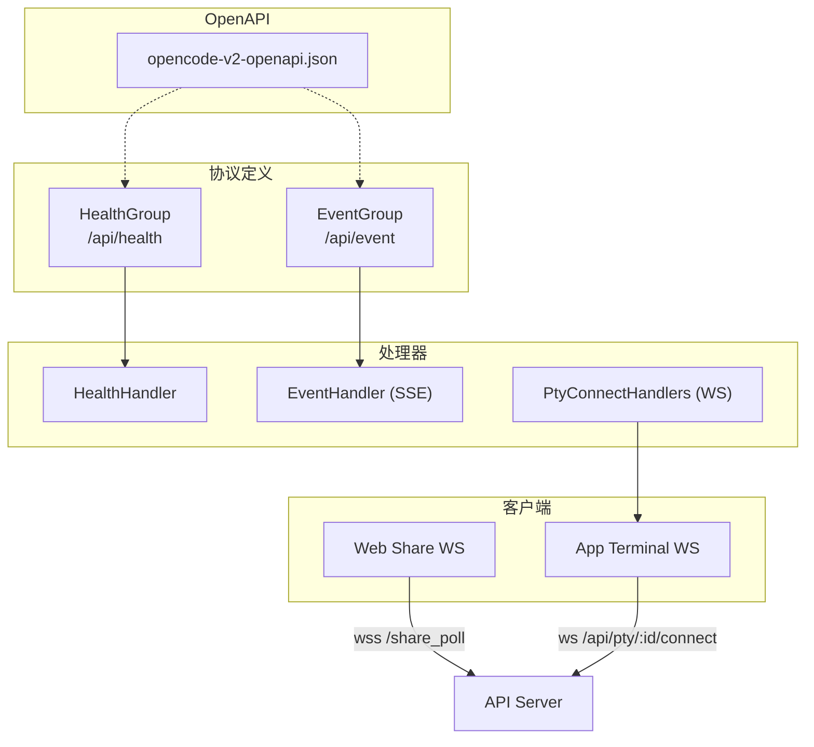
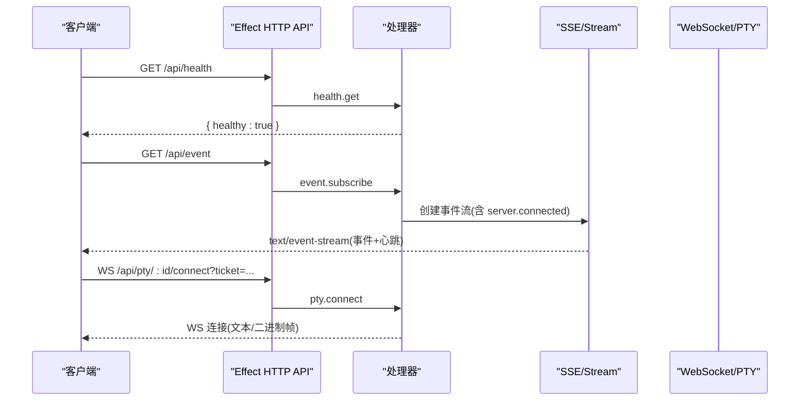
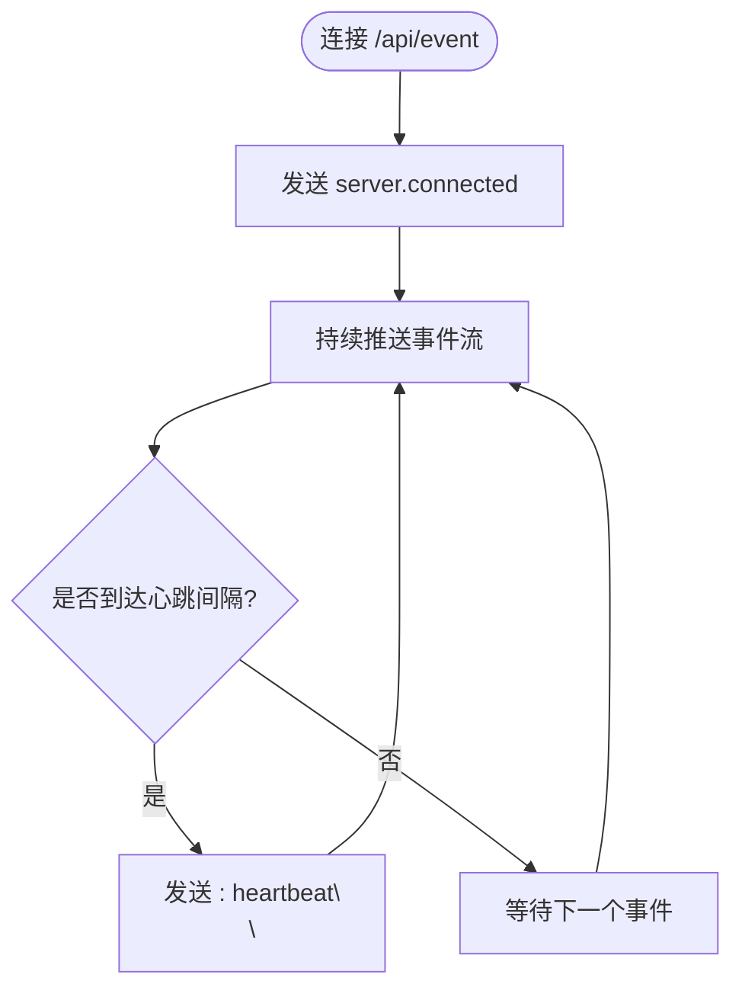
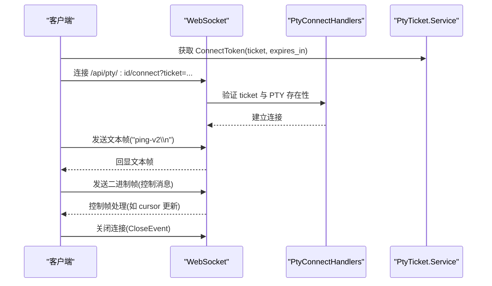
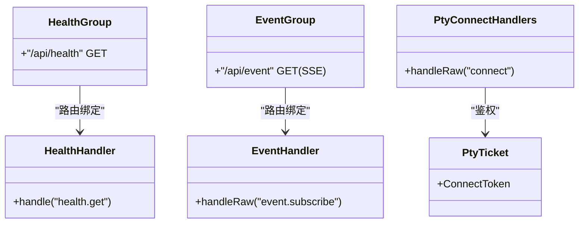

# API 接口文档

<cite>
**本文引用的文件**   
- [packages/protocol/src/groups/health.ts](file://packages/protocol/src/groups/health.ts)
- [packages/server/src/handlers/health.ts](file://packages/server/src/handlers/health.ts)
- [packages/protocol/src/groups/event.ts](file://packages/protocol/src/groups/event.ts)
- [packages/server/src/handlers/event.ts](file://packages/server/src/handlers/event.ts)
- [packages/schema/src/pty-ticket.ts](file://packages/schema/src/pty-ticket.ts)
- [packages/opencode/src/server/routes/instance/httpapi/handlers/pty.ts](file://packages/opencode/src/server/routes/instance/httpapi/handlers/pty.ts)
- [packages/app/src/components/terminal.tsx](file://packages/app/src/components/terminal.tsx)
- [packages/web/src/components/Share.tsx](file://packages/web/src/components/Share.tsx)
- [packages/codemode/test/fixtures/opencode-v2-openapi.json](file://packages/codemode/test/fixtures/opencode-v2-openapi.json)
- [packages/sdks/js/src/v2/gen/core/auth.gen.ts](file://packages/sdks/js/src/v2/gen/core/auth.gen.ts)
- [packages/console/app/src/routes/zen/util/keyRateLimiter.ts](file://packages/console/app/src/routes/zen/util/keyRateLimiter.ts)
- [packages/console/app/src/routes/zen/util/ipRateLimiter.ts](file://packages/console/app/src/routes/zen/util/ipRateLimiter.ts)
- [packages/console/app/src/routes/zen/util/redis.ts](file://packages/console/app/src/routes/zen/util/redis.ts)
</cite>

## 目录
1. [简介](#简介)
2. [项目结构](#项目结构)
3. [核心组件](#核心组件)
4. [架构总览](#架构总览)
5. [详细组件分析](#详细组件分析)
6. [依赖关系分析](#依赖关系分析)
7. [性能考虑](#性能考虑)
8. [故障排查指南](#故障排查指南)
9. [结论](#结论)
10. [附录](#附录)

## 简介
本文件为 openNovel（基于 Effect HTTP API、SSE、WebSocket、PTY 等能力）的完整 API 接口文档。内容覆盖：
- RESTful API 端点：HTTP 方法、URL 模式、请求/响应格式、认证方式与错误码
- SSE 事件流：订阅协议、心跳、事件结构与连接管理
- WebSocket 实时通信：连接建立、消息帧格式、二进制处理、状态管理与重连策略
- Socket API：连接协议、数据帧、二进制格式与状态机
- IPC/Pipe 通信：进程间数据流、消息传递与同步机制
- 安全与速率限制：鉴权方案、限流策略与版本信息
- 常见用例、客户端实现指南与性能优化建议

## 项目结构
openNovel 将 API 定义、处理器与 OpenAPI 规范分层组织：
- 协议定义层：使用 Effect HttpApiGroup 声明路由、参数与响应 Schema
- 处理器层：将路由映射到具体业务逻辑，返回 Effect 或 Stream
- OpenAPI 生成：测试夹具提供 v2 OpenAPI JSON，便于客户端代码生成与校验
- 客户端集成：前端通过 SSE/WebSocket 与后端交互，终端通过 PTY WebSocket 进行二进制 I/O

图表来源 
- [packages/protocol/src/groups/health.ts:1-15](file://packages/protocol/src/groups/health.ts#L1-L15)
- [packages/protocol/src/groups/event.ts:1-57](file://packages/protocol/src/groups/event.ts#L1-L57)
- [packages/server/src/handlers/health.ts:1-7](file://packages/server/src/handlers/health.ts#L1-L7)
- [packages/server/src/handlers/event.ts:20-52](file://packages/server/src/handlers/event.ts#L20-L52)
- [packages/opencode/src/server/routes/instance/httpapi/handlers/pty.ts:163-191](file://packages/opencode/src/server/routes/instance/httpapi/handlers/pty.ts#L163-L191)
- [packages/codemode/test/fixtures/opencode-v2-openapi.json:1-48](file://packages/codemode/test/fixtures/opencode-v2-openapi.json#L1-L48)

章节来源
- [packages/protocol/src/groups/health.ts:1-15](file://packages/protocol/src/groups/health.ts#L1-L15)
- [packages/protocol/src/groups/event.ts:1-57](file://packages/protocol/src/groups/event.ts#L1-L57)
- [packages/server/src/handlers/health.ts:1-7](file://packages/server/src/handlers/health.ts#L1-L7)
- [packages/server/src/handlers/event.ts:20-52](file://packages/server/src/handlers/event.ts#L20-L52)
- [packages/codemode/test/fixtures/opencode-v2-openapi.json:1-48](file://packages/codemode/test/fixtures/opencode-v2-openapi.json#L1-L48)

## 核心组件
- 健康检查接口：GET /api/health，返回固定成功体，用于就绪探测
- 事件订阅接口：GET /api/event，SSE 流式推送事件，包含 server.connected 初始事件与后续事件
- PTY 连接接口：WS /api/pty/:id/connect，带 ticket 认证，支持文本与二进制帧
- 分享通道：WS /share_poll?id=...，用于共享场景的实时双向通信
- 认证与鉴权：Bearer/Basic 等方案，SDK 自动生成鉴权注入逻辑
- 速率限制：按 Key/IP 维度限流，Redis 计数与过期控制

章节来源
- [packages/protocol/src/groups/health.ts:1-15](file://packages/protocol/src/groups/health.ts#L1-L15)
- [packages/server/src/handlers/health.ts:1-7](file://packages/server/src/handlers/health.ts#L1-L7)
- [packages/protocol/src/groups/event.ts:1-57](file://packages/protocol/src/groups/event.ts#L1-L57)
- [packages/server/src/handlers/event.ts:20-52](file://packages/server/src/handlers/event.ts#L20-L52)
- [packages/opencode/src/server/routes/instance/httpapi/handlers/pty.ts:163-191](file://packages/opencode/src/server/routes/instance/httpapi/handlers/pty.ts#L163-L191)
- [packages/web/src/components/Share.tsx:81-116](file://packages/web/src/components/Share.tsx#L81-L116)
- [packages/sdks/js/src/v2/gen/core/auth.gen.ts:1-41](file://packages/sdks/js/src/v2/gen/core/auth.gen.ts#L1-L41)
- [packages/console/app/src/routes/zen/util/keyRateLimiter.ts:1-37](file://packages/console/app/src/routes/zen/util/keyRateLimiter.ts#L1-L37)
- [packages/console/app/src/routes/zen/util/ipRateLimiter.ts:1-28](file://packages/console/app/src/routes/zen/util/ipRateLimiter.ts#L1-L28)
- [packages/console/app/src/routes/zen/util/redis.ts:1-18](file://packages/console/app/src/routes/zen/util/redis.ts#L1-L18)

## 架构总览
下图展示从客户端到服务端的核心调用链：REST/SSE/WS 统一由 Effect HTTP API 暴露，处理器负责业务编排，SSE 使用 Stream 合并事件与心跳，PTY 通过 WS 传输二进制与文本帧。

图表来源 
- [packages/server/src/handlers/health.ts:1-7](file://packages/server/src/handlers/health.ts#L1-L7)
- [packages/server/src/handlers/event.ts:20-52](file://packages/server/src/handlers/event.ts#L20-L52)
- [packages/opencode/src/server/routes/instance/httpapi/handlers/pty.ts:163-191](file://packages/opencode/src/server/routes/instance/httpapi/handlers/pty.ts#L163-L191)

## 详细组件分析

### RESTful API：健康检查
- 方法：GET
- URL：/api/health
- 请求头：无特殊要求
- 响应体：{ healthy: true }
- 错误码：400/401/500（参考 OpenAPI 规范）
- 用途：服务就绪探测与健康监控

章节来源
- [packages/protocol/src/groups/health.ts:1-15](file://packages/protocol/src/groups/health.ts#L1-L15)
- [packages/server/src/handlers/health.ts:1-7](file://packages/server/src/handlers/health.ts#L1-L7)
- [packages/codemode/test/fixtures/opencode-v2-openapi.json:1-48](file://packages/codemode/test/fixtures/opencode-v2-openapi.json#L1-L48)

### RESTful API：事件订阅（SSE）
- 方法：GET
- URL：/api/event
- 响应类型：text/event-stream
- 事件结构：
  - 首条事件：server.connected（空 data）
  - 后续事件：遵循 V2Event 联合类型，包含 id、metadata、durable、location、type、data
- 心跳：每 15 秒发送一次 ": heartbeat\n\n"
- 头部：Cache-Control=no-cache, no-transform；X-Accel-Buffering=no；X-Content-Type-Options=nosniff

图表来源 
- [packages/protocol/src/groups/event.ts:1-57](file://packages/protocol/src/groups/event.ts#L1-L57)
- [packages/server/src/handlers/event.ts:20-52](file://packages/server/src/handlers/event.ts#L20-L52)

章节来源
- [packages/protocol/src/groups/event.ts:1-57](file://packages/protocol/src/groups/event.ts#L1-L57)
- [packages/server/src/handlers/event.ts:20-52](file://packages/server/src/handlers/event.ts#L20-L52)

### WebSocket：PTY 连接
- 方法：WS
- URL：/api/pty/:id/connect
- 查询参数：cursor=-1（可选）、location[directory]=...（可选）、ticket=...（必需）
- 认证：使用 ConnectToken（ticket + expires_in），在连接前获取并传入
- 消息格式：
  - 文本帧：直接透传至 PTY 标准输入/输出
  - 二进制帧：首字节为控制标记（例如 0x00），其后为 JSON 控制消息（如 cursor 更新）
- 状态管理：连接成功后可发送 ping 等命令，关闭时返回 CloseEvent

图表来源 
- [packages/schema/src/pty-ticket.ts:1-11](file://packages/schema/src/pty-ticket.ts#L1-L11)
- [packages/opencode/src/server/routes/instance/httpapi/handlers/pty.ts:163-191](file://packages/opencode/src/server/routes/instance/httpapi/handlers/pty.ts#L163-L191)
- [packages/app/src/components/terminal.tsx:566-629](file://packages/app/src/components/terminal.tsx#L566-L629)

章节来源
- [packages/schema/src/pty-ticket.ts:1-11](file://packages/schema/src/pty-ticket.ts#L1-L11)
- [packages/opencode/src/server/routes/instance/httpapi/handlers/pty.ts:163-191](file://packages/opencode/src/server/routes/instance/httpapi/handlers/pty.ts#L163-L191)
- [packages/app/src/components/terminal.tsx:566-629](file://packages/app/src/components/terminal.tsx#L566-L629)

### WebSocket：分享通道（Share）
- 方法：WS
- URL：/share_poll?id=...
- 协议：wss（强制安全协议）
- 行为：自动重连、连接状态管理、错误提示
- 适用场景：多人共享编辑/协作

章节来源
- [packages/web/src/components/Share.tsx:81-116](file://packages/web/src/components/Share.tsx#L81-L116)

### 认证与鉴权
- 支持方案：apiKey、http（bearer/basic）
- 注入位置：header/query/cookie，默认 header Authorization
- SDK 自动生成鉴权注入逻辑，透明附加令牌

章节来源
- [packages/sdks/js/src/v2/gen/core/auth.gen.ts:1-41](file://packages/sdks/js/src/v2/gen/core/auth.gen.ts#L1-L41)

### 速率限制
- Key 限流：按模型 ID 与时间窗口统计，超出则返回 RateLimitError
- IP 限流：按 IP 与日粒度统计，结合订阅额度与重试策略
- 存储：Upstash Redis，键命名包含阶段、维度与区间

章节来源
- [packages/console/app/src/routes/zen/util/keyRateLimiter.ts:1-37](file://packages/console/app/src/routes/zen/util/keyRateLimiter.ts#L1-L37)
- [packages/console/app/src/routes/zen/util/ipRateLimiter.ts:1-28](file://packages/console/app/src/routes/zen/util/ipRateLimiter.ts#L1-L28)
- [packages/console/app/src/routes/zen/util/redis.ts:1-18](file://packages/console/app/src/routes/zen/util/redis.ts#L1-L18)

## 依赖关系分析
- 协议组与处理器解耦：HttpApiGroup 仅描述路由与 Schema，处理器实现具体逻辑
- SSE 流式处理：EventHandler 使用 Stream 合并事件与心跳，确保低延迟推送
- PTY 连接依赖 PtyTicket 服务与 LocationServiceMap，保证权限与上下文
- OpenAPI 规范作为契约：客户端通过 opencode-v2-openapi.json 生成类型与请求封装

图表来源 
- [packages/protocol/src/groups/health.ts:1-15](file://packages/protocol/src/groups/health.ts#L1-L15)
- [packages/server/src/handlers/health.ts:1-7](file://packages/server/src/handlers/health.ts#L1-L7)
- [packages/protocol/src/groups/event.ts:1-57](file://packages/protocol/src/groups/event.ts#L1-L57)
- [packages/server/src/handlers/event.ts:20-52](file://packages/server/src/handlers/event.ts#L20-L52)
- [packages/opencode/src/server/routes/instance/httpapi/handlers/pty.ts:163-191](file://packages/opencode/src/server/routes/instance/httpapi/handlers/pty.ts#L163-L191)
- [packages/schema/src/pty-ticket.ts:1-11](file://packages/schema/src/pty-ticket.ts#L1-L11)

章节来源
- [packages/protocol/src/groups/health.ts:1-15](file://packages/protocol/src/groups/health.ts#L1-L15)
- [packages/protocol/src/groups/event.ts:1-57](file://packages/protocol/src/groups/event.ts#L1-L57)
- [packages/server/src/handlers/health.ts:1-7](file://packages/server/src/handlers/health.ts#L1-L7)
- [packages/server/src/handlers/event.ts:20-52](file://packages/server/src/handlers/event.ts#L20-L52)
- [packages/opencode/src/server/routes/instance/httpapi/handlers/pty.ts:163-191](file://packages/opencode/src/server/routes/instance/httpapi/handlers/pty.ts#L163-L191)
- [packages/schema/src/pty-ticket.ts:1-11](file://packages/schema/src/pty-ticket.ts#L1-L11)

## 性能考虑
- SSE 心跳间隔 15 秒，避免频繁网络开销
- 使用 Stream 合并事件与心跳，减少序列化与缓冲压力
- PTY 二进制帧采用首字节控制标记，降低解析复杂度
- 限流基于 Redis 原子操作，键过期策略减少内存占用
- 客户端侧实现指数退避重连与断线检测，提升稳定性

[本节为通用指导，不直接分析具体文件]

## 故障排查指南
- 健康检查失败：确认服务启动与端口监听，检查反向代理配置
- SSE 连接中断：检查浏览器/代理对 text/event-stream 的支持，确认缓存与缓冲头设置
- PTY 连接失败：校验 ticket 有效性、过期时间与 PTY 实例是否存在
- 二进制帧异常：确认首字节控制标记与 JSON 控制消息格式
- 限流触发：检查 Key/IP 维度计数与 Redis 连通性，调整限额或清理过期键

章节来源
- [packages/server/src/handlers/event.ts:20-52](file://packages/server/src/handlers/event.ts#L20-L52)
- [packages/opencode/src/server/routes/instance/httpapi/handlers/pty.ts:163-191](file://packages/opencode/src/server/routes/instance/httpapi/handlers/pty.ts#L163-L191)
- [packages/console/app/src/routes/zen/util/keyRateLimiter.ts:1-37](file://packages/console/app/src/routes/zen/util/keyRateLimiter.ts#L1-L37)
- [packages/console/app/src/routes/zen/util/ipRateLimiter.ts:1-28](file://packages/console/app/src/routes/zen/util/ipRateLimiter.ts#L1-L28)
- [packages/console/app/src/routes/zen/util/redis.ts:1-18](file://packages/console/app/src/routes/zen/util/redis.ts#L1-L18)

## 结论
openNovel 通过 Effect HTTP API 统一暴露 REST/SSE/WS 接口，配合 OpenAPI 规范与 SDK 生成，形成高内聚、低耦合的 API 体系。SSE 提供高效的事件推送，PTY WebSocket 支持高性能二进制 I/O，限流与鉴权保障系统稳定与安全。建议客户端严格遵循协议约定，实现健壮的重连与错误处理，以获得最佳体验。

[本节为总结性内容，不直接分析具体文件]

## 附录

### 常见用例与客户端实现指南
- 健康检查：定时轮询 GET /api/health，用于服务可用性探测
- 事件订阅：建立 SSE 连接，处理 server.connected 与后续事件，维护本地状态
- PTY 交互：先获取 ConnectToken，再建立 WS 连接，发送文本/二进制帧，处理控制消息
- 分享协作：使用 wss 连接 /share_poll，实现自动重连与状态同步

章节来源
- [packages/codemode/test/fixtures/opencode-v2-openapi.json:1-48](file://packages/codemode/test/fixtures/opencode-v2-openapi.json#L1-L48)
- [packages/web/src/components/Share.tsx:81-116](file://packages/web/src/components/Share.tsx#L81-L116)
- [packages/app/src/components/terminal.tsx:566-629](file://packages/app/src/components/terminal.tsx#L566-L629)

### 版本信息与兼容性
- OpenAPI 版本：3.1.0
- 协议标识：v2（如 operationId 前缀 v2.*）
- 事件类型：V2Event 联合类型，包含 server.connected 等

章节来源
- [packages/codemode/test/fixtures/opencode-v2-openapi.json:1-48](file://packages/codemode/test/fixtures/opencode-v2-openapi.json#L1-L48)
- [packages/protocol/src/groups/event.ts:1-57](file://packages/protocol/src/groups/event.ts#L1-L57)