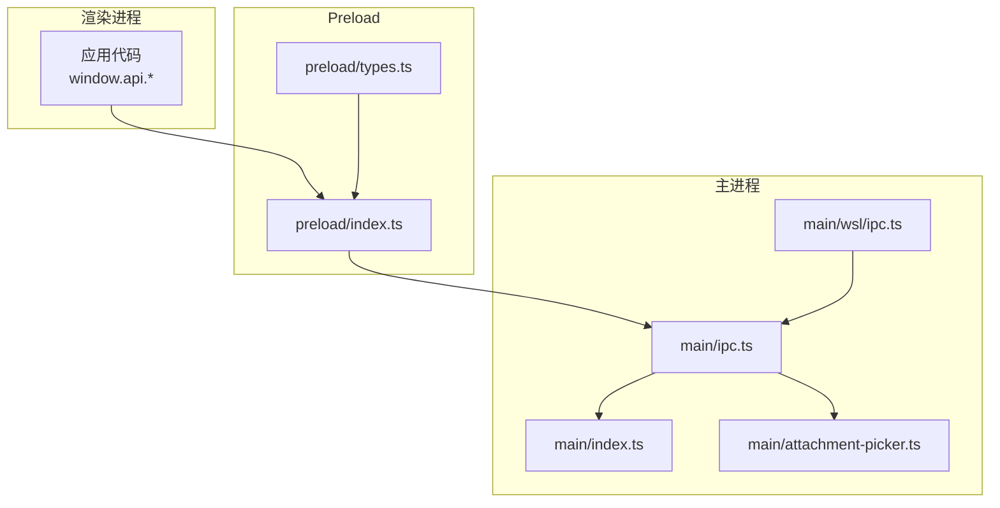
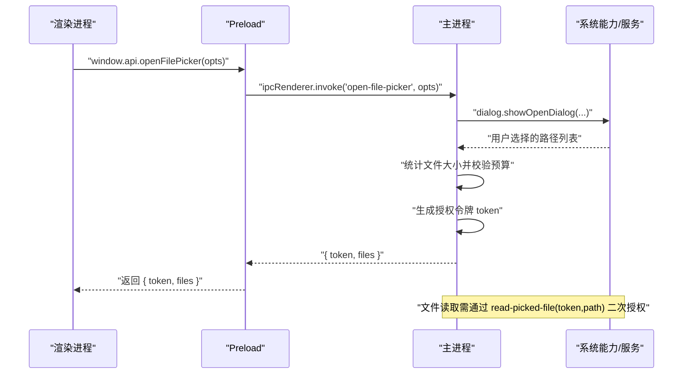
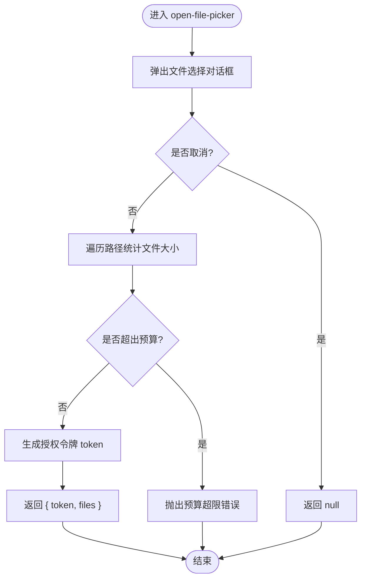
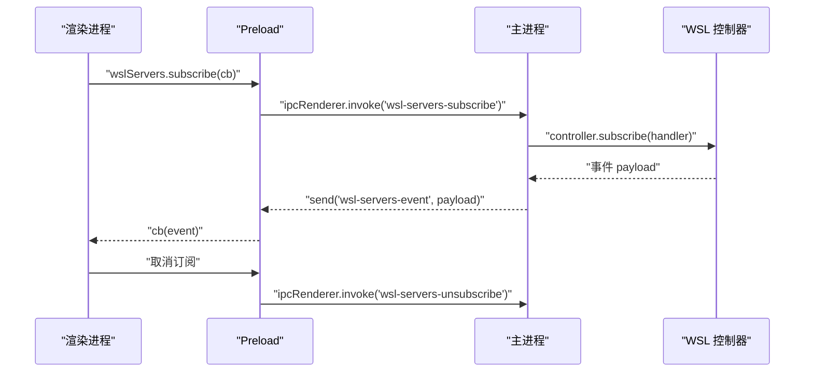
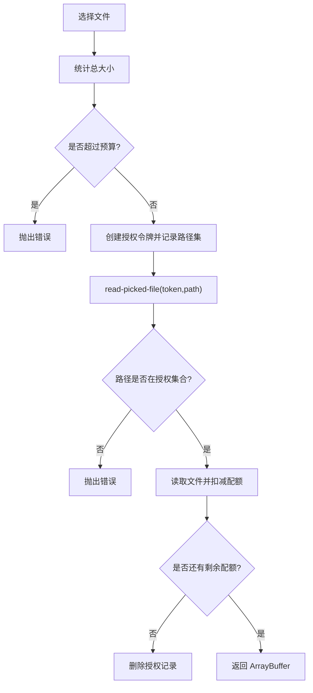
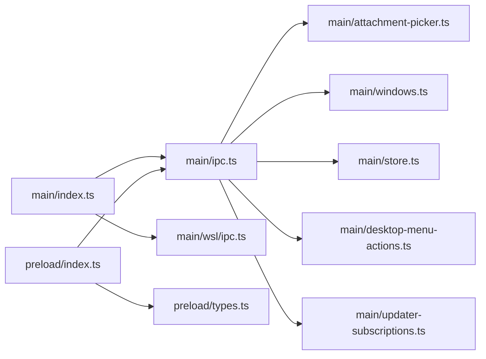

# IPC 通信

<cite>
**本文引用的文件**   
- [packages/desktop/src/main/index.ts](file://packages/desktop/src/main/index.ts)
- [packages/desktop/src/main/ipc.ts](file://packages/desktop/src/main/ipc.ts)
- [packages/desktop/src/preload/index.ts](file://packages/desktop/src/preload/index.ts)
- [packages/desktop/src/preload/types.ts](file://packages/desktop/src/preload/types.ts)
- [packages/desktop/src/main/attachment-picker.ts](file://packages/desktop/src/main/attachment-picker.ts)
- [packages/desktop/src/main/wsl/ipc.ts](file://packages/desktop/src/main/wsl/ipc.ts)
</cite>

## 目录
1. [简介](#简介)
2. [项目结构](#项目结构)
3. [核心组件](#核心组件)
4. [架构总览](#架构总览)
5. [详细组件分析](#详细组件分析)
6. [依赖关系分析](#依赖关系分析)
7. [性能考虑](#性能考虑)
8. [故障排查指南](#故障排查指南)
9. [结论](#结论)
10. [附录：IPC 通道清单与调用示例](#附录ipc-通道清单与调用示例)

## 简介
本文件为 openNovel 的 Electron IPC（进程间通信）API 文档，聚焦主进程与渲染进程之间的通信机制。内容涵盖：
- IPC 通道注册、消息路由与数据处理
- 跨进程数据序列化、异步消息传递与同步调用模式
- 文件访问权限、安全沙箱与权限控制
- IPC 调用示例、错误处理与超时管理
- 性能优化建议与调试技巧

## 项目结构
openNovel 的 IPC 实现位于 desktop 包中，采用“主进程处理器 + preload 桥接 + 渲染进程类型定义”的分层设计：
- 主进程入口负责初始化并注册所有 IPC 处理器
- ipc.ts 集中注册 handle/on 处理器，封装系统能力（对话框、剪贴板、窗口、存储等）
- preload/index.ts 通过 contextBridge 暴露安全的 API 给渲染进程
- types.ts 定义 ElectronAPI 及事件数据结构，保证端到端类型一致
- wsl/ipc.ts 提供 WSL 相关能力的平台化适配与权限校验



**图表来源** 
- [packages/desktop/src/main/index.ts:273-302](file://packages/desktop/src/main/index.ts#L273-L302)
- [packages/desktop/src/main/ipc.ts:46-266](file://packages/desktop/src/main/ipc.ts#L46-L266)
- [packages/desktop/src/preload/index.ts:13-126](file://packages/desktop/src/preload/index.ts#L13-L126)
- [packages/desktop/src/preload/types.ts:44-109](file://packages/desktop/src/preload/types.ts#L44-L109)
- [packages/desktop/src/main/attachment-picker.ts:6-31](file://packages/desktop/src/main/attachment-picker.ts#L6-L31)
- [packages/desktop/src/main/wsl/ipc.ts:7-67](file://packages/desktop/src/main/wsl/ipc.ts#L7-L67)

**章节来源**
- [packages/desktop/src/main/index.ts:273-302](file://packages/desktop/src/main/index.ts#L273-L302)
- [packages/desktop/src/main/ipc.ts:46-266](file://packages/desktop/src/main/ipc.ts#L46-L266)
- [packages/desktop/src/preload/index.ts:13-126](file://packages/desktop/src/preload/index.ts#L13-L126)
- [packages/desktop/src/preload/types.ts:44-109](file://packages/desktop/src/preload/types.ts#L44-L109)

## 核心组件
- 主进程入口（index.ts）
  - 启动时注册 IPC 处理器集合，注入依赖（如 sidecar 生命周期、更新器、窗口管理等）
  - 统一处理 Deep Link、自动更新、日志导出、崩溃上报等全局行为
- IPC 处理器（ipc.ts）
  - 使用 ipcMain.handle 暴露异步 RPC 接口，使用 ipcMain.on 接收单向事件
  - 封装系统能力：文件选择、保存、路径打开/展示、剪贴板图片、窗口状态、缩放、标题栏主题、菜单动作、通知等
  - 内置 store 键值存储（按 name 隔离），支持 get/set/delete/clear/keys/length
  - 附件读取授权令牌机制，限制单次选择的总大小与逐次读取配额
- Preload 桥接（preload/index.ts）
  - 将主进程能力以 window.api.* 暴露给渲染进程
  - 对订阅类能力（updater、wsl-servers、deep-link、menu-command、zoom/pinch-zoom 变更）进行订阅/取消订阅封装
- 类型定义（preload/types.ts）
  - 定义 ElectronAPI 方法签名与事件结构，确保前后端契约一致
- WSL IPC（wsl/ipc.ts）
  - 在 Windows 上启用 WSL 服务器管理能力；非 Windows 返回不可用状态或抛出明确错误
  - 参数校验使用 requireWslIpcString/Strings，防止非法输入

**章节来源**
- [packages/desktop/src/main/index.ts:273-302](file://packages/desktop/src/main/index.ts#L273-L302)
- [packages/desktop/src/main/ipc.ts:46-266](file://packages/desktop/src/main/ipc.ts#L46-L266)
- [packages/desktop/src/preload/index.ts:13-126](file://packages/desktop/src/preload/index.ts#L13-L126)
- [packages/desktop/src/preload/types.ts:44-109](file://packages/desktop/src/preload/types.ts#L44-L109)
- [packages/desktop/src/main/wsl/ipc.ts:7-67](file://packages/desktop/src/main/wsl/ipc.ts#L7-L67)

## 架构总览
Electron IPC 采用“invoke/handle 异步 RPC + on/send 事件广播”的双通道模型。渲染进程通过 window.api 调用，preload 转发到 ipcRenderer.invoke/on，主进程由 ipcMain.handle/on 处理并返回结果或推送事件。



**图表来源** 
- [packages/desktop/src/preload/index.ts:91-94](file://packages/desktop/src/preload/index.ts#L91-L94)
- [packages/desktop/src/main/ipc.ts:134-166](file://packages/desktop/src/main/ipc.ts#L134-L166)
- [packages/desktop/src/main/attachment-picker.ts:6-31](file://packages/desktop/src/main/attachment-picker.ts#L6-L31)

## 详细组件分析

### 主进程 IPC 处理器（ipc.ts）
- 职责
  - 集中注册所有 ipcMain.handle/on 处理器
  - 封装系统 API（对话框、剪贴板、shell、BrowserWindow、store、菜单动作等）
  - 维护订阅关系（updater、wsl-servers）并在窗口销毁时清理
- 关键流程
  - 文件选择：open-file-picker 返回 token 与元信息；read-picked-file 基于 token+sender 校验后读取；release-picked-files 释放授权
  - Store 操作：按 name 隔离命名空间，get 返回字符串或 JSON 字符串，delete/clear 触发空文件清理
  - 窗口与缩放：获取/设置缩放因子、捏合缩放开关、标题栏主题、焦点与显示
  - 事件推送：menu-command、deep-link、pinch-zoom-enabled-changed、zoom-factor-changed、updater-state、wsl-servers-event
- 错误处理
  - 未找到窗口时抛出错误
  - 附件预算超限抛出错误
  - 非 Windows 平台 WSL 能力返回不可用状态或抛出错误



**图表来源** 
- [packages/desktop/src/main/ipc.ts:134-158](file://packages/desktop/src/main/ipc.ts#L134-L158)
- [packages/desktop/src/main/attachment-picker.ts:33-37](file://packages/desktop/src/main/attachment-picker.ts#L33-L37)

**章节来源**
- [packages/desktop/src/main/ipc.ts:46-266](file://packages/desktop/src/main/ipc.ts#L46-L266)
- [packages/desktop/src/main/attachment-picker.ts:6-31](file://packages/desktop/src/main/attachment-picker.ts#L6-L31)

### Preload 桥接（preload/index.ts）
- 职责
  - 将主进程能力以 window.api.* 暴露给渲染进程
  - 对订阅型能力进行生命周期管理（订阅/取消订阅、回调去重、监听移除）
- 关键点
  - updater.subscribe：首次订阅建立监听并等待初始化完成，取消订阅时清理监听与订阅
  - wslServers.subscribe：事件驱动的状态推送，取消时移除监听并调用 unsubscribe
  - 事件监听：onMenuCommand、onDeepLink、onPinchZoomEnabledChanged、onZoomFactorChanged

```mermaid
classDiagram
class ElectronAPI {
+killSidecar() Promise~void~
+awaitInitialization() Promise~ServerReadyData~
+wslServers : WslServersAPI
+updater : UpdaterAPI
+consumeInitialDeepLinks() Promise~string[]~
+openFilePicker(opts) Promise~{token,files}|null~
+readPickedFile(token,path) Promise~ArrayBuffer~
+releasePickedFiles(token) Promise~void~
+onDeepLink(cb) ()=>void
+onMenuCommand(cb) ()=>void
+setZoomFactor(factor) Promise~void~
+setTitlebar(theme) Promise~void~
+exportDebugLogs() Promise~string~
}
class UpdaterAPI {
+subscribe(cb) Promise~()=>void~
+check() Promise~UpdaterState~
+install() Promise~void~
}
class WslServersAPI {
+getState() Promise~WslServersState~
+subscribe(cb) Promise~()=>void~
+probeRuntime() Promise~...~
+refreshDistros() Promise~...~
+addServer(distro) Promise~...~
+removeServer(id) Promise~...~
+startServer(id) Promise~...~
}
ElectronAPI --> UpdaterAPI : "包含"
ElectronAPI --> WslServersAPI : "包含"
```

**图表来源** 
- [packages/desktop/src/preload/types.ts:24-109](file://packages/desktop/src/preload/types.ts#L24-L109)
- [packages/desktop/src/preload/index.ts:13-126](file://packages/desktop/src/preload/index.ts#L13-L126)

**章节来源**
- [packages/desktop/src/preload/index.ts:13-126](file://packages/desktop/src/preload/index.ts#L13-L126)
- [packages/desktop/src/preload/types.ts:44-109](file://packages/desktop/src/preload/types.ts#L44-L109)

### WSL IPC（wsl/ipc.ts）
- 职责
  - 在 Windows 上注册 WSL 服务器管理的 IPC 处理器
  - 在非 Windows 上返回不可用状态或抛出错误，避免误用
- 安全策略
  - 使用 requireWslIpcString/Strings 对入参进行白名单校验，防止非法字符或越界输入
- 事件模型
  - 通过 wsl-servers-subscribe 建立事件推送，wsl-servers-event 推送状态变化，unsubscribe 清理



**图表来源** 
- [packages/desktop/src/main/wsl/ipc.ts:26-41](file://packages/desktop/src/main/wsl/ipc.ts#L26-L41)
- [packages/desktop/src/preload/index.ts:17-38](file://packages/desktop/src/preload/index.ts#L17-L38)

**章节来源**
- [packages/desktop/src/main/wsl/ipc.ts:7-67](file://packages/desktop/src/main/wsl/ipc.ts#L7-L67)
- [packages/desktop/src/preload/index.ts:17-38](file://packages/desktop/src/preload/index.ts#L17-L38)

### 文件访问权限与安全（attachment-picker.ts）
- 授权令牌机制
  - add(sender, paths) 生成 token，记录 sender 与允许读取的路径集合
  - read(sender, token, path) 校验 sender 与 path 是否在授权集合内，逐次扣减剩余配额
  - release(sender, token) 主动释放授权
- 预算控制
  - MAX_ATTACHMENT_BYTES 限制单次选择总大小
  - assertAttachmentBudget(files) 在打开选择后立即校验，超限直接拒绝
- 读取实现
  - 流式读取文件内容，避免一次性加载大文件导致内存峰值过高



**图表来源** 
- [packages/desktop/src/main/attachment-picker.ts:6-31](file://packages/desktop/src/main/attachment-picker.ts#L6-L31)
- [packages/desktop/src/main/attachment-picker.ts:33-37](file://packages/desktop/src/main/attachment-picker.ts#L33-L37)

**章节来源**
- [packages/desktop/src/main/attachment-picker.ts:6-37](file://packages/desktop/src/main/attachment-picker.ts#L6-L37)

## 依赖关系分析
- 主进程入口 index.ts 负责装配依赖并调用 registerIpcHandlers，注入 sidecar、更新器、窗口、日志等能力
- ipc.ts 依赖 attachment-picker、windows、store、desktop-menu-actions、updater-subscriptions 等模块
- preload/index.ts 依赖 electron 的 contextBridge 与 ipcRenderer，暴露 window.api
- wsl/ipc.ts 依赖 policy 校验与 WSL 控制器



**图表来源** 
- [packages/desktop/src/main/index.ts:273-302](file://packages/desktop/src/main/index.ts#L273-L302)
- [packages/desktop/src/main/ipc.ts:46-266](file://packages/desktop/src/main/ipc.ts#L46-L266)
- [packages/desktop/src/preload/index.ts:13-126](file://packages/desktop/src/preload/index.ts#L13-L126)
- [packages/desktop/src/main/wsl/ipc.ts:7-67](file://packages/desktop/src/main/wsl/ipc.ts#L7-L67)

**章节来源**
- [packages/desktop/src/main/index.ts:273-302](file://packages/desktop/src/main/index.ts#L273-L302)
- [packages/desktop/src/main/ipc.ts:46-266](file://packages/desktop/src/main/ipc.ts#L46-L266)
- [packages/desktop/src/preload/index.ts:13-126](file://packages/desktop/src/preload/index.ts#L13-L126)
- [packages/desktop/src/main/wsl/ipc.ts:7-67](file://packages/desktop/src/main/wsl/ipc.ts#L7-L67)

## 性能考虑
- 文件读取
  - 使用流式读取避免一次性加载大文件，降低内存峰值
  - 通过预算控制限制单次选择总大小，防止恶意或误操作导致资源耗尽
- 事件订阅
  - 订阅类能力（updater、wsl-servers）在窗口销毁时自动清理，避免内存泄漏
  - 重复订阅时去重，减少不必要的监听器
- 窗口与缩放
  - 设置缩放因子后更新标题栏，避免多次 UI 重绘
- 日志与网络
  - 启动 net log 失败不影响主流程，降级处理
  - sidecar 健康检查设置超时，避免阻塞启动

[本节为通用指导，不直接分析具体文件]

## 故障排查指南
- 常见错误
  - 文件未选择或路径不在授权集合：read-picked-file 抛出“文件未被选择器选择”的错误
  - 附件预算超限：open-file-picker 或 readAttachment 抛出预算超限错误
  - 窗口未找到：get-window-id 等方法在未找到窗口时抛出错误
  - WSL 不可用：非 Windows 平台调用 WSL 能力会抛出错误或返回不可用状态
- 定位手段
  - 使用 export-debug-logs 导出调试日志，结合 renderer 致命错误上报 recordFatalRendererError
  - 在主进程日志中查看 sidecar 启动与健康检查状态
  - 通过 onDeepLink、onMenuCommand 等事件监听确认消息是否到达渲染进程
- 恢复措施
  - 释放授权令牌 release-picked-files 清理残留授权
  - 重新订阅 updater/wsl-servers，确保监听器正确建立
  - 调整缩放因子或标题栏主题后刷新 UI

**章节来源**
- [packages/desktop/src/main/ipc.ts:160-166](file://packages/desktop/src/main/ipc.ts#L160-L166)
- [packages/desktop/src/main/ipc.ts:217-223](file://packages/desktop/src/main/ipc.ts#L217-L223)
- [packages/desktop/src/main/wsl/ipc.ts:69-103](file://packages/desktop/src/main/wsl/ipc.ts#L69-L103)
- [packages/desktop/src/preload/index.ts:40-58](file://packages/desktop/src/preload/index.ts#L40-L58)

## 结论
openNovel 的 IPC 体系以清晰的层次划分与严格的权限控制为核心，实现了安全、稳定且可扩展的主渲染通信。通过 invoke/handle 异步 RPC 与 on/send 事件模型，既满足高频交互需求，又保障资源与数据安全。建议在业务扩展中遵循现有模式，保持参数校验、订阅清理与错误处理的完整性。

[本节为总结性内容，不直接分析具体文件]

## 附录：IPC 通道清单与调用示例

- 通道分类
  - 异步 RPC（ipcMain.handle / ipcRenderer.invoke）
    - kill-sidecar、await-initialization、consume-initial-deep-links
    - get-default-server-url、set-default-server-url
    - is-first-launch-onboarding-pending、finish-first-launch-onboarding
    - is-old-layout-eligible、get-display-backend、set-display-backend
    - parse-markdown、check-app-exists、resolve-app-path
    - updater-subscribe、updater-unsubscribe、updater-check、updater-install
    - set-background-color、export-debug-logs、set-force-focus、record-fatal-renderer-error
    - store-get、store-set、store-delete、store-clear、store-keys、store-length
    - open-directory-picker、open-file-picker、read-picked-file、release-picked-files、save-file-picker
    - open-path、reveal-path、read-clipboard-image
    - get-window-count、get-window-id、get-window-focused、set-window-focus、show-window
    - relaunch（事件）、get-zoom-factor、set-zoom-factor、get-pinch-zoom-enabled、set-pinch-zoom-enabled
    - set-titlebar、run-desktop-menu-action
    - wsl-servers-*（见下节）
  - 事件（ipcMain.on / ipcRenderer.send 与 on）
    - open-link（渲染→主进程）
    - show-notification（渲染→主进程）
    - menu-command（主进程→渲染进程）
    - deep-link（主进程→渲染进程）
    - pinch-zoom-enabled-changed、zoom-factor-changed（主进程→渲染进程）
    - updater-state、wsl-servers-event（主进程→渲染进程）

- 调用示例（概念说明）
  - 打开文件选择器并读取内容
    - 渲染进程调用 openFilePicker(opts)，获得 { token, files }
    - 使用 readPickedFile(token, filePath) 读取二进制内容
    - 完成后调用 releasePickedFiles(token) 释放授权
  - 订阅更新状态
    - 调用 updater.subscribe(cb) 建立监听，收到 updater-state 事件
    - 取消订阅时返回的函数会移除监听并调用 updater-unsubscribe
  - 窗口缩放
    - getZoomFactor 获取当前缩放，setZoomFactor 设置新缩放并触发 zoom-factor-changed 事件
  - 打开外部链接
    - openLink(url) 发送事件，主进程通过 shell.openExternal 打开浏览器

- 错误与超时
  - 文件预算超限、路径未授权、窗口未找到等场景会抛出错误
  - sidecar 健康检查设置超时，避免阻塞启动
  - 订阅类能力需在窗口销毁时清理，避免内存泄漏

**章节来源**
- [packages/desktop/src/main/ipc.ts:46-266](file://packages/desktop/src/main/ipc.ts#L46-L266)
- [packages/desktop/src/preload/index.ts:13-126](file://packages/desktop/src/preload/index.ts#L13-L126)
- [packages/desktop/src/main/wsl/ipc.ts:26-67](file://packages/desktop/src/main/wsl/ipc.ts#L26-L67)
- [packages/desktop/src/main/attachment-picker.ts:6-37](file://packages/desktop/src/main/attachment-picker.ts#L6-L37)