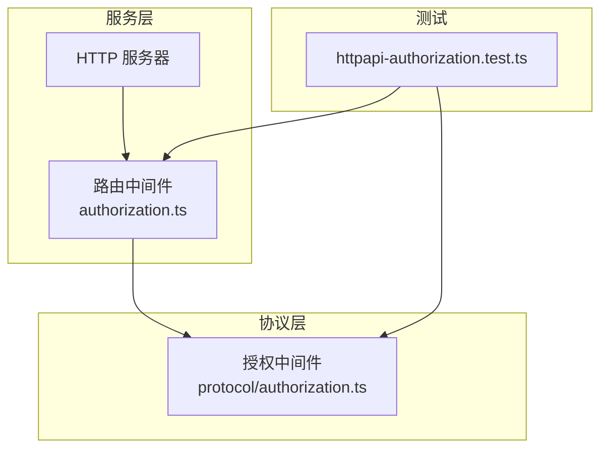
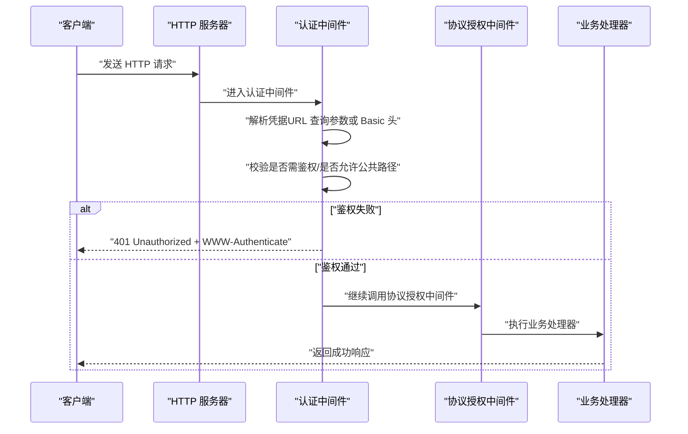
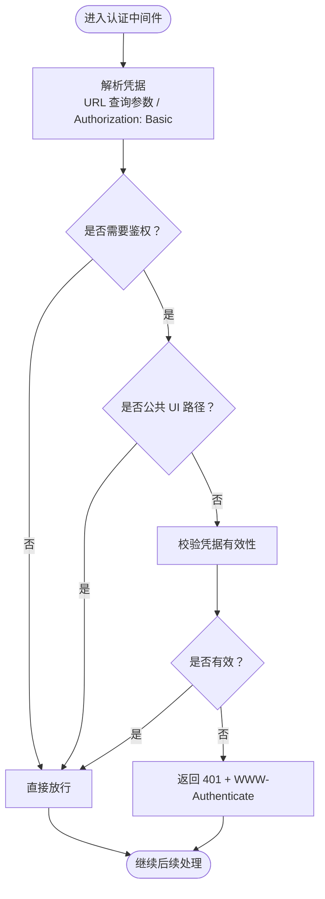
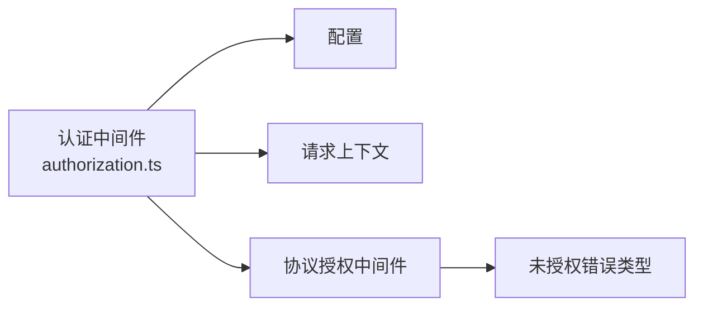

# REST API

<cite>
**本文引用的文件**
- [packages/opencode/src/server/routes/instance/httpapi/middleware/authorization.ts](file://packages/opencode/src/server/routes/instance/httpapi/middleware/authorization.ts)
- [packages/protocol/src/middleware/authorization.ts](file://packages/protocol/src/middleware/authorization.ts)
- [packages/opencode/test/server/httpapi-authorization.test.ts](file://packages/opencode/test/server/httpapi-authorization.test.ts)
</cite>

## 目录
1. [简介](#简介)
2. [项目结构](#项目结构)
3. [核心组件](#核心组件)
4. [架构总览](#架构总览)
5. [详细组件分析](#详细组件分析)
6. [依赖分析](#依赖分析)
7. [性能考虑](#性能考虑)
8. [故障排查指南](#故障排查指南)
9. [结论](#结论)
10. [附录](#附录)

## 简介
本文件为 openNovel 的 RESTful API 文档，聚焦于 HTTP 端点、认证与授权机制、错误处理策略以及客户端集成要点。由于当前仓库中未提供完整的端点定义与路由实现，本文基于已发现的认证中间件与测试用例，给出可落地的接口规范建议、状态码约定、错误码体系与迁移指引，帮助团队在后续扩展时保持一致性与可维护性。

## 项目结构
从现有代码可见，API 相关能力集中在以下位置：
- 服务端认证中间件：用于解析请求中的凭据并执行鉴权判断
- 协议层授权中间件：统一抛出未授权错误类型
- 测试用例：展示 API 分组、版本化路径与中间件挂载方式

图表来源
- [packages/opencode/src/server/routes/instance/httpapi/middleware/authorization.ts](file://packages/opencode/src/server/routes/instance/httpapi/middleware/authorization.ts)
- [packages/protocol/src/middleware/authorization.ts](file://packages/protocol/src/middleware/authorization.ts)
- [packages/opencode/test/server/httpapi-authorization.test.ts](file://packages/opencode/test/server/httpapi-authorization.test.ts)

章节来源
- [packages/opencode/src/server/routes/instance/httpapi/middleware/authorization.ts](file://packages/opencode/src/server/routes/instance/httpapi/middleware/authorization.ts)
- [packages/protocol/src/middleware/authorization.ts](file://packages/protocol/src/middleware/authorization.ts)
- [packages/opencode/test/server/httpapi-authorization.test.ts](file://packages/opencode/test/server/httpapi-authorization.test.ts)

## 核心组件
- 认证中间件（服务端）
  - 支持从 URL 查询参数或 Authorization: Basic 头中提取凭据
  - 根据配置决定是否强制鉴权，并对公共 UI 路径放行
  - 未通过鉴权时返回 401 及 WWW-Authenticate 响应头
- 授权中间件（协议层）
  - 以统一的未授权错误类型对外暴露，便于上层捕获与转换
- 测试用例
  - 演示了 API 分组与版本化路径（如 /api/probe），以及中间件的挂载方式

章节来源
- [packages/opencode/src/server/routes/instance/httpapi/middleware/authorization.ts](file://packages/opencode/src/server/routes/instance/httpapi/middleware/authorization.ts)
- [packages/protocol/src/middleware/authorization.ts](file://packages/protocol/src/middleware/authorization.ts)
- [packages/opencode/test/server/httpapi-authorization.test.ts](file://packages/opencode/test/server/httpapi-authorization.test.ts)

## 架构总览
下图展示了典型请求进入后的认证流程与错误返回路径。

图表来源
- [packages/opencode/src/server/routes/instance/httpapi/middleware/authorization.ts](file://packages/opencode/src/server/routes/instance/httpapi/middleware/authorization.ts)
- [packages/protocol/src/middleware/authorization.ts](file://packages/protocol/src/middleware/authorization.ts)

## 详细组件分析

### 认证中间件（服务端）
- 功能要点
  - 凭据来源：URL 查询参数与 Authorization: Basic
  - 鉴权开关：依据配置决定是否需要鉴权
  - 公共路径豁免：对特定 UI 路径直接放行
  - 失败响应：返回 401 并附带 WWW-Authenticate 头
- 设计建议
  - 将凭据解析与鉴权逻辑解耦，便于替换不同认证方案（如 Bearer Token、JWT）
  - 明确公共路径白名单，避免误放行敏感接口
  - 统一错误响应格式，便于前端统一处理

图表来源
- [packages/opencode/src/server/routes/instance/httpapi/middleware/authorization.ts](file://packages/opencode/src/server/routes/instance/httpapi/middleware/authorization.ts)

章节来源
- [packages/opencode/src/server/routes/instance/httpapi/middleware/authorization.ts](file://packages/opencode/src/server/routes/instance/httpapi/middleware/authorization.ts)

### 授权中间件（协议层）
- 功能要点
  - 统一抛出未授权错误类型，供上层拦截并转换为标准 HTTP 响应
- 设计建议
  - 保持错误类型单一且稳定，便于客户端按错误码分类处理
  - 与认证中间件协作，确保未认证与未授权场景语义清晰

章节来源
- [packages/protocol/src/middleware/authorization.ts](file://packages/protocol/src/middleware/authorization.ts)

### API 分组与版本化（示例）
- 示例说明
  - 使用分组与版本前缀组织接口，例如 test.v2 分组下的 /api/probe
- 设计建议
  - 所有对外接口统一以 /api/vX 开头，便于版本管理与灰度发布
  - 分组命名体现领域或模块，提升可读性与可维护性

章节来源
- [packages/opencode/test/server/httpapi-authorization.test.ts](file://packages/opencode/test/server/httpapi-authorization.test.ts)

## 依赖分析
- 组件耦合
  - 认证中间件依赖配置与请求上下文，负责凭据解析与鉴权决策
  - 协议授权中间件仅关注错误类型，降低与具体实现的耦合
- 外部依赖
  - 使用 Effect 生态进行副作用与错误处理
  - 使用 HTTP 框架提供的中间件机制

图表来源
- [packages/opencode/src/server/routes/instance/httpapi/middleware/authorization.ts](file://packages/opencode/src/server/routes/instance/httpapi/middleware/authorization.ts)
- [packages/protocol/src/middleware/authorization.ts](file://packages/protocol/src/middleware/authorization.ts)

章节来源
- [packages/opencode/src/server/routes/instance/httpapi/middleware/authorization.ts](file://packages/opencode/src/server/routes/instance/httpapi/middleware/authorization.ts)
- [packages/protocol/src/middleware/authorization.ts](file://packages/protocol/src/middleware/authorization.ts)

## 性能考虑
- 认证开销
  - 尽量缓存鉴权结果（如会话令牌校验），减少重复计算
  - 对高频接口启用快速失败路径，避免不必要的 I/O
- 响应体积
  - 错误响应体最小化，避免携带敏感信息
- 并发与限流
  - 结合网关或应用层限流，防止恶意请求放大认证成本

[本节为通用指导，不直接分析具体文件]

## 故障排查指南
- 常见问题
  - 401 未授权：检查请求是否携带正确凭据（URL 查询参数或 Authorization: Basic）
  - 公共路径被拦截：确认路径是否在白名单内
  - 未授权错误类型不一致：确保协议层与上层错误映射一致
- 定位步骤
  - 开启调试日志，记录凭据解析与鉴权决策过程
  - 使用测试用例验证中间件行为是否符合预期

章节来源
- [packages/opencode/src/server/routes/instance/httpapi/middleware/authorization.ts](file://packages/opencode/src/server/routes/instance/httpapi/middleware/authorization.ts)
- [packages/protocol/src/middleware/authorization.ts](file://packages/protocol/src/middleware/authorization.ts)
- [packages/opencode/test/server/httpapi-authorization.test.ts](file://packages/opencode/test/server/httpapi-authorization.test.ts)

## 结论
当前仓库提供了清晰的认证与授权中间件基础，建议在此基础上完善端点定义、版本化管理与错误体系，形成一致的 RESTful API 规范。通过统一的错误类型与中间件机制，可实现高内聚、低耦合的接口设计与稳定的客户端体验。

[本节为总结性内容，不直接分析具体文件]

## 附录

### RESTful 端点规范建议（待实现）
- URL 模式
  - 资源型路径：/api/v1/{resource}
  - 子资源：/api/v1/{parent}/{parentId}/child
- 方法约定
  - GET：读取资源列表或详情
  - POST：创建资源
  - PUT：全量更新资源
  - DELETE：删除资源
- 请求参数
  - 查询参数：过滤、分页、排序
  - 请求体：JSON 结构化数据，遵循 Schema 校验
- 响应格式
  - 成功：{ data, meta }
  - 错误：{ error: { code, message, details } }
- 状态码
  - 200：成功
  - 201：创建成功
  - 400：请求参数错误
  - 401：未认证
  - 403：无权限
  - 404：资源不存在
  - 500：服务器内部错误

[本节为概念性规范，不直接分析具体文件]

### 认证与授权最佳实践
- 认证方式
  - 优先使用 Bearer Token（JWT），兼容 Basic 作为过渡
  - 支持通过 URL 查询参数传递临时令牌（仅限安全环境）
- 权限控制
  - 基于角色的访问控制（RBAC）或基于资源的访问控制（ABAC）
  - 细粒度权限校验在处理器层完成
- 错误处理
  - 统一错误码与消息模板
  - 区分未认证（401）与未授权（403）

[本节为概念性指导，不直接分析具体文件]

### 客户端集成指南
- SDK 使用
  - 初始化时注入认证信息（Token 或 Basic 凭据）
  - 统一错误处理：捕获 401/403 并重试或引导重新登录
- 最佳实践
  - 重试策略：指数退避与最大重试次数
  - 超时与熔断：保护下游服务稳定性
  - 日志脱敏：避免泄露敏感信息

[本节为概念性指导，不直接分析具体文件]

### API 版本管理与迁移
- 版本策略
  - URL 前缀版本化：/api/v1、/api/v2
  - 向后兼容：新增字段不破坏旧客户端
- 迁移指南
  - 废弃字段标记与弃用通知
  - 双写期并行支持多版本，逐步下线旧版本

[本节为概念性指导，不直接分析具体文件]