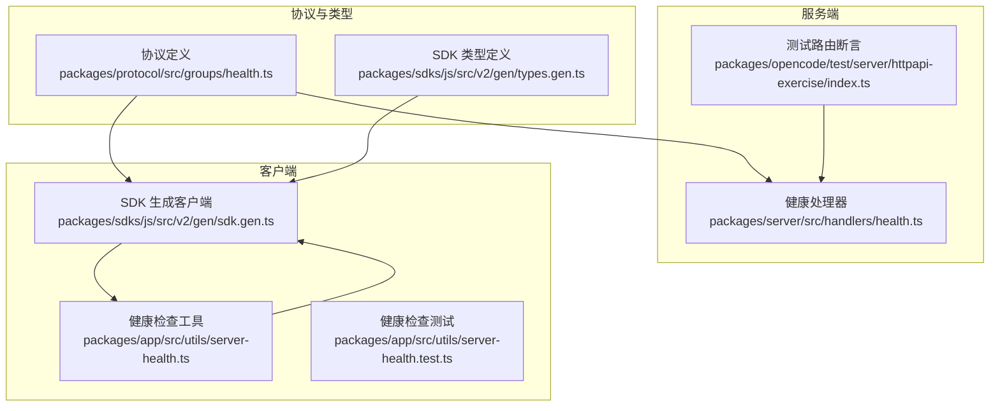
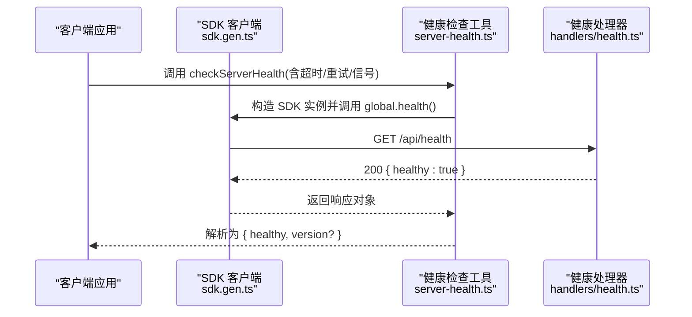
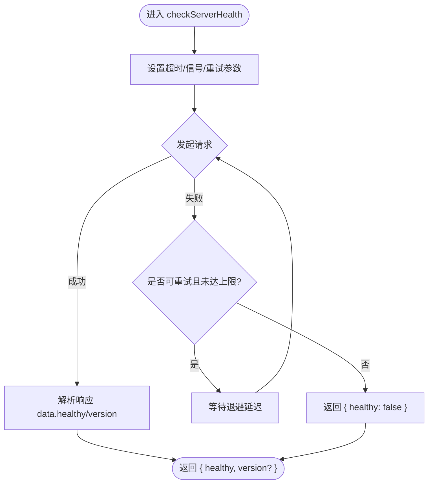

# 健康检查 API

<cite>
**本文引用的文件**
- [packages/protocol/src/groups/health.ts](file://packages/protocol/src/groups/health.ts)
- [packages/server/src/handlers/health.ts](file://packages/server/src/handlers/health.ts)
- [packages/app/src/utils/server-health.ts](file://packages/app/src/utils/server-health.ts)
- [packages/app/src/utils/server-health.test.ts](file://packages/app/src/utils/server-health.test.ts)
- [packages/sdks/js/src/v2/gen/sdk.gen.ts](file://packages/sdks/js/src/v2/gen/sdk.gen.ts)
- [packages/sdks/js/src/v2/gen/types.gen.ts](file://packages/sdks/js/src/v2/gen/types.gen.ts)
- [packages/opencode/test/server/httpapi-exercise/index.ts](file://packages/opencode/test/server/httpapi-exercise/index.ts)
- [packages/stats/app/src/routes/api/health.ts](file://packages/stats/app/src/routes/api/health.ts)
</cite>

## 目录
1. [简介](#简介)
2. [项目结构](#项目结构)
3. [核心组件](#核心组件)
4. [架构总览](#架构总览)
5. [详细组件分析](#详细组件分析)
6. [依赖关系分析](#依赖关系分析)
7. [性能考虑](#性能考虑)
8. [故障排查指南](#故障排查指南)
9. [结论](#结论)
10. [附录](#附录)

## 简介
本文件为 openNovel 的健康检查 API 提供完整、可操作的文档，聚焦于 /api/health 的 GET 方法。内容包括：
- 端点用途与适用场景（负载均衡探测、服务监控）
- 请求参数、响应格式与健康状态定义
- 状态码说明与错误处理约定
- 客户端集成示例与最佳实践（重试机制、超时配置）
- 调用时序图与数据流说明

## 项目结构
健康检查能力由协议定义、服务端处理器与客户端工具共同构成：
- 协议层：声明接口路径、方法与成功响应结构
- 服务端：实现健康检查逻辑并返回固定健康结果
- 客户端：封装健康检查调用，内置超时、重试与缓存策略



图表来源
- [packages/protocol/src/groups/health.ts:1-15](file://packages/protocol/src/groups/health.ts#L1-L15)
- [packages/server/src/handlers/health.ts:1-8](file://packages/server/src/handlers/health.ts#L1-L8)
- [packages/sdks/js/src/v2/gen/sdk.gen.ts:5170-5178](file://packages/sdks/js/src/v2/gen/sdk.gen.ts#L5170-L5178)
- [packages/sdks/js/src/v2/gen/types.gen.ts:7600-7621](file://packages/sdks/js/src/v2/gen/types.gen.ts#L7600-L7621)
- [packages/opencode/test/server/httpapi-exercise/index.ts:678-681](file://packages/opencode/test/server/httpapi-exercise/index.ts#L678-L681)

章节来源
- [packages/protocol/src/groups/health.ts:1-15](file://packages/protocol/src/groups/health.ts#L1-L15)
- [packages/server/src/handlers/health.ts:1-8](file://packages/server/src/handlers/health.ts#L1-L8)
- [packages/sdks/js/src/v2/gen/sdk.gen.ts:5170-5178](file://packages/sdks/js/src/v2/gen/sdk.gen.ts#L5170-L5178)
- [packages/sdks/js/src/v2/gen/types.gen.ts:7600-7621](file://packages/sdks/js/src/v2/gen/types.gen.ts#L7600-L7621)
- [packages/opencode/test/server/httpapi-exercise/index.ts:678-681](file://packages/opencode/test/server/httpapi-exercise/index.ts#L678-L681)

## 核心组件
- 协议定义：声明 GET /api/health 的成功响应结构，包含布尔字段 healthy=true
- 服务端处理器：直接返回 { healthy: true } 的 Effect 成功值
- SDK 客户端：暴露 health.get() 方法，发起 GET /api/health 请求
- 客户端工具：封装 checkServerHealth，支持超时、重试、AbortSignal 与缓存

章节来源
- [packages/protocol/src/groups/health.ts:4-14](file://packages/protocol/src/groups/health.ts#L4-L14)
- [packages/server/src/handlers/health.ts:5-7](file://packages/server/src/handlers/health.ts#L5-L7)
- [packages/sdks/js/src/v2/gen/sdk.gen.ts:5173-5178](file://packages/sdks/js/src/v2/gen/sdk.gen.ts#L5173-L5178)
- [packages/app/src/utils/server-health.ts:70-95](file://packages/app/src/utils/server-health.ts#L70-L95)

## 架构总览
健康检查从客户端到服务器的调用流程如下：



图表来源
- [packages/sdks/js/src/v2/gen/sdk.gen.ts:5173-5178](file://packages/sdks/js/src/v2/gen/sdk.gen.ts#L5173-L5178)
- [packages/server/src/handlers/health.ts:5-7](file://packages/server/src/handlers/health.ts#L5-L7)
- [packages/app/src/utils/server-health.ts:85-94](file://packages/app/src/utils/server-health.ts#L85-L94)

## 详细组件分析

### 端点规范：GET /api/health
- 方法：GET
- 路径：/api/health
- 标识符：v2.health.get
- 用途：检查 API 服务器是否已就绪并可接受请求
- 请求参数：无
- 成功响应体：{ healthy: true }
- 可选字段：version（在部分客户端侧会透传或扩展，见下节）
- 典型状态码：
  - 200：健康检查成功
  - 其他错误：遵循全局错误处理（如网络异常、超时等由客户端捕获）

章节来源
- [packages/protocol/src/groups/health.ts:4-14](file://packages/protocol/src/groups/health.ts#L4-L14)
- [packages/opencode/test/server/httpapi-exercise/index.ts:678-681](file://packages/opencode/test/server/httpapi-exercise/index.ts#L678-L681)

### 服务端处理器：健康检查实现
- 处理器组：server.health
- 处理逻辑：直接返回 Effect.succeed({ healthy: true })
- 特点：无副作用、低开销、适合高频探测

章节来源
- [packages/server/src/handlers/health.ts:5-7](file://packages/server/src/handlers/health.ts#L5-L7)

### 客户端 SDK：健康检查调用
- 方法：global.health().get()
- URL：/api/health
- 返回：Promise，包含 data 与 error 字段；data.healthy 为 true 表示健康

章节来源
- [packages/sdks/js/src/v2/gen/sdk.gen.ts:5173-5178](file://packages/sdks/js/src/v2/gen/sdk.gen.ts#L5173-L5178)
- [packages/sdks/js/src/v2/gen/types.gen.ts:7617-7621](file://packages/sdks/js/src/v2/gen/types.gen.ts#L7617-L7621)

### 客户端工具：checkServerHealth
- 功能：封装健康检查调用，支持：
  - 超时控制：默认 30s，可通过 AbortSignal.timeout 或自定义 AbortController
  - 重试策略：对网络类错误进行指数退避重试，默认最多 2 次重试
  - 信号传播：支持外部 AbortSignal 取消
  - 缓存：短期缓存健康检查结果，减少频繁探测
- 返回值：{ healthy: boolean; version?: string }
- 失败处理：网络错误、超时、中止等均视为 unhealthy



图表来源
- [packages/app/src/utils/server-health.ts:70-95](file://packages/app/src/utils/server-health.ts#L70-L95)
- [packages/app/src/utils/server-health.ts:29-42](file://packages/app/src/utils/server-health.ts#L29-L42)
- [packages/app/src/utils/server-health.ts:62-68](file://packages/app/src/utils/server-health.ts#L62-L68)

章节来源
- [packages/app/src/utils/server-health.ts:70-95](file://packages/app/src/utils/server-health.ts#L70-L95)
- [packages/app/src/utils/server-health.test.ts:16-26](file://packages/app/src/utils/server-health.test.ts#L16-L26)
- [packages/app/src/utils/server-health.test.ts:28-51](file://packages/app/src/utils/server-health.test.ts#L28-L51)
- [packages/app/src/utils/server-health.test.ts:53-61](file://packages/app/src/utils/server-health.test.ts#L53-L61)
- [packages/app/src/utils/server-health.test.ts:63-93](file://packages/app/src/utils/server-health.test.ts#L63-L93)
- [packages/app/src/utils/server-health.test.ts:95-111](file://packages/app/src/utils/server-health.test.ts#L95-L111)
- [packages/app/src/utils/server-health.test.ts:113-131](file://packages/app/src/utils/server-health.test.ts#L113-L131)
- [packages/app/src/utils/server-health.test.ts:133-147](file://packages/app/src/utils/server-health.test.ts#L133-L147)

### 相关健康端点（对比参考）
- stats 模块提供 /health 端点，返回 { ok: true, app: "stats" }，用于独立服务的健康探测

章节来源
- [packages/stats/app/src/routes/api/health.ts:1-4](file://packages/stats/app/src/routes/api/health.ts#L1-L4)

## 依赖关系分析
- 协议定义驱动 SDK 生成与类型约束
- 处理器实现与协议保持一致
- 客户端工具依赖 SDK 方法，并在上层补充超时、重试、缓存等横切关注点

```mermaid
classDiagram
class HealthGroup {
+ "定义 GET /api/health"
+ "success : { healthy : true }"
}
class HealthHandler {
+ "返回 { healthy : true }"
}
class SDKHealth {
+ "get(options)"
+ "url : /api/health"
}
class CheckServerHealth {
+ "checkServerHealth(server, fetch, opts)"
+ "超时/重试/信号/缓存"
}
HealthGroup --> SDKHealth : "生成 SDK"
HealthGroup --> HealthHandler : "路由映射"
CheckServerHealth --> SDKHealth : "调用"
```

图表来源
- [packages/protocol/src/groups/health.ts:4-14](file://packages/protocol/src/groups/health.ts#L4-L14)
- [packages/server/src/handlers/health.ts:5-7](file://packages/server/src/handlers/health.ts#L5-L7)
- [packages/sdks/js/src/v2/gen/sdk.gen.ts:5173-5178](file://packages/sdks/js/src/v2/gen/sdk.gen.ts#L5173-L5178)
- [packages/app/src/utils/server-health.ts:70-95](file://packages/app/src/utils/server-health.ts#L70-L95)

章节来源
- [packages/protocol/src/groups/health.ts:4-14](file://packages/protocol/src/groups/health.ts#L4-L14)
- [packages/server/src/handlers/health.ts:5-7](file://packages/server/src/handlers/health.ts#L5-L7)
- [packages/sdks/js/src/v2/gen/sdk.gen.ts:5173-5178](file://packages/sdks/js/src/v2/gen/sdk.gen.ts#L5173-L5178)
- [packages/app/src/utils/server-health.ts:70-95](file://packages/app/src/utils/server-health.ts#L70-L95)

## 性能考虑
- 健康检查应轻量、幂等、无副作用，避免引入额外 I/O
- 建议在高并发场景使用短超时与快速失败策略
- 客户端侧可结合缓存与去抖，降低探测频率
- 重试策略需区分可重试错误（网络抖动）与不可重试错误（超时、中止）

[本节为通用指导，不直接分析具体文件]

## 故障排查指南
- 常见失败原因
  - 网络不可达/连接被拒绝：客户端将视为 unhealthy，触发重试后仍失败则返回 { healthy: false }
  - 超时：默认 30s，可通过 AbortSignal.timeout 或传入 signal 自定义
  - 中止：外部 AbortController 触发时立即失败
- 定位步骤
  - 确认 /api/health 可达（直连或经代理）
  - 检查客户端超时与重试配置是否符合预期
  - 查看服务端日志与处理器实现，确保返回 { healthy: true }
- 参考测试用例
  - 验证超时行为、重试次数、AbortSignal 传递与最终 unhealthy 分支

章节来源
- [packages/app/src/utils/server-health.test.ts:28-51](file://packages/app/src/utils/server-health.test.ts#L28-L51)
- [packages/app/src/utils/server-health.test.ts:63-93](file://packages/app/src/utils/server-health.test.ts#L63-L93)
- [packages/app/src/utils/server-health.test.ts:113-131](file://packages/app/src/utils/server-health.test.ts#L113-L131)
- [packages/app/src/utils/server-health.test.ts:133-147](file://packages/app/src/utils/server-health.test.ts#L133-L147)

## 结论
/api/health 是一个极简、稳定的健康检查端点，适合用于负载均衡器探测与服务监控。客户端通过 SDK 调用并在上层叠加超时、重试与缓存策略，形成健壮的健康检查方案。建议在部署与运维中合理设置探测间隔、超时与重试阈值，以获得准确的可用性感知。

[本节为总结性内容，不直接分析具体文件]

## 附录

### 请求与响应示例
- 请求
  - 方法：GET
  - 路径：/api/health
  - 头部：无特殊要求
- 成功响应（200）
  - 主体：{ healthy: true }
  - 可选字段：version（由客户端侧扩展或透传）
- 失败情况
  - 网络/超时/中止：客户端返回 { healthy: false }
  - 服务端错误：遵循全局错误处理（如 5xx），客户端按错误分支处理

章节来源
- [packages/protocol/src/groups/health.ts:4-14](file://packages/protocol/src/groups/health.ts#L4-L14)
- [packages/sdks/js/src/v2/gen/types.gen.ts:7617-7621](file://packages/sdks/js/src/v2/gen/types.gen.ts#L7617-L7621)
- [packages/app/src/utils/server-health.ts:70-95](file://packages/app/src/utils/server-health.ts#L70-L95)

### 客户端集成示例与最佳实践
- 使用 SDK 直接调用
  - 通过 SDK 的 health.get() 发起 GET /api/health
  - 读取 response.data.healthy 判断健康状态
- 使用健康检查工具
  - 调用 checkServerHealth(server, fetch, options)
  - 配置 timeoutMs、retryCount、retryDelayMs、signal
  - 利用返回的 { healthy, version? } 更新 UI 或告警
- 最佳实践
  - 设置合理的超时（默认 30s）与重试（默认 2 次）
  - 使用 AbortSignal 支持取消操作
  - 对频繁探测结果做短期缓存，降低负载
  - 区分可重试与不可重试错误，避免无效重试风暴

章节来源
- [packages/sdks/js/src/v2/gen/sdk.gen.ts:5173-5178](file://packages/sdks/js/src/v2/gen/sdk.gen.ts#L5173-L5178)
- [packages/app/src/utils/server-health.ts:70-95](file://packages/app/src/utils/server-health.ts#L70-L95)
- [packages/app/src/utils/server-health.test.ts:113-131](file://packages/app/src/utils/server-health.test.ts#L113-L131)