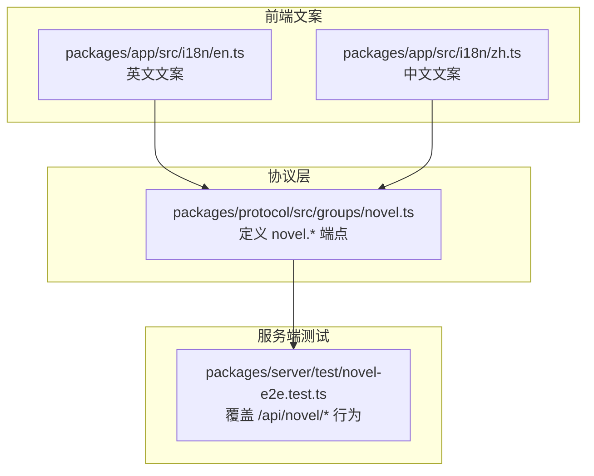
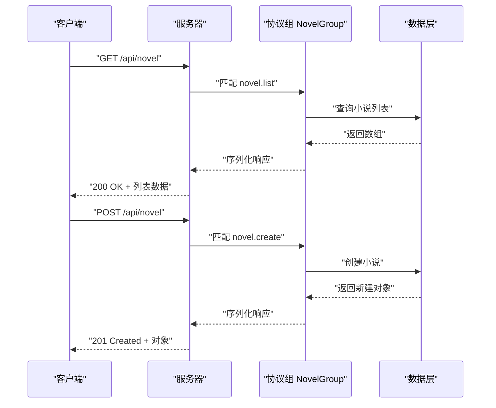
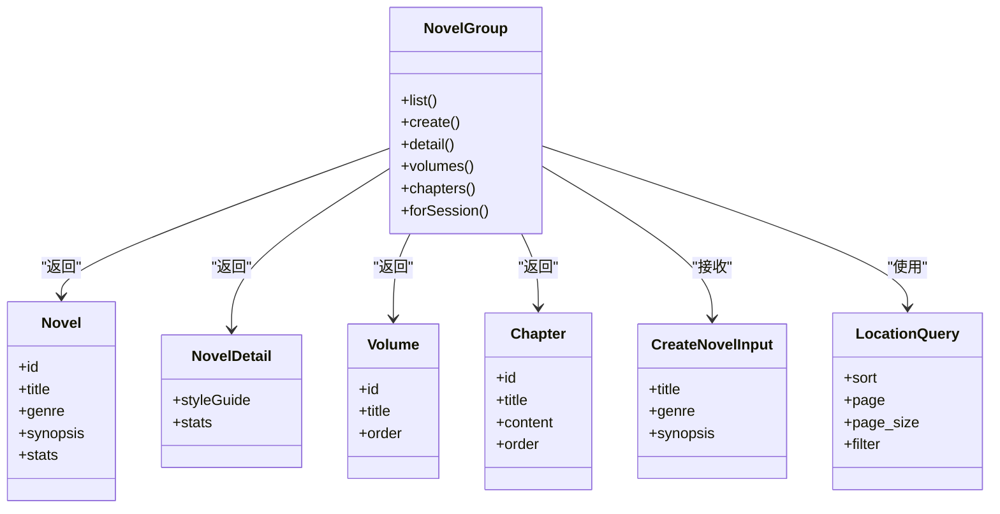

# 书架管理 API

<cite>
**本文引用的文件**   
- [packages/protocol/src/groups/novel.ts](file://packages/protocol/src/groups/novel.ts)
- [packages/server/test/novel-e2e.test.ts](file://packages/server/test/novel-e2e.test.ts)
- [packages/app/src/i18n/en.ts](file://packages/app/src/i18n/en.ts)
- [packages/app/src/i18n/zh.ts](file://packages/app/src/i18n/zh.ts)
</cite>

## 目录
1. [简介](#简介)
2. [项目结构](#项目结构)
3. [核心组件](#核心组件)
4. [架构总览](#架构总览)
5. [详细组件分析](#详细组件分析)
6. [依赖关系分析](#依赖关系分析)
7. [性能考虑](#性能考虑)
8. [故障排查指南](#故障排查指南)
9. [结论](#结论)
10. [附录](#附录)

## 简介
本文件为 openNovel 的“书架管理”功能提供完整的 API 文档。内容涵盖：
- 书架（小说）的 CRUD 接口：创建、列表、详情、绑定会话等
- 数据结构与字段说明
- 排序与分页参数约定
- 书架与作品的关联关系（通过“会话”绑定）
- 请求/响应示例与错误处理说明

注意：当前仓库中“书架”概念以“小说（novel）”为核心实体，书架即用户拥有的小说集合。API 定义集中在协议层，服务端行为由测试用例覆盖。

## 项目结构
- 协议与路由定义位于 packages/protocol/src/groups/novel.ts，使用 HttpApiGroup/HttpApiEndpoint 声明式定义端点、参数、成功与错误类型。
- 服务端行为与集成验证位于 packages/server/test/novel-e2e.test.ts，包含对 /api/novel/* 路径的端到端测试。
- 前端国际化文案在 packages/app/src/i18n/en.ts 与 zh.ts，体现“书架”相关 UI 文案，帮助理解业务语义。

图表来源 
- [packages/protocol/src/groups/novel.ts](file://packages/protocol/src/groups/novel.ts)
- [packages/server/test/novel-e2e.test.ts](file://packages/server/test/novel-e2e.test.ts)
- [packages/app/src/i18n/en.ts](file://packages/app/src/i18n/en.ts)
- [packages/app/src/i18n/zh.ts](file://packages/app/src/i18n/zh.ts)

章节来源
- [packages/protocol/src/groups/novel.ts](file://packages/protocol/src/groups/novel.ts)
- [packages/server/test/novel-e2e.test.ts](file://packages/server/test/novel-e2e.test.ts)
- [packages/app/src/i18n/en.ts](file://packages/app/src/i18n/en.ts)
- [packages/app/src/i18n/zh.ts](file://packages/app/src/i18n/zh.ts)

## 核心组件
- NovelGroup：封装所有与“小说/书架”相关的 HTTP 端点，包括列表、创建、详情、卷/章列表、按会话解析等。
- LocationQuery：通用查询参数（用于分页、排序、过滤），被多个端点复用。
- Novel/NovelDetail：书架项（小说）及其详情的数据模型。
- Volume/Chapter：作品组织单元（卷、章），与书架项存在一对多关系。
- 错误模型：NovelValidationError、NovelNotFoundError 等。

章节来源
- [packages/protocol/src/groups/novel.ts](file://packages/protocol/src/groups/novel.ts)

## 架构总览
书架管理的调用链路如下：
- 客户端发起 HTTP 请求到 /api/novel/*
- 协议层根据路由匹配到对应端点（如 novel.list、novel.create、novel.detail 等）
- 服务端执行逻辑并返回 JSON 响应
- 前端基于响应渲染书架界面

图表来源 
- [packages/protocol/src/groups/novel.ts](file://packages/protocol/src/groups/novel.ts)
- [packages/server/test/novel-e2e.test.ts](file://packages/server/test/novel-e2e.test.ts)

## 详细组件分析

### 书架（小说）列表接口
- 方法：GET
- 路径：/api/novel
- 标识符：v2.novel.list
- 描述：列出所有小说（书架项），附带统计信息
- 查询参数：LocationQuery（支持分页、排序、过滤）
- 成功响应：数组（Novel[]）
- 错误响应：NovelValidationError

章节来源
- [packages/protocol/src/groups/novel.ts](file://packages/protocol/src/groups/novel.ts)

### 创建书架（小说）接口
- 方法：POST
- 路径：/api/novel
- 标识符：v2.novel.create
- 描述：创建新小说（标题、题材、简介等）
- 请求体：CreateNovelInput
- 成功响应：Novel
- 错误响应：NovelValidationError

章节来源
- [packages/protocol/src/groups/novel.ts](file://packages/protocol/src/groups/novel.ts)

### 获取书架（小说）详情接口
- 方法：GET
- 路径：/api/novel/:novelID
- 标识符：v2.novel.detail
- 描述：获取指定小说的详细信息（含风格指南与统计）
- 路径参数：novelID（字符串）
- 查询参数：LocationQuery
- 成功响应：NovelDetail
- 错误响应：NovelNotFoundError

章节来源
- [packages/protocol/src/groups/novel.ts](file://packages/protocol/src/groups/novel.ts)

### 书架（小说）与卷/章
- 列出卷：GET /api/novel/:novelID/volumes → 返回 Volume[]
- 列出章：GET /api/novel/:novelID/chapters → 返回 Chapter[]
- 这些端点均支持 LocationQuery，便于分页与排序

章节来源
- [packages/protocol/src/groups/novel.ts](file://packages/protocol/src/groups/novel.ts)

### 书架（小说）与作品关联（会话绑定）
- 按会话解析小说：GET /api/novel/for-session/:sessionID
  - 用途：根据会话 ID 解析绑定的小说（优先于动态路由 :novelID）
  - 成功响应：Novel
  - 错误响应：NovelNotFoundError
- 绑定会话：POST /api/novel/:novelID/bind
  - 请求体：{ sessionID }
  - 成功响应：返回小说对象（id 与入参一致）
  - 服务端测试覆盖了该流程

章节来源
- [packages/protocol/src/groups/novel.ts](file://packages/protocol/src/groups/novel.ts)
- [packages/server/test/novel-e2e.test.ts](file://packages/server/test/novel-e2e.test.ts)

### 书架（小说）删除接口
- 当前协议组未显式声明删除端点；如需删除书架项，请确认后端是否提供相应实现或扩展协议定义。
- 若需新增，建议遵循现有命名规范与错误模型。

章节来源
- [packages/protocol/src/groups/novel.ts](file://packages/protocol/src/groups/novel.ts)

### 数据结构与字段说明
- Novel：书架项（小说）基础信息
- NovelDetail：在 Novel 基础上扩展风格指南与统计数据
- Volume/Chapter：作品组织单元，与 Novel 存在一对多关系
- CreateNovelInput：创建小说所需的输入字段（标题、题材、简介等）
- LocationQuery：通用查询参数，常用于分页、排序、过滤

章节来源
- [packages/protocol/src/groups/novel.ts](file://packages/protocol/src/groups/novel.ts)

### 排序与分页参数（LocationQuery）
- 常见字段（依据前端文案推断）：
  - sort：排序键，如 newest（最新）、oldest（最早）、title（按标题 A-Z）
  - page/page_size：分页页码与每页数量
  - filter：过滤条件（如题材 genre）
- 具体字段名与取值范围以 LocationQuery 的定义为准

章节来源
- [packages/protocol/src/groups/novel.ts](file://packages/protocol/src/groups/novel.ts)
- [packages/app/src/i18n/en.ts](file://packages/app/src/i18n/en.ts)
- [packages/app/src/i18n/zh.ts](file://packages/app/src/i18n/zh.ts)

### 请求/响应示例（文字描述）
- 列表请求
  - GET /api/novel?sort=newest&page=1&page_size=20
  - 响应：200 OK，返回 Novel[]
- 创建请求
  - POST /api/novel，请求体包含标题、题材、简介等
  - 响应：201 Created，返回新建的 Novel
- 详情请求
  - GET /api/novel/:novelID
  - 响应：200 OK，返回 NovelDetail
- 绑定会话
  - POST /api/novel/:novelID/bind，请求体 { sessionID }
  - 响应：200 OK，返回小说对象（id 与入参一致）

章节来源
- [packages/protocol/src/groups/novel.ts](file://packages/protocol/src/groups/novel.ts)
- [packages/server/test/novel-e2e.test.ts](file://packages/server/test/novel-e2e.test.ts)

### 错误处理说明
- NovelValidationError：请求参数校验失败时返回
- NovelNotFoundError：资源不存在时返回
- 其他服务端错误：按框架默认错误格式返回

章节来源
- [packages/protocol/src/groups/novel.ts](file://packages/protocol/src/groups/novel.ts)

## 依赖关系分析
- 协议组 NovelGroup 依赖：
  - Schema 类型（Novel、Volume、Chapter、CreateNovelInput 等）
  - 通用查询参数 LocationQuery
  - 错误模型（NovelValidationError、NovelNotFoundError）
- 服务端测试依赖：
  - 实际路由 /api/novel/* 的行为验证（如 outline、tension、bind）
- 前端文案依赖：
  - 书架相关文案（标题、排序选项、空状态提示等）

图表来源 
- [packages/protocol/src/groups/novel.ts](file://packages/protocol/src/groups/novel.ts)

章节来源
- [packages/protocol/src/groups/novel.ts](file://packages/protocol/src/groups/novel.ts)

## 性能考虑
- 列表接口应合理使用分页与排序，避免一次性返回大量数据
- 详情接口可缓存风格指南与统计数据，减少重复计算
- 卷/章列表可按序分页加载，提升首屏性能
- 绑定会话操作应尽量幂等，避免重复写入

[本节为通用指导，不直接分析具体文件]

## 故障排查指南
- 参数校验失败：检查请求体是否符合 CreateNovelInput 定义，关注 NovelValidationError
- 资源不存在：确认 novelID 或 sessionID 是否正确，关注 NovelNotFoundError
- 绑定会话异常：参考服务端测试中的 bind 流程，确保 sessionID 有效且唯一

章节来源
- [packages/server/test/novel-e2e.test.ts](file://packages/server/test/novel-e2e.test.ts)

## 结论
openNovel 的书架管理以“小说（novel）”为核心实体，通过协议层的声明式端点定义与服务端测试共同保障功能正确性。书架即小说集合，支持列表、创建、详情、卷/章管理与会话绑定。建议后续按需补充删除接口，并统一错误响应格式，以提升一致性。

[本节为总结，不直接分析具体文件]

## 附录
- 书架相关文案（中英文）
  - 标题：“书架”、“Bookshelf”
  - 子标题：“我的小说”、“My Novels”
  - 空状态：“还没有小说”、“No novels yet”
  - 创建按钮：“创建小说”、“Create Novel”
  - 排序选项：“最新”、“最早”、“标题 A-Z”
  - 统计文案：“X 部小说，Y 章”、“Progress”、“Total”

章节来源
- [packages/app/src/i18n/en.ts](file://packages/app/src/i18n/en.ts)
- [packages/app/src/i18n/zh.ts](file://packages/app/src/i18n/zh.ts)