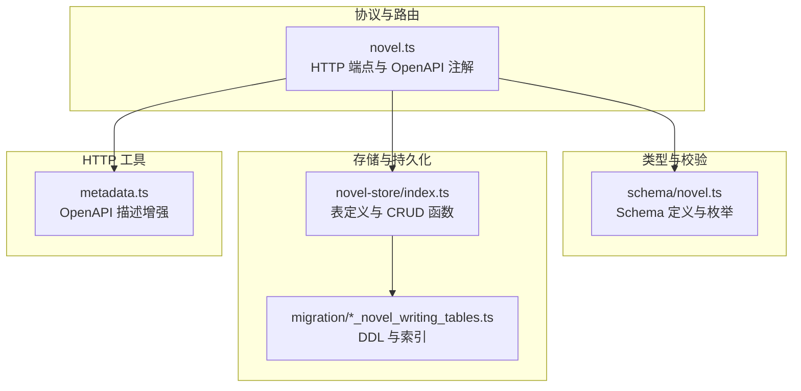
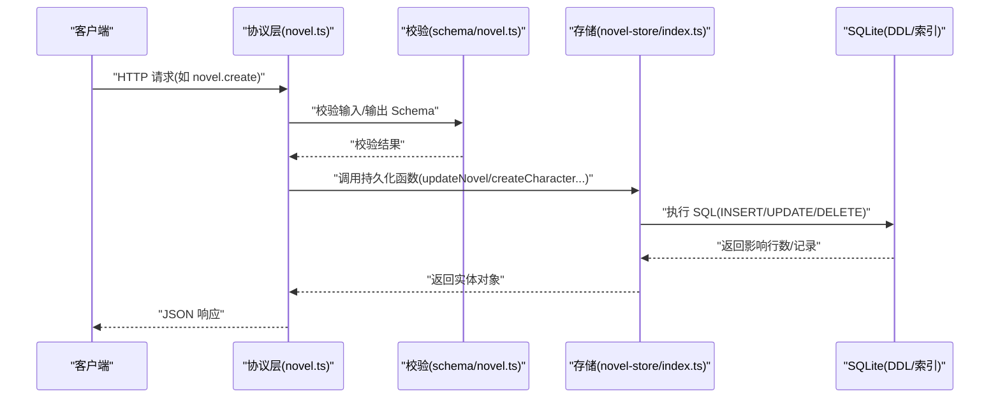
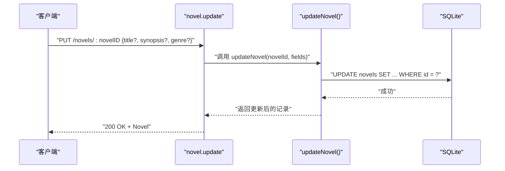
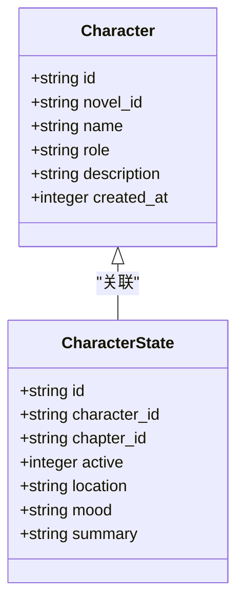
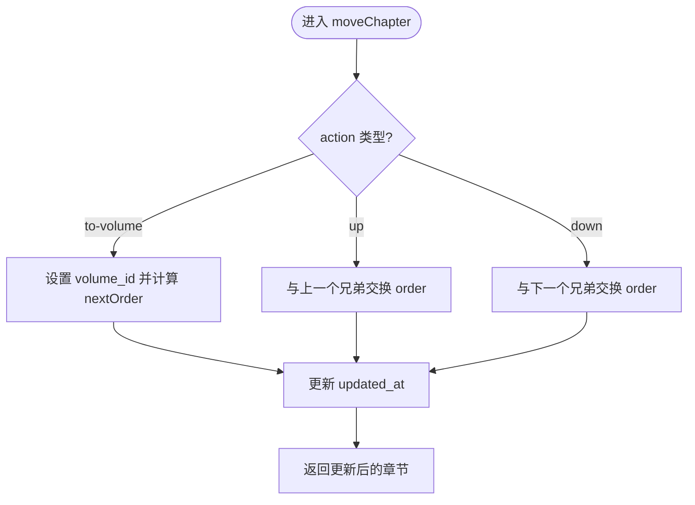
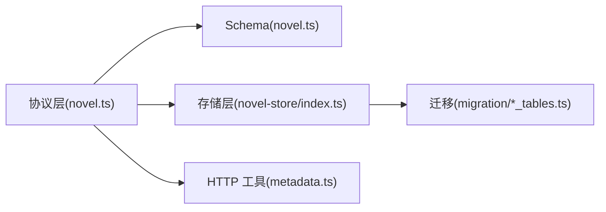

# 作品元数据 API

<cite>
**本文引用的文件**
- [packages/protocol/src/groups/novel.ts](file://packages/protocol/src/groups/novel.ts)
- [packages/schema/src/novel.ts](file://packages/schema/src/novel.ts)
- [packages/novel-store/src/index.ts](file://packages/novel-store/src/index.ts)
- [packages/core/src/database/migration/20260721152252_novel_writing_tables.ts](file://packages/core/src/database/migration/20260721152252_novel_writing_tables.ts)
- [packages/opencode/src/server/routes/instance/httpapi/groups/metadata.ts](file://packages/opencode/src/server/routes/instance/httpapi/groups/metadata.ts)
</cite>

## 目录
1. [简介](#简介)
2. [项目结构](#项目结构)
3. [核心组件](#核心组件)
4. [架构总览](#架构总览)
5. [详细组件分析](#详细组件分析)
6. [依赖关系分析](#依赖关系分析)
7. [性能考虑](#性能考虑)
8. [故障排查指南](#故障排查指南)
9. [结论](#结论)
10. [附录：字段定义与校验规则](#附录字段定义与校验规则)

## 简介
本文件为 openNovel 的“作品元数据管理”提供完整的 API 文档，覆盖作品的标题、作者（角色）、简介、标签（分类/风格）、状态等元数据的增删改查操作。同时包含批量更新、条件查询、搜索过滤的最佳实践建议与示例路径引用。

## 项目结构
- 协议层（API 端点与 OpenAPI 注解）：packages/protocol/src/groups/novel.ts
- 类型与校验（Schema 定义）：packages/schema/src/novel.ts
- 存储层（表结构与持久化函数）：packages/novel-store/src/index.ts
- 数据库迁移（DDL 与索引）：packages/core/src/database/migration/20260721152252_novel_writing_tables.ts
- HTTP API 辅助工具（OpenAPI 描述增强）：packages/opencode/src/server/routes/instance/httpapi/groups/metadata.ts

图表来源
- [packages/protocol/src/groups/novel.ts](file://packages/protocol/src/groups/novel.ts)
- [packages/schema/src/novel.ts](file://packages/schema/src/novel.ts)
- [packages/novel-store/src/index.ts](file://packages/novel-store/src/index.ts)
- [packages/core/src/database/migration/20260721152252_novel_writing_tables.ts](file://packages/core/src/database/migration/20260721152252_novel_writing_tables.ts)
- [packages/opencode/src/server/routes/instance/httpapi/groups/metadata.ts](file://packages/opencode/src/server/routes/instance/httpapi/groups/metadata.ts)

章节来源
- [packages/protocol/src/groups/novel.ts](file://packages/protocol/src/groups/novel.ts)
- [packages/schema/src/novel.ts](file://packages/schema/src/novel.ts)
- [packages/novel-store/src/index.ts](file://packages/novel-store/src/index.ts)
- [packages/core/src/database/migration/20260721152252_novel_writing_tables.ts](file://packages/core/src/database/migration/20260721152252_novel_writing_tables.ts)
- [packages/opencode/src/server/routes/instance/httpapi/groups/metadata.ts](file://packages/opencode/src/server/routes/instance/httpapi/groups/metadata.ts)

## 核心组件
- 作品模型 Novel：包含 id、title、genre、synopsis、status、createdAt、updatedAt 等字段；用于列表与详情返回。
- 作品详情 NovelDetail：在 Novel 基础上扩展 styleGuide 与 stats。
- 风格指南 StyleGuide：rules、tone、pov、tense 等写作风格配置。
- 统计信息 NovelStats：chapterCount、volumeCount、characterCount、wordCount。
- 角色 Character：name、role、description 等。
- 卷 Volume：title、summary、order 等。
- 章节 Chapter：title、content、word_count、status、order 等。
- 世界条目 WorldEntry：category、title、content 等。
- 关系 Relationship、伏笔 Foreshadowing、剧情线 PlotThread 等辅助元数据实体。

章节来源
- [packages/schema/src/novel.ts](file://packages/schema/src/novel.ts)

## 架构总览
作品元数据 API 的请求链路如下：客户端通过 HTTP 调用协议层定义的端点，协议层使用 Schema 对请求参数与响应进行校验，随后调用存储层的持久化函数完成读写，底层由 SQLite 表与索引支撑。

图表来源
- [packages/protocol/src/groups/novel.ts](file://packages/protocol/src/groups/novel.ts)
- [packages/schema/src/novel.ts](file://packages/schema/src/novel.ts)
- [packages/novel-store/src/index.ts](file://packages/novel-store/src/index.ts)
- [packages/core/src/database/migration/20260721152252_novel_writing_tables.ts](file://packages/core/src/database/migration/20260721152252_novel_writing_tables.ts)

## 详细组件分析

### 作品 Novel 元数据 API
- 列表：GET /novels（支持 LocationQuery）
- 创建：POST /novels（CreateNovelInput）
- 详情：GET /novels/:novelID（返回 NovelDetail）
- 会话绑定：GET /novels/for-session/:sessionID
- 更新：PUT /novels/:novelID（fields: title, synopsis, genre）
- 删除：DELETE /novels/:novelID

说明
- 字段类型与校验遵循 schema/novel.ts 中的 Novel、NovelDetail、Genre 等定义。
- 错误码与异常由 NovelValidationError、NovelNotFoundError 等处理。

章节来源
- [packages/protocol/src/groups/novel.ts](file://packages/protocol/src/groups/novel.ts)
- [packages/schema/src/novel.ts](file://packages/schema/src/novel.ts)
- [packages/novel-store/src/index.ts](file://packages/novel-store/src/index.ts)

#### 序列图：更新作品元数据

图表来源
- [packages/protocol/src/groups/novel.ts](file://packages/protocol/src/groups/novel.ts)
- [packages/novel-store/src/index.ts](file://packages/novel-store/src/index.ts)

### 角色 Character 元数据 API
- 创建：POST /novels/:novelID/characters（CreateCharacterInput）
- 更新：PUT /novels/:novelID/characters/:characterID（UpdateCharacterInput）
- 删除：DELETE /novels/:novelID/characters/:characterID

说明
- 角色字段 name、role、description 等由 schema/novel.ts 中 Character 定义约束。
- 存储层提供 createCharacter、updateCharacter、deleteCharacter 函数。

章节来源
- [packages/protocol/src/groups/novel.ts](file://packages/protocol/src/groups/novel.ts)
- [packages/schema/src/novel.ts](file://packages/schema/src/novel.ts)
- [packages/novel-store/src/index.ts](file://packages/novel-store/src/index.ts)

#### 类图：角色相关数据结构

图表来源
- [packages/novel-store/src/index.ts](file://packages/novel-store/src/index.ts)

### 卷 Volume 与章节 Chapter 元数据
- 卷：createVolume、updateVolume、deleteVolume
- 章节：createChapter、updateChapter、moveChapter、deleteChapter

说明
- 卷与章节的 order、status、word_count 等字段受存储层表定义约束。
- moveChapter 支持 up/down/to-volume 三种移动策略。

章节来源
- [packages/novel-store/src/index.ts](file://packages/novel-store/src/index.ts)

#### 流程图：章节移动逻辑

图表来源
- [packages/novel-store/src/index.ts](file://packages/novel-store/src/index.ts)

### 风格指南 StyleGuide 与统计 Stats
- 风格指南：upsertStyleGuide（按 novel_id 存在则更新，不存在则插入）
- 统计：NovelStats 包含 chapterCount、volumeCount、characterCount、wordCount

说明
- rules 字段以 JSON 模式存储，避免双重编码。
- NovelDetail 聚合了 styleGuide 与 stats。

章节来源
- [packages/novel-store/src/index.ts](file://packages/novel-store/src/index.ts)
- [packages/schema/src/novel.ts](file://packages/schema/src/novel.ts)

### 世界条目 WorldEntry、关系 Relationship、伏笔 Foreshadowing、剧情线 PlotThread
- WorldEntry：category、title、content
- Relationship：charAId、charBId、type、description
- Foreshadowing：planted/resolved chapter 关联、state、content
- PlotThread：title、status、priority、description、closedAt

说明
- 这些实体均通过 novel_id 与作品关联，便于按作品维度组织元数据。

章节来源
- [packages/schema/src/novel.ts](file://packages/schema/src/novel.ts)
- [packages/novel-store/src/index.ts](file://packages/novel-store/src/index.ts)

## 依赖关系分析
- 协议层依赖 Schema 进行输入输出校验。
- 协议层调用存储层函数完成数据持久化。
- 存储层依赖 SQLite 表结构与索引，确保查询与写入性能。
- HTTP API 工具为 OpenAPI 描述提供统一增强。

图表来源
- [packages/protocol/src/groups/novel.ts](file://packages/protocol/src/groups/novel.ts)
- [packages/schema/src/novel.ts](file://packages/schema/src/novel.ts)
- [packages/novel-store/src/index.ts](file://packages/novel-store/src/index.ts)
- [packages/core/src/database/migration/20260721152252_novel_writing_tables.ts](file://packages/core/src/database/migration/20260721152252_novel_writing_tables.ts)
- [packages/opencode/src/server/routes/instance/httpapi/groups/metadata.ts](file://packages/opencode/src/server/routes/instance/httpapi/groups/metadata.ts)

章节来源
- [packages/protocol/src/groups/novel.ts](file://packages/protocol/src/groups/novel.ts)
- [packages/novel-store/src/index.ts](file://packages/novel-store/src/index.ts)

## 性能考虑
- 索引优化：novels.status、chapters.novel_id、volumes.novel_id、world_entries.category 等索引已定义，利于常见查询与过滤。
- 批量更新：对于多字段更新，建议使用 updateNovel/updateCharacter/updateVolume 等函数的 fields 参数进行部分更新，减少不必要的数据传输。
- 分页与限制：建议在列表接口中使用 query 参数控制返回数量（如 LocationQuery），避免一次性加载过多数据。
- 事务与一致性：复杂的多表更新应结合 saga/pending_updates 机制保证一致性（参考存储层相关表）。

[本节为通用指导，不直接分析具体文件]

## 故障排查指南
- 校验失败：检查请求体是否符合 Schema 定义（如 Genre 枚举值、必填字段）。
- 未找到资源：确认 novelID/characterID/volumeID/chapterID 是否存在于数据库中。
- 数据不一致：检查外键约束与级联删除行为（如 chapters.volumes 的 ON DELETE SET NULL）。
- 日志与审计：利用 description_history、novel_state_log、tension_log 等表追踪变更与状态。

章节来源
- [packages/novel-store/src/index.ts](file://packages/novel-store/src/index.ts)
- [packages/core/src/database/migration/20260721152252_novel_writing_tables.ts](file://packages/core/src/database/migration/20260721152252_novel_writing_tables.ts)

## 结论
openNovel 的作品元数据 API 以清晰的协议层、严格的 Schema 校验与完善的存储层设计为基础，提供了稳定高效的增删改查能力。通过合理的索引与批处理策略，可满足大规模作品元数据管理的性能需求。建议在实际使用中遵循字段校验规则与最佳实践，确保数据一致性与可维护性。

[本节为总结，不直接分析具体文件]

## 附录：字段定义与校验规则
- Novel
  - id: string（主键）
  - title: string（必填）
  - genre: 枚举（如“玄幻”“都市”“仙侠”“历史”“科幻”“悬疑”“言情”“游戏”）
  - synopsis: string（默认空串）
  - status: string（默认 draft）
  - createdAt: integer（时间戳）
  - updatedAt: integer（时间戳）
- NovelDetail
  - 继承 Novel 字段
  - styleGuide: StyleGuide（嵌套）
  - stats: NovelStats（嵌套）
- NovelStats
  - chapterCount: NonNegativeInt
  - volumeCount: NonNegativeInt
  - characterCount: NonNegativeInt
  - wordCount: NonNegativeInt
- StyleGuide
  - rules: JSON（对象）
  - tone: string
  - pov: string
  - tense: string
- Character
  - id: string
  - novel_id: string
  - name: string（必填）
  - role: string（默认空串）
  - description: string（默认空串）
  - created_at: integer
- Volume
  - id: string
  - novel_id: string
  - title: string（必填）
  - summary: string（默认空串）
  - order: integer（必填）
  - created_at: integer
- Chapter
  - id: string
  - novel_id: string
  - volume_id: string（可为空）
  - title: string（必填）
  - content: string（默认空串）
  - word_count: integer（默认 0）
  - status: string（默认 draft）
  - order: integer（必填）
  - created_at: integer
  - updated_at: integer
- WorldEntry
  - id: string
  - novel_id: string
  - category: string（默认空串）
  - title: string（必填）
  - content: string（默认空串）
  - created_at: integer
- Relationship
  - id: string
  - novel_id: string
  - charAId: string
  - charBId: string
  - type: string（默认空串）
  - description: string（默认空串）
- Foreshadowing
  - id: string
  - novel_id: string
  - plantedChapterId: string（可选）
  - resolvedChapterId: string（可选）
  - content: string（必填）
  - state: string（默认 planted）
  - created_at: integer
- PlotThread
  - id: string
  - novel_id: string
  - title: string（必填）
  - status: string（默认 open）
  - priority: string（默认 medium）
  - description: string（默认空串）
  - created_at: integer
  - closedAt: integer（可选）

章节来源
- [packages/schema/src/novel.ts](file://packages/schema/src/novel.ts)
- [packages/novel-store/src/index.ts](file://packages/novel-store/src/index.ts)
- [packages/core/src/database/migration/20260721152252_novel_writing_tables.ts](file://packages/core/src/database/migration/20260721152252_novel_writing_tables.ts)