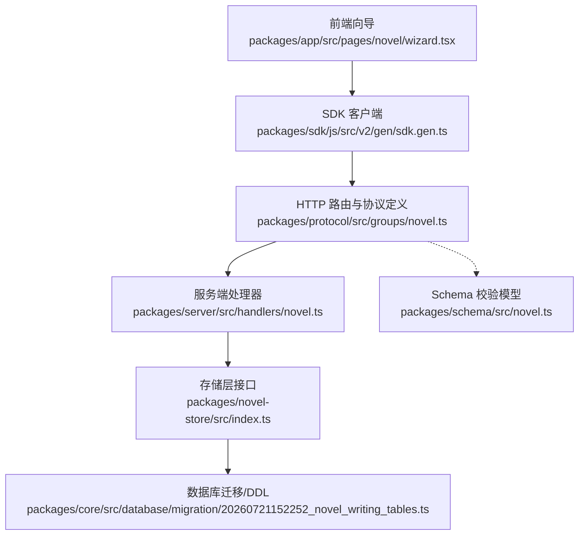
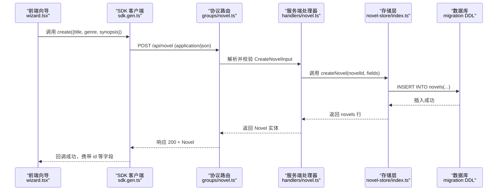
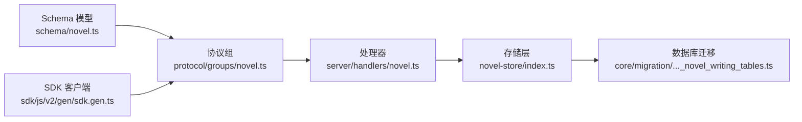
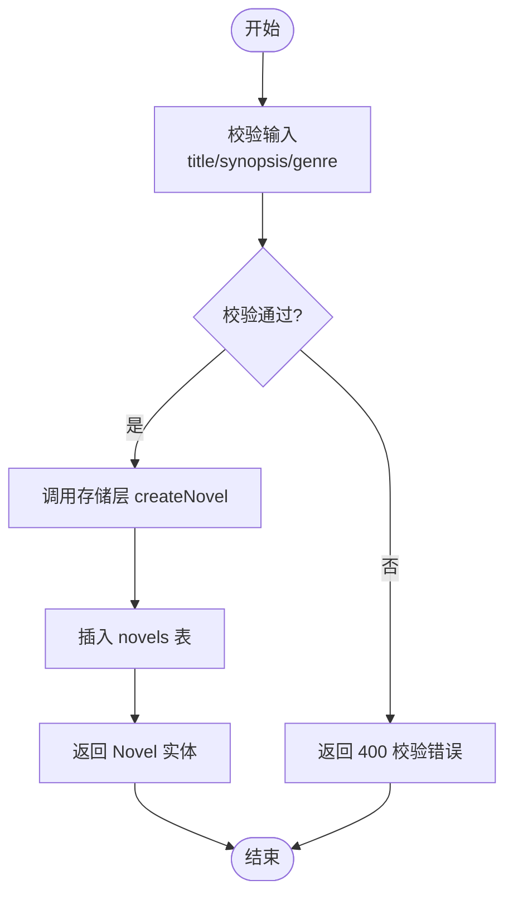

# 作品创建 API

<cite>
**本文引用的文件**   
- [packages/schema/src/novel.ts](file://packages/schema/src/novel.ts)
- [packages/protocol/src/groups/novel.ts](file://packages/protocol/src/groups/novel.ts)
- [packages/sdk/js/src/v2/gen/sdk.gen.ts](file://packages/sdk/js/src/v2/gen/sdk.gen.ts)
- [packages/sdk/js/src/v2/gen/types.gen.ts](file://packages/sdk/js/src/v2/gen/types.gen.ts)
- [packages/server/test/novel-e2e.test.ts](file://packages/server/test/novel-e2e.test.ts)
- [packages/server/src/handlers/novel.ts](file://packages/server/src/handlers/novel.ts)
- [packages/novel-store/src/index.ts](file://packages/novel-store/src/index.ts)
- [packages/core/src/database/migration/20260721152252_novel_writing_tables.ts](file://packages/core/src/database/migration/20260721152252_novel_writing_tables.ts)
- [packages/app/src/pages/novel/wizard.tsx](file://packages/app/src/pages/novel/wizard.tsx)
</cite>

## 目录
1. [简介](#简介)
2. [项目结构](#项目结构)
3. [核心组件](#核心组件)
4. [架构总览](#架构总览)
5. [详细组件分析](#详细组件分析)
6. [依赖关系分析](#依赖关系分析)
7. [性能考量](#性能考量)
8. [故障排查指南](#故障排查指南)
9. [结论](#结论)
10. [附录](#附录)

## 简介
本文件为 openNovel 的“作品创建”功能提供完整的 API 文档，覆盖从调用接口到数据落库、默认值处理、状态管理以及后续操作的端到端流程。重点包括：
- 作品基本信息设置（标题、题材、简介）
- 初始配置选项（风格指南等）
- 模板选择（概念性说明）
- 元数据结构与必填字段校验
- 默认值与状态初始化
- 错误处理与常见异常

## 项目结构
围绕“作品创建”的相关代码分布在以下模块：
- 协议与类型定义：协议组、SDK 生成类型与方法
- Schema 校验：输入输出模型与枚举
- 服务端处理器：业务逻辑与错误抛出
- 存储层：表结构与持久化操作
- 数据库迁移：DDL 与索引
- 前端向导：用户交互与提交入口



**图表来源** 
- [packages/app/src/pages/novel/wizard.tsx](file://packages/app/src/pages/novel/wizard.tsx)
- [packages/sdk/js/src/v2/gen/sdk.gen.ts](file://packages/sdk/js/src/v2/gen/sdk.gen.ts)
- [packages/protocol/src/groups/novel.ts](file://packages/protocol/src/groups/novel.ts)
- [packages/server/src/handlers/novel.ts](file://packages/server/src/handlers/novel.ts)
- [packages/novel-store/src/index.ts](file://packages/novel-store/src/index.ts)
- [packages/core/src/database/migration/20260721152252_novel_writing_tables.ts](file://packages/core/src/database/migration/20260721152252_novel_writing_tables.ts)
- [packages/schema/src/novel.ts](file://packages/schema/src/novel.ts)

**章节来源**
- [packages/schema/src/novel.ts](file://packages/schema/src/novel.ts)
- [packages/protocol/src/groups/novel.ts](file://packages/protocol/src/groups/novel.ts)
- [packages/sdk/js/src/v2/gen/sdk.gen.ts](file://packages/sdk/js/src/v2/gen/sdk.gen.ts)
- [packages/sdk/js/src/v2/gen/types.gen.ts](file://packages/sdk/js/src/v2/gen/types.gen.ts)
- [packages/server/test/novel-e2e.test.ts](file://packages/server/test/novel-e2e.test.ts)
- [packages/server/src/handlers/novel.ts](file://packages/server/src/handlers/novel.ts)
- [packages/novel-store/src/index.ts](file://packages/novel-store/src/index.ts)
- [packages/core/src/database/migration/20260721152252_novel_writing_tables.ts](file://packages/core/src/database/migration/20260721152252_novel_writing_tables.ts)
- [packages/app/src/pages/novel/wizard.tsx](file://packages/app/src/pages/novel/wizard.tsx)

## 核心组件
- 输入模型 CreateNovelInput：包含 title、genre、synopsis，均为必填；genre 受限于枚举集合
- 协议端点 novel.create：POST /api/novel，请求体使用 CreateNovelInput，成功返回 Novel 实体
- 服务端处理器 createNovel：校验 genre、写入 novels 表并返回结果
- 存储层 createNovel：生成 id、时间戳、默认 status="draft"，插入 novels 表
- 数据库表 novels：包含 id、title、genre、synopsis、created_at、updated_at、status 等字段及默认值
- SDK 方法 create：封装 HTTP 调用，路径 /api/novel，Content-Type application/json

**章节来源**
- [packages/schema/src/novel.ts](file://packages/schema/src/novel.ts)
- [packages/protocol/src/groups/novel.ts](file://packages/protocol/src/groups/novel.ts)
- [packages/server/src/handlers/novel.ts](file://packages/server/src/handlers/novel.ts)
- [packages/novel-store/src/index.ts](file://packages/novel-store/src/index.ts)
- [packages/core/src/database/migration/20260721152252_novel_writing_tables.ts](file://packages/core/src/database/migration/20260721152252_novel_writing_tables.ts)
- [packages/sdk/js/src/v2/gen/sdk.gen.ts](file://packages/sdk/js/src/v2/gen/sdk.gen.ts)

## 架构总览
下图展示“作品创建”的完整调用链路与数据流向，从前端向导到后端处理器再到存储层与数据库。



**图表来源** 
- [packages/app/src/pages/novel/wizard.tsx](file://packages/app/src/pages/novel/wizard.tsx)
- [packages/sdk/js/src/v2/gen/sdk.gen.ts](file://packages/sdk/js/src/v2/gen/sdk.gen.ts)
- [packages/protocol/src/groups/novel.ts](file://packages/protocol/src/groups/novel.ts)
- [packages/server/src/handlers/novel.ts](file://packages/server/src/handlers/novel.ts)
- [packages/novel-store/src/index.ts](file://packages/novel-store/src/index.ts)
- [packages/core/src/database/migration/20260721152252_novel_writing_tables.ts](file://packages/core/src/database/migration/20260721152252_novel_writing_tables.ts)

## 详细组件分析

### 输入模型与校验规则
- CreateNovelInput 字段：
  - title：字符串，必填
  - genre：枚举，必填，取值限定为 ["玄幻", "都市", "仙侠", "历史", "科幻", "悬疑", "言情", "游戏"]
  - synopsis：字符串，必填
- 校验失败时抛出 NovelValidationError（400），包含 message 与 field 信息

**章节来源**
- [packages/schema/src/novel.ts](file://packages/schema/src/novel.ts)
- [packages/protocol/src/groups/novel.ts](file://packages/protocol/src/groups/novel.ts)

### 协议端点与 SDK
- 端点：POST /api/novel
- 请求体：CreateNovelInput
- 成功响应：Novel 实体（包含 id、title、genre、synopsis、status、createdAt、updatedAt）
- SDK 方法 create：自动设置 Content-Type 为 application/json，路径为 /api/novel

**章节来源**
- [packages/protocol/src/groups/novel.ts](file://packages/protocol/src/groups/novel.ts)
- [packages/sdk/js/src/v2/gen/sdk.gen.ts](file://packages/sdk/js/src/v2/gen/sdk.gen.ts)
- [packages/sdk/js/src/v2/gen/types.gen.ts](file://packages/sdk/js/src/v2/gen/types.gen.ts)

### 服务端处理器与错误处理
- 处理器 createNovel：
  - 校验 genre 是否在允许集合中，否则抛出 NovelValidationError
  - 调用存储层 createNovel 完成写入
  - 返回 Novel 实体
- 错误类型：
  - NovelValidationError（400）：参数校验失败
  - NovelNotFoundError（404）：资源不存在（在更新/删除等场景）
  - ChapterNotFoundError（404）：章节相关错误（非创建流程）

**章节来源**
- [packages/server/src/handlers/novel.ts](file://packages/server/src/handlers/novel.ts)
- [packages/protocol/src/groups/novel.ts](file://packages/protocol/src/groups/novel.ts)

### 存储层与默认值处理
- 存储层 createNovel：
  - 生成唯一 id（UUID）
  - 设置 created_at、updated_at 为当前时间戳
  - 设置 status 默认值为 "draft"
  - 插入 novels 表并返回行
- novels 表结构：
  - id：主键
  - title：非空
  - genre：非空
  - synopsis：非空，默认 ""
  - created_at：非空
  - updated_at：非空
  - status：非空，默认 "draft"

**章节来源**
- [packages/novel-store/src/index.ts](file://packages/novel-store/src/index.ts)
- [packages/core/src/database/migration/20260721152252_novel_writing_tables.ts](file://packages/core/src/database/migration/20260721152252_novel_writing_tables.ts)

### 前端向导与用户交互
- 向导步骤校验：
  - 步骤0：选择题材（必填）
  - 步骤1：标题长度限制（>0 且 ≤60）
  - 步骤2：简介长度限制（>0 且 ≤500）
  - 步骤3：提交
- 提交逻辑：
  - 组装 {genre, title.trim(), synopsis.trim()} 调用 SDK create
  - 成功后导航至作品详情页（携带 result.id）
  - 失败时显示错误提示

**章节来源**
- [packages/app/src/pages/novel/wizard.tsx](file://packages/app/src/pages/novel/wizard.tsx)

### 端到端测试验证
- e2e 用例验证：
  - GET /api/novel 列表返回 200
  - POST /api/novel 创建成功返回 200，响应体包含 title、genre、status="draft"、id 为字符串

**章节来源**
- [packages/server/test/novel-e2e.test.ts](file://packages/server/test/novel-e2e.test.ts)

### 类图：数据模型与输入输出
```mermaid
classDiagram
class CreateNovelInput {
+string title
+Genre genre
+string synopsis
}
class Novel {
+string id
+string title
+Genre genre
+string synopsis
+string status
+integer createdAt
+integer updatedAt
}
class Genre {
<<enumeration>>
"玄幻"
"都市"
"仙侠"
"历史"
"科幻"
"悬疑"
"言情"
"游戏"
}
CreateNovelInput --> Genre : "使用"
Novel --> Genre : "使用"
```

**图表来源** 
- [packages/schema/src/novel.ts](file://packages/schema/src/novel.ts)

## 依赖关系分析
- 协议层依赖 Schema 模型进行输入输出校验
- 处理器依赖存储层进行数据持久化
- 存储层依赖数据库迁移定义的表结构
- SDK 封装 HTTP 调用，面向前端暴露简洁方法



**图表来源** 
- [packages/schema/src/novel.ts](file://packages/schema/src/novel.ts)
- [packages/protocol/src/groups/novel.ts](file://packages/protocol/src/groups/novel.ts)
- [packages/server/src/handlers/novel.ts](file://packages/server/src/handlers/novel.ts)
- [packages/novel-store/src/index.ts](file://packages/novel-store/src/index.ts)
- [packages/core/src/database/migration/20260721152252_novel_writing_tables.ts](file://packages/core/src/database/migration/20260721152252_novel_writing_tables.ts)
- [packages/sdk/js/src/v2/gen/sdk.gen.ts](file://packages/sdk/js/src/v2/gen/sdk.gen.ts)

**章节来源**
- [packages/schema/src/novel.ts](file://packages/schema/src/novel.ts)
- [packages/protocol/src/groups/novel.ts](file://packages/protocol/src/groups/novel.ts)
- [packages/server/src/handlers/novel.ts](file://packages/server/src/handlers/novel.ts)
- [packages/novel-store/src/index.ts](file://packages/novel-store/src/index.ts)
- [packages/core/src/database/migration/20260721152252_novel_writing_tables.ts](file://packages/core/src/database/migration/20260721152252_novel_writing_tables.ts)
- [packages/sdk/js/src/v2/gen/sdk.gen.ts](file://packages/sdk/js/src/v2/gen/sdk.gen.ts)

## 性能考量
- 数据库连接缓存：存储层按路径缓存 Db 实例，减少重复连接开销
- 事务与索引：迁移脚本为常用查询建立索引（如 novels.status_idx、chapters.novel_id_idx 等）
- 默认值与最小化写入：status、synopsis 等字段设置合理默认值，避免额外计算
- 批量操作：后续扩展可考虑批量创建卷、章节以提升性能

[本节为通用指导，不直接分析具体文件]

## 故障排查指南
- 400 参数校验错误（NovelValidationError）：
  - 检查 genre 是否为允许枚举之一
  - 检查 title、synopsis 是否满足长度与非空要求
- 404 资源不存在（NovelNotFoundError）：
  - 确认 novelID 是否存在于数据库中
- 前端提交失败：
  - 检查向导校验是否通过（标题、简介长度）
  - 查看网络响应与错误消息

**章节来源**
- [packages/protocol/src/groups/novel.ts](file://packages/protocol/src/groups/novel.ts)
- [packages/server/test/novel.test.ts](file://packages/server/test/novel.test.ts)
- [packages/app/src/pages/novel/wizard.tsx](file://packages/app/src/pages/novel/wizard.tsx)

## 结论
openNovel 的作品创建 API 以清晰的协议定义、严格的 Schema 校验、稳健的错误处理和合理的默认值机制，提供了稳定可靠的创建能力。前端向导确保用户体验顺畅，后端处理器与存储层协同完成数据持久化，数据库迁移保障表结构与索引优化。整体架构层次清晰，便于扩展与维护。

[本节为总结性内容，不直接分析具体文件]

## 附录

### 作品元数据结构（novels 表）
- id：文本主键
- title：文本，非空
- genre：文本，非空
- synopsis：文本，非空，默认 ""
- created_at：整数，非空
- updated_at：整数，非空
- status：文本，非空，默认 "draft"

**章节来源**
- [packages/novel-store/src/index.ts](file://packages/novel-store/src/index.ts)
- [packages/core/src/database/migration/20260721152252_novel_writing_tables.ts](file://packages/core/src/database/migration/20260721152252_novel_writing_tables.ts)

### 创建流程流程图


**图表来源** 
- [packages/schema/src/novel.ts](file://packages/schema/src/novel.ts)
- [packages/server/src/handlers/novel.ts](file://packages/server/src/handlers/novel.ts)
- [packages/novel-store/src/index.ts](file://packages/novel-store/src/index.ts)