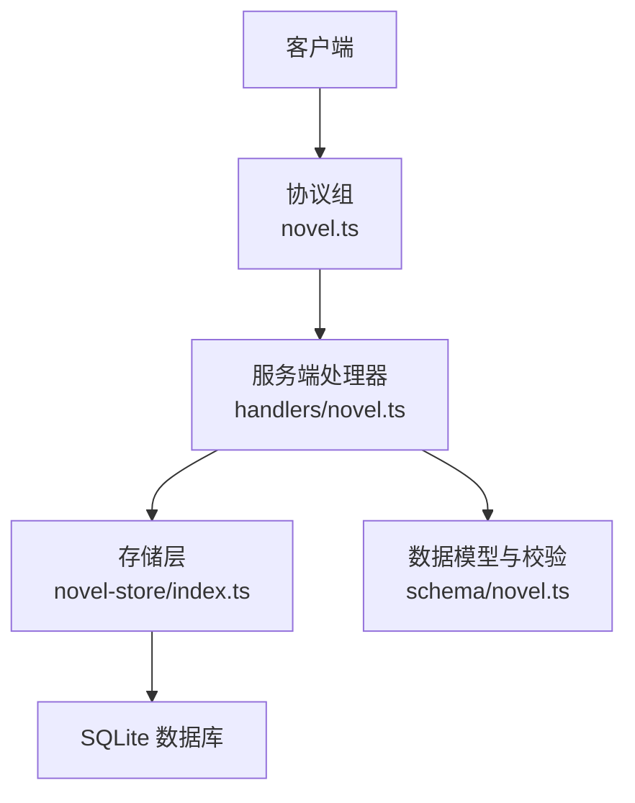
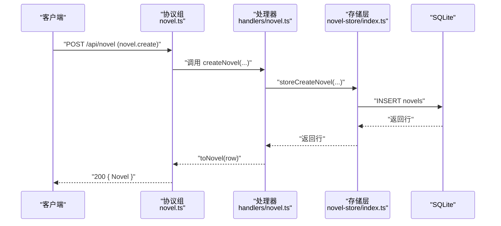
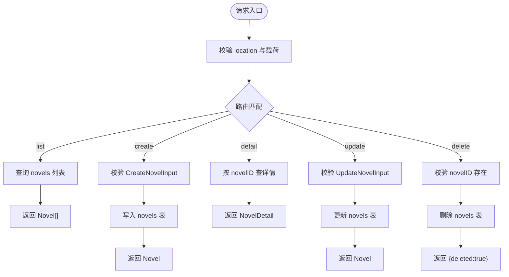
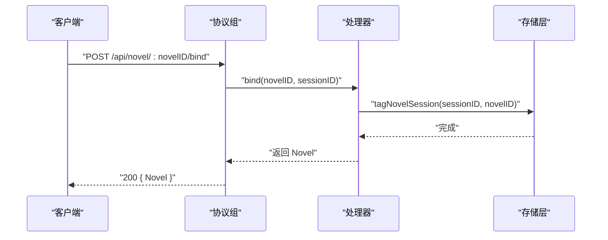
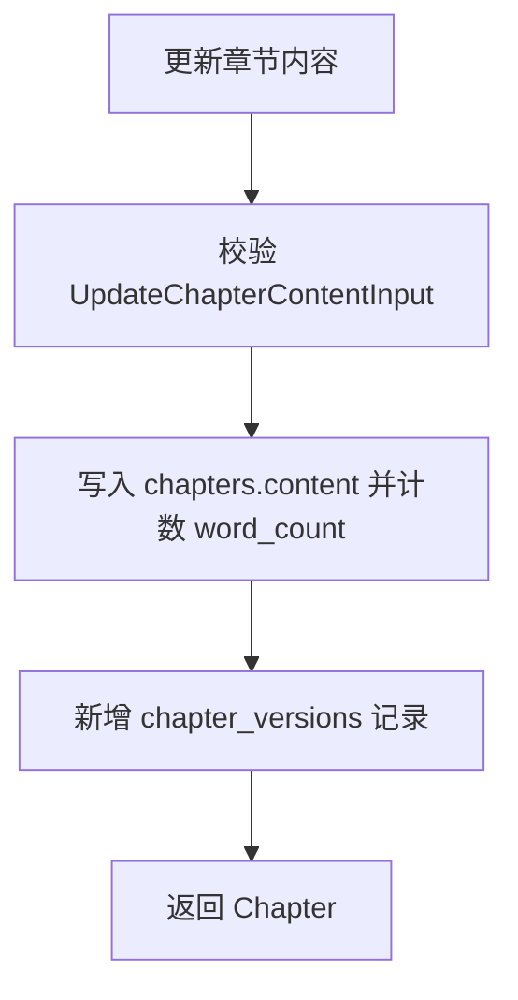
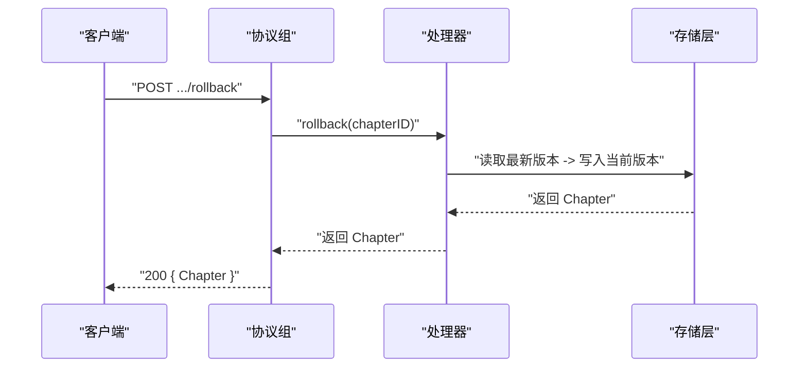
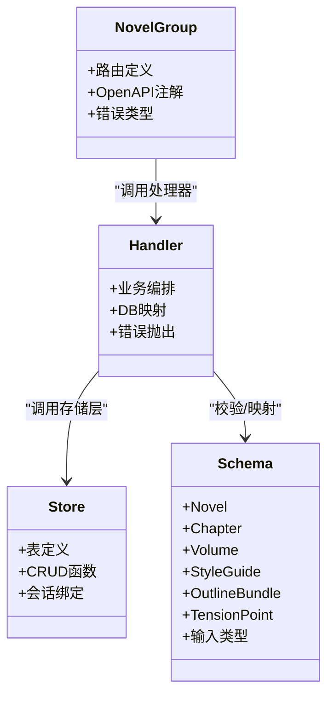

# 小说管理 API

<cite>
**本文引用的文件**   
- [packages/protocol/src/groups/novel.ts](file://packages/protocol/src/groups/novel.ts)
- [packages/schema/src/novel.ts](file://packages/schema/src/novel.ts)
- [packages/server/src/handlers/novel.ts](file://packages/server/src/handlers/novel.ts)
- [packages/novel-store/src/index.ts](file://packages/novel-store/src/index.ts)
- [packages/opencode/test/server/httpapi-exercise/index.ts](file://packages/opencode/test/server/httpapi-exercise/index.ts)
</cite>

## 目录
1. [简介](#简介)
2. [项目结构](#项目结构)
3. [核心组件](#核心组件)
4. [架构总览](#架构总览)
5. [详细组件分析](#详细组件分析)
6. [依赖关系分析](#依赖关系分析)
7. [性能考量](#性能考量)
8. [故障排查指南](#故障排查指南)
9. [结论](#结论)
10. [附录：端点清单与类型定义](#附录端点清单与类型定义)

## 简介
本文件为 openNovel 的小说管理 API 提供完整文档，覆盖小说 CRUD、书架管理（按目录定位）、作品元数据操作（风格指南、大纲、搜索、导出）、版本控制（章节版本、回滚、恢复）等。文档包含请求参数校验规则、响应数据结构、错误处理约定，以及 TypeScript 类型来源与实际使用场景示例路径。

## 项目结构
- 协议层（API 路由与 OpenAPI 注解）：packages/protocol/src/groups/novel.ts
- 数据模型与输入校验（Schema）：packages/schema/src/novel.ts
- 服务端处理器（业务编排、数据库映射、错误抛出）：packages/server/src/handlers/novel.ts
- 存储层（SQLite 表结构、持久化函数、会话绑定）：packages/novel-store/src/index.ts
- 测试用例（HTTP 调用示例）：packages/opencode/test/server/httpapi-exercise/index.ts

**图表来源** 
- [packages/protocol/src/groups/novel.ts:1-872](file://packages/protocol/src/groups/novel.ts#L1-L872)
- [packages/server/src/handlers/novel.ts:1-200](file://packages/server/src/handlers/novel.ts#L1-L200)
- [packages/novel-store/src/index.ts:1-120](file://packages/novel-store/src/index.ts#L1-L120)
- [packages/schema/src/novel.ts:1-120](file://packages/schema/src/novel.ts#L1-L120)

**章节来源**
- [packages/protocol/src/groups/novel.ts:1-872](file://packages/protocol/src/groups/novel.ts#L1-L872)
- [packages/server/src/handlers/novel.ts:1-200](file://packages/server/src/handlers/novel.ts#L1-L200)
- [packages/novel-store/src/index.ts:1-120](file://packages/novel-store/src/index.ts#L1-L120)
- [packages/schema/src/novel.ts:1-120](file://packages/schema/src/novel.ts#L1-L120)

## 核心组件
- 协议组 NovelGroup：集中声明所有 /api/novel/* 路由、请求/响应 Schema、OpenAPI 注解与错误类型。
- 数据模型 Schema：定义 Novel、Chapter、Volume、StyleGuide、OutlineBundle、TensionPoint 等实体及输入类型。
- 服务端处理器：实现业务逻辑、数据库查询与映射、错误抛出（如 NovelNotFoundError、ChapterNotFoundError）。
- 存储层：SQLite 表定义、CRUD 函数、会话绑定与懒绑定、评审记录生成等。

**章节来源**
- [packages/protocol/src/groups/novel.ts:1-872](file://packages/protocol/src/groups/novel.ts#L1-L872)
- [packages/schema/src/novel.ts:1-441](file://packages/schema/src/novel.ts#L1-L441)
- [packages/server/src/handlers/novel.ts:1-200](file://packages/server/src/handlers/novel.ts#L1-L200)
- [packages/novel-store/src/index.ts:1-120](file://packages/novel-store/src/index.ts#L1-L120)

## 架构总览

**图表来源** 
- [packages/protocol/src/groups/novel.ts:98-113](file://packages/protocol/src/groups/novel.ts#L98-L113)
- [packages/server/src/handlers/novel.ts:1053-1071](file://packages/server/src/handlers/novel.ts#L1053-L1071)
- [packages/novel-store/src/index.ts:723-740](file://packages/novel-store/src/index.ts#L723-L740)

## 详细组件分析

### 小说 CRUD 端点
- 列表：GET /api/novel
  - 查询参数：location（directory/workspace）
  - 成功响应：Novel[]
  - 错误：NovelValidationError
- 创建：POST /api/novel
  - 载荷：CreateNovelInput（title, genre, synopsis）
  - 成功响应：Novel
  - 错误：NovelValidationError
- 详情：GET /api/novel/:novelID
  - 成功响应：NovelDetail（含 styleGuide、stats）
  - 错误：NovelNotFoundError
- 更新：PUT /api/novel/:novelID
  - 载荷：UpdateNovelInput（title/synopsis/genre 可选）
  - 成功响应：Novel
  - 错误：NovelNotFoundError
- 删除：DELETE /api/novel/:novelID
  - 成功响应：{ deleted: boolean }
  - 错误：NovelNotFoundError

**图表来源** 
- [packages/protocol/src/groups/novel.ts:82-113](file://packages/protocol/src/groups/novel.ts#L82-L113)
- [packages/protocol/src/groups/novel.ts:131-145](file://packages/protocol/src/groups/novel.ts#L131-L145)
- [packages/protocol/src/groups/novel.ts:685-704](file://packages/protocol/src/groups/novel.ts#L685-L704)
- [packages/schema/src/novel.ts:338-373](file://packages/schema/src/novel.ts#L338-L373)

**章节来源**
- [packages/protocol/src/groups/novel.ts:82-113](file://packages/protocol/src/groups/novel.ts#L82-L113)
- [packages/protocol/src/groups/novel.ts:131-145](file://packages/protocol/src/groups/novel.ts#L131-L145)
- [packages/protocol/src/groups/novel.ts:685-704](file://packages/protocol/src/groups/novel.ts#L685-L704)
- [packages/schema/src/novel.ts:338-373](file://packages/schema/src/novel.ts#L338-L373)

### 书架管理与会话绑定
- 会话绑定：POST /api/novel/:novelID/bind
  - 载荷：BindSessionInput（sessionID）
  - 成功响应：Novel
  - 错误：NovelNotFoundError
- 按会话解析小说：GET /api/novel/for-session/:sessionID
  - 成功响应：Novel
  - 错误：NovelNotFoundError

**图表来源** 
- [packages/protocol/src/groups/novel.ts:657-672](file://packages/protocol/src/groups/novel.ts#L657-L672)
- [packages/novel-store/src/index.ts:413-424](file://packages/novel-store/src/index.ts#L413-L424)

**章节来源**
- [packages/protocol/src/groups/novel.ts:657-672](file://packages/protocol/src/groups/novel.ts#L657-L672)
- [packages/novel-store/src/index.ts:413-424](file://packages/novel-store/src/index.ts#L413-L424)

### 卷（Volume）管理
- 列表：GET /api/novel/:novelID/volumes
- 创建：POST /api/novel/:novelID/volumes（CreateVolumeInput）
- 更新：PUT /api/novel/:novelID/volumes/:volumeID（UpdateVolumeInput）
- 删除：DELETE /api/novel/:novelID/volumes/:volumeID

**章节来源**
- [packages/protocol/src/groups/novel.ts:147-161](file://packages/protocol/src/groups/novel.ts#L147-L161)
- [packages/protocol/src/groups/novel.ts:401-436](file://packages/protocol/src/groups/novel.ts#L401-L436)
- [packages/schema/src/novel.ts:262-272](file://packages/schema/src/novel.ts#L262-L272)

### 章节（Chapter）管理
- 列表：GET /api/novel/:novelID/chapters
- 详情：GET /api/novel/:novelID/chapters/:chapterID
- 创建：POST /api/novel/:novelID/chapters（CreateChapterInput）
- 更新标题/状态：PUT /api/novel/:novelID/chapters/:chapterID（UpdateChapterInput）
- 更新内容：PUT /api/novel/:novelID/chapters/:chapterID/content（UpdateChapterContentInput）
- 删除：DELETE /api/novel/:novelID/chapters/:chapterID
- 移动/排序：PUT /api/novel/:novelID/chapters/:chapterID/move（MoveChapterInput）

**图表来源** 
- [packages/protocol/src/groups/novel.ts:244-259](file://packages/protocol/src/groups/novel.ts#L244-L259)
- [packages/schema/src/novel.ts:345-348](file://packages/schema/src/novel.ts#L345-L348)

**章节来源**
- [packages/protocol/src/groups/novel.ts:163-193](file://packages/protocol/src/groups/novel.ts#L163-L193)
- [packages/protocol/src/groups/novel.ts:674-683](file://packages/protocol/src/groups/novel.ts#L674-L683)
- [packages/protocol/src/groups/novel.ts:454-468](file://packages/protocol/src/groups/novel.ts#L454-L468)
- [packages/schema/src/novel.ts:361-366](file://packages/schema/src/novel.ts#L361-L366)

### 版本控制（章节版本、回滚、恢复）
- 版本历史：GET /api/novel/:novelID/chapters/:chapterID/versions
- 回滚：POST /api/novel/:novelID/chapters/:chapterID/rollback
- 恢复到指定版本：PUT /api/novel/:novelID/chapters/:chapterID/restore（RestoreVersionInput）

**图表来源** 
- [packages/protocol/src/groups/novel.ts:195-209](file://packages/protocol/src/groups/novel.ts#L195-L209)
- [packages/protocol/src/groups/novel.ts:228-242](file://packages/protocol/src/groups/novel.ts#L228-L242)
- [packages/protocol/src/groups/novel.ts:438-452](file://packages/protocol/src/groups/novel.ts#L438-L452)
- [packages/schema/src/novel.ts:88-97](file://packages/schema/src/novel.ts#L88-L97)

**章节来源**
- [packages/protocol/src/groups/novel.ts:195-209](file://packages/protocol/src/groups/novel.ts#L195-L209)
- [packages/protocol/src/groups/novel.ts:228-242](file://packages/protocol/src/groups/novel.ts#L228-L242)
- [packages/protocol/src/groups/novel.ts:438-452](file://packages/protocol/src/groups/novel.ts#L438-L452)
- [packages/schema/src/novel.ts:88-97](file://packages/schema/src/novel.ts#L88-L97)

### 角色（Character）与关系（Relationship）
- 角色：CRUD（create/update/delete/list）
- 关系：CRUD（create/update/delete/list）
- 角色状态：CRUD（create/update/delete/list）

**章节来源**
- [packages/protocol/src/groups/novel.ts:278-336](file://packages/protocol/src/groups/novel.ts#L278-L336)
- [packages/protocol/src/groups/novel.ts:494-531](file://packages/protocol/src/groups/novel.ts#L494-L531)
- [packages/protocol/src/groups/novel.ts:533-596](file://packages/protocol/src/groups/novel.ts#L533-L596)
- [packages/schema/src/novel.ts:123-152](file://packages/schema/src/novel.ts#L123-L152)

### 世界设定（World Entry）与伏笔（Foreshadowing）
- 世界设定：CRUD（category/title/content）
- 伏笔：CRUD（content/state/resolvedChapterId）

**章节来源**
- [packages/protocol/src/groups/novel.ts:326-340](file://packages/protocol/src/groups/novel.ts#L326-L340)
- [packages/protocol/src/groups/novel.ts:802-838](file://packages/protocol/src/groups/novel.ts#L802-L838)
- [packages/schema/src/novel.ts:166-185](file://packages/schema/src/novel.ts#L166-L185)

### 大纲（Outline）与导出（Export）
- 获取大纲：GET /api/novel/:novelID/outline（OutlineBundle）
- 更新大纲：PUT /api/novel/:novelID/outline（OutlineUpdateInput）
- 导出全文：GET /api/novel/:novelID/export（NovelExport）

**章节来源**
- [packages/protocol/src/groups/novel.ts:342-389](file://packages/protocol/src/groups/novel.ts#L342-L389)
- [packages/schema/src/novel.ts:232-260](file://packages/schema/src/novel.ts#L232-L260)

### 风格指南（Style Guide）
- 获取：GET /api/novel/:novelID/style-guide
- 更新：PUT /api/novel/:novelID/style-guide（UpdateStyleGuideInput）

**章节来源**
- [packages/protocol/src/groups/novel.ts:598-619](file://packages/protocol/src/groups/novel.ts#L598-L619)
- [packages/schema/src/novel.ts:187-195](file://packages/schema/src/novel.ts#L187-L195)

### 张力曲线（Tension）
- 列表：GET /api/novel/:novelID/tension
- 创建：POST /api/novel/:novelID/tension（CreateTensionPointInput）
- 更新：PUT /api/novel/:novelID/tension/:pointID（UpdateTensionPointInput）
- 删除：DELETE /api/novel/:novelID/tension/:pointID

**章节来源**
- [packages/protocol/src/groups/novel.ts:641-655](file://packages/protocol/src/groups/novel.ts#L641-L655)
- [packages/protocol/src/groups/novel.ts:738-768](file://packages/protocol/src/groups/novel.ts#L738-L768)
- [packages/schema/src/novel.ts:197-204](file://packages/schema/src/novel.ts#L197-L204)

### 剧情线（Plot Thread）
- 列表：GET /api/novel/:novelID/plot-threads
- 创建：POST /api/novel/:novelID/plot-threads（CreatePlotThreadInput）
- 更新：PUT /api/novel/:novelID/plot-threads/:threadID（UpdatePlotThreadInput）
- 删除：DELETE /api/novel/:novelID/plot-threads/:threadID

**章节来源**
- [packages/protocol/src/groups/novel.ts:294-308](file://packages/protocol/src/groups/novel.ts#L294-L308)
- [packages/protocol/src/groups/novel.ts:770-800](file://packages/protocol/src/groups/novel.ts#L770-L800)
- [packages/schema/src/novel.ts:154-164](file://packages/schema/src/novel.ts#L154-L164)

### 搜索（Search）
- 全文搜索：GET /api/novel/:novelID/search?q=...&location=...
- 响应：NovelSearchResult[]

**章节来源**
- [packages/protocol/src/groups/novel.ts:621-639](file://packages/protocol/src/groups/novel.ts#L621-L639)
- [packages/schema/src/novel.ts:329-336](file://packages/schema/src/novel.ts#L329-L336)

### 章节评审（Review）
- 列表：GET /api/novel/:novelID/chapters/:chapterID/reviews
- 提交审批：POST /api/novel/:novelID/chapters/:chapterID/approval（ApprovalInput）

**章节来源**
- [packages/protocol/src/groups/novel.ts:211-226](file://packages/protocol/src/groups/novel.ts#L211-L226)
- [packages/schema/src/novel.ts:99-121](file://packages/schema/src/novel.ts#L99-L121)

## 依赖关系分析

**图表来源** 
- [packages/protocol/src/groups/novel.ts:1-872](file://packages/protocol/src/groups/novel.ts#L1-L872)
- [packages/schema/src/novel.ts:1-441](file://packages/schema/src/novel.ts#L1-L441)
- [packages/server/src/handlers/novel.ts:1-200](file://packages/server/src/handlers/novel.ts#L1-L200)
- [packages/novel-store/src/index.ts:1-120](file://packages/novel-store/src/index.ts#L1-L120)

**章节来源**
- [packages/protocol/src/groups/novel.ts:1-872](file://packages/protocol/src/groups/novel.ts#L1-L872)
- [packages/schema/src/novel.ts:1-441](file://packages/schema/src/novel.ts#L1-L441)
- [packages/server/src/handlers/novel.ts:1-200](file://packages/server/src/handlers/novel.ts#L1-L200)
- [packages/novel-store/src/index.ts:1-120](file://packages/novel-store/src/index.ts#L1-L120)

## 性能考量
- 每项目独立 SQLite 数据库，避免跨项目干扰；通过 getDbPath 与缓存提升连接复用。
- 章节版本与评审记录采用追加写入，避免频繁大对象更新。
- 列表接口返回轻量 DTO，详情接口按需聚合统计（字数、数量），减少不必要计算。
- 建议对高频查询字段建立索引（已内置部分索引）。

[本节为通用指导，不直接分析具体文件]

## 故障排查指南
- 常见错误类型
  - NovelNotFoundError：小说不存在或会话未绑定
  - ChapterNotFoundError：章节不存在
  - NovelValidationError：请求参数校验失败（如 genre 不在允许集合）
- 排查步骤
  - 检查路径参数与查询参数是否齐全（novelID、chapterID、location）
  - 确认载荷是否符合对应 Input Schema（必填字段、枚举值）
  - 查看处理器中错误抛出位置与存储层异常信息
- 参考实现
  - 错误类定义与 HTTP 状态码映射
  - 处理器中的校验与失败分支

**章节来源**
- [packages/protocol/src/groups/novel.ts:54-80](file://packages/protocol/src/groups/novel.ts#L54-L80)
- [packages/server/src/handlers/novel.ts:380-396](file://packages/server/src/handlers/novel.ts#L380-L396)

## 结论
openNovel 的小说管理 API 以协议组为中心，结合 Schema 强校验与存储层清晰职责划分，提供了完整的小说生命周期管理能力。通过统一的错误类型与 OpenAPI 注解，便于前端集成与自动化测试。建议在客户端侧严格遵循输入类型与错误处理约定，以获得稳定可靠的交互体验。

[本节为总结性内容，不直接分析具体文件]

## 附录：端点清单与类型定义

### 端点清单（节选）
- 小说
  - GET /api/novel → Novel[]
  - POST /api/novel → Novel
  - GET /api/novel/:novelID → NovelDetail
  - PUT /api/novel/:novelID → Novel
  - DELETE /api/novel/:novelID → { deleted: boolean }
- 卷
  - GET /api/novel/:novelID/volumes → Volume[]
  - POST /api/novel/:novelID/volumes → Volume
  - PUT /api/novel/:novelID/volumes/:volumeID → Volume
  - DELETE /api/novel/:novelID/volumes/:volumeID → { deleted: boolean }
- 章节
  - GET /api/novel/:novelID/chapters → Chapter[]
  - GET /api/novel/:novelID/chapters/:chapterID → ChapterDetail
  - POST /api/novel/:novelID/chapters → Chapter
  - PUT /api/novel/:novelID/chapters/:chapterID → Chapter
  - PUT /api/novel/:novelID/chapters/:chapterID/content → Chapter
  - DELETE /api/novel/:novelID/chapters/:chapterID → { deleted: boolean }
  - PUT /api/novel/:novelID/chapters/:chapterID/move → Chapter
- 版本与评审
  - GET /api/novel/:novelID/chapters/:chapterID/versions → ChapterVersion[]
  - POST /api/novel/:novelID/chapters/:chapterID/rollback → Chapter
  - PUT /api/novel/:novelID/chapters/:chapterID/restore → Chapter
  - GET /api/novel/:novelID/chapters/:chapterID/reviews → ChapterReview[]
  - POST /api/novel/:novelID/chapters/:chapterID/approval → Chapter
- 其他资源
  - 风格指南、大纲、导出、搜索、张力、剧情线、角色、关系、世界设定、伏笔等，详见协议组定义。

**章节来源**
- [packages/protocol/src/groups/novel.ts:82-872](file://packages/protocol/src/groups/novel.ts#L82-L872)

### TypeScript 类型来源（节选）
- Novel、NovelDetail、Chapter、ChapterDetail、Volume、StyleGuide、OutlineBundle、TensionPoint、ChapterVersion、ChapterReview、Character、Relationship、PlotThread、Foreshadowing、WorldEntry 等
- 输入类型：CreateNovelInput、UpdateNovelInput、CreateChapterInput、UpdateChapterInput、UpdateChapterContentInput、RestoreVersionInput、MoveChapterInput、UpdateStyleGuideInput、CreateTensionPointInput、UpdateTensionPointInput、CreatePlotThreadInput、UpdatePlotThreadInput、CreateForeshadowingInput、UpdateForeshadowingInput、CreateWorldEntryInput、UpdateWorldEntryInput、ApprovalInput、BindSessionInput

**章节来源**
- [packages/schema/src/novel.ts:1-441](file://packages/schema/src/novel.ts#L1-L441)

### 实际使用场景示例（测试用例）
- 创建小说：POST /api/novel，载荷包含 title、genre、synopsis
- 获取章节版本：GET /api/novel/{novelID}/chapters/{chapterID}/versions
- 获取张力曲线：GET /api/novel/{novelID}/tension
- 获取世界设定：GET /api/novel/{novelID}/world-entries

**章节来源**
- [packages/opencode/test/server/httpapi-exercise/index.ts:2064-2104](file://packages/opencode/test/server/httpapi-exercise/index.ts#L2064-L2104)