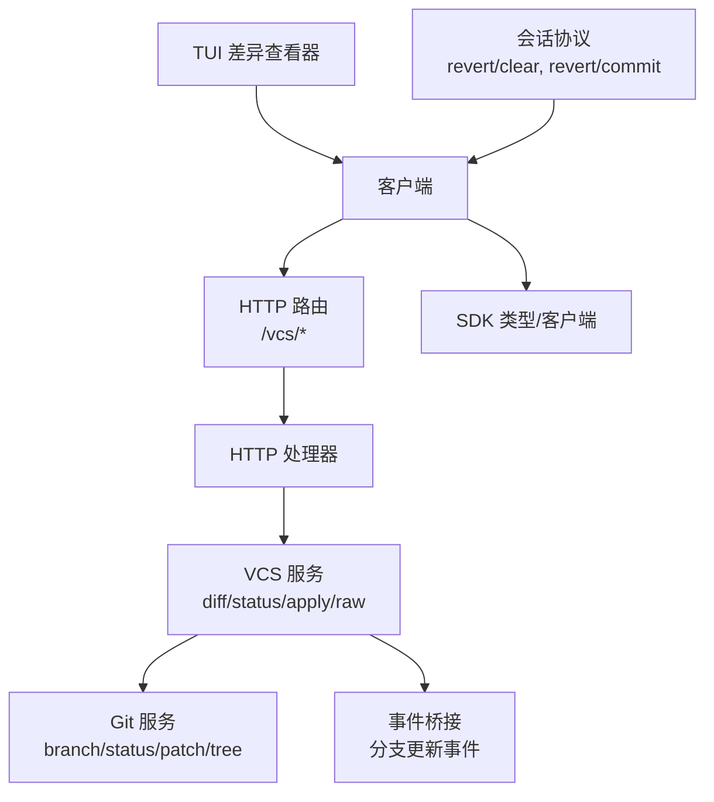
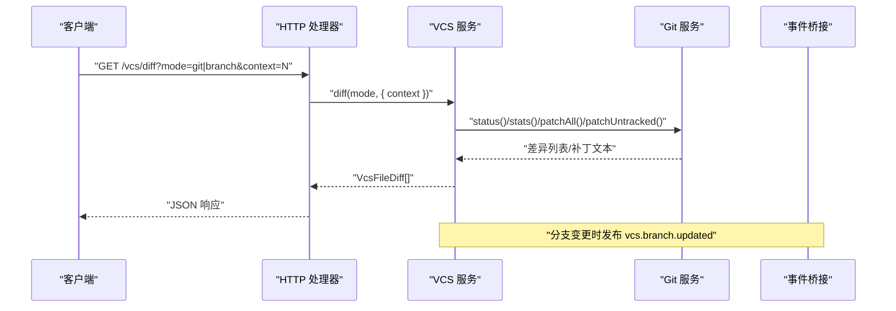
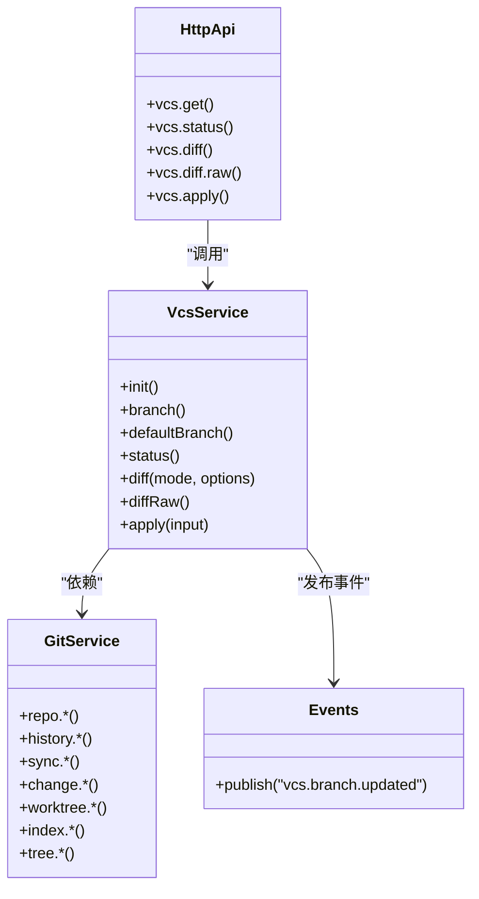

# 版本控制 API

<cite>
**本文引用的文件**   
- [packages/opencode/src/project/vcs.ts](file://packages/opencode/src/project/vcs.ts)
- [packages/core/src/git.ts](file://packages/core/src/git.ts)
- [packages/schema/src/vcs-event.ts](file://packages/schema/src/vcs-event.ts)
- [packages/opencode/src/server/routes/instance/httpapi/groups/instance.ts](file://packages/opencode/src/server/routes/instance/httpapi/groups/instance.ts)
- [packages/opencode/src/server/routes/instance/httpapi/handlers/instance.ts](file://packages/opencode/src/server/routes/instance/httpapi/handlers/instance.ts)
- [packages/sdk/js/src/v2/gen/types.gen.ts](file://packages/sdk/js/src/v2/gen/types.gen.ts)
- [packages/sdk/js/src/v2/gen/sdk.gen.ts](file://packages/sdk/js/src/v2/gen/sdk.gen.ts)
- [packages/tui/src/util/revert-diff.ts](file://packages/tui/src/util/revert-diff.ts)
- [packages/tui/src/feature-plugins/system/diff-viewer.tsx](file://packages/tui/src/feature-plugins/system/diff-viewer.tsx)
- [packages/protocol/src/groups/session.ts](file://packages/protocol/src/groups/session.ts)
</cite>

## 目录
1. [简介](#简介)
2. [项目结构](#项目结构)
3. [核心组件](#核心组件)
4. [架构总览](#架构总览)
5. [详细组件分析](#详细组件分析)
6. [依赖关系分析](#依赖关系分析)
7. [性能考量](#性能考量)
8. [故障排查指南](#故障排查指南)
9. [结论](#结论)
10. [附录](#附录)

## 简介
本文件为 openNovel 的版本控制系统（VCS）API 提供完整文档，覆盖以下能力：
- 获取 VCS 信息（当前分支、默认分支）
- 查询工作区状态与差异（支持按工作树或按分支对比）
- 获取原始补丁文本并应用补丁
- 事件通知（分支变更）
- 会话级回滚（暂存、提交）接口

说明：
- 当前实现基于 Git，通过 HTTP API 暴露。
- 未直接暴露“创建提交”“合并冲突解决”等高级 Git 操作；如需此类能力，可通过底层 Git 服务扩展或结合外部工具链实现。

## 项目结构
VCS 相关代码主要分布在以下模块：
- HTTP 路由与处理器：定义 /vcs/* 端点，调用 VCS 服务
- VCS 服务层：封装 Git 操作、差异计算、补丁生成与应用
- Git 基础服务：对 git CLI 的封装（仓库发现、分支、索引、树、差异、补丁等）
- 事件系统：分支更新事件
- SDK 类型与客户端：对外暴露的类型与调用方法
- TUI 与协议：差异查看器与会话回滚流程

图表来源
- [packages/opencode/src/server/routes/instance/httpapi/groups/instance.ts:91-123](file://packages/opencode/src/server/routes/instance/httpapi/groups/instance.ts#L91-L123)
- [packages/opencode/src/server/routes/instance/httpapi/handlers/instance.ts:40-82](file://packages/opencode/src/server/routes/instance/httpapi/handlers/instance.ts#L40-L82)
- [packages/opencode/src/project/vcs.ts:235-289](file://packages/opencode/src/project/vcs.ts#L235-L289)
- [packages/core/src/git.ts:173-174](file://packages/core/src/git.ts#L173-L174)
- [packages/schema/src/vcs-event.ts:7-12](file://packages/schema/src/vcs-event.ts#L7-L12)
- [packages/sdk/js/src/v2/gen/types.gen.ts:8521-8681](file://packages/sdk/js/src/v2/gen/types.gen.ts#L8521-L8681)
- [packages/sdk/js/src/v2/gen/sdk.gen.ts:2225-2300](file://packages/sdk/js/src/v2/gen/sdk.gen.ts#L2225-L2300)
- [packages/tui/src/feature-plugins/system/diff-viewer.tsx:81-123](file://packages/tui/src/feature-plugins/system/diff-viewer.tsx#L81-L123)
- [packages/protocol/src/groups/session.ts:271-301](file://packages/protocol/src/groups/session.ts#L271-L301)

章节来源
- [packages/opencode/src/server/routes/instance/httpapi/groups/instance.ts:91-123](file://packages/opencode/src/server/routes/instance/httpapi/groups/instance.ts#L91-L123)
- [packages/opencode/src/server/routes/instance/httpapi/handlers/instance.ts:40-82](file://packages/opencode/src/server/routes/instance/httpapi/handlers/instance.ts#L40-L82)
- [packages/opencode/src/project/vcs.ts:235-289](file://packages/opencode/src/project/vcs.ts#L235-L289)
- [packages/core/src/git.ts:173-174](file://packages/core/src/git.ts#L173-L174)
- [packages/schema/src/vcs-event.ts:7-12](file://packages/schema/src/vcs-event.ts#L7-L12)
- [packages/sdk/js/src/v2/gen/types.gen.ts:8521-8681](file://packages/sdk/js/src/v2/gen/types.gen.ts#L8521-L8681)
- [packages/sdk/js/src/v2/gen/sdk.gen.ts:2225-2300](file://packages/sdk/js/src/v2/gen/sdk.gen.ts#L2225-L2300)
- [packages/tui/src/feature-plugins/system/diff-viewer.tsx:81-123](file://packages/tui/src/feature-plugins/system/diff-viewer.tsx#L81-L123)
- [packages/protocol/src/groups/session.ts:271-301](file://packages/protocol/src/groups/session.ts#L271-L301)

## 核心组件
- HTTP 路由与处理器
  - GET /vcs：返回 VCS 信息（当前分支、默认分支）
  - GET /vcs/status：返回工作区变更状态（不含补丁）
  - GET /vcs/diff：返回结构化差异（含补丁），支持 mode=git|branch，context 行数
  - GET /vcs/diff/raw：返回原始 diff 文本
  - POST /vcs/apply：应用补丁到工作区
- VCS 服务
  - branch()/defaultBranch()：获取当前/默认分支
  - status()：工作区状态列表
  - diff(mode, options)：差异列表（包含 patch、统计、状态）
  - diffRaw()：原始补丁文本
  - apply(input)：应用补丁
- Git 服务
  - 仓库发现、克隆、初始化
  - 分支、HEAD、根提交
  - 同步（fetch/checkout/reset）
  - 索引刷新、忽略规则
  - 树快照、预览、差异、恢复、检出
  - 变更捕获、应用、丢弃
  - Worktree 管理
- 事件
  - vcs.branch.updated：分支变更事件（携带新分支名）
- SDK 类型与客户端
  - 定义 VcsInfo/VcsFileStatus/VcsFileDiff/VcsApplyError 等类型
  - 提供 diff/apply 等方法

章节来源
- [packages/opencode/src/server/routes/instance/httpapi/groups/instance.ts:91-123](file://packages/opencode/src/server/routes/instance/httpapi/groups/instance.ts#L91-L123)
- [packages/opencode/src/server/routes/instance/httpapi/handlers/instance.ts:40-82](file://packages/opencode/src/server/routes/instance/httpapi/handlers/instance.ts#L40-L82)
- [packages/opencode/src/project/vcs.ts:235-289](file://packages/opencode/src/project/vcs.ts#L235-L289)
- [packages/core/src/git.ts:64-171](file://packages/core/src/git.ts#L64-L171)
- [packages/schema/src/vcs-event.ts:7-12](file://packages/schema/src/vcs-event.ts#L7-L12)
- [packages/sdk/js/src/v2/gen/types.gen.ts:8521-8681](file://packages/sdk/js/src/v2/gen/types.gen.ts#L8521-L8681)
- [packages/sdk/js/src/v2/gen/sdk.gen.ts:2225-2300](file://packages/sdk/js/src/v2/gen/sdk.gen.ts#L2225-L2300)

## 架构总览
下图展示从客户端到 Git 的调用链路及数据流向。

图表来源
- [packages/opencode/src/server/routes/instance/httpapi/handlers/instance.ts:40-82](file://packages/opencode/src/server/routes/instance/httpapi/handlers/instance.ts#L40-L82)
- [packages/opencode/src/project/vcs.ts:373-416](file://packages/opencode/src/project/vcs.ts#L373-L416)
- [packages/core/src/git.ts:429-528](file://packages/core/src/git.ts#L429-L528)
- [packages/schema/src/vcs-event.ts:7-12](file://packages/schema/src/vcs-event.ts#L7-L12)

## 详细组件分析

### HTTP 端点与参数
- GET /vcs
  - 描述：获取 VCS 信息（当前分支、默认分支）
  - 请求参数：无（可带 location 路由参数）
  - 响应体：VcsInfo（branch?, default_branch?）
- GET /vcs/status
  - 描述：获取工作区变更状态（不含补丁）
  - 请求参数：directory?, workspace?
  - 响应体：Array<VcsFileStatus>
- GET /vcs/diff
  - 描述：获取结构化差异（含补丁），支持两种模式
  - 请求参数：
    - directory?, workspace?
    - mode: "git" | "branch"
      - "git"：与工作区 HEAD 比较（若无 HEAD 则仅列出未跟踪/修改）
      - "branch"：与默认分支的 merge base 比较
    - context?: number（统一补丁上下文行数）
  - 响应体：Array<VcsFileDiff>
- GET /vcs/diff/raw
  - 描述：返回原始 diff 文本（text/x-diff; charset=utf-8）
  - 请求参数：directory?, workspace?
  - 响应体：string
- POST /vcs/apply
  - 描述：将补丁应用到工作区
  - 请求体：{ patch: string }
  - 响应体：{ applied: boolean }
  - 错误：VcsApplyError（reason: "non-git" | "not-clean"）

章节来源
- [packages/opencode/src/server/routes/instance/httpapi/groups/instance.ts:91-123](file://packages/opencode/src/server/routes/instance/httpapi/groups/instance.ts#L91-L123)
- [packages/sdk/js/src/v2/gen/types.gen.ts:8521-8681](file://packages/sdk/js/src/v2/gen/types.gen.ts#L8521-L8681)
- [packages/sdk/js/src/v2/gen/sdk.gen.ts:2225-2300](file://packages/sdk/js/src/v2/gen/sdk.gen.ts#L2225-L2300)

### 数据结构定义
- VcsInfo
  - branch?: string
  - default_branch?: string
- VcsFileStatus
  - file: string
  - additions: number
  - deletions: number
  - status: "added" | "deleted" | "modified"
- VcsFileDiff
  - file: string
  - patch?: string（可选，未来可能省略）
  - additions: number
  - deletions: number
  - status?: "added" | "deleted" | "modified"
- VcsApplyError
  - name: "VcsApplyError"
  - data.message: string
  - data.reason: "non-git" | "not-clean"

章节来源
- [packages/sdk/js/src/v2/gen/types.gen.ts:2307-2333](file://packages/sdk/js/src/v2/gen/types.gen.ts#L2307-L2333)
- [packages/opencode/src/project/vcs.ts:240-274](file://packages/opencode/src/project/vcs.ts#L240-L274)

### 差异对比与补丁格式
- 差异模式
  - mode=git：返回工作区相对于 HEAD 的差异；若不存在 HEAD，则仅列出未跟踪/修改项
  - mode=branch：返回当前分支与默认分支的 merge base 之间的差异
- 补丁内容
  - 使用 unified diff 格式，由 Git 输出；当超过大小限制时会截断并返回空补丁占位
  - 二进制文件不生成行级补丁
- 统计字段
  - additions/deletions：来自 numstat 统计或估算
- 特殊文件名处理
  - 解析 diff header 中的 a/b 前缀与转义路径，确保文件名正确

章节来源
- [packages/opencode/src/project/vcs.ts:149-200](file://packages/opencode/src/project/vcs.ts#L149-L200)
- [packages/opencode/src/project/vcs.ts:202-233](file://packages/opencode/src/project/vcs.ts#L202-L233)
- [packages/tui/src/util/revert-diff.ts:1-18](file://packages/tui/src/util/revert-diff.ts#L1-L18)

### 分支管理与事件
- 分支信息
  - branch()：当前分支名（若不在 Git 目录或未检出则为 undefined）
  - defaultBranch()：默认分支（优先 init.defaultBranch，否则 fallback 到 main）
- 分支变更事件
  - 监听 HEAD 文件变化，发布 vcs.branch.updated 事件，携带新分支名

章节来源
- [packages/opencode/src/project/vcs.ts:339-347](file://packages/opencode/src/project/vcs.ts#L339-L347)
- [packages/opencode/src/project/vcs.ts:319-332](file://packages/opencode/src/project/vcs.ts#L319-L332)
- [packages/schema/src/vcs-event.ts:7-12](file://packages/schema/src/vcs-event.ts#L7-L12)

### 会话级回滚（暂存与提交）
- 暂存回滚
  - POST /api/session/:sessionID/revert/clear：清除已暂存的回滚
- 提交回滚
  - POST /api/session/:sessionID/revert/commit：提交已暂存的回滚
- 适用场景
  - 在会话上下文中对最近一次消息进行回滚，便于协作调试与审计

章节来源
- [packages/protocol/src/groups/session.ts:271-301](file://packages/protocol/src/groups/session.ts#L271-L301)

### 工作流示例
- 查看工作区差异（git 模式）
  - 调用 GET /vcs/diff?mode=git&context=3
  - 遍历返回的 VcsFileDiff，渲染 split/unified 视图
- 对比分支差异（branch 模式）
  - 调用 GET /vcs/diff?mode=branch&context=6
  - 用于 PR 预览或分支合并前检查
- 应用补丁
  - 调用 POST /vcs/apply，body={ patch: "..." }
  - 成功返回 { applied: true }；失败返回 VcsApplyError
- 分支切换与监听
  - 订阅 vcs.branch.updated 事件，自动刷新 UI

章节来源
- [packages/tui/src/feature-plugins/system/diff-viewer.tsx:81-123](file://packages/tui/src/feature-plugins/system/diff-viewer.tsx#L81-L123)
- [packages/sdk/js/src/v2/gen/sdk.gen.ts:2225-2300](file://packages/sdk/js/src/v2/gen/sdk.gen.ts#L2225-L2300)

## 依赖关系分析
- HTTP 层依赖 VCS 服务接口
- VCS 服务依赖 Git 服务与事件桥接
- Git 服务依赖文件系统与进程执行
- SDK 类型与客户端由 OpenAPI/Schema 生成

图表来源
- [packages/opencode/src/server/routes/instance/httpapi/handlers/instance.ts:40-82](file://packages/opencode/src/server/routes/instance/httpapi/handlers/instance.ts#L40-L82)
- [packages/opencode/src/project/vcs.ts:281-289](file://packages/opencode/src/project/vcs.ts#L281-L289)
- [packages/core/src/git.ts:173-174](file://packages/core/src/git.ts#L173-L174)
- [packages/schema/src/vcs-event.ts:7-12](file://packages/schema/src/vcs-event.ts#L7-L12)

章节来源
- [packages/opencode/src/server/routes/instance/httpapi/handlers/instance.ts:40-82](file://packages/opencode/src/server/routes/instance/httpapi/handlers/instance.ts#L40-L82)
- [packages/opencode/src/project/vcs.ts:281-289](file://packages/opencode/src/project/vcs.ts#L281-L289)
- [packages/core/src/git.ts:173-174](file://packages/core/src/git.ts#L173-L174)
- [packages/schema/src/vcs-event.ts:7-12](file://packages/schema/src/vcs-event.ts#L7-L12)

## 性能考量
- 差异批量生成
  - 使用 batchPatches 合并多文件补丁，限制最大输出字节数，避免超大响应
- 并发优化
  - 并行获取 status/stats/extra 列表，减少 RTT
- 大文件与二进制
  - 二进制文件跳过行级补丁，降低内存与带宽消耗
- 上下文行数
  - context 参数可调，默认较大值但受总大小限制保护

章节来源
- [packages/opencode/src/project/vcs.ts:97-120](file://packages/opencode/src/project/vcs.ts#L97-L120)
- [packages/opencode/src/project/vcs.ts:144-147](file://packages/opencode/src/project/vcs.ts#L144-L147)
- [packages/opencode/src/project/vcs.ts:202-233](file://packages/opencode/src/project/vcs.ts#L202-L233)

## 故障排查指南
- 非 Git 项目
  - 现象：vcs.apply 返回 reason="non-git"
  - 排查：确认项目是否为 Git 仓库且启用 VCS
- 工作区不干净
  - 现象：vcs.apply 返回 reason="not-clean"
  - 排查：清理未提交的更改或先提交再应用补丁
- 差异为空或截断
  - 现象：返回空补丁或 capped=true
  - 排查：检查文件大小与 context 设置，必要时分块处理
- 分支信息异常
  - 现象：branch() 返回 undefined
  - 排查：确认是否在 Git 目录内且有有效 HEAD

章节来源
- [packages/opencode/src/project/vcs.ts:400-416](file://packages/opencode/src/project/vcs.ts#L400-L416)
- [packages/opencode/src/project/vcs.ts:373-386](file://packages/opencode/src/project/vcs.ts#L373-L386)
- [packages/opencode/src/project/vcs.ts:339-347](file://packages/opencode/src/project/vcs.ts#L339-L347)

## 结论
openNovel 的 VCS API 以 Git 为核心，提供简洁稳定的工作区状态与差异接口，并通过事件机制支持分支变更感知。对于更高级的版本控制需求（如提交、合并冲突解决），可在现有 Git 服务基础上扩展，或通过会话回滚接口完成轻量级协作场景。

## 附录
- 常见工作流
  - 查看差异 → 选择文件 → 应用补丁 → 提交（外部工具）→ 推送
  - 分支对比 → 审查差异 → 本地修复 → 重新对比
- 协作建议
  - 使用 branch 模式进行跨分支对比
  - 利用 vcs.branch.updated 事件保持 UI 与分支状态一致
  - 对大仓库采用分页/增量加载策略