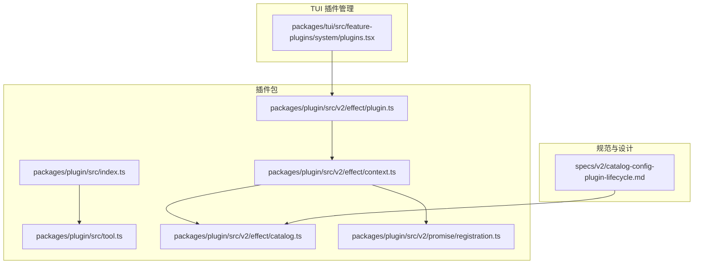
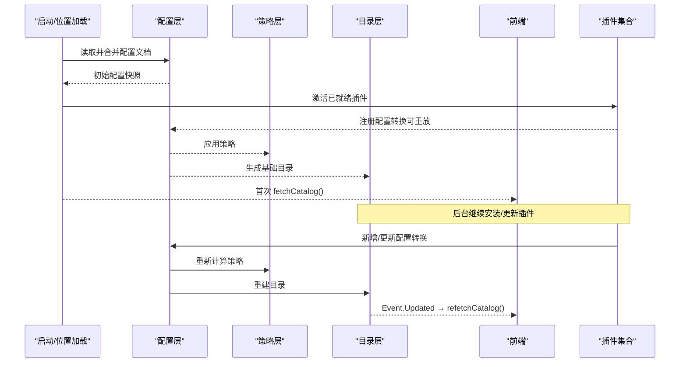
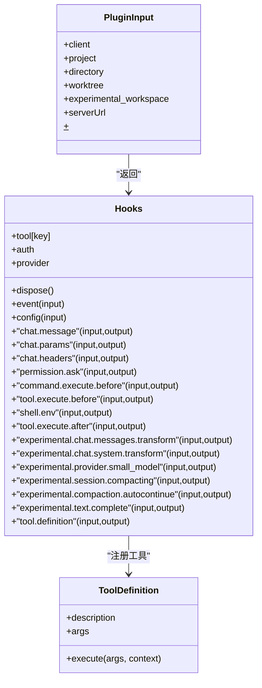
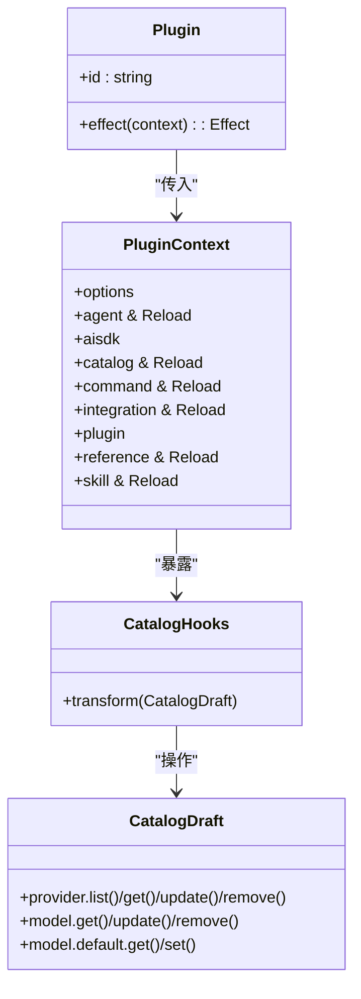
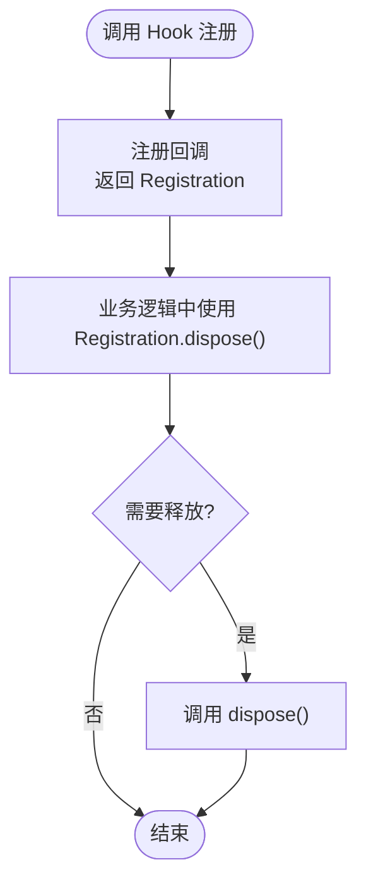
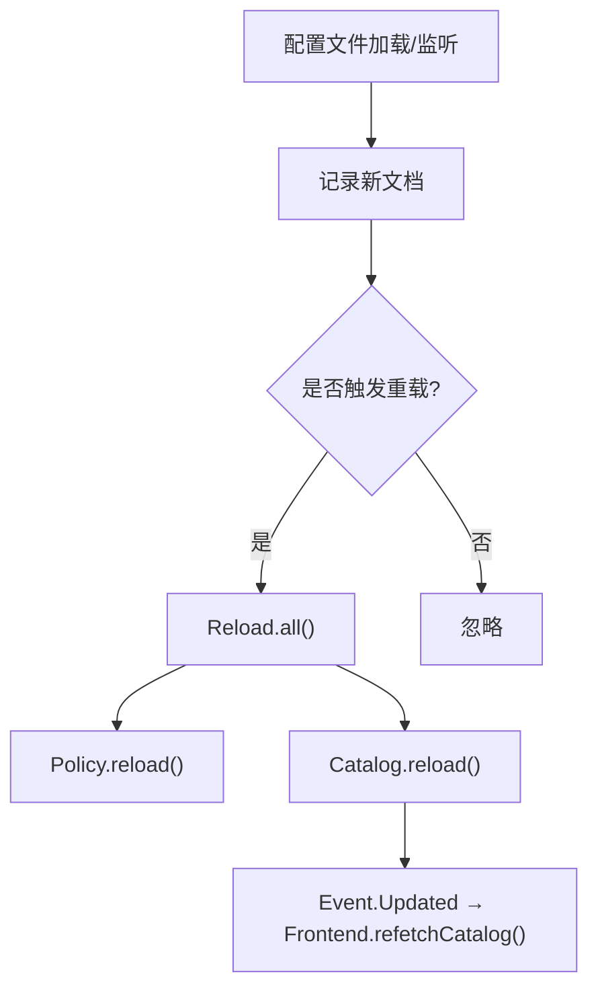
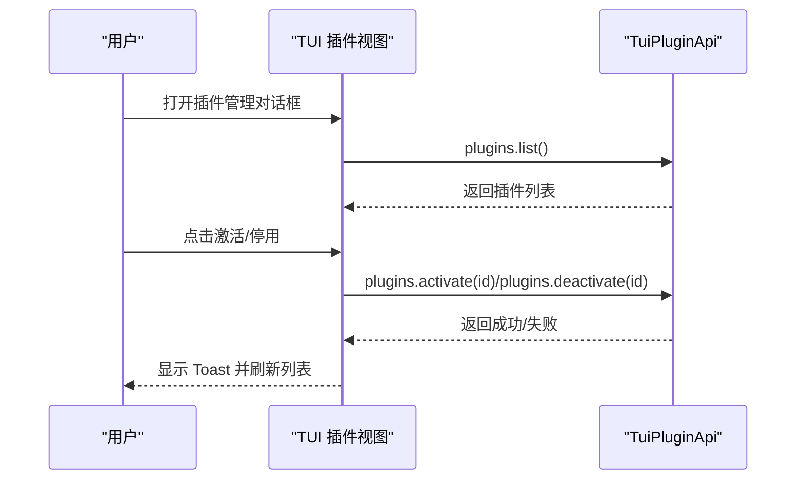
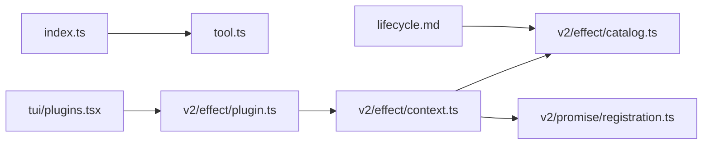

# 插件系统 API

<cite>
**本文引用的文件**   
- [packages/plugin/src/index.ts](file://packages/plugin/src/index.ts)
- [packages/plugin/src/tool.ts](file://packages/plugin/src/tool.ts)
- [packages/plugin/src/v2/effect/plugin.ts](file://packages/plugin/src/v2/effect/plugin.ts)
- [packages/plugin/src/v2/effect/context.ts](file://packages/plugin/src/v2/effect/context.ts)
- [packages/plugin/src/v2/effect/catalog.ts](file://packages/plugin/src/v2/effect/catalog.ts)
- [packages/plugin/src/v2/promise/registration.ts](file://packages/plugin/src/v2/promise/registration.ts)
- [specs/v2/catalog-config-plugin-lifecycle.md](file://specs/v2/catalog-config-plugin-lifecycle.md)
- [packages/tui/src/feature-plugins/system/plugins.tsx](file://packages/tui/src/feature-plugins/system/plugins.tsx)
</cite>

## 目录
1. [简介](#简介)
2. [项目结构](#项目结构)
3. [核心组件](#核心组件)
4. [架构总览](#架构总览)
5. [详细组件分析](#详细组件分析)
6. [依赖关系分析](#依赖关系分析)
7. [性能与可靠性](#性能与可靠性)
8. [故障排查指南](#故障排查指南)
9. [结论](#结论)
10. [附录：API 端点与示例](#附录api-端点与示例)

## 简介
本文件为 openNovel 插件系统的 API 文档，聚焦于插件生命周期管理、钩子机制、扩展点接口规范与用法。内容涵盖插件开发接口、配置选项、通信协议以及安装、卸载、更新等管理操作的可用能力。通过分层说明与图示，帮助开发者快速理解并集成自定义功能。

## 项目结构
插件系统主要位于 packages/plugin 包内，提供两类插件形态：
- v1 风格插件：基于函数式 Hooks 的插件入口（index.ts），用于定义工具、认证、提供者、聊天流程等钩子。
- v2 Effect 风格插件：基于 Effect 的插件定义与上下文（effect/*），提供 Catalog、Agent、Command、Skill、Reference 等扩展域。

此外，v2 的注册与重载抽象在 promise/registration.ts 中定义；插件生命周期设计在 specs/v2/catalog-config-plugin-lifecycle.md 中给出；TUI 层提供了插件列表、激活/停用、安装界面等交互能力。

图表来源
- [packages/plugin/src/index.ts:1-354](file://packages/plugin/src/index.ts#L1-L354)
- [packages/plugin/src/tool.ts:1-55](file://packages/plugin/src/tool.ts#L1-L55)
- [packages/plugin/src/v2/effect/plugin.ts:1-17](file://packages/plugin/src/v2/effect/plugin.ts#L1-L17)
- [packages/plugin/src/v2/effect/context.ts:1-23](file://packages/plugin/src/v2/effect/context.ts#L1-L23)
- [packages/plugin/src/v2/effect/catalog.ts:1-30](file://packages/plugin/src/v2/effect/catalog.ts#L1-L30)
- [packages/plugin/src/v2/promise/registration.ts:1-11](file://packages/plugin/src/v2/promise/registration.ts#L1-L11)
- [specs/v2/catalog-config-plugin-lifecycle.md:1-325](file://specs/v2/catalog-config-plugin-lifecycle.md#L1-L325)
- [packages/tui/src/feature-plugins/system/plugins.tsx:146-236](file://packages/tui/src/feature-plugins/system/plugins.tsx#L146-L236)

章节来源
- [packages/plugin/src/index.ts:1-354](file://packages/plugin/src/index.ts#L1-L354)
- [packages/plugin/src/tool.ts:1-55](file://packages/plugin/src/tool.ts#L1-L55)
- [packages/plugin/src/v2/effect/plugin.ts:1-17](file://packages/plugin/src/v2/effect/plugin.ts#L1-L17)
- [packages/plugin/src/v2/effect/context.ts:1-23](file://packages/plugin/src/v2/effect/context.ts#L1-L23)
- [packages/plugin/src/v2/effect/catalog.ts:1-30](file://packages/plugin/src/v2/effect/catalog.ts#L1-L30)
- [packages/plugin/src/v2/promise/registration.ts:1-11](file://packages/plugin/src/v2/promise/registration.ts#L1-L11)
- [specs/v2/catalog-config-plugin-lifecycle.md:1-325](file://specs/v2/catalog-config-plugin-lifecycle.md#L1-L325)
- [packages/tui/src/feature-plugins/system/plugins.tsx:146-236](file://packages/tui/src/feature-plugins/system/plugins.tsx#L146-L236)

## 核心组件
- 插件入口与类型
  - 插件函数签名与输入输出：包含 client、project、directory、worktree、serverUrl、shell 等运行时上下文，以及可返回的 Hooks。
  - 配置扩展：Config.plugin、agent 权限策略等。
- 工具系统
  - ToolDefinition 描述工具的参数 schema、执行上下文与结果格式。
- v2 Effect 插件
  - Plugin.define 定义插件 ID 与 effect 初始化逻辑。
  - PluginContext 暴露 agent、aisdk、catalog、command、integration、plugin、reference、skill 等扩展域及 Reload 能力。
- Catalog 扩展
  - CatalogDraft 提供 provider/model 的增删改查与默认模型设置。
- 注册与重载
  - Registration 表示可释放的资源句柄；Reload 提供统一的重载入口。

章节来源
- [packages/plugin/src/index.ts:56-92](file://packages/plugin/src/index.ts#L56-L92)
- [packages/plugin/src/index.ts:79-92](file://packages/plugin/src/index.ts#L79-L92)
- [packages/plugin/src/index.ts:240-354](file://packages/plugin/src/index.ts#L240-L354)
- [packages/plugin/src/tool.ts:1-55](file://packages/plugin/src/tool.ts#L1-L55)
- [packages/plugin/src/v2/effect/plugin.ts:1-17](file://packages/plugin/src/v2/effect/plugin.ts#L1-L17)
- [packages/plugin/src/v2/effect/context.ts:1-23](file://packages/plugin/src/v2/effect/context.ts#L1-L23)
- [packages/plugin/src/v2/effect/catalog.ts:1-30](file://packages/plugin/src/v2/effect/catalog.ts#L1-L30)
- [packages/plugin/src/v2/promise/registration.ts:1-11](file://packages/plugin/src/v2/promise/registration.ts#L1-L11)

## 架构总览
插件系统采用“配置转换 + Catalog 变换”的双轨设计：
- 配置转换（Config Transform）：插件以可重放的方式修改全局配置，触发全量服务重载（Policy/Catalog/Agent/MCP 等）。
- Catalog 变换（Catalog Transform）：插件直接对 Catalog 草稿进行变更，内部重建后发布事件，前端拉取更新。

图表来源
- [specs/v2/catalog-config-plugin-lifecycle.md:53-84](file://specs/v2/catalog-config-plugin-lifecycle.md#L53-L84)
- [specs/v2/catalog-config-plugin-lifecycle.md:212-240](file://specs/v2/catalog-config-plugin-lifecycle.md#L212-L240)

章节来源
- [specs/v2/catalog-config-plugin-lifecycle.md:1-325](file://specs/v2/catalog-config-plugin-lifecycle.md#L1-L325)

## 详细组件分析

### 插件入口与钩子系统（v1）
- 插件函数接收运行时上下文（client、project、directory、worktree、serverUrl、shell），返回 Hooks。
- Hooks 覆盖认证、提供者、工具、聊天消息与参数、命令执行、权限、会话压缩、文本补全等扩展点。
- 工具定义使用 tool(schema, execute) 声明参数与执行逻辑，支持附件与元数据。

图表来源
- [packages/plugin/src/index.ts:56-92](file://packages/plugin/src/index.ts#L56-L92)
- [packages/plugin/src/index.ts:240-354](file://packages/plugin/src/index.ts#L240-L354)
- [packages/plugin/src/tool.ts:1-55](file://packages/plugin/src/tool.ts#L1-L55)

章节来源
- [packages/plugin/src/index.ts:56-92](file://packages/plugin/src/index.ts#L56-L92)
- [packages/plugin/src/index.ts:240-354](file://packages/plugin/src/index.ts#L240-L354)
- [packages/plugin/src/tool.ts:1-55](file://packages/plugin/src/tool.ts#L1-L55)

### v2 Effect 插件与上下文
- 插件通过 define(plugin) 声明 id 与 effect 初始化逻辑。
- PluginContext 提供各扩展域的 Hooks 与 Reload 能力，便于插件间协作与状态刷新。

图表来源
- [packages/plugin/src/v2/effect/plugin.ts:1-17](file://packages/plugin/src/v2/effect/plugin.ts#L1-L17)
- [packages/plugin/src/v2/effect/context.ts:1-23](file://packages/plugin/src/v2/effect/context.ts#L1-L23)
- [packages/plugin/src/v2/effect/catalog.ts:1-30](file://packages/plugin/src/v2/effect/catalog.ts#L1-L30)

章节来源
- [packages/plugin/src/v2/effect/plugin.ts:1-17](file://packages/plugin/src/v2/effect/plugin.ts#L1-L17)
- [packages/plugin/src/v2/effect/context.ts:1-23](file://packages/plugin/src/v2/effect/context.ts#L1-L23)
- [packages/plugin/src/v2/effect/catalog.ts:1-30](file://packages/plugin/src/v2/effect/catalog.ts#L1-L30)

### 注册与重载抽象
- Registration 表示资源释放句柄，用于取消订阅或清理副作用。
- Reload 提供统一的 reload 方法，供各扩展域触发状态重建。

图表来源
- [packages/plugin/src/v2/promise/registration.ts:1-11](file://packages/plugin/src/v2/promise/registration.ts#L1-L11)

章节来源
- [packages/plugin/src/v2/promise/registration.ts:1-11](file://packages/plugin/src/v2/promise/registration.ts#L1-L11)

### 插件生命周期与重载策略
- 初始加载：先构建基础快照，后台并发安装/更新插件，完成后激活并触发重载。
- 配置变更：配置源监听编辑，触发全量重载（Policy/Catalog/Agent/MCP）。
- models.dev 与 Auth：作为配置转换或 Catalog 变换参与重建。
- 插件启用/禁用：启用时注册 transform，禁用时关闭作用域并移除 transform，随后重建。

图表来源
- [specs/v2/catalog-config-plugin-lifecycle.md:86-112](file://specs/v2/catalog-config-plugin-lifecycle.md#L86-L112)
- [specs/v2/catalog-config-plugin-lifecycle.md:114-127](file://specs/v2/catalog-config-plugin-lifecycle.md#L114-L127)
- [specs/v2/catalog-config-plugin-lifecycle.md:128-153](file://specs/v2/catalog-config-plugin-lifecycle.md#L128-L153)

章节来源
- [specs/v2/catalog-config-plugin-lifecycle.md:1-325](file://specs/v2/catalog-config-plugin-lifecycle.md#L1-L325)

### TUI 插件管理与交互
- 提供插件列表展示、激活/停用切换、安装对话框等功能。
- 通过 api.plugins.list/activate/deactivate 等接口驱动 UI 状态。

图表来源
- [packages/tui/src/feature-plugins/system/plugins.tsx:146-236](file://packages/tui/src/feature-plugins/system/plugins.tsx#L146-L236)

章节来源
- [packages/tui/src/feature-plugins/system/plugins.tsx:146-236](file://packages/tui/src/feature-plugins/system/plugins.tsx#L146-L236)

## 依赖关系分析
- index.ts 导出插件入口与 Hooks 类型，tool.ts 提供工具定义。
- v2 插件通过 plugin.ts 定义插件结构，context.ts 聚合各扩展域 Hooks。
- catalog.ts 定义 Catalog 扩展点与草稿操作。
- registration.ts 提供通用的注册与重载抽象。
- lifecycle 规范文件定义了配置与 Catalog 变换的时序与约束。
- TUI 插件管理模块依赖上述能力实现用户交互。

图表来源
- [packages/plugin/src/index.ts:1-354](file://packages/plugin/src/index.ts#L1-L354)
- [packages/plugin/src/tool.ts:1-55](file://packages/plugin/src/tool.ts#L1-L55)
- [packages/plugin/src/v2/effect/plugin.ts:1-17](file://packages/plugin/src/v2/effect/plugin.ts#L1-L17)
- [packages/plugin/src/v2/effect/context.ts:1-23](file://packages/plugin/src/v2/effect/context.ts#L1-L23)
- [packages/plugin/src/v2/effect/catalog.ts:1-30](file://packages/plugin/src/v2/effect/catalog.ts#L1-L30)
- [packages/plugin/src/v2/promise/registration.ts:1-11](file://packages/plugin/src/v2/promise/registration.ts#L1-L11)
- [specs/v2/catalog-config-plugin-lifecycle.md:1-325](file://specs/v2/catalog-config-plugin-lifecycle.md#L1-L325)
- [packages/tui/src/feature-plugins/system/plugins.tsx:146-236](file://packages/tui/src/feature-plugins/system/plugins.tsx#L146-L236)

章节来源
- [packages/plugin/src/index.ts:1-354](file://packages/plugin/src/index.ts#L1-L354)
- [packages/plugin/src/tool.ts:1-55](file://packages/plugin/src/tool.ts#L1-L55)
- [packages/plugin/src/v2/effect/plugin.ts:1-17](file://packages/plugin/src/v2/effect/plugin.ts#L1-L17)
- [packages/plugin/src/v2/effect/context.ts:1-23](file://packages/plugin/src/v2/effect/context.ts#L1-L23)
- [packages/plugin/src/v2/effect/catalog.ts:1-30](file://packages/plugin/src/v2/effect/catalog.ts#L1-L30)
- [packages/plugin/src/v2/promise/registration.ts:1-11](file://packages/plugin/src/v2/promise/registration.ts#L1-L11)
- [specs/v2/catalog-config-plugin-lifecycle.md:1-325](file://specs/v2/catalog-config-plugin-lifecycle.md#L1-L325)
- [packages/tui/src/feature-plugins/system/plugins.tsx:146-236](file://packages/tui/src/feature-plugins/system/plugins.tsx#L146-L236)

## 性能与可靠性
- 配置转换与 Catalog 变换均为可重放操作，确保禁用插件时无需手动撤销。
- 全量重载仅在配置或变换变化时触发，避免频繁重建。
- 后台并发安装/更新插件，不阻塞位置就绪；完成后的激活会批量去抖触发重载。
- Catalog 每次内部重建最多产生一次 Updated 事件，减少前端重复请求。

章节来源
- [specs/v2/catalog-config-plugin-lifecycle.md:180-189](file://specs/v2/catalog-config-plugin-lifecycle.md#L180-L189)
- [specs/v2/catalog-config-plugin-lifecycle.md:212-240](file://specs/v2/catalog-config-plugin-lifecycle.md#L212-L240)

## 故障排查指南
- 插件未生效
  - 检查插件是否被正确激活（TUI 列表中的 active 状态）。
  - 确认插件的 transform 是否注册成功，并在 Reload 后生效。
- 配置未更新
  - 确认配置源监听是否触发，Reload.all() 是否被执行。
  - 查看 Catalog.Event.Updated 是否发出，前端是否 refetchCatalog。
- 工具未调用
  - 校验 ToolDefinition 的参数 schema 是否符合预期。
  - 检查 tool.execute.before/after 钩子是否拦截或修改了参数/输出。
- 认证失败
  - 核对 AuthHook 的 authorize 回调返回值与字段。
  - 确认 OAuth 回调地址与 token 交换逻辑是否正确。

章节来源
- [packages/plugin/src/index.ts:240-354](file://packages/plugin/src/index.ts#L240-L354)
- [packages/plugin/src/tool.ts:1-55](file://packages/plugin/src/tool.ts#L1-L55)
- [specs/v2/catalog-config-plugin-lifecycle.md:86-112](file://specs/v2/catalog-config-plugin-lifecycle.md#L86-L112)

## 结论
openNovel 插件系统通过配置转换与 Catalog 变换双轨机制，实现了灵活可扩展的插件生态。v1 钩子体系覆盖认证、工具、聊天流程等关键扩展点；v2 Effect 插件提供更强的领域建模与状态管理能力。结合 TUI 的插件管理界面，开发者可以快速集成自定义功能并进行调试与维护。

## 附录：API 端点与示例
- 插件管理（TUI 侧）
  - 列出插件：plugins.list()
  - 激活插件：plugins.activate(id)
  - 停用插件：plugins.deactivate(id)
  - 安装插件：通过安装对话框触发（具体后端端点由上层控制平面提供）
- 配置与重载
  - 配置变更触发 Reload.all()，依次执行 Policy.reload()、Catalog.reload()，最终通知前端 refetchCatalog()。
- 工具开发示例
  - 使用 tool({ description, args, execute }) 定义工具，参数由 Zod schema 校验，执行上下文包含 sessionID、messageID、agent、directory、worktree、abort、metadata、ask 等。
- 认证扩展示例
  - 通过 AuthHook.methods 定义 oauth 或 api 授权方式，返回 success/failed 结果，支持自动或代码模式回调。

章节来源
- [packages/tui/src/feature-plugins/system/plugins.tsx:146-236](file://packages/tui/src/feature-plugins/system/plugins.tsx#L146-L236)
- [specs/v2/catalog-config-plugin-lifecycle.md:86-112](file://specs/v2/catalog-config-plugin-lifecycle.md#L86-L112)
- [packages/plugin/src/tool.ts:1-55](file://packages/plugin/src/tool.ts#L1-L55)
- [packages/plugin/src/index.ts:106-238](file://packages/plugin/src/index.ts#L106-L238)