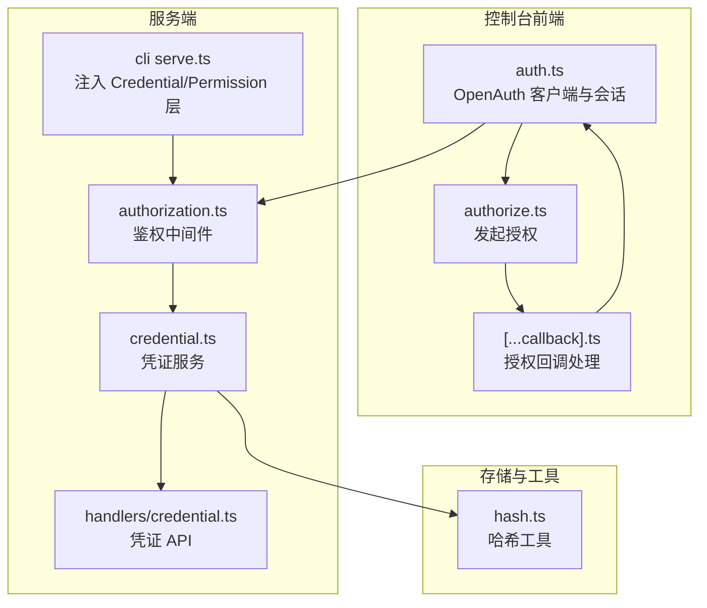
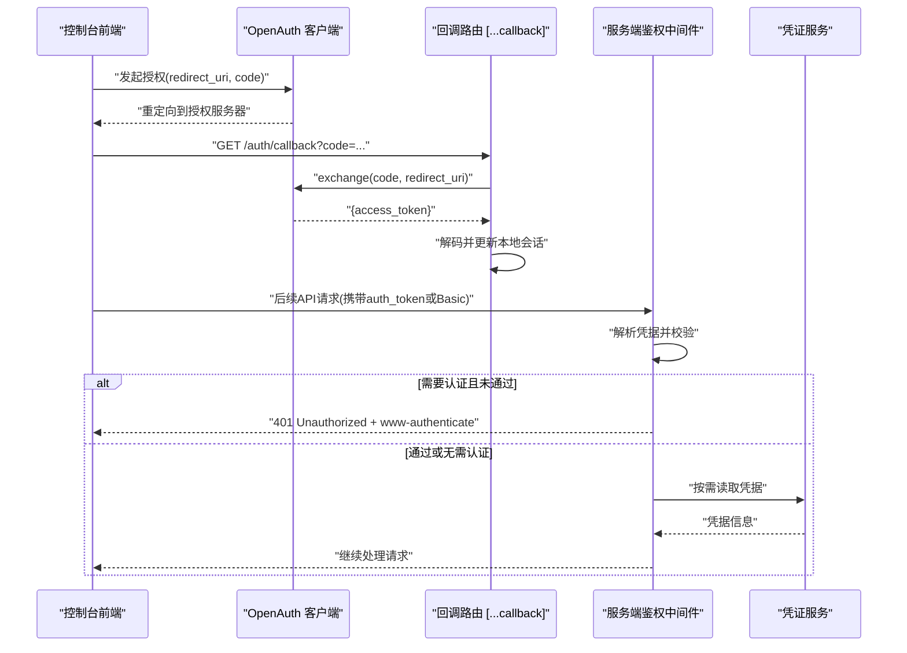
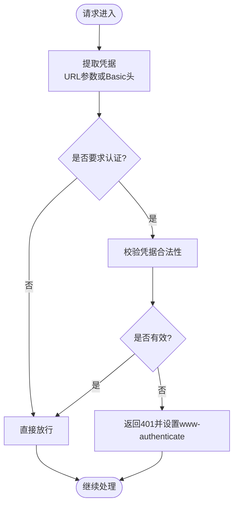
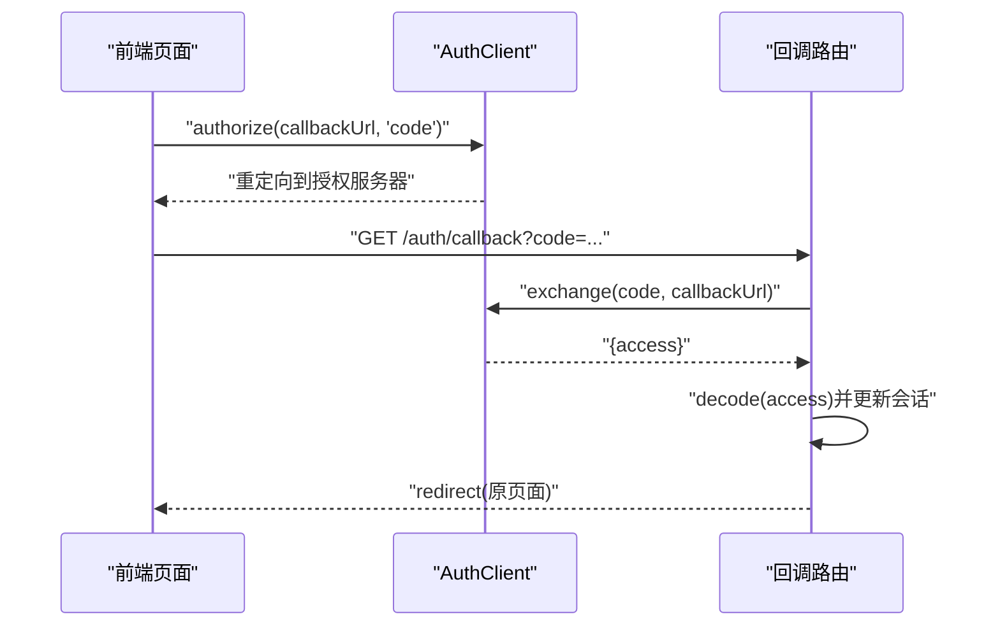
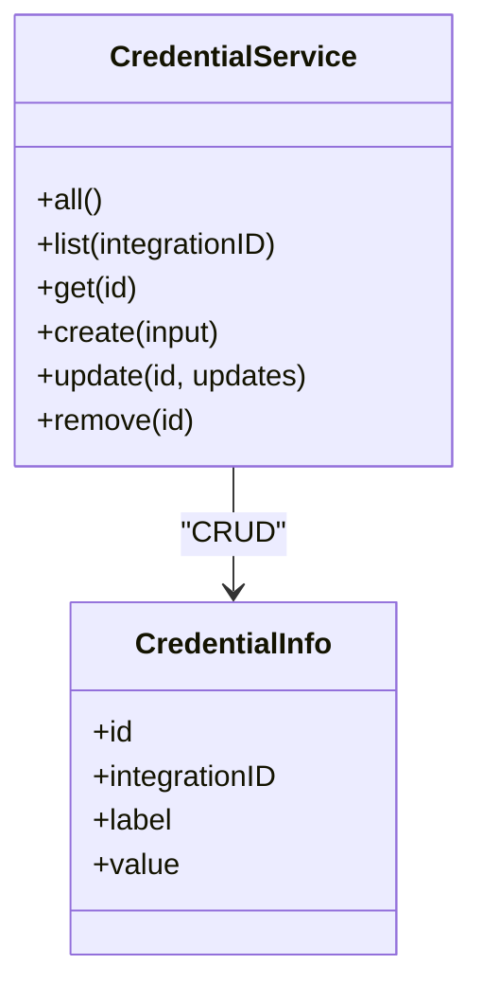
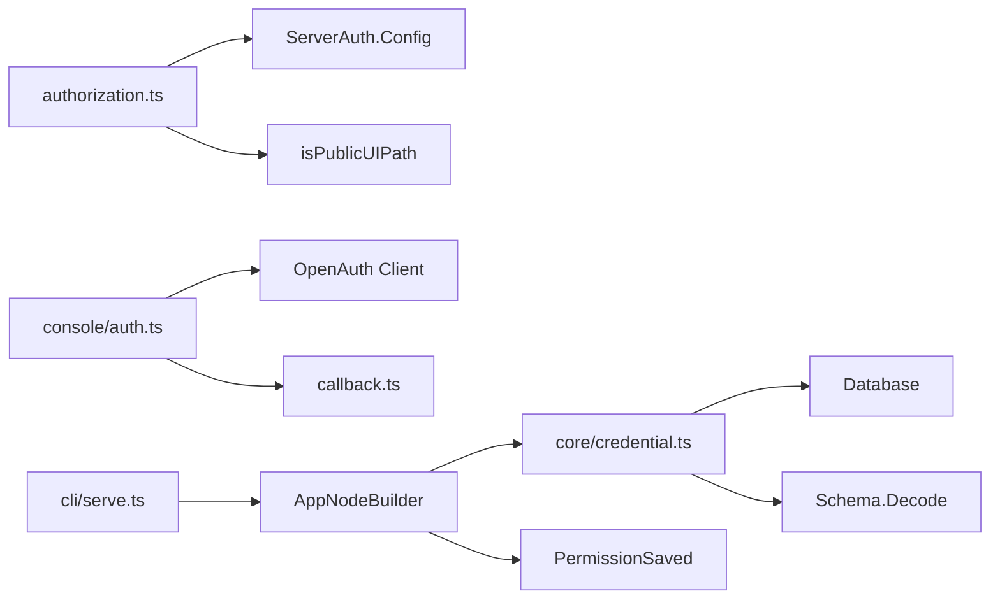

# 用户认证 API

<cite>
**本文引用的文件**   
- [packages/opencode/src/auth/index.ts](file://packages/opencode/src/auth/index.ts)
- [packages/opencode/src/server/routes/instance/httpapi/middleware/authorization.ts](file://packages/opencode/src/server/routes/instance/httpapi/middleware/authorization.ts)
- [packages/console/app/src/context/auth.ts](file://packages/console/app/src/context/auth.ts)
- [packages/console/app/src/routes/auth/[...callback].ts](file://packages/console/app/src/routes/auth/[...callback].ts)
- [packages/console/app/src/routes/auth/authorize.ts](file://packages/console/app/src/routes/auth/authorize.ts)
- [packages/core/src/credential.ts](file://packages/core/src/credential.ts)
- [packages/server/src/handlers/credential.ts](file://packages/server/src/handlers/credential.ts)
- [packages/cli/src/commands/handlers/serve.ts](file://packages/cli/src/commands/handlers/serve.ts)
- [packages/core/src/util/hash.ts](file://packages/core/src/util/hash.ts)
</cite>

## 目录
1. [简介](#简介)
2. [项目结构](#项目结构)
3. [核心组件](#核心组件)
4. [架构总览](#架构总览)
5. [详细组件分析](#详细组件分析)
6. [依赖关系分析](#依赖关系分析)
7. [性能与安全考量](#性能与安全考量)
8. [故障排查指南](#故障排查指南)
9. [结论](#结论)
10. [附录](#附录)

## 简介
本文件为 openNovel 的用户认证 API 提供系统化文档，覆盖用户注册、登录、权限验证、会话管理等安全相关接口。重点说明：
- 认证方式与令牌机制（Basic 凭据、OAuth 回调、服务端鉴权中间件）
- 角色与权限控制（会话级权限请求与保存策略）
- 密码与密钥存储（数据库凭证表、加密哈希工具）
- 前端集成流程（OpenAuth 客户端、回调处理、会话管理）
- 后端验证流程（中间件解析、授权校验、错误响应）

注意：当前仓库未实现基于 JWT 的无状态令牌签发与校验；认证主要采用 Basic 凭据与 OAuth 回调模式，配合服务端鉴权中间件完成访问控制。

## 项目结构
与认证相关的代码分布在以下模块：
- 服务端鉴权中间件：负责从请求中提取并校验凭据
- 控制台前端：使用 OpenAuth 客户端发起授权与回调处理，维护本地会话
- 凭证服务：持久化集成凭据（如 OAuth Token），提供 CRUD 能力
- CLI 启动器：注入认证与权限层到 HTTP 路由
- 哈希工具：提供快速哈希函数（用于密码或密钥摘要）

**图表来源** 
- [packages/console/app/src/context/auth.ts:1-117](file://packages/console/app/src/context/auth.ts#L1-L117)
- [packages/console/app/src/routes/auth/[...callback].ts](file://packages/console/app/src/routes/auth/[...callback].ts#L1-L47)
- [packages/console/app/src/routes/auth/authorize.ts:1-11](file://packages/console/app/src/routes/auth/authorize.ts#L1-L11)
- [packages/opencode/src/server/routes/instance/httpapi/middleware/authorization.ts:1-151](file://packages/opencode/src/server/routes/instance/httpapi/middleware/authorization.ts#L1-L151)
- [packages/core/src/credential.ts:1-139](file://packages/core/src/credential.ts#L1-L139)
- [packages/server/src/handlers/credential.ts:1-23](file://packages/server/src/handlers/credential.ts#L1-L23)
- [packages/cli/src/commands/handlers/serve.ts:30-46](file://packages/cli/src/commands/handlers/serve.ts#L30-L46)
- [packages/core/src/util/hash.ts:1-11](file://packages/core/src/util/hash.ts#L1-L11)

**章节来源**
- [packages/opencode/src/server/routes/instance/httpapi/middleware/authorization.ts:1-151](file://packages/opencode/src/server/routes/instance/httpapi/middleware/authorization.ts#L1-L151)
- [packages/console/app/src/context/auth.ts:1-117](file://packages/console/app/src/context/auth.ts#L1-L117)
- [packages/core/src/credential.ts:1-139](file://packages/core/src/credential.ts#L1-L139)
- [packages/cli/src/commands/handlers/serve.ts:30-46](file://packages/cli/src/commands/handlers/serve.ts#L30-L46)

## 核心组件
- 服务端鉴权中间件
  - 支持从 URL 查询参数 auth_token 或 Authorization: Basic 头提取凭据
  - 根据配置决定是否强制要求认证，未通过则返回 401 并设置 www-authenticate
  - 对公开 UI 路径和 PTY 连接票据路径进行豁免
- 控制台认证客户端与会话
  - 使用 OpenAuth 客户端发起授权码流程，回调中交换 access token 并更新本地会话
  - 通过 useAuthSession 维护多账户与会话状态
- 凭证服务
  - 以数据库表存储集成凭据（含 OAuth 类型），提供 all/list/get/create/update/remove
  - 写入时按 integrationID 替换旧值，保证唯一性
- CLI 启动器
  - 在构建路由时注入 Credential 与 PermissionSaved 层，使权限与凭据可用

**章节来源**
- [packages/opencode/src/server/routes/instance/httpapi/middleware/authorization.ts:1-151](file://packages/opencode/src/server/routes/instance/httpapi/middleware/authorization.ts#L1-L151)
- [packages/console/app/src/context/auth.ts:1-117](file://packages/console/app/src/context/auth.ts#L1-L117)
- [packages/core/src/credential.ts:1-139](file://packages/core/src/credential.ts#L1-L139)
- [packages/cli/src/commands/handlers/serve.ts:30-46](file://packages/cli/src/commands/handlers/serve.ts#L30-L46)

## 架构总览
下图展示从前端发起授权到服务端鉴权的端到端流程。

**图表来源** 
- [packages/console/app/src/routes/auth/authorize.ts:1-11](file://packages/console/app/src/routes/auth/authorize.ts#L1-L11)
- [packages/console/app/src/routes/auth/[...callback].ts](file://packages/console/app/src/routes/auth/[...callback].ts#L1-L47)
- [packages/opencode/src/server/routes/instance/httpapi/middleware/authorization.ts:1-151](file://packages/opencode/src/server/routes/instance/httpapi/middleware/authorization.ts#L1-L151)
- [packages/core/src/credential.ts:1-139](file://packages/core/src/credential.ts#L1-L139)

## 详细组件分析

### 服务端鉴权中间件（Authorization）
- 功能要点
  - 从 URL 查询参数 auth_token 或 Authorization: Basic 头解析用户名与密码
  - 若配置要求认证且凭据不合法，返回 401 并附加 www-authenticate 头
  - 对公开 UI 路径与 PTY 票据路径放行
- 数据流
  - 请求进入 -> 提取凭据 -> 校验配置 -> 放行或拒绝

**图表来源** 
- [packages/opencode/src/server/routes/instance/httpapi/middleware/authorization.ts:1-151](file://packages/opencode/src/server/routes/instance/httpapi/middleware/authorization.ts#L1-L151)

**章节来源**
- [packages/opencode/src/server/routes/instance/httpapi/middleware/authorization.ts:1-151](file://packages/opencode/src/server/routes/instance/httpapi/middleware/authorization.ts#L1-L151)

### 控制台认证客户端与会话（OpenAuth）
- 功能要点
  - 使用 createClient 初始化 OpenAuth 客户端，指定 clientID 与 issuer
  - authorize 发起授权码流程，回调中 exchange 获取 access token
  - decode 解析 token 并更新本地会话，记录当前账户与邮箱
- 典型流程
  - GET /auth/authorize -> 重定向到授权服务器
  - GET /auth/callback?code=... -> 交换 token -> 更新会话 -> 跳转回原页面

**图表来源** 
- [packages/console/app/src/context/auth.ts:1-117](file://packages/console/app/src/context/auth.ts#L1-L117)
- [packages/console/app/src/routes/auth/authorize.ts:1-11](file://packages/console/app/src/routes/auth/authorize.ts#L1-L11)
- [packages/console/app/src/routes/auth/[...callback].ts](file://packages/console/app/src/routes/auth/[...callback].ts#L1-L47)

**章节来源**
- [packages/console/app/src/context/auth.ts:1-117](file://packages/console/app/src/context/auth.ts#L1-L117)
- [packages/console/app/src/routes/auth/authorize.ts:1-11](file://packages/console/app/src/routes/auth/authorize.ts#L1-L11)
- [packages/console/app/src/routes/auth/[...callback].ts](file://packages/console/app/src/routes/auth/[...callback].ts#L1-L47)

### 凭证服务（Credential Service）
- 功能要点
  - 提供凭证的增删改查，按 integrationID 唯一存储
  - 支持 OAuth、Key、Value 等类型，value 字段经 Schema 解码
  - 写入时使用事务确保一致性
- 数据结构
  - id、integrationID、label、value（包含 OAuth/Key/Value 等子类型）

**图表来源** 
- [packages/core/src/credential.ts:1-139](file://packages/core/src/credential.ts#L1-L139)

**章节来源**
- [packages/core/src/credential.ts:1-139](file://packages/core/src/credential.ts#L1-L139)
- [packages/server/src/handlers/credential.ts:1-23](file://packages/server/src/handlers/credential.ts#L1-L23)

### CLI 启动器与认证/权限层注入
- 功能要点
  - 在构建 HTTP 路由时注入 Credential 与 PermissionSaved 层
  - 提供端口选择与监听逻辑，确保认证与权限服务可用

**章节来源**
- [packages/cli/src/commands/handlers/serve.ts:30-46](file://packages/cli/src/commands/handlers/serve.ts#L30-L46)

### 哈希工具（Hash）
- 功能要点
  - 提供 fast（SHA1）与 sha256 哈希方法，可用于密码或密钥摘要
- 使用建议
  - 生产环境建议使用更安全的算法（如 bcrypt/scrypt）并结合盐值

**章节来源**
- [packages/core/src/util/hash.ts:1-11](file://packages/core/src/util/hash.ts#L1-L11)

## 依赖关系分析
- 中间件依赖 ServerAuth.Config 与公共路径判断
- 前端依赖 OpenAuth 客户端与服务端回调
- 凭证服务依赖数据库与 Schema 解码
- CLI 启动器依赖 AppNodeBuilder 注入认证与权限层

**图表来源** 
- [packages/opencode/src/server/routes/instance/httpapi/middleware/authorization.ts:1-151](file://packages/opencode/src/server/routes/instance/httpapi/middleware/authorization.ts#L1-L151)
- [packages/console/app/src/context/auth.ts:1-117](file://packages/console/app/src/context/auth.ts#L1-L117)
- [packages/core/src/credential.ts:1-139](file://packages/core/src/credential.ts#L1-L139)
- [packages/cli/src/commands/handlers/serve.ts:30-46](file://packages/cli/src/commands/handlers/serve.ts#L30-L46)

**章节来源**
- [packages/opencode/src/server/routes/instance/httpapi/middleware/authorization.ts:1-151](file://packages/opencode/src/server/routes/instance/httpapi/middleware/authorization.ts#L1-L151)
- [packages/console/app/src/context/auth.ts:1-117](file://packages/console/app/src/context/auth.ts#L1-L117)
- [packages/core/src/credential.ts:1-139](file://packages/core/src/credential.ts#L1-L139)
- [packages/cli/src/commands/handlers/serve.ts:30-46](file://packages/cli/src/commands/handlers/serve.ts#L30-L46)

## 性能与安全考量
- 性能
  - 鉴权中间件仅做轻量解析与配置检查，避免额外 I/O
  - 凭证服务使用数据库事务保证一致性，减少重复写入
- 安全
  - 敏感凭据使用 Redacted 封装，避免日志泄露
  - 401 响应附带 www-authenticate 头，提示客户端重新认证
  - 公开 UI 路径与 PTY 票据路径豁免，降低误拦截风险
  - 哈希工具仅提供基础摘要，生产环境应使用强哈希算法与盐值

[本节为通用指导，不直接分析具体文件]

## 故障排查指南
- 常见问题
  - 401 未授权：检查请求是否携带 auth_token 或 Authorization: Basic 头，确认配置是否要求认证
  - 回调失败：确认 exchange 调用成功，access token 是否正确解码并更新会话
  - 凭证读写异常：检查数据库连接与 Schema 解码是否成功
- 定位步骤
  - 查看中间件的 www-authenticate 响应头
  - 检查回调路由的错误信息与 cause
  - 验证凭证服务的 CRUD 操作返回值

**章节来源**
- [packages/opencode/src/server/routes/instance/httpapi/middleware/authorization.ts:1-151](file://packages/opencode/src/server/routes/instance/httpapi/middleware/authorization.ts#L1-L151)
- [packages/console/app/src/routes/auth/[...callback].ts](file://packages/console/app/src/routes/auth/[...callback].ts#L1-L47)
- [packages/core/src/credential.ts:1-139](file://packages/core/src/credential.ts#L1-L139)

## 结论
openNovel 的认证体系以 Basic 凭据与 OAuth 回调为核心，结合服务端鉴权中间件与凭证服务实现访问控制。前端通过 OpenAuth 客户端简化授权流程，后端通过中间件统一校验。当前未实现 JWT 无状态令牌，如需扩展可在此基础上引入令牌签发与校验机制。

[本节为总结，不直接分析具体文件]

## 附录
- 最佳实践
  - 使用 HTTPS 传输所有认证相关请求
  - 定期轮换密钥与令牌
  - 最小权限原则，限制凭据作用域
  - 审计与日志脱敏，避免泄露敏感信息

[本节为通用指导，不直接分析具体文件]