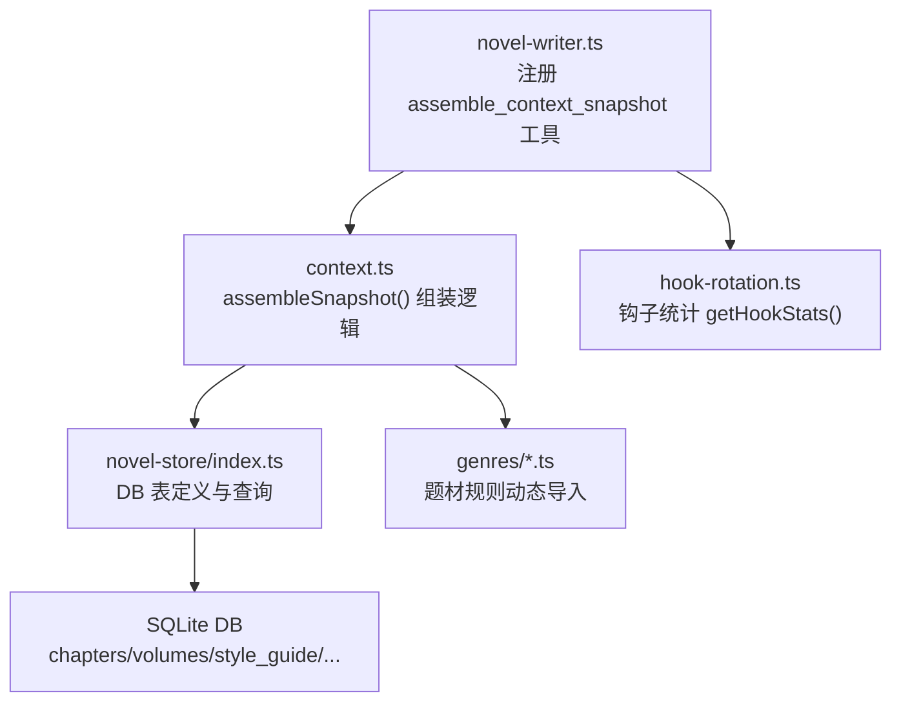
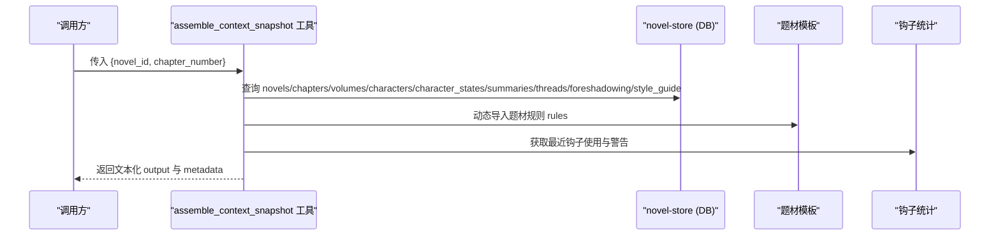
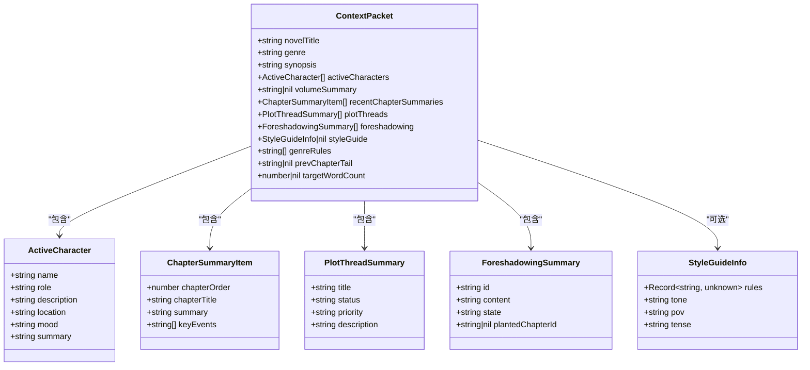
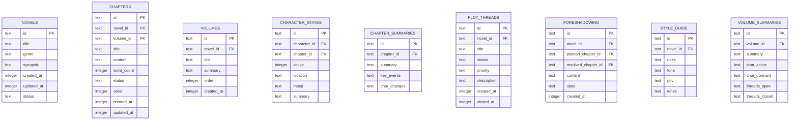
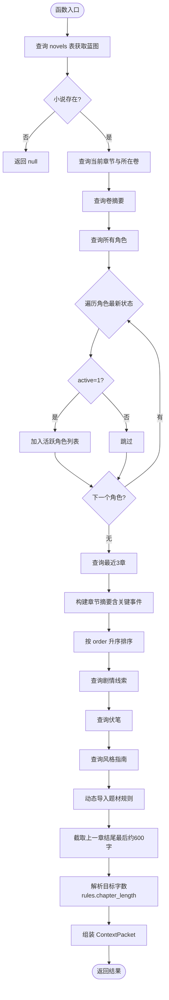
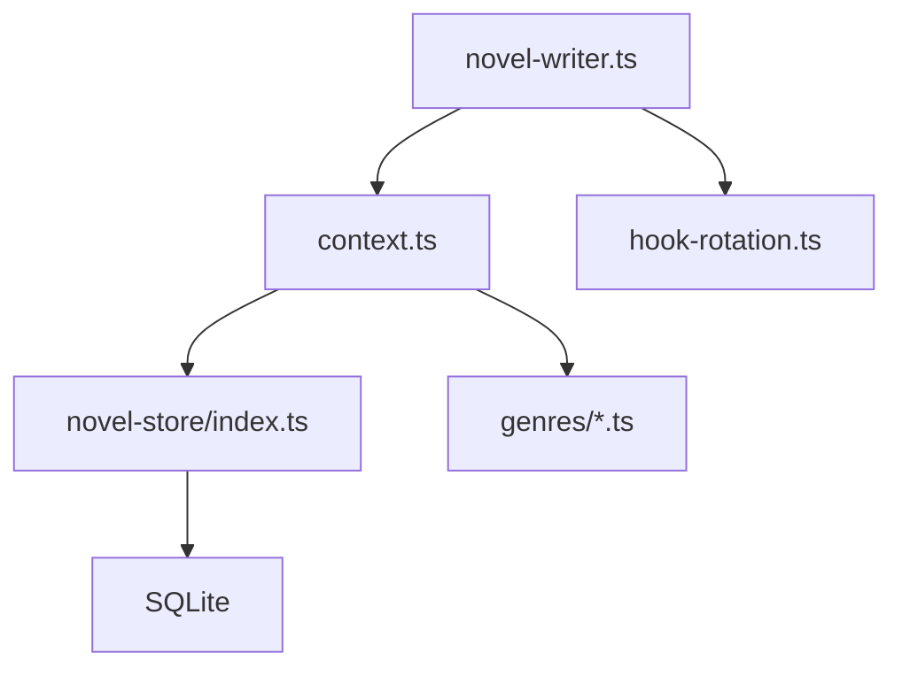

# 上下文快照 API

<cite>
**本文引用的文件**   
- [novel-writer.ts](file://packages/plugin/src/novel-writer.ts)
- [context.ts](file://packages/plugin/src/novel-writer/context.ts)
- [index.ts](file://packages/novel-store/src/index.ts)
- [schema.json](file://packages/core/schema.json)
- [20260721152252_novel_writing_tables.ts](file://packages/core/src/database/migration/20260721152252_novel_writing_tables.ts)
- [xuanhuan.ts](file://packages/plugin/src/novel-writer/genres/xuanhuan.ts)
- [xianxia.ts](file://packages/plugin/src/novel-writer/genres/xianxia.ts)
</cite>

## 目录
1. [简介](#简介)
2. [项目结构](#项目结构)
3. [核心组件](#核心组件)
4. [架构总览](#架构总览)
5. [详细组件分析](#详细组件分析)
6. [依赖关系分析](#依赖关系分析)
7. [性能考量](#性能考量)
8. [故障排查指南](#故障排查指南)
9. [结论](#结论)
10. [附录](#附录)

## 简介
本文件为 openNovel 的“上下文快照 API”提供完整技术文档，聚焦 assemble_context_snapshot 工具及其底层组装逻辑。该工具用于在小说写作流水线中（compose 阶段）聚合当前小说的关键上下文信息，包括：
- 小说蓝图（书名、题材、梗概）
- 活跃角色（名称、定位、描述、位置、情绪、状态摘要）
- 最近章节摘要（最多3章，含关键事件）
- 剧情线索与伏笔
- 风格指南与题材规则
- 上一章结尾原文片段与目标字数下限
- 钩子使用统计与轮换警告

上下文数据来源于本地 SQLite 数据库表，通过 Drizzle ORM 查询并结构化组装为 ContextPacket 数据包，供 AI 写作与审计环节使用。

## 项目结构
围绕上下文快照的核心代码分布在以下模块：
- 工具注册与调用入口：packages/plugin/src/novel-writer.ts
- 快照组装逻辑与类型定义：packages/plugin/src/novel-writer/context.ts
- 数据库表定义与访问封装：packages/novel-store/src/index.ts
- 题材模板规则加载：packages/plugin/src/novel-writer/genres/*.ts
- 迁移与 schema 校验：packages/core/src/database/migration/*.ts, packages/core/schema.json

**图示来源** 
- [novel-writer.ts:695-762](file://packages/plugin/src/novel-writer.ts#L695-L762)
- [context.ts:179-321](file://packages/plugin/src/novel-writer/context.ts#L179-L321)
- [index.ts:34-196](file://packages/novel-store/src/index.ts#L34-L196)
- [xuanhuan.ts:62-70](file://packages/plugin/src/novel-writer/genres/xuanhuan.ts#L62-L70)
- [xianxia.ts:62-70](file://packages/plugin/src/novel-writer/genres/xianxia.ts#L62-L70)

**章节来源**
- [novel-writer.ts:695-762](file://packages/plugin/src/novel-writer.ts#L695-L762)
- [context.ts:179-321](file://packages/plugin/src/novel-writer/context.ts#L179-L321)
- [index.ts:34-196](file://packages/novel-store/src/index.ts#L34-L196)

## 核心组件
- assemble_context_snapshot 工具
  - 作用：根据 novel_id 与 chapter_number 组装上下文快照，返回文本化输出与元数据。
  - 输入参数：
    - novel_id：小说 ID
    - chapter_number：当前章节序号
  - 输出：
    - output：包含蓝图、活跃角色、卷摘要、最近章节摘要、剧情线索、伏笔、风格指南、目标字数、上一章结尾片段、钩子统计等
    - metadata：如 character_count、plot_thread_count 等辅助计数

- assembleSnapshot 函数
  - 作用：从数据库读取并组装 ContextPacket 数据结构，按优先级分层（P0-P4），控制 token 预算。
  - 主要步骤：
    - P0：读取 novels 表获取蓝图
    - P1：读取 characters 与 character_states，过滤 active=1 的活跃角色
    - P2：读取 chapters 与 chapter_summaries，取最近3章并按 order 升序排列
    - P3：读取 plot_threads 与 foreshadowing
    - P4：读取 style_guide 与 genre rules（动态导入题材模板）
    - 附加：prevChapterTail（上一章结尾最后约600字）、targetWordCount（从 style_guide.rules.chapter_length 解析）

**章节来源**
- [novel-writer.ts:695-762](file://packages/plugin/src/novel-writer.ts#L695-L762)
- [context.ts:179-321](file://packages/plugin/src/novel-writer/context.ts#L179-L321)

## 架构总览
上下文快照 API 的整体流程如下：

**图示来源** 
- [novel-writer.ts:695-762](file://packages/plugin/src/novel-writer.ts#L695-L762)
- [context.ts:179-321](file://packages/plugin/src/novel-writer/context.ts#L179-L321)
- [index.ts:34-196](file://packages/novel-store/src/index.ts#L34-L196)

## 详细组件分析

### 上下文快照数据结构（ContextPacket）
- 字段说明：
  - novelTitle、genre、synopsis：小说蓝图
  - activeCharacters：活跃角色数组（name、role、description、location、mood、summary）
  - volumeSummary：当前卷摘要（可能为空）
  - recentChapterSummaries：最近3章摘要（chapterOrder、chapterTitle、summary、keyEvents）
  - plotThreads：剧情线索（title、status、priority、description）
  - foreshadowing：伏笔（id、content、state、plantedChapterId）
  - styleGuide：风格指南（rules、tone、pov、tense）
  - genreRules：题材规则字符串数组
  - prevChapterTail：上一章结尾片段（约600字）
  - targetWordCount：每章目标字数下限（来自 style_guide.rules.chapter_length）

**图示来源** 
- [context.ts:52-151](file://packages/plugin/src/novel-writer/context.ts#L52-L151)

**章节来源**
- [context.ts:52-151](file://packages/plugin/src/novel-writer/context.ts#L52-L151)

### 数据源与表结构
- 主要数据表：
  - novels：小说蓝图（id、title、genre、synopsis、status、时间戳）
  - chapters：章节（id、novel_id、volume_id、title、content、word_count、status、order、时间戳）
  - volumes：卷（id、novel_id、title、summary、order、时间戳）
  - character_states：角色状态（id、character_id、chapter_id、active、location、mood、summary）
  - chapter_summaries：章节摘要（id、chapter_id、summary、key_events、char_changes）
  - plot_threads：剧情线索（id、novel_id、title、status、priority、description、created_at、closed_at）
  - foreshadowing：伏笔（id、novel_id、planted_chapter_id、resolved_chapter_id、content、state、created_at）
  - style_guide：风格指南（id、novel_id、rules、tone、pov、tense）
  - volume_summaries：卷摘要（id、volume_id、summary、char_active、char_dormant、threads_open、threads_closed）

**图示来源** 
- [index.ts:34-196](file://packages/novel-store/src/index.ts#L34-L196)
- [20260721152252_novel_writing_tables.ts:60-88](file://packages/core/src/database/migration/20260721152252_novel_writing_tables.ts#L60-L88)
- [schema.json:1131-1193](file://packages/core/schema.json#L1131-L1193)

**章节来源**
- [index.ts:34-196](file://packages/novel-store/src/index.ts#L34-L196)
- [20260721152252_novel_writing_tables.ts:60-88](file://packages/core/src/database/migration/20260721152252_novel_writing_tables.ts#L60-L88)
- [schema.json:1131-1193](file://packages/core/schema.json#L1131-L1193)

### 组装流程与算法
- 流程图展示了 assembleSnapshot 的主要处理步骤与分支判断：

**图示来源** 
- [context.ts:179-321](file://packages/plugin/src/novel-writer/context.ts#L179-L321)

**章节来源**
- [context.ts:179-321](file://packages/plugin/src/novel-writer/context.ts#L179-L321)

### 工具调用示例
- 调用 assemble_context_snapshot：
  - 输入：{ novel_id: "xxx", chapter_number: 10 }
  - 输出：
    - output：包含蓝图、活跃角色、卷摘要、最近章节摘要、剧情线索、伏笔、风格指南、目标字数、上一章结尾片段、钩子统计等
    - metadata：character_count、plot_thread_count 等

- 典型使用场景：
  - 在系统提示注入 hook 中自动组装并注入到 output.system
  - 在 compose 阶段作为流水线步骤2，为 writer agent 提供结构化上下文

**章节来源**
- [novel-writer.ts:695-762](file://packages/plugin/src/novel-writer.ts#L695-L762)

## 依赖关系分析
- 模块耦合：
  - novel-writer.ts 依赖 context.ts 的 assembleSnapshot 与 parseStyleRules
  - context.ts 依赖 novel-store/index.ts 的表定义与查询
  - context.ts 动态导入 genres/*.ts 获取题材规则
  - novel-writer.ts 依赖 hook-rotation.ts 获取钩子统计

- 外部依赖：
  - Drizzle ORM 用于数据库查询
  - SQLite 作为本地存储引擎
  - Effect 库用于异步编排（在其他模块中使用）

**图示来源** 
- [novel-writer.ts:695-762](file://packages/plugin/src/novel-writer.ts#L695-L762)
- [context.ts:179-321](file://packages/plugin/src/novel-writer/context.ts#L179-L321)
- [index.ts:34-196](file://packages/novel-store/src/index.ts#L34-L196)

**章节来源**
- [novel-writer.ts:695-762](file://packages/plugin/src/novel-writer.ts#L695-L762)
- [context.ts:179-321](file://packages/plugin/src/novel-writer/context.ts#L179-L321)
- [index.ts:34-196](file://packages/novel-store/src/index.ts#L34-L196)

## 性能考量
- Token 预算控制：
  - 按优先级分层组装（P0-P4），目标在 ch100 时控制在 8K tokens 以内
  - 仅保留最近3章摘要，避免过长历史
  - 活跃角色过滤 dormant 状态，减少冗余信息

- 数据库查询优化：
  - 使用索引（如 session_novel_session_id_idx、session_novel_novel_id_idx）加速会话绑定查询
  - 按 order 降序/升序排序确保最近章节与时间顺序正确

- 动态导入开销：
  - 题材规则按需导入，失败时回退为空数组，避免阻塞主流程

[本节为通用指导，不直接分析具体文件]

## 故障排查指南
- 常见问题与解决：
  - 小说不存在：assembleSnapshot 返回 null，需检查 novel_id 是否正确
  - 章节不存在：recentChapterSummaries 为空，需确认 chapter_number 有效
  - 风格指南缺失：styleGuide 为 null，需检查 style_guide 表是否有记录
  - 题材规则未加载：genreRules 为空，检查 genres/*.ts 是否存在对应模块

- 调试建议：
  - 查看 output 文本内容，确认各部分是否按预期填充
  - 检查 metadata 中的 character_count、plot_thread_count 是否符合预期
  - 验证数据库表结构与迁移是否一致

**章节来源**
- [novel-writer.ts:695-762](file://packages/plugin/src/novel-writer.ts#L695-L762)
- [context.ts:179-321](file://packages/plugin/src/novel-writer/context.ts#L179-L321)

## 结论
上下文快照 API 为 openNovel 的小说写作流水线提供了结构化、可控的上下文数据源。通过分层组装、严格的数据源管理与题材规则动态加载，确保了在长篇小说场景下的上下文质量与性能平衡。开发者可基于此 API 扩展更多上下文维度或优化组装策略。

[本节为总结性内容，不直接分析具体文件]

## 附录
- 相关术语：
  - 蓝图：小说的基本设定（书名、题材、梗概）
  - 活跃角色：当前处于 active 状态的角色
  - 剧情线索：推动故事发展的主线或支线
  - 伏笔：预先埋设的悬念或暗示
  - 风格指南：写作风格与规范（基调、视角、时态、规则）

- 扩展方向：
  - 增加更多上下文维度（如人物关系、世界观条目）
  - 优化 token 压缩策略（如摘要生成、去重）
  - 增强错误恢复与重试机制

[本节为概念性内容，不直接分析具体文件]