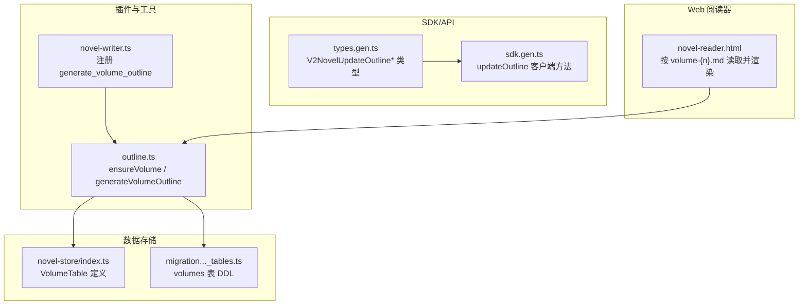
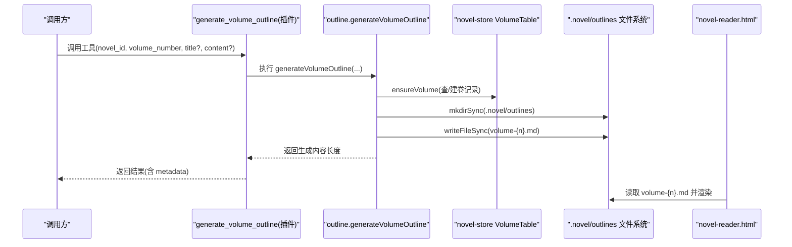
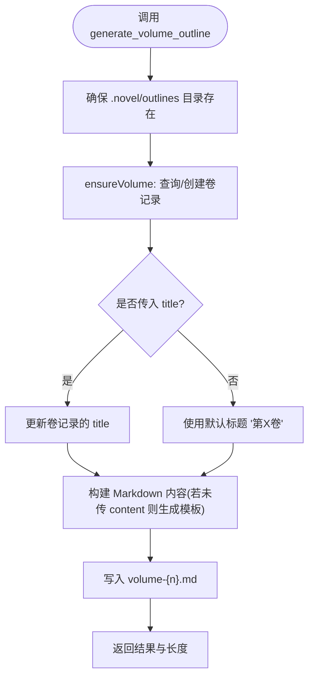
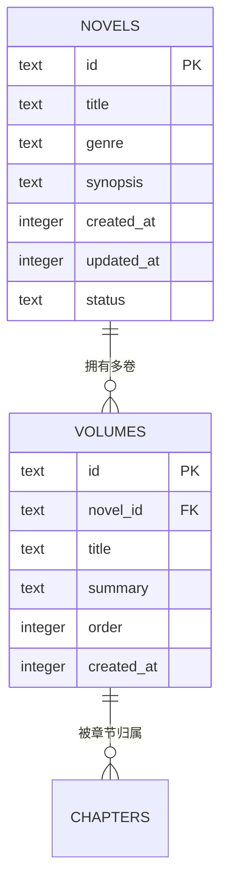
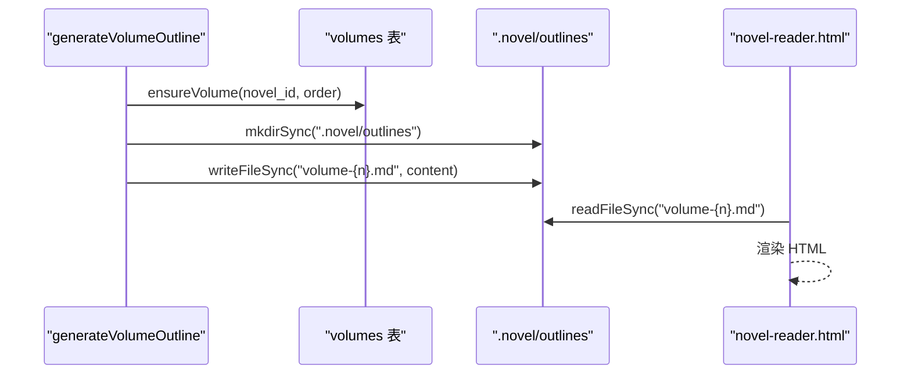
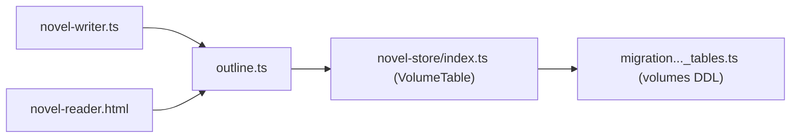

# 卷纲管理 API

<cite>
**本文引用的文件**   
- [packages/plugin/src/novel-writer.ts](file://packages/plugin/src/novel-writer.ts)
- [packages/plugin/src/novel-writer/outline.ts](file://packages/plugin/src/novel-writer/outline.ts)
- [packages/novel-store/src/index.ts](file://packages/novel-store/src/index.ts)
- [packages/core/src/database/migration/20260721152252_novel_writing_tables.ts](file://packages/core/src/database/migration/20260721152252_novel_writing_tables.ts)
- [packages/schema/src/novel.ts](file://packages/schema/src/novel.ts)
- [packages/sdk/js/src/v2/gen/types.gen.ts](file://packages/sdk/js/src/v2/gen/types.gen.ts)
- [packages/sdk/js/src/v2/gen/sdk.gen.ts](file://packages/sdk/js/src/v2/gen/sdk.gen.ts)
- [packages/opencode/src/server/routes/instance/httpapi/novel-reader.html](file://packages/opencode/src/server/routes/instance/httpapi/novel-reader.html)
</cite>

## 目录
1. [简介](#简介)
2. [项目结构](#项目结构)
3. [核心组件](#核心组件)
4. [架构总览](#架构总览)
5. [详细组件分析](#详细组件分析)
6. [依赖关系分析](#依赖关系分析)
7. [性能考量](#性能考量)
8. [故障排查指南](#故障排查指南)
9. [结论](#结论)
10. [附录](#附录)

## 简介
本文件面向 openNovel 的“卷纲管理”能力，聚焦 generate_volume_outline 工具及其配套的数据与文件同步机制。内容涵盖：
- 工具参数说明：novel_id、volume_number、title、content 的作用与配置方法
- 卷大纲文件的命名规则（volume-{n}.md）与存储位置
- 创建新卷与更新现有卷标题的使用示例
- volumes 表结构与操作说明
- 数据库与 Markdown 文件的同步机制

## 项目结构
与卷纲管理相关的关键代码分布在以下模块：
- 插件层暴露工具接口（generate_volume_outline）
- 大纲生成逻辑（ensureVolume、generateVolumeOutline）
- 数据模型与表定义（volumes 表等）
- SDK/API 类型与客户端调用方式
- Web 阅读器对卷大纲文件的读取与展示

**图表来源**
- [packages/plugin/src/novel-writer.ts:564-594](file://packages/plugin/src/novel-writer.ts#L564-L594)
- [packages/plugin/src/novel-writer/outline.ts:37-66](file://packages/plugin/src/novel-writer/outline.ts#L37-L66)
- [packages/novel-store/src/index.ts:59-68](file://packages/novel-store/src/index.ts#L59-L68)
- [packages/core/src/database/migration/20260721152252_novel_writing_tables.ts:167-176](file://packages/core/src/database/migration/20260721152252_novel_writing_tables.ts#L167-L176)
- [packages/sdk/js/src/v2/gen/types.gen.ts:15069-15133](file://packages/sdk/js/src/v2/gen/types.gen.ts#L15069-L15133)
- [packages/sdk/js/src/v2/gen/sdk.gen.ts:8131-8173](file://packages/sdk/js/src/v2/gen/sdk.gen.ts#L8131-L8173)
- [packages/opencode/src/server/routes/instance/httpapi/novel-reader.html:1502-1529](file://packages/opencode/src/server/routes/instance/httpapi/novel-reader.html#L1502-L1529)

**章节来源**
- [packages/plugin/src/novel-writer.ts:564-594](file://packages/plugin/src/novel-writer.ts#L564-L594)
- [packages/plugin/src/novel-writer/outline.ts:184-270](file://packages/plugin/src/novel-writer/outline.ts#L184-L270)
- [packages/novel-store/src/index.ts:59-68](file://packages/novel-store/src/index.ts#L59-L68)
- [packages/core/src/database/migration/20260721152252_novel_writing_tables.ts:167-176](file://packages/core/src/database/migration/20260721152252_novel_writing_tables.ts#L167-L176)
- [packages/opencode/src/server/routes/instance/httpapi/novel-reader.html:1502-1529](file://packages/opencode/src/server/routes/instance/httpapi/novel-reader.html#L1502-L1529)

## 核心组件
- 工具入口：generate_volume_outline
  - 作用：根据小说 ID 与卷号创建或定位卷记录，并生成 .novel/outlines/volume-{n}.md 文件；若传入 title 则更新卷标题；若传入 content 则写入实际内容，否则生成模板。
  - 关键实现路径：novel-writer.ts 中注册工具，调用 outline.ts 的 generateVolumeOutline。
- 卷记录保障：ensureVolume
  - 作用：按 novel_id + order(volume_number) 查找或新建卷记录，默认标题为“第X卷”，摘要包含章节范围。
- 文件生成：generateVolumeOutline
  - 作用：确保 outlines 目录存在，写入 volume-{n}.md，返回生成的 Markdown 内容长度等信息。

**章节来源**
- [packages/plugin/src/novel-writer.ts:564-594](file://packages/plugin/src/novel-writer.ts#L564-L594)
- [packages/plugin/src/novel-writer/outline.ts:37-66](file://packages/plugin/src/novel-writer/outline.ts#L37-L66)
- [packages/plugin/src/novel-writer/outline.ts:184-270](file://packages/plugin/src/novel-writer/outline.ts#L184-L270)

## 架构总览
下图展示了从工具调用到数据库与文件系统的双写流程，以及 Web 阅读器如何基于文件名读取卷大纲。

**图表来源**
- [packages/plugin/src/novel-writer.ts:564-594](file://packages/plugin/src/novel-writer.ts#L564-L594)
- [packages/plugin/src/novel-writer/outline.ts:24-30](file://packages/plugin/src/novel-writer/outline.ts#L24-L30)
- [packages/plugin/src/novel-writer/outline.ts:184-270](file://packages/plugin/src/novel-writer/outline.ts#L184-L270)
- [packages/opencode/src/server/routes/instance/httpapi/novel-reader.html:1502-1529](file://packages/opencode/src/server/routes/instance/httpapi/novel-reader.html#L1502-L1529)

## 详细组件分析

### 工具参数详解：generate_volume_outline
- novel_id（必填）
  - 含义：小说唯一标识
  - 行为：用于定位小说元数据与关联的卷记录
  - 校验：不存在时会抛出错误（由内部实现保证）
- volume_number（必填）
  - 含义：卷号，从 1 开始
  - 行为：用于确定卷顺序 order，并映射到 volume-{n}.md 文件名
- title（可选）
  - 含义：卷标题，如“卷一·军校风云”
  - 行为：若提供且已存在该卷记录，将更新其 title；未提供时默认使用“第X卷”
- content（可选）
  - 含义：卷大纲 Markdown 全文
  - 行为：若提供则直接写入文件；未提供则生成模板内容

返回值与输出
- 输出文本会包含卷号、生成文件大小等信息
- metadata 中包含 novel_id、volume_number、length 等字段

**章节来源**
- [packages/plugin/src/novel-writer.ts:564-594](file://packages/plugin/src/novel-writer.ts#L564-L594)
- [packages/plugin/src/novel-writer/outline.ts:184-270](file://packages/plugin/src/novel-writer/outline.ts#L184-L270)

### 卷大纲文件命名与存储结构
- 命名规则
  - 卷大纲文件名为 volume-{n}.md，其中 n 为卷号（从 1 开始）
- 存储位置
  - 位于项目根目录下的 .novel/outlines 文件夹内
  - 首次写入时会自动创建 outlines 目录
- 文件内容
  - 包含卷标题、卷 ID、章节范围、生成时间等头部信息
  - 后续可填充主题、章节列表、关键事件、伏笔、角色弧光等

**图表来源**
- [packages/plugin/src/novel-writer/outline.ts:24-30](file://packages/plugin/src/novel-writer/outline.ts#L24-L30)
- [packages/plugin/src/novel-writer/outline.ts:37-66](file://packages/plugin/src/novel-writer/outline.ts#L37-L66)
- [packages/plugin/src/novel-writer/outline.ts:184-270](file://packages/plugin/src/novel-writer/outline.ts#L184-L270)

**章节来源**
- [packages/plugin/src/novel-writer/outline.ts:24-30](file://packages/plugin/src/novel-writer/outline.ts#L24-L30)
- [packages/plugin/src/novel-writer/outline.ts:184-270](file://packages/plugin/src/novel-writer/outline.ts#L184-L270)

### 数据库 volumes 表结构与操作
- 表名：volumes
- 字段说明
  - id：主键（text）
  - novel_id：所属小说 ID（text，非空）
  - title：卷标题（text，非空）
  - summary：卷摘要（text，默认空串）
  - order：卷序号（integer，非空）
  - created_at：创建时间戳（integer，非空）
- 约束
  - 外键：novel_id 引用 novels(id)，级联删除
- 操作要点
  - 新增：通过 ensureVolume 自动插入（order=volume_number），默认标题与摘要自动生成
  - 更新：当传入 title 时，会更新对应卷记录的 title
  - 查询：可通过 novel_id + order 定位卷记录

**图表来源**
- [packages/novel-store/src/index.ts:59-68](file://packages/novel-store/src/index.ts#L59-L68)
- [packages/core/src/database/migration/20260721152252_novel_writing_tables.ts:167-176](file://packages/core/src/database/migration/20260721152252_novel_writing_tables.ts#L167-L176)

**章节来源**
- [packages/novel-store/src/index.ts:59-68](file://packages/novel-store/src/index.ts#L59-L68)
- [packages/core/src/database/migration/20260721152252_novel_writing_tables.ts:167-176](file://packages/core/src/database/migration/20260721152252_novel_writing_tables.ts#L167-L176)

### 文件与数据库同步机制
- 双写策略
  - 先确保数据库卷记录存在（ensureVolume）
  - 再写入 .novel/outlines/volume-{n}.md 文件
- 一致性
  - 卷记录以 novel_id + order 作为唯一依据
  - 文件命名与卷号严格对应，便于 Web 阅读器按序读取
- 读取路径
  - Web 阅读器通过拼接 filename = "volume-" + vol.order + ".md" 来定位并渲染卷大纲

**图表来源**
- [packages/plugin/src/novel-writer/outline.ts:24-30](file://packages/plugin/src/novel-writer/outline.ts#L24-L30)
- [packages/plugin/src/novel-writer/outline.ts:184-270](file://packages/plugin/src/novel-writer/outline.ts#L184-L270)
- [packages/opencode/src/server/routes/instance/httpapi/novel-reader.html:1502-1529](file://packages/opencode/src/server/routes/instance/httpapi/novel-reader.html#L1502-L1529)

**章节来源**
- [packages/plugin/src/novel-writer/outline.ts:184-270](file://packages/plugin/src/novel-writer/outline.ts#L184-L270)
- [packages/opencode/src/server/routes/instance/httpapi/novel-reader.html:1502-1529](file://packages/opencode/src/server/routes/instance/httpapi/novel-reader.html#L1502-L1529)

### 使用示例

- 创建新卷（不传 content，生成模板）
  - 调用 generate_volume_outline
  - 参数：novel_id=某小说ID，volume_number=1，title 可选（留空则默认“第1卷”），content 留空
  - 结果：在 .novel/outlines 下生成 volume-1.md 模板，并在 volumes 表中新增一条 order=1 的记录

- 更新现有卷标题
  - 调用 generate_volume_outline
  - 参数：novel_id=某小说ID，volume_number=1，title="卷一·军校风云"，content 留空
  - 结果：若已存在 order=1 的记录，则更新其 title 为新值；文件仍为 volume-1.md

- 传入实际内容
  - 调用 generate_volume_outline
  - 参数：novel_id=某小说ID，volume_number=1，title 可选，content=完整 Markdown 内容
  - 结果：直接写入 volume-1.md 的实际内容，同时确保数据库卷记录存在

注意：上述示例为概念性描述，具体调用请参考工具定义与实现路径。

**章节来源**
- [packages/plugin/src/novel-writer.ts:564-594](file://packages/plugin/src/novel-writer.ts#L564-L594)
- [packages/plugin/src/novel-writer/outline.ts:184-270](file://packages/plugin/src/novel-writer/outline.ts#L184-L270)

### 与大纲更新的 API 关系
- 更新大纲段（master/volume/chapter）的 API 类型为 Novel.OutlineUpdateInput
- 客户端方法 updateOutline 支持 PUT /api/novel/{novelID}/outline
- 该 API 与 generate_volume_outline 互补：前者用于更新已有大纲段，后者用于生成/初始化卷大纲

**章节来源**
- [packages/schema/src/novel.ts:249-254](file://packages/schema/src/novel.ts#L249-L254)
- [packages/sdk/js/src/v2/gen/sdk.gen.ts:8131-8173](file://packages/sdk/js/src/v2/gen/sdk.gen.ts#L8131-L8173)
- [packages/sdk/js/src/v2/gen/types.gen.ts:15069-15133](file://packages/sdk/js/src/v2/gen/types.gen.ts#L15069-L15133)

## 依赖关系分析
- 插件层依赖 outline.ts 的大纲生成逻辑
- outline.ts 依赖 novel-store 的 VolumeTable 进行数据持久化
- migration 文件定义了 volumes 表的 DDL
- Web 阅读器依赖 .novel/outlines 的文件命名约定进行读取

**图表来源**
- [packages/plugin/src/novel-writer.ts:564-594](file://packages/plugin/src/novel-writer.ts#L564-L594)
- [packages/plugin/src/novel-writer/outline.ts:184-270](file://packages/plugin/src/novel-writer/outline.ts#L184-L270)
- [packages/novel-store/src/index.ts:59-68](file://packages/novel-store/src/index.ts#L59-L68)
- [packages/core/src/database/migration/20260721152252_novel_writing_tables.ts:167-176](file://packages/core/src/database/migration/20260721152252_novel_writing_tables.ts#L167-L176)
- [packages/opencode/src/server/routes/instance/httpapi/novel-reader.html:1502-1529](file://packages/opencode/src/server/routes/instance/httpapi/novel-reader.html#L1502-L1529)

**章节来源**
- [packages/plugin/src/novel-writer.ts:564-594](file://packages/plugin/src/novel-writer.ts#L564-L594)
- [packages/plugin/src/novel-writer/outline.ts:184-270](file://packages/plugin/src/novel-writer/outline.ts#L184-L270)
- [packages/novel-store/src/index.ts:59-68](file://packages/novel-store/src/index.ts#L59-L68)
- [packages/core/src/database/migration/20260721152252_novel_writing_tables.ts:167-176](file://packages/core/src/database/migration/20260721152252_novel_writing_tables.ts#L167-L176)
- [packages/opencode/src/server/routes/instance/httpapi/novel-reader.html:1502-1529](file://packages/opencode/src/server/routes/instance/httpapi/novel-reader.html#L1502-L1529)

## 性能考量
- 目录与文件 I/O
  - 首次写入会创建 .novel/outlines 目录，随后直接写入文件
  - 建议批量生成卷大纲时复用目录检查与写入逻辑
- 数据库访问
  - ensureVolume 通过 novel_id + order 精确查询，避免全表扫描
- 并发与锁
  - 当前实现未显式加锁，若高并发场景需考虑文件写入冲突与幂等性

[本节为通用指导，不直接分析具体文件]

## 故障排查指南
- 常见问题
  - 小说不存在：调用前请确认 novel_id 有效
  - 卷记录重复：同一 novel_id + order 仅保留一条记录，重复调用会更新而非新增
  - 文件路径权限：确保 .novel/outlines 目录可写
- 调试建议
  - 检查 .novel/outlines 目录下是否存在对应的 volume-{n}.md
  - 检查 volumes 表中是否有正确的 order 与 title
  - 使用 read_outline 工具读取已生成的卷大纲文件，确认内容与路径正确

**章节来源**
- [packages/plugin/src/novel-writer.ts:564-594](file://packages/plugin/src/novel-writer.ts#L564-L594)
- [packages/plugin/src/novel-writer/outline.ts:184-270](file://packages/plugin/src/novel-writer/outline.ts#L184-L270)

## 结论
generate_volume_outline 提供了统一的卷纲管理能力，既维护数据库中的卷记录，又生成标准化的 Markdown 文件，便于 Web 阅读器与后续写作流水线消费。通过 novel_id、volume_number、title、content 四个参数的组合，可实现创建新卷与更新标题的常见场景。配合 .novel/outlines 的命名规范与 volumes 表结构，系统实现了稳定一致的双写同步。

[本节为总结，不直接分析具体文件]

## 附录
- 相关类型与 API
  - Novel.OutlineUpdateInput：用于更新 master/volume/chapter 大纲段
  - updateOutline 客户端方法：PUT /api/novel/{novelID}/outline
- 文件命名约定
  - 卷大纲：volume-{n}.md
  - 章节大纲：chapter-{n}.md
  - 整体大纲：master-outline.md

**章节来源**
- [packages/schema/src/novel.ts:249-254](file://packages/schema/src/novel.ts#L249-L254)
- [packages/sdk/js/src/v2/gen/sdk.gen.ts:8131-8173](file://packages/sdk/js/src/v2/gen/sdk.gen.ts#L8131-L8173)
- [packages/opencode/src/server/routes/instance/httpapi/novel-reader.html:1502-1529](file://packages/opencode/src/server/routes/instance/httpapi/novel-reader.html#L1502-L1529)