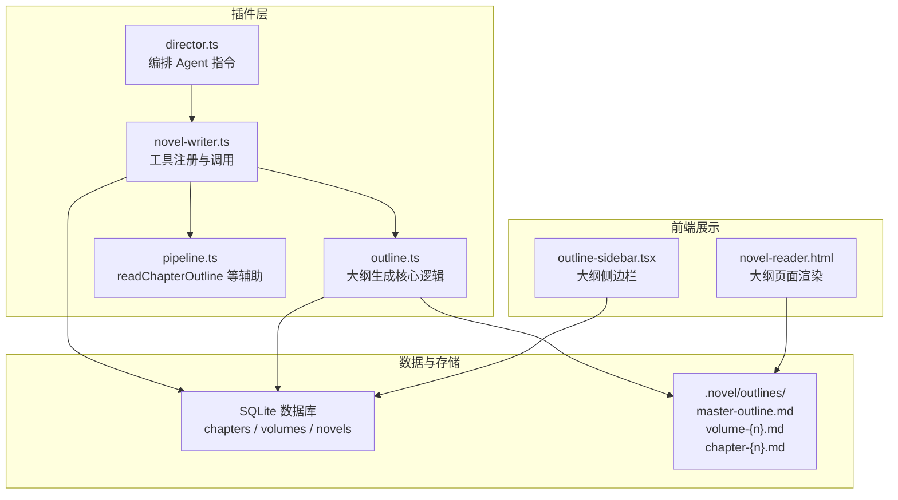
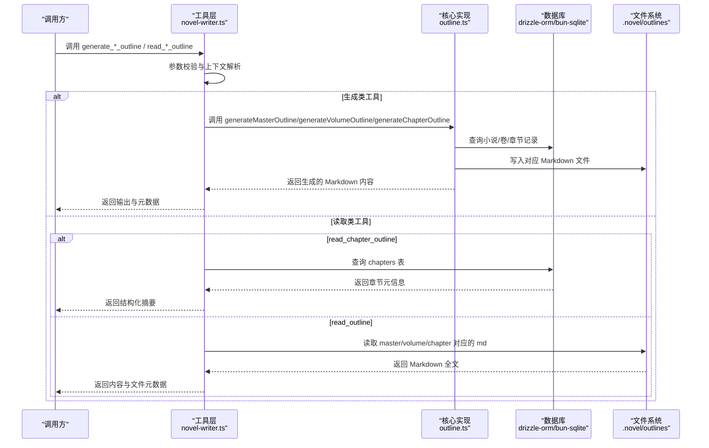
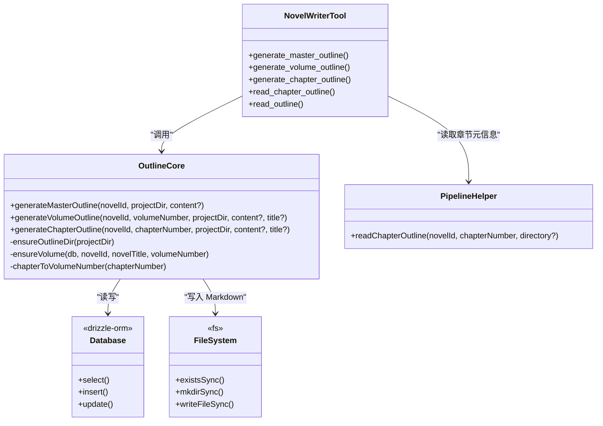
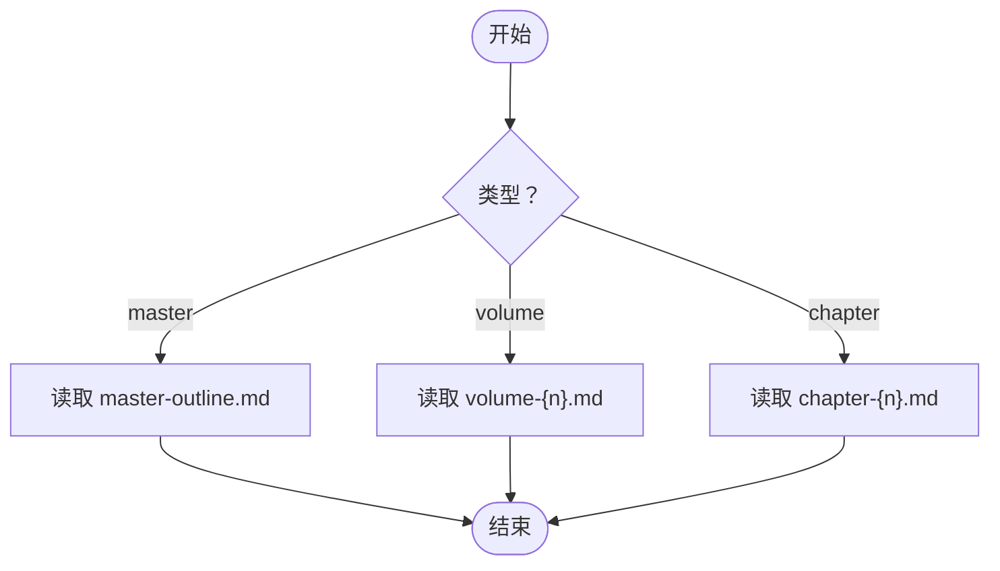

# 大纲管理 API

<cite>
**本文引用的文件**   
- [novel-writer.ts](file://packages/plugin/src/novel-writer.ts)
- [outline.ts](file://packages/plugin/src/novel-writer/outline.ts)
- [pipeline.ts](file://packages/plugin/src/novel-writer/pipeline.ts)
- [director.ts](file://packages/plugin/src/novel-writer/agents/director.ts)
- [e2e.test.ts](file://packages/plugin/test/novel-writer/e2e.test.ts)
- [novel-reader.html](file://packages/opencode/src/server/routes/instance/httpapi/novel-reader.html)
- [outline-sidebar.tsx](file://packages/app/src/pages/novel/outline-sidebar.tsx)
</cite>

## 目录
1. [简介](#简介)
2. [项目结构](#项目结构)
3. [核心组件](#核心组件)
4. [架构总览](#架构总览)
5. [详细组件分析](#详细组件分析)
6. [依赖关系分析](#依赖关系分析)
7. [性能与一致性](#性能与一致性)
8. [故障排查指南](#故障排查指南)
9. [结论](#结论)
10. [附录：大纲文件结构与批量操作](#附录大纲文件结构与批量操作)

## 简介
本文件为 openNovel 的“大纲管理 API”提供完整文档，覆盖三级大纲（总纲、卷纲、章节大纲）的生成与管理接口。重点说明以下工具的使用方法与参数配置：
- generate_master_outline：生成整体大纲模板或写入实际内容
- generate_volume_outline：生成卷大纲模板或写入实际内容，并维护卷记录
- generate_chapter_outline：生成章节大纲模板或写入实际内容，自动创建所属卷记录与章节 DB 记录
- read_outline：读取 .novel/outlines/ 下的 Markdown 原文（总纲/卷纲/章节大纲）
- read_chapter_outline：从数据库读取章节元信息（标题、字数、状态等），用于流水线步骤1（plan）

同时给出大纲文件结构说明与批量操作指南，帮助读者高效组织和管理大纲。

## 项目结构
与大纲管理相关的代码主要位于 packages/plugin 的 novel-writer 模块中，包含工具注册、核心实现与流水线辅助函数；Web UI 侧提供大纲浏览与导航能力。

**图表来源**
- [novel-writer.ts:541-694](file://packages/plugin/src/novel-writer.ts#L541-L694)
- [outline.ts:81-428](file://packages/plugin/src/novel-writer/outline.ts#L81-L428)
- [pipeline.ts:38-46](file://packages/plugin/src/novel-writer/pipeline.ts#L38-L46)
- [director.ts:52-93](file://packages/plugin/src/novel-writer/agents/director.ts#L52-L93)
- [novel-reader.html:1454-1553](file://packages/opencode/src/server/routes/instance/httpapi/novel-reader.html#L1454-L1553)
- [outline-sidebar.tsx:1-178](file://packages/app/src/pages/novel/outline-sidebar.tsx#L1-L178)

**章节来源**
- [novel-writer.ts:541-694](file://packages/plugin/src/novel-writer.ts#L541-L694)
- [outline.ts:81-428](file://packages/plugin/src/novel-writer/outline.ts#L81-L428)
- [pipeline.ts:38-46](file://packages/plugin/src/novel-writer/pipeline.ts#L38-L46)
- [director.ts:52-93](file://packages/plugin/src/novel-writer/agents/director.ts#L52-L93)
- [novel-reader.html:1454-1553](file://packages/opencode/src/server/routes/instance/httpapi/novel-reader.html#L1454-L1553)
- [outline-sidebar.tsx:1-178](file://packages/app/src/pages/novel/outline-sidebar.tsx#L1-L178)

## 核心组件
- 工具层（novel-writer.ts）
  - 暴露 generate_master_outline、generate_volume_outline、generate_chapter_outline、read_chapter_outline、read_outline 五个工具，负责参数校验、上下文解析、调用核心实现与返回结构化结果。
- 核心实现（outline.ts）
  - 实现三级大纲的模板构建与持久化（DB + Markdown 文件）。
  - 自动确保 outlines 目录存在、计算卷号、确保卷记录存在。
- 流水线辅助（pipeline.ts）
  - 提供 readChapterOutline 等确定性步骤函数，供工具在 plan 阶段使用。
- 编排 Agent（director.ts）
  - 指导如何正确使用大纲工具：先生成实际内容，再通过 content/title 传入工具持久化，避免空模板滥用。

**章节来源**
- [novel-writer.ts:541-694](file://packages/plugin/src/novel-writer.ts#L541-L694)
- [outline.ts:81-428](file://packages/plugin/src/novel-writer/outline.ts#L81-L428)
- [pipeline.ts:38-46](file://packages/plugin/src/novel-writer/pipeline.ts#L38-L46)
- [director.ts:52-93](file://packages/plugin/src/novel-writer/agents/director.ts#L52-L93)

## 架构总览
下图展示了“生成大纲”的端到端流程：用户通过工具调用，进入工具执行器，再调用核心实现，最终落库并写文件；读取时则分别走数据库或文件系统路径。

**图表来源**
- [novel-writer.ts:541-694](file://packages/plugin/src/novel-writer.ts#L541-L694)
- [outline.ts:81-428](file://packages/plugin/src/novel-writer/outline.ts#L81-L428)
- [pipeline.ts:38-46](file://packages/plugin/src/novel-writer/pipeline.ts#L38-L46)

## 详细组件分析

### 工具：generate_master_outline
- 功能：生成整体大纲（故事梗概、主线剧情、角色列表、世界观概要），写入 .novel/outlines/master-outline.md。
- 参数
  - novel_id：小说 ID（必填）
  - content：可选。若提供则直接写入该 Markdown 全文；否则生成模板。
- 行为要点
  - 校验小说是否存在
  - 自动生成模板或采用传入内容
  - 写入 master-outline.md
  - 返回输出字符串与长度元数据
- 典型用法
  - 先由 director 根据设定生成实际内容，再将 content 传入工具持久化。

**章节来源**
- [novel-writer.ts:541-563](file://packages/plugin/src/novel-writer.ts#L541-L563)
- [outline.ts:81-90](file://packages/plugin/src/novel-writer/outline.ts#L81-L90)

### 工具：generate_volume_outline
- 功能：生成卷大纲（本卷主题、章节列表、关键事件、伏笔、角色弧光），写入 .novel/outlines/volume-{n}.md，并确保 volumes 表记录存在。
- 参数
  - novel_id：小说 ID（必填）
  - volume_number：卷号（从 1 开始，必填）
  - title：可选。卷标题，重新生成时可更新原有记录
  - content：可选。Markdown 全文，留空则生成模板
- 行为要点
  - 校验小说是否存在
  - ensureVolume 保证卷记录存在（不存在则创建）
  - 计算章节范围（默认每卷 50 章）
  - 生成模板或采用传入内容
  - 写入 volume-{n}.md
  - 返回输出字符串与长度元数据

**章节来源**
- [novel-writer.ts:564-594](file://packages/plugin/src/novel-writer.ts#L564-L594)
- [outline.ts:184-270](file://packages/plugin/src/novel-writer/outline.ts#L184-L270)

### 工具：generate_chapter_outline
- 功能：生成章节大纲（章节目标、关键场景、角色出场、打脸设计等），写入 .novel/outlines/chapter-{n}.md，并确保 chapters 表记录存在，自动创建所属卷记录。
- 参数
  - novel_id：小说 ID（必填）
  - chapter_number：章节序号（从 1 开始，必填）
  - title：可选。章节标题，重新生成时可更新原有记录
  - content：可选。Markdown 全文，留空则生成模板
- 行为要点
  - 校验小说是否存在
  - 计算所属卷号并 ensureVolume
  - 若章节已存在且标题变化则更新记录；否则新建章节记录
  - 生成模板或采用传入内容
  - 写入 chapter-{n}.md
  - 返回输出字符串与长度元数据

**章节来源**
- [novel-writer.ts:595-627](file://packages/plugin/src/novel-writer.ts#L595-L627)
- [outline.ts:284-428](file://packages/plugin/src/novel-writer/outline.ts#L284-L428)

### 工具：read_chapter_outline
- 功能：从数据库读取指定章节的元信息（ID、标题、序号、字数、状态等），用于流水线步骤1（plan）。
- 参数
  - novel_id：小说 ID（必填）
  - chapter_number：章节序号（必填）
- 行为要点
  - 校验小说是否存在
  - 查询 chapters 表，不存在则返回提示
  - 返回结构化摘要与元数据

**章节来源**
- [novel-writer.ts:628-655](file://packages/plugin/src/novel-writer.ts#L628-L655)
- [pipeline.ts:38-46](file://packages/plugin/src/novel-writer/pipeline.ts#L38-L46)

### 工具：read_outline
- 功能：读取 .novel/outlines/ 下的 Markdown 原文，支持总纲、卷纲、章节大纲三种类型。
- 参数
  - type：枚举值 master | volume | chapter（必填）
  - number：当 type=volume 或 chapter 时必填，表示卷号或章节序号
- 行为要点
  - 校验 number 参数是否满足要求
  - 拼接 .novel/outlines 路径与文件名
  - 若文件不存在返回提示
  - 读取并返回 Markdown 全文与文件元数据

**章节来源**
- [novel-writer.ts:656-694](file://packages/plugin/src/novel-writer.ts#L656-L694)

### 编排建议（director 指令）
- 生成大纲的正确姿势：
  - 不要直接调用工具生成空模板
  - 先阅读 assemble_context_snapshot 或已有设定（角色/卷纲/伏笔/前文摘要）
  - 为章节编写完整的大纲内容（Markdown），包含章节目标、关键场景（地点/时间/出场角色/概要/字数预估）、角色出场表、剧情推进点、与前文的衔接和为后文埋的钩子
  - 将标题与内容通过 title + content 参数传给 generate_chapter_outline 工具写入文件和 DB
  - 批量生成时逐章调用，每章都先写实际标题和内容再传入
  - 重新生成某章大纲时，工具会自动更新原有记录（按章节序号匹配），不会创建重复记录
  - 卷大纲同理使用 generate_volume_outline + title + content 参数

**章节来源**
- [director.ts:86-93](file://packages/plugin/src/novel-writer/agents/director.ts#L86-L93)

## 依赖关系分析
- 工具层依赖
  - novel-writer.ts 导入 outline.ts 的核心函数与 pipeline.ts 的辅助函数
  - 通过 drizzle-orm 访问 SQLite 数据库（bun-sqlite）
- 核心实现依赖
  - outline.ts 使用 getDb、NovelTable、VolumeTable、ChapterTable 进行数据读写
  - 使用 fs 模块确保 outlines 目录存在并写入 Markdown
- 前端展示依赖
  - novel-reader.html 渲染卷大纲与章节大纲列表
  - outline-sidebar.tsx 提供大纲侧边栏导航，区分 master/volume/chapter 三类

**图表来源**
- [novel-writer.ts:541-694](file://packages/plugin/src/novel-writer.ts#L541-L694)
- [outline.ts:81-428](file://packages/plugin/src/novel-writer/outline.ts#L81-L428)
- [pipeline.ts:38-46](file://packages/plugin/src/novel-writer/pipeline.ts#L38-L46)

**章节来源**
- [novel-writer.ts:541-694](file://packages/plugin/src/novel-writer.ts#L541-L694)
- [outline.ts:81-428](file://packages/plugin/src/novel-writer/outline.ts#L81-L428)
- [pipeline.ts:38-46](file://packages/plugin/src/novel-writer/pipeline.ts#L38-L46)

## 性能与一致性
- 文件 I/O
  - 每次生成大纲都会写入一个 Markdown 文件，建议批量生成时合并 I/O 或减少频繁刷新
- 数据库操作
  - 生成卷/章节时会进行 ensureVolume 与插入/更新操作，注意事务边界与错误回滚
- 一致性保障
  - 章节大纲生成会确保所属卷存在，避免孤立章节
  - read_chapter_outline 与 read_outline 互补：前者读 DB 元信息，后者读 Markdown 原文，二者应保持一致

[本节为通用性能讨论，不直接分析具体文件]

## 故障排查指南
- 常见问题
  - 小说不存在：generate_*_outline 会抛出异常或返回错误提示
  - 文件不存在：read_outline 会提示需先调用对应生成工具
  - 缺少 number 参数：type=volume 或 chapter 时必须提供 number
  - 章节不存在：read_chapter_outline 会提示先调用 generate_chapter_outline
- 定位方法
  - 检查 .novel/outlines/ 目录下是否生成对应 Markdown 文件
  - 检查数据库中 chapters/volumes 记录是否正确创建
  - 参考 e2e 测试用例验证基本流程

**章节来源**
- [novel-writer.ts:668-694](file://packages/plugin/src/novel-writer.ts#L668-L694)
- [e2e.test.ts:419-449](file://packages/plugin/test/novel-writer/e2e.test.ts#L419-L449)

## 结论
openNovel 的大纲管理 API 提供了完整的三级大纲生成与读取能力，结合数据库与文件系统双重持久化，既便于程序化处理，也方便人类阅读与编辑。通过 director 编排指令与工具组合，可实现高质量、可追溯的大纲生产流程。

[本节为总结性内容，不直接分析具体文件]

## 附录：大纲文件结构与批量操作

### 大纲文件结构
- 总纲：master-outline.md
  - 包含故事梗概、主线剧情（四幕）、角色列表（主角/配角/反派）、世界观概要（背景/力量体系/重要设定）
- 卷纲：volume-{n}.md
  - 包含卷 ID、章节范围、本卷主题（主题句/情感基调）、章节列表表格、关键事件（必写事件/伏笔/角色弧光）
- 章节大纲：chapter-{n}.md
  - 包含章节 ID、所属卷、章节目标（剧情/情感/信息）、关键场景（开场/发展/高潮/收尾）、角色出场表、对话要点、打脸设计（如适用）

**图表来源**
- [outline.ts:92-171](file://packages/plugin/src/novel-writer/outline.ts#L92-L171)
- [outline.ts:205-270](file://packages/plugin/src/novel-writer/outline.ts#L205-L270)
- [outline.ts:336-428](file://packages/plugin/src/novel-writer/outline.ts#L336-L428)

### 批量操作指南
- 批量生成卷纲
  - 遍历卷号，依次调用 generate_volume_outline，传入 title 与 content（由 director 生成实际内容）
- 批量生成章节大纲
  - 遍历章节序号，依次调用 generate_chapter_outline，传入 title 与 content（由 director 生成实际内容）
  - 工具会自动确保所属卷存在，无需手动创建
- 批量读取与核对
  - 使用 read_chapter_outline 获取章节元信息，配合 read_outline 读取 Markdown 原文，进行一致性核对
- WebUI 查看
  - novel-reader.html 与 outline-sidebar.tsx 提供大纲浏览与导航，便于人工审阅与补充

**章节来源**
- [director.ts:86-93](file://packages/plugin/src/novel-writer/agents/director.ts#L86-L93)
- [novel-reader.html:1454-1553](file://packages/opencode/src/server/routes/instance/httpapi/novel-reader.html#L1454-L1553)
- [outline-sidebar.tsx:1-178](file://packages/app/src/pages/novel/outline-sidebar.tsx#L1-L178)