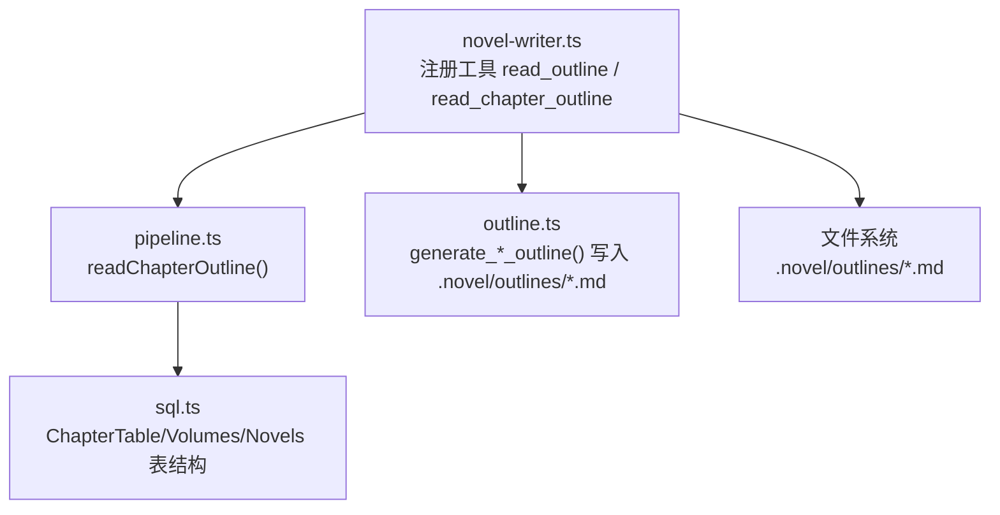
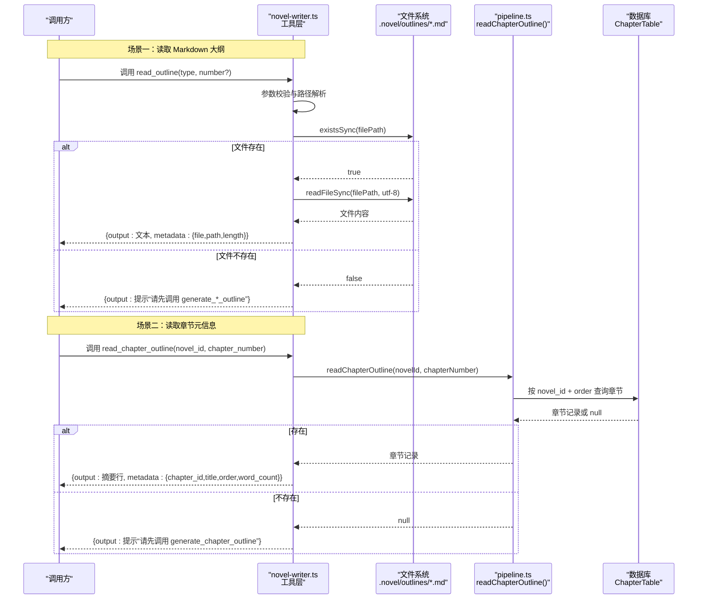
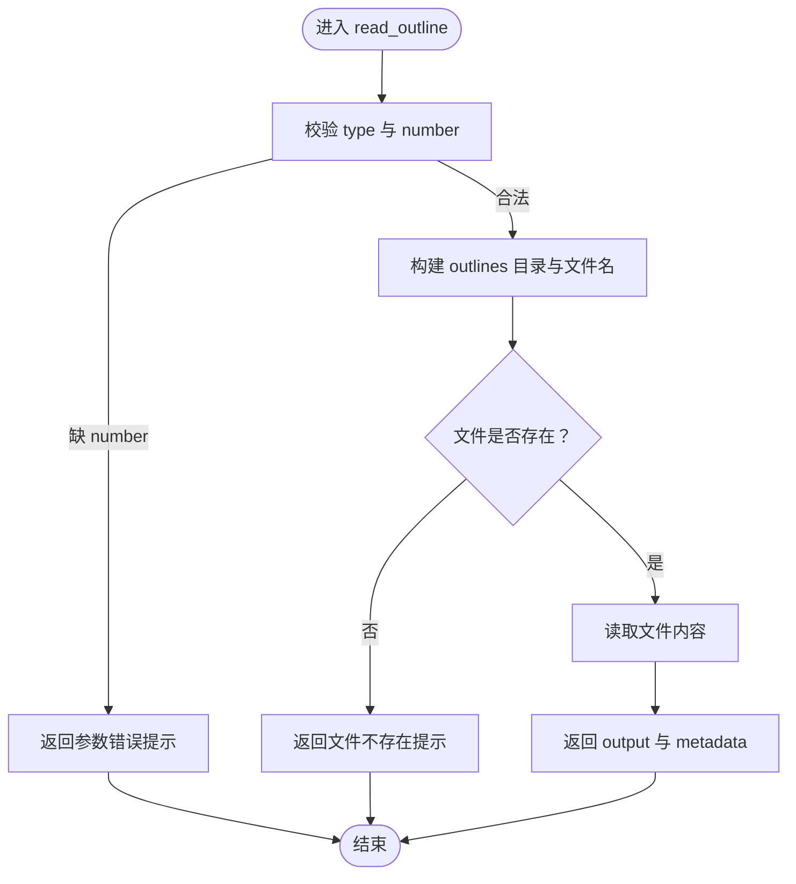
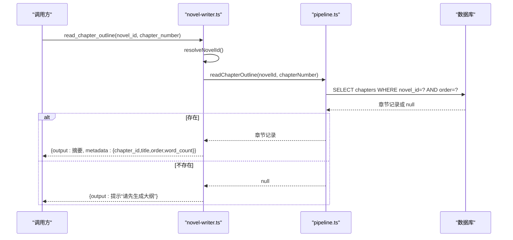
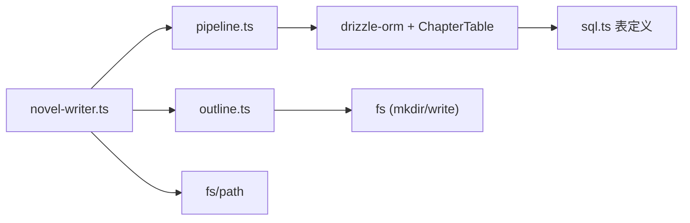

# 大纲读取 API

<cite>
**本文引用的文件**   
- [novel-writer.ts](file://packages/plugin/src/novel-writer.ts)
- [pipeline.ts](file://packages/plugin/src/novel-writer/pipeline.ts)
- [outline.ts](file://packages/plugin/src/novel-writer/outline.ts)
- [sql.ts](file://packages/core/src/session/sql.ts)
</cite>

## 目录
1. [简介](#简介)
2. [项目结构](#项目结构)
3. [核心组件](#核心组件)
4. [架构总览](#架构总览)
5. [详细组件分析](#详细组件分析)
6. [依赖关系分析](#依赖关系分析)
7. [性能考虑](#性能考虑)
8. [故障排查指南](#故障排查指南)
9. [结论](#结论)
10. [附录](#附录)

## 简介
本文件为 openNovel 的“大纲读取 API”提供完整技术文档，聚焦两个工具：
- read_outline：读取 .novel/outlines/ 下的 Markdown 原文（支持 master、volume、chapter 三种类型）
- read_chapter_outline：从数据库读取章节元信息（标题、字数、状态等）

文档涵盖参数说明、路径解析、错误处理、返回数据格式、批量读取与存在性检查的最佳实践，并给出调用时序图与流程图，帮助读者快速上手与排错。

## 项目结构
与大纲读取相关的代码主要分布在以下模块：
- novel-writer.ts：注册并实现 read_outline 与 read_chapter_outline 两个工具
- pipeline.ts：提供 readChapterOutline 函数，用于从数据库读取章节元信息
- outline.ts：负责生成三级大纲（master/volume/chapter），同时写入 .novel/outlines/ 目录
- sql.ts：定义数据库表结构（chapters、volumes、novels 等）

图表来源
- [novel-writer.ts:628-694](file://packages/plugin/src/novel-writer.ts#L628-L694)
- [pipeline.ts:38-46](file://packages/plugin/src/novel-writer/pipeline.ts#L38-L46)
- [outline.ts:24-30](file://packages/plugin/src/novel-writer/outline.ts#L24-L30)
- [sql.ts:223-248](file://packages/core/src/session/sql.ts#L223-L248)

章节来源
- [novel-writer.ts:628-694](file://packages/plugin/src/novel-writer.ts#L628-L694)
- [pipeline.ts:38-46](file://packages/plugin/src/novel-writer/pipeline.ts#L38-L46)
- [outline.ts:24-30](file://packages/plugin/src/novel-writer/outline.ts#L24-L30)
- [sql.ts:223-248](file://packages/core/src/session/sql.ts#L223-L248)

## 核心组件
- read_outline（工具）
  - 作用：读取 .novel/outlines/ 下的 Markdown 原文
  - 支持类型：master（总纲）、volume（卷纲）、chapter（章节大纲）
  - 关键逻辑：参数校验 → 计算文件路径 → 存在性检查 → 读取文件内容 → 返回内容与元信息
- read_chapter_outline（工具）
  - 作用：从数据库读取指定章节的元信息（id、title、order、word_count、status 等）
  - 关键逻辑：参数校验 → resolveNovelId → readChapterOutline → 不存在时返回提示 → 成功时返回结构化元信息

章节来源
- [novel-writer.ts:628-694](file://packages/plugin/src/novel-writer.ts#L628-L694)
- [pipeline.ts:38-46](file://packages/plugin/src/novel-writer/pipeline.ts#L38-L46)

## 架构总览
下图展示了两个工具的调用流程与数据源差异：read_outline 直接读取文件系统 Markdown；read_chapter_outline 通过 pipeline 查询数据库章节记录。

图表来源
- [novel-writer.ts:628-694](file://packages/plugin/src/novel-writer.ts#L628-L694)
- [pipeline.ts:38-46](file://packages/plugin/src/novel-writer/pipeline.ts#L38-L46)

## 详细组件分析

### read_outline：Markdown 大纲读取
- 输入参数
  - type：枚举值 master | volume | chapter
  - number：当 type=volume 或 type=chapter 时必须提供
- 路径解析规则
  - 根目录：projectDirFromCtx(ctx.directory) → join(dirname(dbPath), "..")
  - 大纲目录：join(projectDir, ".novel", "outlines")
  - 文件名：
    - master → master-outline.md
    - volume → volume-{number}.md
    - chapter → chapter-{number}.md
- 错误处理
  - 缺少 number：返回提示“type=${type} 时必须提供 number 参数”
  - 文件不存在：返回提示“大纲文件不存在：${filePath}。请先调用对应的 generate_*_outline 工具生成。”
- 返回数据
  - output：Markdown 全文
  - metadata：{ file, path, length }

图表来源
- [novel-writer.ts:656-694](file://packages/plugin/src/novel-writer.ts#L656-L694)

章节来源
- [novel-writer.ts:656-694](file://packages/plugin/src/novel-writer.ts#L656-L694)

### read_chapter_outline：数据库章节元信息读取
- 输入参数
  - novel_id：小说 ID
  - chapter_number：章节序号
- 处理流程
  - 解析 novel_id（resolveNovelId）
  - 调用 pipeline.readChapterOutline(novelId, chapterNumber)
  - 若不存在：返回提示“第X章不存在，请先调用 generate_chapter_outline 生成大纲”
  - 若存在：返回章节 id、title、order、word_count、status 等元信息
- 返回数据
  - output：格式化摘要行（包含 id/title/order/word_count/status）
  - metadata：{ chapter_id, title, order, word_count }

图表来源
- [novel-writer.ts:628-655](file://packages/plugin/src/novel-writer.ts#L628-L655)
- [pipeline.ts:38-46](file://packages/plugin/src/novel-writer/pipeline.ts#L38-L46)

章节来源
- [novel-writer.ts:628-655](file://packages/plugin/src/novel-writer.ts#L628-L655)
- [pipeline.ts:38-46](file://packages/plugin/src/novel-writer/pipeline.ts#L38-L46)

### 数据模型与存储位置
- 数据库表（章节相关）
  - chapters：id、novel_id、volume_id、title、content、word_count、status、order、created_at、updated_at
  - volumes：id、novel_id、title、summary、order、created_at
  - novels：id、title、genre、synopsis、status、created_at、updated_at
- 文件系统
  - .novel/outlines/master-outline.md
  - .novel/outlines/volume-{n}.md
  - .novel/outlines/chapter-{n}.md

章节来源
- [sql.ts:183-248](file://packages/core/src/session/sql.ts#L183-L248)
- [outline.ts:24-30](file://packages/plugin/src/novel-writer/outline.ts#L24-L30)

## 依赖关系分析
- novel-writer.ts 依赖
  - pipeline.ts：readChapterOutline
  - outline.ts：generateMasterOutline/generateVolumeOutline/generateChapterOutline（用于生成对应文件）
  - fs 模块：existsSync/readFileSync
  - path 模块：join/dirname
- pipeline.ts 依赖
  - drizzle-orm：eq/and
  - session-store：getDb/ChapterTable
- 数据库表依赖
  - chapters 引用 novels 与 volumes（外键约束）

图表来源
- [novel-writer.ts:1-20](file://packages/plugin/src/novel-writer.ts#L1-L20)
- [pipeline.ts:13-15](file://packages/plugin/src/novel-writer/pipeline.ts#L13-L15)
- [outline.ts:13-16](file://packages/plugin/src/novel-writer/outline.ts#L13-L16)
- [sql.ts:223-248](file://packages/core/src/session/sql.ts#L223-L248)

章节来源
- [novel-writer.ts:1-20](file://packages/plugin/src/novel-writer.ts#L1-L20)
- [pipeline.ts:13-15](file://packages/plugin/src/novel-writer/pipeline.ts#L13-L15)
- [outline.ts:13-16](file://packages/plugin/src/novel-writer/outline.ts#L13-L16)
- [sql.ts:223-248](file://packages/core/src/session/sql.ts#L223-L248)

## 性能考虑
- read_outline
  - 单次 I/O 读取 Markdown 文件，时间复杂度 O(文件大小)，适合小文件即时读取
  - 建议：批量读取前进行存在性检查，避免重复 I/O
- read_chapter_outline
  - 基于索引查询（novel_id + order），查询复杂度近似 O(logN)
  - 建议：批量读取时使用事务或批处理减少连接开销（由上层编排）

[本节为通用指导，不直接分析具体文件]

## 故障排查指南
- read_outline 常见问题
  - 参数缺失：type=volume/chapter 未传 number → 检查入参
  - 文件不存在：确保已调用 generate_*_outline 生成对应 Markdown
  - 权限问题：确认运行用户对 .novel/outlines/ 有读权限
- read_chapter_outline 常见问题
  - 章节不存在：先调用 generate_chapter_outline 创建章节记录
  - novel_id 无效：确认 resolveNovelId 能正确解析到有效小说 ID
- 调试建议
  - 打印 filePath 与 existsSync 结果定位路径问题
  - 打印 query 条件（novel_id + order）验证查询范围

章节来源
- [novel-writer.ts:656-694](file://packages/plugin/src/novel-writer.ts#L656-L694)
- [pipeline.ts:38-46](file://packages/plugin/src/novel-writer/pipeline.ts#L38-L46)

## 结论
- read_outline 与 read_chapter_outline 互补：前者读取 Markdown 原文，后者读取数据库元信息
- 使用建议：
  - 写作前回顾细节用 read_outline
  - 流水线步骤（plan/compose/audit）中引用章节元信息用 read_chapter_outline
- 最佳实践：
  - 批量读取前先做存在性检查
  - 统一错误提示，便于上游 agent 自动修复

[本节为总结，不直接分析具体文件]

## 附录

### 使用场景对比
- read_outline
  - 适用：查看总纲/卷纲/章节大纲的 Markdown 原文
  - 典型调用：在 writer/director 准备阶段阅读大纲细节
- read_chapter_outline
  - 适用：获取章节 id、标题、字数、状态等元信息
  - 典型调用：流水线步骤1（plan）与审计环节

### 批量读取与存在性检查最佳实践
- 批量读取 Markdown
  - 先收集需要读取的文件列表
  - 对每个文件执行 existsSync 检查，跳过不存在项
  - 对存在的文件顺序 readFileSync，合并输出
- 批量读取数据库
  - 使用 IN 或分批查询（novel_id + order）
  - 将结果映射为 key-value（如 chapter_number → chapter 记录）
  - 对缺失项返回统一提示，便于上层重试或生成

[本节为通用指导，不直接分析具体文件]