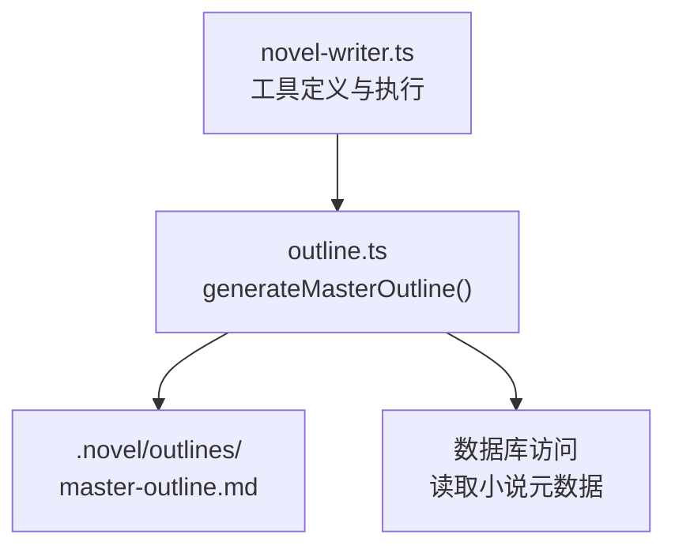
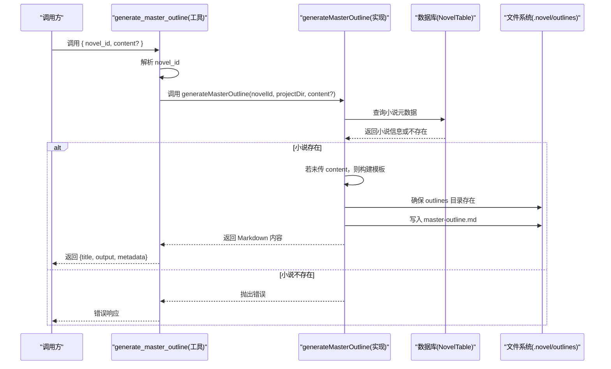

# 总纲管理 API

<cite>
**本文引用的文件**   
- [packages/plugin/src/novel-writer.ts](file://packages/plugin/src/novel-writer.ts)
- [packages/plugin/src/novel-writer/outline.ts](file://packages/plugin/src/novel-writer/outline.ts)
- [packages/plugin/test/novel-writer/e2e.test.ts](file://packages/plugin/test/novel-writer/e2e.test.ts)
</cite>

## 目录
1. [简介](#简介)
2. [项目结构](#项目结构)
3. [核心组件](#核心组件)
4. [架构总览](#架构总览)
5. [详细组件分析](#详细组件分析)
6. [依赖关系分析](#依赖关系分析)
7. [性能考虑](#性能考虑)
8. [故障排查指南](#故障排查指南)
9. [结论](#结论)
10. [附录](#附录)

## 简介
本章节面向 openNovel 的“总纲管理”能力，聚焦 generate_master_outline 工具的使用与规范。该工具用于生成并写入小说整体大纲（master-outline.md），支持两种模式：
- 空模板模式：不传 content 时自动生成结构化模板，便于后续填充。
- 实际内容模式：传入 content 时直接以提供的 Markdown 全文覆盖写入。

总纲文件统一存储于 .novel/outlines/master-outline.md，遵循 Markdown 格式规范，包含故事梗概、主线剧情、角色列表、世界观概要等模块。

## 项目结构
与总纲管理相关的代码主要位于 packages/plugin 中：
- 工具定义与执行入口：packages/plugin/src/novel-writer.ts
- 大纲生成逻辑与文件写入：packages/plugin/src/novel-writer/outline.ts
- 端到端测试用例（含调用示例）：packages/plugin/test/novel-writer/e2e.test.ts



图表来源
- [packages/plugin/src/novel-writer.ts:541-563](file://packages/plugin/src/novel-writer.ts#L541-L563)
- [packages/plugin/src/novel-writer/outline.ts:81-90](file://packages/plugin/src/novel-writer/outline.ts#L81-L90)

章节来源
- [packages/plugin/src/novel-writer.ts:541-563](file://packages/plugin/src/novel-writer.ts#L541-L563)
- [packages/plugin/src/novel-writer/outline.ts:81-90](file://packages/plugin/src/novel-writer/outline.ts#L81-L90)

## 核心组件
- 工具名称：generate_master_outline
- 作用：生成整体大纲，写入 .novel/outlines/master-outline.md。若传入 content，则使用实际内容；否则生成空模板。
- 参数：
  - novel_id：字符串，必填。小说 ID，用于定位目标小说。
  - content：字符串，可选。Markdown 全文。director 根据小说设定生成实际内容后传入；留空则生成模板。
- 返回值：
  - title：固定为 "generate_master_outline"
  - output：提示文本，包含文件名 master-outline.md 及字数统计；当未传 content 时会标注“模板，需填充内容”。
  - metadata：包含 novel_id 与 length（生成的 Markdown 字符长度）。

章节来源
- [packages/plugin/src/novel-writer.ts:541-563](file://packages/plugin/src/novel-writer.ts#L541-L563)

## 架构总览
下图展示了从工具调用到文件落盘的完整流程，包括参数校验、ID 解析、数据库查询、模板构建与文件写入。



图表来源
- [packages/plugin/src/novel-writer.ts:541-563](file://packages/plugin/src/novel-writer.ts#L541-L563)
- [packages/plugin/src/novel-writer/outline.ts:81-90](file://packages/plugin/src/novel-writer/outline.ts#L81-L90)

## 详细组件分析

### 工具定义与执行（generate_master_outline）
- 描述：生成整体大纲，写入 .novel/outlines/master-outline.md。传入 content 时使用实际内容；不传时生成空模板。
- 参数说明：
  - novel_id：小说 ID（字符串）
  - content：大纲 Markdown 全文（字符串，可选）
- 执行流程：
  - 解析 novel_id
  - 获取项目目录
  - 调用 generateMasterOutline 生成并写入文件
  - 返回统一的 tool 结果对象（title、output、metadata）

章节来源
- [packages/plugin/src/novel-writer.ts:541-563](file://packages/plugin/src/novel-writer.ts#L541-L563)

### 核心实现（generateMasterOutline）
- 功能：
  - 通过数据库查询小说元数据（标题、题材、状态、梗概等）
  - 若未提供 content，则基于元数据构建模板
  - 确保 .novel/outlines 目录存在
  - 将最终 Markdown 写入 master-outline.md
  - 返回生成的 Markdown 内容
- 关键点：
  - 不写入 DB（整体大纲是小说层面的元信息，不新增表记录）
  - 模板包含：故事梗概、主线剧情（四幕）、角色列表、世界观概要

章节来源
- [packages/plugin/src/novel-writer/outline.ts:81-90](file://packages/plugin/src/novel-writer/outline.ts#L81-L90)
- [packages/plugin/src/novel-writer/outline.ts:92-171](file://packages/plugin/src/novel-writer/outline.ts#L92-L171)

### 模板结构与文件格式规范
- 文件路径：.novel/outlines/master-outline.md
- 编码：UTF-8
- 结构建议：
  - 标题：《小说名》整体大纲
  - 元信息行：题材、状态、生成时间
  - 故事梗概：优先使用小说元数据的 synopsis，若无则占位提示
  - 主线剧情：分四幕（开端、发展、高潮、结局），每幕有占位提示
  - 角色列表：主角、重要配角、反派三类表格
  - 世界观概要：世界背景、力量体系、重要设定
- 注意事项：
  - 模板中的占位提示用于引导填写，实际使用时应替换为具体内容
  - 保持 Markdown 层级清晰，便于阅读与渲染

章节来源
- [packages/plugin/src/novel-writer/outline.ts:92-171](file://packages/plugin/src/novel-writer/outline.ts#L92-L171)

### 使用场景示例

#### 场景一：生成空模板
- 适用时机：首次创建总纲，或需要重新生成模板以便填充内容
- 参数配置：
  - novel_id：目标小说 ID
  - content：不传或为空
- 预期行为：
  - 系统自动构建模板并写入 master-outline.md
  - 返回 output 中包含“模板，需填充内容”的提示
  - metadata.length 为模板内容的字符长度

章节来源
- [packages/plugin/src/novel-writer.ts:541-563](file://packages/plugin/src/novel-writer.ts#L541-L563)
- [packages/plugin/test/novel-writer/e2e.test.ts:419-427](file://packages/plugin/test/novel-writer/e2e.test.ts#L419-L427)

#### 场景二：使用实际内容生成
- 适用时机：director 已根据小说设定生成完整的大纲内容
- 参数配置：
  - novel_id：目标小说 ID
  - content：完整的 Markdown 全文
- 预期行为：
  - 系统直接将 content 写入 master-outline.md
  - 返回 output 中不包含“模板”提示
  - metadata.length 为传入内容的字符长度

章节来源
- [packages/plugin/src/novel-writer.ts:541-563](file://packages/plugin/src/novel-writer.ts#L541-L563)

### 错误处理与返回值格式

#### 错误处理
- 小说不存在：当 novel_id 对应的小说在数据库中不存在时，实现层会抛出错误，提示“小说不存在：{novelId}”
- 文件写入失败：底层文件系统操作异常（如权限不足、磁盘空间不足）将导致写入失败，调用方需捕获并处理

章节来源
- [packages/plugin/src/novel-writer/outline.ts:84](file://packages/plugin/src/novel-writer/outline.ts#L84)

#### 返回值格式
- title：固定为 "generate_master_outline"
- output：人类可读的提示信息，包含文件名与字数统计，模板模式下会标注“模板，需填充内容”
- metadata：
  - novel_id：解析后的小说 ID
  - length：生成的 Markdown 字符长度

章节来源
- [packages/plugin/src/novel-writer.ts:557-561](file://packages/plugin/src/novel-writer.ts#L557-L561)

## 依赖关系分析
- 工具层（novel-writer.ts）负责参数解析、上下文获取与统一返回格式封装
- 实现层（outline.ts）负责业务逻辑：数据库查询、模板构建、文件写入
- 文件系统：确保 .novel/outlines 目录存在，并写入 master-outline.md
- 数据库：读取 NovelTable 中的小说元数据（标题、题材、状态、梗概）

```mermaid
classDiagram
class ToolLayer {
+execute(args, ctx)
+resolveNovelId(db, args.novel_id)
+projectDirFromCtx(ctx.directory)
}
class Implementation {
+generateMasterOutline(novelId, projectDir, content?)
+buildMasterOutlineTemplate(novel)
+ensureOutlineDir(projectDir)
}
class Database {
+select().from(NovelTable).where(...)
}
class FileSystem {
+existsSync(dir)
+mkdirSync(dir, {recursive : true})
+writeFileSync(path, content)
}
ToolLayer --> Implementation : "调用"
Implementation --> Database : "查询小说元数据"
Implementation --> FileSystem : "确保目录并写入文件"
```

图表来源
- [packages/plugin/src/novel-writer.ts:541-563](file://packages/plugin/src/novel-writer.ts#L541-L563)
- [packages/plugin/src/novel-writer/outline.ts:81-90](file://packages/plugin/src/novel-writer/outline.ts#L81-L90)

章节来源
- [packages/plugin/src/novel-writer.ts:541-563](file://packages/plugin/src/novel-writer.ts#L541-L563)
- [packages/plugin/src/novel-writer/outline.ts:81-90](file://packages/plugin/src/novel-writer/outline.ts#L81-L90)

## 性能考虑
- 数据库查询：仅一次 SELECT 查询小说元数据，复杂度 O(1)
- 模板构建：字符串拼接，复杂度与模板行数线性相关，通常较小
- 文件写入：单次 writeFileSync，I/O 开销取决于文件大小
- 目录检查：existsSync + mkdirSync，仅在目录不存在时创建，开销极低
- 总体性能：轻量级操作，适合高频调用；建议在批量生成时合并 I/O 操作以减少磁盘访问次数

[本节为通用指导，无需特定文件引用]

## 故障排查指南
- 常见问题：
  - 小说不存在：检查 novel_id 是否正确，确认数据库中是否存在对应小说记录
  - 文件写入失败：检查项目目录权限、磁盘空间、路径是否可写
  - 模板未更新：确认是否传入 content 覆盖了模板；如需重新生成模板，请清空 content 参数
- 调试建议：
  - 查看 output 字段中的提示信息，确认是否处于模板模式
  - 检查 metadata.length 是否与预期一致，验证内容是否成功写入
  - 直接读取 .novel/outlines/master-outline.md 文件，确认内容是否符合预期

章节来源
- [packages/plugin/src/novel-writer/outline.ts:84](file://packages/plugin/src/novel-writer/outline.ts#L84)
- [packages/plugin/src/novel-writer.ts:557-561](file://packages/plugin/src/novel-writer.ts#L557-L561)

## 结论
generate_master_outline 工具提供了简洁高效的总纲管理能力，支持模板与实际内容两种模式，统一输出格式便于集成与自动化。通过规范的存储位置与文件格式，确保了大纲内容的一致性与可维护性。在实际使用中，建议结合 director 的智能生成能力，先产出高质量内容再传入 content，以获得最佳效果。

[本节为总结性内容，无需特定文件引用]

## 附录

### 参数与返回值速查表
- 输入参数：
  - novel_id：字符串，必填
  - content：字符串，可选
- 返回字段：
  - title：固定值 "generate_master_outline"
  - output：提示文本（含文件名与字数，模板模式标注“模板，需填充内容”）
  - metadata：{ novel_id, length }

章节来源
- [packages/plugin/src/novel-writer.ts:541-563](file://packages/plugin/src/novel-writer.ts#L541-L563)

### 模板结构要点
- 标题：《小说名》整体大纲
- 元信息：题材、状态、生成时间
- 故事梗概：优先使用 synopsis，否则占位提示
- 主线剧情：四幕结构（开端、发展、高潮、结局）
- 角色列表：主角、重要配角、反派表格
- 世界观概要：世界背景、力量体系、重要设定

章节来源
- [packages/plugin/src/novel-writer/outline.ts:92-171](file://packages/plugin/src/novel-writer/outline.ts#L92-L171)