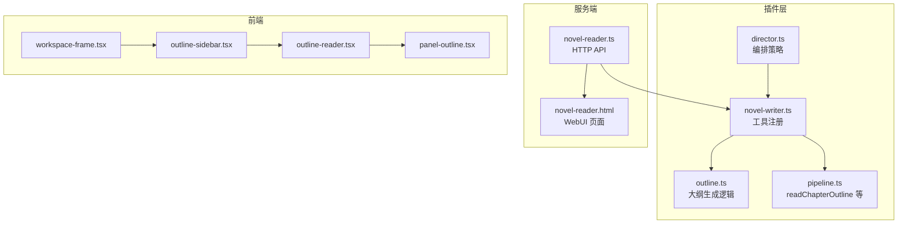
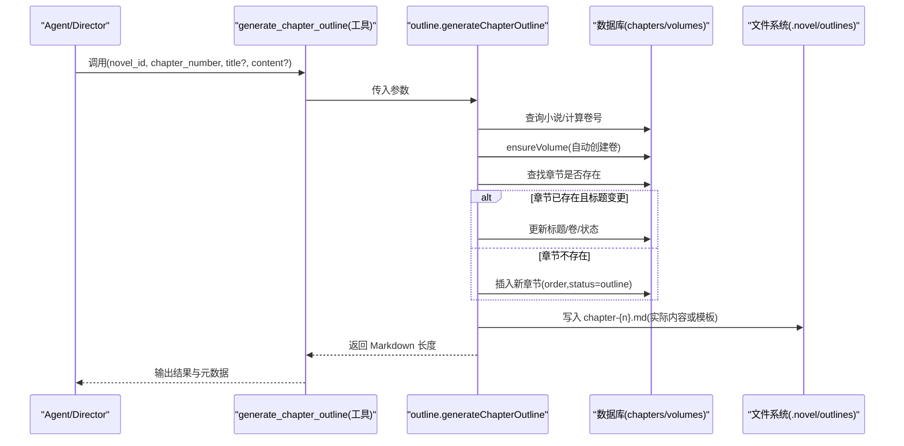
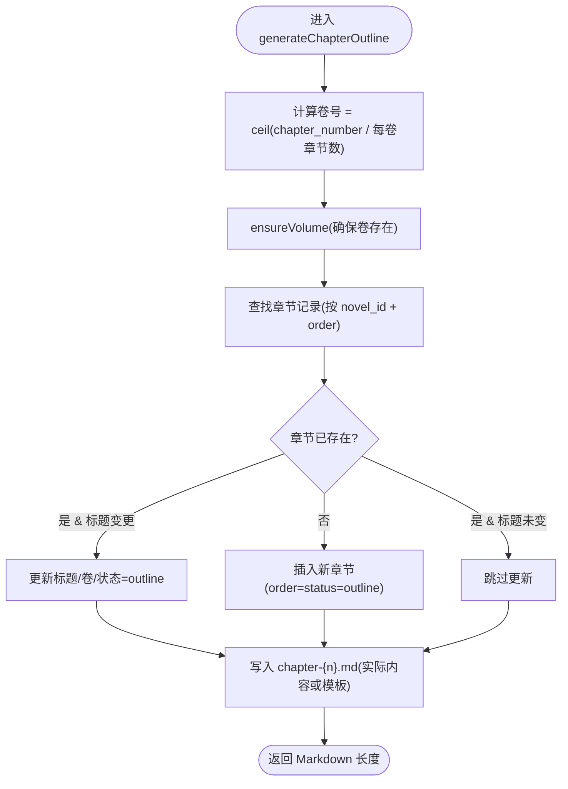
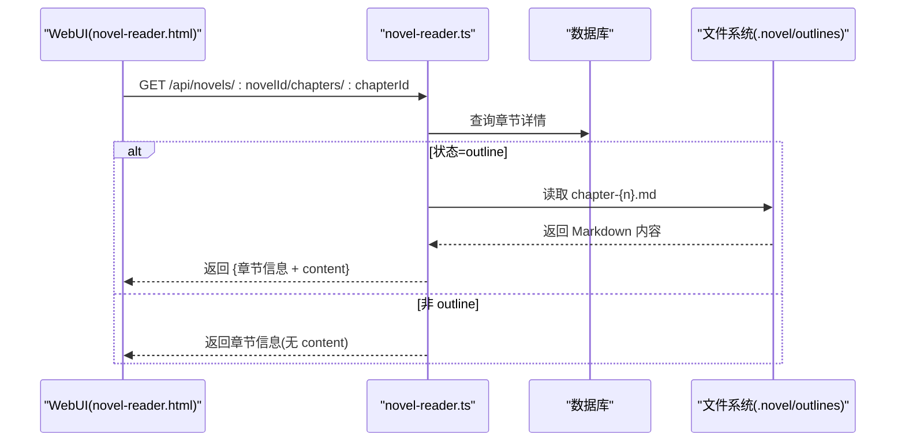
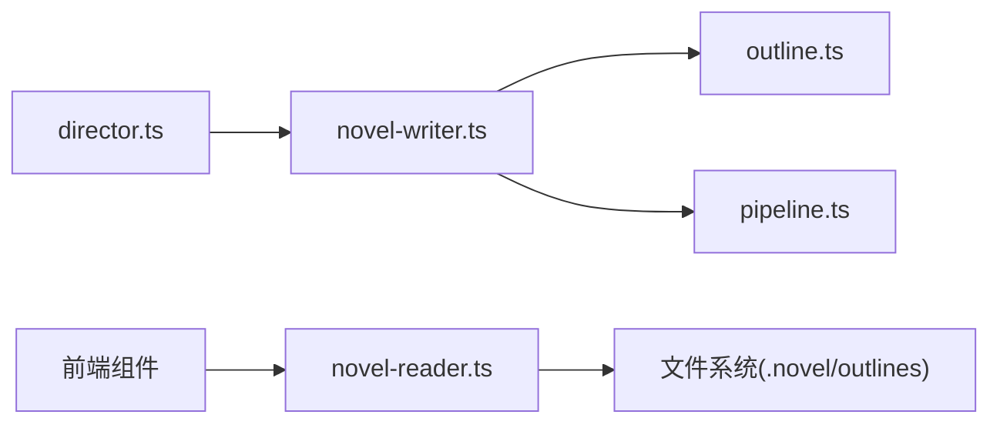

# 章节大纲 API

<cite>
**本文引用的文件**   
- [novel-writer.ts](file://packages/plugin/src/novel-writer.ts)
- [outline.ts](file://packages/plugin/src/novel-writer/outline.ts)
- [pipeline.ts](file://packages/plugin/src/novel-writer/pipeline.ts)
- [director.ts](file://packages/plugin/src/novel-writer/agents/director.ts)
- [novel-reader.ts](file://packages/opencode/src/server/routes/instance/httpapi/novel-reader.ts)
- [novel-reader.html](file://packages/opencode/src/server/routes/instance/httpapi/novel-reader.html)
- [workspace-frame.tsx](file://packages/app/src/pages/novel/workspace-frame.tsx)
- [outline-sidebar.tsx](file://packages/app/src/pages/novel/outline-sidebar.tsx)
- [outline-reader.tsx](file://packages/app/src/pages/novel/outline-reader.tsx)
- [panel-outline.tsx](file://packages/app/src/pages/novel/panel-outline.tsx)
</cite>

## 目录
1. [简介](#简介)
2. [项目结构](#项目结构)
3. [核心组件](#核心组件)
4. [架构总览](#架构总览)
5. [详细组件分析](#详细组件分析)
6. [依赖关系分析](#依赖关系分析)
7. [性能考量](#性能考量)
8. [故障排查指南](#故障排查指南)
9. [结论](#结论)
10. [附录](#附录)

## 简介
本文件为 openNovel 的“章节大纲 API”提供完整、可操作的技术文档，重点说明 generate_chapter_outline 工具的高级能力：自动创建所属卷记录、章节序号管理与标题更新机制；详解 content 参数的内容结构要求（章节目标、关键场景、角色出场、剧情推进等）；给出完整的章节大纲生成流程与 WebUI 集成方式；并说明与 read_chapter_outline 的配合使用方法。

## 项目结构
章节大纲功能由插件层（novel-writer）、大纲逻辑（outline）、流水线辅助（pipeline）、编排 Agent（director）、HTTP 阅读器（novel-reader）以及前端 UI（app）共同组成。整体分层清晰：
- 插件层暴露工具接口，供 agent 调用
- outline 模块实现三级大纲（总纲/卷纲/章纲）的持久化
- pipeline 提供读取章节大纲等辅助函数
- director 编排写作流程，指导如何正确使用大纲工具
- HTTP 阅读器提供 WebUI 数据源
- 前端负责展示与编辑大纲

图表来源
- [novel-writer.ts:595-655](file://packages/plugin/src/novel-writer.ts#L595-L655)
- [outline.ts:284-428](file://packages/plugin/src/novel-writer/outline.ts#L284-L428)
- [pipeline.ts:38-46](file://packages/plugin/src/novel-writer/pipeline.ts#L38-L46)
- [director.ts:86-93](file://packages/plugin/src/novel-writer/agents/director.ts#L86-L93)
- [novel-reader.ts:82-104](file://packages/opencode/src/server/routes/instance/httpapi/novel-reader.ts#L82-L104)
- [novel-reader.html:1502-1572](file://packages/opencode/src/server/routes/instance/httpapi/novel-reader.html#L1502-L1572)
- [workspace-frame.tsx:463-486](file://packages/app/src/pages/novel/workspace-frame.tsx#L463-L486)
- [outline-sidebar.tsx:1-27](file://packages/app/src/pages/novel/outline-sidebar.tsx#L1-L27)
- [outline-reader.tsx:1-36](file://packages/app/src/pages/novel/outline-reader.tsx#L1-L36)
- [panel-outline.tsx:187-215](file://packages/app/src/pages/novel/panel-outline.tsx#L187-L215)

章节来源
- [novel-writer.ts:595-655](file://packages/plugin/src/novel-writer.ts#L595-L655)
- [outline.ts:284-428](file://packages/plugin/src/novel-writer/outline.ts#L284-L428)
- [pipeline.ts:38-46](file://packages/plugin/src/novel-writer/pipeline.ts#L38-L46)
- [director.ts:86-93](file://packages/plugin/src/novel-writer/agents/director.ts#L86-L93)
- [novel-reader.ts:82-104](file://packages/opencode/src/server/routes/instance/httpapi/novel-reader.ts#L82-L104)
- [novel-reader.html:1502-1572](file://packages/opencode/src/server/routes/instance/httpapi/novel-reader.html#L1502-L1572)
- [workspace-frame.tsx:463-486](file://packages/app/src/pages/novel/workspace-frame.tsx#L463-L486)
- [outline-sidebar.tsx:1-27](file://packages/app/src/pages/novel/outline-sidebar.tsx#L1-L27)
- [outline-reader.tsx:1-36](file://packages/app/src/pages/novel/outline-reader.tsx#L1-L36)
- [panel-outline.tsx:187-215](file://packages/app/src/pages/novel/panel-outline.tsx#L187-L215)

## 核心组件
- generate_chapter_outline 工具：创建章节大纲 DB 记录并写入 .novel/outlines/chapter-{n}.md，自动确保所属卷存在，支持标题更新与模板/实际内容两种模式。
- read_chapter_outline 工具：从数据库读取指定章节元信息（ID、标题、序号、字数、状态），用于流水线 plan 阶段。
- outline.ts 中的 generateChapterOutline：实现章节大纲生成的核心逻辑（卷自动创建、章节序号管理、标题更新、Markdown 模板或实际内容写入）。
- pipeline.ts 中的 readChapterOutline：读取章节记录的辅助函数。
- director.ts：编排策略，指导如何先产出实际大纲内容再通过 content 参数传入工具持久化。
- novel-reader.ts / novel-reader.html：提供 WebUI 的数据接口与页面渲染，支持按章节 ID 获取大纲内容（当章节状态为 outline 时返回对应 Markdown 文件内容）。
- app 侧 OutlineReader/OutlineSidebar/PanelOutline：在 WebUI 中浏览、编辑与保存章节大纲。

章节来源
- [novel-writer.ts:595-655](file://packages/plugin/src/novel-writer.ts#L595-L655)
- [outline.ts:284-428](file://packages/plugin/src/novel-writer/outline.ts#L284-L428)
- [pipeline.ts:38-46](file://packages/plugin/src/novel-writer/pipeline.ts#L38-L46)
- [director.ts:86-93](file://packages/plugin/src/novel-writer/agents/director.ts#L86-L93)
- [novel-reader.ts:82-104](file://packages/opencode/src/server/routes/instance/httpapi/novel-reader.ts#L82-L104)
- [novel-reader.html:1502-1572](file://packages/opencode/src/server/routes/instance/httpapi/novel-reader.html#L1502-L1572)
- [outline-reader.tsx:1-36](file://packages/app/src/pages/novel/outline-reader.tsx#L1-L36)
- [outline-sidebar.tsx:1-27](file://packages/app/src/pages/novel/outline-sidebar.tsx#L1-L27)
- [panel-outline.tsx:187-215](file://packages/app/src/pages/novel/panel-outline.tsx#L187-L215)

## 架构总览
generate_chapter_outline 的工作流如下：
- 插件工具接收 novel_id、chapter_number、title、content
- 解析小说 ID，计算所属卷号，确保卷记录存在（不存在则创建默认卷）
- 若章节已存在且 title 变化，则更新标题、关联卷、状态为 outline
- 若章节不存在，则新建章节记录（含 order、status=outline）
- 将大纲内容（实际内容或模板）写入 .novel/outlines/chapter-{n}.md
- 返回输出与元数据（novel_id、chapter_number、长度）

图表来源
- [novel-writer.ts:595-627](file://packages/plugin/src/novel-writer.ts#L595-L627)
- [outline.ts:284-428](file://packages/plugin/src/novel-writer/outline.ts#L284-L428)

章节来源
- [novel-writer.ts:595-627](file://packages/plugin/src/novel-writer.ts#L595-L627)
- [outline.ts:284-428](file://packages/plugin/src/novel-writer/outline.ts#L284-L428)

## 详细组件分析

### generate_chapter_outline 工具
- 作用：创建/更新章节大纲记录，并写入 Markdown 文件。
- 参数：
  - novel_id：小说 ID
  - chapter_number：章节序号（从 1 开始）
  - title：可选，章节标题；重新生成时传入会更新原有记录
  - content：可选，章节大纲 Markdown 全文；留空则生成模板
- 行为要点：
  - 自动创建所属卷记录（如不存在）
  - 章节序号管理：order 固定为 chapter_number
  - 标题更新：若已有记录且 title 不同，则更新标题、卷、状态
  - 内容写入：.novel/outlines/chapter-{n}.md，内容为 content 或模板
- 返回值：包含输出文本与元数据（novel_id、chapter_number、length）

章节来源
- [novel-writer.ts:595-627](file://packages/plugin/src/novel-writer.ts#L595-L627)
- [outline.ts:284-428](file://packages/plugin/src/novel-writer/outline.ts#L284-L428)

### read_chapter_outline 工具
- 作用：读取章节大纲元信息（ID、标题、序号、字数、状态），用于流水线 plan 阶段。
- 参数：
  - novel_id：小说 ID
  - chapter_number：章节序号
- 行为要点：
  - 通过 pipeline.readChapterOutline 查询数据库
  - 若不存在，返回提示先调用 generate_chapter_outline
- 返回值：章节元信息与元数据（chapter_id、title、order、word_count）

章节来源
- [novel-writer.ts:628-655](file://packages/plugin/src/novel-writer.ts#L628-L655)
- [pipeline.ts:38-46](file://packages/plugin/src/novel-writer/pipeline.ts#L38-L46)

### outline.generateChapterOutline 核心逻辑
- 自动卷创建：根据 chapter_number 计算卷号，确保卷存在（不存在则创建默认卷）
- 章节序号管理：order 固定为 chapter_number，避免重复与错位
- 标题更新机制：若已有记录且 title 不同，则更新标题、卷、状态为 outline
- 内容写入：.novel/outlines/chapter-{n}.md，支持实际内容或模板
- 复杂度：O(1) 数据库查询与一次文件写入

图表来源
- [outline.ts:284-428](file://packages/plugin/src/novel-writer/outline.ts#L284-L428)

章节来源
- [outline.ts:284-428](file://packages/plugin/src/novel-writer/outline.ts#L284-L428)

### director 编排策略（如何使用 generate_chapter_outline）
- 不要直接调用工具生成空模板；应先阅读上下文（assemble_context_snapshot 或已有设定），生成实际的章节大纲内容（Markdown），再通过 title + content 参数传给工具持久化。
- 批量生成时逐章调用，每章都先写实际标题和内容再传入。
- 重新生成某章大纲时，工具会自动更新原有记录（按章节序号匹配），不会创建重复记录。

章节来源
- [director.ts:86-93](file://packages/plugin/src/novel-writer/agents/director.ts#L86-L93)

### WebUI 集成（novel-reader 与前端）
- HTTP API：GET /api/novels/:novelId/chapters/:chapterId
  - 当章节状态为 outline 时，返回章节记录并附加对应 Markdown 文件内容（chapter-{n}.md）
- WebUI 页面：novel-reader.html 渲染章节大纲，支持返回卷目与章节列表
- 前端组件：
  - workspace-frame.tsx 切换左侧模式为 outlines，加载 OutlineReader
  - outline-sidebar.tsx 列出卷与章节，选择大纲目标
  - outline-reader.tsx 渲染与编辑大纲内容
  - panel-outline.tsx 提供编辑按钮与保存逻辑

图表来源
- [novel-reader.ts:82-104](file://packages/opencode/src/server/routes/instance/httpapi/novel-reader.ts#L82-L104)
- [novel-reader.html:1502-1572](file://packages/opencode/src/server/routes/instance/httpapi/novel-reader.html#L1502-L1572)

章节来源
- [novel-reader.ts:82-104](file://packages/opencode/src/server/routes/instance/httpapi/novel-reader.ts#L82-L104)
- [novel-reader.html:1502-1572](file://packages/opencode/src/server/routes/instance/httpapi/novel-reader.html#L1502-L1572)
- [workspace-frame.tsx:463-486](file://packages/app/src/pages/novel/workspace-frame.tsx#L463-L486)
- [outline-sidebar.tsx:1-27](file://packages/app/src/pages/novel/outline-sidebar.tsx#L1-L27)
- [outline-reader.tsx:1-36](file://packages/app/src/pages/novel/outline-reader.tsx#L1-L36)
- [panel-outline.tsx:187-215](file://packages/app/src/pages/novel/panel-outline.tsx#L187-L215)

### content 参数的内容结构要求
- 章节目标：
  - 剧情目标：本章需要完成的剧情推进目标
  - 情感目标：希望带给读者的情感体验
  - 信息目标：向读者传递的关键信息（世界观揭示、伏笔暗示等）
- 关键场景：
  - 每个场景需包含地点、时间、出场角色、场景概要、字数预估
  - 建议至少四个场景：开场、发展、高潮/转折、收尾
- 角色出场：
  - 表格形式列出角色、出场场景、作用、状态变化
  - 对话要点：列出关键对话的核心内容
- 打脸设计（如适用）：
  - 四拍结构：轻视 → 冲突 → 反转 → 打脸
- 其他：
  - 与前文的衔接和为后文埋的钩子
  - 参考大纲系统（总纲/卷纲/章纲）确保意图一致

章节来源
- [outline.ts:336-428](file://packages/plugin/src/novel-writer/outline.ts#L336-L428)
- [novel-writer.ts:604-608](file://packages/plugin/src/novel-writer.ts#L604-L608)

## 依赖关系分析
- novel-writer.ts 依赖 outline.ts 的 generateChapterOutline 与 pipeline.ts 的 readChapterOutline
- director.ts 通过 systemPrompt 指导 agent 使用 generate_chapter_outline 的正确方式
- novel-reader.ts 提供 HTTP API，结合文件系统读取 Markdown 内容
- 前端组件通过 API 与状态联动，展示与编辑大纲

图表来源
- [novel-writer.ts:595-655](file://packages/plugin/src/novel-writer.ts#L595-L655)
- [outline.ts:284-428](file://packages/plugin/src/novel-writer/outline.ts#L284-L428)
- [pipeline.ts:38-46](file://packages/plugin/src/novel-writer/pipeline.ts#L38-L46)
- [director.ts:86-93](file://packages/plugin/src/novel-writer/agents/director.ts#L86-L93)
- [novel-reader.ts:82-104](file://packages/opencode/src/server/routes/instance/httpapi/novel-reader.ts#L82-L104)

章节来源
- [novel-writer.ts:595-655](file://packages/plugin/src/novel-writer.ts#L595-L655)
- [outline.ts:284-428](file://packages/plugin/src/novel-writer/outline.ts#L284-L428)
- [pipeline.ts:38-46](file://packages/plugin/src/novel-writer/pipeline.ts#L38-L46)
- [director.ts:86-93](file://packages/plugin/src/novel-writer/agents/director.ts#L86-L93)
- [novel-reader.ts:82-104](file://packages/opencode/src/server/routes/instance/httpapi/novel-reader.ts#L82-L104)

## 性能考量
- 数据库查询为 O(1) 级别（按 novel_id + order 精确匹配）
- 文件写入为单次 I/O，路径稳定（.novel/outlines/chapter-{n}.md）
- WebUI 读取章节时仅在状态为 outline 时额外读取 Markdown 文件，避免不必要的 I/O
- 批量生成时逐章调用，注意并发限制与磁盘 I/O 峰值

[本节为通用指导，不直接分析具体文件]

## 故障排查指南
- 章节不存在：read_chapter_outline 返回提示先调用 generate_chapter_outline
- 卷不存在：generateChapterOutline 会自动创建默认卷，无需手动处理
- 标题未更新：确保传入新的 title；若 title 相同则不会触发更新
- 内容为空：content 留空会生成模板，需在 WebUI 或后续步骤填充实际内容
- WebUI 无法显示大纲：确认章节状态为 outline 且对应 Markdown 文件存在

章节来源
- [novel-writer.ts:628-655](file://packages/plugin/src/novel-writer.ts#L628-L655)
- [outline.ts:284-428](file://packages/plugin/src/novel-writer/outline.ts#L284-L428)
- [novel-reader.ts:82-104](file://packages/opencode/src/server/routes/instance/httpapi/novel-reader.ts#L82-L104)

## 结论
generate_chapter_outline 提供了强大的章节大纲管理能力，包括自动卷创建、序号管理、标题更新与内容持久化。配合 read_chapter_outline 可实现完整的计划-生成-查看流程。WebUI 集成使得用户可以直接浏览与编辑大纲，提升创作效率。遵循 director 的编排策略，可以确保大纲内容与小说设定保持一致。

[本节为总结性内容，不直接分析具体文件]

## 附录
- 常用工具组合：
  - 生成大纲：generate_chapter_outline(novel_id, chapter_number, title?, content?)
  - 读取大纲：read_chapter_outline(novel_id, chapter_number)
  - 读取 Markdown：read_outline(type="chapter", number=chapter_number)
- WebUI 访问：
  - 打开 reader 页面，选择卷与章节，查看/编辑大纲
  - 通过 OutlineReader 组件进行在线编辑与保存

[本节为补充信息，不直接分析具体文件]