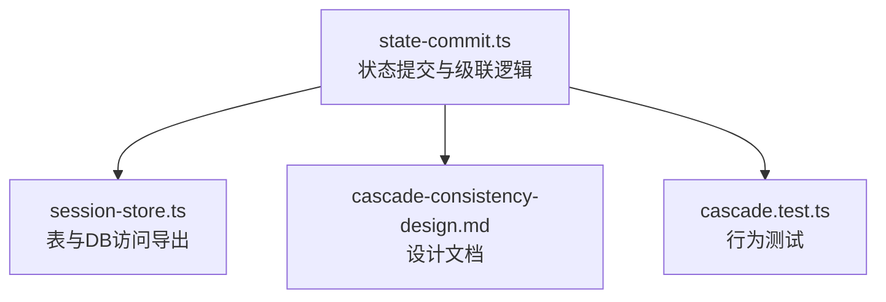
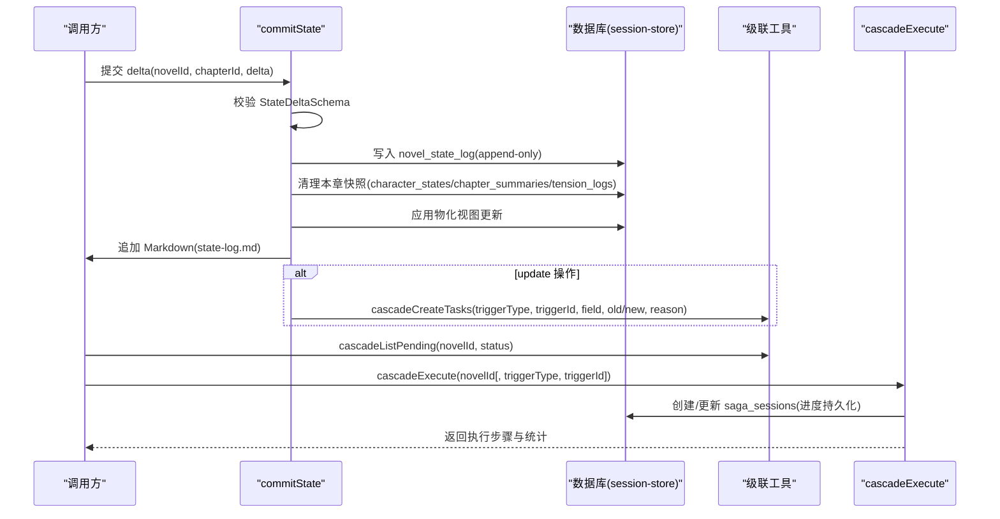
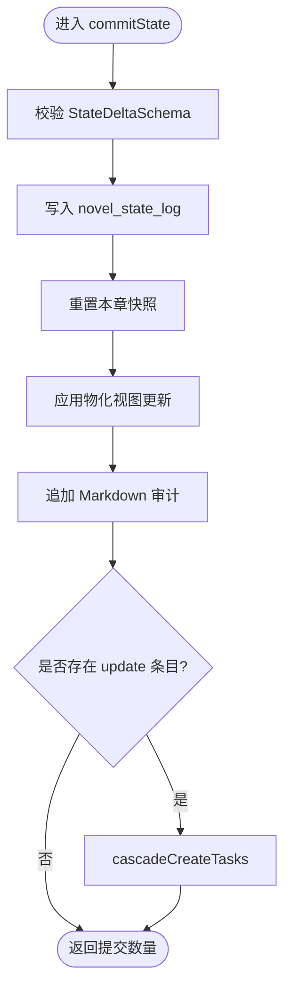
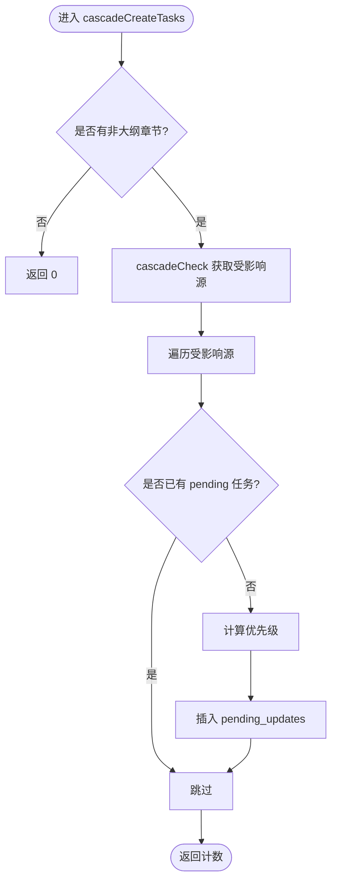
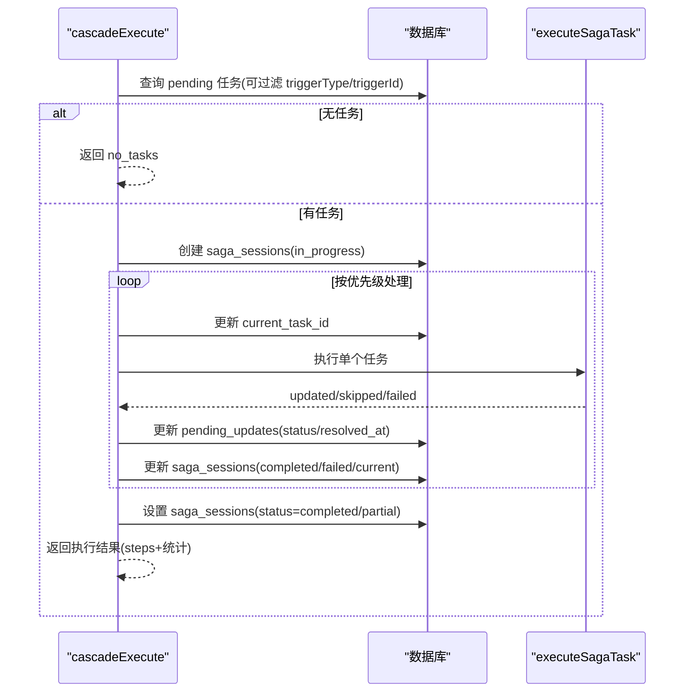
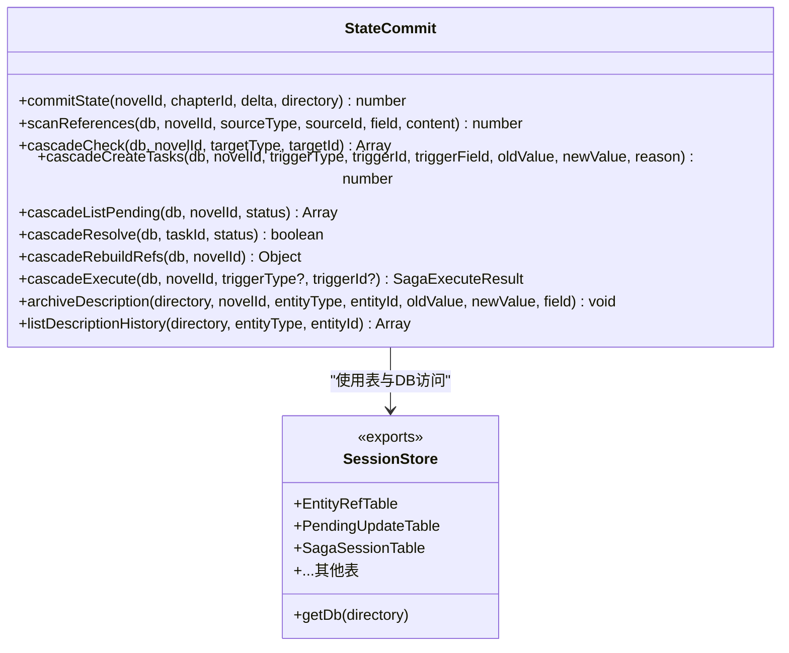
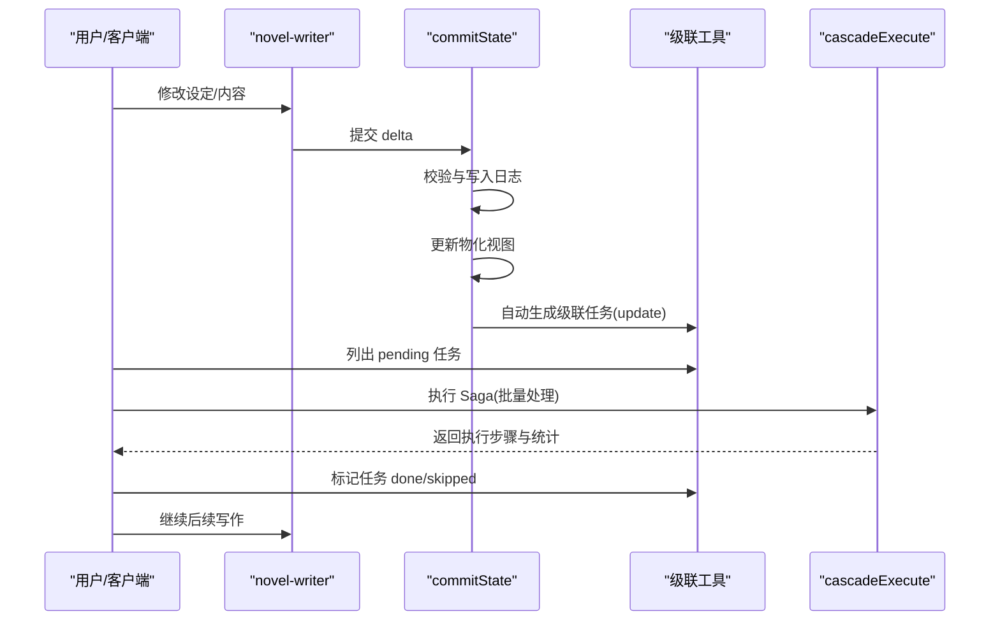

# 状态提交与版本控制 API

<cite>
**本文引用的文件**   
- [state-commit.ts](file://packages/plugin/src/novel-writer/state-commit.ts)
- [session-store.ts](file://packages/plugin/src/novel-writer/session-store.ts)
- [cascade-consistency-design.md](file://docs/cascade-consistency-design.md)
- [cascade.test.ts](file://packages/plugin/test/novel-writer/cascade.test.ts)
</cite>

## 目录
1. [简介](#简介)
2. [项目结构](#项目结构)
3. [核心组件](#核心组件)
4. [架构总览](#架构总览)
5. [详细组件分析](#详细组件分析)
6. [依赖关系分析](#依赖关系分析)
7. [性能考量](#性能考量)
8. [故障排查指南](#故障排查指南)
9. [结论](#结论)
10. [附录：完整工作流示例](#附录完整工作流示例)

## 简介
本文件面向 openNovel 的状态提交与版本控制 API，聚焦以下能力：
- commitState：将状态变更 delta 写入 append-only 日志、更新物化视图并同步 Markdown 审计记录。
- cascadeCreateTasks：基于实体引用关系生成级联统改任务（pending_updates）。
- cascadeExecute：Saga 式批量执行器，按优先级处理 pending 任务，持久化执行进度。
- 状态差异验证、冲突解决与历史版本管理：通过 schema 校验、去重策略、描述历史归档与 Saga 会话实现。

该体系确保在设定或内容变更后，所有受影响的章节/角色/卷纲等实体被识别、审批与统一改写，避免不一致与“幽灵引用”。

## 项目结构
围绕 novel-writer 插件的 state-commit 模块，核心文件如下：
- state-commit.ts：实现 commitState、scanReferences、cascadeCheck、cascadeCreateTasks、cascadeListPending、cascadeResolve、cascadeRebuildRefs、cascadeExecute、archiveDescription、listDescriptionHistory 等。
- session-store.ts：导出 @opennovel-ai/novel-store 中的表定义与数据库访问（EntityRefTable、PendingUpdateTable、SagaSessionTable 等）。
- cascade-consistency-design.md：级联一致性设计文档，说明流程、表结构与集成点。
- cascade.test.ts：覆盖级联创建任务、待办列表、标记完成/跳过、Saga 执行与幂等性等用例。

图表来源
- [state-commit.ts:1-120](file://packages/plugin/src/novel-writer/state-commit.ts#L1-L120)
- [session-store.ts:1-2](file://packages/plugin/src/novel-writer/session-store.ts#L1-L2)
- [cascade-consistency-design.md:189-277](file://docs/cascade-consistency-design.md#L189-L277)
- [cascade.test.ts:155-370](file://packages/plugin/test/novel-writer/cascade.test.ts#L155-L370)

章节来源
- [state-commit.ts:1-120](file://packages/plugin/src/novel-writer/state-commit.ts#L1-L120)
- [session-store.ts:1-2](file://packages/plugin/src/novel-writer/session-store.ts#L1-L2)
- [cascade-consistency-design.md:1-120](file://docs/cascade-consistency-design.md#L1-L120)
- [cascade.test.ts:155-242](file://packages/plugin/test/novel-writer/cascade.test.ts#L155-L242)

## 核心组件
- 事实类型与 Delta Schema
  - FACT_TYPES：character、relationship、plot_thread、foreshadow、world_entry、chapter_summary、style、timeline、location、tension。
  - StateDeltaEntrySchema：fact_type、action(create/update/delete)、entity_id、data。
  - StateDeltaSchema：StateDeltaEntry 数组。
- 物化视图更新
  - applyToMaterializedView：根据 fact_type 与 action 更新对应表（如 character、relationship、plot_thread、foreshadow、world_entry、chapter_summary、style、tension）。
  - 角色 ID 解析 resolveCharacterId：按 ID 或 name 匹配，避免重复创建与孤儿状态。
- 审计与 Markdown
  - appendToMarkdown：追加 .novel/state-log.md 变更记录。
- 级联一致性
  - scanReferences：扫描正文/描述/摘要中实体名，建立 entity_refs。
  - cascadeCheck：查询受影响源（source_type/source_id/ref_field/ref_text）。
  - cascadeCreateTasks：为每个受影响源创建 pending_updates（含优先级与去重）。
  - cascadeListPending / cascadeResolve：列出与标记任务状态（done/skipped）。
  - cascadeRebuildRefs：全量重建依赖图（历史数据补建）。
  - cascadeExecute：Saga 执行器，按优先级处理 pending 任务，持久化 saga_sessions。
- 版本归档
  - archiveDescription：记录 description 字段的历史变更。
  - listDescriptionHistory：查询某实体的描述历史。

章节来源
- [state-commit.ts:37-79](file://packages/plugin/src/novel-writer/state-commit.ts#L37-L79)
- [state-commit.ts:121-237](file://packages/plugin/src/novel-writer/state-commit.ts#L121-L237)
- [state-commit.ts:321-668](file://packages/plugin/src/novel-writer/state-commit.ts#L321-L668)
- [state-commit.ts:753-905](file://packages/plugin/src/novel-writer/state-commit.ts#L753-L905)
- [state-commit.ts:917-983](file://packages/plugin/src/novel-writer/state-commit.ts#L917-L983)
- [state-commit.ts:1018-1141](file://packages/plugin/src/novel-writer/state-commit.ts#L1018-L1141)
- [state-commit.ts:1545-1600](file://packages/plugin/src/novel-writer/state-commit.ts#L1545-L1600)

## 架构总览
整体流程分为“状态提交”和“级联一致性”两条主线：
- 状态提交：commitState 校验 delta -> 写入 append-only 日志 -> 清理本章快照 -> 更新物化视图 -> 同步 Markdown -> 触发级联任务（update 分支）。
- 级联一致性：scanReferences 构建依赖 -> cascadeCheck 影响范围 -> cascadeCreateTasks 生成任务 -> cascadeListPending 展示 -> cascadeResolve 标记结果 -> cascadeExecute 批量执行（Saga）-> 重新扫描依赖。

图表来源
- [state-commit.ts:694-749](file://packages/plugin/src/novel-writer/state-commit.ts#L694-L749)
- [state-commit.ts:845-905](file://packages/plugin/src/novel-writer/state-commit.ts#L845-L905)
- [state-commit.ts:917-937](file://packages/plugin/src/novel-writer/state-commit.ts#L917-L937)
- [state-commit.ts:1018-1141](file://packages/plugin/src/novel-writer/state-commit.ts#L1018-L1141)

章节来源
- [state-commit.ts:694-749](file://packages/plugin/src/novel-writer/state-commit.ts#L694-L749)
- [state-commit.ts:845-905](file://packages/plugin/src/novel-writer/state-commit.ts#L845-L905)
- [state-commit.ts:1018-1141](file://packages/plugin/src/novel-writer/state-commit.ts#L1018-L1141)

## 详细组件分析

### commitState：状态提交
- 输入：novelId、chapterId、delta(StateDelta)、可选 directory。
- 行为：
  - 使用 Zod 校验 delta。
  - 写入 novel_state_log（append-only）。
  - 重置本章快照（character_states/chapter_summaries/tension_logs），保证一章一份幂等。
  - 逐条应用物化视图更新（不同 fact_type 映射到不同表）。
  - 追加 Markdown 审计记录。
  - 对 update 条目自动调用 cascadeCreateTasks，生成级联任务。
- 输出：提交的日志条目数量。

图表来源
- [state-commit.ts:694-749](file://packages/plugin/src/novel-writer/state-commit.ts#L694-L749)
- [state-commit.ts:296-311](file://packages/plugin/src/novel-writer/state-commit.ts#L296-L311)
- [state-commit.ts:321-668](file://packages/plugin/src/novel-writer/state-commit.ts#L321-L668)

章节来源
- [state-commit.ts:694-749](file://packages/plugin/src/novel-writer/state-commit.ts#L694-L749)

### cascadeCreateTasks：级联任务创建
- 输入：db、novelId、triggerType、triggerId、triggerField、oldValue、newValue、reason。
- 行为：
  - 若小说尚无非大纲章节，直接返回（避免初始阶段产生任务）。
  - 通过 cascadeCheck 获取受影响源列表。
  - 去重：同一 source + trigger 已有 pending 任务则跳过。
  - 计算优先级（computeCascadePriority）。
  - 插入 pending_updates 记录。
- 输出：创建的任务数量。

图表来源
- [state-commit.ts:845-905](file://packages/plugin/src/novel-writer/state-commit.ts#L845-L905)
- [state-commit.ts:821-843](file://packages/plugin/src/novel-writer/state-commit.ts#L821-L843)
- [state-commit.ts:907-915](file://packages/plugin/src/novel-writer/state-commit.ts#L907-L915)

章节来源
- [state-commit.ts:845-905](file://packages/plugin/src/novel-writer/state-commit.ts#L845-L905)

### cascadeExecute：Saga 统改执行器
- 输入：db、novelId、可选 triggerType/triggerId。
- 行为：
  - 查询 pending 任务并按优先级排序（high > medium > low）。
  - 创建 saga_sessions 记录，持久化执行进度。
  - 逐个执行 executeSagaTask：
    - character：替换描述中的旧值为新值，重扫依赖。
    - volume：替换摘要中的旧值为新值，重扫依赖。
    - chapter：标记 skipped（需 LLM 辅助改写）。
    - 其他：标记 skipped。
  - 每步更新 saga_sessions 与 pending_updates 状态。
  - 完成后设置最终状态（completed/partial/no_tasks）。
- 输出：SagaExecuteResult（包含 steps、统计信息）。

图表来源
- [state-commit.ts:1018-1141](file://packages/plugin/src/novel-writer/state-commit.ts#L1018-L1141)
- [state-commit.ts:1143-1173](file://packages/plugin/src/novel-writer/state-commit.ts#L1143-L1173)
- [state-commit.ts:1175-1283](file://packages/plugin/src/novel-writer/state-commit.ts#L1175-L1283)

章节来源
- [state-commit.ts:1018-1141](file://packages/plugin/src/novel-writer/state-commit.ts#L1018-L1141)

### 状态差异验证与冲突解决
- 差异验证：StateDeltaSchema 强制 fact_type/action/entity_id/data 格式；stringifyRules 规范化 rules 字段。
- 冲突解决：
  - 去重：resolveEntityId 针对 relationship/plot_thread/foreshadow/world_entry/style 按业务键去重；character 按 name 去重。
  - 幂等：resetChapterScopedState 保证一章一份；cascadeCreateTasks 对同一 source+trigger 的去重；cascadeRebuildRefs 幂等重建。
  - Saga 串行执行：按优先级顺序处理，后一步基于前一步结果。

章节来源
- [state-commit.ts:64-79](file://packages/plugin/src/novel-writer/state-commit.ts#L64-L79)
- [state-commit.ts:163-237](file://packages/plugin/src/novel-writer/state-commit.ts#L163-L237)
- [state-commit.ts:296-311](file://packages/plugin/src/novel-writer/state-commit.ts#L296-L311)
- [state-commit.ts:845-905](file://packages/plugin/src/novel-writer/state-commit.ts#L845-L905)
- [state-commit.ts:939-983](file://packages/plugin/src/novel-writer/state-commit.ts#L939-L983)

### 历史版本管理
- 描述历史归档：archiveDescription 记录 description 字段变更；listDescriptionHistory 查询历史。
- 审计日志：novel_state_log 作为 append-only 审计；.novel/state-log.md 提供人类可读记录。
- Saga 会话：saga_sessions 持久化执行进度，支持恢复与追踪。

章节来源
- [state-commit.ts:1545-1600](file://packages/plugin/src/novel-writer/state-commit.ts#L1545-L1600)
- [state-commit.ts:92-119](file://packages/plugin/src/novel-writer/state-commit.ts#L92-L119)
- [state-commit.ts:1055-1130](file://packages/plugin/src/novel-writer/state-commit.ts#L1055-L1130)

## 依赖关系分析
- 模块内依赖：
  - state-commit.ts 依赖 session-store.ts 导出的表与 DB 访问。
  - cascadeConsistencyDesign.md 定义了 entity_refs、pending_updates、saga_sessions 等表结构与流程。
- 外部依赖：
  - Drizzle ORM（eq/and/sql/inArray/ne 等）。
  - fs（mkdirSync/appendFileSync）用于 Markdown 审计。
  - Zod（schema 校验）。

图表来源
- [state-commit.ts:694-749](file://packages/plugin/src/novel-writer/state-commit.ts#L694-L749)
- [state-commit.ts:753-983](file://packages/plugin/src/novel-writer/state-commit.ts#L753-L983)
- [state-commit.ts:1018-1141](file://packages/plugin/src/novel-writer/state-commit.ts#L1018-L1141)
- [state-commit.ts:1545-1600](file://packages/plugin/src/novel-writer/state-commit.ts#L1545-L1600)
- [session-store.ts:1-2](file://packages/plugin/src/novel-writer/session-store.ts#L1-L2)

章节来源
- [state-commit.ts:694-749](file://packages/plugin/src/novel-writer/state-commit.ts#L694-L749)
- [session-store.ts:1-2](file://packages/plugin/src/novel-writer/session-store.ts#L1-L2)

## 性能考量
- 扫描依赖：scanReferences 会查询全部实体名/标题并在内容中搜索，建议在大数据集上分批或增量扫描。
- 物化视图更新：applyToMaterializedView 对每条 delta 执行一次更新，建议批量合并与事务优化。
- Saga 执行：cascadeExecute 串行处理任务，适合高可靠性场景；如需吞吐提升，可在 executeSagaTask 内部并行化（注意一致性）。
- Markdown 审计：appendToMarkdown 使用 appendFileSync，避免频繁 IO 合并写入。

[本节为通用指导，不直接分析具体文件]

## 故障排查指南
- 常见问题：
  - 无 pending 任务：cascadeExecute 返回 no_tasks，检查是否已调用 cascadeCreateTasks 或存在门禁拦截。
  - 任务未去重：确认 cascadeCreateTasks 的去重条件（source_type/source_id/trigger_type/trigger_id/status=pending）。
  - 角色不存在：updateCharacterFromTask 会返回 skipped，检查角色是否已被删除。
  - 缺少 old_value/new_value：无法自动替换，需补充变更信息。
- 调试手段：
  - 查看 saga_sessions 当前任务与进度。
  - 使用 cascadeListPending 列出 pending/done/skipped 任务。
  - 检查 .novel/state-log.md 审计记录。

章节来源
- [cascade.test.ts:245-331](file://packages/plugin/test/novel-writer/cascade.test.ts#L245-L331)
- [state-commit.ts:1143-1173](file://packages/plugin/src/novel-writer/state-commit.ts#L1143-L1173)
- [state-commit.ts:1175-1283](file://packages/plugin/src/novel-writer/state-commit.ts#L1175-L1283)

## 结论
openNovel 的状态提交与版本控制 API 以 commitState 为核心，结合 scanReferences 与 cascade 系列工具，实现了从差异验证、依赖追踪、任务生成到 Saga 执行的完整闭环。通过 append-only 日志、Markdown 审计、描述历史归档与 Saga 会话，确保了变更的可追溯性与一致性。未来可扩展间接依赖检测与语义引用识别，进一步提升准确性与自动化程度。

[本节为总结性内容，不直接分析具体文件]

## 附录：完整工作流示例
以下为一个典型的工作流示例，涵盖从状态提交到级联执行的全过程：

图表来源
- [cascade-consistency-design.md:77-128](file://docs/cascade-consistency-design.md#L77-L128)
- [cascade-consistency-design.md:189-277](file://docs/cascade-consistency-design.md#L189-L277)
- [cascade.test.ts:155-370](file://packages/plugin/test/novel-writer/cascade.test.ts#L155-L370)

章节来源
- [cascade-consistency-design.md:77-128](file://docs/cascade-consistency-design.md#L77-L128)
- [cascade-consistency-design.md:189-277](file://docs/cascade-consistency-design.md#L189-L277)
- [cascade.test.ts:155-370](file://packages/plugin/test/novel-writer/cascade.test.ts#L155-L370)