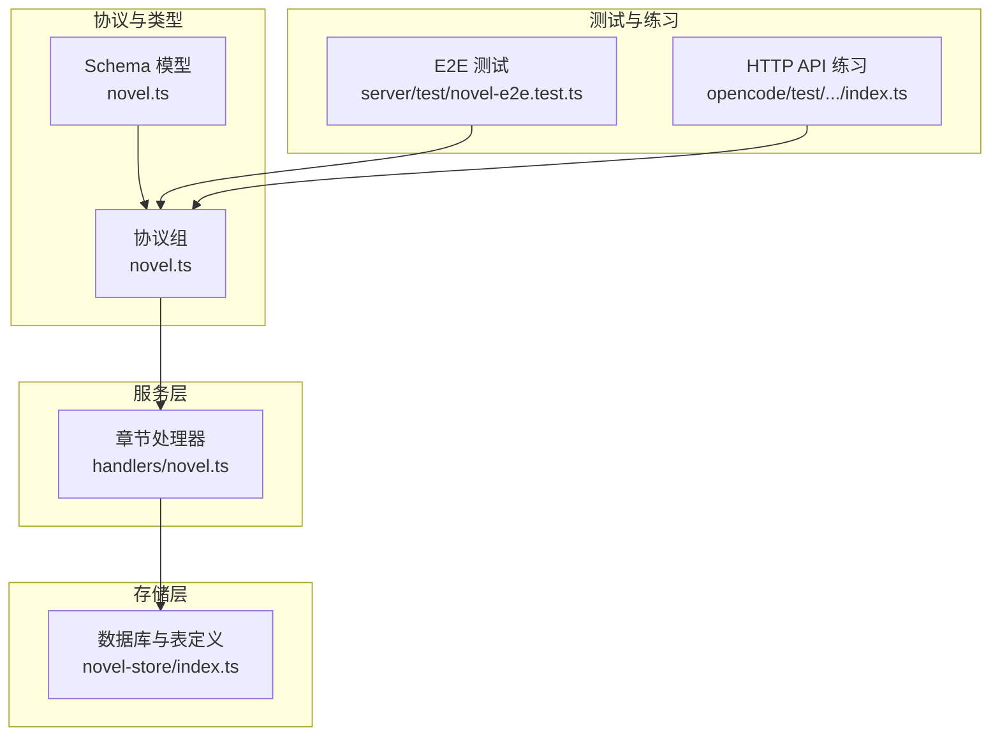
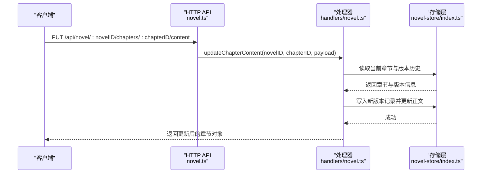
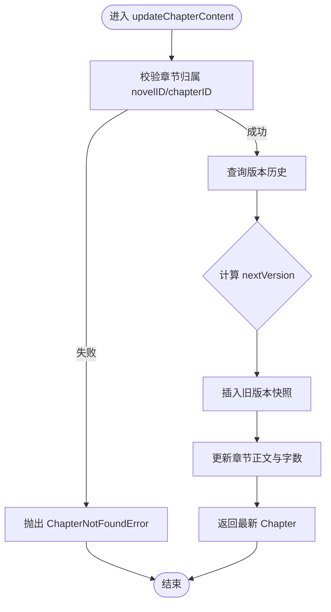
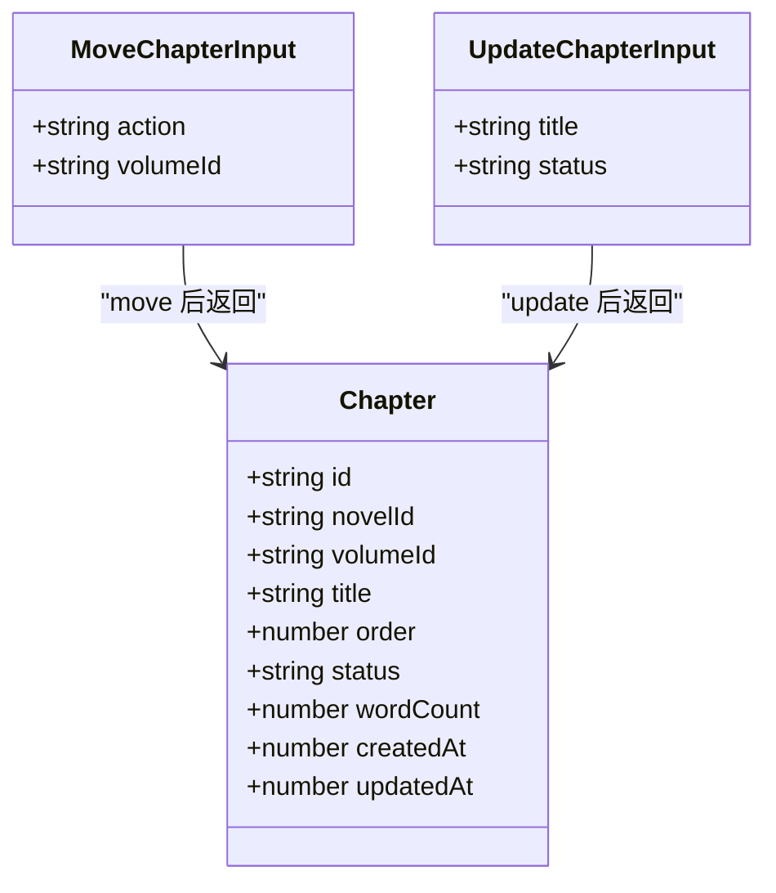
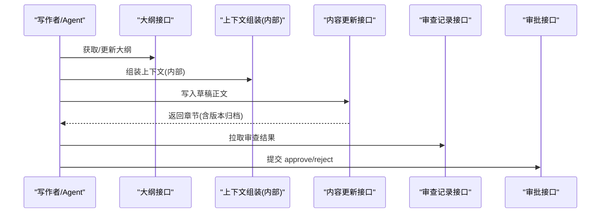
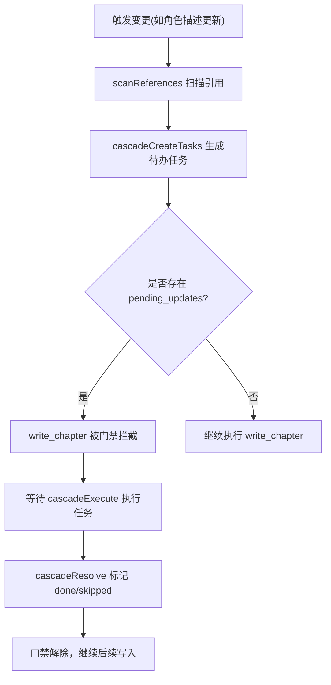
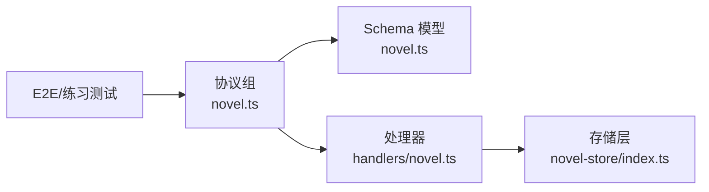

# 章节操作 API

<cite>
**本文引用的文件**   
- [packages/protocol/src/groups/novel.ts](file://packages/protocol/src/groups/novel.ts)
- [packages/schema/src/novel.ts](file://packages/schema/src/novel.ts)
- [packages/server/src/handlers/novel.ts](file://packages/server/src/handlers/novel.ts)
- [packages/novel-store/src/index.ts](file://packages/novel-store/src/index.ts)
- [packages/server/test/novel-e2e.test.ts](file://packages/server/test/novel-e2e.test.ts)
- [packages/opencode/test/server/httpapi-exercise/index.ts](file://packages/opencode/test/server/httpapi-exercise/index.ts)
- [packages/plugin/test/novel-writer/e2e.test.ts](file://packages/plugin/test/novel-writer/e2e.test.ts)
</cite>

## 目录
1. [简介](#简介)
2. [项目结构](#项目结构)
3. [核心组件](#核心组件)
4. [架构总览](#架构总览)
5. [详细组件分析](#详细组件分析)
6. [依赖关系分析](#依赖关系分析)
7. [性能考量](#性能考量)
8. [故障排查指南](#故障排查指南)
9. [结论](#结论)
10. [附录](#附录)

## 简介
本文件为 openNovel 的“章节操作 API”提供完整、可操作的文档，覆盖章节的创建、编辑、保存、版本管理、树结构移动、批量与异步任务处理等能力。同时给出写作流水线（大纲编写、上下文组装、草稿生成、连续性审查）在各步骤中的 API 调用方式与最佳实践，并附带请求/响应示例与错误处理指南，帮助开发者快速集成与排障。

## 项目结构
- 协议与类型定义：位于 packages/protocol 与 packages/schema，统一描述 HTTP API 端点、输入输出结构与错误类型。
- 服务端处理器：位于 packages/server，实现路由到领域逻辑的映射与数据访问封装。
- 数据存储层：位于 packages/novel-store，基于 SQLite 的表定义、CRUD 与事务性操作。
- 测试与练习：包含端到端测试与 HTTP API 练习用例，用于验证接口行为与调用方式。

**图表来源** 
- [packages/protocol/src/groups/novel.ts](file://packages/protocol/src/groups/novel.ts)
- [packages/schema/src/novel.ts](file://packages/schema/src/novel.ts)
- [packages/server/src/handlers/novel.ts](file://packages/server/src/handlers/novel.ts)
- [packages/novel-store/src/index.ts](file://packages/novel-store/src/index.ts)

**章节来源**
- [packages/protocol/src/groups/novel.ts](file://packages/protocol/src/groups/novel.ts)
- [packages/schema/src/novel.ts](file://packages/schema/src/novel.ts)
- [packages/server/src/handlers/novel.ts](file://packages/server/src/handlers/novel.ts)
- [packages/novel-store/src/index.ts](file://packages/novel-store/src/index.ts)

## 核心组件
- 章节实体与详情
  - Chapter：基础字段包括 id、novelId、volumeId、title、order、status、wordCount、时间戳等。
  - ChapterDetail：在 Chapter 基础上增加 content 字段。
- 版本与审阅
  - ChapterVersion：记录每次内容变更的版本快照，含 version、content、wordCount、createdBy 等。
  - ChapterReview：记录确定性检查、审计员深度审核、人工标注等多源评审结果。
- 输入模型
  - UpdateChapterContentInput：仅包含 content 字段，用于替换章节正文。
  - MoveChapterInput：支持 up/down 排序与 to-volume 跨卷移动。
  - RestoreVersionInput：指定恢复到的版本号。
  - ApprovalInput：approve/reject 审批动作及可选评论。
  - CreateChapterInput：创建章节所需标题、卷归属与顺序。

**章节来源**
- [packages/schema/src/novel.ts](file://packages/schema/src/novel.ts)

## 架构总览
章节操作 API 的请求路径以 /api/novel/:novelID/chapters 为核心，围绕单章与列表展开。协议层声明端点与类型，服务层解析参数并调用存储层完成持久化，返回标准化 JSON 响应。

**图表来源** 
- [packages/protocol/src/groups/novel.ts](file://packages/protocol/src/groups/novel.ts)
- [packages/server/src/handlers/novel.ts](file://packages/server/src/handlers/novel.ts)
- [packages/novel-store/src/index.ts](file://packages/novel-store/src/index.ts)

## 详细组件分析

### 章节详情与列表
- GET /api/novel/:novelID/chapters/:chapterID
  - 功能：获取章节详情（含 content）。
  - 成功返回：ChapterDetail。
  - 错误：ChapterNotFoundError（404）。
- GET /api/novel/:novelID/chapters
  - 功能：列出小说下所有章节（不含 content）。
  - 成功返回：Chapter[]。
  - 错误：NovelNotFoundError（404）。

**章节来源**
- [packages/protocol/src/groups/novel.ts](file://packages/protocol/src/groups/novel.ts)
- [packages/server/src/handlers/novel.ts](file://packages/server/src/handlers/novel.ts)

### 章节内容更新与版本管理
- PUT /api/novel/:novelID/chapters/:chapterID/content
  - 功能：替换章节正文，自动归档旧版本并递增版本号。
  - 请求体：UpdateChapterContentInput（content）。
  - 成功返回：Chapter。
  - 错误：ChapterNotFoundError（404）。
- GET /api/novel/:novelID/chapters/:chapterID/versions
  - 功能：按版本号倒序列出版本历史。
  - 成功返回：ChapterVersion[]。
  - 错误：ChapterNotFoundError（404）。
- POST /api/novel/:novelID/chapters/:chapterID/rollback
  - 功能：回滚到上一版本；若存在历史则记录一次“回滚版本”，并将正文恢复到前一版本。
  - 成功返回：Chapter。
  - 错误：ChapterNotFoundError（404）。
- PUT /api/novel/:novelID/chapters/:chapterID/restore
  - 功能：恢复到指定版本（RestoreVersionInput.version）。
  - 成功返回：Chapter。
  - 错误：ChapterNotFoundError（404）。

**图表来源** 
- [packages/server/src/handlers/novel.ts](file://packages/server/src/handlers/novel.ts)

**章节来源**
- [packages/protocol/src/groups/novel.ts](file://packages/protocol/src/groups/novel.ts)
- [packages/server/src/handlers/novel.ts](file://packages/server/src/handlers/novel.ts)
- [packages/server/test/novel-e2e.test.ts](file://packages/server/test/novel-e2e.test.ts)

### 章节状态与审批
- POST /api/novel/:novelID/chapters/:chapterID/approval
  - 功能：提交章节审批决定（approve/reject），可附评论。
  - 请求体：ApprovalInput（action, comment?）。
  - 成功返回：Chapter。
  - 错误：ChapterNotFoundError（404）。

**章节来源**
- [packages/protocol/src/groups/novel.ts](file://packages/protocol/src/groups/novel.ts)
- [packages/server/test/novel-e2e.test.ts](file://packages/server/test/novel-e2e.test.ts)

### 章节树结构操作
- PUT /api/novel/:novelID/chapters/:chapterID/move
  - 功能：调整章节顺序或移动到不同卷。
  - 请求体：MoveChapterInput（action: up/down/to-volume; volumeId?）。
  - 成功返回：Chapter。
  - 错误：ChapterNotFoundError（404）。
- PUT /api/novel/:novelID/chapters/:chapterID
  - 功能：更新章节元信息（title/status）。
  - 请求体：UpdateChapterInput（title?, status?）。
  - 成功返回：Chapter。
  - 错误：ChapterNotFoundError（404）。
- DELETE /api/novel/:novelID/chapters/:chapterID
  - 功能：删除章节（级联清理版本等）。
  - 成功返回：{ deleted: boolean }。
  - 错误：ChapterNotFoundError（404）。

**图表来源** 
- [packages/schema/src/novel.ts](file://packages/schema/src/novel.ts)
- [packages/protocol/src/groups/novel.ts](file://packages/protocol/src/groups/novel.ts)

**章节来源**
- [packages/protocol/src/groups/novel.ts](file://packages/protocol/src/groups/novel.ts)
- [packages/server/src/handlers/novel.ts](file://packages/server/src/handlers/novel.ts)

### 写作流水线各步骤 API 调用方式
- 大纲编写
  - 获取/更新大纲：GET/PUT /api/novel/:novelID/outline
  - 作用：维护 master/volume/chapter 三级大纲 Markdown，驱动后续生成流程。
- 上下文组装
  - 通过插件侧工具链（如 assembleSnapshot）聚合角色状态、卷摘要、近期章节摘要、伏笔、风格指南等，形成 ContextPacket。
  - 该步骤通常由内部工具/Agent 调用，不直接暴露 HTTP 端点，但可通过“章节内容更新”触发下游流水线。
- 草稿生成
  - 使用“更新章节内容”接口写入草稿正文，系统自动归档版本。
  - 建议结合“连续性审查”进行质量把关。
- 连续性审查
  - 获取审查记录：GET /api/novel/:novelID/chapters/:chapterID/reviews
  - 作用：查看确定性检查、审计员审核、人工标注的结果（PASS/WARN/FAIL 维度）。
  - 结合审批接口进行放行或打回。

**图表来源** 
- [packages/protocol/src/groups/novel.ts](file://packages/protocol/src/groups/novel.ts)
- [packages/plugin/test/novel-writer/e2e.test.ts](file://packages/plugin/test/novel-writer/e2e.test.ts)

**章节来源**
- [packages/protocol/src/groups/novel.ts](file://packages/protocol/src/groups/novel.ts)
- [packages/plugin/test/novel-writer/e2e.test.ts](file://packages/plugin/test/novel-writer/e2e.test.ts)

### 批量操作与异步任务处理
- 批量操作
  - 当前 API 未提供专门的批量端点，可通过循环调用单个章节接口实现。
  - 对于树结构调整（move），建议合并多次 up/down 为一次 to-volume 操作以减少往返。
- 异步任务
  - 存储层提供 pending_updates 与 saga_sessions 表，用于编排级联任务与长流程跟踪。
  - 典型流程：扫描引用 -> 生成待办任务 -> 执行任务 -> 标记完成/跳过。
  - 相关函数与表定义见存储层 index.ts 与测试用例 cascade.*。

**图表来源** 
- [packages/novel-store/src/index.ts](file://packages/novel-store/src/index.ts)
- [packages/plugin/test/novel-writer/cascade.test.ts](file://packages/plugin/test/novel-writer/cascade.test.ts)

**章节来源**
- [packages/novel-store/src/index.ts](file://packages/novel-store/src/index.ts)
- [packages/plugin/test/novel-writer/cascade.test.ts](file://packages/plugin/test/novel-writer/cascade.test.ts)

## 依赖关系分析
- 协议层（novel.ts）声明所有端点、输入输出与错误类型，作为契约。
- Schema（schema/novel.ts）提供强类型数据结构，确保请求/响应一致性。
- 处理器（handlers/novel.ts）负责参数校验、业务编排与数据访问。
- 存储层（novel-store/index.ts）提供表定义、CRUD、索引与事务性操作。
- 测试（server/test/novel-e2e.test.ts、opencode/test/.../index.ts）验证接口行为与调用方式。

**图表来源** 
- [packages/protocol/src/groups/novel.ts](file://packages/protocol/src/groups/novel.ts)
- [packages/schema/src/novel.ts](file://packages/schema/src/novel.ts)
- [packages/server/src/handlers/novel.ts](file://packages/server/src/handlers/novel.ts)
- [packages/novel-store/src/index.ts](file://packages/novel-store/src/index.ts)
- [packages/server/test/novel-e2e.test.ts](file://packages/server/test/novel-e2e.test.ts)
- [packages/opencode/test/server/httpapi-exercise/index.ts](file://packages/opencode/test/server/httpapi-exercise/index.ts)

**章节来源**
- [packages/protocol/src/groups/novel.ts](file://packages/protocol/src/groups/novel.ts)
- [packages/schema/src/novel.ts](file://packages/schema/src/novel.ts)
- [packages/server/src/handlers/novel.ts](file://packages/server/src/handlers/novel.ts)
- [packages/novel-store/src/index.ts](file://packages/novel-store/src/index.ts)
- [packages/server/test/novel-e2e.test.ts](file://packages/server/test/novel-e2e.test.ts)
- [packages/opencode/test/server/httpapi-exercise/index.ts](file://packages/opencode/test/server/httpapi-exercise/index.ts)

## 性能考量
- 版本归档与更新：每次内容更新都会插入版本记录，建议在批量更新时合并请求，减少频繁写入。
- 版本查询：versions 接口按 version 降序排列，注意分页与缓存策略。
- 树结构调整：up/down 会交换相邻项 order，to-volume 会重新计算目标分组最大 order，尽量用 to-volume 减少多次交换。
- 审查记录：reviews 接口可能包含多维度的 JSON 数据，前端按需加载与缓存。
- 异步任务：pending_updates 与 saga_sessions 适合长流程编排，避免阻塞主线程。

[本节为通用指导，无需特定文件来源]

## 故障排查指南
- 常见错误
  - ChapterNotFoundError（404）：章节不存在或不属于指定小说。
  - NovelNotFoundError（404）：小说不存在。
  - NovelValidationError（400）：输入校验失败。
- 定位方法
  - 检查路径参数 novelID/chapterID 是否正确。
  - 确认请求体字段是否符合 Schema 定义。
  - 查看版本历史与审查记录，确认是否处于审批或审查中。
- 参考用例
  - E2E 测试展示了更新内容、回滚、审批的典型调用与预期响应。

**章节来源**
- [packages/protocol/src/groups/novel.ts](file://packages/protocol/src/groups/novel.ts)
- [packages/server/test/novel-e2e.test.ts](file://packages/server/test/novel-e2e.test.ts)

## 结论
本章操作 API 提供了完整的章节生命周期管理能力，涵盖内容更新、版本回溯、树结构调整与审批流转，并通过 Schema 与协议层保证类型安全与接口一致性。配合存储层的异步任务机制，可实现复杂写作流水线的稳定编排。建议在实际集成中遵循最小请求原则、合理缓存与分页策略，并结合审查与审批流程保障内容质量。

[本节为总结性内容，无需特定文件来源]

## 附录

### 接口清单与示例（节选）
- 获取章节详情
  - 方法：GET
  - 路径：/api/novel/:novelID/chapters/:chapterID
  - 成功响应：ChapterDetail
  - 错误：ChapterNotFoundError
- 更新章节内容
  - 方法：PUT
  - 路径：/api/novel/:novelID/chapters/:chapterID/content
  - 请求体：{ content: string }
  - 成功响应：Chapter
  - 错误：ChapterNotFoundError
- 列出版本历史
  - 方法：GET
  - 路径：/api/novel/:novelID/chapters/:chapterID/versions
  - 成功响应：ChapterVersion[]
  - 错误：ChapterNotFoundError
- 回滚章节
  - 方法：POST
  - 路径：/api/novel/:novelID/chapters/:chapterID/rollback
  - 成功响应：Chapter
  - 错误：ChapterNotFoundError
- 恢复到指定版本
  - 方法：PUT
  - 路径：/api/novel/:novelID/chapters/:chapterID/restore
  - 请求体：{ version: number }
  - 成功响应：Chapter
  - 错误：ChapterNotFoundError
- 移动章节
  - 方法：PUT
  - 路径：/api/novel/:novelID/chapters/:chapterID/move
  - 请求体：{ action: "up"|"down"|"to-volume", volumeId?: string }
  - 成功响应：Chapter
  - 错误：ChapterNotFoundError
- 更新章节元信息
  - 方法：PUT
  - 路径：/api/novel/:novelID/chapters/:chapterID
  - 请求体：{ title?: string, status?: string }
  - 成功响应：Chapter
  - 错误：ChapterNotFoundError
- 删除章节
  - 方法：DELETE
  - 路径：/api/novel/:novelID/chapters/:chapterID
  - 成功响应：{ deleted: boolean }
  - 错误：ChapterNotFoundError
- 审批章节
  - 方法：POST
  - 路径：/api/novel/:novelID/chapters/:chapterID/approval
  - 请求体：{ action: "approve"|"reject", comment?: string }
  - 成功响应：Chapter
  - 错误：ChapterNotFoundError
- 获取审查记录
  - 方法：GET
  - 路径：/api/novel/:novelID/chapters/:chapterID/reviews
  - 成功响应：ChapterReview[]
  - 错误：ChapterNotFoundError

**章节来源**
- [packages/protocol/src/groups/novel.ts](file://packages/protocol/src/groups/novel.ts)
- [packages/schema/src/novel.ts](file://packages/schema/src/novel.ts)
- [packages/server/test/novel-e2e.test.ts](file://packages/server/test/novel-e2e.test.ts)
- [packages/opencode/test/server/httpapi-exercise/index.ts](file://packages/opencode/test/server/httpapi-exercise/index.ts)