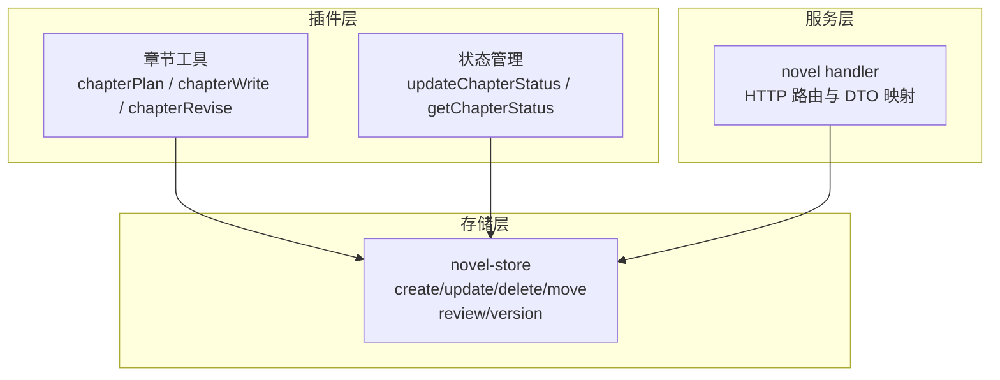
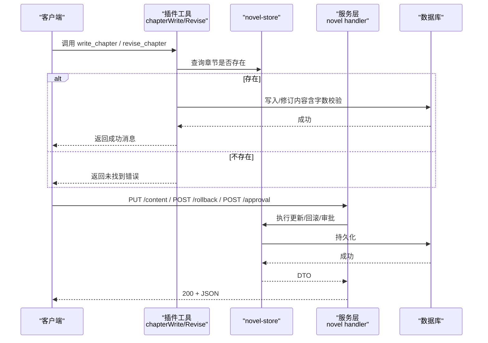
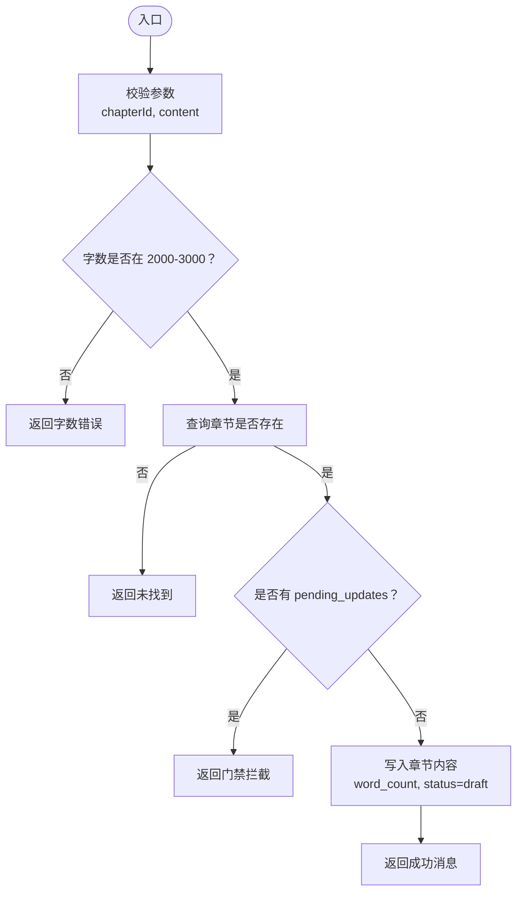
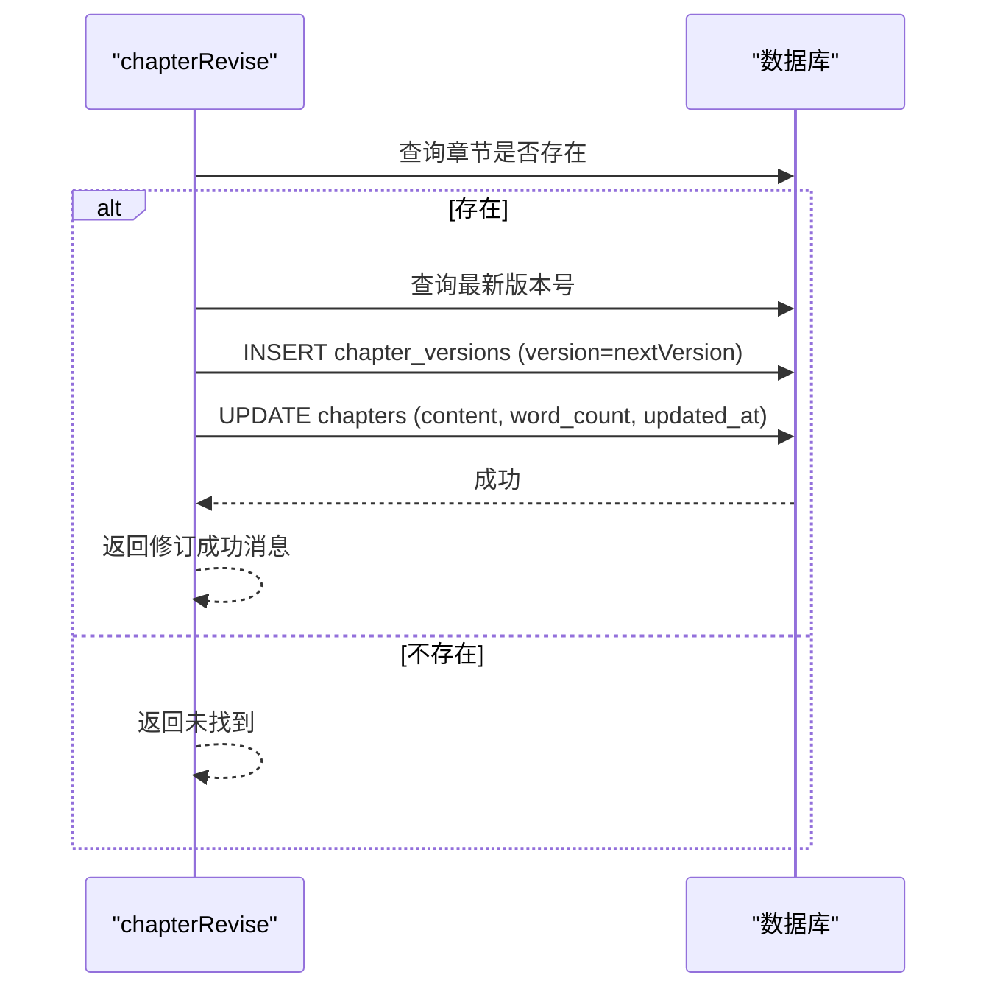
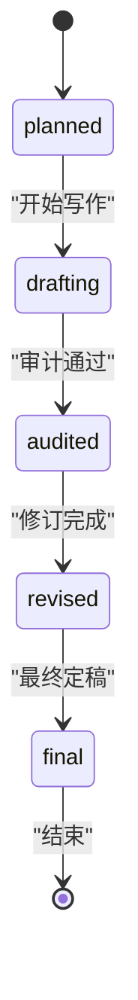
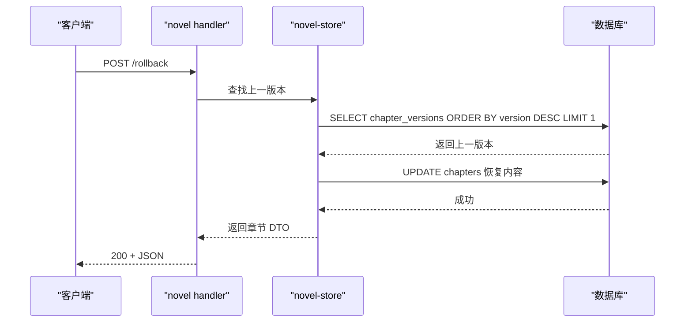
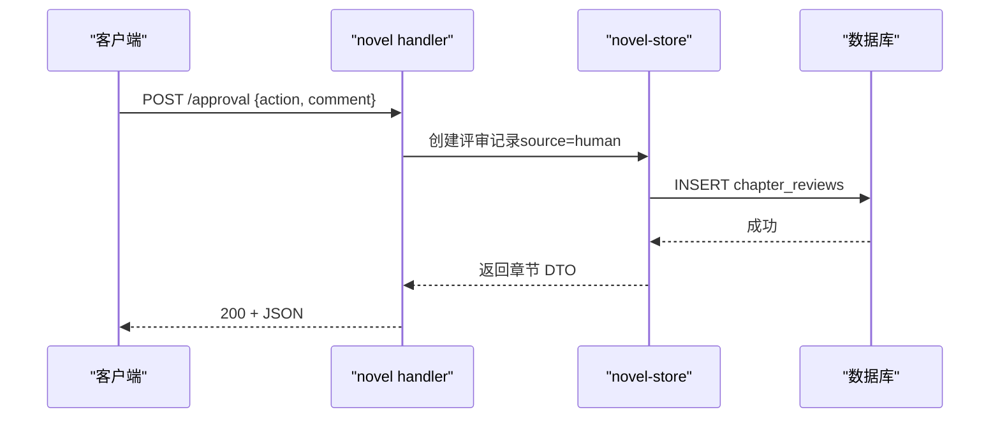
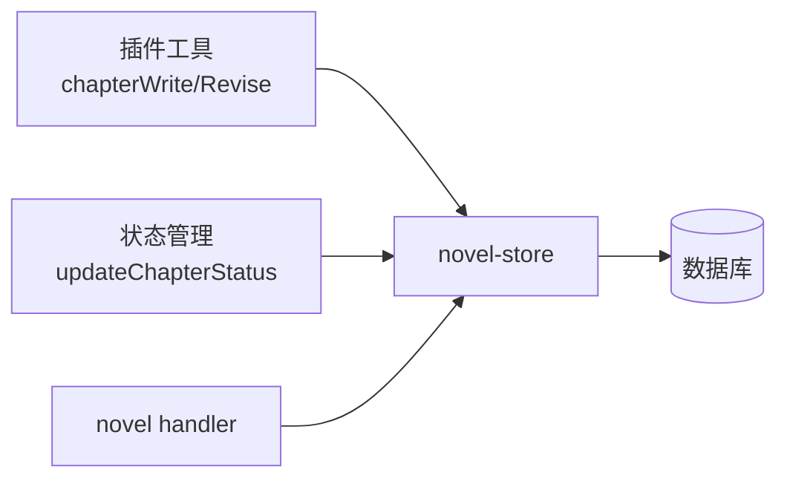

# 章节生命周期管理 API

<cite>
**本文引用的文件**   
- [chapter-tools.ts](file://packages/plugin/src/novel-writer/chapter-tools.ts)
- [chapter-status.ts](file://packages/plugin/src/novel-writer/chapter-status.ts)
- [novel.ts](file://packages/server/src/handlers/novel.ts)
- [index.ts](file://packages/novel-store/src/index.ts)
- [cascade-consistency-design.md](file://docs/cascade-consistency-design.md)
- [novel-e2e.test.ts](file://packages/server/test/novel-e2e.test.ts)
- [novel.test.ts](file://packages/server/test/novel.test.ts)
- [verify-tools.ts](file://packages/plugin/src/novel-writer/__verify__/verify-tools.ts)
</cite>

## 目录
1. [简介](#简介)
2. [项目结构](#项目结构)
3. [核心组件](#核心组件)
4. [架构总览](#架构总览)
5. [详细组件分析](#详细组件分析)
6. [依赖关系分析](#依赖关系分析)
7. [性能与一致性考虑](#性能与一致性考虑)
8. [故障排查指南](#故障排查指南)
9. [结论](#结论)
10. [附录：API 参考与示例](#附录api-参考与示例)

## 简介
本文件面向 openNovel 的“章节生命周期管理”能力，聚焦章节的创建、更新、删除、版本回滚与审批等核心操作；重点说明 write_chapter 与 revise_chapter 工具的使用方式、参数校验、字数检查、重复度检测机制，以及章节状态流转（planned → drafting → audited → revised → final）和版本控制逻辑。文档同时给出 HTTP 接口定义、请求/响应示例与错误处理建议，帮助开发者快速集成与排障。

## 项目结构
openNovel 将章节生命周期相关能力分布在三层：
- 插件层（Plugin）：提供 AI 写作工作流中的工具（如 chapterPlan、chapterWrite、chapterRevise），负责输入校验、基础字数检查与数据库写入。
- 存储层（novel-store）：封装对 chapters、chapter_versions、chapter_reviews 等表的增删改查与事务性操作。
- 服务层（server handlers）：对外暴露 HTTP API（如更新内容、回滚、审批），并统一 DTO 映射与错误类型。

图表来源
- [chapter-tools.ts:1-163](file://packages/plugin/src/novel-writer/chapter-tools.ts#L1-L163)
- [chapter-status.ts:1-104](file://packages/plugin/src/novel-writer/chapter-status.ts#L1-L104)
- [index.ts:473-669](file://packages/novel-store/src/index.ts#L473-L669)
- [novel.ts:106-159](file://packages/server/src/handlers/novel.ts#L106-L159)

章节来源
- [chapter-tools.ts:1-163](file://packages/plugin/src/novel-writer/chapter-tools.ts#L1-L163)
- [chapter-status.ts:1-104](file://packages/plugin/src/novel-writer/chapter-status.ts#L1-L104)
- [index.ts:473-669](file://packages/novel-store/src/index.ts#L473-L669)
- [novel.ts:106-159](file://packages/server/src/handlers/novel.ts#L106-L159)

## 核心组件
- 章节工具（Plugin）
  - chapterPlan：查询章节大纲与已有内容摘要，辅助 writer/reviser 规划。
  - chapterWrite：写入章节正文，进行字数校验（默认 2000-3000 字符），成功后设置状态为 draft。
  - chapterRevise：修订章节，先保存旧版本到 chapter_versions，再更新当前内容。
- 状态管理（Plugin）
  - updateChapterStatus：基于合法转换表更新章节状态，非法转换抛出错误。
  - getChapterStatus：读取当前状态。
- 存储层（novel-store）
  - createChapter / updateChapter / deleteChapter / moveChapter：章节 CRUD 与排序移动。
  - 版本与评审：chapter_versions、chapter_reviews 的创建与查询。
- 服务层（server handlers）
  - 更新内容 PUT /api/novel/:novelID/chapters/:chapterID/content
  - 回滚 POST /api/novel/:novelID/chapters/:chapterID/rollback
  - 审批 POST /api/novel/:novelID/chapters/:chapterID/approval

章节来源
- [chapter-tools.ts:1-163](file://packages/plugin/src/novel-writer/chapter-tools.ts#L1-L163)
- [chapter-status.ts:1-104](file://packages/plugin/src/novel-writer/chapter-status.ts#L1-L104)
- [index.ts:473-669](file://packages/novel-store/src/index.ts#L473-L669)
- [novel.ts:106-159](file://packages/server/src/handlers/novel.ts#L106-L159)

## 架构总览
章节生命周期由“工具调用 → 存储层 → 服务层”协同完成。写作者通过插件工具写入或修订章节，存储层保证数据一致性与版本化，服务层对外暴露标准 HTTP API 并提供审批、回滚等能力。级联一致性门禁在写入前拦截待处理的统改任务，确保设定变更先被处理。

图表来源
- [chapter-tools.ts:60-97](file://packages/plugin/src/novel-writer/chapter-tools.ts#L60-L97)
- [chapter-tools.ts:105-162](file://packages/plugin/src/novel-writer/chapter-tools.ts#L105-L162)
- [index.ts:473-505](file://packages/novel-store/src/index.ts#L473-L505)
- [novel.ts:244-273](file://packages/server/src/handlers/novel.ts#L244-L273)

## 详细组件分析

### 章节工具：write_chapter（chapterWrite）
- 功能：校验输入后写入章节正文，设置 word_count 与 status=draft。
- 参数验证：
  - chapterId：字符串，必填。
  - content：字符串，必填；长度需在 2000-3000 之间（按字符长度计数）。
- 业务规则：
  - 字数不足/超限直接拒绝。
  - 章节不存在时返回未找到提示。
  - 写入成功后返回包含标题与字数的成功消息。
- 重复度检测：
  - 插件 writer 流程中要求“严禁与前文重复”，若检测到高度重复会拒绝写入；具体实现由上层 writer 策略触发，工具本身不直接做全文重复比对。
- 级联门禁：
  - 当存在 pending_updates 时，write_chapter 会被门禁拦截，需先执行 cascade_execute 解除门禁后再写入。

图表来源
- [chapter-tools.ts:60-97](file://packages/plugin/src/novel-writer/chapter-tools.ts#L60-L97)
- [cascade-consistency-design.md:228-240](file://docs/cascade-consistency-design.md#L228-L240)

章节来源
- [chapter-tools.ts:60-97](file://packages/plugin/src/novel-writer/chapter-tools.ts#L60-L97)
- [cascade-consistency-design.md:228-240](file://docs/cascade-consistency-design.md#L228-L240)

### 章节工具：revise_chapter（chapterRevise）
- 功能：修订章节内容，先保存旧版本到 chapter_versions，再更新当前内容。
- 参数验证：
  - chapterId：字符串，必填。
  - content：字符串，必填。
- 版本控制：
  - 若存在历史内容，则查询最大版本号 nextVersion = lastVersion.version + 1，插入新版本记录（包含 content、word_count、created_at、created_by="ai"）。
  - 随后更新 chapters 表的新内容与更新时间。
- 级联门禁：
  - 同 write_chapter，pending_updates 存在时会被拦截。

图表来源
- [chapter-tools.ts:105-162](file://packages/plugin/src/novel-writer/chapter-tools.ts#L105-L162)

章节来源
- [chapter-tools.ts:105-162](file://packages/plugin/src/novel-writer/chapter-tools.ts#L105-L162)

### 章节状态流转
- 状态集合：planned → drafting → audited → revised → final
- 转换规则：
  - planned → drafting
  - drafting → audited
  - audited → revised
  - revised → final
  - final 为终点，不可继续转换
- 更新函数：
  - updateChapterStatus：校验合法性后更新状态，非法转换抛出错误。
  - getChapterStatus：读取当前状态。

图表来源
- [chapter-status.ts:14-28](file://packages/plugin/src/novel-writer/chapter-status.ts#L14-L28)
- [chapter-status.ts:54-87](file://packages/plugin/src/novel-writer/chapter-status.ts#L54-L87)

章节来源
- [chapter-status.ts:14-28](file://packages/plugin/src/novel-writer/chapter-status.ts#L14-L28)
- [chapter-status.ts:54-87](file://packages/plugin/src/novel-writer/chapter-status.ts#L54-L87)

### 版本控制与回滚
- 版本表：chapter_versions 记录每次修订的历史内容、字数、时间与创建者。
- 回滚接口：POST /api/novel/:novelID/chapters/:chapterID/rollback
  - 将章节恢复到上一个版本（若无上一版本则回退至最新可用版本）。
- 更新内容接口：PUT /api/novel/:novelID/chapters/:chapterID/content
  - 替换章节内容，并生成新版本记录。

图表来源
- [novel.ts:234-242](file://packages/server/src/handlers/novel.ts#L234-L242)
- [novel.ts:127-137](file://packages/server/src/handlers/novel.ts#L127-L137)

章节来源
- [novel.ts:234-242](file://packages/server/src/handlers/novel.ts#L234-L242)
- [novel.ts:127-137](file://packages/server/src/handlers/novel.ts#L127-L137)

### 审批流程
- 接口：POST /api/novel/:novelID/chapters/:chapterID/approval
- 输入：action（approve/reject）、comment（可选）
- 行为：提交审批决定，记录 human 来源的评审结果，影响章节状态与后续流程。

图表来源
- [novel.ts:261-273](file://packages/server/src/handlers/novel.ts#L261-L273)

章节来源
- [novel.ts:261-273](file://packages/server/src/handlers/novel.ts#L261-L273)

## 依赖关系分析
- 插件工具依赖 novel-store 的章节与版本操作。
- 服务层 handler 依赖 novel-store 的更新、回滚、审批等能力，并通过 DTO 映射统一返回格式。
- 级联一致性设计在写入路径中接入 scanReferences 与门禁机制，确保设定变更后先处理 pending 任务。

图表来源
- [chapter-tools.ts:1-163](file://packages/plugin/src/novel-writer/chapter-tools.ts#L1-L163)
- [chapter-status.ts:1-104](file://packages/plugin/src/novel-writer/chapter-status.ts#L1-L104)
- [index.ts:473-669](file://packages/novel-store/src/index.ts#L473-L669)
- [novel.ts:106-159](file://packages/server/src/handlers/novel.ts#L106-L159)

章节来源
- [chapter-tools.ts:1-163](file://packages/plugin/src/novel-writer/chapter-tools.ts#L1-L163)
- [chapter-status.ts:1-104](file://packages/plugin/src/novel-writer/chapter-status.ts#L1-L104)
- [index.ts:473-669](file://packages/novel-store/src/index.ts#L473-L669)
- [novel.ts:106-159](file://packages/server/src/handlers/novel.ts#L106-L159)

## 性能与一致性考虑
- 字数校验与重复度检测：
  - 插件层在写入前进行字数校验，避免无效写入。
  - 重复度检测由 writer 流程触发，减少高重复内容的提交。
- 版本化与回滚：
  - 修订操作自动创建版本记录，支持快速回滚与审计追踪。
- 级联一致性：
  - 写入路径接入 scanReferences，确保实体引用始终反映最新内容。
  - pending_updates 门禁阻断写操作，保障设定变更优先处理。
- 并发与事务：
  - 存储层使用 drizzle-orm 进行原子更新，避免脏写。

章节来源
- [cascade-consistency-design.md:228-254](file://docs/cascade-consistency-design.md#L228-L254)
- [chapter-tools.ts:60-97](file://packages/plugin/src/novel-writer/chapter-tools.ts#L60-L97)
- [chapter-tools.ts:105-162](file://packages/plugin/src/novel-writer/chapter-tools.ts#L105-L162)

## 故障排查指南
- 常见错误与定位：
  - 未找到章节：检查 chapterId 是否正确，确认章节已创建。
  - 字数不足/超限：调整 content 长度至 2000-3000 区间。
  - 门禁拦截：存在 pending_updates，需先执行 cascade_execute 处理统改任务。
  - 状态转换不合法：检查当前状态与目标状态是否符合转换规则。
- 调试建议：
  - 查看 chapter_versions 表确认版本序列是否连续。
  - 使用 e2e 测试用例验证接口行为与响应结构。

章节来源
- [chapter-tools.ts:60-97](file://packages/plugin/src/novel-writer/chapter-tools.ts#L60-L97)
- [chapter-tools.ts:105-162](file://packages/plugin/src/novel-writer/chapter-tools.ts#L105-L162)
- [chapter-status.ts:54-87](file://packages/plugin/src/novel-writer/chapter-status.ts#L54-L87)
- [novel-e2e.test.ts:155-204](file://packages/server/test/novel-e2e.test.ts#L155-L204)

## 结论
openNovel 的章节生命周期管理通过插件工具、存储层与服务层的协作，实现了稳健的章节创建、修订、版本控制与审批流程。结合级联一致性门禁与字数/重复度校验，保障了内容质量与设定一致性。开发者可依据本文档的接口定义与流程图快速集成与排障。

## 附录：API 参考与示例
- 更新内容
  - 方法：PUT
  - 路径：/api/novel/:novelID/chapters/:chapterID/content
  - 请求体：{ content: string }
  - 响应：Chapter DTO（包含 id、title、status、wordCount、updatedAt 等）
  - 错误：ChapterNotFoundError
- 回滚
  - 方法：POST
  - 路径：/api/novel/:novelID/chapters/:chapterID/rollback
  - 请求体：无
  - 响应：Chapter DTO
  - 错误：ChapterNotFoundError
- 审批
  - 方法：POST
  - 路径：/api/novel/:novelID/chapters/:chapterID/approval
  - 请求体：{ action: "approve" | "reject", comment?: string }
  - 响应：Chapter DTO
  - 错误：ChapterNotFoundError

章节来源
- [novel.ts:244-273](file://packages/server/src/handlers/novel.ts#L244-L273)
- [novel-e2e.test.ts:155-204](file://packages/server/test/novel-e2e.test.ts#L155-L204)
- [novel.test.ts:268-308](file://packages/server/test/novel.test.ts#L268-L308)