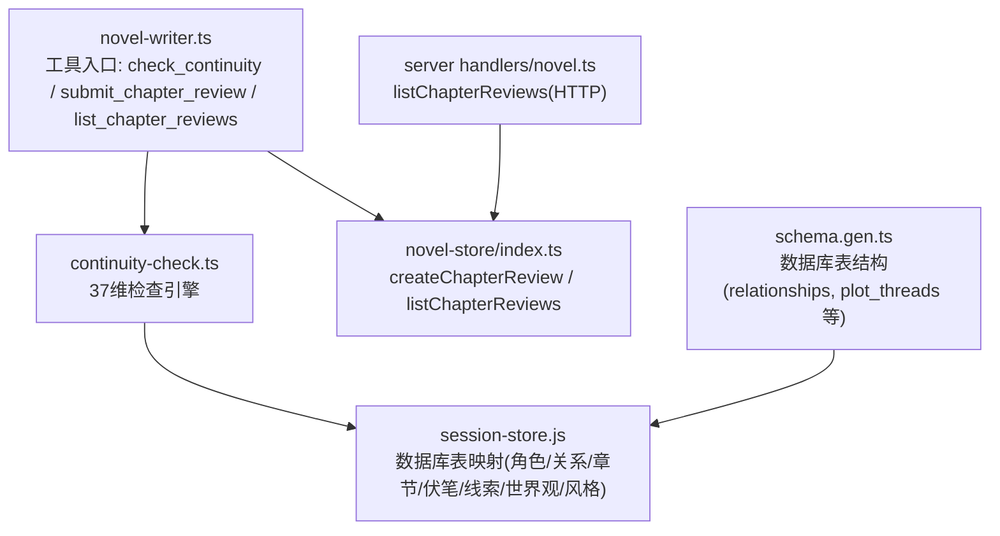
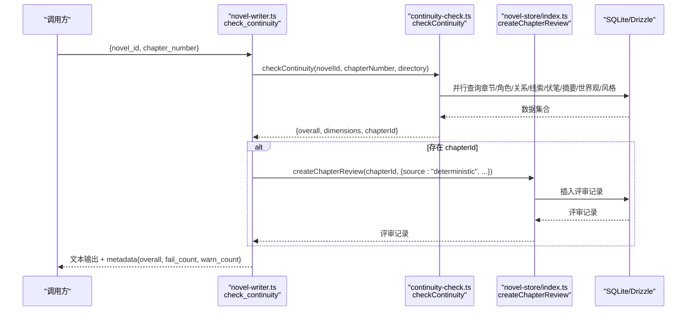
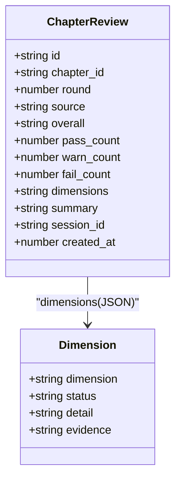
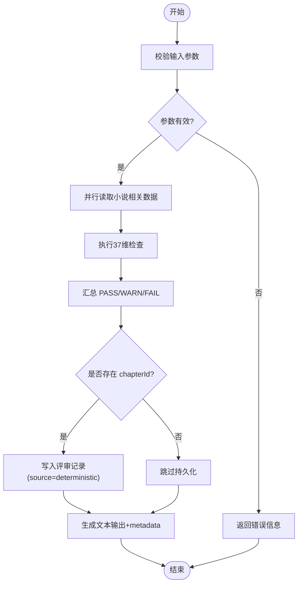
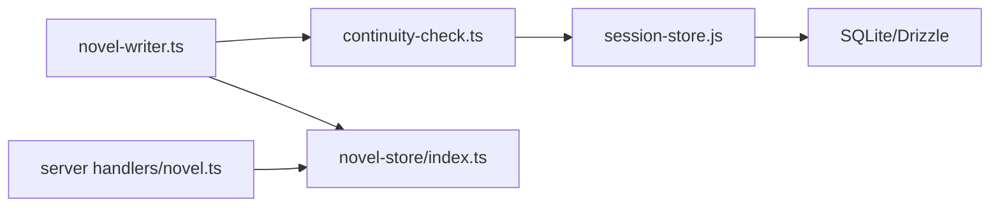

# 连续性审查 API

<cite>
**本文引用的文件**   
- [packages/plugin/src/novel-writer.ts](file://packages/plugin/src/novel-writer.ts)
- [packages/plugin/src/novel-writer/continuity-check.ts](file://packages/plugin/src/novel-writer/continuity-check.ts)
- [packages/novel-store/src/index.ts](file://packages/novel-store/src/index.ts)
- [packages/server/src/handlers/novel.ts](file://packages/server/src/handlers/novel.ts)
- [packages/core/src/database/schema.gen.ts](file://packages/core/src/database/schema.gen.ts)
- [packages/plugin/test/novel-writer/review.test.ts](file://packages/plugin/test/novel-writer/review.test.ts)
</cite>

## 目录
1. [简介](#简介)
2. [项目结构](#项目结构)
3. [核心组件](#核心组件)
4. [架构总览](#架构总览)
5. [详细组件分析](#详细组件分析)
6. [依赖关系分析](#依赖关系分析)
7. [性能考量](#性能考量)
8. [故障排查指南](#故障排查指南)
9. [结论](#结论)
10. [附录](#附录)

## 简介
本文件为 openNovel 的“连续性审查 API”提供完整技术文档，聚焦 check_continuity 工具的 37 维确定性检查机制。该机制覆盖角色一致性、关系连贯性、时间线合理性、地点准确性、剧情逻辑性、世界观设定、风格统一性、因果逻辑与细节追踪等九大类维度。文档将详细说明：
- 37 个维度的定义与判定规则
- 审查结果的数据结构与输出格式
- 评审记录的持久化策略（source=deterministic/auditor/human）
- 基于 list_chapter_reviews 的结果分析与修复建议流程

## 项目结构
连续性审查能力由插件层工具暴露、核心检查模块实现、存储层持久化、服务端处理器查询四部分协同完成。

**图表来源** 
- [packages/plugin/src/novel-writer.ts:763-801](file://packages/plugin/src/novel-writer.ts#L763-L801)
- [packages/plugin/src/novel-writer/continuity-check.ts:1-150](file://packages/plugin/src/novel-writer/continuity-check.ts#L1-L150)
- [packages/novel-store/src/index.ts:968-1022](file://packages/novel-store/src/index.ts#L968-L1022)
- [packages/server/src/handlers/novel.ts:512-520](file://packages/server/src/handlers/novel.ts#L512-L520)
- [packages/core/src/database/schema.gen.ts:251-278](file://packages/core/src/database/schema.gen.ts#L251-L278)

**章节来源**
- [packages/plugin/src/novel-writer.ts:763-801](file://packages/plugin/src/novel-writer.ts#L763-L801)
- [packages/plugin/src/novel-writer/continuity-check.ts:1-150](file://packages/plugin/src/novel-writer/continuity-check.ts#L1-L150)
- [packages/novel-store/src/index.ts:968-1022](file://packages/novel-store/src/index.ts#L968-L1022)
- [packages/server/src/handlers/novel.ts:512-520](file://packages/server/src/handlers/novel.ts#L512-L520)
- [packages/core/src/database/schema.gen.ts:251-278](file://packages/core/src/database/schema.gen.ts#L251-L278)

## 核心组件
- 工具入口（novel-writer.ts）
  - check_continuity：接收 novel_id 与 chapter_number，调用 37 维检查并自动持久化评审记录（source=deterministic）。
  - submit_chapter_review：提交结构化评审结果（包含 37 维清单校验），source=auditor。
  - list_chapter_reviews：读取某章的历史评审记录（deterministic/auditor/human），支持 limit。
- 检查引擎（continuity-check.ts）
  - CONTINUITY_DIMENSIONS：37 个维度名称常量数组。
  - checkContinuity(novelId, chapterNumber, directory)：并行读取小说相关数据，执行九大类检查，汇总整体结果 PASS/WARN/FAIL。
- 存储层（novel-store/index.ts）
  - createChapterReview：写入评审记录，自动推导轮次 round，统计 pass/warn/fail 计数，JSON 序列化 dimensions。
  - listChapterReviews：按创建时间倒序返回评审记录。
- 服务端处理器（server handlers/novel.ts）
  - listChapterReviews：HTTP 接口封装，解析 dimensions JSON 并返回结构化数据。

**章节来源**
- [packages/plugin/src/novel-writer.ts:763-801](file://packages/plugin/src/novel-writer.ts#L763-L801)
- [packages/plugin/src/novel-writer.ts:803-848](file://packages/plugin/src/novel-writer.ts#L803-L848)
- [packages/plugin/src/novel-writer.ts:1093-1130](file://packages/plugin/src/novel-writer.ts#L1093-L1130)
- [packages/plugin/src/novel-writer/continuity-check.ts:149-232](file://packages/plugin/src/novel-writer/continuity-check.ts#L149-L232)
- [packages/novel-store/src/index.ts:968-1022](file://packages/novel-store/src/index.ts#L968-L1022)
- [packages/server/src/handlers/novel.ts:512-520](file://packages/server/src/handlers/novel.ts#L512-L520)

## 架构总览
check_continuity 的执行时序如下：

**图表来源** 
- [packages/plugin/src/novel-writer.ts:763-801](file://packages/plugin/src/novel-writer.ts#L763-L801)
- [packages/plugin/src/novel-writer/continuity-check.ts:149-232](file://packages/plugin/src/novel-writer/continuity-check.ts#L149-L232)
- [packages/novel-store/src/index.ts:968-1022](file://packages/novel-store/src/index.ts#L968-L1022)

## 详细组件分析

### 37 维审查机制
- 维度分类与数量
  - 角色连续性（5 维）：姓名一致性、外貌描述、性格一致、能力等级、位置连续
  - 关系连续性（4 维）：关系类型一致、敌友转变有因、亲密度变化、信任度变化
  - 时间线（4 维）：事件顺序、时间流逝合理、季节一致、年龄变化
  - 地点（4 维）：地点描述一致、距离合理、环境细节、地图一致
  - 剧情（5 维）：主线推进、伏笔回收、冲突升级、转折合理、结局呼应
  - 世界观（5 维）：力量体系、规则一致、社会结构、文化细节、经济系统
  - 风格（4 维）：叙事视角、语言风格、节奏一致、描写密度
  - 逻辑（3 维）：因果链、动机合理、信息对称
  - 细节（3 维）：物品追踪、数字一致、称呼一致
- 判定规则
  - 单个维度状态：PASS/WARN/FAIL
  - 总体评估：存在 FAIL → FAIL；否则存在 WARN → WARN；否则 PASS
- 数据来源
  - 章节、角色、角色状态、关系、剧情线索、伏笔、章节摘要、世界观条目、风格指南
- 关键算法要点
  - 情绪突变检测：对比相邻状态的情绪词对
  - 位置跳变检测：统计同一角色在多章中的位置变化频率
  - 关系矛盾检测：同一角色对同时存在敌对与友好类型
  - 字数分布异常：偏离平均值超过阈值视为节奏不一致
  - 伏笔回收率：未回收比例过高且章节数较大时发出警告

**章节来源**
- [packages/plugin/src/novel-writer/continuity-check.ts:64-111](file://packages/plugin/src/novel-writer/continuity-check.ts#L64-L111)
- [packages/plugin/src/novel-writer/continuity-check.ts:236-359](file://packages/plugin/src/novel-writer/continuity-check.ts#L236-L359)
- [packages/plugin/src/novel-writer/continuity-check.ts:363-512](file://packages/plugin/src/novel-writer/continuity-check.ts#L363-L512)
- [packages/plugin/src/novel-writer/continuity-check.ts:516-629](file://packages/plugin/src/novel-writer/continuity-check.ts#L516-L629)
- [packages/plugin/src/novel-writer/continuity-check.ts:633-721](file://packages/plugin/src/novel-writer/continuity-check.ts#L633-L721)
- [packages/plugin/src/novel-writer/continuity-check.ts:725-852](file://packages/plugin/src/novel-writer/continuity-check.ts#L725-L852)
- [packages/plugin/src/novel-writer/continuity-check.ts:856-974](file://packages/plugin/src/novel-writer/continuity-check.ts#L856-L974)
- [packages/plugin/src/novel-writer/continuity-check.ts:978-1059](file://packages/plugin/src/novel-writer/continuity-check.ts#L978-L1059)
- [packages/plugin/src/novel-writer/continuity-check.ts:1063-1132](file://packages/plugin/src/novel-writer/continuity-check.ts#L1063-L1132)
- [packages/plugin/src/novel-writer/continuity-check.ts:1136-1200](file://packages/plugin/src/novel-writer/continuity-check.ts#L1136-L1200)
- [packages/plugin/src/novel-writer/continuity-check.ts:1204-1359](file://packages/plugin/src/novel-writer/continuity-check.ts#L1204-L1359)

### 工具 API 与参数规范
- check_continuity
  - 输入：novel_id（字符串）、chapter_number（数字）
  - 行为：执行 37 维检查，若存在 chapterId 则自动写入评审记录（source=deterministic）
  - 输出：文本摘要 + metadata{overall, fail_count, warn_count}
- submit_chapter_review
  - 输入：chapter_id、overall、dimensions（每项含 dimension/status/detail/evidence）、summary
  - 行为：校验 dimension 是否在 37 维清单中，通过后写入评审记录（source=auditor）
  - 输出：评审轮次与计数信息
- list_chapter_reviews
  - 输入：chapter_id、limit（可选，默认 5）
  - 行为：读取最近若干条评审记录，解析 dimensions JSON
  - 输出：格式化文本 + metadata{count, reviews}

**章节来源**
- [packages/plugin/src/novel-writer.ts:763-801](file://packages/plugin/src/novel-writer.ts#L763-L801)
- [packages/plugin/src/novel-writer.ts:803-848](file://packages/plugin/src/novel-writer.ts#L803-L848)
- [packages/plugin/src/novel-writer.ts:1093-1130](file://packages/plugin/src/novel-writer.ts#L1093-L1130)

### 评审记录持久化与数据结构
- 评审记录字段
  - id、chapter_id、round、source（deterministic/auditor/human）、overall、pass_count、warn_count、fail_count、dimensions（JSON 字符串）、summary、session_id、created_at
- 轮次推导
  - 若章节更新时间晚于最近评审时间，则开启新轮次；否则并入当前轮
- 列表查询
  - 按 created_at 倒序返回，便于展示最新评审在前

**图表来源** 
- [packages/novel-store/src/index.ts:968-1022](file://packages/novel-store/src/index.ts#L968-L1022)
- [packages/server/src/handlers/novel.ts:139-159](file://packages/server/src/handlers/novel.ts#L139-L159)

**章节来源**
- [packages/novel-store/src/index.ts:968-1022](file://packages/novel-store/src/index.ts#L968-L1022)
- [packages/server/src/handlers/novel.ts:139-159](file://packages/server/src/handlers/novel.ts#L139-L159)

### 数据处理与校验流程
- 输入校验
  - submit_chapter_review 会校验每个 dimension.dimension 是否属于 37 维清单，否则直接返回失败提示
- 数据读取
  - continuity-check 使用 Promise.all 并行读取章节、角色、关系、线索、伏笔、摘要、世界观、风格等数据，降低 I/O 延迟
- 结果聚合
  - 根据各维度状态计算 overall，并生成可阅读的文本摘要

**图表来源** 
- [packages/plugin/src/novel-writer.ts:763-801](file://packages/plugin/src/novel-writer.ts#L763-L801)
- [packages/plugin/src/novel-writer/continuity-check.ts:149-232](file://packages/plugin/src/novel-writer/continuity-check.ts#L149-L232)
- [packages/novel-store/src/index.ts:968-1022](file://packages/novel-store/src/index.ts#L968-L1022)

**章节来源**
- [packages/plugin/src/novel-writer.ts:763-801](file://packages/plugin/src/novel-writer.ts#L763-L801)
- [packages/plugin/src/novel-writer/continuity-check.ts:149-232](file://packages/plugin/src/novel-writer/continuity-check.ts#L149-L232)
- [packages/novel-store/src/index.ts:968-1022](file://packages/novel-store/src/index.ts#L968-L1022)

## 依赖关系分析
- 模块耦合
  - novel-writer.ts 依赖 continuity-check.ts 的检查能力与 novel-store/index.ts 的评审持久化
  - continuity-check.ts 依赖 session-store.js 的表映射进行数据库访问
  - server handlers/novel.ts 通过 novel-store/index.ts 查询评审记录并转换为 HTTP 响应
- 外部依赖
  - Drizzle ORM 用于 SQL 构建与查询
  - SQLite 作为本地数据库后端
- 潜在循环依赖
  - 当前未发现循环依赖；工具层仅单向调用检查引擎与存储层

**图表来源** 
- [packages/plugin/src/novel-writer.ts:763-801](file://packages/plugin/src/novel-writer.ts#L763-L801)
- [packages/plugin/src/novel-writer/continuity-check.ts:16-30](file://packages/plugin/src/novel-writer/continuity-check.ts#L16-L30)
- [packages/novel-store/src/index.ts:968-1022](file://packages/novel-store/src/index.ts#L968-L1022)
- [packages/server/src/handlers/novel.ts:512-520](file://packages/server/src/handlers/novel.ts#L512-L520)

**章节来源**
- [packages/plugin/src/novel-writer.ts:763-801](file://packages/plugin/src/novel-writer.ts#L763-L801)
- [packages/plugin/src/novel-writer/continuity-check.ts:16-30](file://packages/plugin/src/novel-writer/continuity-check.ts#L16-L30)
- [packages/novel-store/src/index.ts:968-1022](file://packages/novel-store/src/index.ts#L968-L1022)
- [packages/server/src/handlers/novel.ts:512-520](file://packages/server/src/handlers/novel.ts#L512-L520)

## 性能考量
- 并行 I/O：检查引擎使用 Promise.all 并发查询多张表，显著降低总等待时间
- 数据过滤：在内存中对 characterStates 进行过滤，避免无效关联
- 复杂度：主要开销来自数据库查询与字符串匹配（关键词检索），整体为 O(N) 级别
- 优化建议
  - 对高频查询字段建立索引（如 chapter.order、character_states.character_id）
  - 对大文本摘要进行分块处理或缓存热点章节摘要

[本节为通用指导，不直接分析具体文件]

## 故障排查指南
- 常见问题
  - 维度名称不在 37 维清单：submit_chapter_review 会返回失败提示，需修正维度名
  - 章节不存在：createChapterReview 抛出“未找到章节”错误
  - 无评审记录：list_chapter_reviews 返回空提示
- 定位方法
  - 查看 output 文本中的错误信息与统计计数
  - 使用 list_chapter_reviews 获取历史评审，确认问题轮次与维度
- 测试用例参考
  - 评审轮次推导与新增章节后开启新轮次
  - 评审记录排序与字段解析

**章节来源**
- [packages/plugin/src/novel-writer.ts:803-848](file://packages/plugin/src/novel-writer.ts#L803-L848)
- [packages/novel-store/src/index.ts:968-1022](file://packages/novel-store/src/index.ts#L968-L1022)
- [packages/plugin/test/novel-writer/review.test.ts:100-151](file://packages/plugin/test/novel-writer/review.test.ts#L100-L151)

## 结论
check_continuity 通过 37 维确定性检查，系统化保障小说写作的连续性质量。其工具化设计使检查、提交与查询形成闭环，结合评审记录持久化，为后续人工审阅与自动化修复提供了可靠依据。建议在创作流程中定期运行检查，并根据 FAIL/WARN 维度针对性修订，以提升作品的一致性与可读性。

[本节为总结性内容，不直接分析具体文件]

## 附录

### 37 维清单速览
- 角色连续性：姓名一致性、外貌描述、性格一致、能力等级、位置连续
- 关系连续性：关系类型一致、敌友转变有因、亲密度变化、信任度变化
- 时间线：事件顺序、时间流逝合理、季节一致、年龄变化
- 地点：地点描述一致、距离合理、环境细节、地图一致
- 剧情：主线推进、伏笔回收、冲突升级、转折合理、结局呼应
- 世界观：力量体系、规则一致、社会结构、文化细节、经济系统
- 风格：叙事视角、语言风格、节奏一致、描写密度
- 逻辑：因果链、动机合理、信息对称
- 细节：物品追踪、数字一致、称呼一致

**章节来源**
- [packages/plugin/src/novel-writer/continuity-check.ts:64-111](file://packages/plugin/src/novel-writer/continuity-check.ts#L64-L111)

### 评审记录字段说明
- id：评审记录唯一标识
- chapter_id：关联章节 ID
- round：评审轮次（自动推导）
- source：评审来源（deterministic/auditor/human）
- overall：总体评估（PASS/WARN/FAIL）
- pass_count/warn_count/fail_count：各维度计数
- dimensions：维度结果数组（JSON 字符串）
- summary：总体评估文字
- session_id：会话标识（可选）
- created_at：创建时间

**章节来源**
- [packages/novel-store/src/index.ts:968-1022](file://packages/novel-store/src/index.ts#L968-L1022)
- [packages/server/src/handlers/novel.ts:139-159](file://packages/server/src/handlers/novel.ts#L139-L159)