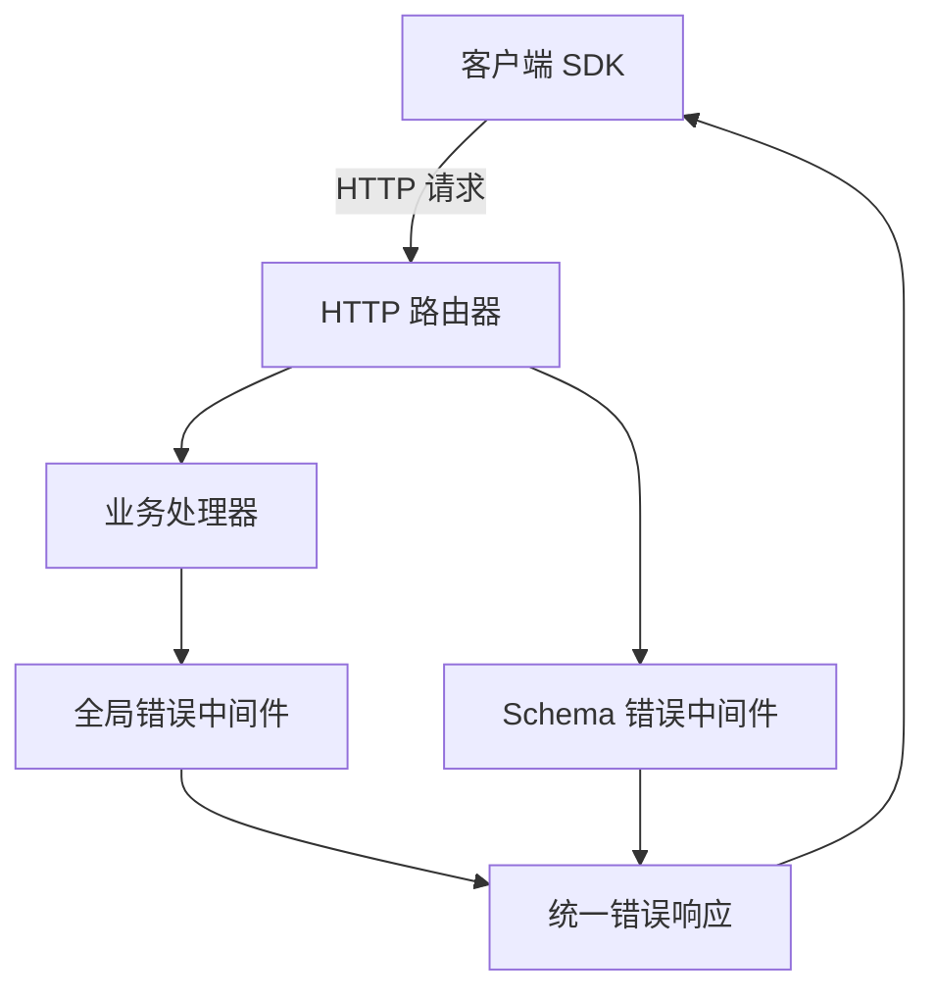
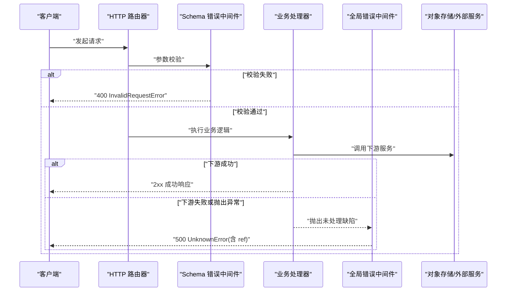
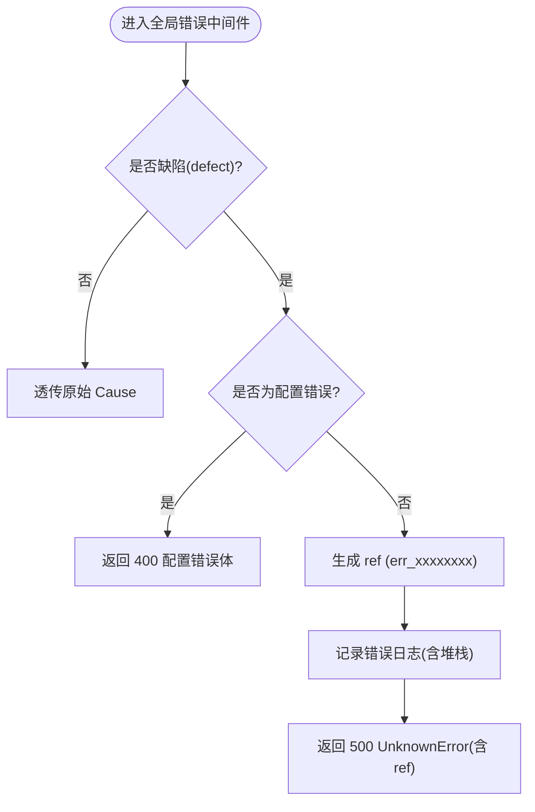
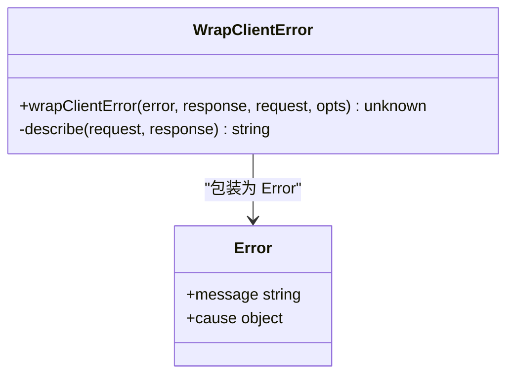
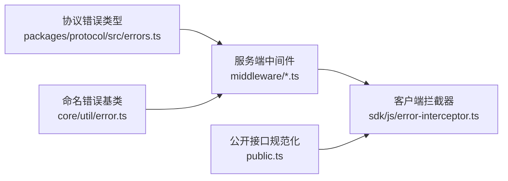

# 错误处理 API

<cite>
**本文引用的文件**
- [packages/opencode/src/server/routes/instance/httpapi/middleware/error.ts](file://packages/opencode/src/server/routes/instance/httpapi/middleware/error.ts)
- [packages/opencode/src/server/routes/instance/httpapi/middleware/schema-error.ts](file://packages/opencode/src/server/routes/instance/httpapi/middleware/schema-error.ts)
- [packages/opencode/src/server/routes/instance/httpapi/errors.ts](file://packages/opencode/src/server/routes/instance/httpapi/errors.ts)
- [packages/protocol/src/errors.ts](file://packages/protocol/src/errors.ts)
- [packages/core/src/util/error.ts](file://packages/core/src/util/error.ts)
- [packages/sdks/js/src/error-interceptor.ts](file://packages/sdk/js/src/error-interceptor.ts)
- [packages/opencode/test/server/httpapi-error-middleware.test.ts](file://packages/opencode/test/server/httpapi-error-middleware.test.ts)
- [packages/opencode/src/util/effect-http-client.ts](file://packages/opencode/src/util/effect-http-client.ts)
- [packages/opencode/src/server/routes/instance/httpapi/public.ts](file://packages/opencode/src/server/routes/instance/httpapi/public.ts)
</cite>

## 目录
1. [简介](#简介)
2. [项目结构](#项目结构)
3. [核心组件](#核心组件)
4. [架构总览](#架构总览)
5. [详细组件分析](#详细组件分析)
6. [依赖关系分析](#依赖关系分析)
7. [性能考虑](#性能考虑)
8. [故障排查指南](#故障排查指南)
9. [结论](#结论)
10. [附录](#附录)

## 简介
本文件为 openNovel 的错误处理 API 提供系统化文档，覆盖统一的错误响应格式、错误代码定义、异常处理策略与 HTTP 状态码使用规范。同时给出常见错误场景的处理方式与最佳实践，并提供客户端错误处理示例与日志记录指南，帮助开发者构建健壮的 API 客户端。

## 项目结构
错误处理贯穿“协议层 → 服务端中间件 → 路由/处理器 → 客户端拦截器”的完整链路：
- 协议层统一错误类型与 HTTP 状态码映射
- 服务端通过全局错误中间件捕获未处理缺陷（defect），并输出安全的未知错误体
- 请求参数校验失败由 Schema 错误中间件转换为标准 4xx 错误
- 客户端 SDK 将结构化错误包装为 Error，便于上层格式化与调试

**图表来源**
- [packages/opencode/src/server/routes/instance/httpapi/middleware/error.ts:1-44](file://packages/opencode/src/server/routes/instance/httpapi/middleware/error.ts#L1-L44)
- [packages/opencode/src/server/routes/instance/httpapi/middleware/schema-error.ts:1-41](file://packages/opencode/src/server/routes/instance/httpapi/middleware/schema-error.ts#L1-L41)
- [packages/protocol/src/errors.ts:1-112](file://packages/protocol/src/errors.ts#L1-L112)
- [packages/sdks/js/src/error-interceptor.ts:1-52](file://packages/sdk/js/src/error-interceptor.ts#L1-L52)

**章节来源**
- [packages/opencode/src/server/routes/instance/httpapi/middleware/error.ts:1-44](file://packages/opencode/src/server/routes/instance/httpapi/middleware/error.ts#L1-L44)
- [packages/opencode/src/server/routes/instance/httpapi/middleware/schema-error.ts:1-41](file://packages/opencode/src/server/routes/instance/httpapi/middleware/schema-error.ts#L1-L41)
- [packages/protocol/src/errors.ts:1-112](file://packages/protocol/src/errors.ts#L1-L112)

## 核心组件
- 统一错误基类与命名错误
  - NamedError 抽象基类，所有错误以 { name, data } 的统一结构序列化，便于客户端解析与展示
- 协议层错误类型与 HTTP 状态码映射
  - InvalidRequestError(400)、UnauthorizedError(401)、ForbiddenError(403)、ConflictError(409)、UpstreamError(502)、ServiceUnavailableError(503)、UnknownError(500) 等
- 服务端错误中间件
  - 全局错误中间件捕获未处理缺陷，返回安全 UnknownError 响应，附带 ref 用于追踪
  - Schema 错误中间件将参数校验失败截断并转为 InvalidRequestError(400)
- 客户端错误拦截器
  - 将结构化错误包装为 Error，保留原始 body 和 status 于 cause，便于调试

**章节来源**
- [packages/core/src/util/error.ts:1-71](file://packages/core/src/util/error.ts#L1-L71)
- [packages/protocol/src/errors.ts:1-112](file://packages/protocol/src/errors.ts#L1-L112)
- [packages/opencode/src/server/routes/instance/httpapi/middleware/error.ts:1-44](file://packages/opencode/src/server/routes/instance/httpapi/middleware/error.ts#L1-L44)
- [packages/opencode/src/server/routes/instance/httpapi/middleware/schema-error.ts:1-41](file://packages/opencode/src/server/routes/instance/httpapi/middleware/schema-error.ts#L1-L41)
- [packages/sdks/js/src/error-interceptor.ts:1-52](file://packages/sdk/js/src/error-interceptor.ts#L1-L52)

## 架构总览
下图展示了从请求进入、参数校验、业务处理到错误捕获与响应的整体流程。

**图表来源**
- [packages/opencode/src/server/routes/instance/httpapi/middleware/schema-error.ts:1-41](file://packages/opencode/src/server/routes/instance/httpapi/middleware/schema-error.ts#L1-L41)
- [packages/opencode/src/server/routes/instance/httpapi/middleware/error.ts:1-44](file://packages/opencode/src/server/routes/instance/httpapi/middleware/error.ts#L1-L44)

## 详细组件分析

### 统一错误响应格式
- 所有错误响应遵循 { name, data } 结构
- name 为错误类型标识（如 UnknownError、InvalidRequestError）
- data 包含具体字段，例如 message、ref、kind、field、service、statusCode 等
- 客户端可通过 error.name 判断类型，error.data.message 作为用户可见消息

**章节来源**
- [packages/core/src/util/error.ts:1-71](file://packages/core/src/util/error.ts#L1-L71)
- [packages/protocol/src/errors.ts:1-112](file://packages/protocol/src/errors.ts#L1-L112)

### 错误代码与 HTTP 状态码映射
- 400 InvalidRequestError：请求参数无效，包含 kind、field 等定位信息
- 401 UnauthorizedError：未授权
- 403 ForbiddenError：权限不足
- 404 ProviderNotFoundError / SessionNotFoundError / MessageNotFoundError / PermissionNotFoundError / QuestionNotFoundError / PtyNotFoundError：资源不存在
- 409 ConflictError：资源冲突
- 500 UnknownError：未知服务器错误，包含 message 与 ref
- 502 UpstreamError：上游服务错误，包含 service、status
- 503 ServiceUnavailableError：服务不可用，包含 service

**章节来源**
- [packages/protocol/src/errors.ts:1-112](file://packages/protocol/src/errors.ts#L1-L112)
- [packages/opencode/src/server/routes/instance/httpapi/errors.ts:1-51](file://packages/opencode/src/server/routes/instance/httpapi/errors.ts#L1-L51)

### 全局错误中间件（捕获未知缺陷）
- 捕获未处理的缺陷（defect），排除已声明的 HttpApi 错误路径
- 对配置相关错误直接返回 400
- 其他未知错误生成 ref（err_xxxxxxxx），记录详细日志，返回 500 UnknownError

**图表来源**
- [packages/opencode/src/server/routes/instance/httpapi/middleware/error.ts:1-44](file://packages/opencode/src/server/routes/instance/httpapi/middleware/error.ts#L1-L44)

**章节来源**
- [packages/opencode/src/server/routes/instance/httpapi/middleware/error.ts:1-44](file://packages/opencode/src/server/routes/instance/httpapi/middleware/error.ts#L1-L44)
- [packages/opencode/test/server/httpapi-error-middleware.test.ts:1-31](file://packages/opencode/test/server/httpapi-error-middleware.test.ts#L1-31)

### Schema 参数校验错误中间件
- 将 Effect 的参数校验失败转换为 InvalidRequestError(400)
- 限制 reason 长度，避免泄露敏感数据或过大响应体
- 区分 /api/ 与非 /api/ 路径，返回不同形状但语义一致的 400 错误体

**章节来源**
- [packages/opencode/src/server/routes/instance/httpapi/middleware/schema-error.ts:1-41](file://packages/opencode/src/server/routes/instance/httpapi/middleware/schema-error.ts#L1-L41)
- [packages/server/src/middleware/schema-error.ts:1-20](file://packages/server/src/middleware/schema-error.ts#L1-L20)

### 客户端错误拦截器
- 当 throwOnError=true 时，将结构化错误包装为 Error
- 优先提取 data.message、message 或 name 作为 .message
- 将原始 body 与 status 放入 cause，便于上层读取

**图表来源**
- [packages/sdks/js/src/error-interceptor.ts:1-52](file://packages/sdk/js/src/error-interceptor.ts#L1-L52)

**章节来源**
- [packages/sdks/js/src/error-interceptor.ts:1-52](file://packages/sdk/js/src/error-interceptor.ts#L1-L52)

### 重试与可重试错误
- 针对 500、502、503 等网络或服务端错误进行自动重试
- 支持 Retry-After 头与指数退避策略
- 结合 SessionRetry 策略更新状态与尝试次数

**章节来源**
- [packages/opencode/src/util/effect-http-client.ts:1-11](file://packages/opencode/src/util/effect-http-client.ts#L1-L11)
- [packages/opencode/test/session/retry.test.ts:31-268](file://packages/opencode/test/session/retry.test.ts#L31-268)

### 历史兼容与公开接口错误规范化
- 对公开接口（public.ts）进行历史错误响应规范化，确保 400/404 等错误体一致
- 内置 BadRequest/NotFound 与自定义 InvalidRequestError 的兼容处理

**章节来源**
- [packages/opencode/src/server/routes/instance/httpapi/public.ts:152-405](file://packages/opencode/src/server/routes/instance/httpapi/public.ts#L152-L405)

## 依赖关系分析
- 协议层错误类型被服务端中间件与客户端 SDK 共同消费
- 全局错误中间件依赖 NamedError 与配置错误类型
- Schema 错误中间件依赖 Effect 的 Issue 格式化与 httpApiStatus 注解
- 客户端拦截器依赖结构化错误体（{name,data}）与 Response/Request 上下文

**图表来源**
- [packages/protocol/src/errors.ts:1-112](file://packages/protocol/src/errors.ts#L1-L112)
- [packages/core/src/util/error.ts:1-71](file://packages/core/src/util/error.ts#L1-L71)
- [packages/opencode/src/server/routes/instance/httpapi/middleware/error.ts:1-44](file://packages/opencode/src/server/routes/instance/httpapi/middleware/error.ts#L1-L44)
- [packages/opencode/src/server/routes/instance/httpapi/middleware/schema-error.ts:1-41](file://packages/opencode/src/server/routes/instance/httpapi/middleware/schema-error.ts#L1-L41)
- [packages/sdks/js/src/error-interceptor.ts:1-52](file://packages/sdk/js/src/error-interceptor.ts#L1-L52)
- [packages/opencode/src/server/routes/instance/httpapi/public.ts:152-405](file://packages/opencode/src/server/routes/instance/httpapi/public.ts#L152-L405)

**章节来源**
- [packages/protocol/src/errors.ts:1-112](file://packages/protocol/src/errors.ts#L1-L112)
- [packages/core/src/util/error.ts:1-71](file://packages/core/src/util/error.ts#L1-L71)
- [packages/opencode/src/server/routes/instance/httpapi/middleware/error.ts:1-44](file://packages/opencode/src/server/routes/instance/httpapi/middleware/error.ts#L1-L44)
- [packages/opencode/src/server/routes/instance/httpapi/middleware/schema-error.ts:1-41](file://packages/opencode/src/server/routes/instance/httpapi/middleware/schema-error.ts#L1-L41)
- [packages/sdks/js/src/error-interceptor.ts:1-52](file://packages/sdk/js/src/error-interceptor.ts#L1-L52)
- [packages/opencode/src/server/routes/instance/httpapi/public.ts:152-405](file://packages/opencode/src/server/routes/instance/httpapi/public.ts#L152-L405)

## 性能考虑
- Schema 错误 reason 截断至 1KB，防止大请求体泄露与响应膨胀
- 未知错误仅返回最小必要信息（message 与 ref），避免泄露堆栈
- 重试策略采用指数退避与抖动，降低瞬时压力
- 客户端拦截器仅在 throwOnError=true 时包装 Error，减少不必要开销

[本节为通用指导，不直接分析具体文件]

## 故障排查指南
- 遇到 500 未知错误：查看服务端日志中的 ref（err_xxxxxxxx），定位对应堆栈
- 400 参数错误：检查 kind 与 field，确认请求体结构与校验规则
- 401/403 认证与权限问题：核对鉴权令牌与权限策略
- 502/503 上游错误：检查上游服务健康与限流策略
- 客户端调试：启用 throwOnError，读取 error.cause.body 与 status 获取原始响应

**章节来源**
- [packages/opencode/test/server/httpapi-error-middleware.test.ts:1-31](file://packages/opencode/test/server/httpapi-error-middleware.test.ts#L1-31)
- [packages/sdks/js/src/error-interceptor.ts:1-52](file://packages/sdk/js/src/error-interceptor.ts#L1-L52)

## 结论
openNovel 的错误处理体系以统一命名错误为核心，结合协议层状态码映射与服务端多层中间件，确保错误响应安全、一致且可追踪。客户端通过拦截器将结构化错误包装为 Error，便于上层格式化与调试。建议遵循本文档的状态码与错误体规范，实现健壮、可维护的 API 客户端。

[本节为总结性内容，不直接分析具体文件]

## 附录
- 常见错误场景与处理方式
  - 参数校验失败：400 InvalidRequestError，关注 kind 与 field
  - 未授权/权限不足：401/403，检查鉴权与权限策略
  - 资源不存在：404，核对资源 ID 与访问路径
  - 上游服务错误：502/503，检查依赖服务与健康状态
  - 未知服务器错误：500，收集 ref 并查看服务端日志
- 客户端最佳实践
  - 使用 throwOnError 获取结构化错误
  - 基于 error.name 与 error.data.message 进行用户提示
  - 对 5xx 实施指数退避与最大重试次数限制
  - 记录 error.cause.body 与 status 用于问题复现

[本节为通用指导，不直接分析具体文件]