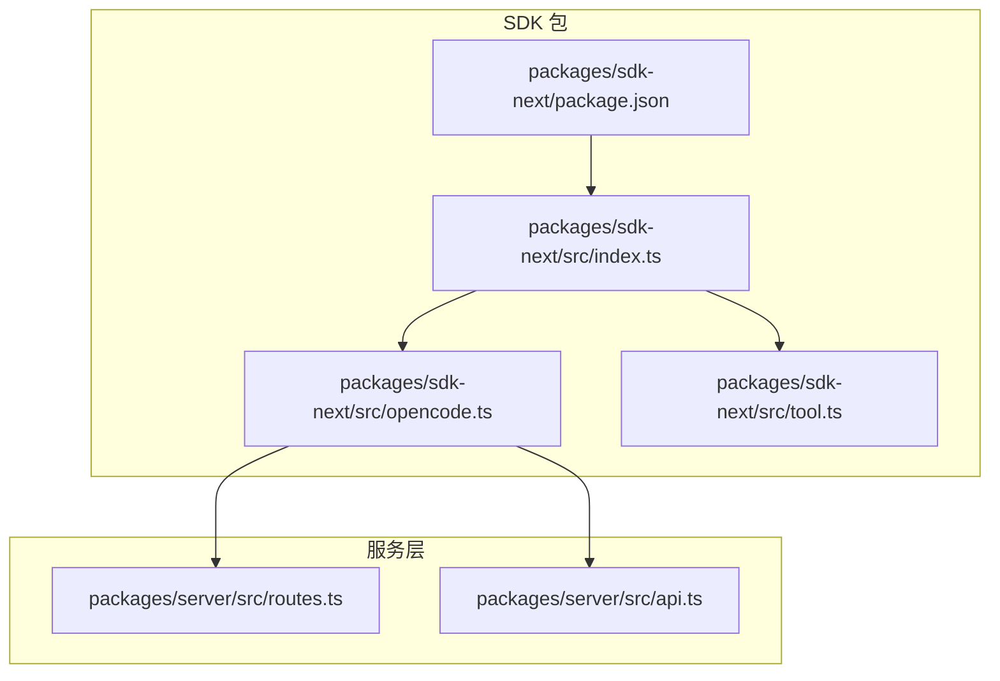
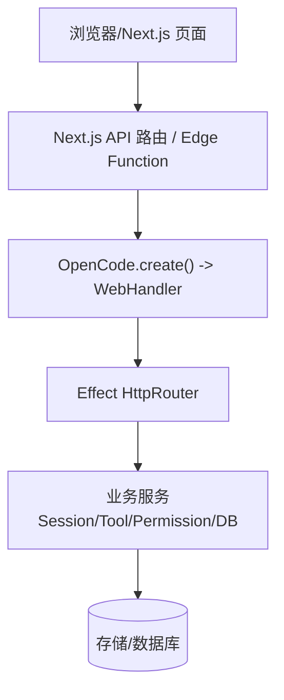
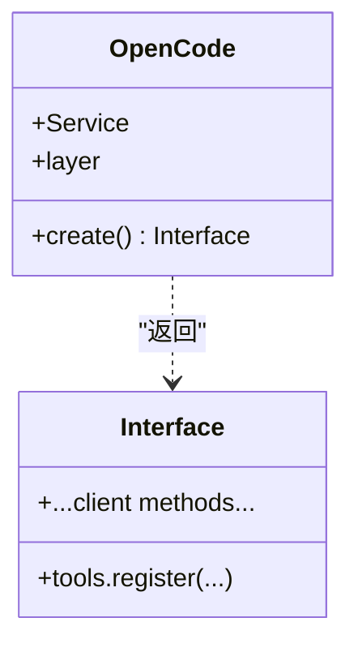
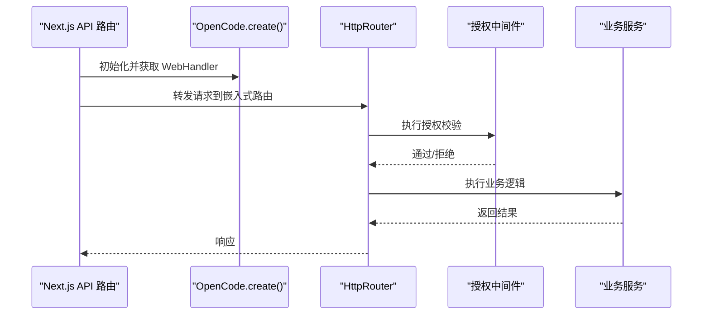
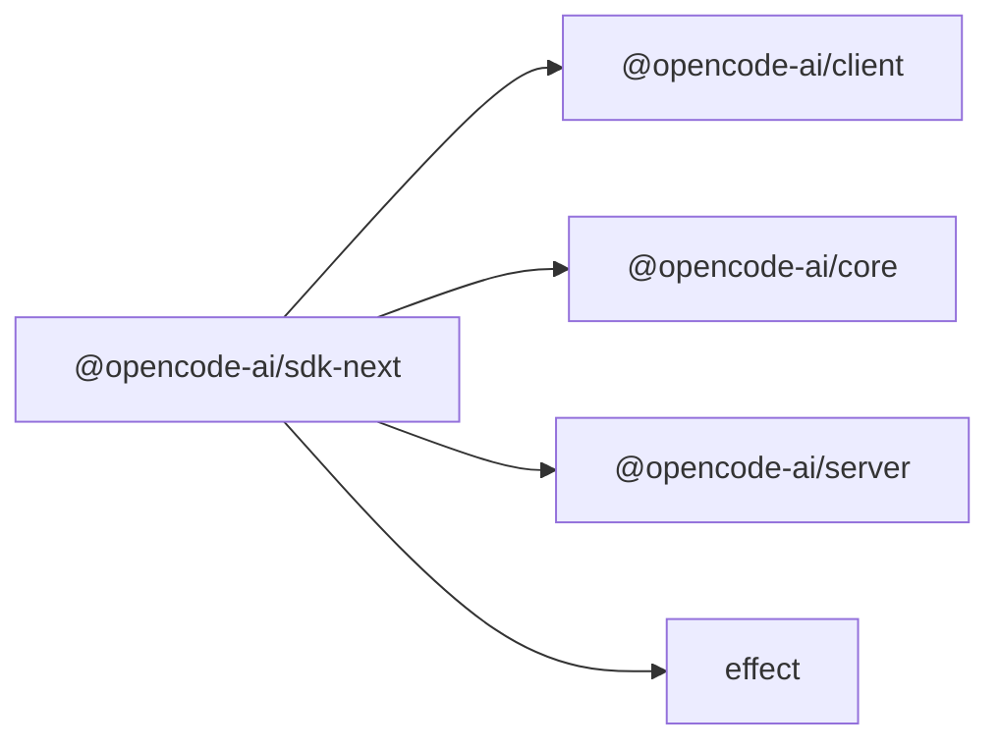

# Next.js SDK

<cite>
**本文引用的文件**   
- [packages/sdk-next/package.json](file://packages/sdk-next/package.json)
- [packages/sdk-next/src/index.ts](file://packages/sdk-next/src/index.ts)
- [packages/sdk-next/src/opencode.ts](file://packages/sdk-next/src/opencode.ts)
- [packages/sdk-next/src/tool.ts](file://packages/sdk-next/src/tool.ts)
- [packages/server/src/routes.ts](file://packages/server/src/routes.ts)
- [packages/server/src/api.ts](file://packages/server/src/api.ts)
</cite>

## 目录
1. [简介](#简介)
2. [项目结构](#项目结构)
3. [核心组件](#核心组件)
4. [架构总览](#架构总览)
5. [详细组件分析](#详细组件分析)
6. [依赖关系分析](#依赖关系分析)
7. [性能与缓存策略](#性能与缓存策略)
8. [Next.js 集成指南（App Router 与 Pages Router）](#nextjs-集成指南app-router-与-pages-router)
9. [故障排查](#故障排查)
10. [结论](#结论)
11. [附录：API 路由与中间件参考](#附录api-路由与中间件参考)

## 简介
本文件为 openNovel 的 Next.js SDK 文档，聚焦于如何在 Next.js 应用中集成 @opencode-ai/sdk-next。内容涵盖：
- 服务端渲染（SSR）与客户端渲染（CSR）的配置差异
- API 路由封装、中间件使用与请求上下文注入
- 数据获取与状态管理示例路径
- 与 Next.js App Router 和 Pages Router 的兼容性说明
- 部署优化与性能调优建议

该 SDK 基于 Effect 生态构建，提供嵌入式 HTTP 路由与 Web Handler，便于在 Node/Edge 环境中以最小成本接入 OpenCode 能力。

## 项目结构
SDK 包位于 packages/sdk-next，采用模块导出方式暴露 OpenCode 与 Tool 相关能力，并复用 client、core、server 等内部包的能力。

图表来源
- [packages/sdk-next/package.json:1-26](file://packages/sdk-next/package.json#L1-L26)
- [packages/sdk-next/src/index.ts:1-18](file://packages/sdk-next/src/index.ts#L1-L18)
- [packages/sdk-next/src/opencode.ts:1-50](file://packages/sdk-next/src/opencode.ts#L1-L50)
- [packages/sdk-next/src/tool.ts:1-3](file://packages/sdk-next/src/tool.ts#L1-L3)
- [packages/server/src/routes.ts:1-69](file://packages/server/src/routes.ts#L1-L69)
- [packages/server/src/api.ts:1-8](file://packages/server/src/api.ts#L1-L8)

章节来源
- [packages/sdk-next/package.json:1-26](file://packages/sdk-next/package.json#L1-L26)
- [packages/sdk-next/src/index.ts:1-18](file://packages/sdk-next/src/index.ts#L1-L18)

## 核心组件
- OpenCode.create：创建 SDK 实例，构建 Effect 层、注册工具、生成嵌入式 Web Handler，并提供 fetch 适配用于 HTTP 调用。
- Service/Layer：通过 Effect Context 暴露服务，便于在请求链路中注入权限、工具等上下文。
- Tool 导出：暴露工具定义与错误类型，便于扩展自定义工具。

关键职责
- 构建应用层节点（ApplicationTools、PermissionSaved）
- 将 Effect HttpRouter 转换为 WebHandler
- 提供 FetchHttpClient 层，替换底层 fetch
- 返回包含 tools.register 的客户端接口

章节来源
- [packages/sdk-next/src/opencode.ts:1-50](file://packages/sdk-next/src/opencode.ts#L1-L50)
- [packages/sdk-next/src/tool.ts:1-3](file://packages/sdk-next/src/tool.ts#L1-L3)
- [packages/sdk-next/src/index.ts:1-18](file://packages/sdk-next/src/index.ts#L1-L18)

## 架构总览
下图展示了 SDK 在 Next.js 中的典型集成架构：Next.js 作为入口，通过 API 路由或边缘函数调用 SDK 提供的 WebHandler，进而访问后端服务与数据库。

图表来源
- [packages/sdk-next/src/opencode.ts:10-43](file://packages/sdk-next/src/opencode.ts#L10-L43)
- [packages/server/src/routes.ts:39-63](file://packages/server/src/routes.ts#L39-L63)

## 详细组件分析

### OpenCode.create 与服务层
- 构建 Scope 与 MemoMap，提升重复构建的性能
- 组合 ApplicationTools 与 PermissionSaved 节点
- 生成嵌入式路由处理器，并通过 Layer 注入权限与 HTTP 服务
- 提供可定制的 fetch 实现，便于在 SSR/CSR 环境下统一网络层
- 返回客户端对象，包含 tools.register 等方法

图表来源
- [packages/sdk-next/src/opencode.ts:10-47](file://packages/sdk-next/src/opencode.ts#L10-L47)

章节来源
- [packages/sdk-next/src/opencode.ts:1-50](file://packages/sdk-next/src/opencode.ts#L1-50)

### Tool 工具系统
- 暴露工具定义、上下文与错误类型，便于在 SDK 中注册与调用
- 与 ApplicationTools 节点协作，完成工具生命周期管理

章节来源
- [packages/sdk-next/src/tool.ts:1-3](file://packages/sdk-next/src/tool.ts#L1-L3)

### API 路由与中间件
- routes.ts 定义了 createRoutes 与 createEmbeddedRoutes，分别用于独立服务与嵌入式场景
- api.ts 组装默认 API，并注入位置与会话相关的中间件

图表来源
- [packages/server/src/routes.ts:39-63](file://packages/server/src/routes.ts#L39-L63)
- [packages/server/src/api.ts:1-8](file://packages/server/src/api.ts#L1-L8)

章节来源
- [packages/server/src/routes.ts:1-69](file://packages/server/src/routes.ts#L1-L69)
- [packages/server/src/api.ts:1-8](file://packages/server/src/api.ts#L1-L8)

## 依赖关系分析
SDK 依赖 client、core、server 三个内部包，以及 effect 运行时。通过 exports 字段仅暴露 index.ts 作为入口，保持对外接口稳定。

图表来源
- [packages/sdk-next/package.json:1-26](file://packages/sdk-next/package.json#L1-L26)

章节来源
- [packages/sdk-next/package.json:1-26](file://packages/sdk-next/package.json#L1-L26)

## 性能与缓存策略
- 使用 Effect 的 MemoMap 与 Scope，避免重复构建层与资源，降低启动开销
- 嵌入式 WebHandler 关闭日志以减少 I/O 开销
- 在 SSR 场景下，尽量复用 SDK 实例与连接池，减少冷启动
- 对频繁读操作启用缓存（如 Redis/内存），结合 Vary 头控制缓存键
- 合理设置请求超时与重试策略，避免雪崩

章节来源
- [packages/sdk-next/src/opencode.ts:10-31](file://packages/sdk-next/src/opencode.ts#L10-L31)
- [packages/server/src/routes.ts:67-69](file://packages/server/src/routes.ts#L67-L69)

## Next.js 集成指南（App Router 与 Pages Router）

### App Router 集成要点
- 在 app/api 路由中使用 SDK 的 WebHandler 处理请求
- 通过 Effect.provideService 注入请求级上下文（如 WorkspaceRef、InstanceRef）
- 利用 Effect 的并发与错误模型，确保 SSR 稳定性

步骤概览
- 安装依赖并引入 SDK
- 在 API 路由中初始化 SDK（推荐单例）
- 将请求转发至 WebHandler
- 返回响应给 Next.js

注意
- 避免在中间件中滥用 provideService，仅在需要请求派生上下文时使用
- 明确 JSON 错误契约，优先使用 Schema.ErrorClass 而非空体 HttpApiError

章节来源
- [packages/sdk-next/src/opencode.ts:10-43](file://packages/sdk-next/src/opencode.ts#L10-L43)
- [packages/server/src/routes.ts:39-63](file://packages/server/src/routes.ts#L39-L63)

### Pages Router 集成要点
- 在 pages/api 路由中同样使用 WebHandler 处理请求
- 对于 SSR 页面，可在 getServerSideProps 中调用 SDK 获取数据
- 对于 CSR 页面，可在 useEffect 中调用 SDK 进行数据更新

最佳实践
- 将 SDK 实例提升到模块级别，避免每次请求重新构建
- 使用统一的错误处理与日志策略

章节来源
- [packages/sdk-next/src/opencode.ts:10-43](file://packages/sdk-next/src/opencode.ts#L10-L43)

### 服务端渲染（SSR）与客户端渲染（CSR）配置差异
- SSR：建议在服务器端初始化 SDK，复用连接与缓存；避免在客户端直接调用服务端方法
- CSR：通过 API 路由间接调用 SDK，保证安全与一致性
- 环境变量：区分开发/生产环境，调整 baseUrl、超时、重试等参数

章节来源
- [packages/sdk-next/src/opencode.ts:20-38](file://packages/sdk-next/src/opencode.ts#L20-L38)

### 页面组件集成、数据获取与状态管理示例路径
- 页面组件集成：在 App Router 的 page.tsx 中调用 API 路由，或在 SSR 钩子中直接获取数据
- 数据获取：在 getServerSideProps（Pages Router）或 server action（App Router）中调用 SDK
- 状态管理：结合 React 状态库（如 Zustand/Redux）管理 UI 状态，SDK 负责数据层

示例路径（无代码片段）
- [packages/sdk-next/src/index.ts:1-18](file://packages/sdk-next/src/index.ts#L1-L18)
- [packages/sdk-next/src/opencode.ts:10-43](file://packages/sdk-next/src/opencode.ts#L10-L43)

### 与 Next.js 生态系统的兼容性
- App Router：推荐使用，配合 Edge Runtime 可获得更低延迟
- Pages Router：兼容良好，适合渐进迁移
- Middleware：谨慎使用，避免阻塞请求；仅在必要时注入请求级上下文

章节来源
- [packages/server/src/routes.ts:39-63](file://packages/server/src/routes.ts#L39-L63)

### 部署优化与性能调优建议
- 使用容器化部署，预热 SDK 实例，减少冷启动时间
- 开启 HTTP/2 与连接池，提高并发处理能力
- 针对热点接口启用缓存与降级策略
- 监控与告警：关注 P95/P99 延迟与错误率

章节来源
- [packages/sdk-next/src/opencode.ts:20-31](file://packages/sdk-next/src/opencode.ts#L20-L31)
- [packages/server/src/routes.ts:67-69](file://packages/server/src/routes.ts#L67-L69)

## 故障排查
常见问题与定位
- 授权失败：检查 authorizationLayer 与 SessionLocationMiddleware 是否正确注入
- 路由未命中：确认 createEmbeddedRoutes 与 HttpRouter.toWebHandler 的参数
- 网络错误：验证 FetchHttpClient.Fetch 是否被正确替换
- 性能问题：检查 MemoMap 与 Scope 的使用，避免重复构建

章节来源
- [packages/server/src/routes.ts:39-63](file://packages/server/src/routes.ts#L39-L63)
- [packages/sdk-next/src/opencode.ts:20-38](file://packages/sdk-next/src/opencode.ts#L20-L38)

## 结论
@opencode-ai/sdk-next 提供了轻量、高效的 Next.js 集成方案，借助 Effect 生态实现高内聚、低耦合的服务编排。通过合理的 SSR/CSR 配置、API 路由封装与中间件使用，可以在保证性能的同时获得良好的可维护性。

## 附录：API 路由与中间件参考
- API 路由：routes.ts 提供 createRoutes 与 createEmbeddedRoutes，支持密码认证与嵌入式模式
- 中间件：api.ts 注入 Location 与 SessionLocation 中间件，统一请求上下文

章节来源
- [packages/server/src/routes.ts:1-69](file://packages/server/src/routes.ts#L1-L69)
- [packages/server/src/api.ts:1-8](file://packages/server/src/api.ts#L1-L8)