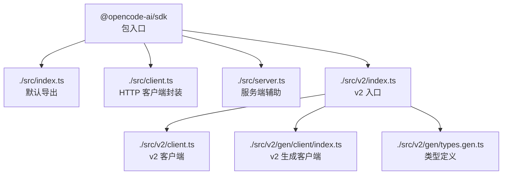
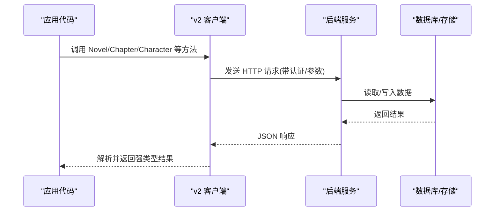
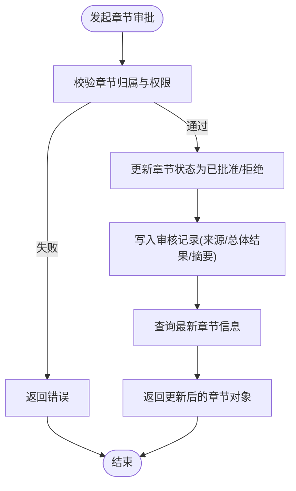
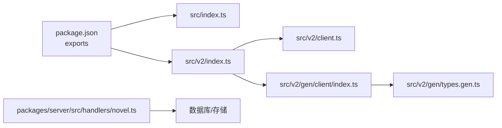

# Node.js SDK

<cite>
**本文引用的文件**
- [packages/sdk/js/package.json](file://packages/sdk/js/package.json)
- [packages/sdk/js/src/v2/gen/types.gen.ts](file://packages/sdk/js/src/v2/gen/types.gen.ts)
- [packages/sdk/js/src/v2/gen/sdk.gen.ts](file://packages/sdk/js/src/v2/gen/sdk.gen.ts)
- [packages/server/src/handlers/novel.ts](file://packages/server/src/handlers/novel.ts)
- [packages/opencode/test/server/httpapi-exercise/index.ts](file://packages/opencode/test/server/httpapi-exercise/index.ts)
</cite>

## 目录
1. [简介](#简介)
2. [项目结构](#项目结构)
3. [核心组件](#核心组件)
4. [架构总览](#架构总览)
5. [详细组件分析](#详细组件分析)
6. [依赖关系分析](#依赖关系分析)
7. [性能与并发](#性能与并发)
8. [故障排查指南](#故障排查指南)
9. [结论](#结论)
10. [附录：类型与 IDE 支持](#附录类型与-ide-支持)

## 简介
本文件为 openNovel Node.js SDK 的使用与实现文档，面向希望基于该 SDK 进行小说创作、章节管理、角色管理与 AI 集成的开发者。SDK 通过 HTTP API 暴露能力，并提供 TypeScript 类型定义与客户端封装，便于在 Node.js 环境中安全、高效地调用。

## 项目结构
SDK 位于 packages/sdk/js 中，采用模块化导出，提供 v1 与 v2 两套客户端入口，以及 v2 的自动生成代码（OpenAPI 生成）。包 exports 字段定义了对外导出的路径，包括根入口、v2 客户端、服务端工具与类型等。

图表来源
- [packages/sdk/js/package.json:12-21](file://packages/sdk/js/package.json#L12-L21)

章节来源
- [packages/sdk/js/package.json:12-21](file://packages/sdk/js/package.json#L12-L21)

## 核心组件
- 客户端初始化与配置
  - 通过包的 exports 提供的路径导入客户端或 v2 客户端。
  - 使用 Options 类型传入 client 实例或 meta 元数据，以扩展行为。
- 核心 API 分组
  - v2 生成的客户端包含 Novel、Chapter、Character、Session、Auth、App 等模块，覆盖小说全生命周期操作。
- 类型系统
  - types.gen.ts 提供 NovelVolume、NovelChapter、NovelChapterDetail、NovelChapterVersion、NovelReviewDimension、NovelChapterReview、NovelCharacter 等强类型定义。

章节来源
- [packages/sdk/js/src/v2/gen/sdk.gen.ts:554-577](file://packages/sdk/js/src/v2/gen/sdk.gen.ts#L554-L577)
- [packages/sdk/js/src/v2/gen/types.gen.ts:6221-6303](file://packages/sdk/js/src/v2/gen/types.gen.ts#L6221-L6303)

## 架构总览
SDK 作为 HTTP 客户端，调用后端服务暴露的 RESTful API。v2 客户端由 OpenAPI 自动生成，保证接口契约与类型一致。服务器端 handlers 负责业务逻辑与持久化，测试用例暴露了部分路由用于验证。

图表来源
- [packages/sdk/js/src/v2/gen/sdk.gen.ts:571-577](file://packages/sdk/js/src/v2/gen/sdk.gen.ts#L571-L577)
- [packages/server/src/handlers/novel.ts:614-643](file://packages/server/src/handlers/novel.ts#L614-L643)
- [packages/opencode/test/server/httpapi-exercise/index.ts:1959-1996](file://packages/opencode/test/server/httpapi-exercise/index.ts#L1959-L1996)

## 详细组件分析

### 客户端初始化与配置
- 入口与导出
  - 包 exports 定义了多个导出路径，包括 v2 客户端与服务端工具。
- Options 与 Client
  - v2 客户端 Options 允许注入自定义 client 实例与 meta 元数据，便于统一鉴权、日志与重试策略。
- 创建客户端实例
  - 可通过 new HeyApiClient({ client }) 或 SDK 工厂方法获取具体资源类（如 Auth、App、ControlPlane 等），这些类内部维护对底层 HTTP 客户端的引用。

章节来源
- [packages/sdk/js/package.json:12-21](file://packages/sdk/js/package.json#L12-L21)
- [packages/sdk/js/src/v2/gen/sdk.gen.ts:554-577](file://packages/sdk/js/src/v2/gen/sdk.gen.ts#L554-L577)
- [packages/sdk/js/src/v2/gen/sdk.gen.ts:571-577](file://packages/sdk/js/src/v2/gen/sdk.gen.ts#L571-L577)

### 小说与章节管理 API
- 数据结构
  - NovelVolume、NovelChapter、NovelChapterDetail、NovelChapterVersion、NovelReviewDimension、NovelChapterReview 等类型定义章节、卷、版本与审核维度。
- 服务端处理
  - submitApproval 用于提交章节审批，更新状态并记录审核结果；listCharacters 列出某小说下的角色。
- 路由示例
  - 测试用例展示了 /api/novel/{novelID}/chapters、/volumes、/outline、/tension、/characters 等路由的存在与返回格式。

图表来源
- [packages/server/src/handlers/novel.ts:614-643](file://packages/server/src/handlers/novel.ts#L614-L643)
- [packages/opencode/test/server/httpapi-exercise/index.ts:1959-1996](file://packages/opencode/test/server/httpapi-exercise/index.ts#L1959-L1996)
- [packages/sdk/js/src/v2/gen/types.gen.ts:6221-6303](file://packages/sdk/js/src/v2/gen/types.gen.ts#L6221-L6303)

章节来源
- [packages/sdk/js/src/v2/gen/types.gen.ts:6221-6303](file://packages/sdk/js/src/v2/gen/types.gen.ts#L6221-L6303)
- [packages/server/src/handlers/novel.ts:614-643](file://packages/server/src/handlers/novel.ts#L614-L643)
- [packages/opencode/test/server/httpapi-exercise/index.ts:1959-1996](file://packages/opencode/test/server/httpapi-exercise/index.ts#L1959-L1996)

### 角色管理 API
- 角色模型
  - NovelCharacter 包含 id、novelId、name、role、description、createdAt 等字段。
- 列表接口
  - listCharacters 按 novelId 过滤并返回角色集合。

章节来源
- [packages/sdk/js/src/v2/gen/types.gen.ts:6296-6303](file://packages/sdk/js/src/v2/gen/types.gen.ts#L6296-L6303)
- [packages/server/src/handlers/novel.ts:636-643](file://packages/server/src/handlers/novel.ts#L636-L643)

### AI 集成接口
- 会话与消息
  - Session 相关方法支持创建会话、发送消息、异步提示、命令执行、Shell 执行、回滚与恢复等。
- 事件订阅
  - Global.event 支持 SSE 事件流，可用于实时交互。
- 工具与提供者
  - Tool.ids/list 与 Provider/auth/oauth 等接口支持工具发现与 OAuth 授权流程。

章节来源
- [packages/sdk/js/src/v2/gen/sdk.gen.ts:571-577](file://packages/sdk/js/src/v2/gen/sdk.gen.ts#L571-L577)

## 依赖关系分析
- 包导出依赖
  - package.json 的 exports 字段将 src 下的 index、client、server、v2 等模块映射到外部可访问路径。
- 生成代码依赖
  - v2 客户端依赖 client.gen.ts 与 types.gen.ts，确保类型与请求构造的一致性。
- 服务端依赖
  - handlers/novel.ts 依赖数据库表结构与领域函数，完成章节与角色的 CRUD 与审批流程。

图表来源
- [packages/sdk/js/package.json:12-21](file://packages/sdk/js/package.json#L12-L21)
- [packages/sdk/js/src/v2/gen/sdk.gen.ts:571-577](file://packages/sdk/js/src/v2/gen/sdk.gen.ts#L571-L577)
- [packages/server/src/handlers/novel.ts:614-643](file://packages/server/src/handlers/novel.ts#L614-L643)

章节来源
- [packages/sdk/js/package.json:12-21](file://packages/sdk/js/package.json#L12-L21)
- [packages/sdk/js/src/v2/gen/sdk.gen.ts:571-577](file://packages/sdk/js/src/v2/gen/sdk.gen.ts#L571-L577)
- [packages/server/src/handlers/novel.ts:614-643](file://packages/server/src/handlers/novel.ts#L614-L643)

## 性能与并发
- 连接池管理
  - 通过注入自定义 client 实例，可在应用层配置连接池、超时与重试策略，避免重复建立连接。
- 并发控制
  - 使用 Promise.all/Map 并发调用时，建议限制并发度（如 p-limit）以避免瞬时压力过大。
- 资源优化
  - 复用 SDK 实例与 HTTP 客户端；减少不必要的 meta 传递；合理分页与批量接口使用。

[本节为通用指导，不直接分析具体文件]

## 故障排查指南
- 常见错误
  - 未创建 SDK 客户端实例导致无法获取资源类。
  - 认证缺失或 token 过期导致鉴权失败。
  - 网络异常或服务不可用导致请求失败。
- 定位步骤
  - 检查包导出路径是否正确导入。
  - 确认 Options.client 是否注入有效实例。
  - 查看服务端日志与数据库状态，核对路由与参数。
- 重试机制
  - 在自定义 client 中实现指数退避重试，针对 5xx 与网络错误进行有限次重试。

章节来源
- [packages/sdk/js/src/v2/gen/sdk.gen.ts:571-577](file://packages/sdk/js/src/v2/gen/sdk.gen.ts#L571-L577)

## 结论
openNovel Node.js SDK 通过 v2 生成客户端与强类型定义，提供了稳定、可扩展的小说与章节管理能力，并支持与 AI 会话、工具与提供者集成。建议在应用层统一配置 HTTP 客户端以实现连接池、重试与监控，从而获得更好的性能与稳定性。

## 附录：类型与 IDE 支持
- TypeScript 类型
  - types.gen.ts 提供完整的领域模型类型，IDE 可获得自动补全与类型检查。
- IDE 支持
  - 使用现代 TS 编译器与编辑器（VS Code）可获得最佳体验；确保 tsconfig 正确配置模块与路径映射。
- 常用类型参考
  - NovelVolume、NovelChapter、NovelChapterDetail、NovelChapterVersion、NovelReviewDimension、NovelChapterReview、NovelCharacter。

章节来源
- [packages/sdk/js/src/v2/gen/types.gen.ts:6221-6303](file://packages/sdk/js/src/v2/gen/types.gen.ts#L6221-L6303)