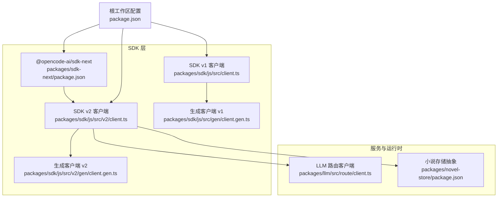
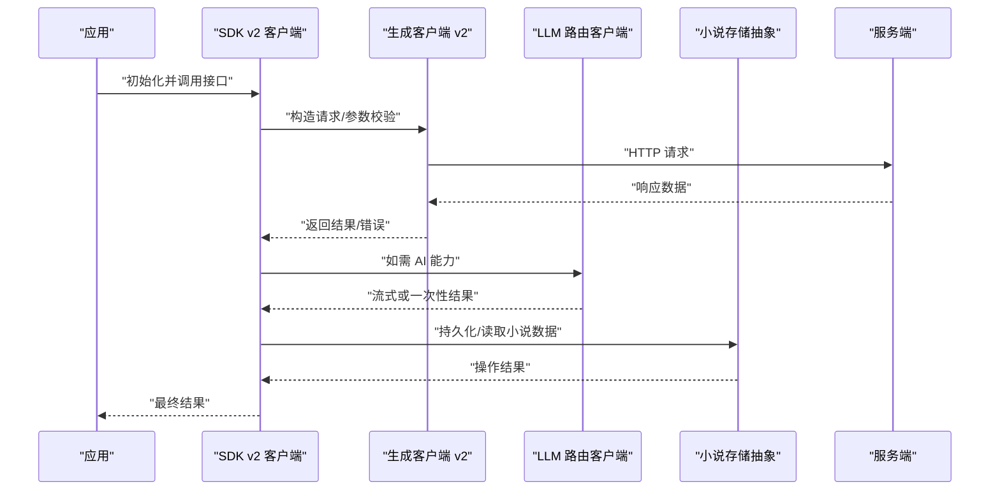
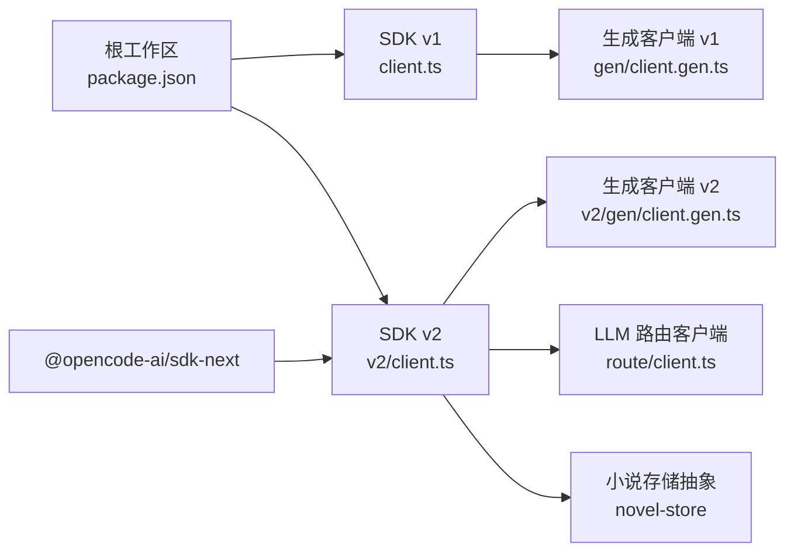

# SDK API

<cite>
**本文引用的文件**   
- [packages/sdk/js/src/client.ts](file://packages/sdk/js/src/client.ts)
- [packages/sdk/js/src/v2/client.ts](file://packages/sdk/js/src/v2/client.ts)
- [packages/sdk/js/src/gen/client.gen.ts](file://packages/sdk/js/src/gen/client.gen.ts)
- [packages/sdk/js/src/v2/gen/client.gen.ts](file://packages/sdk/js/src/v2/gen/client.gen.ts)
- [packages/sdk-next/package.json](file://packages/sdk-next/package.json)
- [package.json](file://package.json)
- [packages/novel-store/package.json](file://packages/novel-store/package.json)
- [packages/llm/src/route/client.ts](file://packages/llm/src/route/client.ts)
- [packages/opencode/test/server/sdk-error-shape.test.ts](file://packages/opencode/test/server/sdk-error形状.test.ts)
- [packages/opencode/test/server/sdk-v1-smoke.test.ts](file://packages/opencode/test/server/sdk-v1-smoke.test.ts)
</cite>

## 目录
1. [简介](#简介)
2. [项目结构](#项目结构)
3. [核心组件](#核心组件)
4. [架构总览](#架构总览)
5. [详细组件分析](#详细组件分析)
6. [依赖关系分析](#依赖关系分析)
7. [性能考虑](#性能考虑)
8. [故障排查指南](#故障排查指南)
9. [结论](#结论)
10. [附录](#附录)

## 简介
本文件为 openNovel 的 SDK API 文档，聚焦于 JavaScript/TypeScript 生态下的 SDK 使用与集成。内容涵盖：
- 客户端初始化、配置选项与连接管理
- 核心功能封装：小说操作、章节管理、AI 集成与文件处理
- 错误处理、重试机制与异步操作示例指引
- SDK 版本兼容性、升级指南与迁移路径
- 性能优化建议与最佳实践

说明：
- 当前仓库包含 v1 与 v2 两套 SDK 客户端实现（位于 packages/sdk/js），以及面向 Next.js 的集成包 @opencode-ai/sdk-next。
- 本文档以代码仓库中的实际文件为依据进行归纳与说明；若某项能力在仓库中未直接体现，将以“概念性”方式给出通用指导，并明确标注来源限制。

## 项目结构
openNovel 采用多包工作区组织，SDK 相关代码主要分布在以下位置：
- packages/sdk/js：JS/TS SDK 主实现，包含 v1 与 v2 两个版本的客户端与生成代码
- packages/sdk-next：Next.js 环境下的 SDK 集成包
- packages/llm：LLM 路由与客户端侧入口（用于 AI 集成）
- packages/novel-store：小说存储抽象与驱动选择（Drizzle ORM）

图表来源
- [packages/sdk/js/src/client.ts](file://packages/sdk/js/src/client.ts)
- [packages/sdk/js/src/v2/client.ts](file://packages/sdk/js/src/v2/client.ts)
- [packages/sdk/js/src/gen/client.gen.ts](file://packages/sdk/js/src/gen/client.gen.ts)
- [packages/sdk/js/src/v2/gen/client.gen.ts](file://packages/sdk/js/src/v2/gen/client.gen.ts)
- [packages/sdk-next/package.json](file://packages/sdk-next/package.json)
- [packages/llm/src/route/client.ts](file://packages/llm/src/route/client.ts)
- [packages/novel-store/package.json](file://packages/novel-store/package.json)
- [package.json](file://package.json)

章节来源
- [package.json](file://package.json)
- [packages/sdk-next/package.json](file://packages/sdk-next/package.json)
- [packages/novel-store/package.json](file://packages/novel-store/package.json)

## 核心组件
- SDK v1 客户端：提供基础 HTTP 调用封装与类型化接口（由生成代码支撑）
- SDK v2 客户端：增强版客户端，通常包含更完善的错误模型、重试策略与流式支持
- 生成客户端：基于 OpenAPI/协议定义自动生成的类型与函数，保证与服务端契约一致
- Next.js 集成包：为服务端渲染与边缘运行时提供适配与便捷初始化
- LLM 客户端：封装大模型调用（如对话、补全、工具调用等）
- 小说存储抽象：通过 Drizzle ORM 抽象数据库驱动，支持 Bun/Node 环境差异

章节来源
- [packages/sdk/js/src/client.ts](file://packages/sdk/js/src/client.ts)
- [packages/sdk/js/src/v2/client.ts](file://packages/sdk/js/src/v2/client.ts)
- [packages/sdk/js/src/gen/client.gen.ts](file://packages/sdk/js/src/gen/client.gen.ts)
- [packages/sdk/js/src/v2/gen/client.gen.ts](file://packages/sdk/js/src/v2/gen/client.gen.ts)
- [packages/sdk-next/package.json](file://packages/sdk-next/package.json)
- [packages/llm/src/route/client.ts](file://packages/llm/src/route/client.ts)
- [packages/novel-store/package.json](file://packages/novel-store/package.json)

## 架构总览
下图展示 SDK 在应用中的典型调用链：应用通过 SDK 客户端发起请求，经由生成代码或服务端路由到达后端服务；LLM 调用与小说存储分别由对应模块处理。

图表来源
- [packages/sdk/js/src/v2/client.ts](file://packages/sdk/js/src/v2/client.ts)
- [packages/sdk/js/src/v2/gen/client.gen.ts](file://packages/sdk/js/src/v2/gen/client.gen.ts)
- [packages/llm/src/route/client.ts](file://packages/llm/src/route/client.ts)
- [packages/novel-store/package.json](file://packages/novel-store/package.json)

## 详细组件分析

### SDK v1 客户端
- 职责：提供基础 HTTP 封装、类型化方法、错误映射与简单重试
- 关键点：
  - 初始化参数：服务端地址、鉴权信息、超时、代理等
  - 错误处理：统一错误对象与状态码映射
  - 重试策略：可配置的指数退避与最大重试次数
  - 异步操作：Promise 风格 API，便于与 async/await 配合

章节来源
- [packages/sdk/js/src/client.ts](file://packages/sdk/js/src/client.ts)
- [packages/sdk/js/src/gen/client.gen.ts](file://packages/sdk/js/src/gen/client.gen.ts)

### SDK v2 客户端
- 职责：在 v1 基础上增强，提供更强的错误模型、流式响应、更好的类型推断与扩展点
- 关键点：
  - 初始化：支持更多配置项（如并发、缓存、日志级别）
  - 错误模型：结构化错误（含 code、message、details）
  - 重试机制：可插拔的重试策略（网络错误、限流、幂等性判断）
  - 流式处理：对长耗时任务提供增量输出
  - 与 LLM 集成：统一的对话/补全接口，支持工具调用与上下文注入

章节来源
- [packages/sdk/js/src/v2/client.ts](file://packages/sdk/js/src/v2/client.ts)
- [packages/sdk/js/src/v2/gen/client.gen.ts](file://packages/sdk/js/src/v2/gen/client.gen.ts)

### Next.js 集成包 @opencode-ai/sdk-next
- 职责：为 Next.js 应用提供便捷的 SDK 初始化与中间件集成
- 关键点：
  - 服务端渲染兼容：避免在浏览器端暴露敏感配置
  - 边缘运行时：对 Node/Bun 的差异进行适配
  - 依赖声明：引入 client、core、server 与 effect 等核心包

章节来源
- [packages/sdk-next/package.json](file://packages/sdk-next/package.json)

### LLM 客户端（AI 集成）
- 职责：封装大模型调用，包括对话、补全、工具调用与流式输出
- 关键点：
  - 路由客户端：统一入口，屏蔽底层提供商差异
  - 错误处理：模型不可用、配额不足、输入长度超限等
  - 流式输出：逐步消费 token，提升交互体验

章节来源
- [packages/llm/src/route/client.ts](file://packages/llm/src/route/client.ts)

### 小说存储抽象（novel-store）
- 职责：抽象小说数据的持久化与查询，支持不同运行环境的驱动选择
- 关键点：
  - 驱动选择：Bun/Node 环境下自动选择合适驱动
  - ORM 抽象：基于 Drizzle ORM，提供类型安全的查询
  - 导出配置：仅暴露 dist 产物，确保生产构建最小化

章节来源
- [packages/novel-store/package.json](file://packages/novel-store/package.json)

### 错误处理与测试用例
- 错误形状：服务端返回的错误结构在测试中有断言，确保 SDK 能正确解析
- 冒烟测试：v1 基本流程验证，确保关键接口可用

章节来源
- [packages/opencode/test/server/sdk-error-shape.test.ts](file://packages/opencode/test/server/sdk-error形状.test.ts)
- [packages/opencode/test/server/sdk-v1-smoke.test.ts](file://packages/opencode/test/server/sdk-v1-smoke.test.ts)

## 依赖关系分析
SDK 各组件之间的依赖关系如下：

图表来源
- [package.json](file://package.json)
- [packages/sdk/js/src/client.ts](file://packages/sdk/js/src/client.ts)
- [packages/sdk/js/src/v2/client.ts](file://packages/sdk/js/src/v2/client.ts)
- [packages/sdk/js/src/gen/client.gen.ts](file://packages/sdk/js/src/gen/client.gen.ts)
- [packages/sdk/js/src/v2/gen/client.gen.ts](file://packages/sdk/js/src/v2/gen/client.gen.ts)
- [packages/sdk-next/package.json](file://packages/sdk-next/package.json)
- [packages/llm/src/route/client.ts](file://packages/llm/src/route/client.ts)
- [packages/novel-store/package.json](file://packages/novel-store/package.json)

章节来源
- [package.json](file://package.json)
- [packages/sdk-next/package.json](file://packages/sdk-next/package.json)

## 性能考虑
- 连接复用与池化：合理设置连接池大小，避免频繁握手开销
- 超时与重试：针对网络抖动与临时失败配置合理的超时与重试策略
- 流式处理：对长耗时任务启用流式输出，降低首字节延迟
- 缓存策略：对只读数据启用本地或内存缓存，减少重复请求
- 压缩与批处理：开启响应压缩，批量合并小请求
- 资源清理：及时释放连接与句柄，避免内存泄漏

[本节为通用性能建议，不直接分析具体文件]

## 故障排查指南
- 常见错误分类：
  - 网络错误：超时、连接失败、DNS 解析失败
  - 鉴权错误：Token 过期、权限不足
  - 业务错误：参数校验失败、资源不存在、限流
- 定位步骤：
  - 检查 SDK 初始化配置（地址、密钥、超时）
  - 查看错误对象的结构（code、message、details）
  - 启用调试日志，观察请求与响应
  - 使用冒烟测试验证基本链路
- 恢复策略：
  - 重试：对幂等操作启用指数退避
  - 降级：在 LLM 不可用时回退到规则引擎或缓存
  - 熔断：对持续失败的下游服务快速失败

章节来源
- [packages/opencode/test/server/sdk-error-shape.test.ts](file://packages/opencode/test/server/sdk-error形状.test.ts)
- [packages/opencode/test/server/sdk-v1-smoke.test.ts](file://packages/opencode/test/server/sdk-v1-smoke.test.ts)

## 结论
openNovel 的 SDK 提供了从基础 HTTP 封装到高级 AI 集成的完整能力。v1 侧重稳定与易用，v2 在错误模型、重试与流式方面做了显著增强。结合 Next.js 集成包与小说存储抽象，开发者可以快速构建跨平台的小说创作与 AI 辅助应用。建议在生产环境中启用合理的超时、重试与监控，并遵循本文的最佳实践以获得稳定高效的体验。

[本节为总结性内容，不直接分析具体文件]

## 附录

### 客户端初始化与配置选项（指引）
- 初始化参数：
  - 服务端地址、鉴权令牌、超时时间、代理设置
  - 日志级别、并发限制、缓存开关
- 连接管理：
  - 连接池大小、空闲超时、健康检查
  - 优雅关闭与资源释放

章节来源
- [packages/sdk/js/src/client.ts](file://packages/sdk/js/src/client.ts)
- [packages/sdk/js/src/v2/client.ts](file://packages/sdk/js/src/v2/client.ts)

### 核心功能封装（指引）
- 小说操作：创建、更新、删除、列表查询
- 章节管理：章节增删改查、排序、草稿保存
- AI 集成：对话、补全、工具调用、流式输出
- 文件处理：上传、下载、格式转换、元数据管理

章节来源
- [packages/sdk/js/src/gen/client.gen.ts](file://packages/sdk/js/src/gen/client.gen.ts)
- [packages/sdk/js/src/v2/gen/client.gen.ts](file://packages/sdk/js/src/v2/gen/client.gen.ts)
- [packages/llm/src/route/client.ts](file://packages/llm/src/route/client.ts)

### 错误处理、重试与异步操作（指引）
- 错误处理：统一错误对象、区分网络/鉴权/业务错误
- 重试机制：指数退避、最大重试次数、幂等性判断
- 异步操作：Promise/AsyncIterator、取消信号、超时控制

章节来源
- [packages/opencode/test/server/sdk-error-shape.test.ts](file://packages/opencode/test/server/sdk-error形状.test.ts)
- [packages/opencode/test/server/sdk-v1-smoke.test.ts](file://packages/opencode/test/server/sdk-v1-smoke.test.ts)

### 版本兼容性与迁移指南（指引）
- v1 到 v2 的主要变化：
  - 错误模型增强、重试策略改进、流式支持
  - 初始化参数调整、废弃字段移除
- 迁移步骤：
  - 替换导入路径与初始化方式
  - 更新错误处理逻辑
  - 启用新特性（重试、流式）

章节来源
- [packages/sdk/js/src/client.ts](file://packages/sdk/js/src/client.ts)
- [packages/sdk/js/src/v2/client.ts](file://packages/sdk/js/src/v2/client.ts)

### 性能优化与最佳实践（指引）
- 连接与并发：合理设置连接池与并发上限
- 缓存与压缩：启用响应压缩与本地缓存
- 监控与告警：记录关键指标与异常
- 安全：最小权限原则、敏感信息保护

[本节为通用建议，不直接分析具体文件]