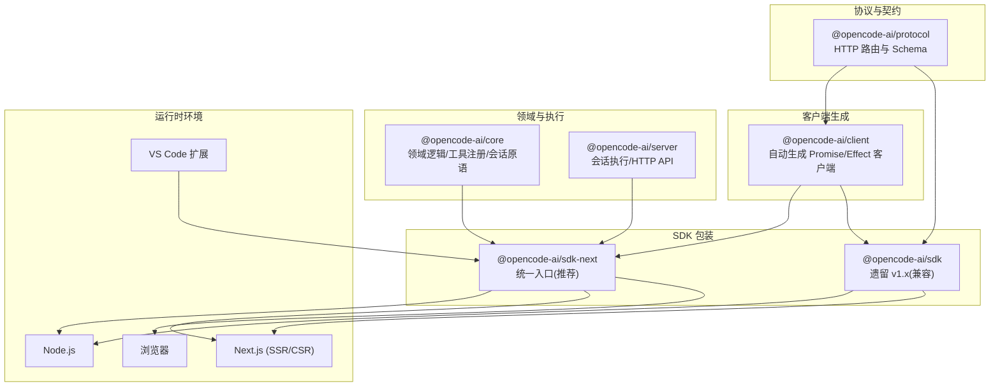
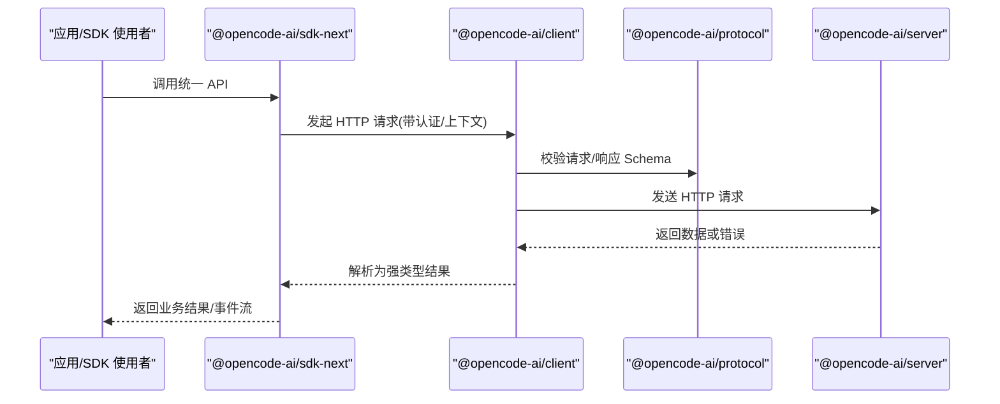
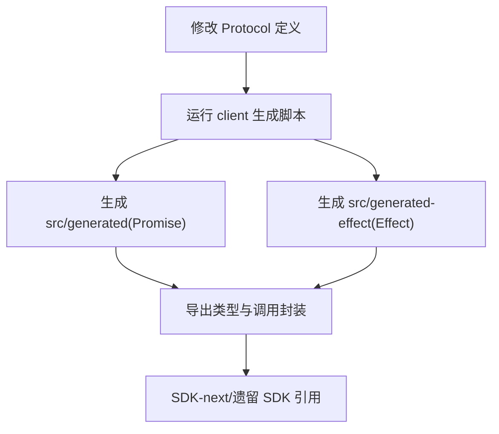
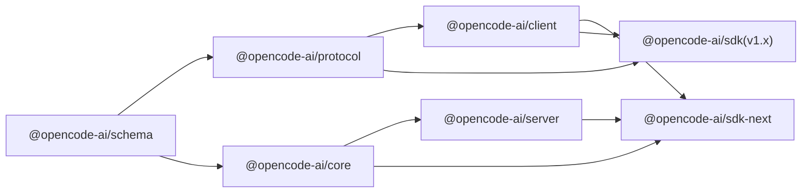
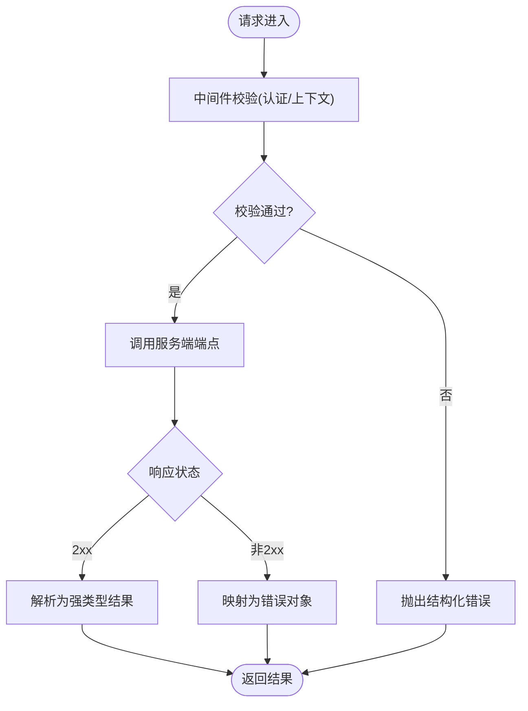

# SDK 概览

<cite>
**本文引用的文件**
- [README.zh.md](file://README.zh.md)
- [AGENTS.md](file://AGENTS.md)
- [packages/client/AGENTS.md](file://packages/client/AGENTS.md)
- [packages/client/src/contract.ts](file://packages/client/src/contract.ts)
- [packages/client/script/build.ts](file://packages/client/script/build.ts)
- [packages/sdk/AGENTS.md](file://packages/sdk/AGENTS.md)
- [packages/sdks/vscode/package.json](file://sdks/vscode/package.json)
- [specs/v2/api.html](file://specs/v2/api.html)
</cite>

## 目录
1. [简介](#简介)
2. [项目结构](#项目结构)
3. [核心组件](#核心组件)
4. [架构总览](#架构总览)
5. [详细组件分析](#详细组件分析)
6. [依赖关系分析](#依赖关系分析)
7. [性能与连接管理](#性能与连接管理)
8. [错误处理模式](#错误处理模式)
9. [安装与快速开始](#安装与快速开始)
10. [使用场景与版本选择建议](#使用场景与版本选择建议)
11. [常见问题排查](#常见问题排查)
12. [结论](#结论)

## 简介
本概览面向 openNovel SDK 的使用者与集成者，系统阐述 SDK 的整体架构、设计理念与核心特性，并给出 Node.js、Next.js（服务端/SSR）与浏览器客户端的适用场景与选型建议。文档同时覆盖安装方式、基础配置、快速开始、错误处理模式、连接管理与性能优化要点，并提供常见使用场景的代码片段路径指引，帮助读者快速上手与深入理解。

## 项目结构
openNovel 采用 monorepo 组织，SDK 相关能力分布在多个包中：
- 协议与契约层：@opencode-ai/protocol 定义 HTTP 路由与请求/响应 Schema，作为 Server 与 Client 的唯一契约。
- 客户端生成层：@opencode-ai/client 基于 Protocol 自动生成 TypeScript 类型与调用封装（Promise 与 Effect 双形态）。
- 下一代 SDK：@opencode-ai/sdk-next 统一组合 Client、Core、Server，提供面向程序化消费的主入口。
- 遗留 SDK：@opencode-ai/sdk（v1.x）由 OpenAPI 生成，保留向后兼容。
- VS Code 扩展：sdks/vscode 提供编辑器内集成能力。

图表来源
- [packages/client/AGENTS.md](file://packages/client/AGENTS.md)
- [packages/sdks/vscode/package.json](file://sdks/vscode/package.json)
- [AGENTS.md](file://AGENTS.md)

章节来源
- [README.zh.md:56-65](file://README.zh.md#L56-L65)
- [AGENTS.md:1-6](file://AGENTS.md#L1-L6)

## 核心组件
- 协议层（Protocol）：集中定义所有 HTTP 端点与请求/响应 Schema，保证服务端实现与客户端生成的强一致性。
- 客户端（Client）：从 Protocol 自动生成类型与调用封装，支持 Promise 与 Effect 两种风格，避免直接依赖 Core/Server。
- 下一代 SDK（sdk-next）：唯一被允许同时依赖 Client、Core、Server 的包，提供统一的 TypeScript 接口与最佳实践。
- 遗留 SDK（sdk v1.x）：由 OpenAPI 生成，保持向后兼容，不建议新增功能。
- VS Code 扩展：在编辑器内提供便捷集成体验。

章节来源
- [packages/client/AGENTS.md:1-16](file://packages/client/AGENTS.md#L1-L16)
- [packages/sdks/vscode/package.json](file://sdks/vscode/package.json)
- [packages/sdk/AGENTS.md:1-18](file://packages/sdk/AGENTS.md#L1-L18)
- [packages/sdks/vscode/package.json](file://sdks/vscode/package.json)

## 架构总览
SDK 遵循“协议驱动、代码生成、分层解耦”的设计原则：
- 协议先行：所有 API 变更先在 Protocol 中声明，再触发客户端生成。
- 生成优先：Client 与 SDK 的类型与调用均通过代码生成，减少手工维护成本。
- 分层约束：Client 不得依赖 Core/Server；sdk-next 是唯一可跨层的组合包。

图表来源
- [packages/client/AGENTS.md:1-16](file://packages/client/AGENTS.md#L1-L16)
- [packages/client/script/build.ts:1-30](file://packages/client/script/build.ts#L1-L30)
- [packages/client/src/contract.ts:14-17](file://packages/client/src/contract.ts#L14-L17)

## 详细组件分析

### 协议与客户端生成（Protocol → Client）
- Protocol 定义 HttpApi 路由组与中间件，确保每个端点具备明确的请求/响应 Schema。
- Client 构建脚本读取 Contract 与 Endpoint 信息，生成 Promise 与 Effect 两套客户端。
- 生成的客户端包含分组命名、中间件注入与错误映射，保障类型安全与一致行为。

图表来源
- [packages/client/script/build.ts:1-30](file://packages/client/script/build.ts#L1-L30)
- [packages/client/src/contract.ts:14-17](file://packages/client/src/contract.ts#L14-L17)

章节来源
- [packages/client/AGENTS.md:19-46](file://packages/client/AGENTS.md#L19-L46)
- [packages/client/script/build.ts:1-30](file://packages/client/script/build.ts#L1-L30)
- [packages/client/src/contract.ts:14-17](file://packages/client/src/contract.ts#L14-L17)

### 下一代 SDK（sdk-next）
- 职责：统一组合 Client、Core、Server，暴露简洁稳定的 TypeScript API。
- 规则：新功能优先在此实现；尽量重导出已有能力；以 Effect 为主，必要时提供同步/异步薄封装。
- 适用：Node.js、Next.js（服务端/SSR）、浏览器等需要稳定 SDK 接口的场景。

章节来源
- [packages/sdks/vscode/package.json](file://sdks/vscode/package.json)
- [packages/sdks/vscode/package.json](file://sdks/vscode/package.json)
- [AGENTS.md:1-6](file://AGENTS.md#L1-L6)

### 遗留 SDK（sdk v1.x）
- 职责：由 OpenAPI 生成，提供同步/异步接口，维持向后兼容。
- 规则：仅维护兼容性与关键修复，不新增公共 API 面。
- 适用：已有 v1.x 消费者迁移过渡期。

章节来源
- [packages/sdk/AGENTS.md:1-18](file://packages/sdk/AGENTS.md#L1-L18)
- [packages/sdk/AGENTS.md:37-42](file://packages/sdk/AGENTS.md#L37-L42)

### VS Code 扩展集成
- 作用：在 VS Code 中提供 SDK 能力，便于开发者在编辑器内完成创作与调试。
- 依赖：通过 package.json 声明依赖与入口，配合 SDK-next 提供的统一接口。

章节来源
- [packages/sdks/vscode/package.json](file://sdks/vscode/package.json)

## 依赖关系分析
- 依赖方向严格分层：Schema → Core/Protocol → Server；Client 仅依赖 Schema/Protocol。
- sdk-next 是唯一的“跨层”包，负责组合 Client、Core、Server。
- 生成链路：Protocol 变更 → Client 生成 → SDK-next/遗留 SDK 引用。

图表来源
- [AGENTS.md:1-6](file://AGENTS.md#L1-L6)
- [packages/client/AGENTS.md:1-16](file://packages/client/AGENTS.md#L1-L16)

章节来源
- [AGENTS.md:1-6](file://AGENTS.md#L1-L6)
- [packages/client/AGENTS.md:1-16](file://packages/client/AGENTS.md#L1-L16)

## 性能与连接管理
- 连接复用：客户端默认复用底层 HTTP 连接，避免频繁握手开销。
- 并发控制：对批量请求建议使用并发限制，避免资源争用。
- 事件流：优先使用事件订阅接口获取增量更新，降低轮询成本。
- 缓存策略：对热点数据（如模型列表、权限信息）进行本地缓存，结合失效策略。
- SSR/CSR 适配：在 Next.js 中区分服务端渲染与客户端渲染的请求上下文，避免不必要的网络往返。

[本节为通用指导，无需特定文件引用]

## 错误处理模式
- 中间件错误映射：客户端通过中间件将 HTTP 状态码映射为结构化错误（如无效请求、会话不存在）。
- 会话上下文：会话级操作绑定目录与工作区，避免重复传递上下文参数。
- 认证失败：未携带或错误的认证头将返回明确错误，便于上层重试或提示用户。

图表来源
- [packages/client/src/contract.ts:5-12](file://packages/client/src/contract.ts#L5-L12)
- [specs/v2/api.html:493-517](file://specs/v2/api.html#L493-L517)

章节来源
- [packages/client/src/contract.ts:5-12](file://packages/client/src/contract.ts#L5-L12)
- [specs/v2/api.html:493-517](file://specs/v2/api.html#L493-L517)

## 安装与快速开始
- 前置要求：Bun 运行时。
- 后端服务：启动后端服务（默认端口 4096）。
- Web UI：启动前端界面（默认端口 4444）。
- SDK 安装：根据目标环境选择 @opencode-ai/sdk-next（推荐）或 @opencode-ai/sdk（兼容）。

章节来源
- [README.zh.md:34-54](file://README.zh.md#L34-L54)

## 使用场景与版本选择建议
- Node.js 服务端/CLI：
  - 首选 @opencode-ai/sdk-next，获得统一、类型安全且可扩展的接口。
  - 若需与旧版 v1.x 兼容，可使用 @opencode-ai/sdk。
- Next.js（SSR/CSR）：
  - 服务端渲染阶段使用 @opencode-ai/sdk-next，确保类型与错误处理一致。
  - 客户端渲染阶段可通过浏览器 fetch 或 SDK 的浏览器适配调用。
- 浏览器客户端：
  - 使用 @opencode-ai/sdk-next 的浏览器友好封装，或通过生成的客户端直接调用。
- VS Code 扩展：
  - 通过 sdks/vscode 集成 SDK-next，获得编辑器内完整能力。

章节来源
- [packages/sdks/vscode/package.json](file://sdks/vscode/package.json)
- [packages/sdks/vscode/package.json](file://sdks/vscode/package.json)
- [packages/sdk/AGENTS.md:1-18](file://packages/sdk/AGENTS.md#L1-L18)
- [packages/sdks/vscode/package.json](file://sdks/vscode/package.json)

## 常见问题排查
- 生成文件不同步：
  - 现象：类型缺失或签名不一致。
  - 解决：重新运行 client 生成脚本，确保 generated 目录与最新 Protocol 一致。
- 会话上下文错误：
  - 现象：会话相关操作报找不到会话或上下文缺失。
  - 解决：确认会话已创建并正确绑定目录与工作区。
- 认证失败：
  - 现象：401/403 或认证头缺失。
  - 解决：检查 token/密码是否正确传入，并确保 headers 设置无误。
- 事件流无响应：
  - 现象：订阅事件无回调。
  - 解决：确认信号参数与服务端事件通道正常，检查网络与代理设置。

章节来源
- [packages/client/AGENTS.md:19-46](file://packages/client/AGENTS.md#L19-L46)
- [specs/v2/api.html:493-517](file://specs/v2/api.html#L493-L517)

## 结论
openNovel SDK 以协议驱动与代码生成为核心，构建了清晰的分层与严格的依赖约束。sdk-next 作为统一入口，提供稳定、类型安全且易于扩展的接口，适用于 Node.js、Next.js 与浏览器等多环境。遗留 SDK 用于兼容过渡。通过合理的连接管理、错误处理与性能优化策略，可在复杂场景中实现高可靠、高性能的集成体验。