# 性能优化

<cite>
**本文引用的文件**
- [packages/llm/src/cache-policy.ts](file://packages/llm/src/cache-policy.ts)
- [packages/opencode/src/util/effect-http-client.ts](file://packages/opencode/src/util/effect-http-client.ts)
- [packages/console/app/src/routes/zen/util/handler.ts](file://packages/console/app/src/routes/zen/util/handler.ts)
- [packages/console/app/src/routes/zen/util/providerBudgetTracker.ts](file://packages/console/app/src/routes/zen/util/providerBudgetTracker.ts)
- [packages/effect-drizzle-sqlite/src/sqlite-core/effect/session.ts](file://packages/effect-drizzle-sqlite/src/sqlite-core/effect/session.ts)
- [packages/app/src/context/global-sync/eviction.ts](file://packages/app/src/context/global-sync/eviction.ts)
- [packages/app/src/context/global-sync/child-store.ts](file://packages/app/src/context/global-sync/child-store.ts)
- [packages/app/src/context/global-sync/session-cache.ts](file://packages/app/src/context/global-sync/session-cache.ts)
- [packages/opencode/src/server/routes/instance/httpapi/lifecycle.ts](file://packages/opencode/src/server/routes/instance/httpapi/lifecycle.ts)
- [packages/opencode/test/session/retry.test.ts](file://packages/opencode/test/session/retry.test.ts)
- [packages/app/e2e/performance/benchmark.ts](file://packages/app/e2e/performance/benchmark.ts)
- [perf/test-suite.md](file://perf/test-suite.md)
</cite>

## 目录
1. [简介](#简介)
2. [项目结构](#项目结构)
3. [核心组件](#核心组件)
4. [架构总览](#架构总览)
5. [详细组件分析](#详细组件分析)
6. [依赖关系分析](#依赖关系分析)
7. [性能考量](#性能考量)
8. [故障排查指南](#故障排查指南)
9. [结论](#结论)
10. [附录](#附录)

## 简介
本文件面向 openNovel SDK 的性能优化，聚焦连接池与请求合并、缓存策略、内存与资源释放、并发控制与限流降级、故障转移、以及性能监控与基准测试。文档基于仓库中的实际实现进行梳理，提供可操作的配置建议与调优路径，帮助在不同环境下稳定提升吞吐、降低延迟与内存占用。

## 项目结构
与性能相关的关键代码分布在以下模块：
- LLM 请求缓存策略（自动注入 CacheHint）
- HTTP 客户端重试与瞬态错误恢复
- 提供者选择、预算与 TPS/TPM 限流、故障转移
- SQLite 查询缓存与事务内短路
- 进程/会话/目录级缓存淘汰与资源释放
- 实例生命周期与响应后清理
- E2E 性能基准与浏览器追踪采集
- 测试套件加速与慢用例定位

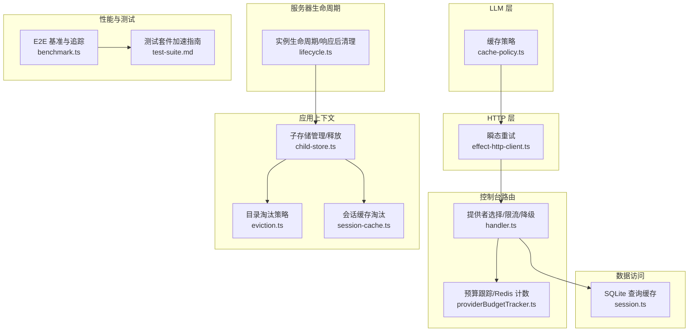

图表来源
- [packages/llm/src/cache-policy.ts:1-112](file://packages/llm/src/cache-policy.ts#L1-L112)
- [packages/opencode/src/util/effect-http-client.ts:1-12](file://packages/opencode/src/util/effect-http-client.ts#L1-L12)
- [packages/console/app/src/routes/zen/util/handler.ts:602-630](file://packages/console/app/src/routes/zen/util/handler.ts#L602-L630)
- [packages/console/app/src/routes/zen/util/providerBudgetTracker.ts:39-87](file://packages/console/app/src/routes/zen/util/providerBudgetTracker.ts#L39-L87)
- [packages/effect-drizzle-sqlite/src/sqlite-core/effect/session.ts:235-270](file://packages/effect-drizzle-sqlite/src/sqlite-core/effect/session.ts#L235-L270)
- [packages/app/src/context/global-sync/eviction.ts:1-28](file://packages/app/src/context/global-sync/eviction.ts#L1-L28)
- [packages/app/src/context/global-sync/child-store.ts:103-150](file://packages/app/src/context/global-sync/child-store.ts#L103-L150)
- [packages/app/src/context/global-sync/session-cache.ts:47-66](file://packages/app/src/context/global-sync/session-cache.ts#L47-L66)
- [packages/opencode/src/server/routes/instance/httpapi/lifecycle.ts:1-54](file://packages/opencode/src/server/routes/instance/httpapi/lifecycle.ts#L1-L54)
- [packages/app/e2e/performance/benchmark.ts:1-144](file://packages/app/e2e/performance/benchmark.ts#L1-L144)
- [perf/test-suite.md:1-146](file://perf/test-suite.md#L1-L146)

章节来源
- [packages/llm/src/cache-policy.ts:1-112](file://packages/llm/src/cache-policy.ts#L1-L112)
- [packages/opencode/src/util/effect-http-client.ts:1-12](file://packages/opencode/src/util/effect-http-client.ts#L1-L12)
- [packages/console/app/src/routes/zen/util/handler.ts:602-630](file://packages/console/app/src/routes/zen/util/handler.ts#L602-L630)
- [packages/console/app/src/routes/zen/util/providerBudgetTracker.ts:39-87](file://packages/console/app/src/routes/zen/util/providerBudgetTracker.ts#L39-L87)
- [packages/effect-drizzle-sqlite/src/sqlite-core/effect/session.ts:235-270](file://packages/effect-drizzle-sqlite/src/sqlite-core/effect/session.ts#L235-L270)
- [packages/app/src/context/global-sync/eviction.ts:1-28](file://packages/app/src/context/global-sync/eviction.ts#L1-L28)
- [packages/app/src/context/global-sync/child-store.ts:103-150](file://packages/app/src/context/global-sync/child-store.ts#L103-L150)
- [packages/app/src/context/global-sync/session-cache.ts:47-66](file://packages/app/src/context/global-sync/session-cache.ts#L47-L66)
- [packages/opencode/src/server/routes/instance/httpapi/lifecycle.ts:1-54](file://packages/opencode/src/server/routes/instance/httpapi/lifecycle.ts#L1-L54)
- [packages/app/e2e/performance/benchmark.ts:1-144](file://packages/app/e2e/performance/benchmark.ts#L1-L144)
- [perf/test-suite.md:1-146](file://perf/test-suite.md#L1-L146)

## 核心组件
- LLM 请求缓存策略：在请求构建阶段自动为工具定义、系统消息和最新用户消息注入缓存提示，减少重复计算与网络开销。
- HTTP 瞬态重试：对瞬时错误使用指数退避+抖动重试，提高稳定性。
- 提供者选择与限流：结合权重、预算优先级、TPM/TPS 限制与健康度指标，动态选择提供者并在达到最大重试次数时回退。
- SQLite 查询缓存：根据查询元数据与事务状态决定跳过、失效或尝试从缓存读取，避免重复 IO。
- 目录/会话缓存淘汰：按最近访问时间、TTL 与上限阈值淘汰空闲目录与旧会话，控制内存增长。
- 实例生命周期：响应完成后统一执行实例释放与重载，避免泄漏与竞态。
- 性能基准：Playwright + Chrome Trace 采集页面级指标，输出结构化 JSON 便于回归检测。

章节来源
- [packages/llm/src/cache-policy.ts:1-112](file://packages/llm/src/cache-policy.ts#L1-L112)
- [packages/opencode/src/util/effect-http-client.ts:1-12](file://packages/opencode/src/util/effect-http-client.ts#L1-L12)
- [packages/console/app/src/routes/zen/util/handler.ts:602-630](file://packages/console/app/src/routes/zen/util/handler.ts#L602-L630)
- [packages/console/app/src/routes/zen/util/providerBudgetTracker.ts:39-87](file://packages/console/app/src/routes/zen/util/providerBudgetTracker.ts#L39-L87)
- [packages/effect-drizzle-sqlite/src/sqlite-core/effect/session.ts:235-270](file://packages/effect-drizzle-sqlite/src/sqlite-core/effect/session.ts#L235-L270)
- [packages/app/src/context/global-sync/eviction.ts:1-28](file://packages/app/src/context/global-sync/eviction.ts#L1-L28)
- [packages/app/src/context/global-sync/child-store.ts:103-150](file://packages/app/src/context/global-sync/child-store.ts#L103-L150)
- [packages/app/src/context/global-sync/session-cache.ts:47-66](file://packages/app/src/context/global-sync/session-cache.ts#L47-L66)
- [packages/opencode/src/server/routes/instance/httpapi/lifecycle.ts:1-54](file://packages/opencode/src/server/routes/instance/httpapi/lifecycle.ts#L1-L54)
- [packages/app/e2e/performance/benchmark.ts:1-144](file://packages/app/e2e/performance/benchmark.ts#L1-L144)

## 架构总览
下图展示了从 LLM 请求到提供者选择、数据库访问与缓存、再到资源释放的端到端流程。

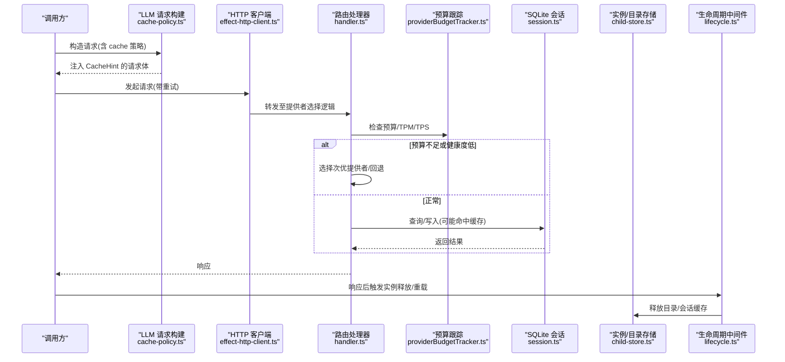

图表来源
- [packages/llm/src/cache-policy.ts:1-112](file://packages/llm/src/cache-policy.ts#L1-L112)
- [packages/opencode/src/util/effect-http-client.ts:1-12](file://packages/opencode/src/util/effect-http-client.ts#L1-L12)
- [packages/console/app/src/routes/zen/util/handler.ts:602-630](file://packages/console/app/src/routes/zen/util/handler.ts#L602-L630)
- [packages/console/app/src/routes/zen/util/providerBudgetTracker.ts:39-87](file://packages/console/app/src/routes/zen/util/providerBudgetTracker.ts#L39-L87)
- [packages/effect-drizzle-sqlite/src/sqlite-core/effect/session.ts:235-270](file://packages/effect-drizzle-sqlite/src/sqlite-core/effect/session.ts#L235-L270)
- [packages/opencode/src/server/routes/instance/httpapi/lifecycle.ts:1-54](file://packages/opencode/src/server/routes/instance/httpapi/lifecycle.ts#L1-L54)
- [packages/app/src/context/global-sync/child-store.ts:103-150](file://packages/app/src/context/global-sync/child-store.ts#L103-L150)

## 详细组件分析

### LLM 请求缓存策略
- 自动策略：默认启用 auto，将缓存断点放置在“最后一个工具定义”“最后一个系统消息”“最新用户消息”，以覆盖多轮 tool-use 的前缀复用。
- 协议适配：仅对支持内联 hint 的协议生效（如 anthropic-messages、bedrock-converse），其他协议跳过以避免无意义标记。
- 手动覆盖：保留用户自定义的 CacheHint，仅在未设置处填充。

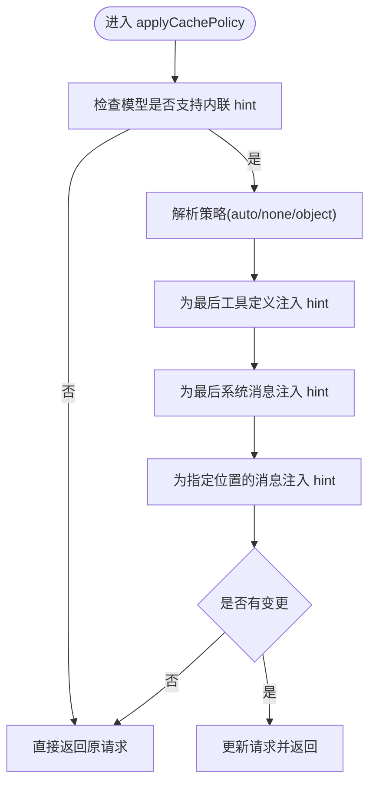

图表来源
- [packages/llm/src/cache-policy.ts:1-112](file://packages/llm/src/cache-policy.ts#L1-L112)

章节来源
- [packages/llm/src/cache-policy.ts:1-112](file://packages/llm/src/cache-policy.ts#L1-L112)

### HTTP 瞬态重试
- 策略：对错误与响应均重试，最多 2 次，采用指数退避（基础 200ms）+ 抖动，降低突发拥塞时的冲突。
- 适用场景：网络抖动、上游瞬时不可用等。

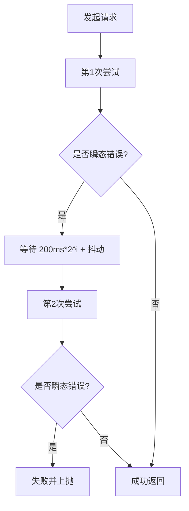

图表来源
- [packages/opencode/src/util/effect-http-client.ts:1-12](file://packages/opencode/src/util/effect-http-client.ts#L1-L12)

章节来源
- [packages/opencode/src/util/effect-http-client.ts:1-12](file://packages/opencode/src/util/effect-http-client.ts#L1-L12)

### 提供者选择、限流与故障转移
- 选择条件：权重非零、未被排除、通过预算优先级校验、满足 TPM 上限、TPS 健康度达标。
- 回退机制：达到最大重试次数后切换到配置的 fallbackProvider。
- 预算跟踪：基于 Redis 统计当前/上一分钟各优先级消耗，计算有效预算余量。

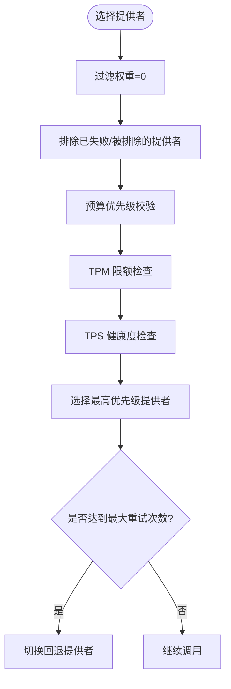

图表来源
- [packages/console/app/src/routes/zen/util/handler.ts:602-630](file://packages/console/app/src/routes/zen/util/handler.ts#L602-L630)
- [packages/console/app/src/routes/zen/util/providerBudgetTracker.ts:39-87](file://packages/console/app/src/routes/zen/util/providerBudgetTracker.ts#L39-L87)

章节来源
- [packages/console/app/src/routes/zen/util/handler.ts:602-630](file://packages/console/app/src/routes/zen/util/handler.ts#L602-L630)
- [packages/console/app/src/routes/zen/util/providerBudgetTracker.ts:39-87](file://packages/console/app/src/routes/zen/util/providerBudgetTracker.ts#L39-L87)

### SQLite 查询缓存与事务短路
- 策略类型：skip（跳过）、invalidate（写后失效）、try（读前尝试命中）。
- 事务短路：在事务内且开启缓存时，直接走映射结果路径，避免额外缓存键计算。
- 写操作失效：写后通知缓存失效表集合，保证一致性。

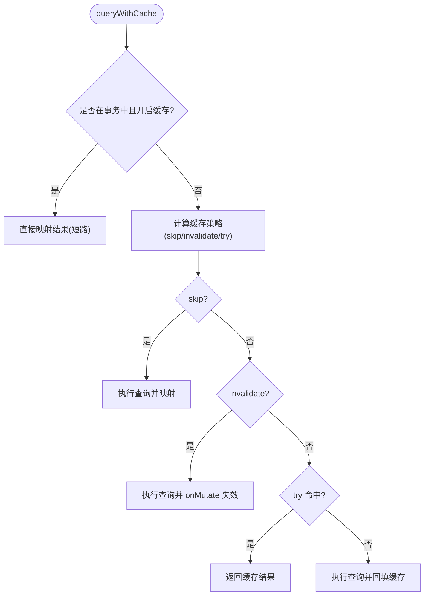

图表来源
- [packages/effect-drizzle-sqlite/src/sqlite-core/effect/session.ts:235-270](file://packages/effect-drizzle-sqlite/src/sqlite-core/effect/session.ts#L235-L270)

章节来源
- [packages/effect-drizzle-sqlite/src/sqlite-core/effect/session.ts:235-270](file://packages/effect-drizzle-sqlite/src/sqlite-core/effect/session.ts#L235-L270)

### 目录/会话缓存淘汰与资源释放
- 目录淘汰：按最近访问时间排序，优先淘汰空闲超过 TTL 的目录；受 pinned 保护与上限 MAX_DIR_STORES 约束。
- 会话缓存：维护 seen 集合，保留 keep/preserve 列表，超出 limit 则淘汰最旧项。
- 释放流程：删除各类缓存引用、调用 disposers、触发 onDispose 回调。

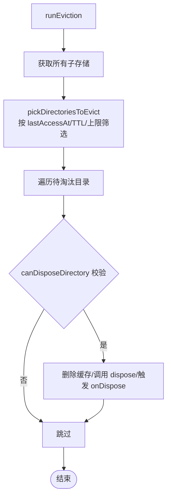

图表来源
- [packages/app/src/context/global-sync/child-store.ts:103-150](file://packages/app/src/context/global-sync/child-store.ts#L103-L150)
- [packages/app/src/context/global-sync/eviction.ts:1-28](file://packages/app/src/context/global-sync/eviction.ts#L1-L28)
- [packages/app/src/context/global-sync/session-cache.ts:47-66](file://packages/app/src/context/global-sync/session-cache.ts#L47-L66)

章节来源
- [packages/app/src/context/global-sync/child-store.ts:103-150](file://packages/app/src/context/global-sync/child-store.ts#L103-L150)
- [packages/app/src/context/global-sync/eviction.ts:1-28](file://packages/app/src/context/global-sync/eviction.ts#L1-L28)
- [packages/app/src/context/global-sync/session-cache.ts:47-66](file://packages/app/src/context/global-sync/session-cache.ts#L47-L66)

### 实例生命周期与响应后清理
- 标记：在处理器中标记需要释放/重载的实例上下文。
- 后置处理：响应发送后，通过 WeakMap 查找标记并执行不可中断的释放/重载流程。
- 异常容错：释放失败记录警告，不影响响应返回。

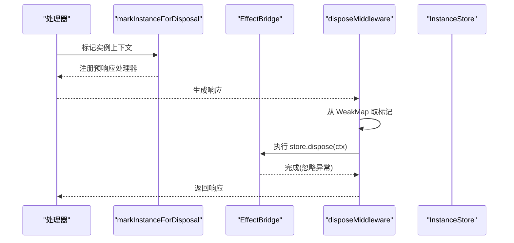

图表来源
- [packages/opencode/src/server/routes/instance/httpapi/lifecycle.ts:1-54](file://packages/opencode/src/server/routes/instance/httpapi/lifecycle.ts#L1-L54)

章节来源
- [packages/opencode/src/server/routes/instance/httpapi/lifecycle.ts:1-54](file://packages/opencode/src/server/routes/instance/httpapi/lifecycle.ts#L1-L54)

### 重试策略与可重试判定
- 退避策略：优先尊重 retry-after-ms/秒/HTTP-date 头，否则回退指数退避，并对超大值做上限保护。
- 可重试判定：识别 too_many_requests、resource_exhausted、特定文本限速信息、ZlibError 等。
- 状态更新：重试过程中更新会话状态（尝试次数、下次时间、消息）。

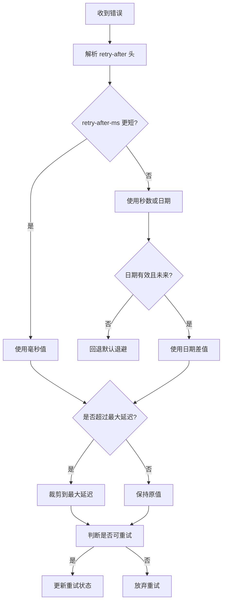

图表来源
- [packages/opencode/test/session/retry.test.ts:31-268](file://packages/opencode/test/session/retry.test.ts#L31-L268)

章节来源
- [packages/opencode/test/session/retry.test.ts:31-268](file://packages/opencode/test/session/retry.test.ts#L31-L268)

### 性能基准与监控
- Playwright 基准：通过 fixture 收集导航历史、Chrome Trace，并以结构化 JSON 输出 BENCHMARK/BENCHMARK_PAGE。
- 指标要求：每个基准必须调用 report() 上报指标，失败时附加导航历史便于定位。
- 隔离与串行：独立浏览器上下文、串行运行避免交叉干扰，生产构建下执行。

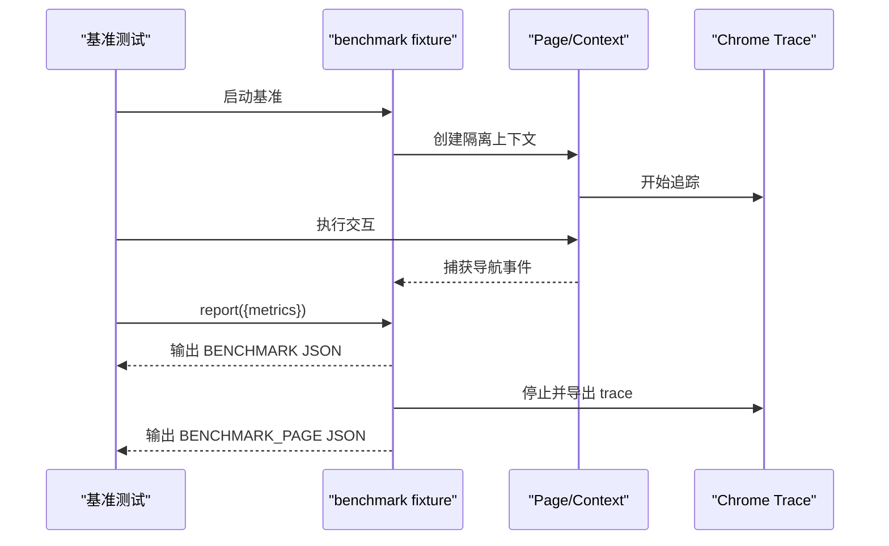

图表来源
- [packages/app/e2e/performance/benchmark.ts:1-144](file://packages/app/e2e/performance/benchmark.ts#L1-L144)

章节来源
- [packages/app/e2e/performance/benchmark.ts:1-144](file://packages/app/e2e/performance/benchmark.ts#L1-L144)

## 依赖关系分析
- LLM 缓存策略与协议耦合：仅对支持内联 hint 的协议生效，避免无效标记。
- HTTP 重试与上层路由：重试发生在客户端层，路由层负责提供者选择与限流。
- 预算跟踪与 Redis：跨实例共享计数，确保全局限流一致性。
- 缓存与事务：SQLite 层在事务内短路，减少缓存键计算与 IO。
- 资源释放与生命周期：响应后统一释放，避免悬挂引用与内存泄漏。

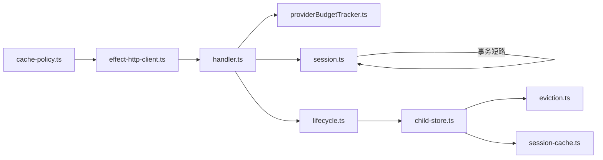

图表来源
- [packages/llm/src/cache-policy.ts:1-112](file://packages/llm/src/cache-policy.ts#L1-L112)
- [packages/opencode/src/util/effect-http-client.ts:1-12](file://packages/opencode/src/util/effect-http-client.ts#L1-L12)
- [packages/console/app/src/routes/zen/util/handler.ts:602-630](file://packages/console/app/src/routes/zen/util/handler.ts#L602-L630)
- [packages/console/app/src/routes/zen/util/providerBudgetTracker.ts:39-87](file://packages/console/app/src/routes/zen/util/providerBudgetTracker.ts#L39-L87)
- [packages/effect-drizzle-sqlite/src/sqlite-core/effect/session.ts:235-270](file://packages/effect-drizzle-sqlite/src/sqlite-core/effect/session.ts#L235-L270)
- [packages/opencode/src/server/routes/instance/httpapi/lifecycle.ts:1-54](file://packages/opencode/src/server/routes/instance/httpapi/lifecycle.ts#L1-L54)
- [packages/app/src/context/global-sync/child-store.ts:103-150](file://packages/app/src/context/global-sync/child-store.ts#L103-L150)
- [packages/app/src/context/global-sync/eviction.ts:1-28](file://packages/app/src/context/global-sync/eviction.ts#L1-L28)
- [packages/app/src/context/global-sync/session-cache.ts:47-66](file://packages/app/src/context/global-sync/session-cache.ts#L47-L66)

## 性能考量
- 连接池与请求合并
  - HTTP 层：使用 Effect 的 HttpClient 并叠加瞬态重试，避免频繁重连与雪崩。
  - 数据库层：SQLite 查询缓存与事务短路减少 IO 与锁竞争。
  - 建议：在高并发场景下评估连接池大小与超时，结合 TPS/TPM 限制平滑流量。
- 缓存策略
  - LLM：启用 auto 策略，利用工具/系统/最新用户消息的缓存断点，显著降低重复成本。
  - 数据库：合理配置 try/invalidate/skip 策略，避免热写导致频繁失效。
  - 应用：目录与会话缓存按 TTL 与上限淘汰，防止内存膨胀。
- 内存与 GC
  - 及时释放：通过 canDisposeDirectory 与 disposeDirectory 确保无用对象回收。
  - 避免长生命周期引用：WeakMap/WeakSet 用于请求间传递标记，避免循环引用。
  - 建议：定期运行基准，观察堆快照与 GC 频率，调整 TTL 与上限。
- 并发控制与限流降级
  - 预算跟踪：基于 Redis 的 per-provider/priority 计数，保障全局配额。
  - 健康度：TPS 健康度低时自动降级，避免雪崩。
  - 建议：结合业务峰值与供应商 SLA 调整 tpmLimit/tpsGoal。
- 故障转移
  - 达到最大重试次数后切换 fallbackProvider，保证可用性。
  - 建议：为关键模型配置多提供者与权重，提升弹性。
- 监控与基准
  - 使用 E2E 基准与 Chrome Trace 采集页面级指标，纳入 CI 回归。
  - 建议：新增关键路径探针，避免重复测量，保持观测开销可控。

[本节为通用指导，不直接分析具体文件]

## 故障排查指南
- 重试与退避
  - 检查 retry-after 头解析与最大值裁剪，确认是否因超长值导致长时间阻塞。
  - 查看可重试判定规则，确认错误类型是否被正确识别。
- 限流与预算
  - 核对 Redis 计数键与区间，确认当前/上一分钟用量是否正确累加。
  - 检查 TPM/TPS 阈值与健康度判定，避免误判导致频繁降级。
- 缓存命中率
  - 验证 LLM 缓存策略是否对目标协议生效。
  - 检查 SQLite 缓存策略与事务状态，确认是否命中 try 分支。
- 资源释放
  - 确认 canDisposeDirectory 条件与 pinned/booting/loadingSessions 状态。
  - 检查 dispose 流程是否完整调用 disposers 与 onDispose。
- 基准与回归
  - 确保每个基准都调用 report()，失败时检查导航历史与 trace。
  - 使用 perf/test-suite.md 中的命令定位慢用例与热点。

章节来源
- [packages/opencode/test/session/retry.test.ts:31-268](file://packages/opencode/test/session/retry.test.ts#L31-L268)
- [packages/console/app/src/routes/zen/util/providerBudgetTracker.ts:39-87](file://packages/console/app/src/routes/zen/util/providerBudgetTracker.ts#L39-L87)
- [packages/llm/src/cache-policy.ts:1-112](file://packages/llm/src/cache-policy.ts#L1-L112)
- [packages/effect-drizzle-sqlite/src/sqlite-core/effect/session.ts:235-270](file://packages/effect-drizzle-sqlite/src/sqlite-core/effect/session.ts#L235-L270)
- [packages/app/src/context/global-sync/eviction.ts:1-28](file://packages/app/src/context/global-sync/eviction.ts#L1-L28)
- [packages/app/src/context/global-sync/child-store.ts:103-150](file://packages/app/src/context/global-sync/child-store.ts#L103-L150)
- [packages/app/e2e/performance/benchmark.ts:1-144](file://packages/app/e2e/performance/benchmark.ts#L1-L144)
- [perf/test-suite.md:1-146](file://perf/test-suite.md#L1-L146)

## 结论
通过 LLM 请求缓存、HTTP 瞬态重试、提供者选择与限流、SQLite 查询缓存、目录/会话淘汰与响应后释放，openNovel SDK 在多层面实现了性能与稳定性的平衡。配合 E2E 基准与测试套件加速，可在不同环境下持续优化吞吐、降低延迟与内存占用。建议在生产环境中结合业务特征调整预算、TPM/TPS 阈值与缓存策略，并建立回归基准以保障改进效果。

[本节为总结性内容，不直接分析具体文件]

## 附录
- 测试套件加速命令与指标说明见 perf/test-suite.md。
- E2E 基准使用方式与输出格式见 packages/app/e2e/performance/benchmark.ts。

章节来源
- [perf/test-suite.md:1-146](file://perf/test-suite.md#L1-L146)
- [packages/app/e2e/performance/benchmark.ts:1-144](file://packages/app/e2e/performance/benchmark.ts#L1-L144)