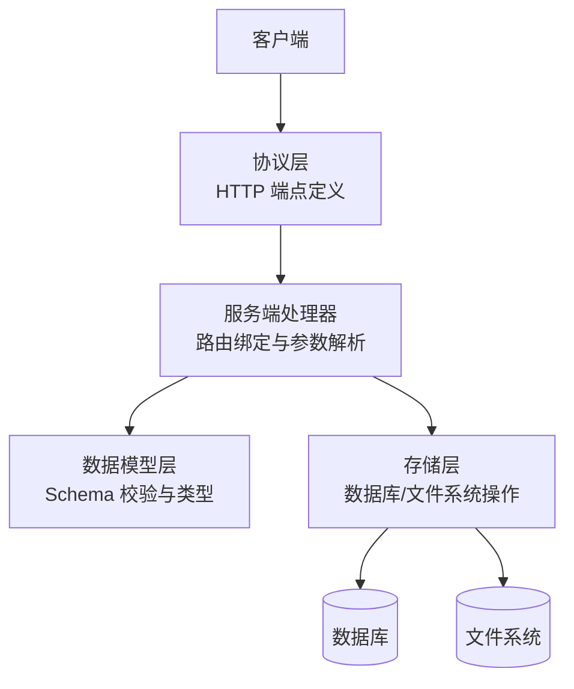
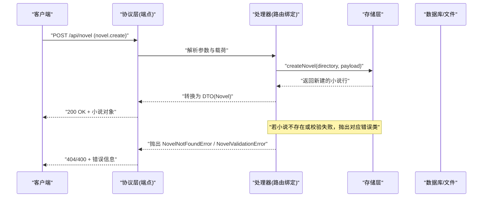
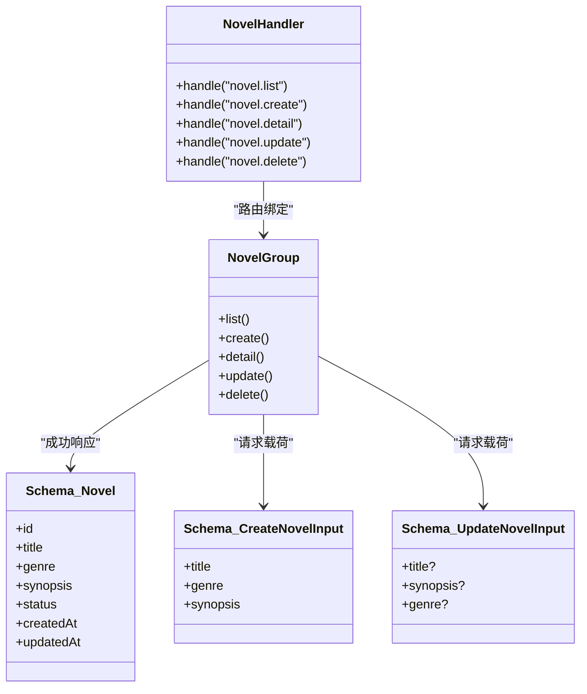

# 小说管理 API

<cite>
**本文引用的文件**   
- [packages/protocol/src/groups/novel.ts](file://packages/protocol/src/groups/novel.ts)
- [packages/schema/src/novel.ts](file://packages/schema/src/novel.ts)
- [packages/server/src/handlers/novel.ts](file://packages/server/src/handlers/novel.ts)
- [packages/server/test/novel.test.ts](file://packages/server/test/novel.test.ts)
- [packages/server/test/novel-e2e.test.ts](file://packages/server/test/novel-e2e.test.ts)
- [packages/app/src/context/novel-queries.ts](file://packages/app/src/context/novel-queries.ts)
- [packages/app/src/pages/novel/wizard.tsx](file://packages/app/src/pages/novel/wizard.tsx)
</cite>

## 目录
1. [简介](#简介)
2. [项目结构](#项目结构)
3. [核心组件](#核心组件)
4. [架构总览](#架构总览)
5. [详细组件分析](#详细组件分析)
6. [依赖关系分析](#依赖关系分析)
7. [性能考虑](#性能考虑)
8. [故障排查指南](#故障排查指南)
9. [结论](#结论)
10. [附录：接口清单与示例](#附录接口清单与示例)

## 简介
本文件为“小说管理”模块的 API 文档，聚焦于小说的 CRUD 操作（创建、读取、更新、删除）以及相关的元数据结构定义、请求/响应格式、错误码处理与异常处理策略。同时提供批量操作的说明与最佳实践建议。

## 项目结构
小说管理相关代码分布在以下三个层次：
- 协议层（API 路由与 OpenAPI 注解）：定义 HTTP 端点、路径参数、查询参数、载荷结构与成功/失败响应类型。
- 数据模型层（Schema）：定义小说及其关联实体的字段、枚举、校验规则。
- 服务端处理器（Handlers）：将 HTTP 请求映射到业务函数，调用存储层并返回 DTO。

图表来源
- [packages/protocol/src/groups/novel.ts:82-113](file://packages/protocol/src/groups/novel.ts#L82-L113)
- [packages/server/src/handlers/novel.ts:1251-1619](file://packages/server/src/handlers/novel.ts#L1251-L1619)
- [packages/schema/src/novel.ts:8-38](file://packages/schema/src/novel.ts#L8-L38)

章节来源
- [packages/protocol/src/groups/novel.ts:82-113](file://packages/protocol/src/groups/novel.ts#L82-L113)
- [packages/server/src/handlers/novel.ts:1251-1619](file://packages/server/src/handlers/novel.ts#L1251-L1619)
- [packages/schema/src/novel.ts:8-38](file://packages/schema/src/novel.ts#L8-L38)

## 核心组件
- 协议组 NovelGroup：集中声明所有小说相关 HTTP 端点，包括列表、详情、创建、更新、删除等，并附带 OpenAPI 注解。
- 数据模型 Schema：定义 Novel、NovelDetail、CreateNovelInput、UpdateNovelInput 等结构体与枚举（如 Genre）。
- 处理器 NovelHandler：将协议端点映射到具体实现函数，负责参数校验、资源存在性检查、调用存储层并返回 DTO。

章节来源
- [packages/protocol/src/groups/novel.ts:82-113](file://packages/protocol/src/groups/novel.ts#L82-L113)
- [packages/schema/src/novel.ts:8-38](file://packages/schema/src/novel.ts#L8-L38)
- [packages/server/src/handlers/novel.ts:1251-1619](file://packages/server/src/handlers/novel.ts#L1251-L1619)

## 架构总览
下图展示了从客户端发起请求到服务端处理的完整流程，以及错误处理路径。

图表来源
- [packages/protocol/src/groups/novel.ts:98-113](file://packages/protocol/src/groups/novel.ts#L98-L113)
- [packages/server/src/handlers/novel.ts:1260-1265](file://packages/server/src/handlers/novel.ts#L1260-L1265)

## 详细组件分析

### 小说元数据结构与校验规则
- 小说基础结构（Novel）
  - id: 字符串
  - title: 字符串
  - genre: 枚举，限定为“玄幻”、“都市”、“仙侠”、“历史”、“科幻”、“悬疑”、“言情”、“游戏”
  - synopsis: 字符串
  - status: 字符串
  - createdAt: 整数时间戳
  - updatedAt: 整数时间戳
- 小说详情（NovelDetail）
  - 包含 Novel 全部字段，并扩展 styleGuide 与 stats（章节数、卷数、角色数、字数统计）
- 创建输入（CreateNovelInput）
  - title: 必填字符串
  - genre: 必填枚举
  - synopsis: 必填字符串
- 更新输入（UpdateNovelInput）
  - title: 可选字符串
  - synopsis: 可选字符串
  - genre: 可选枚举

章节来源
- [packages/schema/src/novel.ts:8-38](file://packages/schema/src/novel.ts#L8-L38)
- [packages/schema/src/novel.ts:338-373](file://packages/schema/src/novel.ts#L338-L373)

### 小说 CRUD 接口定义与行为

#### 列表小说
- 方法：GET
- 路径：/api/novel
- 描述：列出所有小说及其统计信息
- 成功响应：数组，元素类型为 Novel
- 错误响应：NovelValidationError（400）

章节来源
- [packages/protocol/src/groups/novel.ts:84-97](file://packages/protocol/src/groups/novel.ts#L84-L97)

#### 创建小说
- 方法：POST
- 路径：/api/novel
- 描述：创建新小说，包含标题、题材与简介
- 请求载荷：CreateNovelInput
- 成功响应：Novel
- 错误响应：NovelValidationError（400）

章节来源
- [packages/protocol/src/groups/novel.ts:98-113](file://packages/protocol/src/groups/novel.ts#L98-L113)

#### 获取小说详情
- 方法：GET
- 路径：/api/novel/:novelID
- 描述：获取小说详情，包含风格指南与统计
- 成功响应：NovelDetail
- 错误响应：NovelNotFoundError（404）

章节来源
- [packages/protocol/src/groups/novel.ts:131-145](file://packages/protocol/src/groups/novel.ts#L131-L145)

#### 更新小说
- 方法：PUT
- 路径：/api/novel/:novelID
- 描述：更新小说基本信息（标题、简介、题材）
- 请求载荷：UpdateNovelInput
- 成功响应：Novel
- 错误响应：NovelNotFoundError（404）

章节来源
- [packages/protocol/src/groups/novel.ts:685-694](file://packages/protocol/src/groups/novel.ts#L685-L694)

#### 删除小说
- 方法：DELETE
- 路径：/api/novel/:novelID
- 描述：删除指定小说
- 成功响应：{ deleted: boolean }
- 错误响应：NovelNotFoundError（404）

章节来源
- [packages/protocol/src/groups/novel.ts:696-704](file://packages/protocol/src/groups/novel.ts#L696-L704)

### 处理器实现要点
- 更新与删除处理器在执行前会校验小说是否存在，不存在则抛出 NovelNotFoundError。
- 更新处理器调用存储层进行持久化，并将结果转换为 DTO。
- 删除处理器调用存储层删除后返回 { deleted: true }。

章节来源
- [packages/server/src/handlers/novel.ts:1053-1071](file://packages/server/src/handlers/novel.ts#L1053-L1071)

### 前端使用示例（参考）
- 更新小说：通过 useUpdateNovel mutation 调用 server.novel.update，传入 novelID 与可选字段。
- 删除小说：通过 useDeleteNovel mutation 调用 server.novel.delete，传入 novelID 与 directory。
- 创建小说：在向导页面中提交 genre、title、synopsis，成功后跳转到小说详情页。

章节来源
- [packages/app/src/context/novel-queries.ts:839-880](file://packages/app/src/context/novel-queries.ts#L839-L880)
- [packages/app/src/pages/novel/wizard.tsx:55-78](file://packages/app/src/pages/novel/wizard.tsx#L55-L78)

## 依赖关系分析
- 协议层依赖 Schema 定义的数据类型，用于载荷与响应的校验。
- 处理器依赖协议层定义的错误类（NovelNotFoundError、ChapterNotFoundError、NovelValidationError），并在业务逻辑中抛出。
- 处理器依赖存储层提供的函数（如 storeUpdateNovel、storeDeleteNovel）完成实际数据操作。

图表来源
- [packages/protocol/src/groups/novel.ts:82-113](file://packages/protocol/src/groups/novel.ts#L82-L113)
- [packages/schema/src/novel.ts:8-38](file://packages/schema/src/novel.ts#L8-L38)
- [packages/schema/src/novel.ts:338-373](file://packages/schema/src/novel.ts#L338-L373)
- [packages/server/src/handlers/novel.ts:1251-1619](file://packages/server/src/handlers/novel.ts#L1251-L1619)

章节来源
- [packages/protocol/src/groups/novel.ts:82-113](file://packages/protocol/src/groups/novel.ts#L82-L113)
- [packages/server/src/handlers/novel.ts:1251-1619](file://packages/server/src/handlers/novel.ts#L1251-L1619)

## 性能考虑
- 列表接口返回轻量 DTO（Novel），不包含大字段（如内容），有利于减少传输体积。
- 详情接口按需返回 styleGuide 与 stats，避免不必要的计算开销。
- 更新与删除操作先做存在性校验，减少无效 I/O。
- 建议在客户端对列表进行分页或增量更新（当前协议未提供分页参数，可在上层封装）。

## 故障排查指南
- 常见错误类与状态码：
  - NovelNotFoundError：404，表示小说不存在
  - ChapterNotFoundError：404，表示章节不存在
  - NovelValidationError：400，表示输入校验失败（如题材不在允许集合）
- 测试用例覆盖：
  - 正常路径：创建→列表→详情→章节→审批→最终状态
  - 404 路径：未知小说 ID、未知章节 ID、不匹配的小说 ID
  - 400 路径：非法题材导致校验失败

章节来源
- [packages/protocol/src/groups/novel.ts:54-80](file://packages/protocol/src/groups/novel.ts#L54-L80)
- [packages/server/test/novel.test.ts:166-197](file://packages/server/test/novel.test.ts#L166-L197)
- [packages/server/test/novel-e2e.test.ts:91-118](file://packages/server/test/novel-e2e.test.ts#L91-L118)

## 结论
小说管理 API 以清晰的协议层、严格的数据模型校验与稳健的错误处理为核心，提供了完整的 CRUD 能力。通过处理器与存储层的解耦，便于扩展与维护。对于批量操作，当前协议未提供专用批量接口，推荐在客户端或服务端封装组合调用，以满足批量需求。

## 附录：接口清单与示例

### 接口清单（小说 CRUD）
- GET /api/novel
  - 描述：列出所有小说
  - 成功响应：Array<Novel>
  - 错误：NovelValidationError（400）
- POST /api/novel
  - 描述：创建小说
  - 请求载荷：CreateNovelInput
  - 成功响应：Novel
  - 错误：NovelValidationError（400）
- GET /api/novel/:novelID
  - 描述：获取小说详情
  - 成功响应：NovelDetail
  - 错误：NovelNotFoundError（404）
- PUT /api/novel/:novelID
  - 描述：更新小说
  - 请求载荷：UpdateNovelInput
  - 成功响应：Novel
  - 错误：NovelNotFoundError（404）
- DELETE /api/novel/:novelID
  - 描述：删除小说
  - 成功响应：{ deleted: boolean }
  - 错误：NovelNotFoundError（404）

章节来源
- [packages/protocol/src/groups/novel.ts:84-113](file://packages/protocol/src/groups/novel.ts#L84-L113)
- [packages/protocol/src/groups/novel.ts:131-145](file://packages/protocol/src/groups/novel.ts#L131-L145)
- [packages/protocol/src/groups/novel.ts:685-704](file://packages/protocol/src/groups/novel.ts#L685-L704)

### 请求/响应示例（JSON）
- 创建小说
  - 请求体：{ "title": "示例小说", "genre": "都市", "synopsis": "城市故事简介" }
  - 响应体：{ "id": "...", "title": "示例小说", "genre": "都市", "synopsis": "城市故事简介", "status": "draft", "createdAt": 1710000000, "updatedAt": 1710000000 }
- 更新小说
  - 请求体：{ "title": "更新后的标题", "synopsis": "更新的简介" }
  - 响应体：同 Novel
- 删除小说
  - 响应体：{ "deleted": true }

章节来源
- [packages/schema/src/novel.ts:338-373](file://packages/schema/src/novel.ts#L338-L373)
- [packages/server/test/novel-e2e.test.ts:106-118](file://packages/server/test/novel-e2e.test.ts#L106-L118)

### 批量操作说明
- 当前协议未提供专门的批量接口。可通过多次调用单个接口或在服务端封装组合调用实现批量效果。
- 建议：
  - 客户端侧并发控制与重试机制
  - 服务端侧事务与幂等设计（如需）
  - 统一错误聚合与部分成功反馈

章节来源
- [packages/protocol/src/groups/novel.ts:82-113](file://packages/protocol/src/groups/novel.ts#L82-L113)