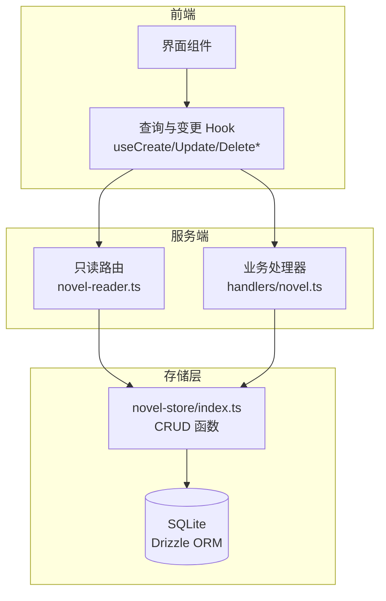
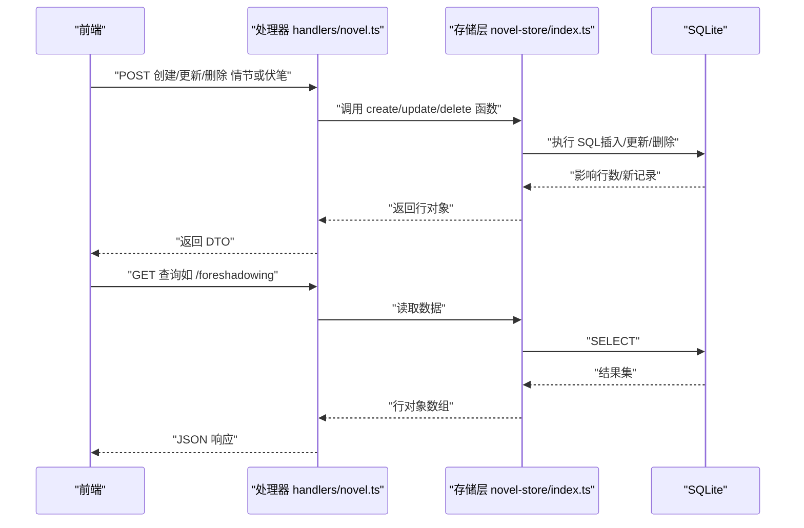
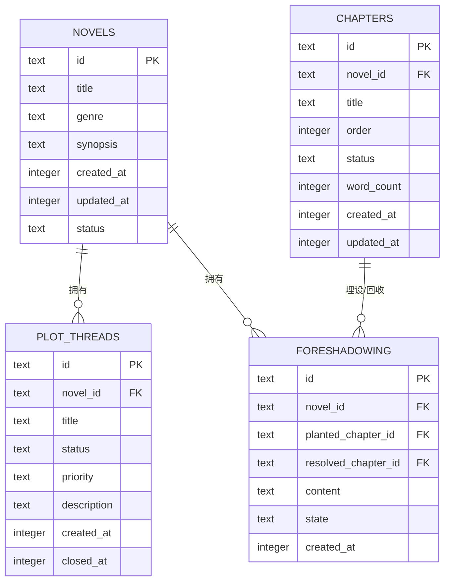
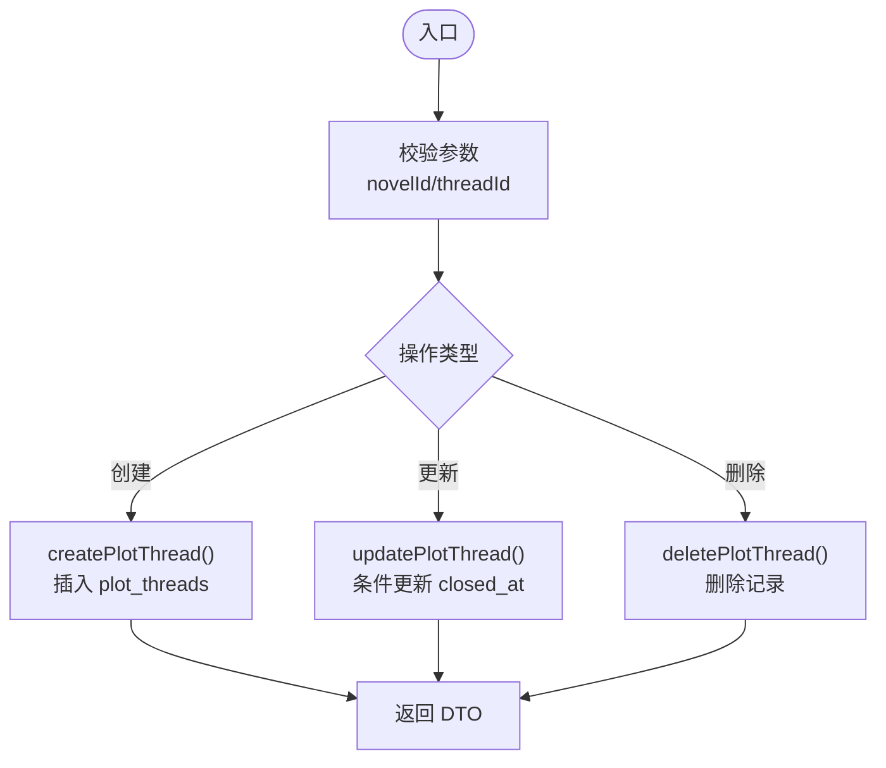
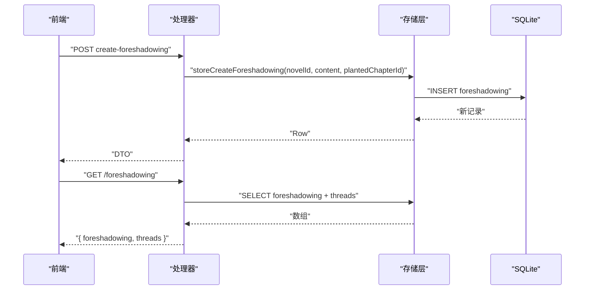
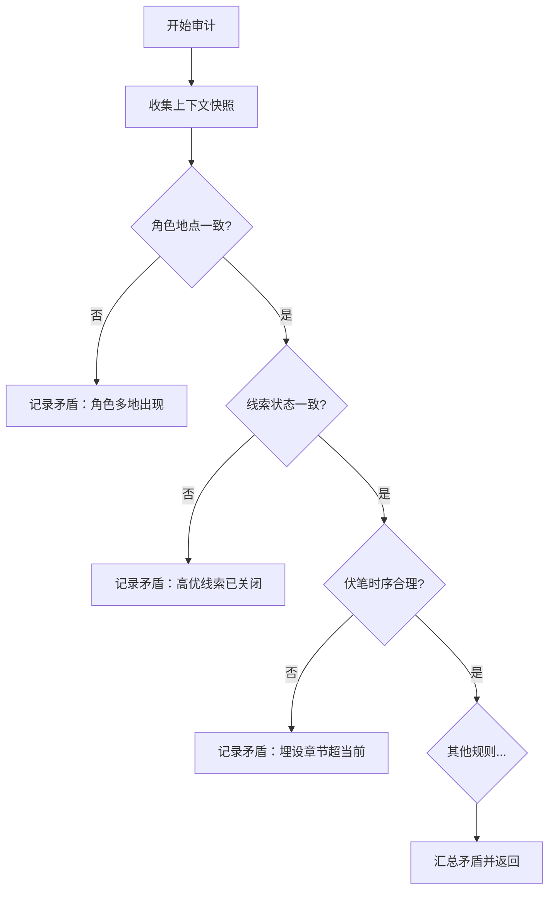
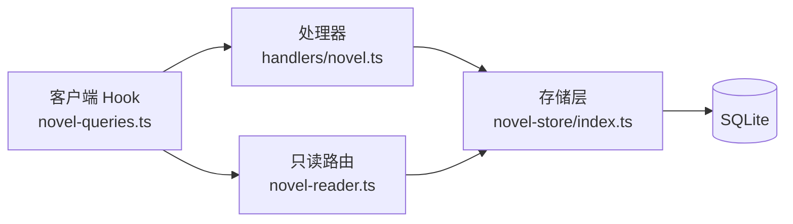

# 情节追踪 API

<cite>
**本文引用的文件**   
- [packages/core/src/session/sql.ts](file://packages/core/src/session/sql.ts)
- [packages/novel-store/src/index.ts](file://packages/novel-store/src/index.ts)
- [packages/server/src/handlers/novel.ts](file://packages/server/src/handlers/novel.ts)
- [packages/opencode/src/server/routes/instance/httpapi/novel-reader.ts](file://packages/opencode/src/server/routes/instance/httpapi/novel-reader.ts)
- [packages/app/src/context/novel-queries.ts](file://packages/app/src/context/novel-queries.ts)
- [packages/schema/src/novel.ts](file://packages/schema/src/novel.ts)
- [packages/plugin/test/novel-writer/scale.test.ts](file://packages/plugin/test/novel-writer/scale.test.ts)
</cite>

## 目录
1. [简介](#简介)
2. [项目结构](#项目结构)
3. [核心组件](#核心组件)
4. [架构总览](#架构总览)
5. [详细组件分析](#详细组件分析)
6. [依赖关系分析](#依赖关系分析)
7. [性能考量](#性能考量)
8. [故障排查指南](#故障排查指南)
9. [结论](#结论)
10. [附录](#附录)

## 简介
本文件为“情节追踪”功能的 API 文档，覆盖以下能力：
- 情节线索（Plot Thread）的创建、编辑与删除
- 伏笔（Foreshadowing）的埋设、推进与回收
- 情节状态跟踪与进度监控接口设计
- 情节冲突检测与一致性检查（审计）
- 情节热力图与统计分析查询方法
- 可视化展示与数据导出

该功能基于 SQLite 存储（Drizzle ORM），通过服务端处理器暴露 HTTP API，前端通过客户端 SDK/查询 Hook 调用。

## 项目结构
- 数据模型与表定义：位于 core/session/sql.ts 与 novel-store/index.ts
- 存储层函数（CRUD）：novel-store/index.ts
- 服务端处理器与 DTO 映射：server/handlers/novel.ts
- 只读路由（Reader）：opencode/server/routes/.../novel-reader.ts
- 前端查询与变更 Hook：app/src/context/novel-queries.ts
- 类型与 Schema：schema/src/novel.ts
- 矛盾检测示例（审计）：plugin/test/novel-writer/scale.test.ts

图表来源
- [packages/opencode/src/server/routes/instance/httpapi/novel-reader.ts:1-189](file://packages/opencode/src/server/routes/instance/httpapi/novel-reader.ts#L1-L189)
- [packages/server/src/handlers/novel.ts:1-200](file://packages/server/src/handlers/novel.ts#L1-L200)
- [packages/novel-store/src/index.ts:1-200](file://packages/novel-store/src/index.ts#L1-L200)

章节来源
- [packages/core/src/session/sql.ts:336-373](file://packages/core/src/session/sql.ts#L336-L373)
- [packages/novel-store/src/index.ts:135-158](file://packages/novel-store/src/index.ts#L135-L158)
- [packages/opencode/src/server/routes/instance/httpapi/novel-reader.ts:148-158](file://packages/opencode/src/server/routes/instance/httpapi/novel-reader.ts#L148-L158)
- [packages/server/src/handlers/novel.ts:172-195](file://packages/server/src/handlers/novel.ts#L172-L195)

## 核心组件
- 数据表
  - 剧情线索表 plot_threads：id, novel_id, title, status, priority, description, created_at, closed_at
  - 伏笔表 foreshadowing：id, novel_id, planted_chapter_id, resolved_chapter_id, content, state, created_at
- 存储层函数
  - createPlotThread / updatePlotThread / deletePlotThread
  - createForeshadowing / updateForeshadowing / deleteForeshadowing
- 服务端处理器
  - 将请求参数校验并调用存储层，返回 DTO
- 只读路由
  - GET /api/novels/:novelId/foreshadowing：返回伏笔与情节线索列表
- 前端 Hook
  - useCreateForeshadowing / useUpdateForeshadowing / useDeleteForeshadowing
  - useDeletePlotThread（以及对应的创建/更新 Hook 在客户端生成器中声明）

章节来源
- [packages/core/src/session/sql.ts:336-373](file://packages/core/src/session/sql.ts#L336-L373)
- [packages/novel-store/src/index.ts:822-868](file://packages/novel-store/src/index.ts#L822-L868)
- [packages/server/src/handlers/novel.ts:1180-1215](file://packages/server/src/handlers/novel.ts#L1180-L1215)
- [packages/opencode/src/server/routes/instance/httpapi/novel-reader.ts:148-158](file://packages/opencode/src/server/routes/instance/httpapi/novel-reader.ts#L148-L158)
- [packages/app/src/context/novel-queries.ts:1068-1156](file://packages/app/src/context/novel-queries.ts#L1068-L1156)

## 架构总览
下图展示了从前端到数据库的完整调用链路，包括读写分离（Reader 只读、Handler 写入）。

图表来源
- [packages/server/src/handlers/novel.ts:1180-1215](file://packages/server/src/handlers/novel.ts#L1180-L1215)
- [packages/novel-store/src/index.ts:822-868](file://packages/novel-store/src/index.ts#L822-L868)
- [packages/opencode/src/server/routes/instance/httpapi/novel-reader.ts:148-158](file://packages/opencode/src/server/routes/instance/httpapi/novel-reader.ts#L148-L158)

## 详细组件分析

### 数据模型与关系
- 剧情线索（PlotThread）
  - 字段：id, novelId, title, status, priority, description, createdAt, closedAt
  - 状态：open/closed（关闭时自动记录 closedAt）
  - 优先级：low/medium/high（示例）
- 伏笔（Foreshadowing）
  - 字段：id, novelId, plantedChapterId, resolvedChapterId, content, state, createdAt
  - 状态：planted/hinted/resolved/abandoned（示例）
- 关联
  - novelId 外键关联小说
  - planted/resolved chapter 可选关联章节

图表来源
- [packages/core/src/session/sql.ts:336-373](file://packages/core/src/session/sql.ts#L336-L373)
- [packages/novel-store/src/index.ts:135-158](file://packages/novel-store/src/index.ts#L135-L158)

章节来源
- [packages/schema/src/novel.ts:154-175](file://packages/schema/src/novel.ts#L154-L175)
- [packages/core/src/session/sql.ts:336-373](file://packages/core/src/session/sql.ts#L336-L373)

### 情节线索（Plot Thread）API
- 创建
  - 输入：novelId, title, priority?, description?
  - 行为：默认 status=open，自动生成 id 与时间戳
  - 输出：PlotThread DTO
- 更新
  - 输入：threadId, fields{title?, status?, priority?, description?}
  - 行为：若 status=closed，设置 closedAt；否则清空
  - 输出：更新后的 PlotThread
- 删除
  - 输入：threadId
  - 行为：物理删除
- 查询（只读）
  - GET /api/novels/:novelId/foreshadowing 会一并返回 threads 列表

图表来源
- [packages/novel-store/src/index.ts:822-868](file://packages/novel-store/src/index.ts#L822-L868)
- [packages/server/src/handlers/novel.ts:172-195](file://packages/server/src/handlers/novel.ts#L172-L195)

章节来源
- [packages/novel-store/src/index.ts:822-868](file://packages/novel-store/src/index.ts#L822-L868)
- [packages/server/src/handlers/novel.ts:172-195](file://packages/server/src/handlers/novel.ts#L172-L195)

### 伏笔（Foreshadowing）API
- 创建
  - 输入：novelId, content, plantedChapterId?
  - 行为：默认 state=planted，记录 created_at
- 更新
  - 输入：entryId, fields{content?, state?, resolvedChapterId?}
  - 行为：state 可推进至 hinted/resolved/abandoned
- 删除
  - 输入：entryId
- 查询（只读）
  - GET /api/novels/:novelId/foreshadowing 返回 { foreshadowing, threads }

图表来源
- [packages/server/src/handlers/novel.ts:1180-1215](file://packages/server/src/handlers/novel.ts#L1180-L1215)
- [packages/opencode/src/server/routes/instance/httpapi/novel-reader.ts:148-158](file://packages/opencode/src/server/routes/instance/httpapi/novel-reader.ts#L148-L158)

章节来源
- [packages/server/src/handlers/novel.ts:1180-1215](file://packages/server/src/handlers/novel.ts#L1180-L1215)
- [packages/opencode/src/server/routes/instance/httpapi/novel-reader.ts:148-158](file://packages/opencode/src/server/routes/instance/httpapi/novel-reader.ts#L148-L158)

### 状态跟踪与进度监控
- 状态字段
  - 情节线索：status(open/closed)，closedAt 记录关闭时间
  - 伏笔：state(planted/hinted/resolved/abandoned)
- 进度指标建议
  - 线索完成率 = closed / total
  - 伏笔回收率 = resolved / (resolved + abandoned + planted + hinted)
  - 按章节统计埋设/回收数量，形成时间线
- 实现要点
  - 使用状态字段与时间戳计算进度
  - 结合章节顺序（order）绘制时间线

章节来源
- [packages/core/src/session/sql.ts:336-373](file://packages/core/src/session/sql.ts#L336-L373)
- [packages/novel-store/src/index.ts:135-158](file://packages/novel-store/src/index.ts#L135-L158)

### 冲突检测与一致性检查（审计）
- 常见矛盾模式
  - 角色同时出现在不同地点
  - 高优先级线索已关闭但优先级仍为 high
  - 伏笔埋设章节序号大于当前章节序号
  - 角色数量与章节规模不匹配
- 审计流程
  - 收集上下文快照（活跃角色、线索、伏笔等）
  - 规则引擎逐项检查并汇总矛盾
  - 返回检测结果与详情

图表来源
- [packages/plugin/test/novel-writer/scale.test.ts:384-406](file://packages/plugin/test/novel-writer/scale.test.ts#L384-L406)

章节来源
- [packages/plugin/test/novel-writer/scale.test.ts:384-406](file://packages/plugin/test/novel-writer/scale.test.ts#L384-L406)

### 情节热力图与统计分析
- 可用维度
  - 按章节统计伏笔埋设/回收密度
  - 按章节统计线索开启/关闭事件
  - 张力点（TensionPoint）与钩子轮换（HookRotation）辅助热度
- 查询建议
  - 聚合查询：COUNT 埋设/回收 per chapter
  - 时间序列：按 created_at/order 排序
  - 联动：结合 tension_log 与 hook_rotation 表做综合热度

章节来源
- [packages/novel-store/src/index.ts:217-242](file://packages/novel-store/src/index.ts#L217-L242)
- [packages/schema/src/novel.ts:197-213](file://packages/schema/src/novel.ts#L197-L213)

### 可视化展示与数据导出
- 可视化
  - 前端面板渲染伏笔与线索列表，支持按状态排序与筛选
  - 时间轴视图：以章节顺序展示埋设/回收事件
- 导出
  - 导出 JSON/CSV：包含 plot_threads 与 foreshadowing 全量数据
  - 导出大纲：outlines 目录下 .md 文件批量读取

章节来源
- [packages/app/src/pages/novel/panel-foreshadow.tsx:42-165](file://packages/app/src/pages/novel/panel-foreshadow.tsx#L42-L165)
- [packages/opencode/src/server/routes/instance/httpapi/novel-reader.ts:174-186](file://packages/opencode/src/server/routes/instance/httpapi/novel-reader.ts#L174-L186)

## 依赖关系分析
- 处理器依赖存储层函数进行 CRUD
- 只读路由直接访问表定义进行查询
- 前端 Hook 通过客户端生成的端点调用服务

图表来源
- [packages/app/src/context/novel-queries.ts:1068-1156](file://packages/app/src/context/novel-queries.ts#L1068-L1156)
- [packages/server/src/handlers/novel.ts:1-200](file://packages/server/src/handlers/novel.ts#L1-L200)
- [packages/opencode/src/server/routes/instance/httpapi/novel-reader.ts:1-189](file://packages/opencode/src/server/routes/instance/httpapi/novel-reader.ts#L1-L189)
- [packages/novel-store/src/index.ts:1-200](file://packages/novel-store/src/index.ts#L1-L200)

章节来源
- [packages/app/src/context/novel-queries.ts:1068-1156](file://packages/app/src/context/novel-queries.ts#L1068-L1156)
- [packages/server/src/handlers/novel.ts:1-200](file://packages/server/src/handlers/novel.ts#L1-L200)
- [packages/opencode/src/server/routes/instance/httpapi/novel-reader.ts:1-189](file://packages/opencode/src/server/routes/instance/httpapi/novel-reader.ts#L1-L189)
- [packages/novel-store/src/index.ts:1-200](file://packages/novel-store/src/index.ts#L1-L200)

## 性能考量
- 索引优化
  - plot_threads.novel_id, plot_threads.status
  - foreshadowing.novel_id, foreshadowing.state
  - hook_rotation.novel_id, hook_rotation.created_at
- 查询策略
  - 分页与过滤：按 novel_id 过滤，必要时加 order/status/state 过滤
  - 只读路由使用 fresh DB 连接避免缓存不一致
- 写入路径
  - 更新时仅更新必要字段，减少锁竞争
  - closedAt 仅在状态切换时写入

章节来源
- [packages/core/src/session/sql.ts:336-373](file://packages/core/src/session/sql.ts#L336-L373)
- [packages/novel-store/src/index.ts:217-242](file://packages/novel-store/src/index.ts#L217-L242)
- [packages/opencode/src/server/routes/instance/httpapi/novel-reader.ts:1-189](file://packages/opencode/src/server/routes/instance/httpapi/novel-reader.ts#L1-L189)

## 故障排查指南
- 常见问题
  - 缺少 novelId 导致 404
  - 未找到目标记录（chapter/thread/entry）
  - 状态值非法（如非预期 state/status）
- 定位步骤
  - 检查请求参数是否齐全
  - 查看处理器错误分支与返回值
  - 核对数据库表结构与索引
- 调试建议
  - 启用日志打印关键变量（novelId, threadId, entryId）
  - 使用只读路由验证数据可见性

章节来源
- [packages/opencode/src/server/routes/instance/httpapi/novel-reader.ts:43-56](file://packages/opencode/src/server/routes/instance/httpapi/novel-reader.ts#L43-L56)
- [packages/server/src/handlers/novel.ts:1180-1215](file://packages/server/src/handlers/novel.ts#L1180-L1215)

## 结论
情节追踪 API 围绕 plot_threads 与 foreshadowing 两大核心实体构建，提供完整的 CRUD 与只读查询能力。通过状态字段与时间戳可实现进度监控与热力统计，配合审计规则可进行一致性检查。前端通过 Hook 高效管理状态与交互，后端通过处理器与存储层解耦，保证可扩展性与可维护性。

## 附录
- 相关 Schema 定义
  - PlotThread、Foreshadowing、TensionPoint、HookRotation 等类型定义
- 前端面板
  - 伏笔面板组件用于增删改查与排序展示

章节来源
- [packages/schema/src/novel.ts:154-213](file://packages/schema/src/novel.ts#L154-L213)
- [packages/app/src/pages/novel/panel-foreshadow.tsx:42-165](file://packages/app/src/pages/novel/panel-foreshadow.tsx#L42-L165)