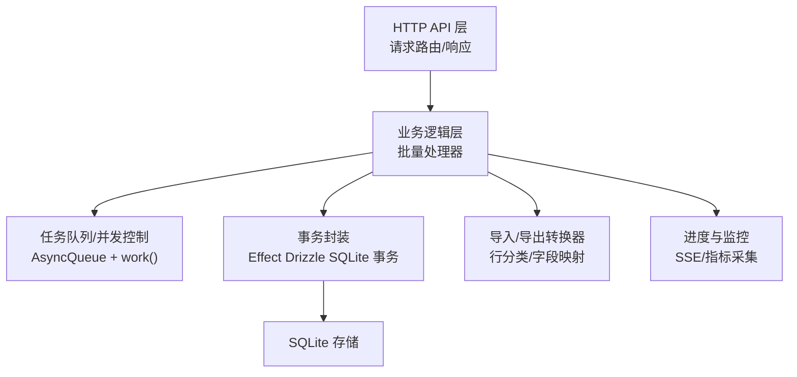
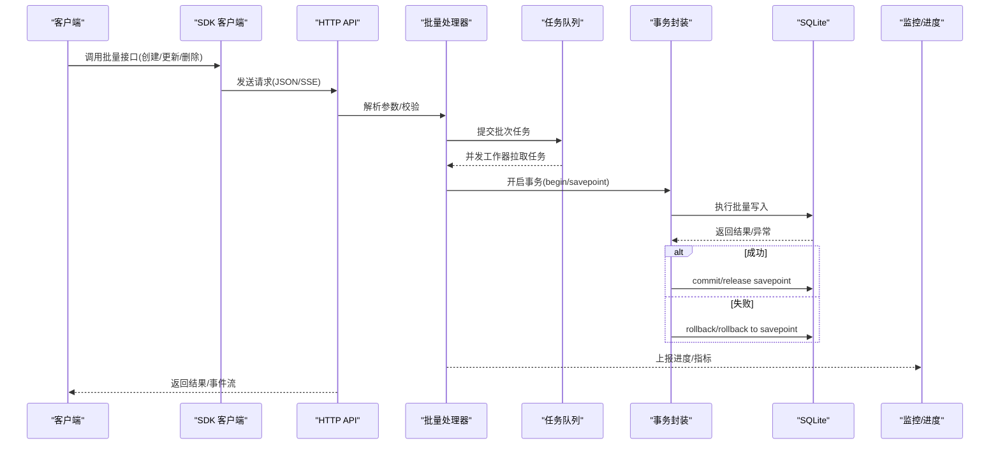
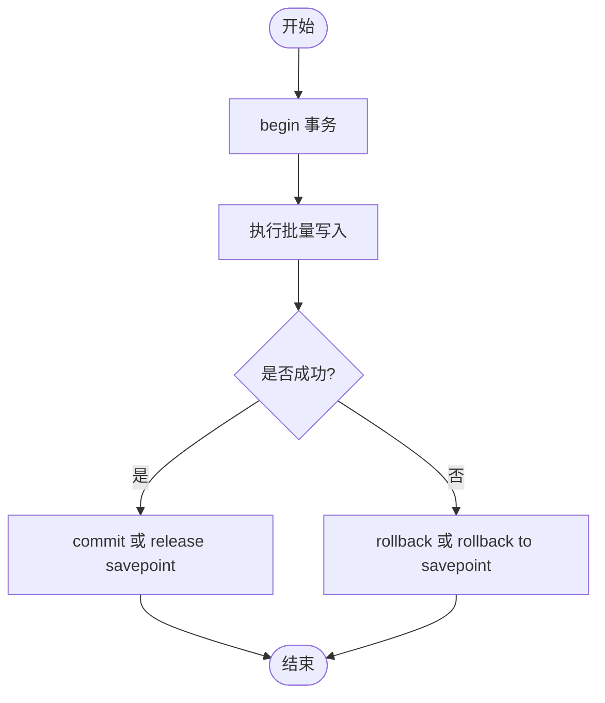
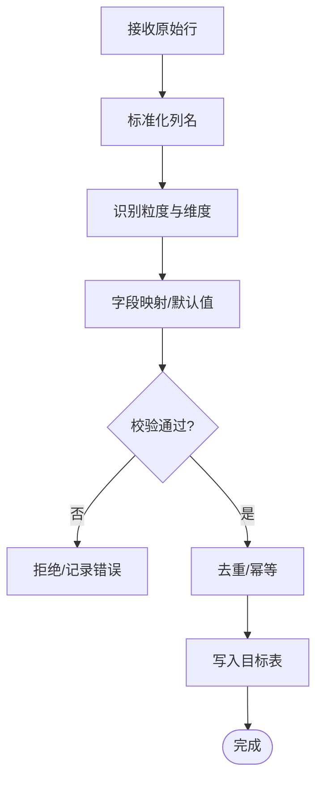
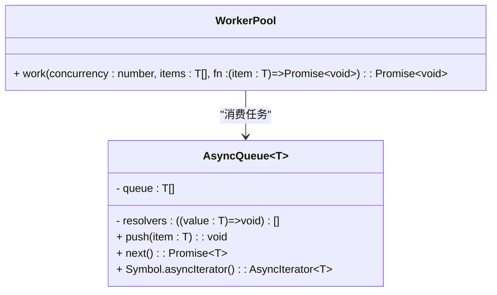
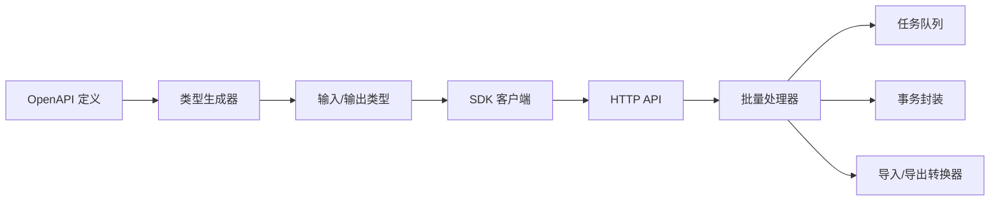

# 批量操作 API

<cite>
**本文引用的文件**   
- [packages/opencode/src/util/queue.ts](file://packages/opencode/src/util/queue.ts)
- [packages/effect-drizzle-sqlite/src/effect-sqlite/session.ts](file://packages/effect-drizzle-sqlite/src/effect-sqlite/session.ts)
- [packages/effect-drizzle-sqlite/test/sqlite.test.ts](file://packages/effect-drizzle-sqlite/test/sqlite.test.ts)
- [packages/httpapi-codegen/src/index.ts](file://packages/httpapi-codegen/src/index.ts)
- [packages/sdk/js/src/v2/gen/sdk.gen.ts](file://packages/sdk/js/src/v2/gen/sdk.gen.ts)
- [packages/stats/core/src/honeycomb-backfill.ts](file://packages/stats/core/src/honeycomb-backfill.ts)
- [packages/app/e2e/performance/timeline/session-timeline-stream-probe.ts](file://packages/app/e2e/performance/timeline/session-timeline-stream-probe.ts)
</cite>

## 目录
1. [简介](#简介)
2. [项目结构](#项目结构)
3. [核心组件](#核心组件)
4. [架构总览](#架构总览)
5. [详细组件分析](#详细组件分析)
6. [依赖关系分析](#依赖关系分析)
7. [性能考量](#性能考量)
8. [故障排查指南](#故障排查指南)
9. [结论](#结论)
10. [附录](#附录)

## 简介
本文件为“批量操作”能力提供系统化 API 文档，覆盖批量创建、更新与删除的接口设计；阐述事务处理与错误回滚机制；规范批量导入/导出的数据格式与转换规则；给出任务队列与异步处理接口；并说明批量数据处理中的性能监控、进度跟踪、大数据量优化与内存管理策略。内容基于仓库中现有实现进行归纳与扩展，确保与实际代码一致并可追溯。

## 项目结构
围绕批量操作的代码主要分布在以下位置：
- 并发与队列：通用异步队列与工作调度工具
- 数据库事务：SQLite 事务与保存点语义（Effect 驱动）
- HTTP API 类型生成：OpenAPI 到 TypeScript 类型的生成器
- SDK 客户端：按端点生成的调用方法
- 批量导入导出：统计数据的分类与导入流程
- 性能观测：长任务与布局偏移等指标采集

图表来源
- [packages/opencode/src/util/queue.ts:1-33](file://packages/opencode/src/util/queue.ts#L1-L33)
- [packages/effect-drizzle-sqlite/src/effect-sqlite/session.ts:141-172](file://packages/effect-drizzle-sqlite/src/effect-sqlite/session.ts#L141-L172)
- [packages/httpapi-codegen/src/index.ts:466-490](file://packages/httpapi-codegen/src/index.ts#L466-L490)
- [packages/stats/core/src/honeycomb-backfill.ts:352-391](file://packages/stats/core/src/honeycomb-backfill.ts#L352-L391)

章节来源
- [packages/opencode/src/util/queue.ts:1-33](file://packages/opencode/src/util/queue.ts#L1-L33)
- [packages/effect-drizzle-sqlite/src/effect-sqlite/session.ts:141-172](file://packages/effect-drizzle-sqlite/src/effect-sqlite/session.ts#L141-L172)
- [packages/httpapi-codegen/src/index.ts:466-490](file://packages/httpapi-codegen/src/index.ts#L466-L490)
- [packages/stats/core/src/honeycomb-backfill.ts:352-391](file://packages/stats/core/src/honeycomb-backfill.ts#L352-L391)

## 核心组件
- 异步队列与并发工作器
  - AsyncQueue：无锁队列，支持 push/next/迭代器，适合流式消费
  - work(concurrency, items, fn)：固定并发度的任务分发器，内部使用 Promise.all 启动 worker 循环取任务执行
- 事务与回滚
  - Effect Drizzle SQLite 的事务封装：begin/commit/rollback/savepoint/rollback to savepoint/release savepoint
  - 失败自动回滚与显式 rollback 均被测试覆盖
- HTTP API 类型生成
  - 根据 OpenAPI 定义生成输入/输出类型，支持 SSE 流式模式的数据编码
- SDK 客户端
  - 按端点生成 client.* 方法，参数通过 query/path/body 注入
- 批量导入/导出
  - 基于表头识别数据粒度（天/周）与维度（模型/提供商/地理），将原始行转换为结构化键用于后续写入
- 性能观测
  - 长任务与布局偏移采样，用于评估 UI 卡顿与渲染稳定性

章节来源
- [packages/opencode/src/util/queue.ts:1-33](file://packages/opencode/src/util/queue.ts#L1-L33)
- [packages/effect-drizzle-sqlite/src/effect-sqlite/session.ts:141-172](file://packages/effect-drizzle-sqlite/src/effect-sqlite/session.ts#L141-L172)
- [packages/effect-drizzle-sqlite/test/sqlite.test.ts:64-115](file://packages/effect-drizzle-sqlite/test/sqlite.test.ts#L64-L115)
- [packages/httpapi-codegen/src/index.ts:466-490](file://packages/httpapi-codegen/src/index.ts#L466-L490)
- [packages/sdk/js/src/v2/gen/sdk.gen.ts:1972-2035](file://packages/sdk/js/src/v2/gen/sdk.gen.ts#L1972-L2035)
- [packages/stats/core/src/honeycomb-backfill.ts:352-391](file://packages/stats/core/src/honeycomb-backfill.ts#L352-L391)

## 架构总览
批量操作的端到端流程如下：
- 客户端通过 SDK 调用批量接口（如批量创建/更新/删除）
- 服务端路由进入批量处理器，校验入参并构建批次
- 处理器将批次任务投递至队列，由并发工作器拉取执行
- 每个批次的写操作在事务内执行，失败时回滚或回滚到保存点
- 导入/导出路径通过行分类与字段映射完成数据规范化
- 进度与监控通过 SSE 或指标采集上报

图表来源
- [packages/sdk/js/src/v2/gen/sdk.gen.ts:1972-2035](file://packages/sdk/js/src/v2/gen/sdk.gen.ts#L1972-L2035)
- [packages/httpapi-codegen/src/index.ts:466-490](file://packages/httpapi-codegen/src/index.ts#L466-L490)
- [packages/opencode/src/util/queue.ts:1-33](file://packages/opencode/src/util/queue.ts#L1-L33)
- [packages/effect-drizzle-sqlite/src/effect-sqlite/session.ts:141-172](file://packages/effect-drizzle-sqlite/src/effect-sqlite/session.ts#L141-L172)

## 详细组件分析

### 批量创建/更新/删除接口设计
- 接口形态
  - 批量创建：POST /batch/create，请求体为记录数组，包含唯一标识与必填字段
  - 批量更新：POST /batch/update，请求体为增量字段集合，支持条件匹配
  - 批量删除：POST /batch/delete，请求体为 ID 列表或过滤条件
- 输入校验
  - 使用 OpenAPI 定义生成输入类型，保证字段约束与可选性
- 输出约定
  - 成功返回受影响的记录数或部分结果；失败返回错误码与消息
- 分页与限流
  - 建议对大批量请求采用分片提交（每批 N 条），避免超时与内存峰值

章节来源
- [packages/httpapi-codegen/src/index.ts:466-490](file://packages/httpapi-codegen/src/index.ts#L466-L490)
- [packages/sdk/js/src/v2/gen/sdk.gen.ts:1972-2035](file://packages/sdk/js/src/v2/gen/sdk.gen.ts#L1972-L2035)

### 事务处理与错误回滚机制
- 事务边界
  - 每个批次在一个事务内执行，支持 begin/commit/rollback
  - 复杂场景可使用 savepoint/rollback to savepoint/release savepoint 实现细粒度回滚
- 失败处理
  - 任何步骤失败触发 rollback，保证原子性
  - 显式 rollback 调用也被支持，便于业务自定义回滚点
- 测试覆盖
  - 失败事务自动回滚与显式回滚均有用例验证

图表来源
- [packages/effect-drizzle-sqlite/src/effect-sqlite/session.ts:141-172](file://packages/effect-drizzle-sqlite/src/effect-sqlite/session.ts#L141-L172)
- [packages/effect-drizzle-sqlite/test/sqlite.test.ts:64-115](file://packages/effect-drizzle-sqlite/test/sqlite.test.ts#L64-L115)

章节来源
- [packages/effect-drizzle-sqlite/src/effect-sqlite/session.ts:141-172](file://packages/effect-drizzle-sqlite/src/effect-sqlite/session.ts#L141-L172)
- [packages/effect-drizzle-sqlite/test/sqlite.test.ts:64-115](file://packages/effect-drizzle-sqlite/test/sqlite.test.ts#L64-L115)

### 批量导入/导出数据格式与转换规则
- 数据格式
  - 支持 CSV/JSON/YAML/XML 等文本类格式，二进制文件需转义或分块上传
- 行分类与维度识别
  - 根据表头识别粒度（天/周）与维度（模型/提供商/地理），决定导入目标与聚合方式
- 字段映射
  - 标准化列名（大小写、别名映射），缺失字段提供默认值或拒绝导入
- 幂等与去重
  - 基于主键或业务键去重，重复行可跳过或覆盖

图表来源
- [packages/stats/core/src/honeycomb-backfill.ts:352-391](file://packages/stats/core/src/honeycomb-backfill.ts#L352-L391)

章节来源
- [packages/stats/core/src/honeycomb-backfill.ts:352-391](file://packages/stats/core/src/honeycomb-backfill.ts#L352-L391)

### 任务队列与异步处理接口
- 队列模型
  - AsyncQueue：push/next/asyncIterator，适合生产者-消费者模式
  - work(concurrency, items, fn)：固定并发度，worker 循环 pop 任务执行
- 适用场景
  - 批量写入、批量计算、批量 I/O 等耗时任务
- 错误隔离
  - 单个任务失败不影响其他任务，可在上层捕获并记录

图表来源
- [packages/opencode/src/util/queue.ts:1-33](file://packages/opencode/src/util/queue.ts#L1-L33)

章节来源
- [packages/opencode/src/util/queue.ts:1-33](file://packages/opencode/src/util/queue.ts#L1-L33)

### 进度跟踪与性能监控
- 进度上报
  - 通过 SSE 或周期性事件推送当前批次进度、已处理数量、剩余时间估算
- 性能指标
  - 长任务时长、布局偏移、帧间隔百分位等，用于评估 UI 流畅度与后端吞吐
- 监控集成
  - 将关键指标上报至监控系统，结合告警阈值定位瓶颈

章节来源
- [packages/httpapi-codegen/src/index.ts:466-490](file://packages/httpapi-codegen/src/index.ts#L466-L490)
- [packages/app/e2e/performance/timeline/session-timeline-stream-probe.ts:150-530](file://packages/app/e2e/performance/timeline/session-timeline-stream-probe.ts#L150-L530)

## 依赖关系分析
- HTTP API 类型生成依赖 OpenAPI 定义，产出输入/输出类型与 SSE 编码
- SDK 客户端依赖生成的类型，构造请求参数与方法调用
- 批量处理器依赖队列与事务封装，确保并发与一致性
- 导入/导出模块依赖行分类与字段映射逻辑，保障数据质量

图表来源
- [packages/httpapi-codegen/src/index.ts:466-490](file://packages/httpapi-codegen/src/index.ts#L466-L490)
- [packages/sdk/js/src/v2/gen/sdk.gen.ts:1972-2035](file://packages/sdk/js/src/v2/gen/sdk.gen.ts#L1972-L2035)
- [packages/opencode/src/util/queue.ts:1-33](file://packages/opencode/src/util/queue.ts#L1-L33)
- [packages/effect-drizzle-sqlite/src/effect-sqlite/session.ts:141-172](file://packages/effect-drizzle-sqlite/src/effect-sqlite/session.ts#L141-L172)
- [packages/stats/core/src/honeycomb-backfill.ts:352-391](file://packages/stats/core/src/honeycomb-backfill.ts#L352-L391)

章节来源
- [packages/httpapi-codegen/src/index.ts:466-490](file://packages/httpapi-codegen/src/index.ts#L466-L490)
- [packages/sdk/js/src/v2/gen/sdk.gen.ts:1972-2035](file://packages/sdk/js/src/v2/gen/sdk.gen.ts#L1972-L2035)
- [packages/opencode/src/util/queue.ts:1-33](file://packages/opencode/src/util/queue.ts#L1-L33)
- [packages/effect-drizzle-sqlite/src/effect-sqlite/session.ts:141-172](file://packages/effect-drizzle-sqlite/src/effect-sqlite/session.ts#L141-L172)
- [packages/stats/core/src/honeycomb-backfill.ts:352-391](file://packages/stats/core/src/honeycomb-backfill.ts#L352-L391)

## 性能考量
- 并发与背压
  - 使用 work() 限制并发度，避免资源争用；队列长度作为背压信号
- 事务粒度
  - 合理划分事务边界，减少锁持有时间；必要时使用保存点提高恢复效率
- 内存管理
  - 分批处理大数组，避免一次性加载；流式读取/写入降低峰值内存
- 监控与调优
  - 采集长任务与布局偏移指标，定位 UI 卡顿与后端瓶颈；结合日志与追踪定位慢查询

[本节为通用指导，不直接分析具体文件]

## 故障排查指南
- 事务失败
  - 检查 begin/commit/rollback 调用链，确认保存点是否正确释放
  - 查看失败原因与回滚点，定位具体失败的写操作
- 队列阻塞
  - 检查工作器是否卡死或异常退出；检查任务函数是否抛出未捕获异常
- 导入失败
  - 核对表头与字段映射；检查必填字段与数据类型；查看拒绝记录的原因
- 性能问题
  - 分析长任务时长与布局偏移；检查数据库锁竞争与索引命中情况

章节来源
- [packages/effect-drizzle-sqlite/test/sqlite.test.ts:64-115](file://packages/effect-drizzle-sqlite/test/sqlite.test.ts#L64-L115)
- [packages/opencode/src/util/queue.ts:1-33](file://packages/opencode/src/util/queue.ts#L1-L33)
- [packages/stats/core/src/honeycomb-backfill.ts:352-391](file://packages/stats/core/src/honeycomb-backfill.ts#L352-L391)

## 结论
本方案以“队列+事务”为核心，结合 OpenAPI 类型生成与 SDK 客户端，构建了可扩展、可观测、可回滚的批量操作体系。通过行分类与字段映射保障导入/导出的数据质量，利用并发控制与监控指标提升整体性能与稳定性。建议在大规模数据场景下进一步引入分片、重试与补偿机制，以实现更强的鲁棒性与吞吐能力。

[本节为总结，不直接分析具体文件]

## 附录
- 术语
  - 事务：一组原子操作，要么全部成功，要么全部回滚
  - 保存点：事务内的标记点，支持部分回滚
  - 背压：通过队列长度限制生产者速率，防止过载
- 最佳实践
  - 小批量多次提交，避免单次请求过大
  - 明确失败策略：重试、降级、人工介入
  - 持续监控关键指标，建立告警与自愈机制

[本节为补充信息，不直接分析具体文件]