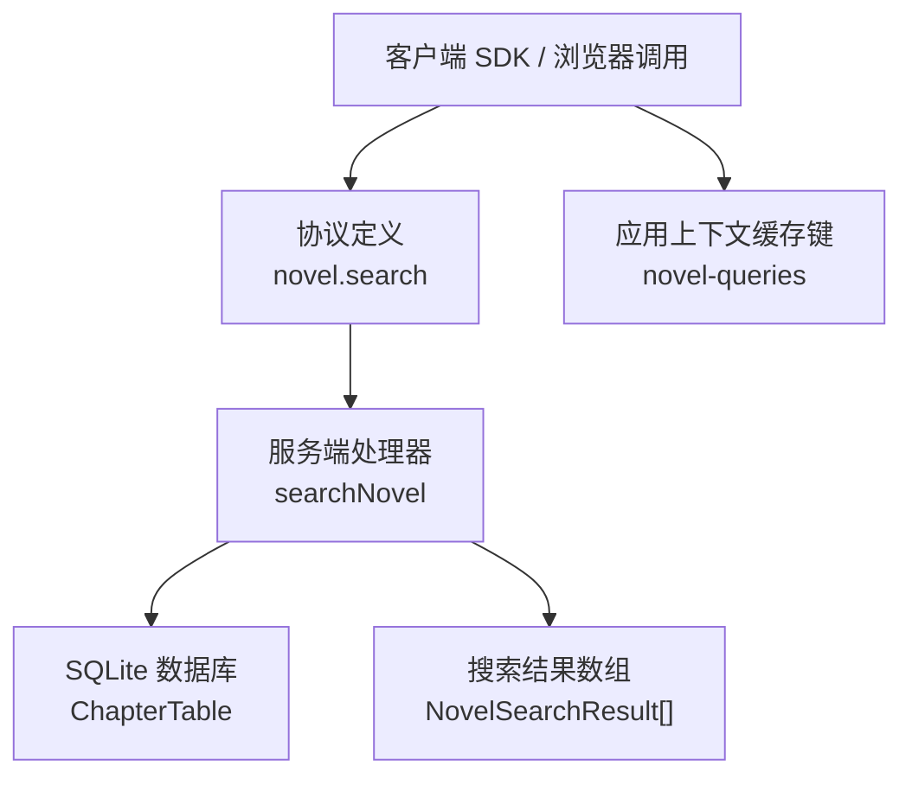
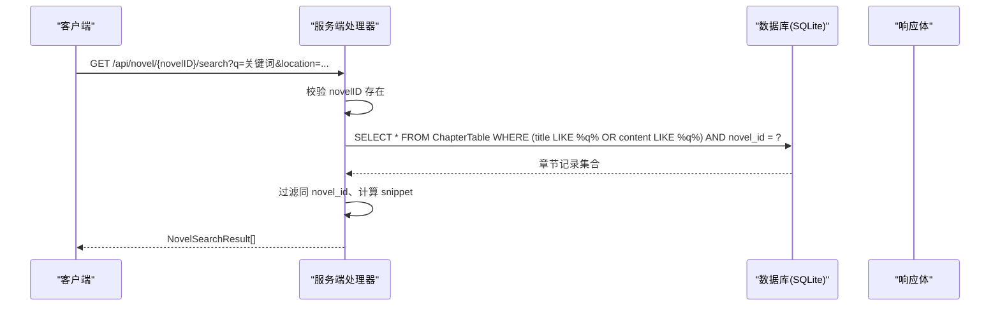
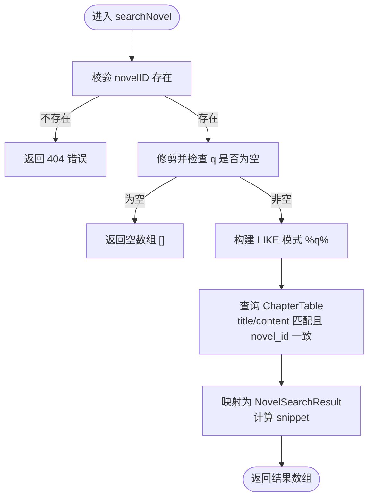
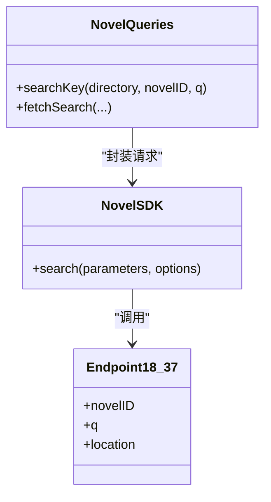
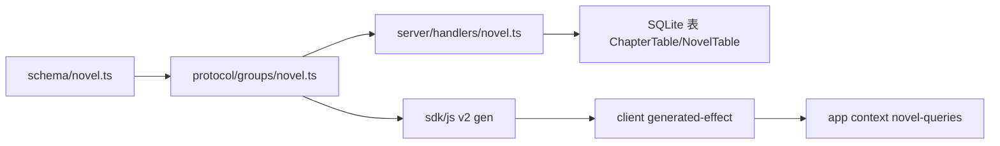

# 搜索查询 API

<cite>
**本文引用的文件**   
- [packages/protocol/src/groups/novel.ts](file://packages/protocol/src/groups/novel.ts)
- [packages/server/src/handlers/novel.ts](file://packages/server/src/handlers/novel.ts)
- [packages/schema/src/novel.ts](file://packages/schema/src/novel.ts)
- [packages/sdks/js/src/v2/gen/sdk.gen.ts](file://packages/sdks/js/src/v2/gen/sdk.gen.ts)
- [packages/client/src/generated-effect/client.ts](file://packages/client/src/generated-effect/client.ts)
- [packages/app/src/context/novel-queries.ts](file://packages/app/src/context/novel-queries.ts)
- [packages/plugin/src/novel-writer.ts](file://packages/plugin/src/novel-writer.ts)
- [packages/core/src/filesystem/search.ts](file://packages/core/src/filesystem/search.ts)
</cite>

## 目录
1. [简介](#简介)
2. [项目结构](#项目结构)
3. [核心组件](#核心组件)
4. [架构总览](#架构总览)
5. [详细组件分析](#详细组件分析)
6. [依赖关系分析](#依赖关系分析)
7. [性能与缓存建议](#性能与缓存建议)
8. [故障排查指南](#故障排查指南)
9. [结论](#结论)
10. [附录：接口定义与示例](#附录接口定义与示例)

## 简介
本文件为“小说全文搜索”API 的权威文档，覆盖以下能力：
- 对章节标题与正文进行全文检索（当前实现基于 SQL LIKE 模糊匹配）
- 返回命中片段（snippet）用于前端高亮展示
- 支持按作品维度隔离数据范围
- 提供客户端 SDK、协议定义与服务端处理器的完整链路说明
- 给出扩展方向：角色、情节线索、世界观等多维数据的统一搜索语法、排序分页策略、索引维护与缓存方案

## 项目结构
搜索相关代码分布在协议层、服务端处理器、类型定义与客户端 SDK 中：
- 协议层：声明路由、参数与响应类型
- 服务端：实现搜索逻辑，包含校验、数据库查询与结果映射
- 类型层：定义搜索结果结构与领域模型
- 客户端：生成式 SDK 与 Effect 客户端封装
- 插件与工具：提供章节级搜索工具与文件系统搜索能力（可作为未来多维搜索的基础）

图表来源
- [packages/protocol/src/groups/novel.ts:621-639](file://packages/protocol/src/groups/novel.ts#L621-L639)
- [packages/server/src/handlers/novel.ts:1014-1041](file://packages/server/src/handlers/novel.ts#L1014-L1041)
- [packages/schema/src/novel.ts](file://packages/schema/src/novel.ts)
- [packages/sdks/js/src/v2/gen/sdk.gen.ts:8797-8828](file://packages/sdks/js/src/v2/gen/sdk.gen.ts#L8797-L8828)
- [packages/client/src/generated-effect/client.ts:1144-1154](file://packages/client/src/generated-effect/client.ts#L1144-L1154)
- [packages/app/src/context/novel-queries.ts:55,310-312:55-55](file://packages/app/src/context/novel-queries.ts#L55-L55)

章节来源
- [packages/protocol/src/groups/novel.ts:621-639](file://packages/protocol/src/groups/novel.ts#L621-L639)
- [packages/server/src/handlers/novel.ts:1014-1041](file://packages/server/src/handlers/novel.ts#L1014-L1041)
- [packages/sdks/js/src/v2/gen/sdk.gen.ts:8797-8828](file://packages/sdks/js/src/v2/gen/sdk.gen.ts#L8797-L8828)
- [packages/client/src/generated-effect/client.ts:1144-1154](file://packages/client/src/generated-effect/client.ts#L1144-L1154)
- [packages/app/src/context/novel-queries.ts:55,310-312:55-55](file://packages/app/src/context/novel-queries.ts#L55-L55)

## 核心组件
- 协议定义：GET /api/novel/:novelID/search，参数 q（必填）、location（可选），返回 NovelSearchResult 数组
- 服务端处理器：校验 novel 存在、q 非空、使用 LIKE 模糊匹配 title/content、过滤同 novel_id、构造 snippet
- 类型定义：NovelSearchResult 字段包括 chapterId、title、order、volumeId、snippet
- 客户端 SDK：自动生成请求方法与类型，支持路径参数与查询参数
- 应用上下文：为搜索请求提供稳定的缓存键，便于前端缓存与去抖

章节来源
- [packages/protocol/src/groups/novel.ts:621-639](file://packages/protocol/src/groups/novel.ts#L621-L639)
- [packages/server/src/handlers/novel.ts:1014-1041](file://packages/server/src/handlers/novel.ts#L1014-L1041)
- [packages/schema/src/novel.ts](file://packages/schema/src/novel.ts)
- [packages/sdks/js/src/v2/gen/sdk.gen.ts:8797-8828](file://packages/sdks/js/src/v2/gen/sdk.gen.ts#L8797-L8828)
- [packages/client/src/generated-effect/client.ts:1144-1154](file://packages/client/src/generated-effect/client.ts#L1144-L1154)
- [packages/app/src/context/novel-queries.ts:55,310-312:55-55](file://packages/app/src/context/novel-queries.ts#L55-L55)

## 架构总览
下图展示了从客户端到数据库的完整调用链路与数据结构流转。

图表来源
- [packages/protocol/src/groups/novel.ts:621-639](file://packages/protocol/src/groups/novel.ts#L621-L639)
- [packages/server/src/handlers/novel.ts:1014-1041](file://packages/server/src/handlers/novel.ts#L1014-L1041)

## 详细组件分析

### 接口定义与参数规范
- 方法：GET
- 路径：/api/novel/:novelID/search
- 路径参数
  - novelID：字符串，必需
- 查询参数
  - q：字符串，必需；用于模糊匹配章节标题与内容
  - location：对象，可选；包含 directory/workspace（用于定位工作区）
- 成功响应：NovelSearchResult[]
- 错误响应：NovelNotFoundError（当 novelID 不存在时）

章节来源
- [packages/protocol/src/groups/novel.ts:621-639](file://packages/protocol/src/groups/novel.ts#L621-L639)

### 服务端处理逻辑
- 校验流程
  - 根据 novelID 查询作品是否存在，不存在则返回 404
  - 若 q 为空或仅空白字符，直接返回空数组
- 查询逻辑
  - 使用 LIKE '%q%' 同时匹配 title 与 content
  - 二次过滤确保结果属于同一 novel_id
- 结果映射
  - 在内容中查找首次出现位置，截取前后若干字符作为 snippet
  - 返回 chapterId、title、order、volumeId、snippet

图表来源
- [packages/server/src/handlers/novel.ts:1014-1041](file://packages/server/src/handlers/novel.ts#L1014-L1041)

章节来源
- [packages/server/src/handlers/novel.ts:1014-1041](file://packages/server/src/handlers/novel.ts#L1014-L1041)

### 数据类型与响应结构
- NovelSearchResult（由协议层引用 schema 中的类型）
  - chapterId：章节 ID
  - title：章节标题
  - order：章节顺序号
  - volumeId：所属卷 ID（可选）
  - snippet：命中片段（用于前端高亮）

章节来源
- [packages/schema/src/novel.ts](file://packages/schema/src/novel.ts)

### 客户端 SDK 与调用方式
- 自动生成的 JS SDK 暴露 search(novelID, { q, location })
- Effect 客户端封装 Endpoint18_37 将参数映射为 HTTP 请求
- 应用层通过 novel-queries 提供缓存键与查询封装

图表来源
- [packages/sdks/js/src/v2/gen/sdk.gen.ts:8797-8828](file://packages/sdks/js/src/v2/gen/sdk.gen.ts#L8797-L8828)
- [packages/client/src/generated-effect/client.ts:1144-1154](file://packages/client/src/generated-effect/client.ts#L1144-L1154)
- [packages/app/src/context/novel-queries.ts:55,310-312:55-55](file://packages/app/src/context/novel-queries.ts#L55-L55)

章节来源
- [packages/sdks/js/src/v2/gen/sdk.gen.ts:8797-8828](file://packages/sdks/js/src/v2/gen/sdk.gen.ts#L8797-L8828)
- [packages/client/src/generated-effect/client.ts:1144-1154](file://packages/client/src/generated-effect/client.ts#L1144-L1154)
- [packages/app/src/context/novel-queries.ts:55,310-312:55-55](file://packages/app/src/context/novel-queries.ts#L55-L55)

### 插件侧章节搜索工具（参考）
- 插件工具支持对章节内容与标题进行模糊匹配，限制返回条数，并输出匹配行与片段
- 该实现可作为未来统一搜索语法与高亮展示的参考

章节来源
- [packages/plugin/src/novel-writer.ts:1047-1079](file://packages/plugin/src/novel-writer.ts#L1047-L1079)

### 文件系统搜索能力（参考）
- 提供 find/grep/glob 等能力，支持模糊匹配与正则匹配
- 可用于未来扩展至角色、情节线索、世界观等多维内容的检索

章节来源
- [packages/core/src/filesystem/search.ts:1-240](file://packages/core/src/filesystem/search.ts#L1-L240)

## 依赖关系分析
- 协议层依赖 schema 类型，定义路由与响应结构
- 服务端处理器依赖数据库表 ChapterTable 与 NovelTable
- 客户端 SDK 与 Effect 客户端依赖协议层定义生成
- 应用层通过缓存键组织请求，避免重复网络调用

图表来源
- [packages/schema/src/novel.ts](file://packages/schema/src/novel.ts)
- [packages/protocol/src/groups/novel.ts:621-639](file://packages/protocol/src/groups/novel.ts#L621-L639)
- [packages/server/src/handlers/novel.ts:1014-1041](file://packages/server/src/handlers/novel.ts#L1014-L1041)
- [packages/sdks/js/src/v2/gen/sdk.gen.ts:8797-8828](file://packages/sdks/js/src/v2/gen/sdk.gen.ts#L8797-L8828)
- [packages/client/src/generated-effect/client.ts:1144-1154](file://packages/client/src/generated-effect/client.ts#L1144-L1154)
- [packages/app/src/context/novel-queries.ts:55,310-312:55-55](file://packages/app/src/context/novel-queries.ts#L55-L55)

章节来源
- [packages/protocol/src/groups/novel.ts:621-639](file://packages/protocol/src/groups/novel.ts#L621-L639)
- [packages/server/src/handlers/novel.ts:1014-1041](file://packages/server/src/handlers/novel.ts#L1014-L1041)
- [packages/sdks/js/src/v2/gen/sdk.gen.ts:8797-8828](file://packages/sdks/js/src/v2/gen/sdk.gen.ts#L8797-L8828)
- [packages/client/src/generated-effect/client.ts:1144-1154](file://packages/client/src/generated-effect/client.ts#L1144-L1154)
- [packages/app/src/context/novel-queries.ts:55,310-312:55-55](file://packages/app/src/context/novel-queries.ts#L55-L55)

## 性能与缓存建议
- 当前实现使用 SQL LIKE 模糊匹配，未建立全文索引，适合中小规模文本；大规模场景建议引入专用搜索引擎（如 Elasticsearch/Meilisearch）
- 排序与分页
  - 当前未提供排序与分页参数；可在协议层增加 orderBy、limit、offset 等参数
  - 建议在数据库层添加复合索引（novel_id, title, content）以提升 LIKE 查询效率
- 高亮显示
  - 服务端已返回 snippet，前端可直接对 snippet 中的关键词进行高亮渲染
- 缓存策略
  - 应用层可使用 novel-queries 提供的缓存键进行本地缓存
  - 服务端可结合 effect-drizzle-sqlite 的查询缓存机制（事务内缓存、失效策略）减少重复查询
- 扩展多维搜索
  - 可复用文件系统搜索能力（find/grep/glob）与插件侧章节搜索工具，逐步扩展至角色、情节线索、世界观等实体

章节来源
- [packages/server/src/handlers/novel.ts:1014-1041](file://packages/server/src/handlers/novel.ts#L1014-L1041)
- [packages/core/src/filesystem/search.ts:1-240](file://packages/core/src/filesystem/search.ts#L1-L240)
- [packages/plugin/src/novel-writer.ts:1047-1079](file://packages/plugin/src/novel-writer.ts#L1047-L1079)

## 故障排查指南
- 常见错误
  - 404 NovelNotFoundError：novelID 不存在或无效
  - 空结果：q 为空或无匹配内容
- 调试建议
  - 检查 q 是否被正确编码与传递
  - 确认数据库中存在对应 novel_id 的章节记录
  - 查看服务端日志与数据库查询执行计划，评估 LIKE 性能
- 扩展问题
  - 如需支持多字段组合查询，需先在协议层扩展 query 结构，再在服务端实现组合条件

章节来源
- [packages/protocol/src/groups/novel.ts:621-639](file://packages/protocol/src/groups/novel.ts#L621-L639)
- [packages/server/src/handlers/novel.ts:1014-1041](file://packages/server/src/handlers/novel.ts#L1014-L1041)

## 结论
当前搜索 API 聚焦于章节标题与内容的模糊匹配，具备清晰的协议定义、稳定的服务端处理与完善的客户端 SDK 支持。为满足更复杂的检索需求（多维度、精确匹配、组合查询、排序分页、高亮与缓存），建议在现有基础上逐步引入专用搜索引擎与查询优化策略，并保持向后兼容。

## 附录：接口定义与示例
- 接口
  - GET /api/novel/:novelID/search
  - 参数：novelID（路径）、q（查询）、location（可选）
  - 响应：NovelSearchResult[]
- 示例调用（SDK）
  - 使用 sdk.search({ novelID, q, location })
- 前端缓存键
  - novel-queries.search(directory, novelID, q)

章节来源
- [packages/protocol/src/groups/novel.ts:621-639](file://packages/protocol/src/groups/novel.ts#L621-L639)
- [packages/sdks/js/src/v2/gen/sdk.gen.ts:8797-8828](file://packages/sdks/js/src/v2/gen/sdk.gen.ts#L8797-L8828)
- [packages/app/src/context/novel-queries.ts:55,310-312:55-55](file://packages/app/src/context/novel-queries.ts#L55-L55)