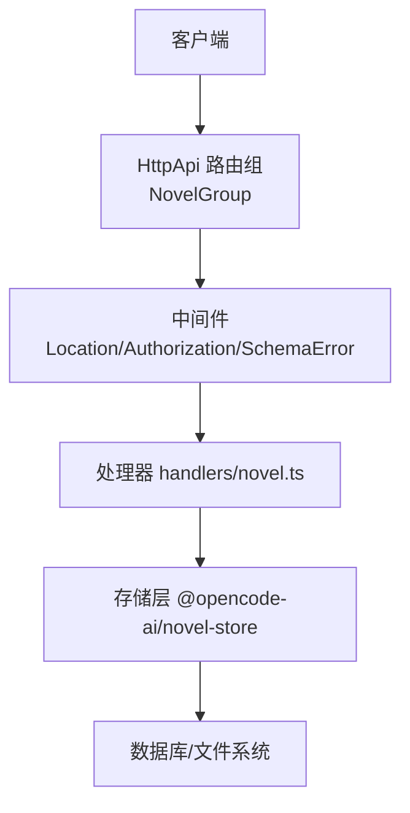
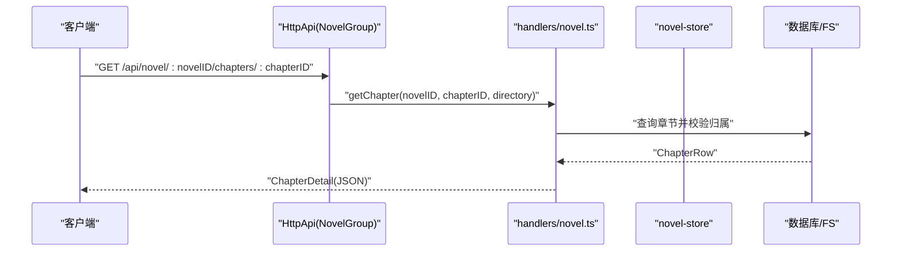
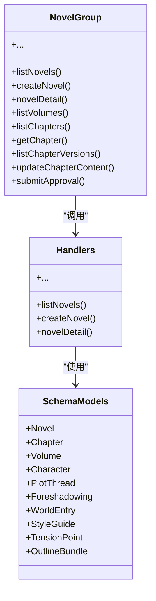

# 核心 API 接口

<cite>
**本文引用的文件**   
- [packages/protocol/src/groups/novel.ts](file://packages/protocol/src/groups/novel.ts)
- [packages/schema/src/novel.ts](file://packages/schema/src/novel.ts)
- [packages/server/src/handlers/novel.ts](file://packages/server/src/handlers/novel.ts)
- [packages/protocol/src/api.ts](file://packages/protocol/src/api.ts)
- [packages/server/test/novel-e2e.test.ts](file://packages/server/test/novel-e2e.test.ts)
</cite>

## 目录
1. [简介](#简介)
2. [项目结构](#项目结构)
3. [核心组件](#核心组件)
4. [架构总览](#架构总览)
5. [详细接口说明](#详细接口说明)
6. [依赖关系分析](#依赖关系分析)
7. [性能与扩展性](#性能与扩展性)
8. [故障排查](#故障排查)
9. [版本兼容与迁移指南](#版本兼容与迁移指南)
10. [附录：请求响应示例与校验规则](#附录请求响应示例与校验规则)

## 简介
本文件为 openNovel SDK 的核心 HTTP API 文档，聚焦小说、章节、角色、情节与张力曲线等实体的 CRUD、版本管理、审阅与导出能力。所有接口基于 Effect HttpApi 定义，使用 schema 进行强类型校验，错误通过统一错误类返回。文档覆盖：
- 参数定义与返回值格式
- 错误码与异常处理
- 批量操作、分页与搜索的实现方式
- 接口版本标识与迁移建议
- 典型请求/响应示例（JSON）与数据校验规则

## 项目结构
openNovel 的 API 由三层组成：
- 协议层（Protocol）：定义路由、入参/出参 Schema、错误类与 OpenAPI 注解
- 模式层（Schema）：定义实体与输入输出的数据结构与约束
- 服务层（Server Handlers）：实现业务逻辑、数据库访问与映射

图表来源
- [packages/protocol/src/groups/novel.ts:1-120](file://packages/protocol/src/groups/novel.ts#L1-L120)
- [packages/protocol/src/api.ts:26-66](file://packages/protocol/src/api.ts#L26-L66)
- [packages/server/src/handlers/novel.ts:1-60](file://packages/server/src/handlers/novel.ts#L1-L60)

章节来源
- [packages/protocol/src/api.ts:26-66](file://packages/protocol/src/api.ts#L26-L66)
- [packages/protocol/src/groups/novel.ts:1-120](file://packages/protocol/src/groups/novel.ts#L1-L120)

## 核心组件
- NovelGroup：集中声明 /api/novel 下的所有端点，包含列表、详情、卷、章节、角色、关系、伏笔、世界观、大纲、导出、搜索、张力曲线、绑定会话等
- Schema 模型：Novel、Chapter、Volume、Character、PlotThread、Foreshadowing、WorldEntry、StyleGuide、TensionPoint、OutlineBundle、各类 Input/Output
- 错误类：NovelNotFoundError、ChapterNotFoundError、NovelValidationError（HTTP 状态码分别为 404、404、400）
- Handler：将 HTTP 请求映射到 Effect 编排的业务函数，完成校验、持久化与 DTO 转换

章节来源
- [packages/protocol/src/groups/novel.ts:1-120](file://packages/protocol/src/groups/novel.ts#L1-L120)
- [packages/schema/src/novel.ts:1-120](file://packages/schema/src/novel.ts#L1-L120)
- [packages/server/src/handlers/novel.ts:1-120](file://packages/server/src/handlers/novel.ts#L1-L120)

## 架构总览

图表来源
- [packages/protocol/src/groups/novel.ts:178-193](file://packages/protocol/src/groups/novel.ts#L178-L193)
- [packages/server/src/handlers/novel.ts:488-495](file://packages/server/src/handlers/novel.ts#L488-L495)

## 详细接口说明
以下按功能域组织接口，给出路径、方法、参数、成功返回、错误码与行为说明。所有接口均支持 LocationQuery（用于定位工作区/目录），具体字段见“附录”。

### 小说管理（Novel）
- GET /api/novel
  - 描述：列出所有小说及其统计信息
  - 成功返回：数组，元素为 Novel
  - 错误：NovelValidationError（400）
- POST /api/novel
  - 描述：创建小说
  - 请求体：CreateNovelInput（title, genre, synopsis）
  - 成功返回：Novel
  - 错误：NovelValidationError（400）
- GET /api/novel/for-session/:sessionID
  - 描述：根据会话解析绑定的小说
  - 成功返回：Novel
  - 错误：NovelNotFoundError（404）
- GET /api/novel/:novelID
  - 描述：获取小说详情（含风格指南与统计）
  - 成功返回：NovelDetail
  - 错误：NovelNotFoundError（404）
- PUT /api/novel/:novelID
  - 描述：更新小说基本信息
  - 请求体：UpdateNovelInput（title?, synopsis?, genre?）
  - 成功返回：Novel
  - 错误：NovelNotFoundError（404）
- DELETE /api/novel/:novelID
  - 描述：删除小说
  - 成功返回：{ deleted: boolean }
  - 错误：NovelNotFoundError（404）

章节来源
- [packages/protocol/src/groups/novel.ts:84-145](file://packages/protocol/src/groups/novel.ts#L84-L145)
- [packages/protocol/src/groups/novel.ts:685-704](file://packages/protocol/src/groups/novel.ts#L685-L704)
- [packages/schema/src/novel.ts:8-38](file://packages/schema/src/novel.ts#L8-L38)
- [packages/schema/src/novel.ts:338-373](file://packages/schema/src/novel.ts#L338-L373)

### 卷管理（Volume）
- GET /api/novel/:novelID/volumes
  - 描述：列出小说的所有卷
  - 成功返回：数组，元素为 Volume
  - 错误：NovelNotFoundError（404）
- POST /api/novel/:novelID/volumes
  - 描述：创建卷
  - 请求体：CreateVolumeInput（title, summary?）
  - 成功返回：Volume
  - 错误：NovelNotFoundError（404）
- PUT /api/novel/:novelID/volumes/:volumeID
  - 描述：更新卷
  - 请求体：UpdateVolumeInput（title?, summary?）
  - 成功返回：Volume
  - 错误：NovelNotFoundError（404）
- DELETE /api/novel/:novelID/volumes/:volumeID
  - 描述：删除卷（其下章节变为未分配）
  - 成功返回：{ deleted: boolean }
  - 错误：NovelNotFoundError（404）

章节来源
- [packages/protocol/src/groups/novel.ts:147-161](file://packages/protocol/src/groups/novel.ts#L147-L161)
- [packages/protocol/src/groups/novel.ts:401-436](file://packages/protocol/src/groups/novel.ts#L401-L436)
- [packages/schema/src/novel.ts:40-59](file://packages/schema/src/novel.ts#L40-L59)
- [packages/schema/src/novel.ts:262-272](file://packages/schema/src/novel.ts#L262-L272)

### 章节管理（Chapter）
- GET /api/novel/:novelID/chapters
  - 描述：列出小说的所有章节（按 order 排序）
  - 成功返回：数组，元素为 Chapter
  - 错误：NovelNotFoundError（404）
- POST /api/novel/:novelID/chapters
  - 描述：创建章节
  - 请求体：CreateChapterInput（title, volumeId?, order?）
  - 成功返回：Chapter
  - 错误：NovelNotFoundError（404）
- GET /api/novel/:novelID/chapters/:chapterID
  - 描述：获取章节详情（含 content）
  - 成功返回：ChapterDetail
  - 错误：ChapterNotFoundError（404）
- PUT /api/novel/:novelID/chapters/:chapterID
  - 描述：更新章节标题或状态
  - 请求体：UpdateChapterInput（title?, status?）
  - 成功返回：Chapter
  - 错误：ChapterNotFoundError（404）
- PUT /api/novel/:novelID/chapters/:chapterID/content
  - 描述：替换章节内容（自动记录版本）
  - 请求体：UpdateChapterContentInput（content）
  - 成功返回：Chapter
  - 错误：ChapterNotFoundError（404）
- DELETE /api/novel/:novelID/chapters/:chapterID
  - 描述：删除章节
  - 成功返回：{ deleted: boolean }
  - 错误：ChapterNotFoundError（404）
- GET /api/novel/:novelID/chapters/:chapterID/versions
  - 描述：查看章节版本历史（按 version 降序）
  - 成功返回：数组，元素为 ChapterVersion
  - 错误：ChapterNotFoundError（404）
- POST /api/novel/:novelID/chapters/:chapterID/rollback
  - 描述：回滚到上一版本（保留当前版本为新版本）
  - 成功返回：Chapter
  - 错误：ChapterNotFoundError（404）
- PUT /api/novel/:novelID/chapters/:chapterID/restore
  - 描述：恢复到指定版本
  - 请求体：RestoreVersionInput（version）
  - 成功返回：Chapter
  - 错误：ChapterNotFoundError（404）
- PUT /api/novel/:novelID/chapters/:chapterID/move
  - 描述：调整顺序或移动到另一卷
  - 请求体：MoveChapterInput（action: up|down|to-volume, volumeId?）
  - 成功返回：Chapter
  - 错误：ChapterNotFoundError（404）
- GET /api/novel/:novelID/chapters/:chapterID/reviews
  - 描述：查看章节审阅记录（最新优先）
  - 成功返回：数组，元素为 ChapterReview
  - 错误：ChapterNotFoundError（404）
- POST /api/novel/:novelID/chapters/:chapterID/approval
  - 描述：提交审阅决定（approve/reject）
  - 请求体：ApprovalInput（action, comment?）
  - 成功返回：Chapter
  - 错误：ChapterNotFoundError（404）

章节来源
- [packages/protocol/src/groups/novel.ts:163-276](file://packages/protocol/src/groups/novel.ts#L163-L276)
- [packages/protocol/src/groups/novel.ts:438-481](file://packages/protocol/src/groups/novel.ts#L438-L481)
- [packages/protocol/src/groups/novel.ts:674-683](file://packages/protocol/src/groups/novel.ts#L674-L683)
- [packages/schema/src/novel.ts:61-121](file://packages/schema/src/novel.ts#L61-L121)
- [packages/schema/src/novel.ts:274-311](file://packages/schema/src/novel.ts#L274-L311)
- [packages/server/test/novel-e2e.test.ts:155-180](file://packages/server/test/novel-e2e.test.ts#L155-L180)

### 角色与关系（Character & Relationship）
- GET /api/novel/:novelID/characters
  - 描述：列出角色
  - 成功返回：数组，元素为 Character
  - 错误：NovelNotFoundError（404）
- POST /api/novel/:novelID/characters
  - 描述：创建角色
  - 请求体：CreateCharacterInput（name, role?, description?）
  - 成功返回：Character
  - 错误：NovelNotFoundError（404）
- PUT /api/novel/:novelID/characters/:characterID
  - 描述：更新角色
  - 请求体：UpdateCharacterInput（name?, role?, description?）
  - 成功返回：Character
  - 错误：NovelNotFoundError（404）
- DELETE /api/novel/:novelID/characters/:characterID
  - 描述：删除角色
  - 成功返回：{ deleted: boolean }
  - 错误：NovelNotFoundError（404）
- GET /api/novel/:novelID/relationships
  - 描述：列出角色关系
  - 成功返回：数组，元素为 Relationship
  - 错误：NovelNotFoundError（404）
- POST /api/novel/:novelID/relationships
  - 描述：创建关系
  - 请求体：CreateRelationshipInput（charAId, charBId, type, description?）
  - 成功返回：Relationship
  - 错误：NovelNotFoundError（404）
- PUT /api/novel/:novelID/relationships/:relationshipID
  - 描述：更新关系
  - 请求体：UpdateRelationshipInput（type?, description?）
  - 成功返回：Relationship
  - 错误：NovelNotFoundError（404）
- DELETE /api/novel/:novelID/relationships/:relationshipID
  - 描述：删除关系
  - 成功返回：{ deleted: boolean }
  - 错误：NovelNotFoundError（404）

章节来源
- [packages/protocol/src/groups/novel.ts:278-331](file://packages/protocol/src/groups/novel.ts#L278-L331)
- [packages/protocol/src/groups/novel.ts:494-531](file://packages/protocol/src/groups/novel.ts#L494-L531)
- [packages/schema/src/novel.ts:123-152](file://packages/schema/src/novel.ts#L123-L152)
- [packages/schema/src/novel.ts:291-303](file://packages/schema/src/novel.ts#L291-L303)

### 角色状态（CharacterState）
- GET /api/novel/:novelID/characters/:characterID/states
  - 描述：列出某角色的状态历史
  - 成功返回：数组，元素为 CharacterState
  - 错误：NovelNotFoundError（404）
- GET /api/novel/:novelID/character-states
  - 描述：列出小说内所有角色状态
  - 成功返回：数组，元素为 CharacterState
  - 错误：NovelNotFoundError（404）
- POST /api/novel/:novelID/characters/:characterID/states
  - 描述：新增角色状态
  - 请求体：CreateCharacterStateInput（chapterId?, place?, mood?, summary?）
  - 成功返回：CharacterState
  - 错误：NovelNotFoundError（404）
- PUT /api/novel/:novelID/character-states/:stateID
  - 描述：更新角色状态
  - 请求体：UpdateCharacterStateInput（active?, place?, mood?, summary?）
  - 成功返回：CharacterState
  - 错误：NovelNotFoundError（404）
- DELETE /api/novel/:novelID/character-states/:stateID
  - 描述：删除角色状态
  - 成功返回：{ deleted: boolean }
  - 错误：NovelNotFoundError（404）

章节来源
- [packages/protocol/src/groups/novel.ts:533-596](file://packages/protocol/src/groups/novel.ts#L533-L596)
- [packages/schema/src/novel.ts:133-142](file://packages/schema/src/novel.ts#L133-L142)
- [packages/schema/src/novel.ts:305-319](file://packages/schema/src/novel.ts#L305-L319)

### 情节追踪（PlotThread）
- GET /api/novel/:novelID/plot-threads
  - 描述：列出情节线
  - 成功返回：数组，元素为 PlotThread
  - 错误：NovelNotFoundError（404）
- POST /api/novel/:novelID/plot-threads
  - 描述：创建情节线
  - 请求体：CreatePlotThreadInput（title, priority?, description?）
  - 成功返回：PlotThread
  - 错误：NovelNotFoundError（404）
- PUT /api/novel/:novelID/plot-threads/:threadID
  - 描述：更新情节线
  - 请求体：UpdatePlotThreadInput（title?, status?, priority?, description?）
  - 成功返回：PlotThread
  - 错误：NovelNotFoundError（404）
- DELETE /api/novel/:novelID/plot-threads/:threadID
  - 描述：删除情节线
  - 成功返回：{ deleted: boolean }
  - 错误：NovelNotFoundError（404）

章节来源
- [packages/protocol/src/groups/novel.ts:294-308](file://packages/protocol/src/groups/novel.ts#L294-L308)
- [packages/protocol/src/groups/novel.ts:770-800](file://packages/protocol/src/groups/novel.ts#L770-L800)
- [packages/schema/src/novel.ts:154-164](file://packages/schema/src/novel.ts#L154-L164)
- [packages/schema/src/novel.ts:400-413](file://packages/schema/src/novel.ts#L400-L413)

### 伏笔（Foreshadowing）
- GET /api/novel/:novelID/foreshadowing
  - 描述：列出伏笔条目
  - 成功返回：数组，元素为 Foreshadowing
  - 错误：NovelNotFoundError（404）
- POST /api/novel/:novelID/foreshadowing
  - 描述：创建伏笔
  - 请求体：CreateForeshadowingInput（content, plantedChapterId?）
  - 成功返回：Foreshadowing
  - 错误：NovelNotFoundError（404）
- PUT /api/novel/:novelID/foreshadowing/:id
  - 描述：更新伏笔
  - 请求体：UpdateForeshadowingInput（content?, state?, resolvedChapterId?）
  - 成功返回：Foreshadowing
  - 错误：NovelNotFoundError（404）
- DELETE /api/novel/:novelID/foreshadowing/:id
  - 描述：删除伏笔
  - 成功返回：{ deleted: boolean }
  - 错误：NovelNotFoundError（404）

章节来源
- [packages/protocol/src/groups/novel.ts:310-324](file://packages/protocol/src/groups/novel.ts#L310-L324)
- [packages/schema/src/novel.ts:166-175](file://packages/schema/src/novel.ts#L166-L175)
- [packages/schema/src/novel.ts:415-426](file://packages/schema/src/novel.ts#L415-L426)

### 世界观（WorldEntry）
- GET /api/novel/:novelID/world-entries
  - 描述：列出世界观条目
  - 成功返回：数组，元素为 WorldEntry
  - 错误：NovelNotFoundError（404）
- POST /api/novel/:novelID/world-entries
  - 描述：创建世界观条目
  - 请求体：CreateWorldEntryInput（category, title, content?）
  - 成功返回：WorldEntry
  - 错误：NovelNotFoundError（404）
- PUT /api/novel/:novelID/world-entries/:id
  - 描述：更新世界观条目
  - 请求体：UpdateWorldEntryInput（category?, title?, content?）
  - 成功返回：WorldEntry
  - 错误：NovelNotFoundError（404）
- DELETE /api/novel/:novelID/world-entries/:id
  - 描述：删除世界观条目
  - 成功返回：{ deleted: boolean }
  - 错误：NovelNotFoundError（404）

章节来源
- [packages/protocol/src/groups/novel.ts:326-340](file://packages/protocol/src/groups/novel.ts#L326-L340)
- [packages/schema/src/novel.ts:177-185](file://packages/schema/src/novel.ts#L177-L185)
- [packages/schema/src/novel.ts:428-440](file://packages/schema/src/novel.ts#L428-L440)

### 风格指南（StyleGuide）
- GET /api/novel/:novelID/style-guide
  - 描述：获取风格指南
  - 成功返回：StyleGuide
  - 错误：NovelNotFoundError（404）
- PUT /api/novel/:novelID/style-guide
  - 描述：更新风格指南
  - 请求体：UpdateStyleGuideInput（tone?, pov?, tense?, rules?）
  - 成功返回：StyleGuide
  - 错误：NovelNotFoundError（404）

章节来源
- [packages/protocol/src/groups/novel.ts:598-619](file://packages/protocol/src/groups/novel.ts#L598-L619)
- [packages/schema/src/novel.ts:187-195](file://packages/schema/src/novel.ts#L187-L195)
- [packages/schema/src/novel.ts:321-327](file://packages/schema/src/novel.ts#L321-L327)

### 大纲（Outline）
- GET /api/novel/:novelID/outline
  - 描述：获取主大纲、卷大纲、章节大纲集合
  - 成功返回：OutlineBundle（master, volumes[], chapters[]）
  - 错误：NovelNotFoundError（404）
- PUT /api/novel/:novelID/outline
  - 描述：更新某一节的大纲 markdown
  - 请求体：OutlineUpdateInput（section: master|volume|chapter, id?, markdown）
  - 成功返回：OutlineBundle
  - 错误：NovelNotFoundError（404）

章节来源
- [packages/protocol/src/groups/novel.ts:342-373](file://packages/protocol/src/groups/novel.ts#L342-L373)
- [packages/schema/src/novel.ts:232-254](file://packages/schema/src/novel.ts#L232-L254)

### 导出（Export）
- GET /api/novel/:novelID/export
  - 描述：将整部小说（按卷与章节顺序）编译为单个 Markdown 文档
  - 成功返回：NovelExport（filename, content）
  - 错误：NovelNotFoundError（404）

章节来源
- [packages/protocol/src/groups/novel.ts:375-389](file://packages/protocol/src/groups/novel.ts#L375-L389)
- [packages/schema/src/novel.ts:256-260](file://packages/schema/src/novel.ts#L256-L260)

### 全文搜索（Search）
- GET /api/novel/:novelID/search
  - 描述：在章节标题与内容中进行全文检索
  - 查询参数：q（必填字符串）、location（可选：directory?, workspace?）
  - 成功返回：数组，元素为 NovelSearchResult（chapterId, title, order, volumeId?, snippet）
  - 错误：NovelNotFoundError（404）

章节来源
- [packages/protocol/src/groups/novel.ts:621-639](file://packages/protocol/src/groups/novel.ts#L621-L639)
- [packages/schema/src/novel.ts:329-336](file://packages/schema/src/novel.ts#L329-L336)

### 张力曲线（Tension）
- GET /api/novel/:novelID/tension
  - 描述：列出张力点（按章节号升序）
  - 成功返回：数组，元素为 TensionPoint
  - 错误：NovelNotFoundError（404）
- POST /api/novel/:novelID/tension
  - 描述：创建张力点
  - 请求体：CreateTensionPointInput（chapterNumber, level）
  - 成功返回：TensionPoint
  - 错误：NovelNotFoundError（404）
- PUT /api/novel/:novelID/tension/:pointID
  - 描述：更新张力点
  - 请求体：UpdateTensionPointInput（level?）
  - 成功返回：TensionPoint
  - 错误：NovelNotFoundError（404）
- DELETE /api/novel/:novelID/tension/:pointID
  - 描述：删除张力点
  - 成功返回：{ deleted: boolean }
  - 错误：NovelNotFoundError（404）

章节来源
- [packages/protocol/src/groups/novel.ts:641-668](file://packages/protocol/src/groups/novel.ts#L641-L668)
- [packages/schema/src/novel.ts:197-204](file://packages/schema/src/novel.ts#L197-L204)
- [packages/schema/src/novel.ts:389-398](file://packages/schema/src/novel.ts#L389-L398)

### 会话绑定（Bind Session）
- POST /api/novel/:novelID/bind
  - 描述：将会话绑定到小说
  - 请求体：BindSessionInput（sessionID）
  - 成功返回：Novel
  - 错误：NovelNotFoundError（404）

章节来源
- [packages/protocol/src/groups/novel.ts:657-672](file://packages/protocol/src/groups/novel.ts#L657-L672)
- [packages/schema/src/novel.ts:356-359](file://packages/schema/src/novel.ts#L356-L359)

## 依赖关系分析
- 路由与中间件：NovelGroup 挂载于全局 HttpApi，受 Authorization、Location、SchemaError 等中间件影响
- 数据模型：所有入参与出参均由 schema 严格校验，确保类型一致性与向后兼容
- 处理器：handlers/novel.ts 负责领域逻辑、数据库访问与 DTO 映射

图表来源
- [packages/protocol/src/groups/novel.ts:1-120](file://packages/protocol/src/groups/novel.ts#L1-L120)
- [packages/schema/src/novel.ts:1-120](file://packages/schema/src/novel.ts#L1-L120)
- [packages/server/src/handlers/novel.ts:1-120](file://packages/server/src/handlers/novel.ts#L1-L120)

章节来源
- [packages/protocol/src/api.ts:26-66](file://packages/protocol/src/api.ts#L26-L66)
- [packages/protocol/src/groups/novel.ts:1-120](file://packages/protocol/src/groups/novel.ts#L1-L120)

## 性能与扩展性
- 列表接口默认按 order 或 chapter_number 排序，避免全表扫描；建议在高频查询字段上建立索引（如 novel_id、order、chapter_number）
- 章节内容更新会写入版本表，注意版本表增长；可考虑归档策略或分库分表
- 全文搜索可能涉及文本倒排或模糊匹配，建议引入专用搜索引擎以缓解压力
- 导出接口生成完整 Markdown，大小说时延较高，建议异步任务+回调通知

[本节为通用指导，不直接分析具体文件]

## 故障排查
常见错误与定位要点：
- 404 NovelNotFoundError/ChapterNotFoundError：检查 novelID/chapterID 是否存在且归属正确
- 400 NovelValidationError：检查 genre 是否在允许集合内，或输入字段是否符合 schema
- 章节版本回滚失败：确认存在版本历史；回滚会插入新版本记录
- 审阅提交无效：确认 action 为 approve/reject，comment 可选

章节来源
- [packages/protocol/src/groups/novel.ts:54-80](file://packages/protocol/src/groups/novel.ts#L54-L80)
- [packages/server/src/handlers/novel.ts:287-310](file://packages/server/src/handlers/novel.ts#L287-L310)
- [packages/server/src/handlers/novel.ts:522-570](file://packages/server/src/handlers/novel.ts#L522-L570)

## 版本兼容与迁移指南
- 接口版本标识：所有端点均带有 identifier 前缀 v2.novel.*，表明当前为 v2 系列
- 向后兼容：schema 采用可选字段（optional）与宽松映射（如 rules 归一化），旧数据仍可正常读取
- 迁移建议：
  - 升级客户端时优先适配 v2 标识与新的错误类
  - 对已废弃字段保持兼容读取，逐步清理
  - 如需破坏性变更，建议新增 v3 分组并保留 v2 过渡期

章节来源
- [packages/protocol/src/groups/novel.ts:92-112](file://packages/protocol/src/groups/novel.ts#L92-L112)
- [packages/protocol/src/api.ts:58-64](file://packages/protocol/src/api.ts#L58-L64)

## 附录：请求响应示例与校验规则
以下为典型接口的 JSON 结构与校验要点（不含代码片段，仅结构说明）。

- 创建小说（POST /api/novel）
  - 请求体 CreateNovelInput
    - title: string（必填）
    - genre: string（必填，枚举：玄幻/都市/仙侠/历史/科幻/悬疑/言情/游戏）
    - synopsis: string（必填）
  - 成功响应 Novel
    - id: string
    - title: string
    - genre: string
    - synopsis: string
    - status: string
    - createdAt: number
    - updatedAt: number
  - 错误响应 NovelValidationError（400）
    - name: "NovelValidationError"
    - data.message: string
    - data.field?: string

- 获取章节详情（GET /api/novel/:novelID/chapters/:chapterID）
  - 成功响应 ChapterDetail
    - id, novelId, volumeId?, title, order, status, wordCount, createdAt, updatedAt, content
  - 错误响应 ChapterNotFoundError（404）
    - name: "ChapterNotFoundError"
    - data.message: string
    - data.novelId?, data.chapterId?

- 更新章节内容（PUT /api/novel/:novelID/chapters/:chapterID/content）
  - 请求体 UpdateChapterContentInput
    - content: string（必填）
  - 成功响应 Chapter
  - 错误响应 ChapterNotFoundError（404）

- 搜索（GET /api/novel/:novelID/search）
  - 查询参数
    - q: string（必填）
    - location.directory?: string
    - location.workspace?: string
  - 成功响应 NovelSearchResult[]
    - chapterId, title, order, volumeId?, snippet

- 导出（GET /api/novel/:novelID/export）
  - 成功响应 NovelExport
    - filename: string
    - content: string

- 审阅提交（POST /api/novel/:novelID/chapters/:chapterID/approval）
  - 请求体 ApprovalInput
    - action: "approve" | "reject"（必填）
    - comment?: string
  - 成功响应 Chapter
  - 错误响应 ChapterNotFoundError（404）

- 位置查询（LocationQuery）
  - 所有接口均可携带 location 查询参数：
    - directory?: string
    - workspace?: string

章节来源
- [packages/schema/src/novel.ts:8-38](file://packages/schema/src/novel.ts#L8-L38)
- [packages/schema/src/novel.ts:61-86](file://packages/schema/src/novel.ts#L61-L86)
- [packages/schema/src/novel.ts:329-336](file://packages/schema/src/novel.ts#L329-L336)
- [packages/schema/src/novel.ts:338-373](file://packages/schema/src/novel.ts#L338-L373)
- [packages/schema/src/novel.ts:350-354](file://packages/schema/src/novel.ts#L350-L354)
- [packages/schema/src/novel.ts:256-260](file://packages/schema/src/novel.ts#L256-L260)
- [packages/protocol/src/groups/novel.ts:115-129](file://packages/protocol/src/groups/novel.ts#L115-L129)