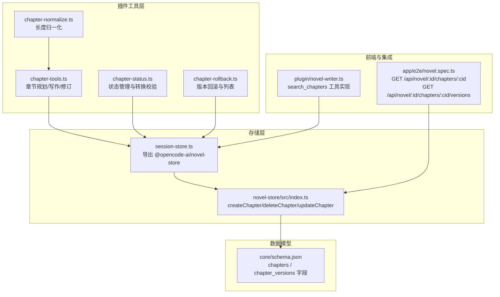
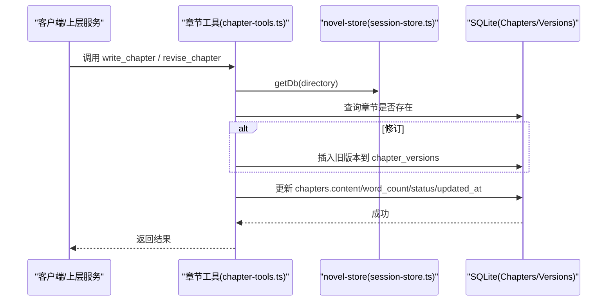
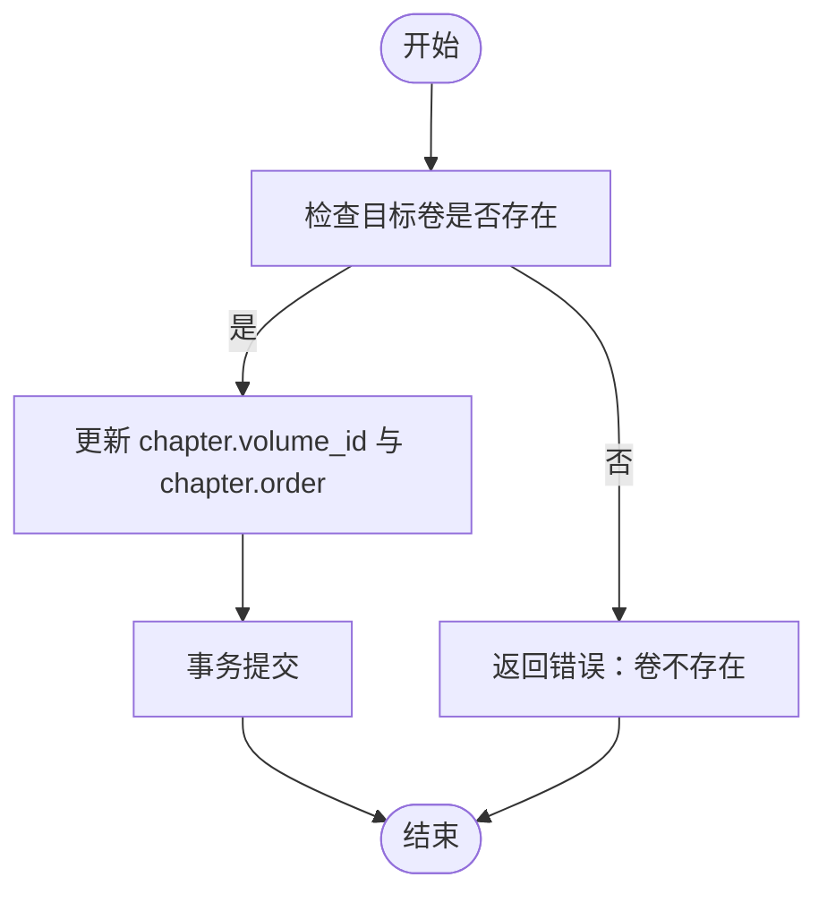
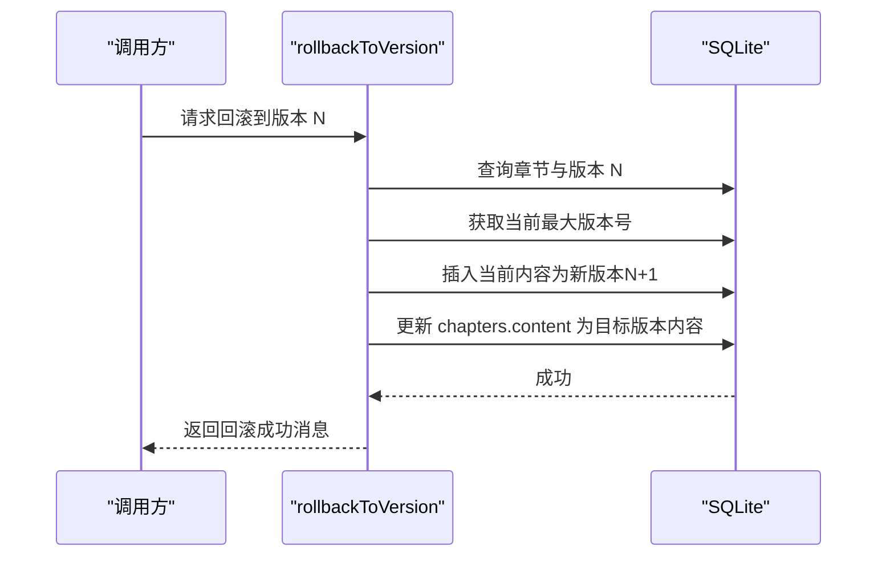
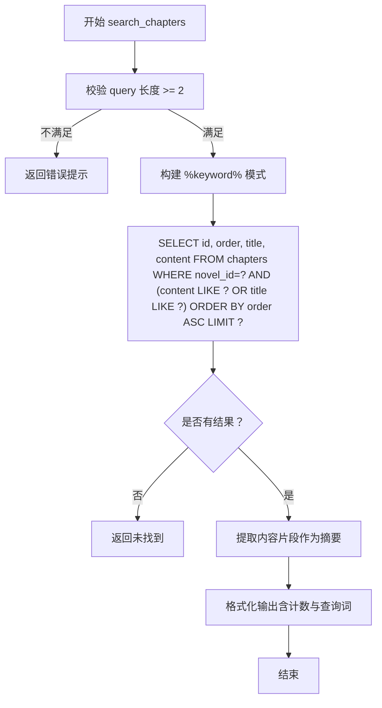
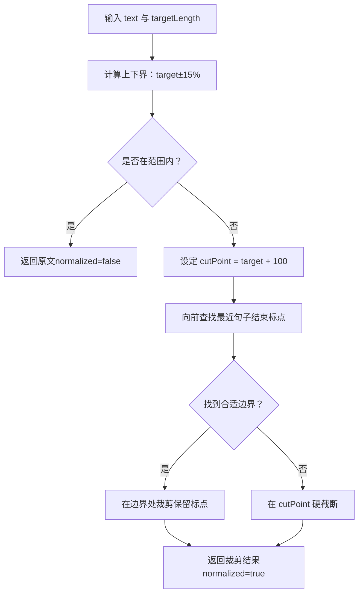
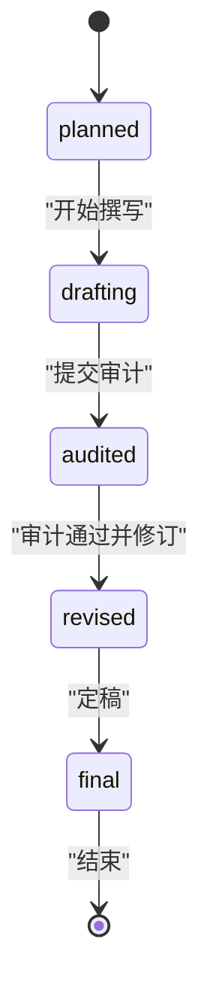
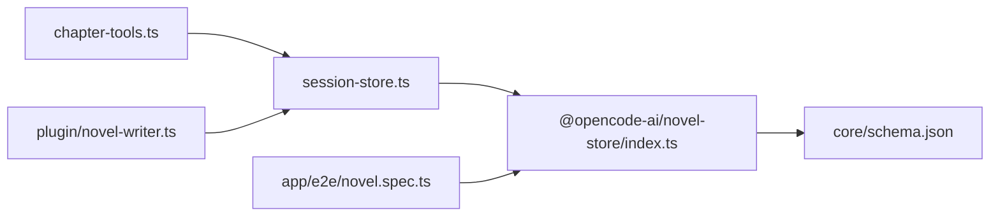

# 章节管理 API

<cite>
**本文引用的文件**   
- [packages/plugin/src/novel-writer/chapter-tools.ts](file://packages/plugin/src/novel-writer/chapter-tools.ts)
- [packages/plugin/src/novel-writer/chapter-normalize.ts](file://packages/plugin/src/novel-writer/chapter-normalize.ts)
- [packages/plugin/src/novel-writer/chapter-rollback.ts](file://packages/plugin/src/novel-writer/chapter-rollback.ts)
- [packages/plugin/src/novel-writer/chapter-status.ts](file://packages/plugin/src/novel-writer/chapter-status.ts)
- [packages/plugin/src/novel-writer/session-store.ts](file://packages/plugin/src/novel-writer/session-store.ts)
- [packages/novel-store/src/index.ts](file://packages/novel-store/src/index.ts)
- [packages/core/schema.json](file://packages/core/schema.json)
- [packages/app/e2e/novel.spec.ts](file://packages/app/e2e/novel.spec.ts)
- [packages/plugin/src/novel-writer.ts](file://packages/plugin/src/novel-writer.ts)
</cite>

## 目录
1. [简介](#简介)
2. [项目结构](#项目结构)
3. [核心组件](#核心组件)
4. [架构总览](#架构总览)
5. [详细组件分析](#详细组件分析)
6. [依赖关系分析](#依赖关系分析)
7. [性能考虑](#性能考虑)
8. [故障排查指南](#故障排查指南)
9. [结论](#结论)
10. [附录](#附录)

## 简介
本文件为“章节管理”功能的 API 文档，覆盖章节的增删改查、标题与排序等属性操作、章节树结构的父子关系与层级维护、版本控制（历史、回滚、合并）、搜索与过滤、以及大文本内容的处理策略与性能优化建议。内容基于仓库中的插件层工具、novel-store 存储层、数据库 schema 定义与前端 e2e 用例进行整理。

## 项目结构
章节管理相关能力分布在以下位置：
- 插件工具层：提供章节规划、写作、修订、状态流转、版本回滚等工具函数
- novel-store 存储层：提供章节创建、删除、更新等持久化接口
- 数据库 schema：定义 chapters 与 chapter_versions 表结构
- 前端 e2e：示例了章节详情与版本列表的 HTTP 路径约定

**图表来源** 
- [packages/plugin/src/novel-writer/chapter-tools.ts](file://packages/plugin/src/novel-writer/chapter-tools.ts)
- [packages/plugin/src/novel-writer/chapter-status.ts](file://packages/plugin/src/novel-writer/chapter-status.ts)
- [packages/plugin/src/novel-writer/chapter-rollback.ts](file://packages/plugin/src/novel-writer/chapter-rollback.ts)
- [packages/plugin/src/novel-writer/chapter-normalize.ts](file://packages/plugin/src/novel-writer/chapter-normalize.ts)
- [packages/plugin/src/novel-writer/session-store.ts](file://packages/plugin/src/novel-writer/session-store.ts)
- [packages/novel-store/src/index.ts](file://packages/novel-store/src/index.ts)
- [packages/core/schema.json](file://packages/core/schema.json)
- [packages/app/e2e/novel.spec.ts](file://packages/app/e2e/novel.spec.ts)
- [packages/plugin/src/novel-writer.ts](file://packages/plugin/src/novel-writer.ts)

**章节来源**
- [packages/plugin/src/novel-writer/chapter-tools.ts](file://packages/plugin/src/novel-writer/chapter-tools.ts)
- [packages/plugin/src/novel-writer/chapter-status.ts](file://packages/plugin/src/novel-writer/chapter-status.ts)
- [packages/plugin/src/novel-writer/chapter-rollback.ts](file://packages/plugin/src/novel-writer/chapter-rollback.ts)
- [packages/plugin/src/novel-writer/chapter-normalize.ts](file://packages/plugin/src/novel-writer/chapter-normalize.ts)
- [packages/plugin/src/novel-writer/session-store.ts](file://packages/plugin/src/novel-writer/session-store.ts)
- [packages/novel-store/src/index.ts](file://packages/novel-store/src/index.ts)
- [packages/core/schema.json](file://packages/core/schema.json)
- [packages/app/e2e/novel.spec.ts](file://packages/app/e2e/novel.spec.ts)
- [packages/plugin/src/novel-writer.ts](file://packages/plugin/src/novel-writer.ts)

## 核心组件
- 章节工具（规划/写作/修订）：用于查询章节大纲、写入正文、修订并归档旧版本
- 章节状态管理：定义合法状态转换与更新接口
- 版本回滚与列表：支持回滚到指定版本与列出可用版本
- 长度归一化：超长文本在句子边界裁剪，保证目标长度范围
- 存储层接口：章节创建、删除、更新；版本表关联
- 搜索与过滤：按关键词模糊匹配标题与内容，返回片段与排序结果

**章节来源**
- [packages/plugin/src/novel-writer/chapter-tools.ts](file://packages/plugin/src/novel-writer/chapter-tools.ts)
- [packages/plugin/src/novel-writer/chapter-status.ts](file://packages/plugin/src/novel-writer/chapter-status.ts)
- [packages/plugin/src/novel-writer/chapter-rollback.ts](file://packages/plugin/src/novel-writer/chapter-rollback.ts)
- [packages/plugin/src/novel-writer/chapter-normalize.ts](file://packages/plugin/src/novel-writer/chapter-normalize.ts)
- [packages/novel-store/src/index.ts](file://packages/novel-store/src/index.ts)
- [packages/plugin/src/novel-writer.ts](file://packages/plugin/src/novel-writer.ts)

## 架构总览
章节管理的调用链从插件工具出发，通过 session-store 访问 novel-store 提供的持久化方法，最终落到 SQLite（drizzle-orm）。版本控制通过 chapter_versions 表记录历史，状态机由 chapter-status 约束。搜索功能在插件层以 LIKE 模式匹配标题与内容，并返回片段摘要。

**图表来源** 
- [packages/plugin/src/novel-writer/chapter-tools.ts](file://packages/plugin/src/novel-writer/chapter-tools.ts)
- [packages/plugin/src/novel-writer/session-store.ts](file://packages/plugin/src/novel-writer/session-store.ts)
- [packages/core/schema.json](file://packages/core/schema.json)

## 详细组件分析

### 章节 CRUD 与属性操作
- 创建章节
  - 接口：createChapter(novelId, title, order?, volumeId?, directory?)
  - 行为：生成 id，设置默认 status=draft，初始化 word_count=0，写入 chapters 表
  - 返回：章节对象
- 删除章节
  - 接口：deleteChapter(chapterId, directory?)
  - 行为：先删除 chapter_versions，再删除 chapters
- 更新章节
  - 接口：updateChapter(...)（由 novel-store 导出）
  - 行为：根据传入字段更新 chapters（如 content、title、order、status、updated_at 等）

章节字段（节选）
- chapters：id, novel_id, volume_id, title, content, word_count, status, order, created_at, updated_at
- chapter_versions：id, chapter_id, version, content, word_count, created_at, created_by

**章节来源**
- [packages/novel-store/src/index.ts](file://packages/novel-store/src/index.ts)
- [packages/core/schema.json](file://packages/core/schema.json)

### 章节树结构与父子关系
- 卷（volume）与章节（chapter）通过 volume_id 建立父子关系
- 章节顺序通过 order 字段维护
- 建议在业务层对同一卷内章节按 order 排序展示
- 若需跨卷移动章节，应同时更新 volume_id 与 order，并在事务中保证一致性

[此图为概念流程，不直接映射具体代码文件]

### 版本控制：历史、回滚与合并
- 版本历史
  - listVersions(chapterId, directory?)：按版本号降序返回版本信息（version、created_at、word_count）
- 回滚
  - rollbackToVersion(chapterId, versionNumber, directory?)：
    - 验证章节与目标版本存在
    - 将当前内容保存为新版本（确保可逆）
    - 恢复目标版本内容到 chapters
- 合并（建议）
  - 未提供内置合并接口；可在应用层比较两个版本的差异，生成新内容后通过 revise_chapter 写入新版本

**图表来源** 
- [packages/plugin/src/novel-writer/chapter-rollback.ts](file://packages/plugin/src/novel-writer/chapter-rollback.ts)
- [packages/core/schema.json](file://packages/core/schema.json)

**章节来源**
- [packages/plugin/src/novel-writer/chapter-rollback.ts](file://packages/plugin/src/novel-writer/chapter-rollback.ts)
- [packages/core/schema.json](file://packages/core/schema.json)

### 搜索与过滤
- search_chapters（插件工具）
  - 输入：novel_id、query（至少 2 字符）、limit（可选）
  - 行为：LIKE 匹配 title 或 content，按 order 升序，限制返回条数
  - 输出：匹配章节列表，包含 snippet（上下文片段）与元数据（count、query）
- 前端 e2e 用例展示了 GET 路径约定：
  - GET /api/novel/:novelID/chapters/:chapterID
  - GET /api/novel/:novelID/chapters/:chapterID/versions

**图表来源** 
- [packages/plugin/src/novel-writer.ts](file://packages/plugin/src/novel-writer.ts)

**章节来源**
- [packages/plugin/src/novel-writer.ts](file://packages/plugin/src/novel-writer.ts)
- [packages/app/e2e/novel.spec.ts](file://packages/app/e2e/novel.spec.ts)

### 大文本内容处理策略与性能优化
- 长度归一化
  - normalizeChapter(text, targetLength)：在 ±15% 范围内直接返回原文；超长则在句子边界裁剪至 targetLength+100 以内，最多一次裁剪
  - 适用于 writer/reviser 生成内容后的自动裁剪，避免超出上限
- 写入与修订
  - write_chapter：校验字数范围（例如 2000-3000），更新 content、word_count、status、updated_at
  - revise_chapter：先归档旧版本到 chapter_versions，再更新新内容
- 性能建议
  - 使用 LIKE 搜索时尽量限定 novel_id，减少扫描范围
  - 对 content/title 建立索引以提升模糊匹配性能（视数据库引擎而定）
  - 大文本读取按需分页或仅返回摘要片段
  - 批量更新时使用事务，降低锁竞争

**图表来源** 
- [packages/plugin/src/novel-writer/chapter-normalize.ts](file://packages/plugin/src/novel-writer/chapter-normalize.ts)

**章节来源**
- [packages/plugin/src/novel-writer/chapter-normalize.ts](file://packages/plugin/src/novel-writer/chapter-normalize.ts)
- [packages/plugin/src/novel-writer/chapter-tools.ts](file://packages/plugin/src/novel-writer/chapter-tools.ts)

### 章节状态机
- 状态集合：planned → drafting → audited → revised → final
- canTransitionTo(currentStatus, newStatus)：校验是否允许转换
- updateChapterStatus(chapterId, status, directory?)：更新状态并记录 updated_at
- 常见场景：
  - 写手完成初稿：drafting → audited
  - 审计通过后修订：audited → revised
  - 修订定稿：revised → final

**图表来源** 
- [packages/plugin/src/novel-writer/chapter-status.ts](file://packages/plugin/src/novel-writer/chapter-status.ts)

**章节来源**
- [packages/plugin/src/novel-writer/chapter-status.ts](file://packages/plugin/src/novel-writer/chapter-status.ts)

## 依赖关系分析
- 插件工具依赖 session-store 暴露的数据库访问方法
- session-store 重新导出自 @opencode-ai/novel-store，统一封装 create/delete/update 等操作
- 数据模型由 core/schema.json 定义，确保字段一致性与类型安全
- 前端 e2e 用例定义了章节详情与版本列表的 HTTP 路径约定，便于集成测试

**图表来源** 
- [packages/plugin/src/novel-writer/chapter-tools.ts](file://packages/plugin/src/novel-writer/chapter-tools.ts)
- [packages/plugin/src/novel-writer/session-store.ts](file://packages/plugin/src/novel-writer/session-store.ts)
- [packages/novel-store/src/index.ts](file://packages/novel-store/src/index.ts)
- [packages/core/schema.json](file://packages/core/schema.json)
- [packages/app/e2e/novel.spec.ts](file://packages/app/e2e/novel.spec.ts)
- [packages/plugin/src/novel-writer.ts](file://packages/plugin/src/novel-writer.ts)

**章节来源**
- [packages/plugin/src/novel-writer/chapter-tools.ts](file://packages/plugin/src/novel-writer/chapter-tools.ts)
- [packages/plugin/src/novel-writer/session-store.ts](file://packages/plugin/src/novel-writer/session-store.ts)
- [packages/novel-store/src/index.ts](file://packages/novel-store/src/index.ts)
- [packages/core/schema.json](file://packages/core/schema.json)
- [packages/app/e2e/novel.spec.ts](file://packages/app/e2e/novel.spec.ts)
- [packages/plugin/src/novel-writer.ts](file://packages/plugin/src/novel-writer.ts)

## 性能考虑
- 搜索优化
  - 限定 novel_id 缩小范围
  - 对 content/title 建立索引（视数据库引擎支持）
  - 限制 limit，避免一次性返回大量结果
- 大文本处理
  - 使用 normalizeChapter 在写入前裁剪，避免超大内容落库
  - 读取时按需返回片段（snippet），减少网络传输
- 版本控制
  - 仅在必要时归档版本（如 revise_chapter），避免频繁插入
  - 定期清理过期版本（应用层策略）
- 事务与并发
  - 批量更新使用事务，减少锁竞争
  - 对 order/volume_id 变更采用原子更新，保证一致性

[本节为通用指导，不直接分析具体文件]

## 故障排查指南
- 未找到章节
  - 现象：write_chapter/revise_chapter 返回未找到章节
  - 排查：确认 chapterId 是否正确，章节是否存在于对应 novel_id
- 状态转换不合法
  - 现象：updateChapterStatus 抛出错误
  - 排查：检查当前状态与目标状态是否符合 ALLOWED_TRANSITIONS
- 版本回滚失败
  - 现象：rollbackToVersion 报错未找到版本
  - 排查：确认 chapterId 与 versionNumber 是否存在
- 搜索无结果
  - 现象：search_chapters 返回未找到
  - 排查：确认 query 长度≥2，且内容与标题确实包含关键词

**章节来源**
- [packages/plugin/src/novel-writer/chapter-tools.ts](file://packages/plugin/src/novel-writer/chapter-tools.ts)
- [packages/plugin/src/novel-writer/chapter-status.ts](file://packages/plugin/src/novel-writer/chapter-status.ts)
- [packages/plugin/src/novel-writer/chapter-rollback.ts](file://packages/plugin/src/novel-writer/chapter-rollback.ts)
- [packages/plugin/src/novel-writer.ts](file://packages/plugin/src/novel-writer.ts)

## 结论
章节管理功能围绕“工具层—存储层—数据模型”三层展开，提供了完整的 CRUD、状态机、版本控制与搜索能力。通过长度归一化与片段化返回，有效应对大文本场景的性能问题。建议在业务层完善树结构维护（卷与章节的父子关系与排序），并结合索引与事务优化整体性能。

[本节为总结性内容，不直接分析具体文件]

## 附录
- HTTP 路径参考（来自 e2e 用例）
  - GET /api/novel/:novelID/chapters/:chapterID
  - GET /api/novel/:novelID/chapters/:chapterID/versions

**章节来源**
- [packages/app/e2e/novel.spec.ts](file://packages/app/e2e/novel.spec.ts)