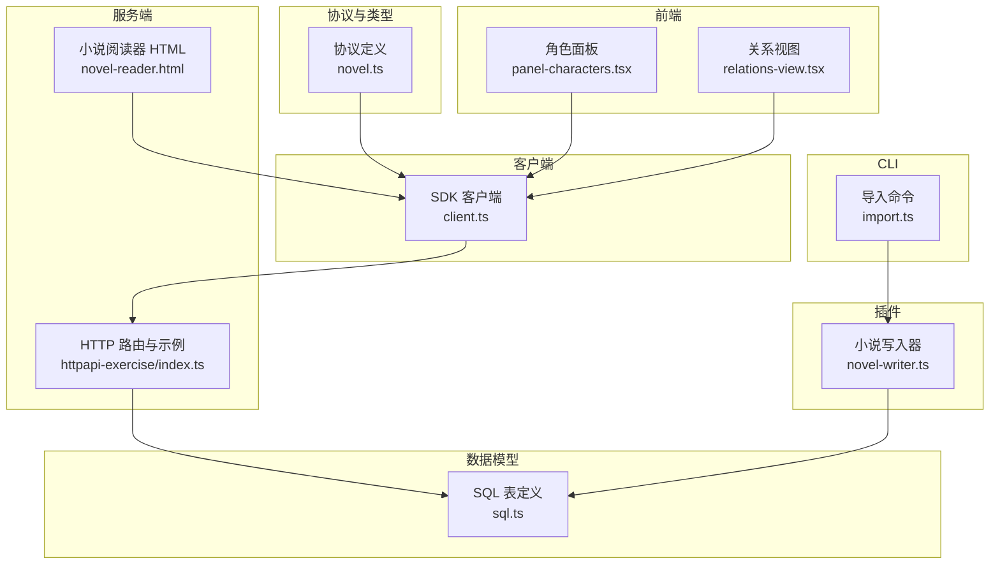
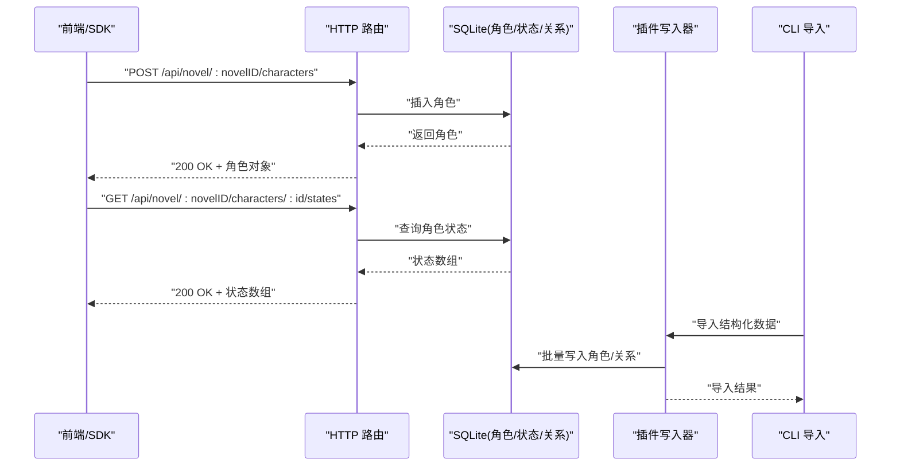
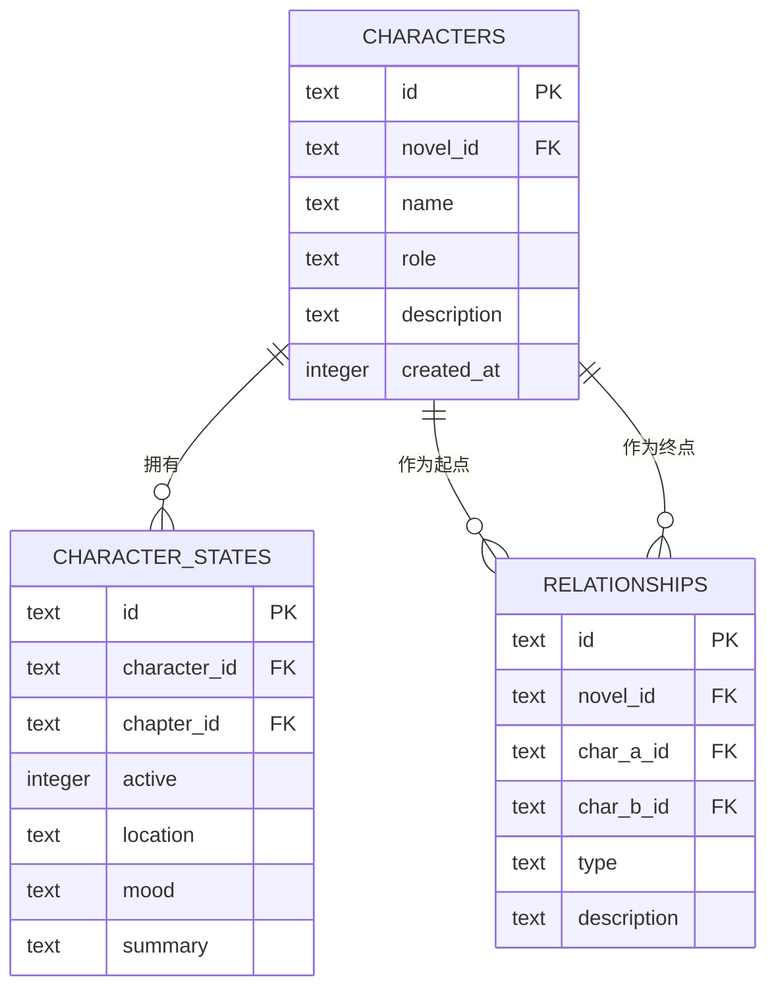
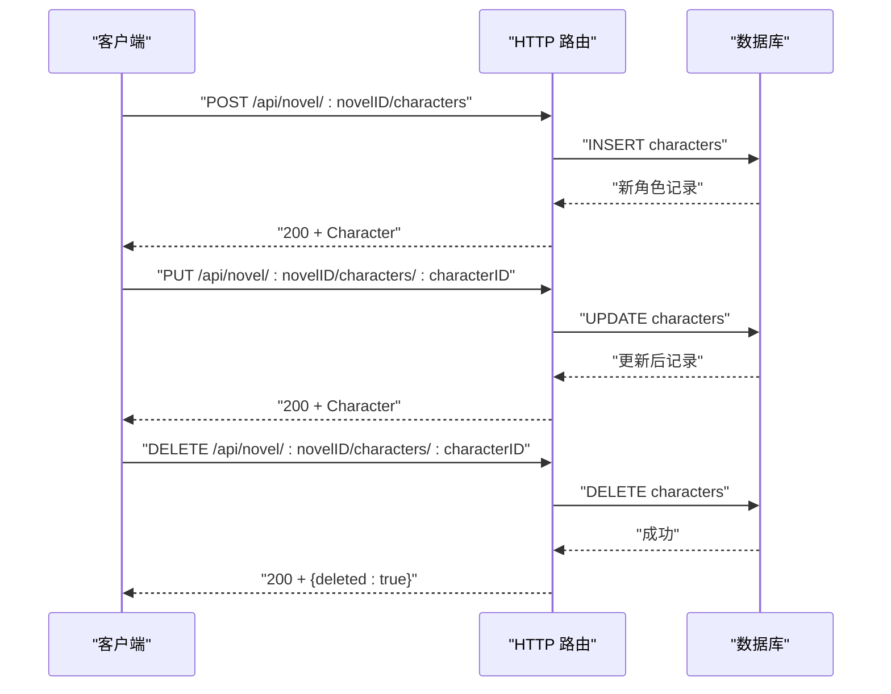
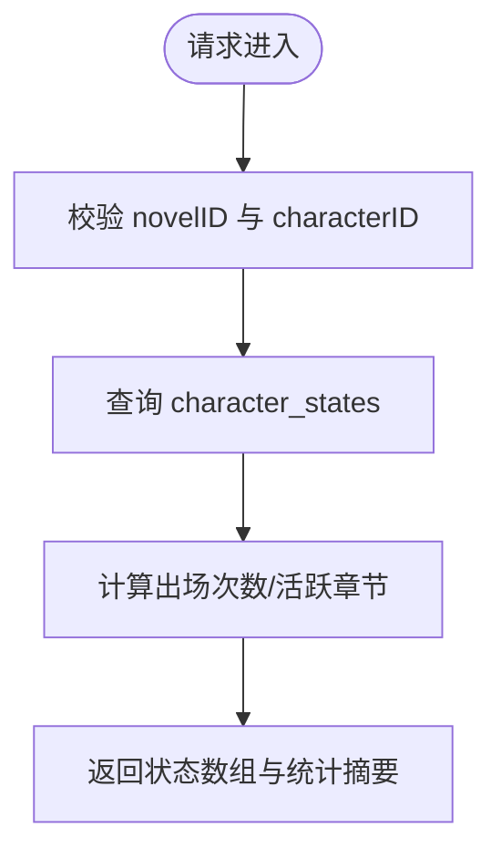
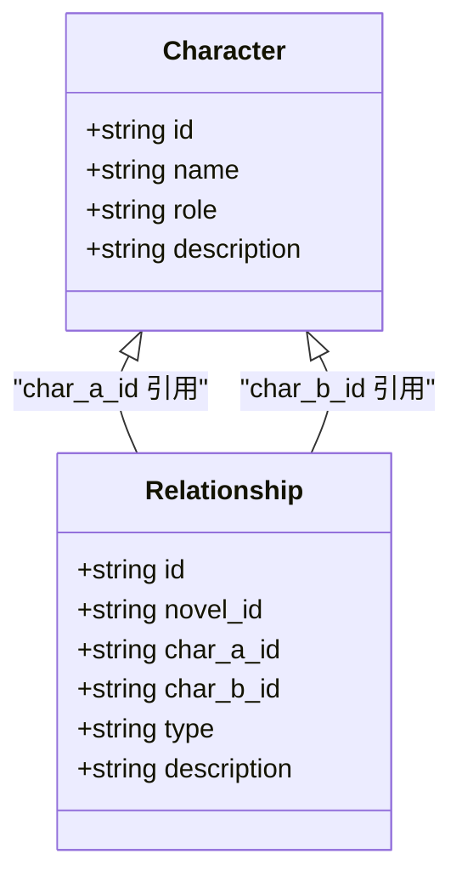
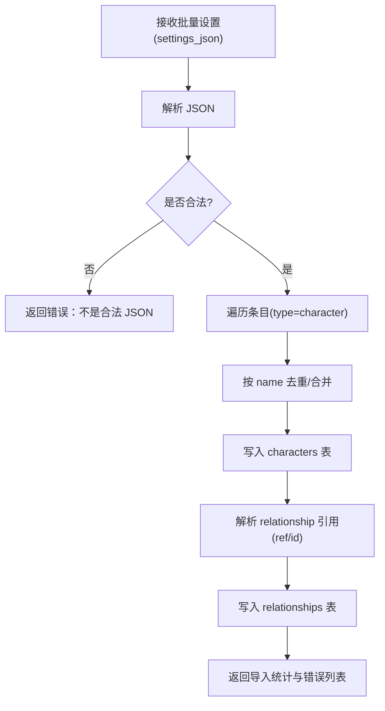
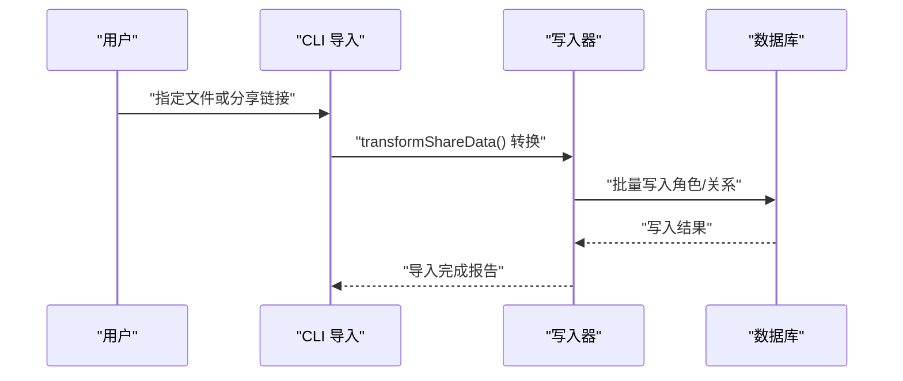
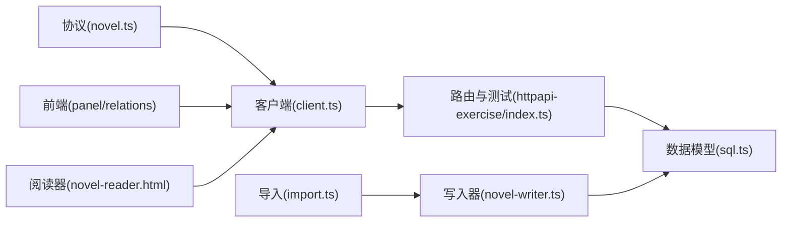

# 角色管理 API

<cite>
**本文引用的文件**   
- [packages/core/src/session/sql.ts](file://packages/core/src/session/sql.ts)
- [packages/protocol/src/groups/novel.ts](file://packages/protocol/src/groups/novel.ts)
- [packages/client/src/generated-effect/client.ts](file://packages/client/src/generated-effect/client.ts)
- [packages/opencode/test/server/httpapi-exercise/index.ts](file://packages/opencode/test/server/httpapi-exercise/index.ts)
- [packages/plugin/src/novel-writer.ts](file://packages/plugin/src/novel-writer.ts)
- [packages/app/src/pages/novel/panel-characters.tsx](file://packages/app/src/pages/novel/panel-characters.tsx)
- [packages/app/src/pages/novel/relations-view.tsx](file://packages/app/src/pages/novel/relations-view.tsx)
- [packages/opencode/src/server/routes/instance/httpapi/novel-reader.html](file://packages/opencode/src/server/routes/instance/httpapi/novel-reader.html)
- [packages/opencode/src/cli/cmd/import.ts](file://packages/opencode/src/cli/cmd/import.ts)
</cite>

## 目录
1. [简介](#简介)
2. [项目结构](#项目结构)
3. [核心组件](#核心组件)
4. [架构总览](#架构总览)
5. [详细组件分析](#详细组件分析)
6. [依赖关系分析](#依赖关系分析)
7. [性能考量](#性能考量)
8. [故障排查指南](#故障排查指南)
9. [结论](#结论)
10. [附录](#附录)

## 简介
本文件为“角色管理”功能的 API 文档，覆盖角色的 CRUD、角色关系图谱构建与维护、出场统计与追踪、搜索筛选与批量操作、以及导入导出功能。读者可据此了解接口定义、数据模型、调用流程与最佳实践。

## 项目结构
角色管理相关能力分布在协议定义、客户端 SDK、服务端路由与测试用例、插件工具（写入器）、前端页面与阅读器中：
- 协议与类型：在协议层定义角色、角色状态、关系等数据结构及 HTTP 端点。
- 客户端 SDK：根据协议生成可直接调用的方法。
- 服务端实现：通过路由暴露 REST 接口，并驱动数据库访问。
- 插件写入器：提供 manage_characters 工具，支持新增/更新角色、描述归档与引用扫描。
- 前端与阅读器：展示角色列表、详情、关系图与统计信息。
- CLI 导入：支持从文件或分享链接导入结构化数据。

图表来源 
- [packages/protocol/src/groups/novel.ts](file://packages/protocol/src/groups/novel.ts)
- [packages/client/src/generated-effect/client.ts](file://packages/client/src/generated-effect/client.ts)
- [packages/opencode/test/server/httpapi-exercise/index.ts](file://packages/opencode/test/server/httpapi-exercise/index.ts)
- [packages/opencode/src/server/routes/instance/httpapi/novel-reader.html](file://packages/opencode/src/server/routes/instance/httpapi/novel-reader.html)
- [packages/plugin/src/novel-writer.ts](file://packages/plugin/src/novel-writer.ts)
- [packages/app/src/pages/novel/panel-characters.tsx](file://packages/app/src/pages/novel/panel-characters.tsx)
- [packages/app/src/pages/novel/relations-view.tsx](file://packages/app/src/pages/novel/relations-view.tsx)
- [packages/core/src/session/sql.ts](file://packages/core/src/session/sql.ts)

章节来源
- [packages/core/src/session/sql.ts:272-334](file://packages/core/src/session/sql.ts#L272-L334)
- [packages/protocol/src/groups/novel.ts:704-737](file://packages/protocol/src/groups/novel.ts#L704-L737)

## 核心组件
- 数据模型
  - 角色表 characters：id、novel_id、name、role、description、created_at
  - 角色状态表 character_states：id、character_id、chapter_id、active、location、mood、summary
  - 关系表 relationships：id、novel_id、char_a_id、char_b_id、type、description
- API 端点（节选）
  - GET /api/novel/:novelID/characters
  - POST /api/novel/:novelID/characters
  - PUT /api/novel/:novelID/characters/:characterID
  - DELETE /api/novel/:novelID/characters/:characterID
  - GET /api/novel/:novelID/characters/:characterID/states
  - GET /api/novel/:novelID/character-states
- 插件工具
  - manage_characters：新增/更新角色、描述长度保护与归档、引用扫描、冲突合并
- 前端与阅读器
  - 角色列表与详情编辑
  - 关系图可视化（节点度排序、直接关系标注）
- CLI 导入
  - 从本地文件或分享链接导入结构化数据

章节来源
- [packages/core/src/session/sql.ts:272-334](file://packages/core/src/session/sql.ts#L272-L334)
- [packages/protocol/src/groups/novel.ts:704-737](file://packages/protocol/src/groups/novel.ts#L704-L737)
- [packages/plugin/src/novel-writer.ts:433-531](file://packages/plugin/src/novel-writer.ts#L433-L531)
- [packages/app/src/pages/novel/panel-characters.tsx:278-329](file://packages/app/src/pages/novel/panel-characters.tsx#L278-L329)
- [packages/app/src/pages/novel/relations-view.tsx:106-197](file://packages/app/src/pages/novel/relations-view.tsx#L106-L197)
- [packages/opencode/src/server/routes/instance/httpapi/novel-reader.html:1901-1938](file://packages/opencode/src/server/routes/instance/httpapi/novel-reader.html#L1901-L1938)
- [packages/opencode/src/cli/cmd/import.ts:121-165](file://packages/opencode/src/cli/cmd/import.ts#L121-L165)

## 架构总览
角色管理的请求流从前端或 SDK 发起，经 HTTP 路由进入服务层，读写数据库；插件侧的写入器提供高级写入能力（如描述归档、引用扫描），CLI 负责导入。

图表来源 
- [packages/protocol/src/groups/novel.ts:704-737](file://packages/protocol/src/groups/novel.ts#L704-L737)
- [packages/opencode/test/server/httpapi-exercise/index.ts:1975-1996](file://packages/opencode/test/server/httpapi-exercise/index.ts#L1975-L1996)
- [packages/plugin/src/novel-writer.ts:1180-1236](file://packages/plugin/src/novel-writer.ts#L1180-L1236)
- [packages/opencode/src/cli/cmd/import.ts:121-165](file://packages/opencode/src/cli/cmd/import.ts#L121-L165)

## 详细组件分析

### 数据模型与关系图谱
- 角色（characters）
  - 字段：id、novel_id、name、role、description、created_at
  - 索引：按 novel_id 建立索引
- 角色状态（character_states）
  - 字段：id、character_id、chapter_id、active、location、mood、summary
  - 索引：character_id、chapter_id
- 关系（relationships）
  - 字段：id、novel_id、char_a_id、char_b_id、type、description
  - 索引：novel_id、char_a_id、char_b_id

图表来源 
- [packages/core/src/session/sql.ts:272-334](file://packages/core/src/session/sql.ts#L272-L334)

章节来源
- [packages/core/src/session/sql.ts:272-334](file://packages/core/src/session/sql.ts#L272-L334)

### 角色 CRUD 接口
- 创建角色
  - 方法：POST
  - 路径：/api/novel/:novelID/characters
  - 入参：CreateCharacterInput（包含 name、role、description 等）
  - 返回：Character
- 更新角色
  - 方法：PUT
  - 路径：/api/novel/:novelID/characters/:characterID
  - 入参：UpdateCharacterInput（部分字段可选）
  - 返回：Character
- 删除角色
  - 方法：DELETE
  - 路径：/api/novel/:novelID/characters/:characterID
  - 返回：{ deleted: boolean }
- 列出角色
  - 方法：GET
  - 路径：/api/novel/:novelID/characters
  - 返回：Character[]

图表来源 
- [packages/protocol/src/groups/novel.ts:704-737](file://packages/protocol/src/groups/novel.ts#L704-L737)
- [packages/opencode/test/server/httpapi-exercise/index.ts:2156-2165](file://packages/opencode/test/server/httpapi-exercise/index.ts#L2156-L2165)
- [packages/opencode/test/server/httpapi-exercise/index.ts:2318-2321](file://packages/opencode/test/server/httpapi-exercise/index.ts#L2318-L2321)
- [packages/opencode/test/server/httpapi-exercise/index.ts:2450-2454](file://packages/opencode/test/server/httpapi-exercise/index.ts#L2450-L2454)

章节来源
- [packages/protocol/src/groups/novel.ts:704-737](file://packages/protocol/src/groups/novel.ts#L704-L737)
- [packages/opencode/test/server/httpapi-exercise/index.ts:2156-2165](file://packages/opencode/test/server/httpapi-exercise/index.ts#L2156-L2165)
- [packages/opencode/test/server/httpapi-exercise/index.ts:2318-2321](file://packages/opencode/test/server/httpapi-exercise/index.ts#L2318-L2321)
- [packages/opencode/test/server/httpapi-exercise/index.ts:2450-2454](file://packages/opencode/test/server/httpapi-exercise/index.ts#L2450-L2454)

### 角色状态与出场统计
- 列出某角色在各章的状态
  - 方法：GET
  - 路径：/api/novel/:novelID/characters/:characterID/states
  - 返回：CharacterState[]
- 列出小说内所有角色状态
  - 方法：GET
  - 路径：/api/novel/:novelID/character-states
  - 返回：CharacterState[]

图表来源 
- [packages/protocol/src/groups/novel.ts:529-558](file://packages/protocol/src/groups/novel.ts#L529-L558)
- [packages/opencode/test/server/httpapi-exercise/index.ts:1983-1996](file://packages/opencode/test/server/httpapi-exercise/index.ts#L1983-L1996)

章节来源
- [packages/protocol/src/groups/novel.ts:529-558](file://packages/protocol/src/groups/novel.ts#L529-L558)
- [packages/opencode/test/server/httpapi-exercise/index.ts:1983-1996](file://packages/opencode/test/server/httpapi-exercise/index.ts#L1983-L1996)

### 角色关系图谱构建与维护
- 关系字段
  - type：关系类型（如“亲属”、“敌对”等）
  - description：关系描述
- 构建方式
  - 通过 relationships 表维护双向关联（char_a_id、char_b_id）
  - 前端以中心节点展开直接邻居，边标签显示关系类型
- 维护要点
  - 新增/更新/删除关系需保证两端角色存在
  - 关系类型建议统一枚举，便于前端着色与排序

图表来源 
- [packages/core/src/session/sql.ts:312-334](file://packages/core/src/session/sql.ts#L312-L334)
- [packages/app/src/pages/novel/relations-view.tsx:106-197](file://packages/app/src/pages/novel/relations-view.tsx#L106-L197)

章节来源
- [packages/core/src/session/sql.ts:312-334](file://packages/core/src/session/sql.ts#L312-L334)
- [packages/app/src/pages/novel/relations-view.tsx:106-197](file://packages/app/src/pages/novel/relations-view.tsx#L106-L197)

### 搜索、筛选与批量操作
- 搜索与筛选
  - 当前协议未定义专用搜索端点；可在上层通过名称、角色、时间范围等条件过滤已获取的角色列表
- 批量操作
  - 使用插件写入器的 manage_characters 工具进行批量新增/更新，支持重复检测与合并
  - 支持设置 settings_json 批量导入角色与关系

图表来源 
- [packages/plugin/src/novel-writer.ts:1180-1236](file://packages/plugin/src/novel-writer.ts#L1180-L1236)
- [packages/plugin/src/novel-writer.ts:2397-2421](file://packages/plugin/src/novel-writer.ts#L2397-L2421)

章节来源
- [packages/plugin/src/novel-writer.ts:1180-1236](file://packages/plugin/src/novel-writer.ts#L1180-L1236)
- [packages/plugin/src/novel-writer.ts:2397-2421](file://packages/plugin/src/novel-writer.ts#L2397-L2421)

### 导入与导出规范
- 导入
  - CLI 可从本地文件或分享链接读取结构化数据，转换为内部格式后交由写入器处理
  - 写入器支持 settings_json 中的 character 与 relationship 条目
- 导出
  - 前端与阅读器会拉取 characters 与 relationships 用于展示与关系图绘制
  - 导出格式建议遵循 schema.json 中字符与关系的字段定义

图表来源 
- [packages/opencode/src/cli/cmd/import.ts:121-165](file://packages/opencode/src/cli/cmd/import.ts#L121-L165)
- [packages/plugin/src/novel-writer.ts:1180-1236](file://packages/plugin/src/novel-writer.ts#L1180-L1236)

章节来源
- [packages/opencode/src/cli/cmd/import.ts:121-165](file://packages/opencode/src/cli/cmd/import.ts#L121-L165)
- [packages/plugin/src/novel-writer.ts:1180-1236](file://packages/plugin/src/novel-writer.ts#L1180-L1236)

### 前端与阅读器的角色展示
- 角色面板
  - 支持编辑 name、role、description，调用更新接口保存
- 关系视图
  - 基于 characters 与 relationships 渲染中心节点与邻居，边标签显示关系类型
- 阅读器
  - 拉取 characters 与 relationships 数据，渲染角色卡片与关系图

章节来源
- [packages/app/src/pages/novel/panel-characters.tsx:278-329](file://packages/app/src/pages/novel/panel-characters.tsx#L278-L329)
- [packages/app/src/pages/novel/relations-view.tsx:106-197](file://packages/app/src/pages/novel/relations-view.tsx#L106-L197)
- [packages/opencode/src/server/routes/instance/httpapi/novel-reader.html:1901-1938](file://packages/opencode/src/server/routes/instance/httpapi/novel-reader.html#L1901-L1938)

## 依赖关系分析
- 协议层定义了角色、状态、关系的结构与端点标识
- 客户端 SDK 由协议自动生成，封装了各端点的调用
- 服务端路由与测试用例展示了端点的使用方式与响应结构
- 插件写入器依赖数据库表结构，提供高级写入逻辑
- 前端与阅读器依赖 SDK 与数据模型进行展示与交互

图表来源 
- [packages/protocol/src/groups/novel.ts](file://packages/protocol/src/groups/novel.ts)
- [packages/client/src/generated-effect/client.ts](file://packages/client/src/generated-effect/client.ts)
- [packages/opencode/test/server/httpapi-exercise/index.ts](file://packages/opencode/test/server/httpapi-exercise/index.ts)
- [packages/core/src/session/sql.ts](file://packages/core/src/session/sql.ts)
- [packages/plugin/src/novel-writer.ts](file://packages/plugin/src/novel-writer.ts)
- [packages/app/src/pages/novel/panel-characters.tsx](file://packages/app/src/pages/novel/panel-characters.tsx)
- [packages/app/src/pages/novel/relations-view.tsx](file://packages/app/src/pages/novel/relations-view.tsx)
- [packages/opencode/src/server/routes/instance/httpapi/novel-reader.html](file://packages/opencode/src/server/routes/instance/httpapi/novel-reader.html)
- [packages/opencode/src/cli/cmd/import.ts](file://packages/opencode/src/cli/cmd/import.ts)

## 性能考量
- 索引优化
  - characters.novel_id、character_states.character_id、character_states.chapter_id、relationships.novel_id/char_a_id/char_b_id 均已建索引，利于常见查询
- 批量写入
  - 使用写入器的 settings_json 批量导入可减少往返与事务开销
- 前端渲染
  - 关系图按邻居数量排序中心节点，避免大图渲染卡顿

[本节为通用指导，不直接分析具体文件]

## 故障排查指南
- 描述长度保护
  - 当新描述比旧描述短超过一半时，写入器会拦截并提示保留原文，防止信息丢失
- JSON 校验
  - settings_json 必须为合法 JSON，否则返回错误
- 关系引用歧义
  - 若通过姓名匹配到多个角色，需使用 ref 明确区分

章节来源
- [packages/plugin/src/novel-writer.ts:487-531](file://packages/plugin/src/novel-writer.ts#L487-L531)
- [packages/plugin/src/novel-writer.ts:1180-1185](file://packages/plugin/src/novel-writer.ts#L1180-L1185)
- [packages/plugin/src/novel-writer.ts:2397-2421](file://packages/plugin/src/novel-writer.ts#L2397-L2421)

## 结论
角色管理 API 围绕 characters、character_states、relationships 三张核心表展开，提供完整的 CRUD、状态查询与关系可视化能力。插件写入器与 CLI 导入增强了批量处理能力与数据一致性保障。建议在生产环境中结合索引与批量写入策略，确保性能与可靠性。

## 附录
- 常用端点速查
  - GET /api/novel/:novelID/characters
  - POST /api/novel/:novelID/characters
  - PUT /api/novel/:novelID/characters/:characterID
  - DELETE /api/novel/:novelID/characters/:characterID
  - GET /api/novel/:novelID/characters/:characterID/states
  - GET /api/novel/:novelID/character-states

章节来源
- [packages/protocol/src/groups/novel.ts:704-737](file://packages/protocol/src/groups/novel.ts#L704-L737)
- [packages/opencode/test/server/httpapi-exercise/index.ts:1975-1996](file://packages/opencode/test/server/httpapi-exercise/index.ts#L1975-L1996)