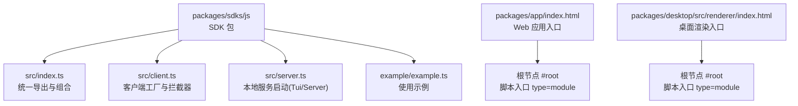
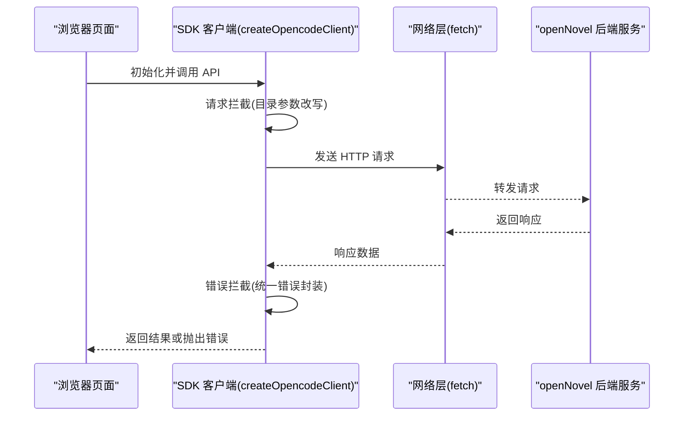
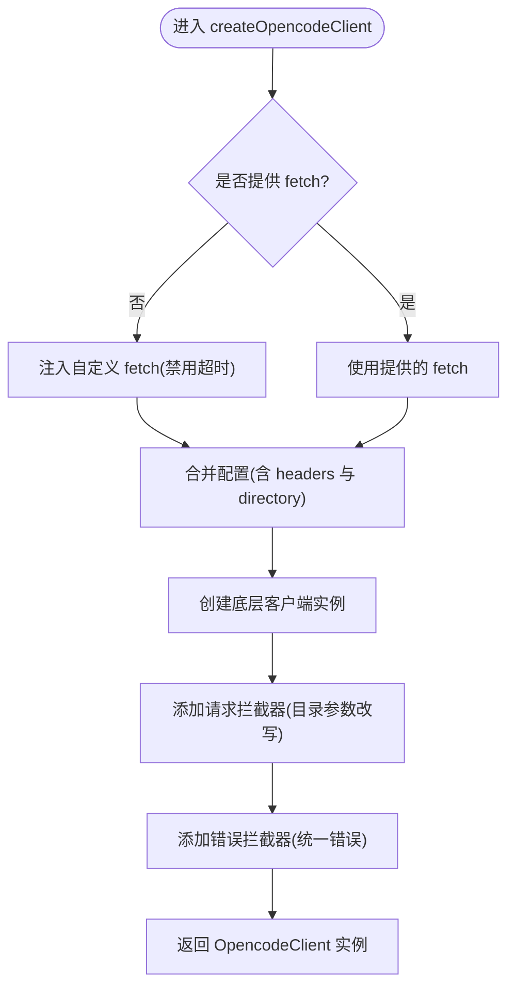
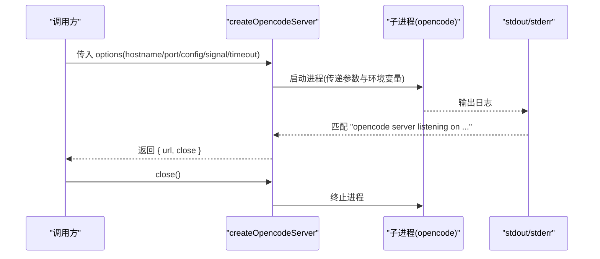
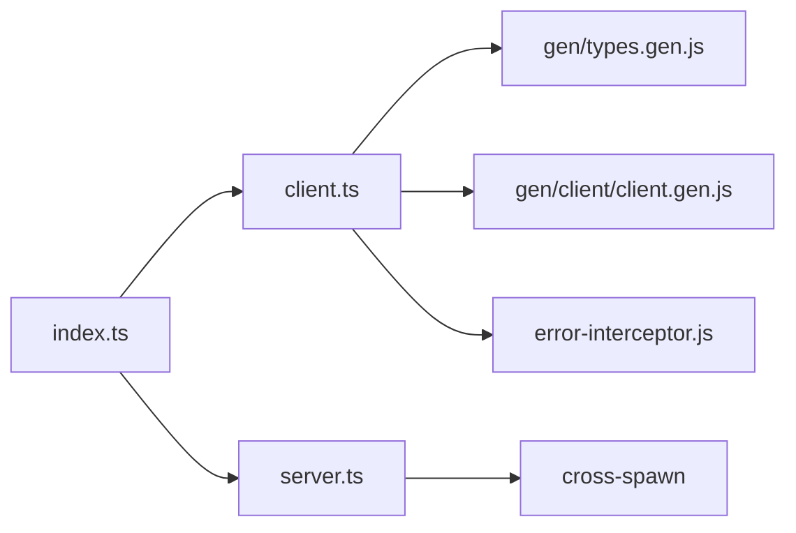

# 浏览器 SDK

<cite>
**本文引用的文件**   
- [packages/sdks/js/package.json](file://packages/sdks/js/package.json)
- [packages/sdks/js/src/index.ts](file://packages/sdks/js/src/index.ts)
- [packages/sdks/js/src/client.ts](file://packages/sdks/js/src/client.ts)
- [packages/sdks/js/src/server.ts](file://packages/sdks/js/src/server.ts)
- [packages/sdks/js/example/example.ts](file://packages/sdks/js/example/example.ts)
- [packages/app/index.html](file://packages/app/index.html)
- [packages/desktop/src/renderer/index.html](file://packages/desktop/src/renderer/index.html)
</cite>

## 目录
1. [简介](#简介)
2. [项目结构](#项目结构)
3. [核心组件](#核心组件)
4. [架构总览](#架构总览)
5. [详细组件分析](#详细组件分析)
6. [依赖关系分析](#依赖关系分析)
7. [性能考虑](#性能考虑)
8. [故障排查指南](#故障排查指南)
9. [结论](#结论)
10. [附录](#附录)

## 简介
本文件为 openNovel 浏览器 SDK 的使用与集成文档，面向前端环境，涵盖：
- 引入方式：CDN、模块导入与打包配置建议
- 跨域与安全限制
- 浏览器兼容性要点
- DOM 操作、事件处理与用户交互示例思路
- 存储策略、离线支持与缓存机制建议
- 移动端适配、响应式设计与用户体验优化建议

说明：当前仓库中的 SDK 包以 Node.js 服务端启动能力为主（通过子进程启动本地服务），浏览器端可直接使用客户端工厂函数发起 HTTP 请求。若需纯浏览器运行，请仅使用客户端相关 API，避免调用需要 Node 环境的服务器启动方法。

## 项目结构
SDK 包位于 packages/sdks/js，提供导出入口、客户端与服务端工厂函数以及示例代码。应用入口 HTML 展示了现代 Web 应用的典型结构与移动端元信息。

图表来源 
- [packages/sdks/js/src/index.ts:1-22](file://packages/sdks/js/src/index.ts#L1-L22)
- [packages/sdks/js/src/client.ts:1-58](file://packages/sdks/js/src/client.ts#L1-L58)
- [packages/sdks/js/src/server.ts:1-135](file://packages/sdks/js/src/server.ts#L1-L135)
- [packages/sdks/js/example/example.ts:1-57](file://packages/sdks/js/example/example.ts#L1-L57)
- [packages/app/index.html:1-28](file://packages/app/index.html#L1-L28)
- [packages/desktop/src/renderer/index.html:1-21](file://packages/desktop/src/renderer/index.html#L1-L21)

章节来源
- [packages/sdks/js/package.json:1-37](file://packages/sdks/js/package.json#L1-L37)
- [packages/app/index.html:1-28](file://packages/app/index.html#L1-L28)
- [packages/desktop/src/renderer/index.html:1-21](file://packages/desktop/src/renderer/index.html#L1-L21)

## 核心组件
- 客户端工厂 createOpencodeClient
  - 负责创建 SDK 客户端实例，支持自定义 fetch、baseUrl、headers 等配置
  - 内置请求重写逻辑，将目录参数从请求头迁移到查询参数，便于代理或网关转发
  - 错误拦截器包装，统一错误形态
- 服务端工厂 createOpencodeServer / createOpencodeTui
  - 通过子进程启动本地 opencode 服务或 TUI 模式
  - 监听输出解析服务地址，超时与退出错误处理完善
  - 支持 AbortSignal 控制生命周期
- 统一入口 createOpencode
  - 同时启动本地服务并返回 client/server 对象，适合 Node 环境快速集成

章节来源
- [packages/sdks/js/src/client.ts:1-58](file://packages/sdks/js/src/client.ts#L1-L58)
- [packages/sdks/js/src/server.ts:1-135](file://packages/sdks/js/src/server.ts#L1-L135)
- [packages/sdks/js/src/index.ts:1-22](file://packages/sdks/js/src/index.ts#L1-L22)

## 架构总览
下图展示浏览器端通过 SDK 客户端访问后端服务的整体流程，包括请求重写与错误拦截。

图表来源 
- [packages/sdks/js/src/client.ts:1-58](file://packages/sdks/js/src/client.ts#L1-L58)

## 详细组件分析

### 客户端工厂 createOpencodeClient
- 功能要点
  - 若未传入 fetch，则注入一个禁用超时的自定义 fetch 包装
  - 支持在配置中设置 directory，自动写入请求头 x-opencode-directory
  - 请求拦截器将 GET/HEAD 请求的目录参数从请求头迁移至 URL 查询参数 directory
  - 错误拦截器对客户端错误进行统一包装
- 适用场景
  - 浏览器端直接调用后端 API
  - 需要通过代理或网关转发时，利用目录参数改写简化路由规则

图表来源 
- [packages/sdks/js/src/client.ts:1-58](file://packages/sdks/js/src/client.ts#L1-L58)

章节来源
- [packages/sdks/js/src/client.ts:1-58](file://packages/sdks/js/src/client.ts#L1-L58)

### 服务端工厂 createOpencodeServer / createOpencodeTui
- 功能要点
  - 启动本地 opencode 服务或 TUI 模式，解析标准输出获取服务地址
  - 支持超时、AbortSignal、环境变量注入 OPENCODE_CONFIG_CONTENT
  - 提供 close() 方法安全关闭进程
- 适用场景
  - Node.js 环境下快速启动本地服务并与 SDK 客户端联调
  - 自动化测试或开发工具链集成

图表来源 
- [packages/sdks/js/src/server.ts:1-135](file://packages/sdks/js/src/server.ts#L1-L135)

章节来源
- [packages/sdks/js/src/server.ts:1-135](file://packages/sdks/js/src/server.ts#L1-L135)

### 统一入口 createOpencode
- 功能要点
  - 同时启动本地服务并创建客户端，返回 { client, server }
  - 适用于 Node 环境的一体化集成
- 适用场景
  - 本地调试、演示或内网部署的快速搭建

章节来源
- [packages/sdks/js/src/index.ts:1-22](file://packages/sdks/js/src/index.ts#L1-L22)

### 示例 usage example.ts
- 功能要点
  - 启动本地服务并创建客户端
  - 并发处理多个任务，演示 session 创建与 prompt 调用
- 适用场景
  - 批量处理文件或并行调用 API 的场景参考

章节来源
- [packages/sdks/js/example/example.ts:1-57](file://packages/sdks/js/example/example.ts#L1-L57)

### 概念性概览（非代码映射）
- 浏览器端最佳实践
  - 仅使用客户端工厂 createOpencodeClient
  - 通过 baseUrl 指向后端服务域名，必要时配置 CORS
  - 使用统一的错误处理与重试策略
  - 结合 Service Worker 实现缓存与离线能力

[本节为概念性内容，不直接分析具体文件]

## 依赖关系分析
SDK 包的导出路径与依赖如下：
- 导出入口 index.ts 聚合 client 与 server 模块
- client.ts 依赖生成的类型与客户端实现，并注入错误拦截器
- server.ts 依赖 cross-spawn 启动子进程，并通过 stdout 解析服务地址

图表来源 
- [packages/sdks/js/src/index.ts:1-22](file://packages/sdks/js/src/index.ts#L1-L22)
- [packages/sdks/js/src/client.ts:1-58](file://packages/sdks/js/src/client.ts#L1-L58)
- [packages/sdks/js/src/server.ts:1-135](file://packages/sdks/js/src/server.ts#L1-L135)

章节来源
- [packages/sdks/js/package.json:1-37](file://packages/sdks/js/package.json#L1-L37)
- [packages/sdks/js/src/index.ts:1-22](file://packages/sdks/js/src/index.ts#L1-L22)

## 性能考虑
- 请求层面
  - 合理设置 baseUrl 与连接复用，减少握手开销
  - 对大体积响应启用流式读取或分页加载
- 客户端层面
  - 避免重复创建客户端实例，复用同一实例提升性能
  - 合理使用并发与队列，防止过多并发导致后端拥塞
- 网络层面
  - 启用 gzip/br 压缩
  - 使用 CDN 加速静态资源与 API 边缘缓存

[本节为通用指导，不直接分析具体文件]

## 故障排查指南
- 常见问题
  - 跨域错误：确保后端开启 CORS，允许 Origin、方法与头部
  - 目录参数问题：检查 x-opencode-directory 是否正确编码，确认拦截器已生效
  - 服务启动失败：检查超时时间、端口占用、环境变量 OPENCODE_CONFIG_CONTENT
  - 错误统一化：查看错误拦截器抛出的错误形态，定位上游原因
- 调试建议
  - 打印请求 URL、方法与头部，确认目录参数改写是否符合预期
  - 在服务端日志中搜索 “opencode server listening” 确认启动成功
  - 使用浏览器开发者工具的 Network 面板观察请求与响应

章节来源
- [packages/sdks/js/src/client.ts:1-58](file://packages/sdks/js/src/client.ts#L1-L58)
- [packages/sdks/js/src/server.ts:1-135](file://packages/sdks/js/src/server.ts#L1-L135)

## 结论
- 浏览器端应仅使用客户端工厂 createOpencodeClient，避免调用需要 Node 环境的服务器启动方法
- 通过 baseUrl 与 headers 配置对接后端服务，必要时启用 CORS
- 利用请求拦截器的目录参数改写简化代理与网关路由
- 结合 Service Worker 与缓存策略提升性能与离线体验
- 遵循移动端元信息与响应式设计规范，提升用户体验

[本节为总结性内容，不直接分析具体文件]

## 附录

### 引入方式与打包配置建议
- CDN 引入
  - 将 SDK 包发布到 CDN，在 HTML 中以 script 标签引入，注意全局命名空间与版本锁定
- 模块导入
  - 使用 import 语法引入 createOpencodeClient，配置 baseUrl 与 headers
- 打包配置
  - 在构建工具中排除 Node-only 依赖（如 cross-spawn）
  - 启用 tree-shaking 与按需加载，减小包体

[本节为通用指导，不直接分析具体文件]

### 跨域处理与安全限制
- 后端开启 CORS，允许必要的方法与头部
- 使用 HTTPS 传输，避免中间人攻击
- 对敏感信息进行最小权限原则，避免泄露

[本节为通用指导，不直接分析具体文件]

### 浏览器兼容性
- 现代浏览器均支持 ES Module、fetch、URL API
- 如需兼容旧版浏览器，建议使用 polyfill 与转译工具链

[本节为通用指导，不直接分析具体文件]

### DOM 操作、事件处理与用户交互示例思路
- 在页面中挂载根节点 #root，通过模块脚本初始化 SDK 客户端
- 监听按钮点击事件，触发 API 调用并更新 UI
- 使用异步状态管理，显示加载与错误状态

[本节为概念性内容，不直接分析具体文件]

### 存储策略、离线支持与缓存机制
- 使用 localStorage/sessionStorage 保存会话与配置
- 使用 Cache Storage 与 Service Worker 缓存 API 响应与静态资源
- 设计失效策略与冲突解决机制，保证数据一致性

[本节为通用指导，不直接分析具体文件]

### 移动端适配、响应式设计与用户体验优化
- 在 HTML 中设置 viewport 与主题色，适配移动端
- 使用弹性布局与媒体查询，适配不同屏幕尺寸
- 优化首屏加载与交互反馈，提升用户体验

章节来源
- [packages/app/index.html:1-28](file://packages/app/index.html#L1-L28)
- [packages/desktop/src/renderer/index.html:1-21](file://packages/desktop/src/renderer/index.html#L1-L21)