# 配置管理

<cite>
**本文引用的文件**   
- [packages/core/src/config/agent.ts](file://packages/core/src/config/agent.ts)
- [packages/core/src/config/attachments.ts](file://packages/core/src/config/attachments.ts)
- [packages/core/src/config/command.ts](file://packages/core/src/config/command.ts)
- [packages/core/src/config/compaction.ts](file://packages/core/src/config/compaction.ts)
- [packages/core/src/config/experimental.ts](file://packages/core/src/config/experimental.ts)
- [packages/core/src/config/formatter.ts](file://packages/core/src/config/formatter.ts)
- [packages/core/src/config/lsp.ts](file://packages/core/src/config/lsp.ts)
- [packages/core/src/config/markdown.ts](file://packages/core/src/config/markdown.ts)
- [packages/core/src/config/plugin/provider.ts](file://packages/core/src/config/plugin/provider.ts)
</cite>

## 目录
1. [简介](#简介)
2. [项目结构](#项目结构)
3. [核心组件](#核心组件)
4. [架构总览](#架构总览)
5. [详细组件分析](#详细组件分析)
6. [依赖关系分析](#依赖关系分析)
7. [性能考量](#性能考量)
8. [故障排查指南](#故障排查指南)
9. [结论](#结论)
10. [附录](#附录)

## 简介
本文件为 openNovel SDK 的配置管理提供系统化文档，覆盖配置项含义、默认值与有效范围、环境变量注入、配置文件格式、动态更新与热重载机制、验证与错误处理、以及安全与权限最佳实践。读者可据此在不同环境（开发、测试、生产）中正确配置并维护系统行为。

## 项目结构
配置模块位于 packages/core/src/config 下，按领域拆分多个子模块，每个子模块通过 Effect Schema 定义类型与校验规则，并通过统一的 ConfigProvider 机制进行加载与合并。插件层将配置中的提供者与环境变量映射到运行时集成方法。

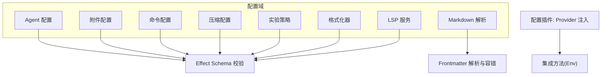

图表来源
- [packages/core/src/config/agent.ts:1-26](file://packages/core/src/config/agent.ts#L1-L26)
- [packages/core/src/config/attachments.ts:1-16](file://packages/core/src/config/attachments.ts#L1-L16)
- [packages/core/src/config/command.ts:1-13](file://packages/core/src/config/command.ts#L1-L13)
- [packages/core/src/config/compaction.ts:1-16](file://packages/core/src/config/compaction.ts#L1-L16)
- [packages/core/src/config/experimental.ts:1-19](file://packages/core/src/config/experimental.ts#L1-L19)
- [packages/core/src/config/formatter.ts:1-13](file://packages/core/src/config/formatter.ts#L1-L13)
- [packages/core/src/config/lsp.ts:1-19](file://packages/core/src/config/lsp.ts#L1-L19)
- [packages/core/src/config/markdown.ts:1-37](file://packages/core/src/config/markdown.ts#L1-L37)
- [packages/core/src/config/plugin/provider.ts:1-39](file://packages/core/src/config/plugin/provider.ts#L1-L39)

章节来源
- [packages/core/src/config/agent.ts:1-26](file://packages/core/src/config/agent.ts#L1-L26)
- [packages/core/src/config/attachments.ts:1-16](file://packages/core/src/config/attachments.ts#L1-L16)
- [packages/core/src/config/command.ts:1-13](file://packages/core/src/config/command.ts#L1-L13)
- [packages/core/src/config/compaction.ts:1-16](file://packages/core/src/config/compaction.ts#L1-L16)
- [packages/core/src/config/experimental.ts:1-19](file://packages/core/src/config/experimental.ts#L1-L19)
- [packages/core/src/config/formatter.ts:1-13](file://packages/core/src/config/formatter.ts#L1-L13)
- [packages/core/src/config/lsp.ts:1-19](file://packages/core/src/config/lsp.ts#L1-L19)
- [packages/core/src/config/markdown.ts:1-37](file://packages/core/src/config/markdown.ts#L1-L37)
- [packages/core/src/config/plugin/provider.ts:1-39](file://packages/core/src/config/plugin/provider.ts#L1-L39)

## 核心组件
- Agent 配置：模型、变体、请求参数、系统提示、描述、模式、颜色、步骤数、禁用标志与权限集等。
- 附件配置：图片自动缩放、最大宽高、Base64 大小限制等。
- 命令配置：模板、描述、关联 Agent/模型/变体、是否子任务等。
- 压缩配置：自动压缩、修剪、保留策略（如 token 上限）、缓冲大小等。
- 实验策略：扩展 Policy 动作集合，支持数组形式的策略列表。
- 格式化器：条目级开关、外部命令、环境变量、文件扩展名白名单等。
- LSP 服务：服务器命令、扩展名、禁用标记、环境变量、初始化参数等。
- Markdown 解析：frontmatter 解析与容错清洗，兼容未加引号的冒号值。
- Provider 插件：从文档配置中提取 providers.env，将其转换为 Env 方法的集成映射。

章节来源
- [packages/core/src/config/agent.ts:1-26](file://packages/core/src/config/agent.ts#L1-L26)
- [packages/core/src/config/attachments.ts:1-16](file://packages/core/src/config/attachments.ts#L1-L16)
- [packages/core/src/config/command.ts:1-13](file://packages/core/src/config/command.ts#L1-L13)
- [packages/core/src/config/compaction.ts:1-16](file://packages/core/src/config/compaction.ts#L1-L16)
- [packages/core/src/config/experimental.ts:1-19](file://packages/core/src/config/experimental.ts#L1-L19)
- [packages/core/src/config/formatter.ts:1-13](file://packages/core/src/config/formatter.ts#L1-L13)
- [packages/core/src/config/lsp.ts:1-19](file://packages/core/src/config/lsp.ts#L1-L19)
- [packages/core/src/config/markdown.ts:1-37](file://packages/core/src/config/markdown.ts#L1-L37)
- [packages/core/src/config/plugin/provider.ts:1-39](file://packages/core/src/config/plugin/provider.ts#L1-L39)

## 架构总览
配置加载与生效的关键流程如下：
- 文档配置被读取并解析（含 Markdown frontmatter）。
- 各域 Schema 对配置进行严格校验，确保字段类型与取值范围合法。
- Provider 插件扫描文档中的 providers 配置，提取 env 字段并生成 Env 方法的集成映射。
- 运行时通过统一的服务接口获取最终配置，供各子系统使用。

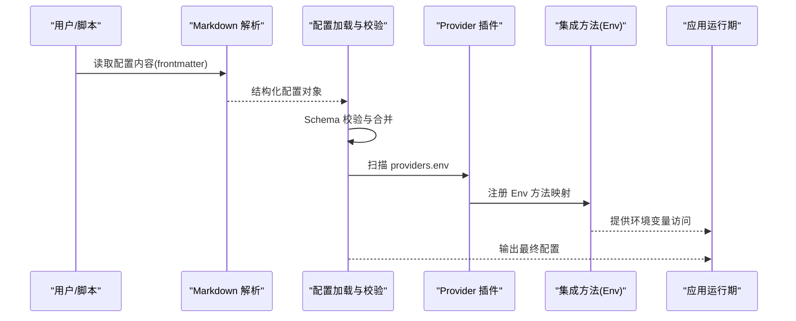

图表来源
- [packages/core/src/config/markdown.ts:1-37](file://packages/core/src/config/markdown.ts#L1-L37)
- [packages/core/src/config/plugin/provider.ts:1-39](file://packages/core/src/config/plugin/provider.ts#L1-L39)

## 详细组件分析

### Agent 配置
- 字段说明
  - model/variant：模型标识与变体名称，可选。
  - request：请求相关配置，来自 ConfigProvider.Request，可选。
  - system/description：系统提示与描述，可选。
  - mode：模式枚举，支持 subagent、primary、all，可选。
  - hidden/color：隐藏标志与主题色，color 支持十六进制或预定义关键字，可选。
  - steps：正整数，表示步骤数，可选。
  - disabled：布尔，禁用该 Agent，可选。
  - permissions：权限规则集，来自 @opencode-ai/schema/permission，可选。
- 默认值与范围
  - 所有字段均为可选；steps 为正整数；color 为十六进制或指定关键字；mode 为限定枚举。
- 使用建议
  - 在开发环境启用更多调试信息；在生产环境谨慎设置 permissions 与 disabled。

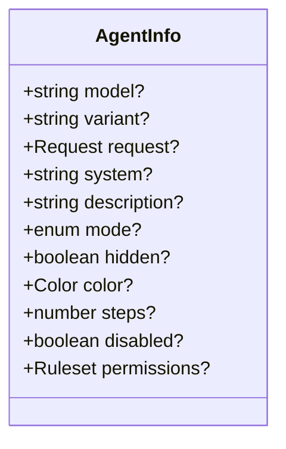

图表来源
- [packages/core/src/config/agent.ts:1-26](file://packages/core/src/config/agent.ts#L1-L26)

章节来源
- [packages/core/src/config/agent.ts:1-26](file://packages/core/src/config/agent.ts#L1-L26)

### 附件配置
- 字段说明
  - image.auto_resize：是否自动缩放，布尔，可选。
  - image.max_width/max_height：最大宽/高，正整数，可选。
  - image.max_base64_bytes：Base64 最大字节数，正整数，可选。
- 默认值与范围
  - 全部可选；数值型字段为正整数。
- 使用建议
  - 生产环境建议限制 max_base64_bytes 防止大附件导致内存压力。

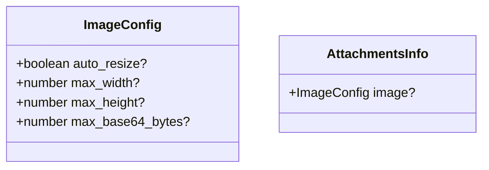

图表来源
- [packages/core/src/config/attachments.ts:1-16](file://packages/core/src/config/attachments.ts#L1-L16)

章节来源
- [packages/core/src/config/attachments.ts:1-16](file://packages/core/src/config/attachments.ts#L1-L16)

### 命令配置
- 字段说明
  - template：命令模板字符串，必填。
  - description：描述，可选。
  - agent/model/variant：关联的 Agent、模型与变体，可选。
  - subtask：是否为子任务，布尔，可选。
- 默认值与范围
  - 仅 template 必填；其余可选。
- 使用建议
  - 在测试环境可通过 subtask 控制执行粒度。

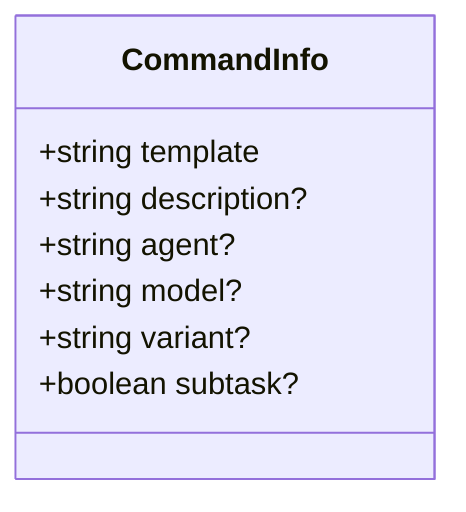

图表来源
- [packages/core/src/config/command.ts:1-13](file://packages/core/src/config/command.ts#L1-L13)

章节来源
- [packages/core/src/config/command.ts:1-13](file://packages/core/src/config/command.ts#L1-L13)

### 压缩配置
- 字段说明
  - auto/prune：是否自动压缩与修剪，布尔，可选。
  - keep.tokens：保留 token 阈值，非负整数，可选。
  - buffer：缓冲大小，非负整数，可选。
- 默认值与范围
  - 全部可选；keep.tokens 与 buffer 为非负整数。
- 使用建议
  - 生产环境建议开启 auto 与 prune，并合理设置 keep.tokens 以控制上下文长度。

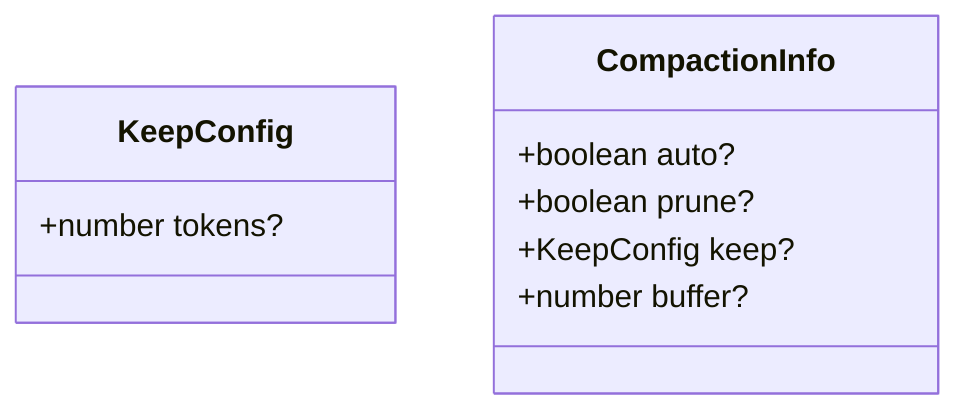

图表来源
- [packages/core/src/config/compaction.ts:1-16](file://packages/core/src/config/compaction.ts#L1-L16)

章节来源
- [packages/core/src/config/compaction.ts:1-16](file://packages/core/src/config/compaction.ts#L1-L16)

### 实验策略
- 字段说明
  - policies：策略数组，继承自 PolicyV2.Info.fields，并扩展 action 为 Catalog.PolicyActions 的联合类型。
- 默认值与范围
  - policies 可选；action 必须属于支持的策略动作集合。
- 使用建议
  - 仅在需要时启用实验策略，避免影响稳定性。

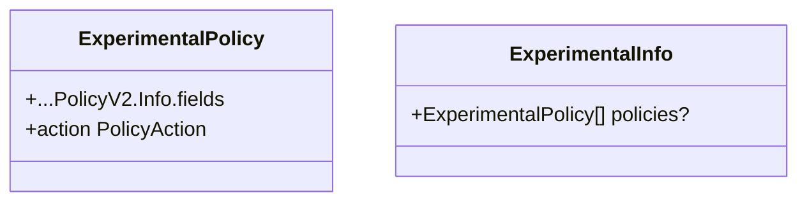

图表来源
- [packages/core/src/config/experimental.ts:1-19](file://packages/core/src/config/experimental.ts#L1-L19)

章节来源
- [packages/core/src/config/experimental.ts:1-19](file://packages/core/src/config/experimental.ts#L1-L19)

### 格式化器
- 字段说明
  - Entry.disabled：禁用该条目，布尔，可选。
  - Entry.command：外部命令数组，可选。
  - Entry.environment：键值对环境变量，可选。
  - Entry.extensions：支持的扩展名数组，可选。
  - Info：可为布尔或 Record<string, Entry>。
- 默认值与范围
  - 全部可选；extensions 为字符串数组。
- 使用建议
  - 通过 command 与 environment 实现外部工具链集成。

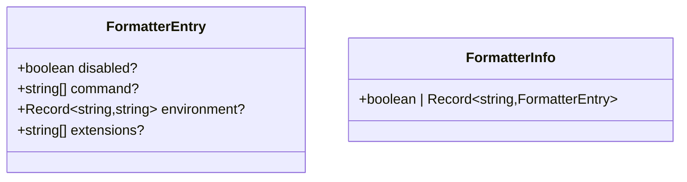

图表来源
- [packages/core/src/config/formatter.ts:1-13](file://packages/core/src/config/formatter.ts#L1-L13)

章节来源
- [packages/core/src/config/formatter.ts:1-13](file://packages/core/src/config/formatter.ts#L1-L13)

### LSP 服务
- 字段说明
  - Server.command：启动命令数组，必填。
  - Server.extensions：支持的扩展名数组，可选。
  - Server.disabled：禁用标志，布尔，可选。
  - Server.env：环境变量键值对，可选。
  - Server.initialization：初始化参数，任意类型记录，可选。
  - Entry：Disabled 或 Server 的联合。
  - Info：可为布尔或 Record<string, Entry>。
- 默认值与范围
  - command 必填；其余可选。
- 使用建议
  - 通过 initialization 传递语言服务器特定参数。

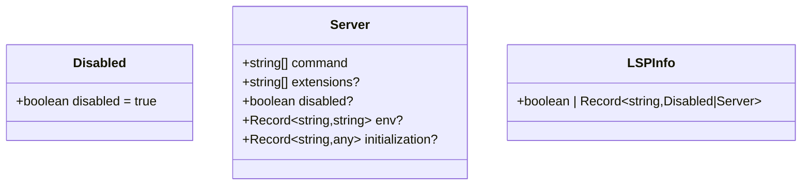

图表来源
- [packages/core/src/config/lsp.ts:1-19](file://packages/core/src/config/lsp.ts#L1-L19)

章节来源
- [packages/core/src/config/lsp.ts:1-19](file://packages/core/src/config/lsp.ts#L1-L19)

### Markdown 解析
- 功能说明
  - parse：解析 frontmatter，失败时回退至 sanitize 清洗后重试。
  - parseOption：封装 parse，捕获异常返回 undefined。
  - sanitize：修复未加引号的冒号值，使其兼容 YAML 块标量。
- 默认值与范围
  - 输入为字符串；输出为解析结果或原始内容。
- 使用建议
  - 在 CI 或自动化环境中建议使用 parseOption 以避免异常中断。

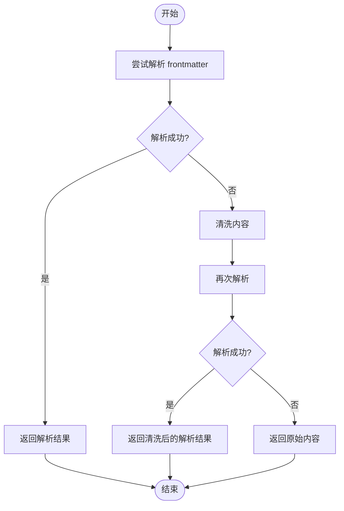

图表来源
- [packages/core/src/config/markdown.ts:1-37](file://packages/core/src/config/markdown.ts#L1-L37)

章节来源
- [packages/core/src/config/markdown.ts:1-37](file://packages/core/src/config/markdown.ts#L1-L37)

### Provider 插件（环境变量注入）
- 功能说明
  - 扫描文档配置中的 providers 字段，提取每个 provider 的 env 字段。
  - 将 env 列表转换为 Env 方法的集成映射，使运行时可按名称访问环境变量。
- 默认值与范围
  - 若 provider 未配置 env，则跳过该 provider。
- 使用建议
  - 在敏感环境中，确保 env 名称与密钥管理策略一致，避免硬编码。

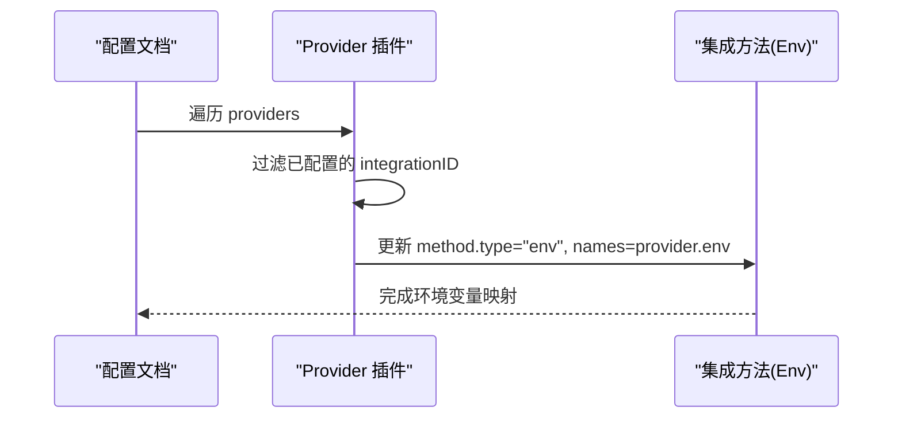

图表来源
- [packages/core/src/config/plugin/provider.ts:1-39](file://packages/core/src/config/plugin/provider.ts#L1-L39)

章节来源
- [packages/core/src/config/plugin/provider.ts:1-39](file://packages/core/src/config/plugin/provider.ts#L1-L39)

## 依赖关系分析
- 配置域之间相对独立，通过统一 Schema 校验与 ConfigProvider 接口解耦。
- Provider 插件依赖配置文档与集成方法，负责将配置转化为运行时能力。
- Markdown 解析为配置入口之一，保证兼容性并提升健壮性。

图表来源
- [packages/core/src/config/markdown.ts:1-37](file://packages/core/src/config/markdown.ts#L1-L37)
- [packages/core/src/config/plugin/provider.ts:1-39](file://packages/core/src/config/plugin/provider.ts#L1-L39)

章节来源
- [packages/core/src/config/markdown.ts:1-37](file://packages/core/src/config/markdown.ts#L1-L37)
- [packages/core/src/config/plugin/provider.ts:1-39](file://packages/core/src/config/plugin/provider.ts#L1-L39)

## 性能考量
- 压缩配置中的 auto/prune/buffer 直接影响上下文长度与内存占用，建议在大规模会话场景下调优。
- 附件 Base64 大小限制可避免大对象导致的内存峰值。
- Markdown 解析失败会触发清洗与重试，建议在批量处理时缓存解析结果。

[本节为通用指导，不直接分析具体文件]

## 故障排查指南
- 配置校验失败
  - 检查字段类型与取值范围是否符合 Schema 定义（如 steps 为正整数、mode 为限定枚举）。
- Markdown 解析异常
  - 确认 frontmatter 语法正确；必要时使用 sanitize 修复未加引号的冒号值。
- Provider 环境变量未生效
  - 检查 providers.env 是否正确列出环境变量名称；确认运行时存在对应环境变量。
- LSP 服务无法启动
  - 核对 command 数组与 extensions；检查 env 与 initialization 参数是否正确。

章节来源
- [packages/core/src/config/agent.ts:1-26](file://packages/core/src/config/agent.ts#L1-L26)
- [packages/core/src/config/attachments.ts:1-16](file://packages/core/src/config/attachments.ts#L1-L16)
- [packages/core/src/config/command.ts:1-13](file://packages/core/src/config/command.ts#L1-L13)
- [packages/core/src/config/compaction.ts:1-16](file://packages/core/src/config/compaction.ts#L1-L16)
- [packages/core/src/config/experimental.ts:1-19](file://packages/core/src/config/experimental.ts#L1-L19)
- [packages/core/src/config/formatter.ts:1-13](file://packages/core/src/config/formatter.ts#L1-L13)
- [packages/core/src/config/lsp.ts:1-19](file://packages/core/src/config/lsp.ts#L1-L19)
- [packages/core/src/config/markdown.ts:1-37](file://packages/core/src/config/markdown.ts#L1-L37)
- [packages/core/src/config/plugin/provider.ts:1-39](file://packages/core/src/config/plugin/provider.ts#L1-L39)

## 结论
openNovel SDK 的配置管理以领域化 Schema 为核心，结合 Markdown 解析与 Provider 插件的环境变量注入，形成稳定、可扩展且易于验证的配置体系。通过合理的默认值与范围约束，可在不同环境中快速落地并保障安全性与性能。

[本节为总结，不直接分析具体文件]

## 附录

### 环境变量与动态配置更新
- 环境变量注入
  - 通过 providers.env 声明所需环境变量名称，插件会自动映射为 Env 方法的集成。
- 动态更新
  - 配置变更需重新加载文档并触发 Schema 校验；Provider 插件会重新扫描并更新集成映射。
- 热重载机制
  - 当配置源发生变化时，应重新解析 Markdown 并刷新配置缓存，确保运行时一致性。

章节来源
- [packages/core/src/config/plugin/provider.ts:1-39](file://packages/core/src/config/plugin/provider.ts#L1-L39)
- [packages/core/src/config/markdown.ts:1-37](file://packages/core/src/config/markdown.ts#L1-L37)

### 不同环境的配置示例（要点）
- 开发环境
  - 启用更多调试信息与日志；可适当放宽附件大小限制；关闭部分压缩以提升交互速度。
- 测试环境
  - 使用子任务模式隔离执行；限制外部命令与扩展名白名单；启用压缩与修剪。
- 生产环境
  - 严格限制权限集与模型调用；启用自动压缩与修剪；限制 Base64 大小；最小化环境变量暴露。

[本节为概念性指导，不直接分析具体文件]

### 安全配置、密钥管理与权限控制最佳实践
- 密钥管理
  - 使用环境变量集中管理敏感信息；避免在配置文件中明文存储。
- 权限控制
  - 基于 Permission.Ruleset 精细控制 Agent 能力；在生产环境遵循最小权限原则。
- 输入校验
  - 依赖 Effect Schema 进行强类型校验；对非法输入快速失败并给出明确错误。
- 外部集成
  - 对外部命令与 LSP 服务进行白名单与参数校验；避免注入攻击。

章节来源
- [packages/core/src/config/agent.ts:1-26](file://packages/core/src/config/agent.ts#L1-L26)
- [packages/core/src/config/lsp.ts:1-19](file://packages/core/src/config/lsp.ts#L1-L19)
- [packages/core/src/config/formatter.ts:1-13](file://packages/core/src/config/formatter.ts#L1-L13)