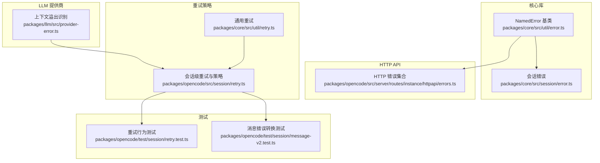
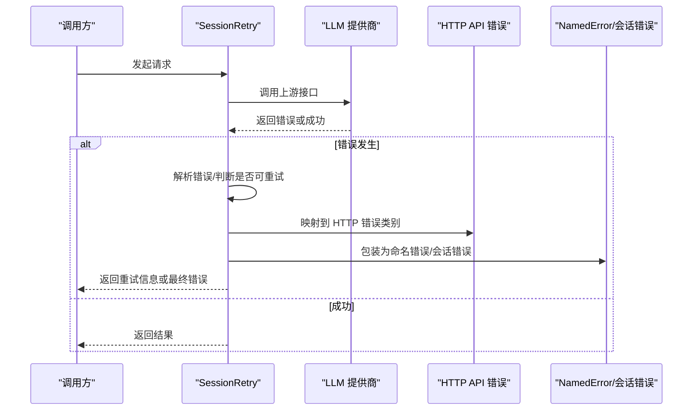
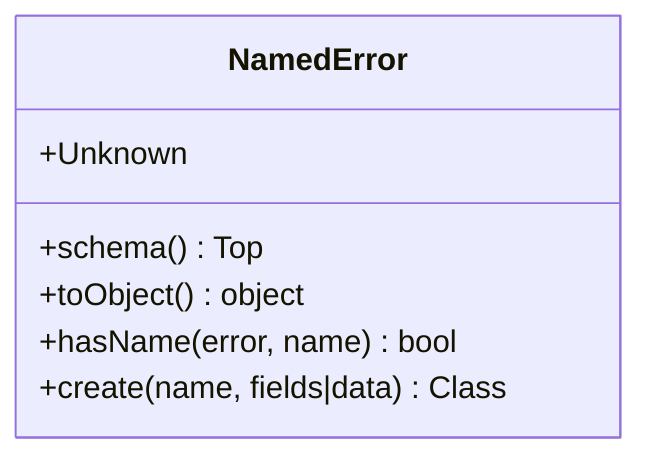
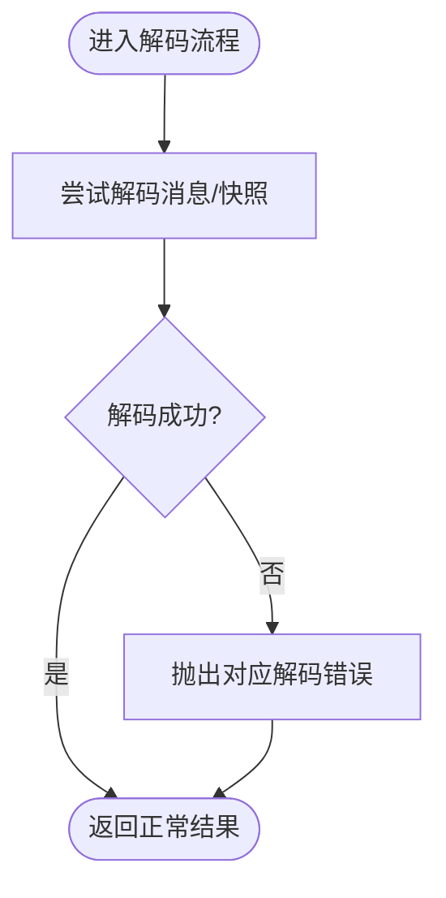
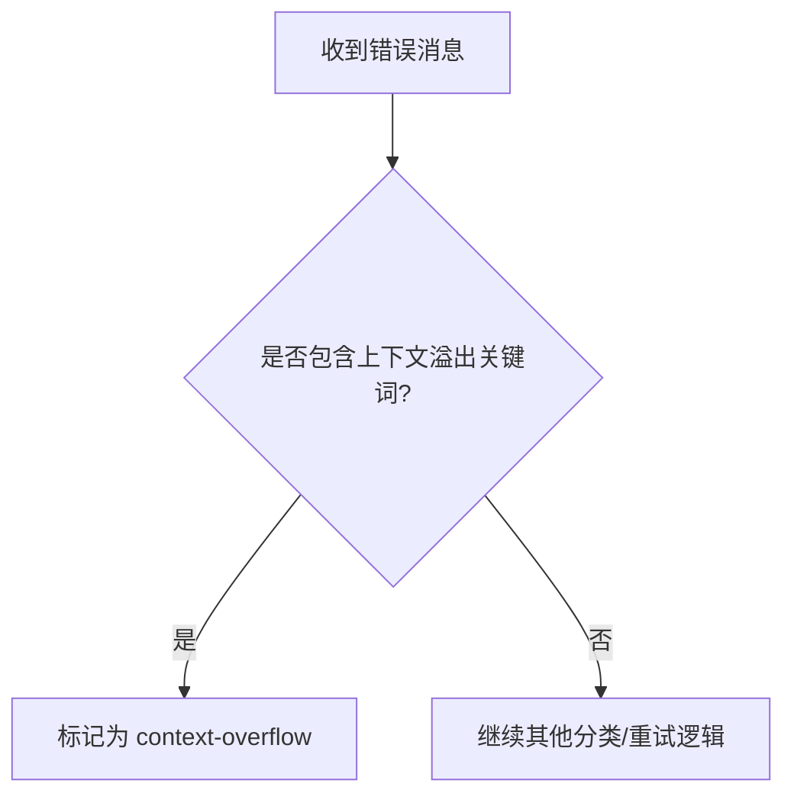
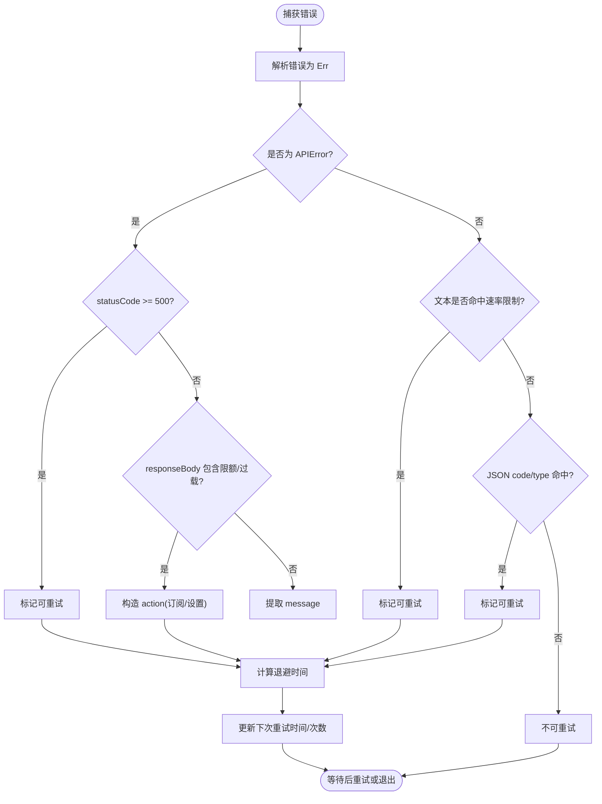
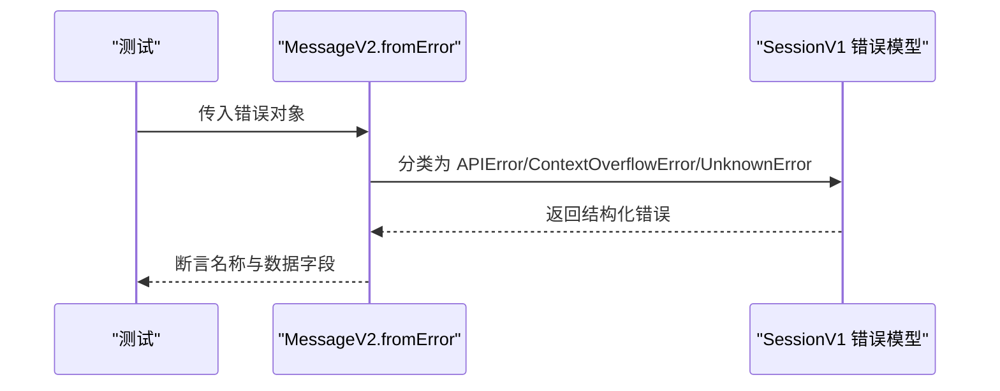
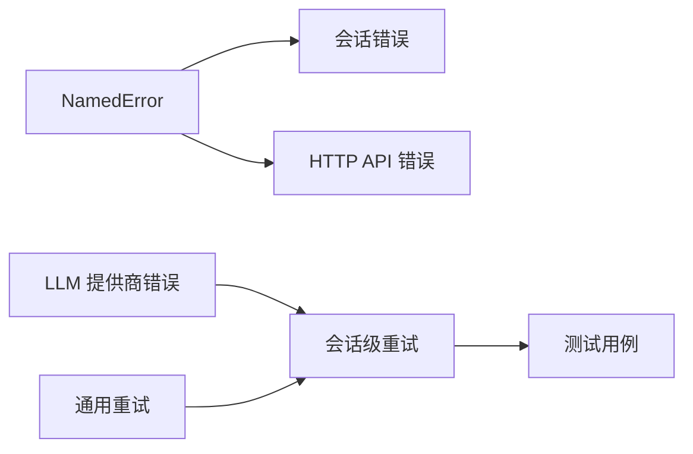

# 错误处理

<cite>
**本文引用的文件**   
- [packages/core/src/util/error.ts](file://packages/core/src/util/error.ts)
- [packages/core/src/session/error.ts](file://packages/core/src/session/error.ts)
- [packages/opencode/src/session/retry.ts](file://packages/opencode/src/session/retry.ts)
- [packages/core/src/util/retry.ts](file://packages/core/src/util/retry.ts)
- [packages/llm/src/provider-error.ts](file://packages/llm/src/provider-error.ts)
- [packages/opencode/src/server/routes/instance/httpapi/errors.ts](file://packages/opencode/src/server/routes/instance/httpapi/errors.ts)
- [packages/opencode/test/session/retry.test.ts](file://packages/opencode/test/session/retry.test.ts)
- [packages/opencode/test/session/message-v2.test.ts](file://packages/opencode/test/session/message-v2.test.ts)
</cite>

## 目录
1. [简介](#简介)
2. [项目结构](#项目结构)
3. [核心组件](#核心组件)
4. [架构总览](#架构总览)
5. [详细组件分析](#详细组件分析)
6. [依赖关系分析](#依赖关系分析)
7. [性能考量](#性能考量)
8. [故障排查指南](#故障排查指南)
9. [结论](#结论)
10. [附录](#附录)

## 简介
本文件为 openNovel SDK 的错误处理提供系统化文档，覆盖错误类型分类、错误码定义与消息格式、异常捕获与恢复、重试策略（含退避与上限）、日志记录与监控建议、调试工具使用，以及自定义错误扩展机制。内容基于仓库中实际实现进行归纳与可视化说明，帮助开发者快速理解并正确使用 SDK 的错误处理能力。

## 项目结构
围绕错误处理的关键代码分布在以下模块：
- 通用错误基类与命名错误工厂：用于统一错误结构与序列化
- 会话层错误：解码失败等具体业务错误
- HTTP API 层错误：统一的 HTTP 状态映射与结构化错误体
- LLM 提供商错误：上下文溢出等特定错误的识别
- 重试策略：通用重试与会话级重试（含速率限制、配额超限、5xx 自动重试）
- 测试用例：验证错误分类、可重试判定与消息转换

图表来源
- [packages/core/src/util/error.ts:1-71](file://packages/core/src/util/error.ts#L1-L71)
- [packages/core/src/session/error.ts:1-25](file://packages/core/src/session/error.ts#L1-L25)
- [packages/opencode/src/server/routes/instance/httpapi/errors.ts:1-194](file://packages/opencode/src/server/routes/instance/httpapi/errors.ts#L1-L194)
- [packages/llm/src/provider-error.ts:1-44](file://packages/llm/src/provider-error.ts#L1-L44)
- [packages/core/src/util/retry.ts:1-43](file://packages/core/src/util/retry.ts#L1-L43)
- [packages/opencode/src/session/retry.ts:1-202](file://packages/opencode/src/session/retry.ts#L1-L202)
- [packages/opencode/test/session/retry.test.ts:136-229](file://packages/opencode/test/session/retry.test.ts#L136-L229)
- [packages/opencode/test/session/message-v2.test.ts:1401-1516](file://packages/opencode/test/session/message-v2.test.ts#L1401-L1516)

章节来源
- [packages/core/src/util/error.ts:1-71](file://packages/core/src/util/error.ts#L1-L71)
- [packages/core/src/session/error.ts:1-25](file://packages/core/src/session/error.ts#L1-L25)
- [packages/opencode/src/server/routes/instance/httpapi/errors.ts:1-194](file://packages/opencode/src/server/routes/instance/httpapi/errors.ts#L1-L194)
- [packages/llm/src/provider-error.ts:1-44](file://packages/llm/src/provider-error.ts#L1-L44)
- [packages/core/src/util/retry.ts:1-43](file://packages/core/src/util/retry.ts#L1-L43)
- [packages/opencode/src/session/retry.ts:1-202](file://packages/opencode/src/session/retry.ts#L1-L202)
- [packages/opencode/test/session/retry.test.ts:136-229](file://packages/opencode/test/session/retry.test.ts#L136-L229)
- [packages/opencode/test/session/message-v2.test.ts:1401-1516](file://packages/opencode/test/session/message-v2.test.ts#L1401-L1516)

## 核心组件
- 命名错误基类 NamedError
  - 提供统一的 name/data 结构、Schema 校验、toObject 序列化与 isInstance 类型守卫
  - 内置 Unknown 错误，便于兜底未知异常
- 会话层错误
  - MessageDecodeError：会话消息解码失败
  - ContextSnapshotDecodeError：上下文快照解码失败
- HTTP API 错误集合
  - InvalidRequestError(400)、UnauthorizedError(401)、ForbiddenError(403)、ConflictError(409)
  - UpstreamError(502)、ServiceUnavailableError(503)、TimeoutError(504)、UnknownError(500)
  - ProviderNotFoundError、ModelNotFoundError、SessionNotFoundError、MessageNotFoundError、InvalidCursorError、SessionBusyError、QuestionNotFoundError、PermissionNotFoundError、McpServerNotFoundError、PtyNotFoundError、PtyForbiddenError、ProjectNotFoundError、ApiNotFoundError
- LLM 提供商错误识别
  - isContextOverflow：通过正则匹配识别上下文长度超限
  - isContextOverflowFailure：对结构化失败事件进行分类判断
- 重试策略
  - 通用 retry：指数退避、最大延迟、可重试条件函数
  - 会话级 SessionRetry：解析 APIError、速率限制、配额超限、5xx 自动重试、Header 驱动退避

章节来源
- [packages/core/src/util/error.ts:1-71](file://packages/core/src/util/error.ts#L1-L71)
- [packages/core/src/session/error.ts:1-25](file://packages/core/src/session/error.ts#L1-L25)
- [packages/opencode/src/server/routes/instance/httpapi/errors.ts:1-194](file://packages/opencode/src/server/routes/instance/httpapi/errors.ts#L1-L194)
- [packages/llm/src/provider-error.ts:1-44](file://packages/llm/src/provider-error.ts#L1-L44)
- [packages/core/src/util/retry.ts:1-43](file://packages/core/src/util/retry.ts#L1-L43)
- [packages/opencode/src/session/retry.ts:1-202](file://packages/opencode/src/session/retry.ts#L1-L202)

## 架构总览
SDK 的错误处理采用分层设计：底层抛出结构化错误，中间层进行错误分类与转换，上层根据策略决定重试或回退。

图表来源
- [packages/opencode/src/session/retry.ts:1-202](file://packages/opencode/src/session/retry.ts#L1-L202)
- [packages/opencode/src/server/routes/instance/httpapi/errors.ts:1-194](file://packages/opencode/src/server/routes/instance/httpapi/errors.ts#L1-L194)
- [packages/core/src/util/error.ts:1-71](file://packages/core/src/util/error.ts#L1-L71)
- [packages/core/src/session/error.ts:1-25](file://packages/core/src/session/error.ts#L1-L25)

## 详细组件分析

### 命名错误基类与结构化错误
- 设计要点
  - 所有错误具备 name 与 data 字段，便于统一序列化与模式校验
  - 提供 create 工厂方法，按 Schema 生成强类型错误类
  - toObject 输出标准化对象，isInstance 支持类型守卫
- 使用场景
  - 作为 SDK 内部错误的基础抽象，确保跨模块一致的错误表示
  - 结合 Effect Schema 进行输入/输出校验，提升健壮性

图表来源
- [packages/core/src/util/error.ts:1-71](file://packages/core/src/util/error.ts#L1-L71)

章节来源
- [packages/core/src/util/error.ts:1-71](file://packages/core/src/util/error.ts#L1-L71)

### 会话层错误
- 错误类型
  - MessageDecodeError：包含 sessionID、messageID，提示解码失败
  - ContextSnapshotDecodeError：包含 sessionID、details，提示快照解码失败
- 语义
  - 聚焦于数据持久化与传输过程中的解码问题，便于定位与修复

图表来源
- [packages/core/src/session/error.ts:1-25](file://packages/core/src/session/error.ts#L1-L25)

章节来源
- [packages/core/src/session/error.ts:1-25](file://packages/core/src/session/error.ts#L1-L25)

### HTTP API 错误集合与状态码映射
- 错误类别与 HTTP 状态码
  - 400：InvalidRequestError、InvalidCursorError
  - 401：UnauthorizedError
  - 403：ForbiddenError、PtyForbiddenError
  - 404：ProviderNotFoundError、ModelNotFoundError、SessionNotFoundError、MessageNotFoundError、QuestionNotFoundError、PermissionNotFoundError、McpServerNotFoundError、PtyNotFoundError、ProjectNotFoundError、ApiNotFoundError
  - 409：ConflictError、SessionBusyError
  - 500：UnknownError
  - 502：UpstreamError
  - 503：ServiceUnavailableError
  - 504：TimeoutError
- 优势
  - 将业务错误与 HTTP 状态一一对应，便于网关/客户端统一处理
  - 结构化字段（如 providerID、sessionID、messageID）利于追踪

```mermaid
classDiagram
class InvalidRequestError {
+message
+kind
+field
}
class UnauthorizedError { +message }
class ForbiddenError { +message }
class ConflictError { +message +resource }
class UpstreamError { +message +service +status }
class ServiceUnavailableError { +message +service }
class TimeoutError { +message +operation }
class UnknownError { +message +ref }
class ProviderNotFoundError { +providerID +message }
class ModelNotFoundError { +providerID +modelID +suggestions +message }
class SessionNotFoundError { +sessionID +message }
class MessageNotFoundError { +sessionID +messageID +message }
class ApiNotFoundError { +name +data.message }
```

图表来源
- [packages/opencode/src/server/routes/instance/httpapi/errors.ts:1-194](file://packages/opencode/src/server/routes/instance/httpapi/errors.ts#L1-L194)

章节来源
- [packages/opencode/src/server/routes/instance/httpapi/errors.ts:1-194](file://packages/opencode/src/server/routes/instance/httpapi/errors.ts#L1-L194)

### LLM 提供商错误识别（上下文溢出）
- 识别规则
  - isContextOverflow：通过大量正则匹配常见“上下文长度超限”的文本描述
  - isContextOverflowFailure：对结构化失败事件进行分类判断
- 作用
  - 在重试前快速识别不可重试的上下文溢出错误，避免无效重试

图表来源
- [packages/llm/src/provider-error.ts:1-44](file://packages/llm/src/provider-error.ts#L1-L44)

章节来源
- [packages/llm/src/provider-error.ts:1-44](file://packages/llm/src/provider-error.ts#L1-L44)

### 重试策略与错误恢复
- 通用重试（core/util/retry.ts）
  - 参数：attempts、delay、factor、maxDelay、retryIf
  - 默认策略：针对网络相关临时错误进行指数退避重试
- 会话级重试（opencode/session/retry.ts）
  - 解析 APIError：statusCode、isRetryable、responseBody、responseHeaders
  - 自动重试：5xx 始终可重试；429/速率限制/配额超限给出明确动作
  - Header 驱动退避：优先读取 retry-after-ms / retry-after（秒或日期）
  - 免费额度/Go 额度限制：返回引导订阅或打开设置的行动项
  - 文本模式匹配：识别“rate limit”“too many requests”等
  - 上下文溢出：不重试（由 LLM 识别器辅助）

图表来源
- [packages/opencode/src/session/retry.ts:1-202](file://packages/opencode/src/session/retry.ts#L1-L202)
- [packages/core/src/util/retry.ts:1-43](file://packages/core/src/util/retry.ts#L1-L43)

章节来源
- [packages/opencode/src/session/retry.ts:1-202](file://packages/opencode/src/session/retry.ts#L1-L202)
- [packages/core/src/util/retry.ts:1-43](file://packages/core/src/util/retry.ts#L1-L43)

### 错误分类与消息转换（测试用例支撑）
- 从错误到消息的转换
  - 将上游错误转换为标准化的 APIError/ContextOverflowError/UnknownError
  - 保留 responseBody、statusCode、isRetryable 等关键信息
- 典型场景
  - 429 无 body：归类为 APIError，非上下文溢出
  - server_error 流式分片：标记为可重试
  - context_length_exceeded：归类为上下文溢出错误

图表来源
- [packages/opencode/test/session/message-v2.test.ts:1401-1516](file://packages/opencode/test/session/message-v2.test.ts#L1401-L1516)

章节来源
- [packages/opencode/test/session/message-v2.test.ts:1401-1516](file://packages/opencode/test/session/message-v2.test.ts#L1401-L1516)

### 完整错误处理示例（网络错误、认证失败、数据验证错误）
- 网络错误
  - 现象：连接丢失、超时、socket hang up
  - 处理：通用 retry 指数退避；若为 5xx，则会话级重试优先遵循 retry-after
- 认证失败
  - 现象：401 Unauthorized
  - 处理：不重试，提示重新登录或刷新令牌
- 数据验证错误
  - 现象：400 InvalidRequestError，包含 field/kind
  - 处理：不重试，提示修正输入

章节来源
- [packages/core/src/util/retry.ts:1-43](file://packages/core/src/util/retry.ts#L1-L43)
- [packages/opencode/src/server/routes/instance/httpapi/errors.ts:1-194](file://packages/opencode/src/server/routes/instance/httpapi/errors.ts#L1-L194)

## 依赖关系分析
- 耦合与内聚
  - NamedError 作为基础抽象被多处复用，内聚性强
  - HTTP API 错误与状态码一一对应，职责清晰
  - 会话级重试依赖 LLM 提供商错误识别与 APIError 结构
- 外部依赖
  - Effect Schema：用于错误结构校验与类型安全
  - Effect Clock/Schedule：用于时间控制与调度策略

图表来源
- [packages/core/src/util/error.ts:1-71](file://packages/core/src/util/error.ts#L1-L71)
- [packages/core/src/session/error.ts:1-25](file://packages/core/src/session/error.ts#L1-L25)
- [packages/opencode/src/server/routes/instance/httpapi/errors.ts:1-194](file://packages/opencode/src/server/routes/instance/httpapi/errors.ts#L1-L194)
- [packages/llm/src/provider-error.ts:1-44](file://packages/llm/src/provider-error.ts#L1-L44)
- [packages/core/src/util/retry.ts:1-43](file://packages/core/src/util/retry.ts#L1-L43)
- [packages/opencode/src/session/retry.ts:1-202](file://packages/opencode/src/session/retry.ts#L1-L202)
- [packages/opencode/test/session/retry.test.ts:136-229](file://packages/opencode/test/session/retry.test.ts#L136-L229)

章节来源
- [packages/core/src/util/error.ts:1-71](file://packages/core/src/util/error.ts#L1-L71)
- [packages/core/src/session/error.ts:1-25](file://packages/core/src/session/error.ts#L1-L25)
- [packages/opencode/src/server/routes/instance/httpapi/errors.ts:1-194](file://packages/opencode/src/server/routes/instance/httpapi/errors.ts#L1-L194)
- [packages/llm/src/provider-error.ts:1-44](file://packages/llm/src/provider-error.ts#L1-L44)
- [packages/core/src/util/retry.ts:1-43](file://packages/core/src/util/retry.ts#L1-L43)
- [packages/opencode/src/session/retry.ts:1-202](file://packages/opencode/src/session/retry.ts#L1-L202)
- [packages/opencode/test/session/retry.test.ts:136-229](file://packages/opencode/test/session/retry.test.ts#L136-L229)

## 性能考量
- 指数退避与上限
  - 初始延迟与倍增因子控制重试频率，避免雪崩
  - 最大延迟上限防止长时间阻塞
- Header 驱动退避
  - 优先使用 retry-after-ms / retry-after，减少不必要的等待
- 不可重试的快速失败
  - 上下文溢出、4xx 非 5xx 错误直接失败，避免浪费资源

[本节为通用指导，无需引用具体文件]

## 故障排查指南
- 常见问题定位
  - 解码失败：检查会话 ID、消息 ID 与快照完整性
  - 速率限制：关注响应头 retry-after 与消息中的速率限制关键词
  - 配额超限：根据 action 链接跳转至工作区设置页面
  - 5xx 错误：查看 upstream service 状态与日志
- 调试建议
  - 打印 Err.toObject() 获取标准化错误体
  - 使用 isInstance 判断错误类型，缩小排查范围
  - 结合测试用例断言，验证错误分类与可重试性

章节来源
- [packages/core/src/util/error.ts:1-71](file://packages/core/src/util/error.ts#L1-L71)
- [packages/opencode/src/session/retry.ts:1-202](file://packages/opencode/src/session/retry.ts#L1-L202)
- [packages/opencode/test/session/retry.test.ts:136-229](file://packages/opencode/test/session/retry.test.ts#L136-L229)

## 结论
openNovel SDK 的错误处理体系以结构化、可校验、可重试为核心目标，通过命名错误基类、HTTP 错误映射、LLM 提供商错误识别与多层重试策略，提供了稳定且易用的错误处理能力。开发者可据此快速构建健壮的集成方案，并在需要时扩展自定义错误与重试策略。

[本节为总结，无需引用具体文件]

## 附录
- 错误码与消息格式
  - 所有错误具备 name 与 data，data 中包含 message、statusCode、responseBody、responseHeaders 等字段
  - HTTP 错误与状态码严格对应，便于前端/网关统一处理
- 自定义错误扩展
  - 使用 NamedError.create 创建新错误类型，定义 Schema 与 toObject
  - 在会话级重试中添加新的可重试模式或动作（action）
- 日志与监控建议
  - 记录 Err.toObject() 与请求上下文（URL、requestBodyValues）
  - 统计不同错误类型的出现频率与重试成功率
  - 对 5xx 与速率限制错误设置告警阈值

[本节为补充说明，无需引用具体文件]