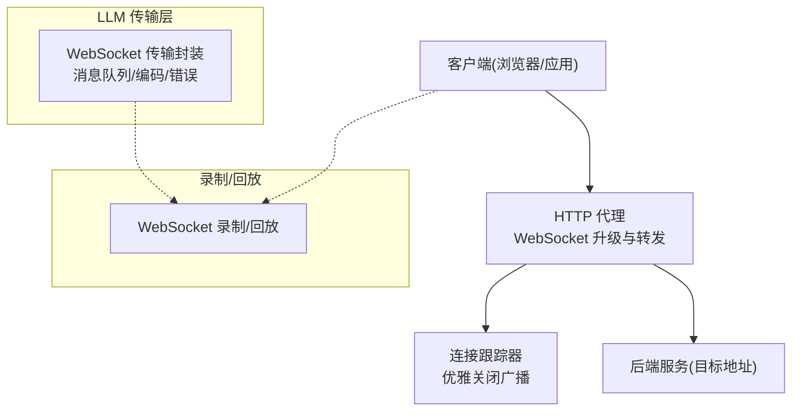
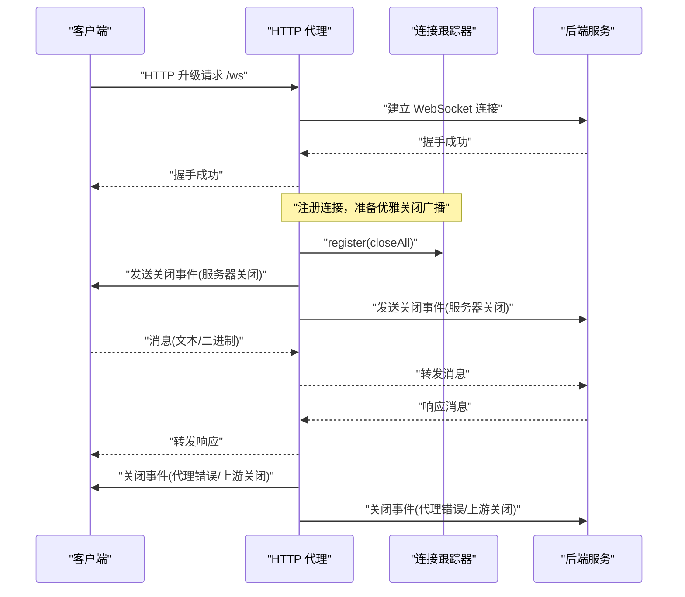
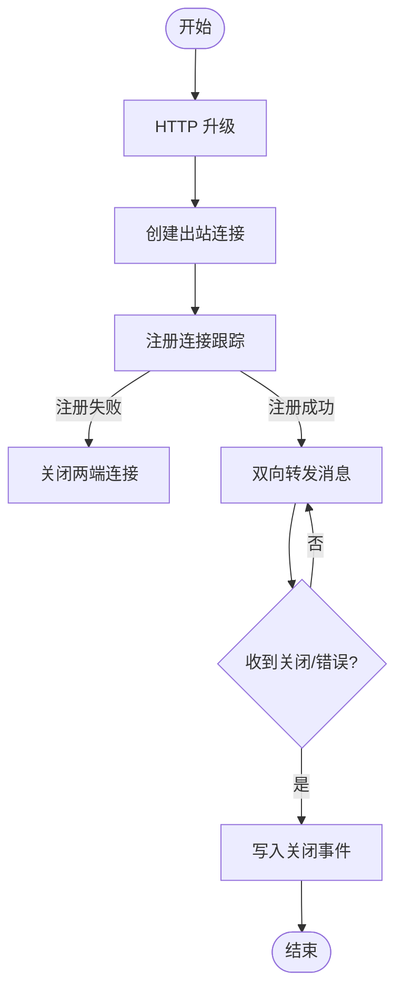
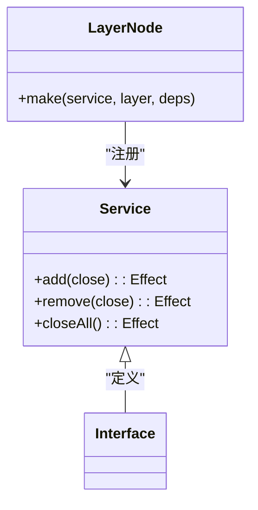
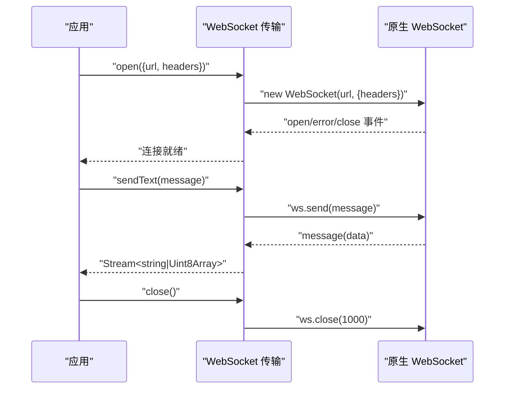
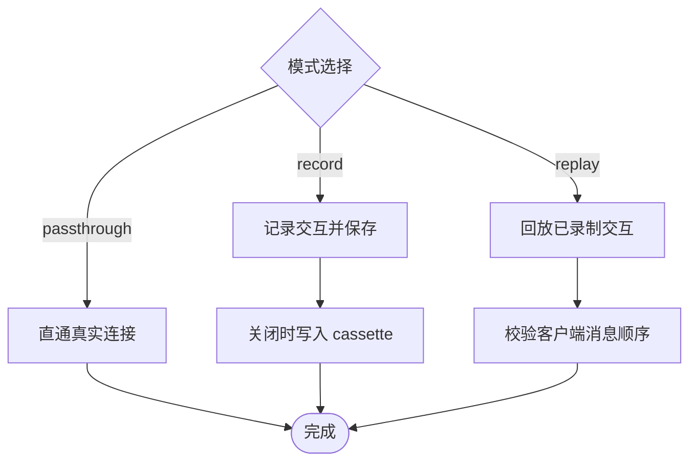
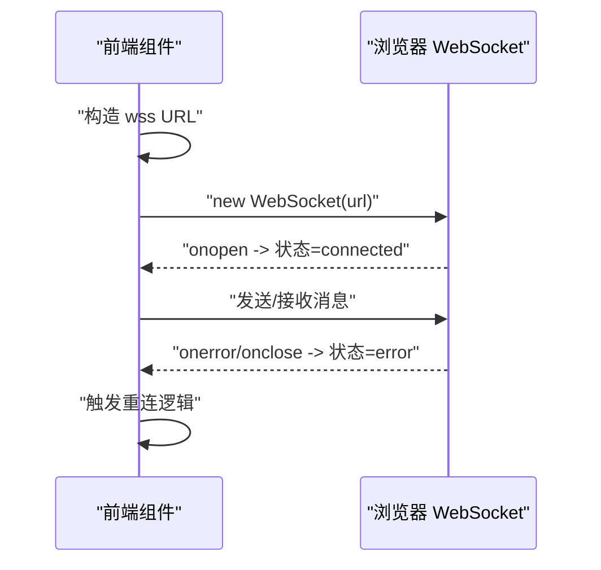
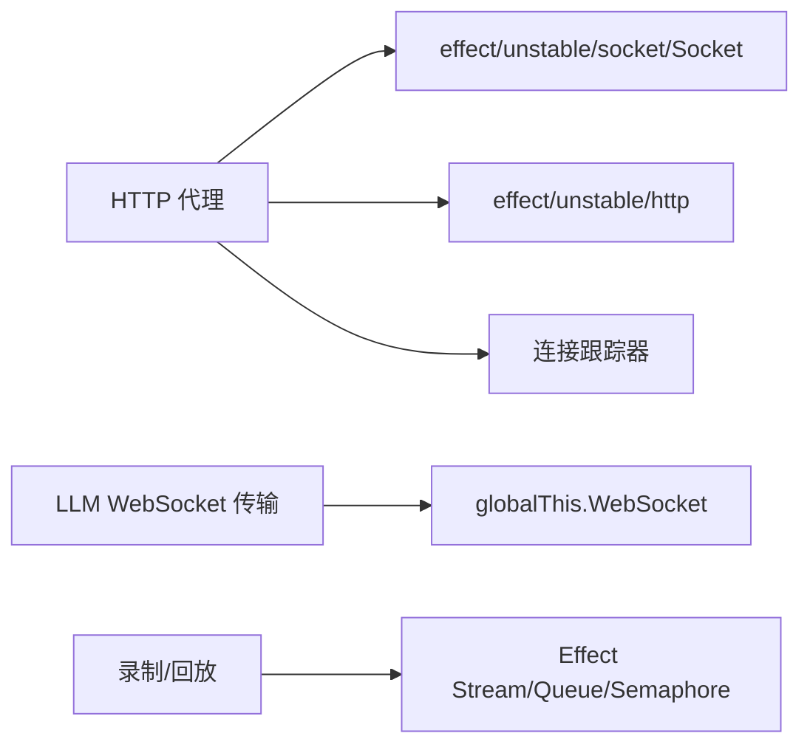

# Socket API

<cite>
**本文引用的文件**
- [packages/opencode/src/server/routes/instance/httpapi/websocket-tracker.ts](file://packages/opencode/src/server/routes/instance/httpapi/websocket-tracker.ts)
- [packages/opencode/src/server/routes/instance/httpapi/middleware/proxy.ts](file://packages/opencode/src/server/routes/instance/httpapi/middleware/proxy.ts)
- [packages/llm/src/route/transport/websocket.ts](file://packages/llm/src/route/transport/websocket.ts)
- [packages/http-recorder/src/websocket.ts](file://packages/http-recorder/src/websocket.ts)
- [packages/app/e2e/utils/sse-transport.ts](file://packages/app/e2e/utils/sse-transport.ts)
- [packages/app/src/components/Share.tsx](file://packages/app/src/components/Share.tsx)
- [packages/opencode/src/cli/network.ts](file://packages/opencode/src/cli/network.ts)
</cite>

## 目录
1. [简介](#简介)
2. [项目结构](#项目结构)
3. [核心组件](#核心组件)
4. [架构总览](#架构总览)
5. [详细组件分析](#详细组件分析)
6. [依赖关系分析](#依赖关系分析)
7. [性能与调优](#性能与调优)
8. [故障排查指南](#故障排查指南)
9. [结论](#结论)
10. [附录：Socket 编程示例与安全配置](#附录socket-编程示例与安全配置)

## 简介
本文件为 openNovel 的 Socket API 文档，聚焦于 WebSocket 连接协议、数据帧格式、状态管理（连接维护、心跳检测、断线恢复）、数据流控制（流量限制、缓冲、并发），以及错误处理与异常恢复策略。同时提供网络性能调优与安全配置建议，帮助开发者在浏览器与服务端之间建立稳定、高效的实时通信通道。

## 项目结构
openNovel 中涉及 Socket/WebSocket 的关键代码分布在以下模块：
- HTTP 代理层：负责将客户端 WebSocket 请求升级到目标后端，并双向转发消息，支持优雅关闭事件广播。
- LLM WebSocket 传输层：封装原生 WebSocket 能力，提供统一的消息收发接口、二进制/文本处理、队列缓冲与错误封装。
- 录制/回放工具：对 WebSocket 交互进行录制与回放，便于测试与调试。
- 前端示例：展示如何在浏览器中建立 wss 连接、自动重连与状态管理。
- CLI 网络选项：提供端口、主机名、mDNS、CORS 等网络相关配置解析。

图表来源
- [packages/opencode/src/server/routes/instance/httpapi/middleware/proxy.ts:1-109](file://packages/opencode/src/server/routes/instance/httpapi/middleware/proxy.ts#L1-L109)
- [packages/opencode/src/server/routes/instance/httpapi/websocket-tracker.ts:1-61](file://packages/opencode/src/server/routes/instance/httpapi/websocket-tracker.ts#L1-L61)
- [packages/llm/src/route/transport/websocket.ts:1-281](file://packages/llm/src/route/transport/websocket.ts#L1-L281)
- [packages/http-recorder/src/websocket.ts:1-174](file://packages/http-recorder/src/websocket.ts#L1-L174)

章节来源
- [packages/opencode/src/server/routes/instance/httpapi/middleware/proxy.ts:1-109](file://packages/opencode/src/server/routes/instance/httpapi/middleware/proxy.ts#L1-L109)
- [packages/opencode/src/server/routes/instance/httpapi/websocket-tracker.ts:1-61](file://packages/opencode/src/server/routes/instance/httpapi/websocket-tracker.ts#L1-L61)
- [packages/llm/src/route/transport/websocket.ts:1-281](file://packages/llm/src/route/transport/websocket.ts#L1-L281)
- [packages/http-recorder/src/websocket.ts:1-174](file://packages/http-recorder/src/websocket.ts#L1-L174)

## 核心组件
- HTTP 代理与 WebSocket 转发
  - 将客户端请求通过 HTTP 升级协议转换为 WebSocket 连接，并在入站与出站之间双向转发消息。
  - 在服务关闭时向两端发送统一的关闭事件，确保客户端及时感知。
- 连接跟踪器
  - 维护活跃连接集合，支持添加、移除与批量关闭；用于优雅停机时的广播通知。
- LLM WebSocket 传输封装
  - 封装原生 WebSocket，提供 sendText、messages、close 接口；内部使用有界队列缓冲消息，统一错误类型与原因。
- 录制/回放
  - 记录 WebSocket 交互（文本/二进制）并支持回放校验，便于自动化测试与回归验证。
- 前端示例
  - 演示 wss 连接建立、自动重连、状态管理与错误提示。

章节来源
- [packages/opencode/src/server/routes/instance/httpapi/middleware/proxy.ts:14-77](file://packages/opencode/src/server/routes/instance/httpapi/middleware/proxy.ts#L14-L77)
- [packages/opencode/src/server/routes/instance/httpapi/websocket-tracker.ts:17-46](file://packages/opencode/src/server/routes/instance/httpapi/websocket-tracker.ts#L17-L46)
- [packages/llm/src/route/transport/websocket.ts:125-204](file://packages/llm/src/route/transport/websocket.ts#L125-L204)
- [packages/http-recorder/src/websocket.ts:64-174](file://packages/http-recorder/src/websocket.ts#L64-L174)
- [packages/app/src/components/Share.tsx:81-116](file://packages/app/src/components/Share.tsx#L81-L116)

## 架构总览
下图展示了从客户端到后端的完整 WebSocket 数据流，包括代理转发、连接跟踪、消息双向流转与关闭事件广播。

图表来源
- [packages/opencode/src/server/routes/instance/httpapi/middleware/proxy.ts:14-77](file://packages/opencode/src/server/routes/instance/httpapi/middleware/proxy.ts#L14-L77)
- [packages/opencode/src/server/routes/instance/httpapi/websocket-tracker.ts:17-46](file://packages/opencode/src/server/routes/instance/httpapi/websocket-tracker.ts#L17-L46)

## 详细组件分析

### HTTP 代理与 WebSocket 转发
- 功能要点
  - 使用 HTTP 升级将请求转为 WebSocket，创建入站与出站两个 Socket。
  - 双向 runRaw 回调实现消息透传，捕获上游关闭或错误并转换为标准关闭事件回写客户端。
  - 在服务关闭流程中，先向两端写入关闭事件，再等待超时清理。
- 关键路径
  - 升级与连接建立：request.upgrade -> outbound.makeWebSocket
  - 消息转发：inbound.runRaw -> writeOutbound；outbound.runRaw -> writeInbound
  - 关闭事件：SERVER_CLOSING_EVENT 广播，错误码映射（如 1011 表示代理错误）

图表来源
- [packages/opencode/src/server/routes/instance/httpapi/middleware/proxy.ts:14-77](file://packages/opencode/src/server/routes/instance/httpapi/middleware/proxy.ts#L14-L77)

章节来源
- [packages/opencode/src/server/routes/instance/httpapi/middleware/proxy.ts:1-109](file://packages/opencode/src/server/routes/instance/httpapi/middleware/proxy.ts#L1-L109)

### 连接跟踪器
- 功能要点
  - 维护 Set<Close> 活跃关闭任务集合，支持 add/remove/closeAll。
  - closeAll 设置关闭标志，遍历并发执行所有关闭任务，带超时保护。
- 使用场景
  - 服务优雅停机：向所有连接广播关闭事件，避免客户端长时间挂起。

图表来源
- [packages/opencode/src/server/routes/instance/httpapi/websocket-tracker.ts:15-46](file://packages/opencode/src/server/routes/instance/httpapi/websocket-tracker.ts#L15-L46)

章节来源
- [packages/opencode/src/server/routes/instance/httpapi/websocket-tracker.ts:1-61](file://packages/opencode/src/server/routes/instance/httpapi/websocket-tracker.ts#L1-L61)

### LLM WebSocket 传输封装
- 功能要点
  - 提供 open/fromWebSocket/json 等接口，统一 URL 协议转换（http->ws, https->wss）。
  - 内部使用有界队列（容量 128）缓冲消息，避免阻塞与内存泄漏。
  - 错误封装为 LLMError，包含模块、方法、原因与上下文信息。
  - 支持文本与二进制消息，统一解码为字符串供上层消费。
- 关键流程
  - waitOpen：等待连接打开，监听 open/error/close 事件。
  - onMessage/onError/onClose：消息入队、错误传播、正常关闭结束流。
  - json frames：获取连接后发送首条消息，返回消息流。

图表来源
- [packages/llm/src/route/transport/websocket.ts:125-204](file://packages/llm/src/route/transport/websocket.ts#L125-L204)

章节来源
- [packages/llm/src/route/transport/websocket.ts:1-281](file://packages/llm/src/route/transport/websocket.ts#L1-L281)

### 录制/回放（测试与调试）
- 功能要点
  - 支持 passthrough/record/replay 三种模式。
  - 记录客户端与服务端消息（文本/二进制 base64），关闭时持久化 cassette。
  - replay 模式下按序校验客户端消息，回放服务端消息序列。
- 适用场景
  - 端到端测试、回归验证、问题复现与定位。

图表来源
- [packages/http-recorder/src/websocket.ts:64-174](file://packages/http-recorder/src/websocket.ts#L64-L174)

章节来源
- [packages/http-recorder/src/websocket.ts:1-174](file://packages/http-recorder/src/websocket.ts#L1-L174)

### 前端示例（wss 连接与重连）
- 功能要点
  - 基于环境变量构建 wss 地址，建立 WebSocket 连接。
  - 连接状态管理（connecting/connected/error），异常关闭提示。
  - 可结合心跳与重试逻辑提升稳定性（参考通用实践）。

图表来源
- [packages/app/src/components/Share.tsx:81-116](file://packages/app/src/components/Share.tsx#L81-L116)

章节来源
- [packages/app/src/components/Share.tsx:81-116](file://packages/app/src/components/Share.tsx#L81-L116)

## 依赖关系分析
- HTTP 代理依赖 effect/unstable/socket/Socket 与 effect/unstable/http，用于 HTTP 升级与 WebSocket 生命周期管理。
- 连接跟踪器作为独立服务层，被代理层注册，用于优雅关闭广播。
- LLM WebSocket 传输封装依赖全局 WebSocket 对象，并通过 Effect 抽象错误与资源释放。
- 录制/回放模块依赖 Effect Stream/Queue/Semaphore 等并发原语，保证有序与线程安全。

图表来源
- [packages/opencode/src/server/routes/instance/httpapi/middleware/proxy.ts:1-109](file://packages/opencode/src/server/routes/instance/httpapi/middleware/proxy.ts#L1-L109)
- [packages/llm/src/route/transport/websocket.ts:1-281](file://packages/llm/src/route/transport/websocket.ts#L1-L281)
- [packages/http-recorder/src/websocket.ts:1-174](file://packages/http-recorder/src/websocket.ts#L1-L174)

章节来源
- [packages/opencode/src/server/routes/instance/httpapi/middleware/proxy.ts:1-109](file://packages/opencode/src/server/routes/instance/httpapi/middleware/proxy.ts#L1-L109)
- [packages/llm/src/route/transport/websocket.ts:1-281](file://packages/llm/src/route/transport/websocket.ts#L1-L281)
- [packages/http-recorder/src/websocket.ts:1-174](file://packages/http-recorder/src/websocket.ts#L1-L174)

## 性能与调优
- 缓冲与背压
  - LLM WebSocket 传输使用有界队列（容量 128），避免无界增长导致内存溢出；消费者应合理消费速率，防止积压。
- 并发处理
  - 代理层使用 Effect.all 并发处理关闭事件，提高优雅停机的吞吐；注意超时与错误捕获，避免阻塞。
- 心跳与超时
  - 建议在客户端实现心跳机制（例如周期性发送轻量消息），服务端根据空闲时间判定连接健康度。
- 带宽与压缩
  - 对于大文本或二进制数据，考虑分片传输与压缩（如 gzip/deflate），减少单次帧大小。
- 连接复用
  - 尽量复用 WebSocket 连接，避免频繁握手开销；必要时使用连接池。

[本节为通用指导，不直接分析具体文件]

## 故障排查指南
- 常见错误码与含义
  - 1000/1005：正常关闭或无状态码；视为正常结束。
  - 1001：服务器主动关闭（优雅停机）。
  - 1011：代理错误（内部异常或上游不可用）。
- 日志与诊断
  - 启用录制/回放模式，对比期望与实际交互，快速定位问题。
  - 关注代理层的错误捕获与关闭事件写入，确认是否成功广播。
- 恢复策略
  - 客户端实现指数退避重连，配合心跳检测；在连接断开后尝试重建并同步状态。
  - 服务端优雅停机时，优先广播关闭事件，再等待超时清理资源。

章节来源
- [packages/llm/src/route/transport/websocket.ts:165-173](file://packages/llm/src/route/transport/websocket.ts#L165-L173)
- [packages/opencode/src/server/routes/instance/httpapi/middleware/proxy.ts:56-63](file://packages/opencode/src/server/routes/instance/httpapi/middleware/proxy.ts#L56-L63)
- [packages/http-recorder/src/websocket.ts:138-174](file://packages/http-recorder/src/websocket.ts#L138-L174)

## 结论
openNovel 的 Socket API 以 HTTP 代理为核心，结合连接跟踪器与 LLM WebSocket 传输封装，提供了稳定、可扩展的实时通信能力。通过录制/回放工具与前端示例，开发者可以快速集成、测试与排障。在生产环境中，建议结合心跳、背压、连接复用与安全配置，进一步提升性能与可靠性。

[本节为总结性内容，不直接分析具体文件]

## 附录：Socket 编程示例与安全配置

### 连接协议与帧格式
- 协议
  - 使用 WebSocket（ws/wss）进行全双工通信；HTTP 升级由代理层处理。
- 帧格式
  - 文本帧：UTF-8 字符串，适合 JSON 或命令式消息。
  - 二进制帧：Uint8Array，适合序列化数据（如 Protobuf/自定义二进制协议）。
- 命令与事件
  - 服务端可定义统一的事件类型（如 server.heartbeat、server.connected），客户端据此更新状态。
  - 关闭事件：1001（服务器关闭）、1011（代理错误）等，客户端需区分处理。

章节来源
- [packages/app/e2e/utils/sse-transport.ts:253-284](file://packages/app/e2e/utils/sse-transport.ts#L253-L284)
- [packages/llm/src/route/transport/websocket.ts:206-262](file://packages/llm/src/route/transport/websocket.ts#L206-L262)

### 状态管理机制
- 连接状态
  - 客户端维护 CONNECTING/OPEN/CLOSING/CLOSED 状态，结合事件回调更新 UI。
- 心跳检测
  - 客户端定时发送心跳，服务端记录最后活动时间；超过阈值判定为死连接。
- 断线恢复
  - 客户端在 onclose 时触发重连，使用指数退避与最大重试次数；重连后重新订阅必要状态。

章节来源
- [packages/llm/src/route/transport/websocket.ts:52-102](file://packages/llm/src/route/transport/websocket.ts#L52-L102)
- [packages/app/src/components/Share.tsx:81-116](file://packages/app/src/components/Share.tsx#L81-L116)

### 数据流控制
- 流量限制
  - 客户端限制发送频率（节流/限流），避免突发流量打垮服务端。
- 缓冲管理
  - 服务端使用有界队列缓冲消息，消费者按需拉取；生产者侧可根据队列长度动态调整发送速率。
- 并发处理
  - 使用并发原语（如 Promise.all/Effect.all）并行处理多个连接或任务，注意超时与错误隔离。

章节来源
- [packages/llm/src/route/transport/websocket.ts:144-156](file://packages/llm/src/route/transport/websocket.ts#L144-L156)
- [packages/opencode/src/server/routes/instance/httpapi/middleware/proxy.ts:36-48](file://packages/opencode/src/server/routes/instance/httpapi/middleware/proxy.ts#L36-L48)

### 错误处理与异常恢复
- 错误分类
  - 网络错误（连接失败、超时）、协议错误（帧格式非法）、业务错误（消息校验失败）。
- 恢复策略
  - 客户端：重试、降级、缓存本地状态；服务端：熔断、限流、告警。
- 监控与追踪
  - 记录关键指标（连接数、消息吞吐、错误率），结合分布式追踪定位瓶颈。

章节来源
- [packages/llm/src/route/transport/websocket.ts:29-38](file://packages/llm/src/route/transport/websocket.ts#L29-L38)
- [packages/http-recorder/src/websocket.ts:53-62](file://packages/http-recorder/src/websocket.ts#L53-L62)

### 网络性能调优
- 参数建议
  - 调整队列容量、超时时间、并发度，依据负载与延迟目标进行基准测试。
- 优化手段
  - 合并小消息、使用二进制协议、启用压缩、连接复用与负载均衡。

[本节为通用指导，不直接分析具体文件]

### 安全配置指南
- 传输安全
  - 强制使用 wss（HTTPS->WSS），禁用明文 ws；配置证书与加密套件。
- 访问控制
  - 配置 CORS 白名单，限制来源域名；鉴权令牌（JWT/Session）在握手阶段传递。
- 资源保护
  - 限制连接数、消息大小、频率；启用速率限制与黑名单。
- 合规与审计
  - 记录访问日志与审计轨迹，满足合规要求；敏感信息脱敏。

章节来源
- [packages/opencode/src/cli/network.ts:6-33](file://packages/opencode/src/cli/network.ts#L6-L33)
- [packages/opencode/src/cli/network.ts:62-80](file://packages/opencode/src/cli/network.ts#L62-L80)