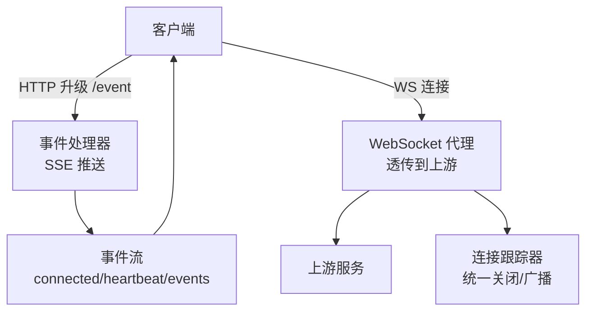
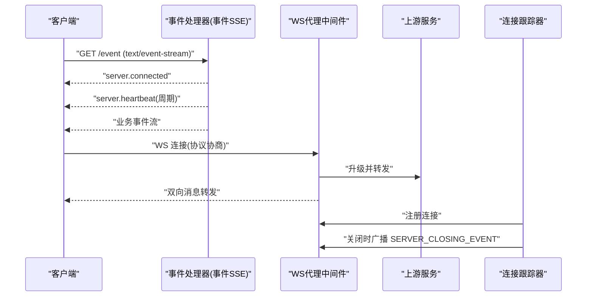
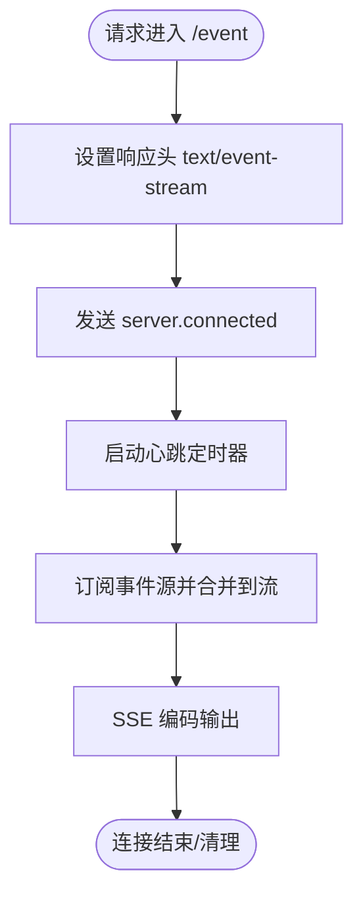
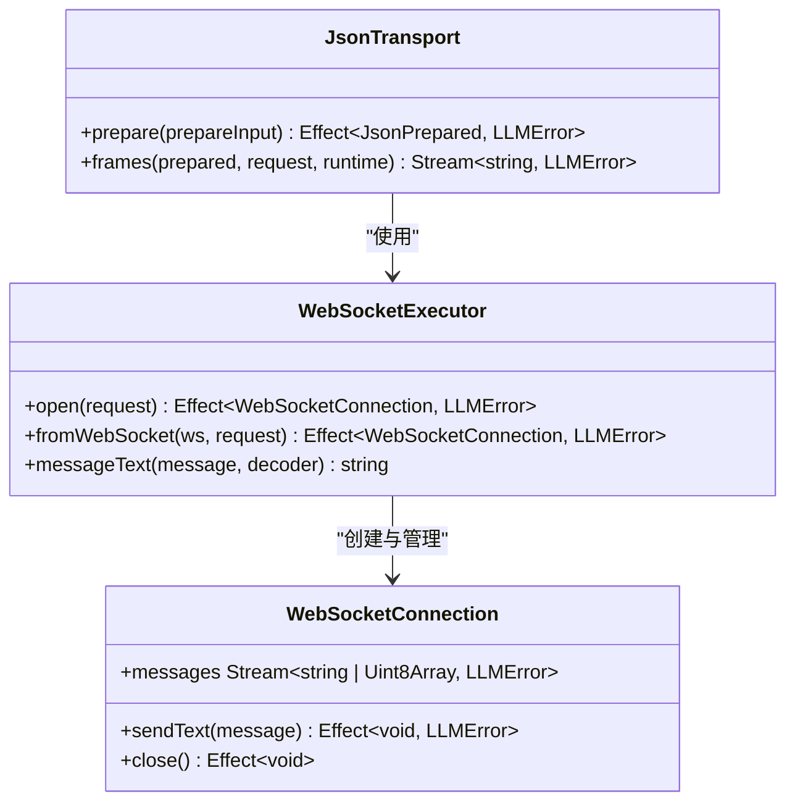
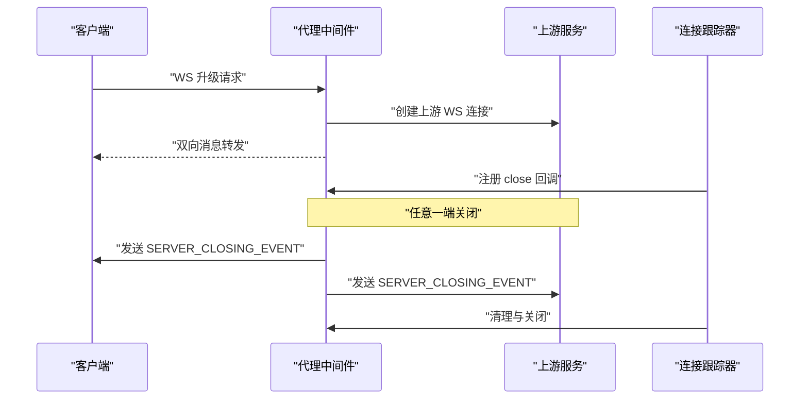
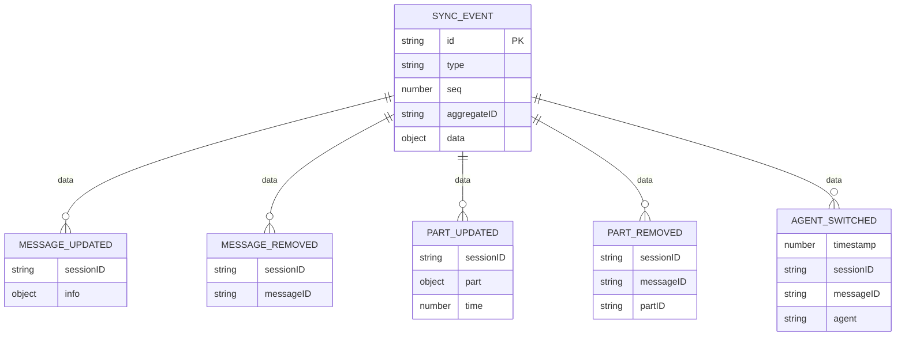
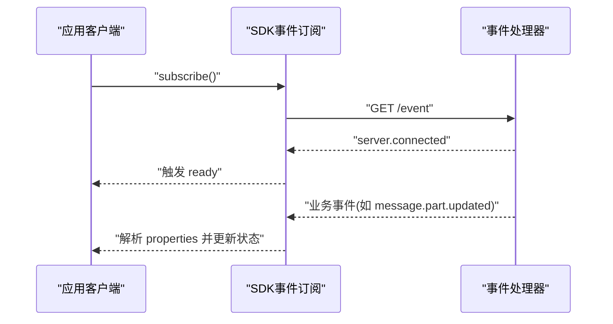
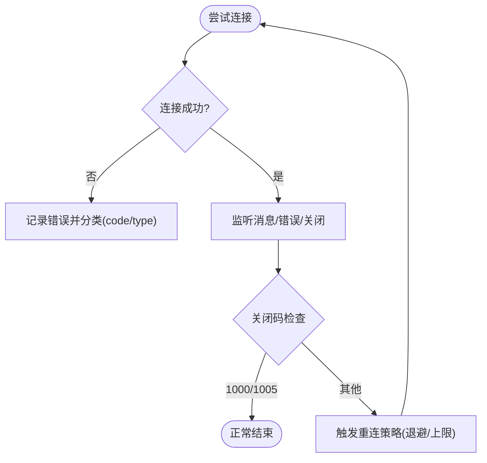
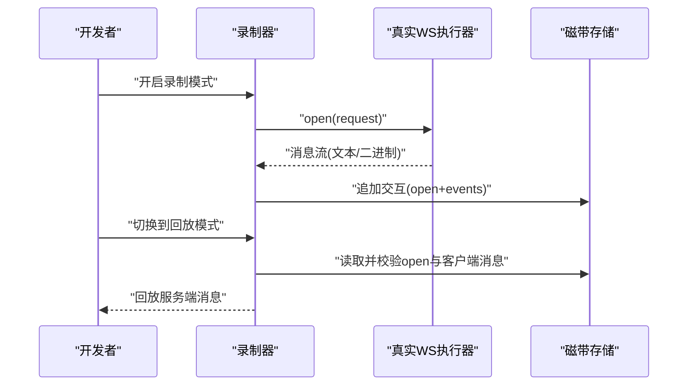
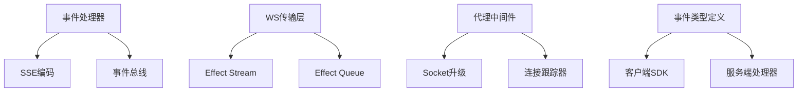

# WebSocket API

<cite>
**本文引用的文件**   
- [packages/opencode/src/server/routes/instance/httpapi/handlers/event.ts](file://packages/opencode/src/server/routes/instance/httpapi/handlers/event.ts)
- [packages/opencode/src/server/routes/instance/httpapi/handlers/global.ts](file://packages/opencode/src/server/routes/instance/httpapi/handlers/global.ts)
- [packages/opencode/src/server/routes/instance/httpapi/middleware/proxy.ts](file://packages/opencode/src/server/routes/instance/httpapi/middleware/proxy.ts)
- [packages/opencode/src/server/routes/instance/httpapi/websocket-tracker.ts](file://packages/opencode/src/server/routes/instance/httpapi/websocket-tracker.ts)
- [packages/llm/src/route/transport/websocket.ts](file://packages/llm/src/route/transport/websocket.ts)
- [packages/http-recorder/src/websocket.ts](file://packages/http-recorder/src/websocket.ts)
- [packages/schema/src/server-event.ts](file://packages/schema/src/server-event.ts)
- [packages/sdks/js/src/v2/gen/types.gen.ts](file://packages/sdks/js/src/v2/gen/types.gen.ts)
- [packages/app/e2e/utils/sse-transport.ts](file://packages/app/e2e/utils/sse-transport.ts)
- [packages/opencode/test/server/httpapi-sdk.test.ts](file://packages/opencode/test/server/httpapi-sdk.test.ts)
- [packages/opencode/test/server/proxy-util.test.ts](file://packages/opencode/test/server/proxy-util.test.ts)
</cite>

## 目录
1. [简介](#简介)
2. [项目结构](#项目结构)
3. [核心组件](#核心组件)
4. [架构总览](#架构总览)
5. [详细组件分析](#详细组件分析)
6. [依赖关系分析](#依赖关系分析)
7. [性能考量](#性能考量)
8. [故障排查指南](#故障排查指南)
9. [结论](#结论)
10. [附录](#附录)

## 简介
本文件为 openNovel 的 WebSocket 实时通信 API 文档，聚焦以下目标：
- 连接建立与握手协议：包括 HTTP(S) 升级、协议协商、心跳机制。
- 消息格式定义：事件类型、数据结构与序列化方式（SSE/JSON）。
- 实时同步机制：增量更新、冲突解决与一致性保证。
- 客户端示例：事件监听与处理、错误重连策略与性能优化建议。
- 调试与监控：录制回放、追踪器与指标说明。

## 项目结构
openNovel 的实时通信由多模块协作完成：
- 服务端事件流：通过 SSE 推送 server.connected、server.heartbeat、业务事件等。
- WebSocket 传输层：封装底层 WebSocket 连接、消息收发、错误处理与关闭流程。
- 代理与跟踪：HTTP 到上游 WS 的透明代理，以及统一的连接生命周期管理。
- 事件模型与 SDK：统一的事件类型与同步事件结构，供客户端消费。

**图示来源** 
- [packages/opencode/src/server/routes/instance/httpapi/handlers/event.ts:68-86](file://packages/opencode/src/server/routes/instance/httpapi/handlers/event.ts#L68-L86)
- [packages/opencode/src/server/routes/instance/httpapi/handlers/global.ts:33-66](file://packages/opencode/src/server/routes/instance/httpapi/handlers/global.ts#L33-L66)
- [packages/opencode/src/server/routes/instance/httpapi/middleware/proxy.ts:14-52](file://packages/opencode/src/server/routes/instance/httpapi/middleware/proxy.ts#L14-L52)
- [packages/opencode/src/server/routes/instance/httpapi/websocket-tracker.ts:17-46](file://packages/opencode/src/server/routes/instance/httpapi/websocket-tracker.ts#L17-L46)

**章节来源**
- [packages/opencode/src/server/routes/instance/httpapi/handlers/event.ts:68-86](file://packages/opencode/src/server/routes/instance/httpapi/handlers/event.ts#L68-L86)
- [packages/opencode/src/server/routes/instance/httpapi/handlers/global.ts:33-66](file://packages/opencode/src/server/routes/instance/httpapi/handlers/global.ts#L33-L66)
- [packages/opencode/src/server/routes/instance/httpapi/middleware/proxy.ts:14-52](file://packages/opencode/src/server/routes/instance/httpapi/middleware/proxy.ts#L14-L52)
- [packages/opencode/src/server/routes/instance/httpapi/websocket-tracker.ts:17-46](file://packages/opencode/src/server/routes/instance/httpapi/websocket-tracker.ts#L17-L46)

## 核心组件
- 事件处理器（SSE）：提供 server.connected、server.heartbeat 与业务事件流，使用 text/event-stream 编码。
- WebSocket 传输层：封装 open、sendText、messages、close，支持文本与二进制消息，统一错误包装。
- 代理中间件：将客户端 WS 请求升级到上游 WS，并双向转发消息；在关闭时广播服务器关闭事件。
- 连接跟踪器：集中管理所有活跃 WS 连接，支持优雅关闭与资源清理。
- 事件模型与 SDK：定义 server.connected/disposed 等基础事件，以及 sync.* 系列增量同步事件。

**章节来源**
- [packages/opencode/src/server/routes/instance/httpapi/handlers/event.ts:68-86](file://packages/opencode/src/server/routes/instance/httpapi/handlers/event.ts#L68-L86)
- [packages/llm/src/route/transport/websocket.ts:125-204](file://packages/llm/src/route/transport/websocket.ts#L125-L204)
- [packages/opencode/src/server/routes/instance/httpapi/middleware/proxy.ts:14-52](file://packages/opencode/src/server/routes/instance/httpapi/middleware/proxy.ts#L14-L52)
- [packages/opencode/src/server/routes/instance/httpapi/websocket-tracker.ts:17-46](file://packages/opencode/src/server/routes/instance/httpapi/websocket-tracker.ts#L17-L46)
- [packages/schema/src/server-event.ts:1-9](file://packages/schema/src/server-event.ts#L1-L9)

## 架构总览
下图展示了从客户端发起连接到接收事件的完整链路，包括 SSE 事件流与 WS 代理转发。

**图示来源** 
- [packages/opencode/src/server/routes/instance/httpapi/handlers/event.ts:68-86](file://packages/opencode/src/server/routes/instance/httpapi/handlers/event.ts#L68-L86)
- [packages/opencode/src/server/routes/instance/httpapi/handlers/global.ts:33-66](file://packages/opencode/src/server/routes/instance/httpapi/handlers/global.ts#L33-L66)
- [packages/opencode/src/server/routes/instance/httpapi/middleware/proxy.ts:14-52](file://packages/opencode/src/server/routes/instance/httpapi/middleware/proxy.ts#L14-L52)
- [packages/opencode/src/server/routes/instance/httpapi/websocket-tracker.ts:17-46](file://packages/opencode/src/server/routes/instance/httpapi/websocket-tracker.ts#L17-L46)

## 详细组件分析

### 事件处理器（SSE）与握手
- 连接建立：客户端 GET /event，服务端返回 text/event-stream，首条事件为 server.connected。
- 心跳：周期性发送 server.heartbeat，用于保活与检测断线。
- 事件流：合并业务事件与心跳，按 SSE 规范编码输出。
- 断开处理：连接结束时记录日志并释放资源。

**图示来源** 
- [packages/opencode/src/server/routes/instance/httpapi/handlers/event.ts:68-86](file://packages/opencode/src/server/routes/instance/httpapi/handlers/event.ts#L68-L86)
- [packages/opencode/src/server/routes/instance/httpapi/handlers/global.ts:33-66](file://packages/opencode/src/server/routes/instance/httpapi/handlers/global.ts#L33-L66)

**章节来源**
- [packages/opencode/src/server/routes/instance/httpapi/handlers/event.ts:68-86](file://packages/opencode/src/server/routes/instance/httpapi/handlers/event.ts#L68-L86)
- [packages/opencode/src/server/routes/instance/httpapi/handlers/global.ts:33-66](file://packages/opencode/src/server/routes/instance/httpapi/handlers/global.ts#L33-L66)

### WebSocket 传输层
- 连接打开：等待 open 事件，失败或提前关闭则抛出统一错误。
- 消息收发：支持文本与二进制；错误与关闭事件转换为统一错误类型。
- 资源清理：移除事件监听、关闭队列、安全关闭连接。
- JSON 传输封装：根据 HTTP 请求准备 URL 与头部，发送初始消息并持续读取帧。

**图示来源** 
- [packages/llm/src/route/transport/websocket.ts:125-204](file://packages/llm/src/route/transport/websocket.ts#L125-L204)
- [packages/llm/src/route/transport/websocket.ts:226-262](file://packages/llm/src/route/transport/websocket.ts#L226-L262)

**章节来源**
- [packages/llm/src/route/transport/websocket.ts:125-204](file://packages/llm/src/route/transport/websocket.ts#L125-L204)
- [packages/llm/src/route/transport/websocket.ts:226-262](file://packages/llm/src/route/transport/websocket.ts#L226-L262)

### 代理中间件与连接跟踪
- 代理逻辑：对请求进行 upgrade，创建到上游的 WS 连接，双向转发消息。
- 关闭事件：当任一方向关闭时，向两端发送服务器关闭事件，确保一致退出。
- 连接跟踪：注册连接的生命周期回调，支持优雅关闭与并发清理。

**图示来源** 
- [packages/opencode/src/server/routes/instance/httpapi/middleware/proxy.ts:14-52](file://packages/opencode/src/server/routes/instance/httpapi/middleware/proxy.ts#L14-L52)
- [packages/opencode/src/server/routes/instance/httpapi/websocket-tracker.ts:17-46](file://packages/opencode/src/server/routes/instance/httpapi/websocket-tracker.ts#L17-L46)

**章节来源**
- [packages/opencode/src/server/routes/instance/httpapi/middleware/proxy.ts:14-52](file://packages/opencode/src/server/routes/instance/httpapi/middleware/proxy.ts#L14-L52)
- [packages/opencode/src/server/routes/instance/httpapi/websocket-tracker.ts:17-46](file://packages/opencode/src/server/routes/instance/httpapi/websocket-tracker.ts#L17-L46)

### 事件模型与同步机制
- 基础事件：server.connected、global.disposed 等，用于连接状态与生命周期。
- 同步事件：以 type="sync" 包裹，包含 id、seq、aggregateID 与 data，确保顺序与幂等。
- 典型事件：
  - message.updated.1：消息更新，携带 sessionID 与 info。
  - message.removed.1：消息删除，携带 sessionID 与 messageID。
  - message.part.updated.1：消息片段更新，携带 part 与 time。
  - message.part.removed.1：消息片段删除，携带 messageID 与 partID。
  - session.next.agent.switched.1：会话切换 Agent，携带 timestamp、sessionID、messageID、agent。

**图示来源** 
- [packages/sdks/js/src/v2/gen/types.gen.ts:3260-3337](file://packages/sdks/js/src/v2/gen/types.gen.ts#L3260-L3337)
- [packages/schema/src/server-event.ts:1-9](file://packages/schema/src/server-event.ts#L1-L9)

**章节来源**
- [packages/sdks/js/src/v2/gen/types.gen.ts:3260-3337](file://packages/sdks/js/src/v2/gen/types.gen.ts#L3260-L3337)
- [packages/schema/src/server-event.ts:1-9](file://packages/schema/src/server-event.ts#L1-L9)

### 事件监听与处理示例
- 客户端订阅 /event，收到 server.connected 后开始处理后续事件。
- 对于 message.part.updated 等业务事件，解析 properties 中的部分数据并更新本地存储。
- 测试用例展示了通过 SDK 订阅事件流并在收到特定事件后断言的行为。

**图示来源** 
- [packages/opencode/test/server/httpapi-sdk.test.ts:686-735](file://packages/opencode/test/server/httpapi-sdk.test.ts#L686-L735)
- [packages/app/e2e/utils/sse-transport.ts:253-284](file://packages/app/e2e/utils/sse-transport.ts#L253-L284)

**章节来源**
- [packages/opencode/test/server/httpapi-sdk.test.ts:686-735](file://packages/opencode/test/server/httpapi-sdk.test.ts#L686-L735)
- [packages/app/e2e/utils/sse-transport.ts:253-284](file://packages/app/e2e/utils/sse-transport.ts#L253-L284)

### 错误重连策略
- 连接失败：捕获 open 阶段的错误，区分网络异常与服务端拒绝。
- 关闭码处理：正常关闭（1000/1005）视为结束，其他码视为错误并上报。
- 重试建议：指数退避、最大重试次数、基于心跳超时判断断线并重连。

**图示来源** 
- [packages/llm/src/route/transport/websocket.ts:157-173](file://packages/llm/src/route/transport/websocket.ts#L157-L173)

**章节来源**
- [packages/llm/src/route/transport/websocket.ts:157-173](file://packages/llm/src/route/transport/websocket.ts#L157-L173)

### 调试工具与录制回放
- 录制模式：捕获 WS 打开请求与双向消息，生成 cassette 用于回放。
- 回放模式：匹配打开请求与客户端消息序列，按序回放服务端消息。
- 红黑脱敏：对敏感信息进行脱敏，确保回放安全性。

**图示来源** 
- [packages/http-recorder/src/websocket.ts:64-174](file://packages/http-recorder/src/websocket.ts#L64-L174)

**章节来源**
- [packages/http-recorder/src/websocket.ts:64-174](file://packages/http-recorder/src/websocket.ts#L64-L174)

## 依赖关系分析
- 事件处理器依赖事件总线与 SSE 编码器，输出标准事件流。
- WebSocket 传输层依赖 Effect 的 Stream/Queue 与全局 WebSocket 构造器。
- 代理中间件依赖 Socket 升级与 WebSocketTracker 的统一关闭能力。
- 事件模型与 SDK 类型定义被客户端与服务端共同引用，保障契约一致性。

**图示来源** 
- [packages/opencode/src/server/routes/instance/httpapi/handlers/event.ts:68-86](file://packages/opencode/src/server/routes/instance/httpapi/handlers/event.ts#L68-L86)
- [packages/llm/src/route/transport/websocket.ts:125-204](file://packages/llm/src/route/transport/websocket.ts#L125-L204)
- [packages/opencode/src/server/routes/instance/httpapi/middleware/proxy.ts:14-52](file://packages/opencode/src/server/routes/instance/httpapi/middleware/proxy.ts#L14-L52)
- [packages/schema/src/server-event.ts:1-9](file://packages/schema/src/server-event.ts#L1-L9)

**章节来源**
- [packages/opencode/src/server/routes/instance/httpapi/handlers/event.ts:68-86](file://packages/opencode/src/server/routes/instance/httpapi/handlers/event.ts#L68-L86)
- [packages/llm/src/route/transport/websocket.ts:125-204](file://packages/llm/src/route/transport/websocket.ts#L125-L204)
- [packages/opencode/src/server/routes/instance/httpapi/middleware/proxy.ts:14-52](file://packages/opencode/src/server/routes/instance/httpapi/middleware/proxy.ts#L14-L52)
- [packages/schema/src/server-event.ts:1-9](file://packages/schema/src/server-event.ts#L1-L9)

## 性能考量
- 心跳间隔：合理设置心跳频率（如 10-15 秒），避免频繁 I/O 与误判断线。
- 缓冲与背压：使用有界队列限制内存占用，防止突发流量导致 OOM。
- 批量更新：对高频事件进行批处理与去重，减少 UI 渲染压力。
- 连接复用：尽量复用 WS 连接，避免频繁握手开销。
- 降级策略：在网络不稳定时回退到轮询或长轮询。

[本节为通用指导，不直接分析具体文件]

## 故障排查指南
- 连接失败：检查 URL 协议转换（http→ws、https→wss）、Headers 是否正确传递。
- 关闭异常：关注关闭码与错误信息，定位是客户端主动关闭还是服务端异常。
- 事件丢失：确认心跳是否按时到达，检查事件流合并与编码是否正常。
- 代理问题：验证上游 WS 地址与协议头透传，确保代理未拦截或修改消息。
- 录制回放：核对 cassette 中 open 与客户端消息序列是否匹配，注意脱敏字段。

**章节来源**
- [packages/opencode/test/server/proxy-util.test.ts:1-34](file://packages/opencode/test/server/proxy-util.test.ts#L1-L34)
- [packages/llm/src/route/transport/websocket.ts:157-173](file://packages/llm/src/route/transport/websocket.ts#L157-L173)
- [packages/http-recorder/src/websocket.ts:64-174](file://packages/http-recorder/src/websocket.ts#L64-L174)

## 结论
openNovel 的 WebSocket 实时通信通过 SSE 事件流与 WS 传输层协同工作，实现了稳定的连接管理与高效的增量同步。借助统一的事件模型与 SDK，客户端可以可靠地监听和处理业务事件。配合录制回放与连接跟踪，开发与运维可快速定位问题并优化性能。

## 附录
- 协议与握手：
  - SSE：text/event-stream，首条 server.connected，周期性 server.heartbeat。
  - WS：支持文本与二进制，错误码与关闭事件标准化。
- 事件类型参考：
  - server.connected、global.disposed
  - sync.message.updated.1、sync.message.removed.1、sync.message.part.updated.1、sync.message.part.removed.1、sync.session.next.agent.switched.1
- 最佳实践：
  - 实现指数退避重连与心跳超时检测。
  - 对高频事件进行批处理与去重。
  - 使用录制回放进行端到端验证。

[本节为概念性总结，不直接分析具体文件]