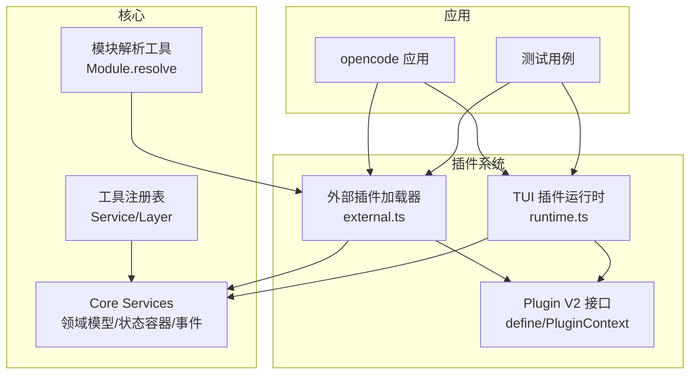
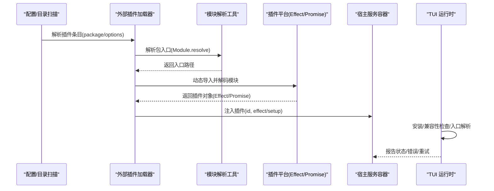
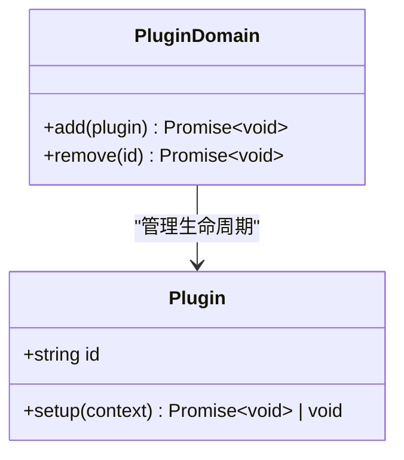
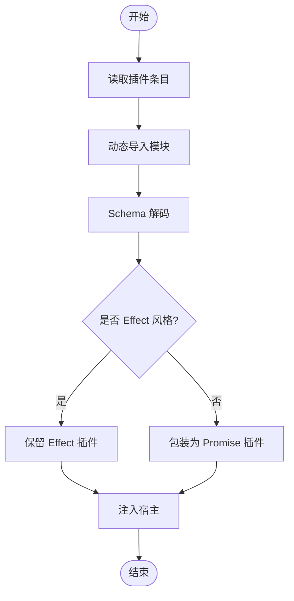
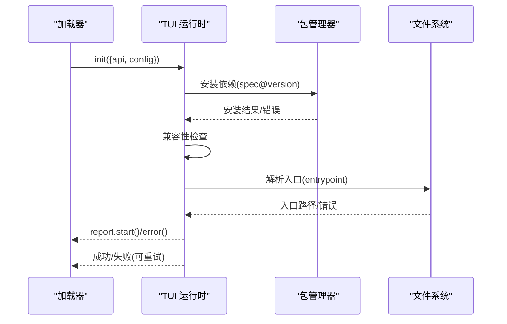
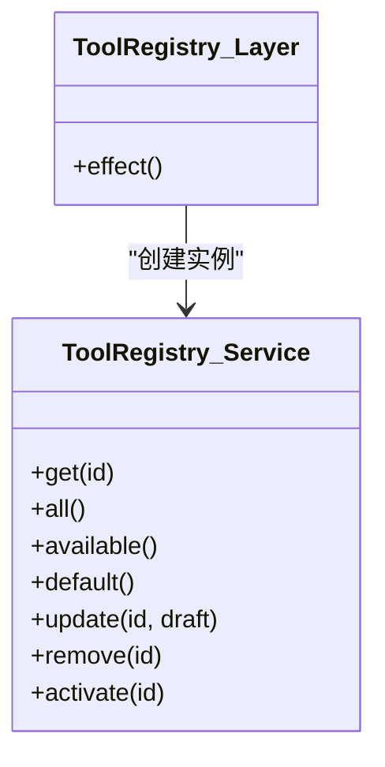
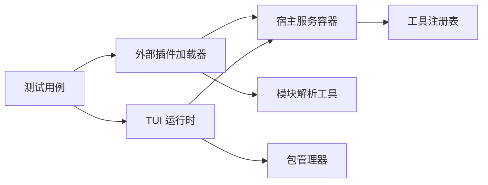

# 依赖注入与服务发现

<cite>
**本文引用的文件**   
- [packages/plugin/src/v2/promise/plugin.ts](file://packages/plugin/src/v2/promise/plugin.ts)
- [packages/core/src/config/plugin/external.ts](file://packages/core/src/config/plugin/external.ts)
- [packages/core/test/config/plugin.test.ts](file://packages/core/test/config/plugin.test.ts)
- [packages/opencode/src/plugin/tui/runtime.ts](file://packages/opencode/src/plugin/tui/runtime.ts)
- [packages/opencode/test/cli/tui/plugin-loader-entrypoint.test.ts](file://packages/opencode/test/cli/tui/plugin-loader-entrypoint.test.ts)
- [packages/opencode/test/plugin/loader-shared.test.ts](file://packages/opencode/test/plugin/loader-shared.test.ts)
- [packages/core/src/util/module.ts](file://packages/core/src/util/module.ts)
- [packages/core/src/tool/registry.ts](file://packages/core/src/tool/registry.ts)
- [specs/v2/instructions.md](file://specs/v2/instructions.md)
- [specs/v2/config.md](file://specs/v2/config.md)
</cite>

## 目录
1. [简介](#简介)
2. [项目结构](#项目结构)
3. [核心组件](#核心组件)
4. [架构总览](#架构总览)
5. [详细组件分析](#详细组件分析)
6. [依赖关系分析](#依赖关系分析)
7. [性能考虑](#性能考虑)
8. [故障排查指南](#故障排查指南)
9. [结论](#结论)
10. [附录](#附录)

## 简介
本文件面向 openNovel 插件的依赖注入与服务发现系统，系统性阐述服务容器的注册机制、依赖解析算法与生命周期管理；解释服务发现的命名约定、版本兼容性与故障转移策略；并提供在插件中获取和使用其他服务的实践方法（含同步与异步依赖注入），以及完整的示例路径与常见问题排查方法。

## 项目结构
openNovel 采用“核心服务 + 插件”的分层架构：
- 核心层提供领域模型、类型化错误、状态容器、事件与插件钩子契约。
- 插件实现具体行为（如模型发现、生成、认证、配置等）。
- 应用层保持薄封装，调用核心服务而非直接持有领域逻辑。

图表来源
- [packages/core/src/tool/registry.ts:40-48](file://packages/core/src/tool/registry.ts#L40-L48)
- [packages/core/src/util/module.ts:1-10](file://packages/core/src/util/module.ts#L1-L10)
- [packages/plugin/src/v2/promise/plugin.ts:1-16](file://packages/plugin/src/v2/promise/plugin.ts#L1-L16)
- [packages/core/src/config/plugin/external.ts:80-91](file://packages/core/src/config/plugin/external.ts#L80-L91)
- [packages/opencode/src/plugin/tui/runtime.ts:738-785](file://packages/opencode/src/plugin/tui/runtime.ts#L738-L785)

章节来源
- [specs/v2/instructions.md:1-33](file://specs/v2/instructions.md#L1-L33)

## 核心组件
- 插件定义与上下文
  - 插件通过 define 函数声明 id 与 setup(context)，context 由宿主提供，包含服务访问能力。
  - 插件域支持动态添加与移除。
- 外部插件加载器
  - 从配置或目录扫描读取插件条目，动态导入模块，解码并适配为 Effect/Promise 两种风格插件，统一注入到宿主。
- TUI 插件运行时
  - 负责安装、兼容性检查、入口解析、元数据持久化与错误上报，支持重试与失败回退。
- 工具注册表
  - 以 Service/Layer 模式暴露能力，集中管理工具实例与输出存储，体现依赖注入与分层解耦。
- 模块解析工具
  - 基于 Node require.resolve 的能力，用于定位插件包入口。

章节来源
- [packages/plugin/src/v2/promise/plugin.ts:1-16](file://packages/plugin/src/v2/promise/plugin.ts#L1-L16)
- [packages/core/src/config/plugin/external.ts:80-91](file://packages/core/src/config/plugin/external.ts#L80-L91)
- [packages/opencode/src/plugin/tui/runtime.ts:738-785](file://packages/opencode/src/plugin/tui/runtime.ts#L738-L785)
- [packages/core/src/tool/registry.ts:40-48](file://packages/core/src/tool/registry.ts#L40-L48)
- [packages/core/src/util/module.ts:1-10](file://packages/core/src/util/module.ts#L1-L10)

## 架构总览
下图展示插件从配置到运行时的关键流程，包括安装、兼容性校验、入口解析、Effect/Promise 适配与宿主注入。

图表来源
- [packages/core/src/config/plugin/external.ts:80-91](file://packages/core/src/config/plugin/external.ts#L80-L91)
- [packages/core/src/util/module.ts:1-10](file://packages/core/src/util/module.ts#L1-L10)
- [packages/opencode/src/plugin/tui/runtime.ts:738-785](file://packages/opencode/src/plugin/tui/runtime.ts#L738-L785)

## 详细组件分析

### 插件定义与上下文（Plugin V2）
- 插件通过 define 包装，要求提供唯一 id 与 setup(context)。
- context 由宿主注入，插件可在此阶段完成服务订阅、钩子注册与资源初始化。
- 插件域支持 add/remove，便于热更新与动态扩展。

图表来源
- [packages/plugin/src/v2/promise/plugin.ts:1-16](file://packages/plugin/src/v2/promise/plugin.ts#L1-L16)

章节来源
- [packages/plugin/src/v2/promise/plugin.ts:1-16](file://packages/plugin/src/v2/promise/plugin.ts#L1-L16)

### 外部插件加载器（Effect 与 Promise 双栈）
- 从配置或目录读取插件条目，动态 import 模块，使用 Schema 解码为统一格式。
- 若模块导出 Effect 风格则直接使用，否则包装为 Promise 风格插件。
- 将插件 effect/setup 注入宿主，供后续依赖解析与调用。

图表来源
- [packages/core/src/config/plugin/external.ts:80-91](file://packages/core/src/config/plugin/external.ts#L80-L91)

章节来源
- [packages/core/src/config/plugin/external.ts:80-91](file://packages/core/src/config/plugin/external.ts#L80-L91)

### TUI 插件运行时（安装、兼容、入口、错误上报）
- 负责插件的安装、版本兼容性检查、入口解析与元数据持久化。
- 提供 start/missing/error 等回调，区分 install/compatibility/entry 等阶段进行差异化处理。
- 支持重试与失败回退，保证整体加载鲁棒性。

图表来源
- [packages/opencode/src/plugin/tui/runtime.ts:738-785](file://packages/opencode/src/plugin/tui/runtime.ts#L738-L785)
- [packages/opencode/test/cli/tui/plugin-loader-entrypoint.test.ts:228-265](file://packages/opencode/test/cli/tui/plugin-loader-entrypoint.test.ts#L228-L265)

章节来源
- [packages/opencode/src/plugin/tui/runtime.ts:738-785](file://packages/opencode/src/plugin/tui/runtime.ts#L738-L785)
- [packages/opencode/test/cli/tui/plugin-loader-entrypoint.test.ts:228-265](file://packages/opencode/test/cli/tui/plugin-loader-entrypoint.test.ts#L228-L265)

### 工具注册表（Service/Layer 模式）
- 以 Context.Service 暴露对外接口，Layer 封装私有状态与依赖。
- 统一管理工具实例与输出存储，体现依赖注入与分层解耦。

图表来源
- [packages/core/src/tool/registry.ts:40-48](file://packages/core/src/tool/registry.ts#L40-L48)

章节来源
- [packages/core/src/tool/registry.ts:40-48](file://packages/core/src/tool/registry.ts#L40-L48)

### 模块解析工具（Node 环境）
- 基于 createRequire 与 resolve，定位插件包入口路径。
- 捕获异常避免解析失败影响整体流程。

章节来源
- [packages/core/src/util/module.ts:1-10](file://packages/core/src/util/module.ts#L1-L10)

### 配置与插件清单（v2 规范）
- plugins 字段支持字符串或对象形式，保留顺序加载语义。
- 本地插件目录与包加载分离，确保可预测的加载顺序与钩子执行顺序。

章节来源
- [specs/v2/config.md:84-110](file://specs/v2/config.md#L84-L110)

## 依赖关系分析
- 插件与宿主之间通过 Service/Layer 与 Context 解耦，避免循环依赖。
- 外部加载器与 TUI 运行时分别承担“通用插件”和“TUI 插件”的职责边界。
- 测试覆盖安装、兼容性、入口解析与错误上报等关键路径。

图表来源
- [packages/core/src/config/plugin/external.ts:80-91](file://packages/core/src/config/plugin/external.ts#L80-L91)
- [packages/opencode/src/plugin/tui/runtime.ts:738-785](file://packages/opencode/src/plugin/tui/runtime.ts#L738-L785)
- [packages/core/src/tool/registry.ts:40-48](file://packages/core/src/tool/registry.ts#L40-L48)
- [packages/core/src/util/module.ts:1-10](file://packages/core/src/util/module.ts#L1-L10)

章节来源
- [packages/opencode/test/plugin/loader-shared.test.ts:253-300](file://packages/opencode/test/plugin/loader-shared.test.ts#L253-L300)
- [packages/opencode/test/plugin/loader-shared.test.ts:1276-1306](file://packages/opencode/test/plugin/loader-shared.test.ts#L1276-L1306)

## 性能考虑
- 延迟加载与按需解析：仅在需要时解析模块入口，减少启动开销。
- 并发与分片：插件加载可并行化（例如目录扫描与 npm 安装），但需控制并发度避免 I/O 风暴。
- 缓存与元数据：对已解析的插件元数据进行持久化，避免重复计算。
- 错误快速失败：在 install/compatibility/entry 各阶段尽早失败，缩短失败路径。

[本节为通用指导，不直接分析具体文件]

## 故障排查指南
- 插件未找到入口
  - 现象：report.missing 被触发，提示无入口。
  - 排查：确认 package.json 的 exports/main 是否正确；检查 entrypoint 解析逻辑。
  - 参考路径：[packages/opencode/src/plugin/tui/runtime.ts:738-785](file://packages/opencode/src/plugin/tui/runtime.ts#L738-L785)
- 版本不兼容
  - 现象：report.error(stage="compatibility") 被触发。
  - 排查：核对插件 spec 的版本范围与宿主期望；必要时降级或升级插件。
  - 参考路径：[packages/opencode/src/plugin/tui/runtime.ts:738-785](file://packages/opencode/src/plugin/tui/runtime.ts#L738-L785)
- 安装失败
  - 现象：report.error(stage="install") 被触发。
  - 排查：网络与权限问题；镜像源配置；依赖冲突。
  - 参考路径：[packages/opencode/test/plugin/loader-shared.test.ts:1276-1306](file://packages/opencode/test/plugin/loader-shared.test.ts#L1276-L1306)
- 入口解析失败
  - 现象：report.error(stage="entry") 被触发。
  - 排查：模块导出格式不符合预期；缺少默认导出；路径不正确。
  - 参考路径：[packages/core/src/config/plugin/external.ts:80-91](file://packages/core/src/config/plugin/external.ts#L80-L91)
- 插件顺序与钩子执行
  - 现象：某些钩子未按预期执行。
  - 排查：确认 plugins 列表顺序；避免跨插件强耦合。
  - 参考路径：[specs/v2/config.md:84-110](file://specs/v2/config.md#L84-L110)

章节来源
- [packages/opencode/src/plugin/tui/runtime.ts:738-785](file://packages/opencode/src/plugin/tui/runtime.ts#L738-L785)
- [packages/core/src/config/plugin/external.ts:80-91](file://packages/core/src/config/plugin/external.ts#L80-L91)
- [packages/opencode/test/plugin/loader-shared.test.ts:1276-1306](file://packages/opencode/test/plugin/loader-shared.test.ts#L1276-L1306)
- [specs/v2/config.md:84-110](file://specs/v2/config.md#L84-L110)

## 结论
openNovel 的依赖注入与服务发现体系以 Service/Layer 为核心，结合 Effect/Promise 双栈插件模型，实现了高内聚、低耦合的可插拔架构。通过严格的安装、兼容性与入口解析流程，配合完善的错误上报与重试机制，保证了插件生态的稳定与可扩展。建议遵循 v2 配置规范与插件契约，合理组织插件顺序与依赖，以获得最佳的可维护性与性能表现。

[本节为总结性内容，不直接分析具体文件]

## 附录

### 如何在插件中获取并使用其他服务
- 同步依赖注入
  - 在 setup(context) 中通过 context 提供的服务接口直接调用（如 get/all/update 等）。
  - 适用于轻量、非阻塞操作。
- 异步依赖注入
  - 使用 Effect 风格的 service 调用，结合 Effect.provideService 注入依赖。
  - 适用于 IO、网络与复杂编排场景。
- 示例参考
  - 插件注册与宿主注入：[packages/core/src/config/plugin/external.ts:80-91](file://packages/core/src/config/plugin/external.ts#L80-L91)
  - 测试中的服务提供与等待：[packages/core/test/config/plugin.test.ts:73-104](file://packages/core/test/config/plugin.test.ts#L73-L104), [packages/core/test/config/plugin.test.ts:214-238](file://packages/core/test/config/plugin.test.ts#L214-L238)

### 服务容器与依赖解析算法要点
- 容器注册
  - 通过 Layer.effect 创建 Service 实例，显式声明依赖。
  - 使用 Context.Service.of 提供默认实现与工厂。
- 依赖解析
  - 按引用图拓扑排序，避免循环依赖。
  - 优先解析 Effect 依赖，再包装 Promise 依赖。
- 生命周期
  - 初始化：加载配置、解析模块、安装依赖、兼容性检查。
  - 运行期：按需解析入口、注册钩子、暴露服务。
  - 销毁：清理资源、释放监听、持久化元数据。

章节来源
- [packages/core/src/tool/registry.ts:40-48](file://packages/core/src/tool/registry.ts#L40-L48)
- [packages/core/test/config/plugin.test.ts:73-104](file://packages/core/test/config/plugin.test.ts#L73-L104)
- [packages/core/test/config/plugin.test.ts:214-238](file://packages/core/test/config/plugin.test.ts#L214-L238)