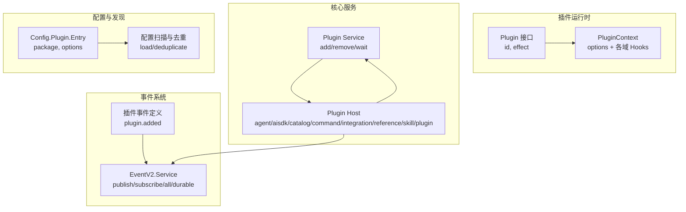
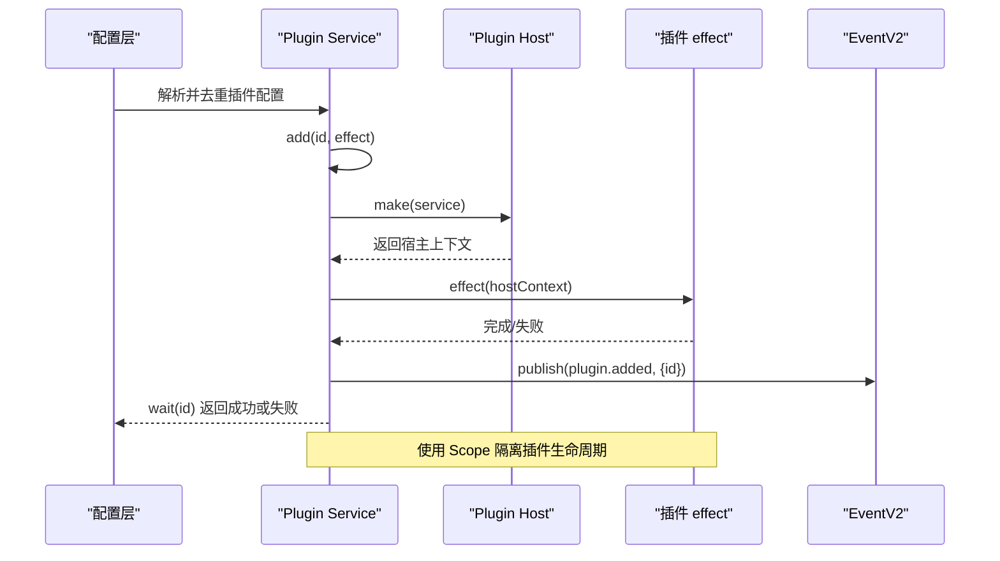
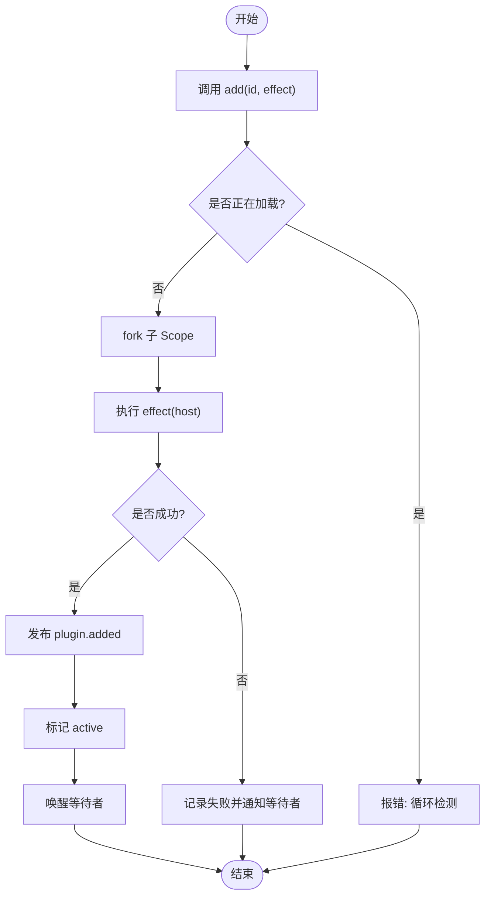
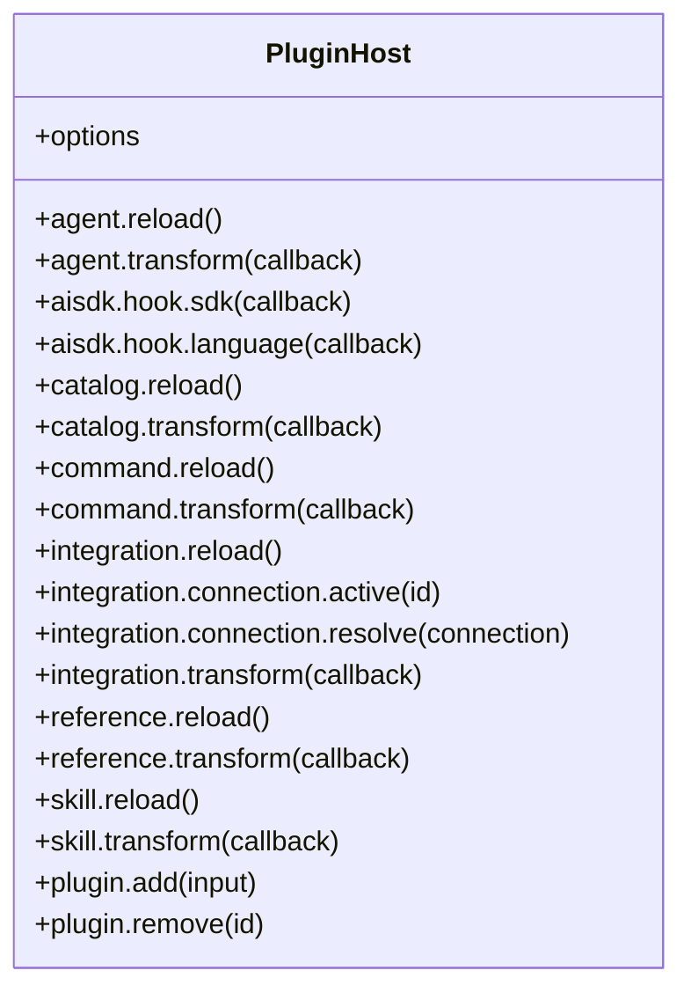
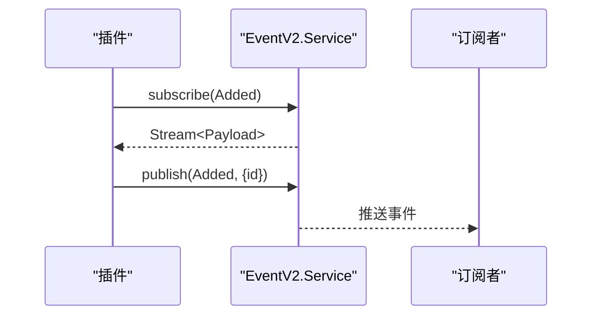
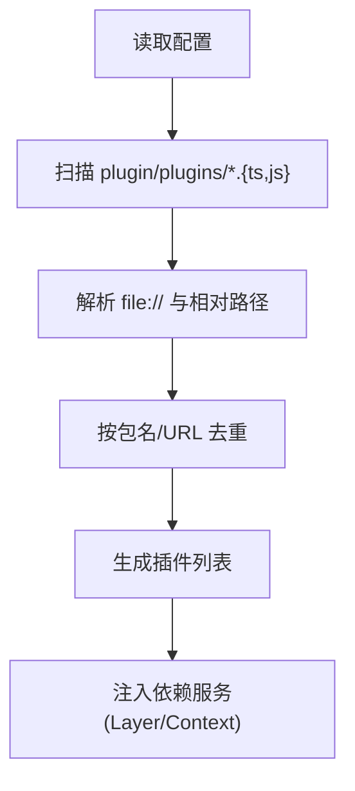
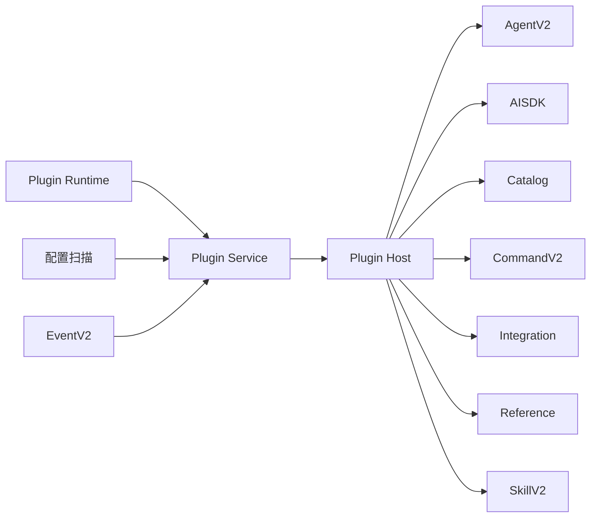

# 插件 API

<cite>
**本文引用的文件**
- [packages/core/src/plugin.ts](file://packages/core/src/plugin.ts)
- [packages/core/src/plugin/host.ts](file://packages/core/src/plugin/host.ts)
- [packages/core/src/config/plugin.ts](file://packages/core/src/config/plugin.ts)
- [packages/schema/src/plugin.ts](file://packages/schema/src/plugin.ts)
- [packages/plugin/src/v2/effect/plugin.ts](file://packages/plugin/src/v2/effect/plugin.ts)
- [packages/plugin/src/v2/effect/context.ts](file://packages/plugin/src/v2/effect/context.ts)
- [packages/opencode/src/config/plugin.ts](file://packages/opencode/src/config/plugin.ts)
- [packages/core/src/event.ts](file://packages/core/src/event.ts)
</cite>

## 目录
1. [简介](#简介)
2. [项目结构](#项目结构)
3. [核心组件](#核心组件)
4. [架构总览](#架构总览)
5. [详细组件分析](#详细组件分析)
6. [依赖关系分析](#依赖关系分析)
7. [性能考量](#性能考量)
8. [故障排查指南](#故障排查指南)
9. [结论](#结论)
10. [附录](#附录)

## 简介
本文件为 openNovel 的插件系统 API 文档，面向插件开发者与集成者。内容覆盖：
- 插件生命周期钩子：初始化、加载、执行与卸载
- 插件扩展点：中间件注册、处理器注入与事件订阅机制
- 插件配置管理、依赖注入与服务发现
- 插件开发模板、API 调用示例与调试方法
- 安全机制、权限控制与沙箱隔离说明

## 项目结构
openNovel 的插件系统由“插件运行时”、“插件宿主（Host）”、“插件上下文（Context）”、“配置解析与发现”和“事件系统”等模块组成。核心路径如下：
- 插件运行时接口与定义：packages/plugin/src/v2/effect/plugin.ts
- 插件上下文能力集合：packages/plugin/src/v2/effect/context.ts
- 插件服务与生命周期编排：packages/core/src/plugin.ts
- 插件宿主对外暴露的能力：packages/core/src/plugin/host.ts
- 插件配置 Schema 与类型：packages/core/src/config/plugin.ts、packages/schema/src/plugin.ts
- 配置扫描与去重：packages/opencode/src/config/plugin.ts
- 事件系统与插件事件：packages/core/src/event.ts、packages/schema/src/plugin.ts

图表来源
- [packages/plugin/src/v2/effect/plugin.ts:1-17](file://packages/plugin/src/v2/effect/plugin.ts#L1-L17)
- [packages/plugin/src/v2/effect/context.ts:1-23](file://packages/plugin/src/v2/effect/context.ts#L1-L23)
- [packages/core/src/plugin.ts:1-168](file://packages/core/src/plugin.ts#L1-L168)
- [packages/core/src/plugin/host.ts:1-220](file://packages/core/src/plugin/host.ts#L1-L220)
- [packages/core/src/config/plugin.ts:1-14](file://packages/core/src/config/plugin.ts#L1-L14)
- [packages/opencode/src/config/plugin.ts:1-80](file://packages/opencode/src/config/plugin.ts#L1-L80)
- [packages/core/src/event.ts:1-639](file://packages/core/src/event.ts#L1-L639)
- [packages/schema/src/plugin.ts:1-14](file://packages/schema/src/plugin.ts#L1-L14)

章节来源
- [packages/core/src/plugin.ts:1-168](file://packages/core/src/plugin.ts#L1-L168)
- [packages/core/src/plugin/host.ts:1-220](file://packages/core/src/plugin/host.ts#L1-L220)
- [packages/plugin/src/v2/effect/plugin.ts:1-17](file://packages/plugin/src/v2/effect/plugin.ts#L1-L17)
- [packages/plugin/src/v2/effect/context.ts:1-23](file://packages/plugin/src/v2/effect/context.ts#L1-L23)
- [packages/core/src/config/plugin.ts:1-14](file://packages/core/src/config/plugin.ts#L1-L14)
- [packages/opencode/src/config/plugin.ts:1-80](file://packages/opencode/src/config/plugin.ts#L1-L80)
- [packages/core/src/event.ts:1-639](file://packages/core/src/event.ts#L1-L639)
- [packages/schema/src/plugin.ts:1-14](file://packages/schema/src/plugin.ts#L1-L14)

## 核心组件
- 插件运行时接口 Plugin：包含 id 与 effect，effect 在宿主提供的上下文中运行，返回 Effect<void>。
- 插件上下文 PluginContext：提供 options 与各域 Hook（agent、aisdk、catalog、command、integration、reference、skill），以及 plugin 域用于动态增删插件。
- 插件服务 Plugin Service：提供 add/remove/wait，负责插件实例化、作用域隔离、等待与失败传播。
- 插件宿主 Plugin Host：将宿主能力以只读或 transform 方式暴露给插件，避免直接修改全局状态。
- 配置 Schema：支持字符串包名或 Entry（package/options）两种形式。
- 事件系统：插件通过 EventV2 发布/订阅事件，包括内置的 plugin.added。

章节来源
- [packages/plugin/src/v2/effect/plugin.ts:1-17](file://packages/plugin/src/v2/effect/plugin.ts#L1-L17)
- [packages/plugin/src/v2/effect/context.ts:1-23](file://packages/plugin/src/v2/effect/context.ts#L1-L23)
- [packages/core/src/plugin.ts:1-168](file://packages/core/src/plugin.ts#L1-L168)
- [packages/core/src/plugin/host.ts:1-220](file://packages/core/src/plugin/host.ts#L1-L220)
- [packages/core/src/config/plugin.ts:1-14](file://packages/core/src/config/plugin.ts#L1-L14)
- [packages/core/src/event.ts:1-639](file://packages/core/src/event.ts#L1-L639)
- [packages/schema/src/plugin.ts:1-14](file://packages/schema/src/plugin.ts#L1-L14)

## 架构总览
下图展示了插件从配置到运行的关键流程：配置解析 -> 插件加载 -> 宿主上下文注入 -> 插件 effect 执行 -> 事件广播 -> 资源清理。

图表来源
- [packages/opencode/src/config/plugin.ts:1-80](file://packages/opencode/src/config/plugin.ts#L1-L80)
- [packages/core/src/plugin.ts:1-168](file://packages/core/src/plugin.ts#L1-L168)
- [packages/core/src/plugin/host.ts:1-220](file://packages/core/src/plugin/host.ts#L1-L220)
- [packages/core/src/event.ts:1-639](file://packages/core/src/event.ts#L1-L639)
- [packages/schema/src/plugin.ts:1-14](file://packages/schema/src/plugin.ts#L1-L14)

## 详细组件分析

### 插件生命周期与钩子
- 初始化阶段
  - 构建 Plugin Service，创建 KeyedMutex、Scope、active/loading/waiters/failures 等内部状态。
  - 构建 Plugin Host，将宿主能力注入到插件上下文。
- 加载阶段
  - add(id, effect) 加锁后进入加载流程：关闭旧实例（如有）、fork 子 Scope、执行 effect(host)、记录 active、发布 Added 事件、唤醒等待者。
  - 失败时记录 failures 并通知等待者。
- 执行阶段
  - 插件 effect 在独立 Scope 中运行，可通过 PluginContext 访问宿主能力。
- 卸载阶段
  - remove(id) 关闭当前 active Scope，清理失败记录；Service finalizer 在退出时关闭所有 Scope。

图表来源
- [packages/core/src/plugin.ts:31-143](file://packages/core/src/plugin.ts#L31-L143)

章节来源
- [packages/core/src/plugin.ts:31-143](file://packages/core/src/plugin.ts#L31-L143)

### 插件扩展点与宿主能力
Plugin Host 暴露以下扩展点（均为只读或 transform 模式，避免直接破坏全局状态）：
- agent：reload、transform（list/get/default/update/remove）
- aisdk：hook.sdk、hook.language（可修改 model/package/options/sdk/language）
- catalog：reload、transform（provider/model 的 CRUD 与默认值）
- command：reload、transform
- integration：reload、connection.active/resolve、transform（method authorize/refresh/env/key）
- reference：reload、transform（add/remove/list）
- skill：reload、transform（source/list）
- plugin：add/remove（允许插件动态装配其他插件）

图表来源
- [packages/core/src/plugin/host.ts:1-220](file://packages/core/src/plugin/host.ts#L1-L220)

章节来源
- [packages/core/src/plugin/host.ts:1-220](file://packages/core/src/plugin/host.ts#L1-L220)

### 事件订阅机制
- 插件可使用 EventV2.Service 发布/订阅事件。
- 内置事件：plugin.added（携带 id）。
- 订阅方式：subscribe(definition) 返回 Stream；all() 获取全部事件流；durable(aggregateID) 持久化回放。
- 发布方式：publish(definition, data, options)，支持 location/metadata/commit。

图表来源
- [packages/core/src/event.ts:1-639](file://packages/core/src/event.ts#L1-L639)
- [packages/schema/src/plugin.ts:1-14](file://packages/schema/src/plugin.ts#L1-L14)

章节来源
- [packages/core/src/event.ts:1-639](file://packages/core/src/event.ts#L1-L639)
- [packages/schema/src/plugin.ts:1-14](file://packages/schema/src/plugin.ts#L1-L14)

### 插件配置管理与依赖注入
- 配置 Schema：支持字符串或 Entry（package/options）。
- 配置扫描与去重：按目录扫描 plugin/plugins 下的 ts/js 文件，支持 file:// 与相对路径解析，按包名或精确 URL 去重。
- 依赖注入：通过 Effect Layer 与 Context 注入 Agent/AISDK/Catalog/Command/Integration/Reference/Skill 等服务，插件通过 PluginContext 访问。

图表来源
- [packages/core/src/config/plugin.ts:1-14](file://packages/core/src/config/plugin.ts#L1-L14)
- [packages/opencode/src/config/plugin.ts:1-80](file://packages/opencode/src/config/plugin.ts#L1-L80)
- [packages/core/src/plugin.ts:145-168](file://packages/core/src/plugin.ts#L145-L168)

章节来源
- [packages/core/src/config/plugin.ts:1-14](file://packages/core/src/config/plugin.ts#L1-L14)
- [packages/opencode/src/config/plugin.ts:1-80](file://packages/opencode/src/config/plugin.ts#L1-L80)
- [packages/core/src/plugin.ts:145-168](file://packages/core/src/plugin.ts#L145-L168)

### 插件开发模板与 API 调用示例
- 插件模板
  - 导出一个对象，包含 id 与 effect(context) => Effect<void>。
  - 通过 context.options 读取配置项。
  - 通过 context.agent/catalag/command/integration/reference/skill 的 transform/hook 进行扩展。
  - 通过 context.plugin.add/remove 动态装配其他插件。
- API 调用示例（描述性）
  - 在宿主侧调用 Plugin Service 的 add(id, effect) 启动插件。
  - 使用 wait(id) 等待插件加载完成或失败。
  - 在插件内使用 EventV2.publish 发布自定义事件，或使用 subscribe 订阅宿主事件。

章节来源
- [packages/plugin/src/v2/effect/plugin.ts:1-17](file://packages/plugin/src/v2/effect/plugin.ts#L1-L17)
- [packages/plugin/src/v2/effect/context.ts:1-23](file://packages/plugin/src/v2/effect/context.ts#L1-L23)
- [packages/core/src/plugin.ts:23-29](file://packages/core/src/plugin.ts#L23-L29)
- [packages/core/src/event.ts:126-148](file://packages/core/src/event.ts#L126-L148)

### 调试方法与常见问题
- 使用 wait(id) 捕获加载失败：若插件加载失败，wait 会返回失败 Exit，便于上层处理。
- 日志与 Span：插件加载过程带有 Span 属性（如 plugin.id），可用于链路追踪。
- 事件调试：订阅 all() 或具体事件类型，观察 plugin.added 等事件。
- 常见错误：
  - 循环加载：同一 id 重复加载会触发循环检测错误。
  - 并发冲突：KeyedMutex 保证同一 id 的串行化操作。

章节来源
- [packages/core/src/plugin.ts:43-83](file://packages/core/src/plugin.ts#L43-L83)
- [packages/core/src/plugin.ts:100-126](file://packages/core/src/plugin.ts#L100-L126)
- [packages/core/src/event.ts:398-417](file://packages/core/src/event.ts#L398-L417)

## 依赖关系分析
- 插件运行时依赖 Effect/Scope/Layer/Context 等基础能力。
- Plugin Service 依赖 EventV2、AgentV2、AISDK、Catalog、CommandV2、Integration、Reference、SkillV2 等位置节点。
- Plugin Host 依赖上述各域 Service，并以 transform/hook 的方式暴露能力。
- 配置层依赖 Glob 扫描与路径解析，最终产出插件清单。

图表来源
- [packages/core/src/plugin.ts:145-168](file://packages/core/src/plugin.ts#L145-L168)
- [packages/core/src/plugin/host.ts:1-220](file://packages/core/src/plugin/host.ts#L1-L220)
- [packages/opencode/src/config/plugin.ts:1-80](file://packages/opencode/src/config/plugin.ts#L1-L80)

章节来源
- [packages/core/src/plugin.ts:145-168](file://packages/core/src/plugin.ts#L145-L168)
- [packages/core/src/plugin/host.ts:1-220](file://packages/core/src/plugin/host.ts#L1-L220)
- [packages/opencode/src/config/plugin.ts:1-80](file://packages/opencode/src/config/plugin.ts#L1-L80)

## 性能考量
- 作用域隔离：每个插件在独立 Scope 中运行，避免内存泄漏与资源竞争。
- 串行化加载：KeyedMutex 确保同一插件 id 的操作串行化，减少竞态。
- 批量状态更新：State.batch 合并状态变更，降低频繁更新开销。
- 事件流：EventV2 使用 PubSub/Stream 实现高效分发，支持有界队列与背压。

[本节为通用指导，不直接分析具体文件]

## 故障排查指南
- 插件加载失败
  - 检查 wait(id) 返回的失败 Exit，定位 effect 中的异常。
  - 查看 Span 与日志，确认插件 id 与加载路径。
- 循环加载
  - 避免对同一 id 重复 add，或在 loading 状态中再次 add。
- 事件未触发
  - 确认事件定义与 schema 匹配，检查订阅是否正确。
- 资源未释放
  - 确保插件 effect 正确返回，或显式释放资源；Service finalizer 会在退出时关闭所有 Scope。

章节来源
- [packages/core/src/plugin.ts:43-83](file://packages/core/src/plugin.ts#L43-L83)
- [packages/core/src/event.ts:398-417](file://packages/core/src/event.ts#L398-L417)

## 结论
openNovel 的插件系统以 Effect 为核心，结合 Scope 隔离与 Layer/Context 依赖注入，提供了稳定可扩展的插件生命周期与宿主能力扩展点。通过统一的事件系统与配置管理，插件可以安全地参与系统功能增强与业务编排。

[本节为总结性内容，不直接分析具体文件]

## 附录
- 插件安全机制与权限控制
  - 插件通过 transform/hook 修改宿主状态，而非直接写入，降低越权风险。
  - 插件间通过 EventV2 通信，避免共享可变状态。
  - 建议对敏感能力（如 aisdk、integration）进行最小权限开放。
- 沙箱隔离说明
  - 插件运行在独立 Scope 中，资源与副作用被限制在插件作用域内。
  - 如需更严格的隔离（进程级/VM 级），可在宿主层进一步封装。

[本节为概念性说明，不直接分析具体文件]