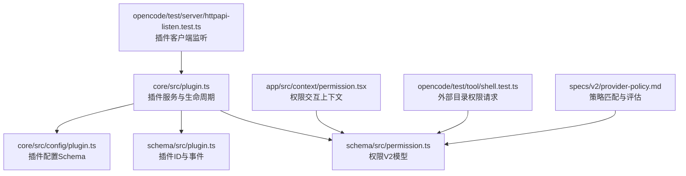
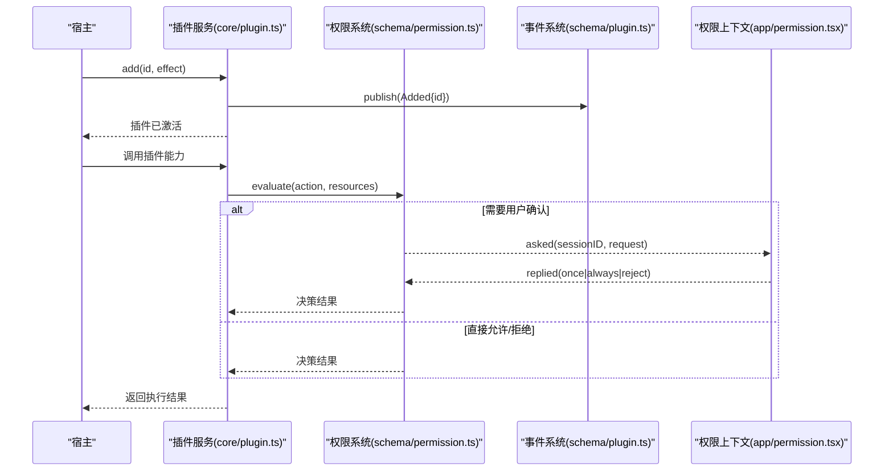
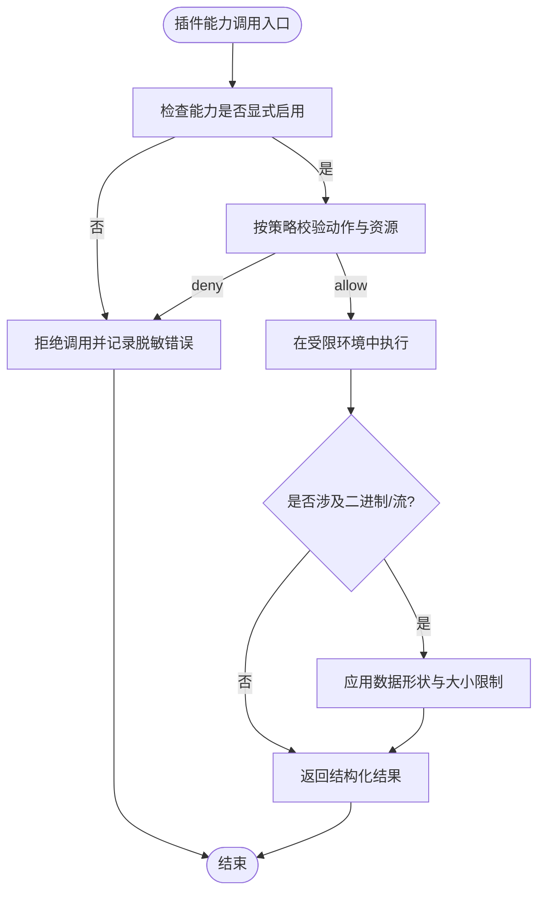
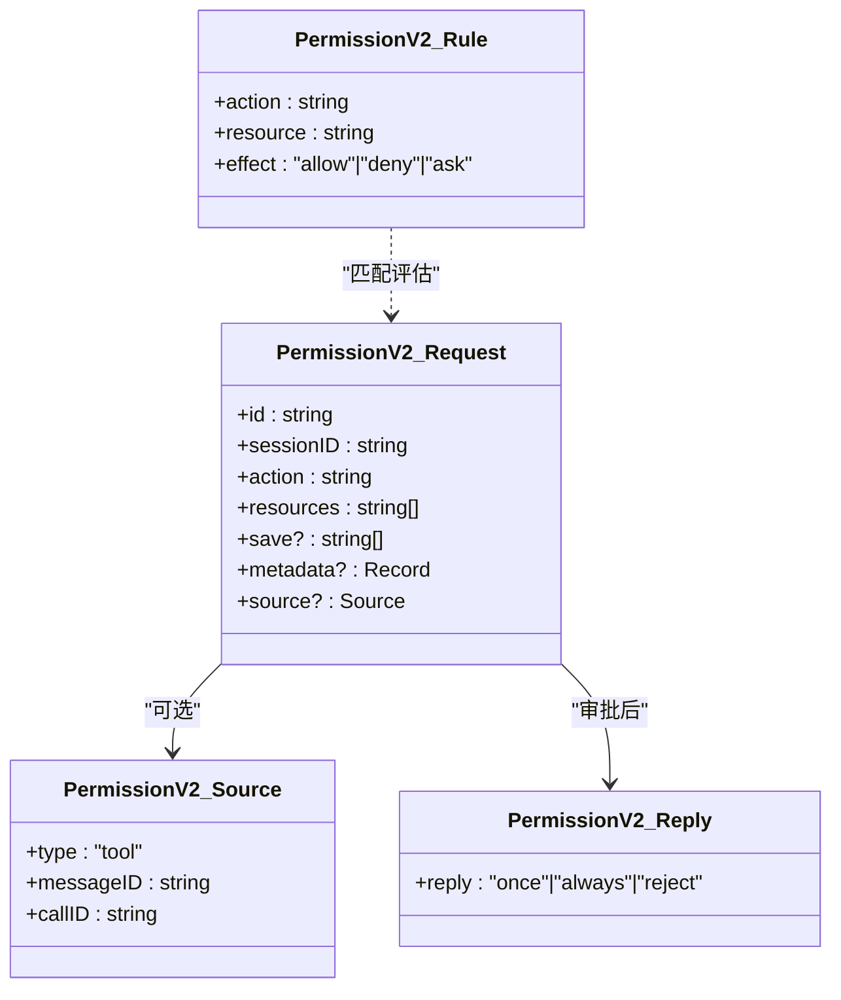
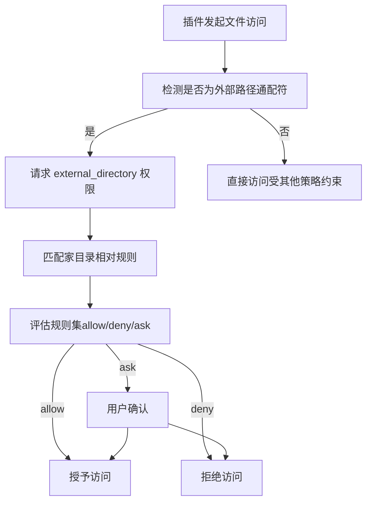
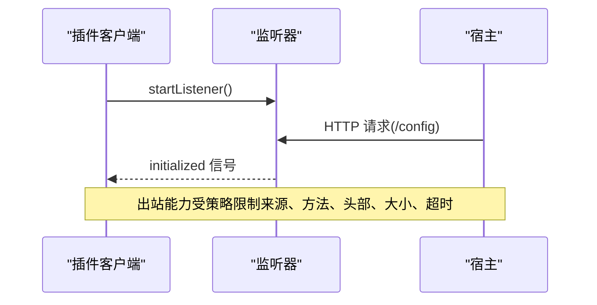
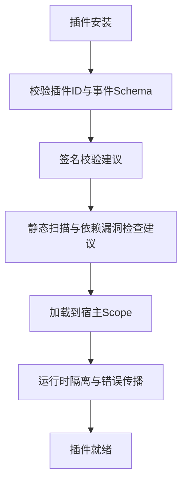
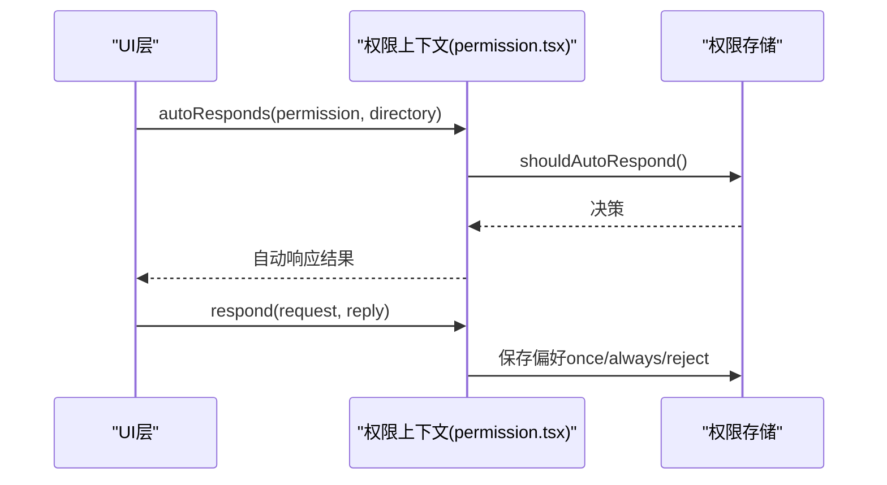
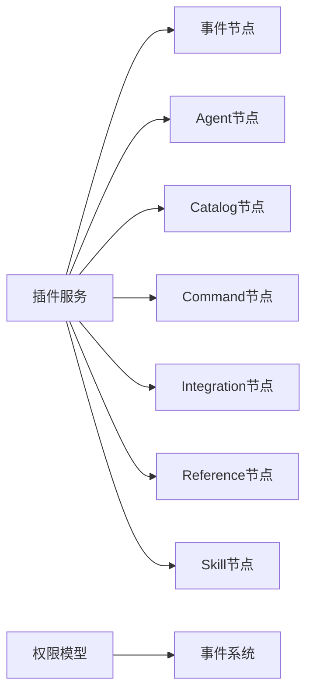

# 插件安全机制

<cite>
**本文引用的文件**   
- [packages/core/src/plugin.ts](file://packages/core/src/plugin.ts)
- [packages/core/src/config/plugin.ts](file://packages/core/src/config/plugin.ts)
- [packages/schema/src/plugin.ts](file://packages/schema/src/plugin.ts)
- [packages/schema/src/permission.ts](file://packages/schema/src/permission.ts)
- [packages/schema/src/v1/permission.ts](file://packages/schema/src/v1/permission.ts)
- [packages/opencode/test/server/httpapi-listen.test.ts](file://packages/opencode/test/server/httpapi-listen.test.ts)
- [packages/opencode/test/tool/shell.test.ts](file://packages/opencode/test/tool/shell.test.ts)
- [packages/app/src/context/permission.tsx](file://packages/app/src/context/permission.tsx)
- [packages/core/test/config/agent.test.ts](file://packages/core/test/config/agent.test.ts)
- [packages/opencode/test/permission/next.test.ts](file://packages/opencode/test/permission/next.test.ts)
- [specs/v2/provider-policy.md](file://specs/v2/provider-policy.md)
- [packages/codemode/AGENTS.md](file://packages/codemode/AGENTS.md)
- [packages/codemode/codemode.md](file://packages/codemode/codemode.md)
</cite>

## 目录
1. [简介](#简介)
2. [项目结构](#项目结构)
3. [核心组件](#核心组件)
4. [架构总览](#架构总览)
5. [详细组件分析](#详细组件分析)
6. [依赖关系分析](#依赖关系分析)
7. [性能考虑](#性能考虑)
8. [故障排查指南](#故障排查指南)
9. [结论](#结论)
10. [附录](#附录)

## 简介
本文件面向 openNovel 的插件安全机制，系统性阐述插件沙箱隔离、权限控制模型与资源限制策略。重点覆盖：
- 插件代码执行的安全边界（能力白名单、宿主能力显式暴露）
- 文件系统访问控制（路径匹配、家目录相对规则、通配符策略）
- 网络请求限制（出站能力、来源与方法控制、响应大小与超时）
- 插件验证与签名校验流程（加载前校验、运行时隔离）
- 安全扫描与审计（漏洞识别、依赖风险、配置安全）
- 安全配置示例与最佳实践
- 常见威胁防护与应急响应流程

## 项目结构
openNovel 的插件体系由“插件运行时服务”“权限模型”“事件系统”“配置模式”等模块组成。核心入口位于 core 层的插件服务，schema 层定义权限与事件契约，opencode 测试用例体现权限请求与隔离行为，app 层提供权限交互上下文。

**图表来源** 
- [packages/core/src/plugin.ts:1-168](file://packages/core/src/plugin.ts#L1-L168)
- [packages/schema/src/plugin.ts:1-14](file://packages/schema/src/plugin.ts#L1-L14)
- [packages/core/src/config/plugin.ts:1-14](file://packages/core/src/config/plugin.ts#L1-L14)
- [packages/schema/src/permission.ts:1-65](file://packages/schema/src/permission.ts#L1-L65)
- [packages/opencode/test/tool/shell.test.ts:321-342](file://packages/opencode/test/tool/shell.test.ts#L321-L342)
- [packages/opencode/test/server/httpapi-listen.test.ts:334-354](file://packages/opencode/test/server/httpapi-listen.test.ts#L334-L354)
- [specs/v2/provider-policy.md:61-84](file://specs/v2/provider-policy.md#L61-L84)

**章节来源**
- [packages/core/src/plugin.ts:1-168](file://packages/core/src/plugin.ts#L1-L168)
- [packages/schema/src/plugin.ts:1-14](file://packages/schema/src/plugin.ts#L1-L14)
- [packages/core/src/config/plugin.ts:1-14](file://packages/core/src/config/plugin.ts#L1-L14)

## 核心组件
- 插件服务与生命周期
  - 插件加载、激活、等待与移除，使用 Effect 的 Scope 进行资源隔离与错误传播。
  - 通过 KeyedMutex 保证同一插件 ID 的并发安全。
  - 事件发布 Added 以通知插件加入。
- 权限模型（V2）
  - 基于 action/resource/effect 的规则集，支持 allow/deny/ask。
  - 请求包含 sessionID、resources、save、metadata、source 等字段。
  - 事件 Asked/Replied 驱动权限审批流。
- 插件配置 Schema
  - 支持字符串或对象形式（package/options），用于声明插件包与选项。
- 插件事件与标识
  - Plugin.ID 与 Event.Added 定义插件标识与生命周期事件。

**章节来源**
- [packages/core/src/plugin.ts:1-168](file://packages/core/src/plugin.ts#L1-L168)
- [packages/schema/src/permission.ts:1-65](file://packages/schema/src/permission.ts#L1-L65)
- [packages/core/src/config/plugin.ts:1-14](file://packages/core/src/config/plugin.ts#L1-L14)
- [packages/schema/src/plugin.ts:1-14](file://packages/schema/src/plugin.ts#L1-L14)

## 架构总览
插件在宿主中通过 Service 管理生命周期，权限系统对敏感操作进行拦截与审批，事件贯穿插件与权限子系统。

**图表来源** 
- [packages/core/src/plugin.ts:1-168](file://packages/core/src/plugin.ts#L1-L168)
- [packages/schema/src/permission.ts:1-65](file://packages/schema/src/permission.ts#L1-L65)
- [packages/schema/src/plugin.ts:1-14](file://packages/schema/src/plugin.ts#L1-L14)
- [packages/app/src/context/permission.tsx:411-431](file://packages/app/src/context/permission.tsx#L411-L431)

## 详细组件分析

### 插件沙箱与执行边界
- 能力白名单与显式暴露
  - 宿主能力（如 fetch、crypto、文件系统句柄、额外模块、网络客户端）应默认不可用，需显式开启并受策略控制。
  - 若启用网络能力，应限制来源、方法、头部、响应大小与超时，并规定响应体是否可回传或仅摘要。
- 失败分类与错误隔离
  - 区分解析/编译错误、不支持语法、用户抛出错误、工具拒绝、内部失败、超时与真实运行时缺陷，避免将一切视为通用执行失败。
  - 保持公开/私有错误分离，宿主诊断信息需脱敏。
- 二进制边界与数据形状
  - 跨沙箱的二进制类型（Blob、File、ArrayBuffer、流、TypedArray）需采用显式标记的数据形状与尺寸限制，避免依赖环境序列化。

**图表来源** 
- [packages/codemode/AGENTS.md:16-24](file://packages/codemode/AGENTS.md#L16-L24)
- [packages/codemode/codemode.md:171-177](file://packages/codemode/codemode.md#L171-L177)

**章节来源**
- [packages/codemode/AGENTS.md:16-24](file://packages/codemode/AGENTS.md#L16-L24)
- [packages/codemode/codemode.md:171-177](file://packages/codemode/codemode.md#L171-L177)

### 权限控制模型（V2）
- 规则集与匹配
  - 规则由 action、resource、effect 构成；匹配遵循通配符语义，顺序决定最终结果。
  - 支持全局规则优先于代理特定规则。
- 请求与回复
  - 请求携带 sessionID、action、resources、save、metadata、source 等。
  - 回复可为 once、always、reject，驱动一次性、永久或拒绝授权。
- 事件流
  - permission.v2.asked 与 permission.v2.replied 事件串联审批流程。

**图表来源** 
- [packages/schema/src/permission.ts:1-65](file://packages/schema/src/permission.ts#L1-L65)

**章节来源**
- [packages/schema/src/permission.ts:1-65](file://packages/schema/src/permission.ts#L1-L65)
- [specs/v2/provider-policy.md:61-84](file://specs/v2/provider-policy.md#L61-L84)

### 文件系统访问控制
- 外部目录权限请求
  - 当插件访问通配符外部路径时，会触发 external_directory 权限请求，包含目标模式。
- 家目录相对匹配
  - 支持 POSIX 与 Windows 路径的家目录相对匹配，确保仅允许指定子目录访问。
- 通配符与安全性
  - 谨慎使用 *，建议最小化范围；对 __proto__/constructor/prototype 等路径段需统一处理策略。

**图表来源** 
- [packages/opencode/test/tool/shell.test.ts:321-342](file://packages/opencode/test/tool/shell.test.ts#L321-L342)
- [packages/core/test/config/agent.test.ts:22-57](file://packages/core/test/config/agent.test.ts#L22-L57)
- [packages/codemode/codemode.md:171-177](file://packages/codemode/codemode.md#L171-L177)

**章节来源**
- [packages/opencode/test/tool/shell.test.ts:321-342](file://packages/opencode/test/tool/shell.test.ts#L321-L342)
- [packages/core/test/config/agent.test.ts:22-57](file://packages/core/test/config/agent.test.ts#L22-L57)
- [packages/codemode/codemode.md:171-177](file://packages/codemode/codemode.md#L171-L177)

### 网络请求限制
- 出站能力策略
  - 若启用 fetch，需限制 allowed origins、methods、headers、response size、timeout，以及响应体是否可返回或仅摘要。
- 插件客户端监听
  - 插件客户端启动监听器，接收来自宿主的初始化信号，确保通信边界清晰。

**图表来源** 
- [packages/opencode/test/server/httpapi-listen.test.ts:334-354](file://packages/opencode/test/server/httpapi-listen.test.ts#L334-L354)
- [packages/codemode/AGENTS.md:16-24](file://packages/codemode/AGENTS.md#L16-L24)

**章节来源**
- [packages/opencode/test/server/httpapi-listen.test.ts:334-354](file://packages/opencode/test/server/httpapi-listen.test.ts#L334-L354)
- [packages/codemode/AGENTS.md:16-24](file://packages/codemode/AGENTS.md#L16-L24)

### 插件验证与签名校验
- 加载前校验
  - 插件 ID 与事件定义需在 schema 层明确，确保类型一致性与完整性。
- 运行时隔离
  - 插件加载过程使用 Scope 隔离，异常时关闭子作用域并记录失败状态，防止污染宿主。
- 签名与扫描（建议）
  - 建议在插件安装阶段引入签名校验与静态扫描，结合依赖漏洞库与配置安全检查。

**图表来源** 
- [packages/schema/src/plugin.ts:1-14](file://packages/schema/src/plugin.ts#L1-L14)
- [packages/core/src/plugin.ts:1-168](file://packages/core/src/plugin.ts#L1-L168)

**章节来源**
- [packages/schema/src/plugin.ts:1-14](file://packages/schema/src/plugin.ts#L1-L14)
- [packages/core/src/plugin.ts:1-168](file://packages/core/src/plugin.ts#L1-L168)

### 权限交互上下文
- 自动响应与目录隔离
  - 支持按会话与目录维度自动接受或拒绝权限请求，确保不同目录间权限隔离。
- 用户交互
  - 提供 ready/respond/autoResponds/isAutoAccepting 等方法，便于 UI 层集成。

**图表来源** 
- [packages/app/src/context/permission.tsx:411-431](file://packages/app/src/context/permission.tsx#L411-L431)
- [packages/opencode/test/permission/next.test.ts:966-1008](file://packages/opencode/test/permission/next.test.ts#L966-L1008)

**章节来源**
- [packages/app/src/context/permission.tsx:411-431](file://packages/app/src/context/permission.tsx#L411-L431)
- [packages/opencode/test/permission/next.test.ts:966-1008](file://packages/opencode/test/permission/next.test.ts#L966-L1008)

## 依赖关系分析
- 插件服务依赖事件、Agent、Catalog、Command、Integration、Reference、Skill 等位置节点，形成稳定的依赖拓扑。
- 权限模型与事件系统解耦，通过 Schema 定义契约，降低耦合度。
- 测试用例验证权限隔离与请求行为，确保实现符合预期。

**图表来源** 
- [packages/core/src/plugin.ts:145-168](file://packages/core/src/plugin.ts#L145-L168)
- [packages/schema/src/permission.ts:1-65](file://packages/schema/src/permission.ts#L1-L65)

**章节来源**
- [packages/core/src/plugin.ts:145-168](file://packages/core/src/plugin.ts#L145-L168)
- [packages/schema/src/permission.ts:1-65](file://packages/schema/src/permission.ts#L1-L65)

## 性能考虑
- 插件加载与等待
  - 使用 Deferred 与 Map/Set 管理等待者集合，避免重复等待与内存泄漏。
- 并发控制
  - KeyedMutex 确保同一插件 ID 的串行化加载与移除，减少竞争条件。
- 资源清理
  - 通过 Scope 的 onExit 钩子集中清理，确保失败路径也能释放资源。
- 权限评估
  - 规则集评估顺序明确，避免复杂优先级计算带来的开销。

[本节为通用指导，不直接分析具体文件]

## 故障排查指南
- 插件加载失败
  - 检查插件 ID 是否与事件定义一致，查看 failures 映射中的 Exit 信息。
- 权限请求未出现
  - 确认 external_directory 或 bash 等动作是否触发权限请求，检查规则集与通配符匹配。
- 目录间权限混淆
  - 验证 per_dir_a 与 per_dir_b 的隔离性，确保会话与目录维度正确传递。
- 网络监听超时
  - 检查插件客户端监听器是否正常启动，确认宿主请求路径与头信息。

**章节来源**
- [packages/core/src/plugin.ts:100-126](file://packages/core/src/plugin.ts#L100-L126)
- [packages/opencode/test/tool/shell.test.ts:321-342](file://packages/opencode/test/tool/shell.test.ts#L321-L342)
- [packages/opencode/test/permission/next.test.ts:966-1008](file://packages/opencode/test/permission/next.test.ts#L966-L1008)
- [packages/opencode/test/server/httpapi-listen.test.ts:334-354](file://packages/opencode/test/server/httpapi-listen.test.ts#L334-L354)

## 结论
openNovel 的插件安全机制围绕“能力白名单、权限模型、事件驱动、作用域隔离”展开。通过严格的 Schema 契约与策略评估，确保插件在受限环境中运行；结合文件系统与网络能力的显式控制，有效降低越权与泄露风险。建议在生产环境中引入签名校验与静态扫描，完善审计与应急流程。

[本节为总结性内容，不直接分析具体文件]

## 附录
- 安全配置示例（建议）
  - 禁用默认插件：设置环境变量 OPENCODE_DISABLE_DEFAULT_PLUGINS。
  - 限制网络能力：仅允许特定 origin 与方法，设置响应大小上限与超时。
  - 文件系统最小权限：仅开放必要目录的通配符，避免根级或系统目录。
- 漏洞防护方法
  - 依赖更新与漏洞扫描，禁止高危版本。
  - 输入校验与输出编码，防止注入与 XSS。
  - 错误脱敏与日志分级，避免敏感信息泄露。
- 安全审计指南
  - 定期审查权限规则集与策略配置。
  - 审计插件源码与第三方依赖，关注二进制与流处理。
  - 建立应急响应流程：发现威胁后快速隔离插件、撤销权限、回滚版本。

[本节为通用指导，不直接分析具体文件]