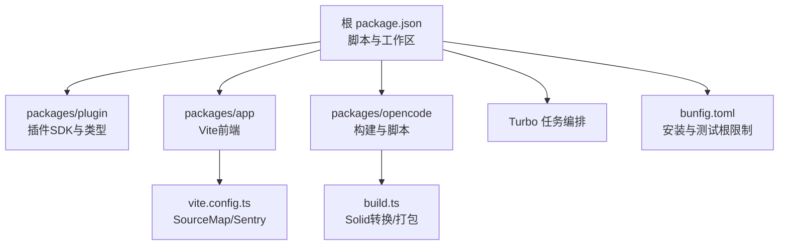
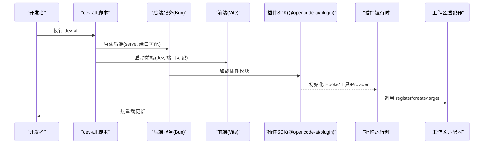
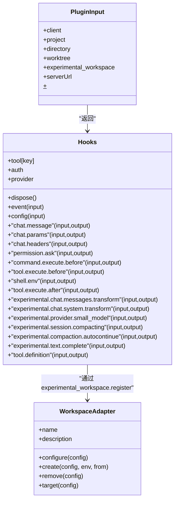
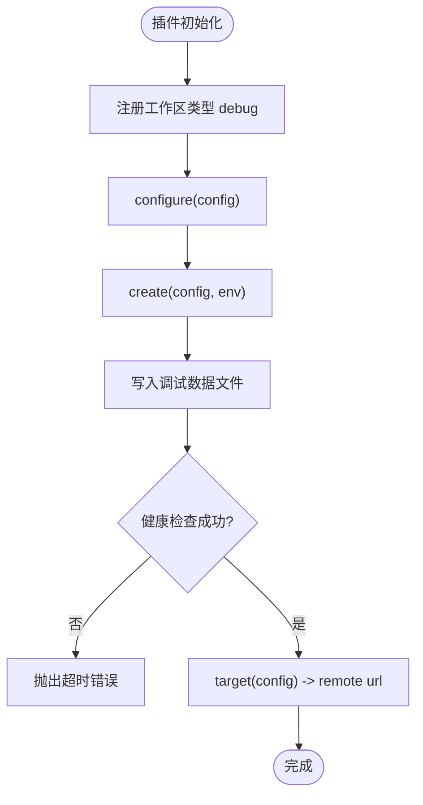
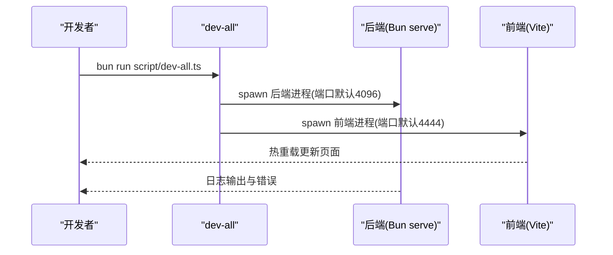
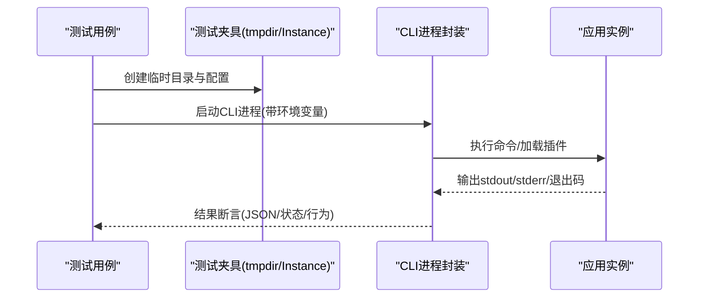
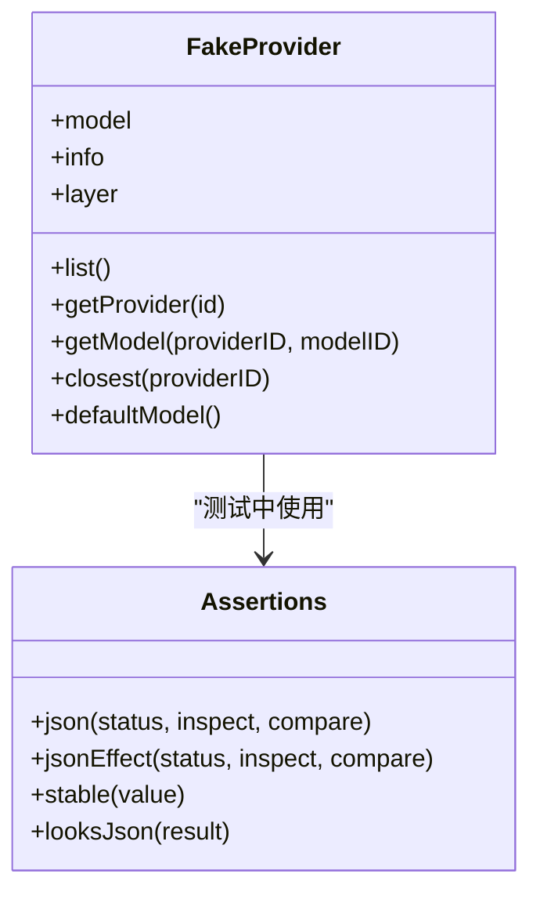
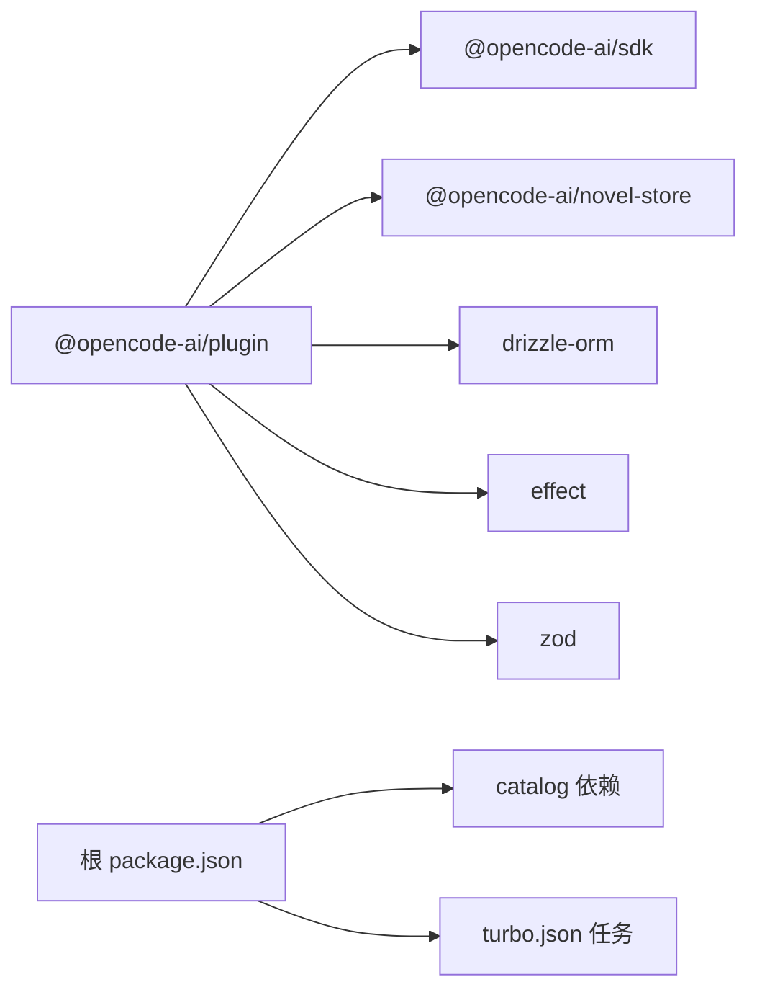

# 开发工作流程

<cite>
**本文引用的文件**   
- [package.json](file://package.json)
- [bunfig.toml](file://bunfig.toml)
- [turbo.json](file://turbo.json)
- [packages/plugin/package.json](file://packages/plugin/package.json)
- [packages/plugin/src/index.ts](file://packages/plugin/src/index.ts)
- [script/dev-all.ts](file://script/dev-all.ts)
- [packages/app/vite.config.ts](file://packages/app/vite.config.ts)
- [packages/opencode/script/build.ts](file://packages/opencode/script/build.ts)
- [packages/opencode/src/control-plane/dev/debug-workspace-plugin.ts](file://packages/opencode/src/control-plane/dev/debug-workspace-plugin.ts)
- [packages/opencode/test/fixture/fixture.ts](file://packages/opencode/test/fixture/fixture.ts)
- [packages/opencode/test/lib/cli-process.ts](file://packages/opencode/test/lib/cli-process.ts)
- [packages/opencode/test/plugin/workspace-adapter.test.ts](file://packages/opencode/test/plugin/workspace-adapter.test.ts)
- [packages/opencode/test/plugin/meta.test.ts](file://packages/opencode/test/plugin/meta.test.ts)
- [packages/opencode/test/fake/provider.ts](file://packages/opencode/test/fake/provider.ts)
- [packages/core/test/util/flock.test.ts](file://packages/core/test/util/flock.test.ts)
- [packages/web/src/content/docs/formatters.mdx](file://packages/web/src/content/docs/formatters.mdx)
</cite>

## 目录
1. [简介](#简介)
2. [项目结构](#项目结构)
3. [核心组件](#核心组件)
4. [架构总览](#架构总览)
5. [详细组件分析](#详细组件分析)
6. [依赖分析](#依赖分析)
7. [性能考虑](#性能考虑)
8. [故障排查指南](#故障排查指南)
9. [结论](#结论)
10. [附录](#附录)

## 简介
本指南面向 openNovel 插件开发者，提供从环境启动、热重载与调试，到代码格式化、Lint 检查、单元测试与集成测试的完整工作流。内容涵盖插件接口、运行时钩子、工作区适配器、Mock 数据与断言策略，以及常见模式与最佳实践，帮助你在本地高效迭代并稳定集成到主应用。

## 项目结构
- 根包通过 Bun 管理脚本与工作区，统一入口命令集中在根 package.json 中。
- 插件 SDK 位于 packages/plugin，暴露插件类型、钩子与工具定义。
- 前端 Vite 配置在 packages/app/vite.config.ts，支持 SourceMap 与 Sentry 集成。
- 构建与脚本由 packages/opencode/script/build.ts 等驱动，配合 Turbo 任务编排。
- 测试基础设施集中在 packages/opencode/test/*，包含临时目录、实例注入、CLI 进程封装与 HTTP API DSL。

**图表来源** 
- [package.json:1-162](file://package.json#L1-L162)
- [packages/plugin/package.json:1-61](file://packages/plugin/package.json#L1-L61)
- [packages/app/vite.config.ts:1-33](file://packages/app/vite.config.ts#L1-L33)
- [packages/opencode/script/build.ts:1-24](file://packages/opencode/script/build.ts#L1-L24)
- [bunfig.toml:1-9](file://bunfig.toml#L1-L9)
- [turbo.json:1-34](file://turbo.json#L1-L34)

**章节来源**
- [package.json:1-162](file://package.json#L1-L162)
- [bunfig.toml:1-9](file://bunfig.toml#L1-L9)
- [turbo.json:1-34](file://turbo.json#L1-L34)

## 核心组件
- 插件 SDK（@opencode-ai/plugin）：导出插件函数、钩子、工具定义、工作区适配器与 Provider/Model 扩展点。
- 开发服务器与前端：Bun 启动后端服务，Vite 启动前端，dev-all 脚本统一管理端口与生命周期。
- 构建系统：Bun + Solid 转换插件 + Turborepo 任务，支持单包构建与产物输出。
- 测试框架：Bun Test + Effect 层组合，提供临时目录、实例注入、CLI 进程与 HTTP API DSL。

**章节来源**
- [packages/plugin/src/index.ts:1-354](file://packages/plugin/src/index.ts#L1-L354)
- [packages/plugin/package.json:1-61](file://packages/plugin/package.json#L1-L61)
- [script/dev-all.ts:1-60](file://script/dev-all.ts#L1-L60)
- [packages/app/vite.config.ts:1-33](file://packages/app/vite.config.ts#L1-L33)
- [packages/opencode/script/build.ts:1-24](file://packages/opencode/script/build.ts#L1-L24)
- [packages/opencode/test/fixture/fixture.ts:1-229](file://packages/opencode/test/fixture/fixture.ts#L1-L229)
- [packages/opencode/test/lib/cli-process.ts:277-312](file://packages/opencode/test/lib/cli-process.ts#L277-L312)

## 架构总览
下图展示了插件开发与运行时的关键交互：插件通过 SDK 暴露钩子，被运行时加载；工作区适配器注册后参与创建与目标解析；开发脚本协调前后端进程；测试夹具提供隔离环境与 Mock。

**图表来源** 
- [script/dev-all.ts:1-60](file://script/dev-all.ts#L1-L60)
- [packages/plugin/src/index.ts:1-354](file://packages/plugin/src/index.ts#L1-L354)
- [packages/opencode/src/control-plane/dev/debug-workspace-plugin.ts:1-73](file://packages/opencode/src/control-plane/dev/debug-workspace-plugin.ts#L1-L73)

## 详细组件分析

### 插件 SDK 与钩子模型
- 插件函数接收输入上下文（client、project、directory、worktree、experimental_workspace、serverUrl、$），返回 Hooks。
- Hooks 覆盖事件、配置、工具、认证、Provider/Model、聊天消息与参数、权限、命令执行、Shell 环境变量、会话压缩、文本补全、工具定义等。
- 工作区适配器允许插件注册自定义 workspace type，实现 configure/create/remove/target。

**图表来源** 
- [packages/plugin/src/index.ts:1-354](file://packages/plugin/src/index.ts#L1-L354)

**章节来源**
- [packages/plugin/src/index.ts:1-354](file://packages/plugin/src/index.ts#L1-L354)

### 工作区适配器与调试工作区
- 插件可通过 experimental_workspace.register(type, adapter) 注册自定义工作区类型。
- 调试工作区插件示例：创建远程调试服务器，等待健康检查，写入临时数据文件，并返回 remote target。

**图表来源** 
- [packages/opencode/src/control-plane/dev/debug-workspace-plugin.ts:1-73](file://packages/opencode/src/control-plane/dev/debug-workspace-plugin.ts#L1-L73)

**章节来源**
- [packages/opencode/src/control-plane/dev/debug-workspace-plugin.ts:1-73](file://packages/opencode/src/control-plane/dev/debug-workspace-plugin.ts#L1-L73)
- [packages/opencode/test/plugin/workspace-adapter.test.ts:34-111](file://packages/opencode/test/plugin/workspace-adapter.test.ts#L34-L111)

### 开发环境与热重载
- 使用 dev-all 脚本同时启动后端与前端，支持端口环境变量覆盖，统一信号处理与进程管理。
- 前端 Vite 开启 SourceMap，便于调试；Sentry 集成可选。
- 构建脚本使用 Solid 转换插件，支持单包构建与产物输出。

**图表来源** 
- [script/dev-all.ts:1-60](file://script/dev-all.ts#L1-L60)
- [packages/app/vite.config.ts:1-33](file://packages/app/vite.config.ts#L1-L33)
- [packages/opencode/script/build.ts:1-24](file://packages/opencode/script/build.ts#L1-L24)

**章节来源**
- [script/dev-all.ts:1-60](file://script/dev-all.ts#L1-L60)
- [packages/app/vite.config.ts:1-33](file://packages/app/vite.config.ts#L1-L33)
- [packages/opencode/script/build.ts:1-24](file://packages/opencode/script/build.ts#L1-L24)

### 代码格式化与 Lint
- 根 package.json 提供 lint 脚本（oxlint）与 prettier 配置。
- OpenCode 文档说明当项目存在 prettier 时自动使用其进行格式化，支持自定义命令与环境变量。

**图表来源** 
- [packages/web/src/content/docs/formatters.mdx:43-143](file://packages/web/src/content/docs/formatters.mdx#L43-L143)
- [package.json:1-162](file://package.json#L1-L162)

**章节来源**
- [package.json:1-162](file://package.json#L1-L162)
- [packages/web/src/content/docs/formatters.mdx:43-143](file://packages/web/src/content/docs/formatters.mdx#L43-L143)

### 单元测试与集成测试
- 测试框架：Bun Test，根级禁止直接运行测试，需在子包内执行。
- 测试夹具：临时目录、Git 初始化、实例注入、Effect 层组合、CLI 进程封装。
- HTTP API DSL：JSON 断言、状态码校验、响应体检查。
- 插件元数据与并发安装测试：通过子进程模拟插件加载与变更追踪。

**图表来源** 
- [packages/opencode/test/fixture/fixture.ts:1-229](file://packages/opencode/test/fixture/fixture.ts#L1-L229)
- [packages/opencode/test/lib/cli-process.ts:277-312](file://packages/opencode/test/lib/cli-process.ts#L277-L312)
- [packages/opencode/test/plugin/meta.test.ts:1-41](file://packages/opencode/test/plugin/meta.test.ts#L1-L41)
- [packages/core/test/util/flock.test.ts:59-114](file://packages/core/test/util/flock.test.ts#L59-L114)

**章节来源**
- [bunfig.toml:1-9](file://bunfig.toml#L1-L9)
- [packages/opencode/test/fixture/fixture.ts:1-229](file://packages/opencode/test/fixture/fixture.ts#L1-L229)
- [packages/opencode/test/lib/cli-process.ts:277-312](file://packages/opencode/test/lib/cli-process.ts#L277-L312)
- [packages/opencode/test/plugin/meta.test.ts:1-41](file://packages/opencode/test/plugin/meta.test.ts#L1-L41)
- [packages/core/test/util/flock.test.ts:59-114](file://packages/core/test/util/flock.test.ts#L59-L114)

### Mock 数据与断言策略
- 提供 Provider 的 fake 层，用于替换真实 Provider/Model 行为，便于测试边界条件。
- HTTP API 断言 DSL 支持 JSON 状态码、Content-Type 与响应体检查，并提供稳定化比较工具。

**图表来源** 
- [packages/opencode/test/fake/provider.ts:47-82](file://packages/opencode/test/fake/provider.ts#L47-L82)
- [packages/opencode/test/server/httpapi-exercise/assertions.ts:1-44](file://packages/opencode/test/server/httpapi-exercise/assertions.ts#L1-L44)
- [packages/opencode/test/server/httpapi-exercise/dsl.ts:111-136](file://packages/opencode/test/server/httpapi-exercise/dsl.ts#L111-L136)

**章节来源**
- [packages/opencode/test/fake/provider.ts:47-82](file://packages/opencode/test/fake/provider.ts#L47-L82)
- [packages/opencode/test/server/httpapi-exercise/assertions.ts:1-44](file://packages/opencode/test/server/httpapi-exercise/assertions.ts#L1-L44)
- [packages/opencode/test/server/httpapi-exercise/dsl.ts:111-136](file://packages/opencode/test/server/httpapi-exercise/dsl.ts#L111-L136)

## 依赖分析
- 插件包依赖 SDK、novel-store、drizzle-orm、effect、zod，peerDependencies 为 @opentui 系列。
- 根工作区通过 catalog 统一管理依赖版本，确保跨包一致性。
- Turbo 任务定义 typecheck、build 与各包的 test 任务，依赖 ^build 顺序。

**图表来源** 
- [packages/plugin/package.json:1-61](file://packages/plugin/package.json#L1-L61)
- [package.json:1-162](file://package.json#L1-L162)
- [turbo.json:1-34](file://turbo.json#L1-L34)

**章节来源**
- [packages/plugin/package.json:1-61](file://packages/plugin/package.json#L1-L61)
- [package.json:1-162](file://package.json#L1-L162)
- [turbo.json:1-34](file://turbo.json#L1-L34)

## 性能考虑
- 使用 Bun 作为运行时与包管理器，提升安装与执行速度。
- Vite 开启 SourceMap，便于定位问题但会增加体积，生产构建应关闭或按需启用。
- 测试夹具避免真实文件系统开销，优先使用临时目录与内存层；必要时使用 it.live 仅对必要场景启用真实 I/O。
- 插件加载与元数据追踪应避免频繁磁盘 IO，利用缓存与增量更新。

[本节为通用指导，不直接分析具体文件]

## 故障排查指南
- 插件元数据文件路径通过环境变量控制，确保 OPENCODE_PLUGIN_META_FILE 指向正确位置。
- 调试工作区健康检查超时：确认远程服务端口可达且 /global/health 返回正常。
- 测试失败：检查临时目录清理、Git fsmonitor 停止、CLI 进程 stdout/stderr 捕获是否正确。
- 格式化未生效：确认 package.json 中存在 prettier 且命令占位符 $FILE 正确替换。

**章节来源**
- [packages/opencode/test/plugin/meta.test.ts:1-41](file://packages/opencode/test/plugin/meta.test.ts#L1-L41)
- [packages/opencode/src/control-plane/dev/debug-workspace-plugin.ts:1-73](file://packages/opencode/src/control-plane/dev/debug-workspace-plugin.ts#L1-L73)
- [packages/opencode/test/fixture/fixture.ts:1-229](file://packages/opencode/test/fixture/fixture.ts#L1-L229)
- [packages/web/src/content/docs/formatters.mdx:43-143](file://packages/web/src/content/docs/formatters.mdx#L43-L143)

## 结论
通过统一的脚本与配置，openNovel 插件开发具备高效的本地迭代能力：dev-all 协调前后端，Vite 提供热重载，插件 SDK 暴露丰富的钩子与适配器，测试夹具与 DSL 保障质量。遵循本文的工作流程与最佳实践，可快速构建稳定可靠的插件并与主应用无缝集成。

[本节为总结性内容，不直接分析具体文件]

## 附录
- 常用命令
  - 启动开发环境：bun run dev:all
  - 类型检查：bun run typecheck
  - Lint 检查：bun run lint
  - 构建插件包：cd packages/plugin && bun run build
  - 运行子包测试：在对应包目录下执行 bun test

[本节为补充信息，不直接分析具体文件]