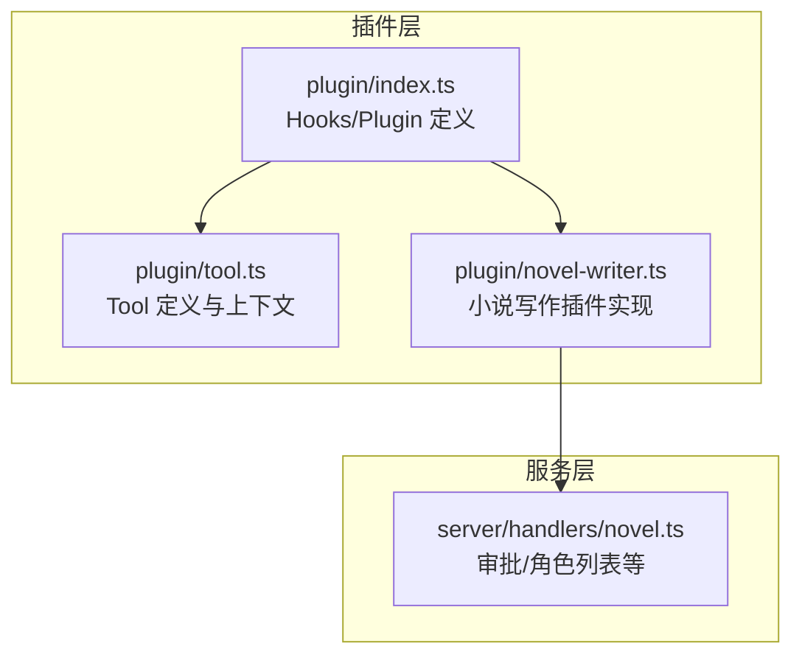
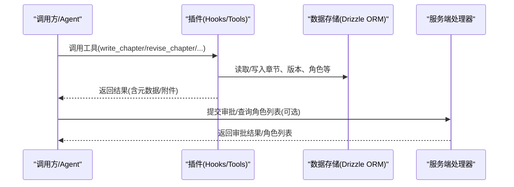
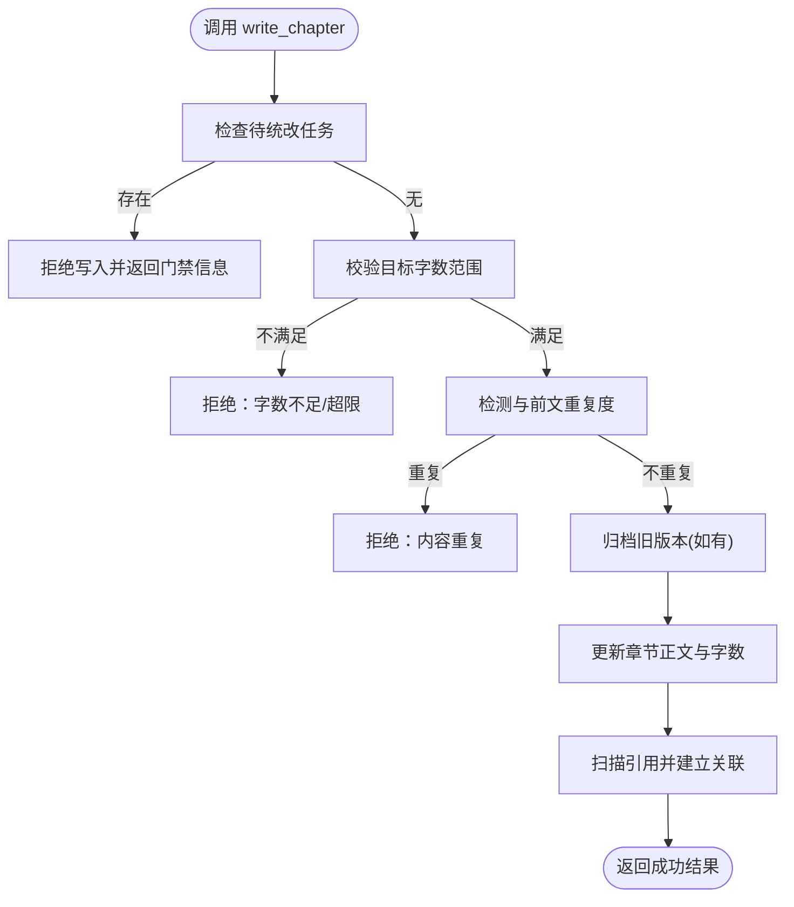
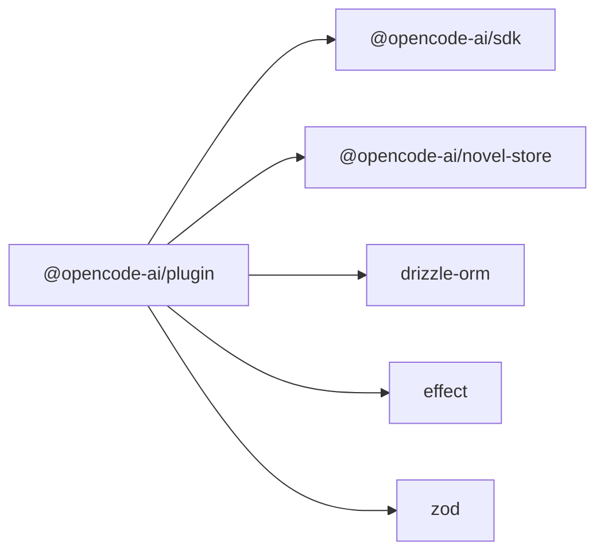

# 插件 API 参考

<cite>
**本文引用的文件**   
- [packages/plugin/src/index.ts](file://packages/plugin/src/index.ts)
- [packages/plugin/src/tool.ts](file://packages/plugin/src/tool.ts)
- [packages/plugin/src/novel-writer.ts](file://packages/plugin/src/novel-writer.ts)
- [packages/server/src/handlers/novel.ts](file://packages/server/src/handlers/novel.ts)
- [packages/plugin/package.json](file://packages/plugin/package.json)
</cite>

## 目录
1. [简介](#简介)
2. [项目结构](#项目结构)
3. [核心组件](#核心组件)
4. [架构总览](#架构总览)
5. [详细组件分析](#详细组件分析)
6. [依赖关系分析](#依赖关系分析)
7. [性能考虑](#性能考虑)
8. [故障排查指南](#故障排查指南)
9. [结论](#结论)
10. [附录：API 速查与示例](#附录api-速查与示例)

## 简介
本参考文档面向 openNovel 插件开发者，系统化说明插件可用的核心接口、方法签名与参数类型，覆盖数据访问、事件系统、配置管理、工具函数（Tool）以及小说写作相关能力。文档提供调用小说管理、章节操作、角色管理等核心功能的完整示例路径，并给出异步处理、错误捕获与性能优化的最佳实践。

## 项目结构
openNovel 采用 monorepo 组织，插件能力集中在 packages/plugin 包中，并通过 hooks 与 tool 机制暴露给运行时；服务端处理器在 packages/server 中提供审批等辅助能力。

图表来源
- [packages/plugin/src/index.ts:1-354](file://packages/plugin/src/index.ts#L1-L354)
- [packages/plugin/src/tool.ts:1-55](file://packages/plugin/src/tool.ts#L1-L55)
- [packages/plugin/src/novel-writer.ts:1-800](file://packages/plugin/src/novel-writer.ts#L1-L800)
- [packages/server/src/handlers/novel.ts:614-643](file://packages/server/src/handlers/novel.ts#L614-L643)

章节来源
- [packages/plugin/package.json:1-61](file://packages/plugin/package.json#L1-L61)

## 核心组件
- Plugin 与 Hooks：插件入口返回一个对象，包含 dispose、event、config、tool、auth、provider 及多个 chat/session/shell 相关的钩子，用于注入系统提示、压缩策略、权限控制、工具定义等。
- Tool 系统：通过 tool() 声明式定义工具描述、参数 schema（基于 zod）和执行函数，执行函数接收标准化上下文 ToolContext。
- NovelWriter 插件：注册大量写作相关工具（如 write_chapter、revise_chapter、manage_characters、generate_*_outline、read_outline、assemble_context_snapshot、check_continuity 等），并在 system.transform 和 session.compacting 钩子中注入小说上下文。

章节来源
- [packages/plugin/src/index.ts:92-354](file://packages/plugin/src/index.ts#L92-L354)
- [packages/plugin/src/tool.ts:1-55](file://packages/plugin/src/tool.ts#L1-L55)
- [packages/plugin/src/novel-writer.ts:94-234](file://packages/plugin/src/novel-writer.ts#L94-L234)

## 架构总览
插件通过 Hook 与 Tool 扩展运行时行为：
- 事件与配置：event、config、chat.*、experimental.* 等钩子可拦截消息、修改参数、注入系统提示、控制会话压缩等。
- 工具：tool 字段注册工具，LLM 或 Agent 在执行时调用，内部可访问数据库、文件系统、状态提交与一致性检查等能力。
- 服务端集成：部分能力（如审批提交、角色列表）由服务端处理器提供，插件可通过 SDK 客户端或服务端调用使用。

图表来源
- [packages/plugin/src/novel-writer.ts:241-800](file://packages/plugin/src/novel-writer.ts#L241-L800)
- [packages/server/src/handlers/novel.ts:614-643](file://packages/server/src/handlers/novel.ts#L614-L643)

## 详细组件分析

### 插件生命周期与 Hooks
- Plugin 输入：包含 client、project、directory、worktree、experimental_workspace、serverUrl、$（BunShell）。
- 关键 Hook：
  - event：通用事件回调
  - config：配置加载与扩展
  - tool：工具注册表
  - auth/provider：认证与模型提供者扩展
  - chat.message/chat.params/chat.headers：消息与参数/头部增强
  - permission.ask：权限询问
  - command.execute.before / tool.execute.before/after：命令与工具执行前后钩子
  - shell.env：环境变量注入
  - experimental.*：实验性能力（消息转换、系统提示转换、小模型选择、会话压缩、自动续写、文本补全、工具定义修改等）

章节来源
- [packages/plugin/src/index.ts:20-91](file://packages/plugin/src/index.ts#L20-L91)
- [packages/plugin/src/index.ts:240-354](file://packages/plugin/src/index.ts#L240-L354)

### Tool 系统与上下文
- ToolDefinition：通过 tool({ description, args, execute }) 声明，args 使用 zod schema 校验。
- ToolContext：包含 sessionID、messageID、agent、directory、worktree、abort、metadata、ask 等，便于工具执行时获取运行环境与用户交互能力。
- ToolResult：支持字符串或结构化输出（title/output/metadata/attachments）。

章节来源
- [packages/plugin/src/tool.ts:1-55](file://packages/plugin/src/tool.ts#L1-L55)

### 小说写作插件（NovelWriter）
- 系统提示注入：在 experimental.chat.system.transform 中组装“小说蓝图、活跃角色、卷摘要、最近章节摘要、剧情线索、伏笔、风格指南”等上下文，注入到系统提示。
- 会话压缩：在 experimental.session.compacting 中保留关键上下文，避免长对话丢失重要信息。
- 写作工具集：
  - write_chapter：校验字数、重复度、待统改门禁，归档历史版本后写入正文。
  - revise_chapter：修订前归档旧版本，校验字数与重复度后更新为修订版。
  - manage_characters：新增/更新角色，合并重复角色，记录描述变更历史，触发级联任务。
  - generate_master_outline/generate_volume_outline/generate_chapter_outline：生成总纲/卷纲/章纲，写入 .novel/outlines 并持久化元数据。
  - read_chapter_outline/read_outline：读取章节大纲元信息与 Markdown 原文。
  - assemble_context_snapshot：组装当前章节所需上下文快照。
  - check_continuity：37维连续性检查，自动生成评审记录。

图表来源
- [packages/plugin/src/novel-writer.ts:241-329](file://packages/plugin/src/novel-writer.ts#L241-L329)

章节来源
- [packages/plugin/src/novel-writer.ts:94-234](file://packages/plugin/src/novel-writer.ts#L94-L234)
- [packages/plugin/src/novel-writer.ts:241-800](file://packages/plugin/src/novel-writer.ts#L241-L800)

### 服务端集成（审批与角色）
- submitApproval：提交章节审批（通过/拒绝），记录评审结果并更新章节状态。
- listCharacters：列出某小说下的所有角色。

章节来源
- [packages/server/src/handlers/novel.ts:614-643](file://packages/server/src/handlers/novel.ts#L614-L643)

## 依赖关系分析
- 插件包依赖：@opencode-ai/sdk、@opencode-ai/novel-store、drizzle-orm、effect、zod。
- 导出模块：index、tool、tui、v2/effect、v2/promise、novel-writer 及其 CLI/TUI 子模块。

图表来源
- [packages/plugin/package.json:1-61](file://packages/plugin/package.json#L1-L61)

章节来源
- [packages/plugin/package.json:1-61](file://packages/plugin/package.json#L1-L61)

## 性能考虑
- 批量与缓存：对频繁读取的上下文（如角色、卷摘要、最近章节摘要）进行缓存，减少重复查询。
- 增量更新：仅在字段变化时触发级联任务与引用扫描，避免全量重建。
- 流式与异步：利用 AbortSignal 支持中断；对耗时 I/O 使用 Promise/Effect 组合，避免阻塞主线程。
- 校验前置：在工具入口处尽早失败（字数、重复度、待统改门禁），降低无效计算。
- 压缩与摘要：在会话压缩钩子中仅保留必要上下文，控制 token 消耗与延迟。

[本节为通用指导，无需特定文件引用]

## 故障排查指南
- 常见错误与定位：
  - 章节不存在：write_chapter/revise_chapter 返回“章节不存在”，确认 chapter_id 是否正确。
  - 字数不达标/超限：根据返回的 word_count 与 target 调整内容长度。
  - 内容重复：依据返回的相似度与样本片段重写开头或段落。
  - 待统改门禁：先调用 cascade_execute 或 cascade_list_pending 处理待办任务。
  - JSON 解析失败：manage_characters 的 update 字段需合法 JSON。
- 调试建议：
  - 使用 tool.execute.before/after 钩子打印入参与出参。
  - 在 metadata 中附加诊断信息（rejected/reason/blocked 等）。
  - 查看评审记录与版本历史，定位问题发生点。

章节来源
- [packages/plugin/src/novel-writer.ts:241-800](file://packages/plugin/src/novel-writer.ts#L241-L800)

## 结论
openNovel 插件体系以 Hooks 与 Tool 为核心，结合小说写作插件提供的丰富工具与服务端能力，形成从大纲生成、章节撰写、连续性审计到审批流转的完整闭环。遵循本文档的接口规范与实践建议，可高效构建稳定、可扩展的写作自动化流程。

[本节为总结性内容，无需特定文件引用]

## 附录：API 速查与示例

### 插件入口与类型
- Plugin：函数签名 (input: PluginInput, options?: PluginOptions) => Promise<Hooks>
- Hooks：包含 dispose、event、config、tool、auth、provider、chat.*、experimental.* 等
- ToolDefinition：tool({ description, args, execute })

章节来源
- [packages/plugin/src/index.ts:92-354](file://packages/plugin/src/index.ts#L92-L354)
- [packages/plugin/src/tool.ts:1-55](file://packages/plugin/src/tool.ts#L1-L55)

### 数据访问与工具函数（示例路径）
- 章节写入：write_chapter
  - 参数：chapter_id(string), content(string)
  - 行为：校验待统改门禁、字数范围、重复度，归档历史版本后写入
  - 示例路径：[packages/plugin/src/novel-writer.ts:241-329](file://packages/plugin/src/novel-writer.ts#L241-L329)
- 章节修订：revise_chapter
  - 参数：chapter_id(string), revision(string)
  - 行为：归档旧版本，校验字数与重复度后更新为修订版
  - 示例路径：[packages/plugin/src/novel-writer.ts:330-416](file://packages/plugin/src/novel-writer.ts#L330-L416)
- 角色管理：manage_characters
  - 参数：character_id(string), update(string(JSON))
  - 行为：新增/更新角色，合并重复，记录描述历史，触发级联任务
  - 示例路径：[packages/plugin/src/novel-writer.ts:417-540](file://packages/plugin/src/novel-writer.ts#L417-L540)
- 大纲生成：
  - generate_master_outline(novel_id, content?)
  - generate_volume_outline(novel_id, volume_number, title?, content?)
  - generate_chapter_outline(novel_id, chapter_number, title?, content?)
  - 示例路径：[packages/plugin/src/novel-writer.ts:541-627](file://packages/plugin/src/novel-writer.ts#L541-L627)
- 大纲读取：
  - read_chapter_outline(novel_id, chapter_number)
  - read_outline(type: "master"|"volume"|"chapter", number?)
  - 示例路径：[packages/plugin/src/novel-writer.ts:628-694](file://packages/plugin/src/novel-writer.ts#L628-L694)
- 上下文快照：assemble_context_snapshot(novel_id, chapter_number)
  - 示例路径：[packages/plugin/src/novel-writer.ts:695-762](file://packages/plugin/src/novel-writer.ts#L695-L762)
- 连续性检查：check_continuity(novel_id, chapter_number)
  - 示例路径：[packages/plugin/src/novel-writer.ts:763-800](file://packages/plugin/src/novel-writer.ts#L763-L800)

### 事件系统与配置管理（示例路径）
- 系统提示注入：experimental.chat.system.transform
  - 示例路径：[packages/plugin/src/novel-writer.ts:101-191](file://packages/plugin/src/novel-writer.ts#L101-L191)
- 会话压缩：experimental.session.compacting
  - 示例路径：[packages/plugin/src/novel-writer.ts:197-234](file://packages/plugin/src/novel-writer.ts#L197-L234)
- 工具定义修改：tool.definition
  - 示例路径：[packages/plugin/src/index.ts:352-353](file://packages/plugin/src/index.ts#L352-L353)

### 服务端集成（示例路径）
- 提交审批：submitApproval(novelID, chapterID, input, directory)
  - 示例路径：[packages/server/src/handlers/novel.ts:614-634](file://packages/server/src/handlers/novel.ts#L614-L634)
- 角色列表：listCharacters(novelID, directory)
  - 示例路径：[packages/server/src/handlers/novel.ts:636-643](file://packages/server/src/handlers/novel.ts#L636-L643)

### 异步与错误处理最佳实践
- 使用 AbortSignal 支持取消长时间运行的工具执行。
- 在工具入口处进行快速失败（参数校验、门禁检查、重复度检测）。
- 将错误信息结构化返回（title/output/metadata），便于上层统一处理与展示。
- 对 I/O 密集操作使用 Promise/Effect 组合，避免阻塞。

[本节为通用指导，无需特定文件引用]