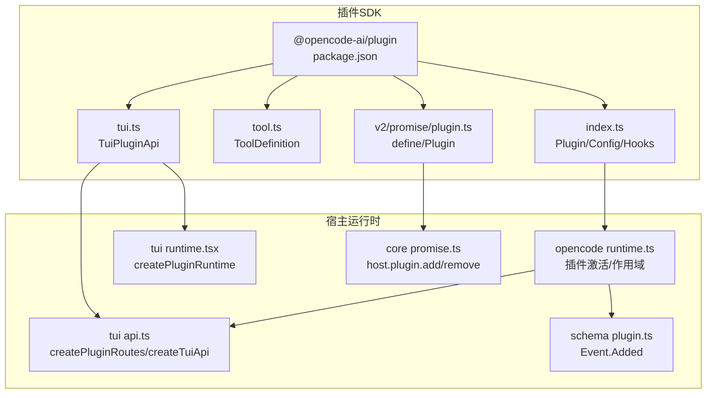
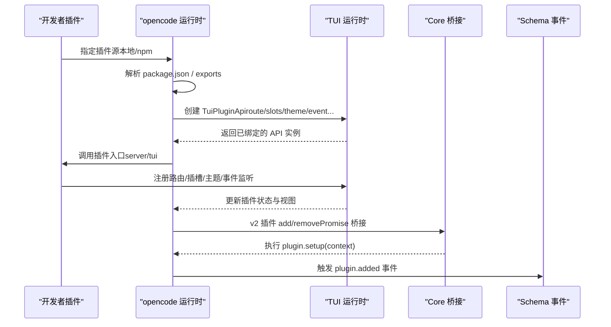
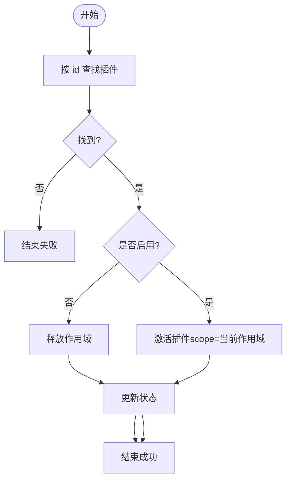
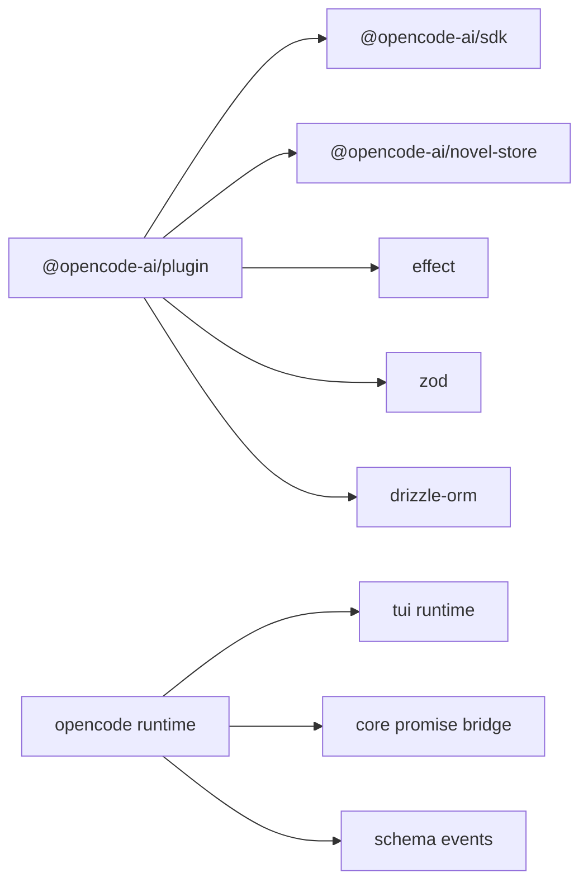

# 插件开发指南

<cite>
**本文引用的文件**   
- [packages/plugin/package.json](file://packages/plugin/package.json)
- [packages/plugin/src/index.ts](file://packages/plugin/src/index.ts)
- [packages/plugin/src/tool.ts](file://packages/plugin/src/tool.ts)
- [packages/plugin/src/tui.ts](file://packages/plugin/src/tui.ts)
- [packages/plugin/src/v2/promise/plugin.ts](file://packages/plugin/src/v2/promise/plugin.ts)
- [packages/core/src/plugin/promise.ts](file://packages/core/src/plugin/promise.ts)
- [packages/opencode/src/plugin/tui/runtime.ts](file://packages/opencode/src/plugin/tui/runtime.ts)
- [packages/tui/src/plugin/api.ts](file://packages/tui/src/plugin/api.ts)
- [packages/tui/src/plugin/runtime.tsx](file://packages/tui/src/plugin/runtime.tsx)
- [packages/schema/src/plugin.ts](file://packages/schema/src/plugin.ts)
- [packages/web/src/content/docs/zh-cn/plugins.mdx](file://packages/web/src/content/docs/zh-cn/plugins.mdx)
- [packages/opencode/test/plugin/install.test.ts](file://packages/opencode/test/plugin/install.test.ts)
- [README.md](file://README.md)
</cite>

## 目录
1. [简介](#简介)
2. [项目结构](#项目结构)
3. [核心组件](#核心组件)
4. [架构总览](#架构总览)
5. [详细组件分析](#详细组件分析)
6. [依赖关系分析](#依赖关系分析)
7. [性能考虑](#性能考虑)
8. [故障排查指南](#故障排查指南)
9. [结论](#结论)
10. [附录](#附录)

## 简介
本指南面向 openNovel 插件开发者，提供从模板、环境搭建到调试、API 使用、错误处理、性能优化、测试与发布、版本管理以及安全与沙箱隔离的完整实践说明。openNovel 基于 Bun monorepo，插件体系同时支持服务端（server）与 TUI/Web UI（tui）两类扩展点，并通过统一的 SDK、事件与权限模型进行集成。

## 项目结构
- packages/plugin：插件 SDK 与类型定义，暴露 server、tui、novel-writer、v2/effect、v2/promise 等导出入口。
- packages/opencode：后端服务与 CLI，包含插件运行时、安装与激活流程、TUI 插件 API 注入。
- packages/tui：TUI 运行时与路由、插槽、命令系统，提供插件注册与生命周期管理。
- packages/core：Promise/Effect 桥接层，将宿主能力以 Promise 形式暴露给 v2 插件。
- packages/schema：插件事件与 ID 等共享 Schema。
- packages/web：文档与示例，包含插件加载方式与生态链接。

图表来源 
- [packages/plugin/package.json:1-61](file://packages/plugin/package.json#L1-L61)
- [packages/plugin/src/index.ts:1-354](file://packages/plugin/src/index.ts#L1-L354)
- [packages/plugin/src/tool.ts:1-55](file://packages/plugin/src/tool.ts#L1-L55)
- [packages/plugin/src/tui.ts:1-635](file://packages/plugin/src/tui.ts#L1-L635)
- [packages/plugin/src/v2/promise/plugin.ts:1-15](file://packages/plugin/src/v2/promise/plugin.ts#L1-L15)
- [packages/opencode/src/plugin/tui/runtime.ts:541-610](file://packages/opencode/src/plugin/tui/runtime.ts#L541-L610)
- [packages/tui/src/plugin/runtime.tsx:1-42](file://packages/tui/src/plugin/runtime.tsx#L1-L42)
- [packages/tui/src/plugin/api.ts:1-52](file://packages/tui/src/plugin/api.ts#L1-L52)
- [packages/core/src/plugin/promise.ts:74-93](file://packages/core/src/plugin/promise.ts#L74-L93)
- [packages/schema/src/plugin.ts:1-13](file://packages/schema/src/plugin.ts#L1-L13)

章节来源
- [packages/plugin/package.json:1-61](file://packages/plugin/package.json#L1-L61)
- [README.md:60-69](file://README.md#L60-L69)

## 核心组件
- 插件模块与配置
  - Plugin 函数签名、Hooks、工具定义、权限与 Agent 配置均在 index.ts 中集中定义。
  - tool.ts 提供 tool() 工厂与 ToolContext/ToolResult 类型，用于声明 LLM 可调用的工具。
  - tui.ts 定义 TuiPluginApi、路由、插槽、主题、状态、事件总线、对话框等 UI 能力。
  - v2/promise/plugin.ts 定义 v2 插件接口 define/Plugin，配合 core 层的 Promise 桥接。
- 宿主运行时
  - opencode 侧负责插件加载、作用域隔离、API 注入、路由与插槽注册、状态更新。
  - tui 侧提供 createPluginRuntime、createPluginRoutes、createTuiApi，统一管理与渲染。
  - core 层通过 host.plugin.add/remove 将 v2 插件接入宿主。
- 事件与 Schema
  - schema 层定义了插件添加事件（plugin.added），便于订阅与追踪。

章节来源
- [packages/plugin/src/index.ts:56-92](file://packages/plugin/src/index.ts#L56-L92)
- [packages/plugin/src/index.ts:240-354](file://packages/plugin/src/index.ts#L240-L354)
- [packages/plugin/src/tool.ts:1-55](file://packages/plugin/src/tool.ts#L1-L55)
- [packages/plugin/src/tui.ts:581-635](file://packages/plugin/src/tui.ts#L581-L635)
- [packages/plugin/src/v2/promise/plugin.ts:1-15](file://packages/plugin/src/v2/promise/plugin.ts#L1-L15)
- [packages/core/src/plugin/promise.ts:74-93](file://packages/core/src/plugin/promise.ts#L74-L93)
- [packages/schema/src/plugin.ts:1-13](file://packages/schema/src/plugin.ts#L1-L13)

## 架构总览
下图展示了插件从加载到激活、API 注入、路由与插槽注册的端到端流程。

图表来源 
- [packages/opencode/src/plugin/tui/runtime.ts:572-610](file://packages/opencode/src/plugin/tui/runtime.ts#L572-L610)
- [packages/tui/src/plugin/api.ts:1-52](file://packages/tui/src/plugin/api.ts#L1-L52)
- [packages/tui/src/plugin/runtime.tsx:12-35](file://packages/tui/src/plugin/runtime.tsx#L12-L35)
- [packages/core/src/plugin/promise.ts:74-93](file://packages/core/src/plugin/promise.ts#L74-L93)
- [packages/schema/src/plugin.ts:1-13](file://packages/schema/src/plugin.ts#L1-L13)

## 详细组件分析

### 插件包结构与入口规范
- package.json 导出约定
  - 根导出 "./" 指向插件主入口（通常为 index.ts）。
  - 子路径导出包括 "./tool"、"./tui"、"./v2/effect/*"、"./v2/promise/*"、"./novel-writer/*" 等，分别对应工具、TUI API、Effect/Promise 桥接与小说写作工具集。
- 插件类型与导出
  - index.ts 定义 Plugin、Hooks、Config、Agent 权限扩展等。
  - tool.ts 提供 tool() 工厂与 ToolContext/ToolResult。
  - tui.ts 定义 TuiPluginApi、TuiRouteDefinition、插槽、主题、事件总线等。
  - v2/promise/plugin.ts 定义 define/Plugin，供 v2 风格插件使用。

章节来源
- [packages/plugin/package.json:11-23](file://packages/plugin/package.json#L11-L23)
- [packages/plugin/src/index.ts:1-92](file://packages/plugin/src/index.ts#L1-L92)
- [packages/plugin/src/tool.ts:1-55](file://packages/plugin/src/tool.ts#L1-L55)
- [packages/plugin/src/tui.ts:1-120](file://packages/plugin/src/tui.ts#L1-L120)
- [packages/plugin/src/v2/promise/plugin.ts:1-15](file://packages/plugin/src/v2/promise/plugin.ts#L1-L15)

### 插件 API 调用示例（TUI）
- 路由注册与导航
  - 通过 api.route.register(list) 注册页面，api.route.navigate(name, params) 跳转，api.route.current 获取当前路由。
- 插槽扩展
  - api.slots.register(plugin) 在宿主预留位置插入自定义 UI。
- 主题与 KV
  - api.theme.install(jsonPath) 安装主题；api.kv.get/set 持久化键值。
- 事件总线
  - api.event.on(type, handler) 订阅宿主事件。
- 对话框与提示
  - api.ui.Dialog* 系列组件与 api.ui.toast 通知。

章节来源
- [packages/opencode/src/plugin/tui/runtime.ts:572-610](file://packages/opencode/src/plugin/tui/runtime.ts#L572-L610)
- [packages/tui/src/plugin/api.ts:11-38](file://packages/tui/src/plugin/api.ts#L11-L38)
- [packages/plugin/src/tui.ts:581-635](file://packages/plugin/src/tui.ts#L581-L635)

### 插件 API 调用示例（Server/Tools）
- 工具定义
  - 使用 tool({ description, args, execute }) 声明参数校验与执行逻辑，args 使用 zod schema。
- 上下文信息
  - ToolContext 提供 sessionID、messageID、agent、directory、worktree、abort、metadata、ask 等。
- 结果格式
  - ToolResult 支持字符串或结构化对象（title/output/metadata/attachments）。

章节来源
- [packages/plugin/src/tool.ts:1-55](file://packages/plugin/src/tool.ts#L1-L55)
- [packages/plugin/src/index.ts:240-354](file://packages/plugin/src/index.ts#L240-L354)

### 插件生命周期与激活流程
- 激活/停用
  - 运行时根据插件 id 查找并调用 activate/deactivate，维护 scope 与状态。
- 作用域与资源清理
  - 激活失败或未启用时释放 scope，更新视图状态。
- v2 插件桥接
  - core 层通过 host.plugin.add/remove 将 v2 插件加入宿主，并执行 setup(context)。

图表来源 
- [packages/opencode/src/plugin/tui/runtime.ts:541-570](file://packages/opencode/src/plugin/tui/runtime.ts#L541-L570)
- [packages/core/src/plugin/promise.ts:74-93](file://packages/core/src/plugin/promise.ts#L74-L93)

章节来源
- [packages/opencode/src/plugin/tui/runtime.ts:541-570](file://packages/opencode/src/plugin/tui/runtime.ts#L541-L570)
- [packages/core/src/plugin/promise.ts:74-93](file://packages/core/src/plugin/promise.ts#L74-L93)

### 插件测试方法
- 安装与导出结构测试
  - 测试用例构造插件目录与 package.json，验证 server/tui 导出与 oc-themes 字段。
- 运行建议
  - 使用 bun test 在各自包目录下运行；确保 typecheck 与 lint 通过。

章节来源
- [packages/opencode/test/plugin/install.test.ts:50-109](file://packages/opencode/test/plugin/install.test.ts#L50-L109)
- [CONTRIBUTING.md:16-24](file://CONTRIBUTING.md#L16-L24)

### 打包发布流程与版本管理
- 构建与类型检查
  - 使用 tsc 构建，tsgo --noEmit 做类型检查。
- 发布策略
  - 遵循 Conventional Commits 与短横线分支命名；变更 API/Protocol 后需重新生成客户端代码。
- 版本与依赖
  - 使用 workspace:* 引用内部包，peerDependencies 标注可选依赖。

章节来源
- [packages/plugin/package.json:7-10](file://packages/plugin/package.json#L7-L10)
- [packages/plugin/package.json:27-39](file://packages/plugin/package.json#L27-L39)
- [CONTRIBUTING.md:25-58](file://CONTRIBUTING.md#L25-L58)

### 插件安全考虑、权限控制与沙箱隔离
- 权限模型
  - Hooks 提供 permission.ask 钩子，允许插件对敏感操作进行 ask/allow/deny 决策。
- 作用域隔离
  - 插件激活时分配独立 scope，失败或未启用时及时释放，避免跨插件状态泄漏。
- 沙箱与最小权限
  - ToolContext 仅暴露必要上下文（sessionID、directory、worktree、abort 等），避免直接访问进程全局。
- 事件与审计
  - 通过 schema 事件（如 plugin.added）记录插件生命周期，便于审计与回溯。

章节来源
- [packages/plugin/src/index.ts:279-287](file://packages/plugin/src/index.ts#L279-L287)
- [packages/opencode/src/plugin/tui/runtime.ts:541-570](file://packages/opencode/src/plugin/tui/runtime.ts#L541-L570)
- [packages/schema/src/plugin.ts:1-13](file://packages/schema/src/plugin.ts#L1-L13)

## 依赖关系分析
- 插件包依赖
  - @opencode-ai/sdk、@opencode-ai/novel-store、effect、zod、drizzle-orm 等为核心依赖。
  - peerDependencies 声明 @opentui/* 为可选依赖，降低耦合。
- 运行时依赖
  - opencode 运行时依赖 tui 运行时与 core 桥接，共同完成插件加载、API 注入与状态同步。
- 事件与协议
  - schema 层定义插件事件，保证宿主与插件间契约一致。

图表来源 
- [packages/plugin/package.json:27-39](file://packages/plugin/package.json#L27-L39)
- [packages/core/src/plugin/promise.ts:74-93](file://packages/core/src/plugin/promise.ts#L74-L93)
- [packages/schema/src/plugin.ts:1-13](file://packages/schema/src/plugin.ts#L1-L13)

章节来源
- [packages/plugin/package.json:27-39](file://packages/plugin/package.json#L27-L39)
- [packages/core/src/plugin/promise.ts:74-93](file://packages/core/src/plugin/promise.ts#L74-L93)
- [packages/schema/src/plugin.ts:1-13](file://packages/schema/src/plugin.ts#L1-L13)

## 性能考虑
- 懒绑定与快照
  - 小说写作插件仅在会话绑定小说时组装上下文快照，减少无关计算。
- 批量与增量更新
  - TUI 路由与状态通过 revision 信号驱动，避免全量重渲染。
- 资源释放
  - 插件激活失败或未启用时立即释放作用域，防止内存泄漏。
- 工具执行限制
  - 工具执行前进行门禁拦截（如待统改任务未处理）、字数与重复度校验，避免无效写入与回滚成本。

章节来源
- [packages/plugin/src/novel-writer.ts:101-191](file://packages/plugin/src/novel-writer.ts#L101-L191)
- [packages/tui/src/plugin/api.ts:11-38](file://packages/tui/src/plugin/api.ts#L11-L38)
- [packages/opencode/src/plugin/tui/runtime.ts:541-570](file://packages/opencode/src/plugin/tui/runtime.ts#L541-L570)

## 故障排查指南
- 插件未加载或激活失败
  - 检查 package.json 的 exports 与 main 字段是否正确；确认 server/tui 导出存在。
  - 查看运行时日志，确认作用域释放与状态更新是否正常。
- 路由/插槽不生效
  - 确认 api.route.register 与 api.slots.register 被正确调用且返回注销函数。
- 权限拒绝
  - 检查 permission.ask 钩子实现与输出是否符合 ask/allow/deny 语义。
- 工具执行异常
  - 核对 tool.schema 定义与实际传入参数；关注 metadata 中的 rejected/blocked 标记。

章节来源
- [packages/opencode/test/plugin/install.test.ts:50-109](file://packages/opencode/test/plugin/install.test.ts#L50-L109)
- [packages/opencode/src/plugin/tui/runtime.ts:541-570](file://packages/opencode/src/plugin/tui/runtime.ts#L541-L570)
- [packages/plugin/src/index.ts:279-287](file://packages/plugin/src/index.ts#L279-L287)

## 结论
openNovel 的插件体系以清晰的包导出、统一的 API 与事件模型为基础，结合运行时作用域隔离与权限控制，提供了可扩展、可审计、可观测的插件生态。开发者可基于 tool、hooks、TUI API 与 v2 插件接口快速构建功能，并通过测试、构建与发布流程保障质量与稳定性。

## 附录
- 插件加载方式
  - 本地文件：放置于 .opencode/plugins/ 或 ~/.config/opencode/plugins/，启动时自动加载。
  - npm 包：在配置文件指定包名，启动时由 Bun 自动安装并缓存。
- 加载顺序与缓存
  - npm 插件依赖缓存在 ~/.cache/opencode/node_modules/；本地插件直接从目录加载。

章节来源
- [packages/web/src/content/docs/zh-cn/plugins.mdx:18-54](file://packages/web/src/content/docs/zh-cn/plugins.mdx#L18-L54)