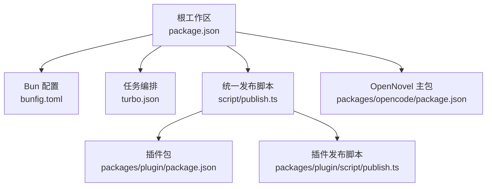
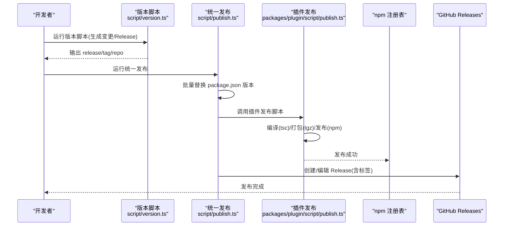
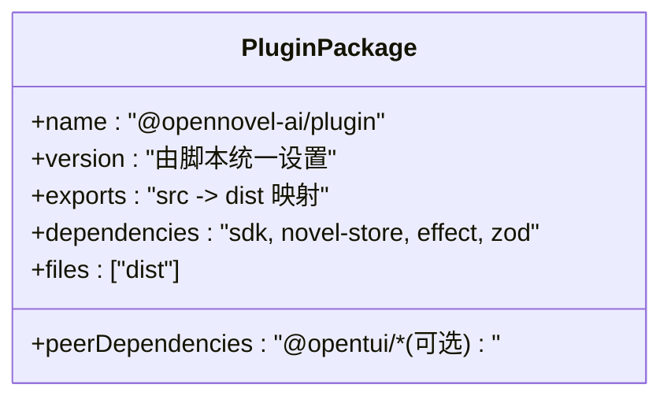
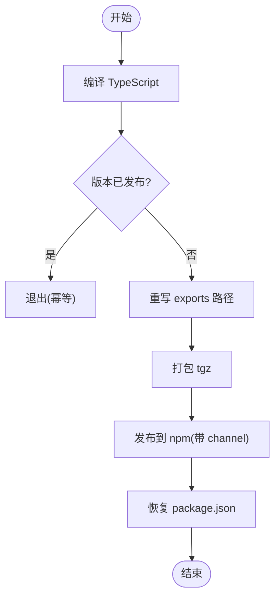
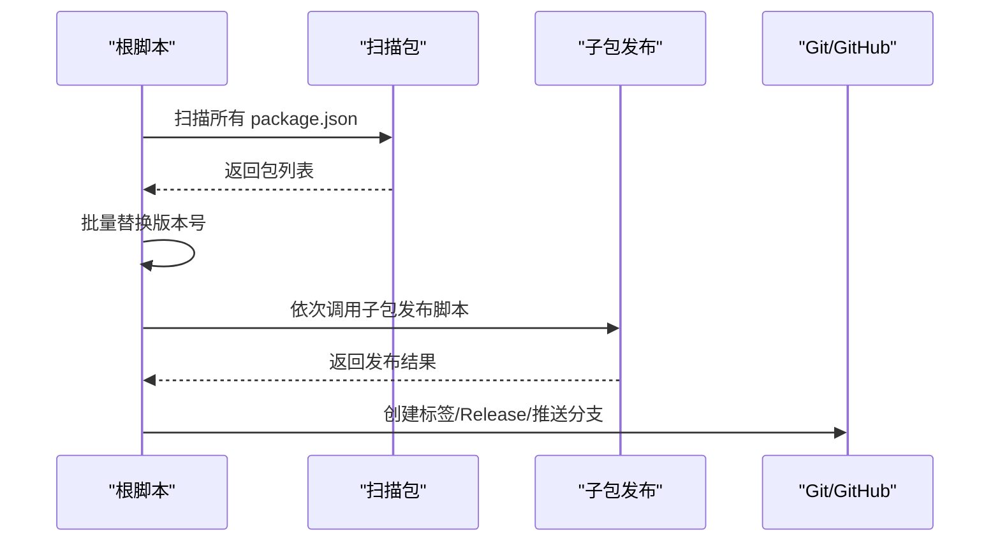
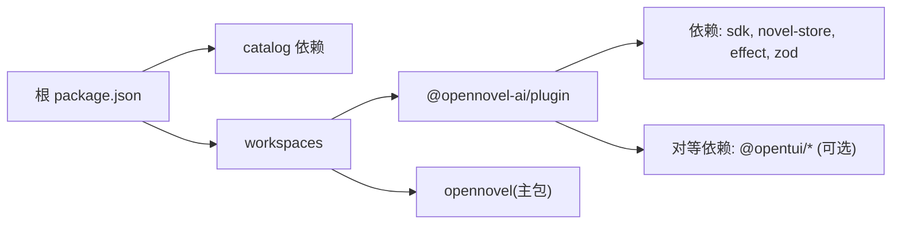

# 插件打包发布

<cite>
**本文引用的文件**
- [package.json](file://package.json)
- [bunfig.toml](file://bunfig.toml)
- [turbo.json](file://turbo.json)
- [script/publish.ts](file://script/publish.ts)
- [script/version.ts](file://script/version.ts)
- [packages/plugin/package.json](file://packages/plugin/package.json)
- [packages/plugin/script/publish.ts](file://packages/plugin/script/publish.ts)
- [packages/opencode/package.json](file://packages/opencode/package.json)
</cite>

## 目录
1. [简介](#简介)
2. [项目结构](#项目结构)
3. [核心组件](#核心组件)
4. [架构总览](#架构总览)
5. [详细组件分析](#详细组件分析)
6. [依赖分析](#依赖分析)
7. [性能考虑](#性能考虑)
8. [故障排查指南](#故障排查指南)
9. [结论](#结论)
10. [附录](#附录)

## 简介
本指南面向 openNovel 插件开发者，系统化说明插件的构建配置、依赖优化与资源打包策略，并给出 npm 包发布流程、版本管理与语义化版本控制实践。同时涵盖插件签名、安全扫描、自动化部署、插件市场提交、文档生成与更新通知机制，以及回滚策略与故障恢复方案。内容基于仓库现有脚本与配置进行梳理，确保可操作、可复现。

## 项目结构
openNovel 采用多包工作区（workspaces）管理，插件位于 packages/plugin，根级脚本负责统一版本与发布编排，Turbo 提供任务缓存与并行执行，Bun 作为运行时与包管理器。关键要点：
- 根 package.json 定义工作区与 catalog 依赖，统一管理版本。
- bunfig.toml 锁定安装行为与最小发布年龄，提升稳定性。
- turbo.json 定义 build/typecheck 等任务及输出产物目录。
- script/publish.ts 统一协调各子包的发布顺序与 Git 标签/Release 创建。
- packages/plugin/script/publish.ts 完成插件包的编译、打包与发布。
- packages/plugin/package.json 声明导出入口、依赖与产物目录。

**图表来源**
- [package.json:1-162](file://package.json#L1-L162)
- [bunfig.toml:1-9](file://bunfig.toml#L1-L9)
- [turbo.json:1-34](file://turbo.json#L1-L34)
- [script/publish.ts:1-74](file://script/publish.ts#L1-L74)
- [packages/plugin/package.json:1-61](file://packages/plugin/package.json#L1-L61)
- [packages/plugin/script/publish.ts:1-39](file://packages/plugin/script/publish.ts#L1-L39)
- [packages/opencode/package.json:1-159](file://packages/opencode/package.json#L1-L159)

**章节来源**
- [package.json:1-162](file://package.json#L1-L162)
- [bunfig.toml:1-9](file://bunfig.toml#L1-L9)
- [turbo.json:1-34](file://turbo.json#L1-L34)

## 核心组件
- 插件包（@opennovel-ai/plugin）
  - 通过 TypeScript 编译为 dist，exports 映射到 .js/.d.ts 产物。
  - 使用 workspace:* 引用 SDK 与存储模块，peerDependencies 声明 UI 框架可选依赖。
- 发布编排（script/publish.ts）
  - 统一替换所有 package.json 的版本号，触发子包构建与发布，创建 Git 标签与 Release。
- 版本脚本（script/version.ts）
  - 生成变更日志、创建 GitHub Release 并输出环境变量供后续步骤使用。
- 插件发布脚本（packages/plugin/script/publish.ts）
  - 编译、打包 tgz、发布到 npm，支持 channel 标签与幂等检查。

**章节来源**
- [packages/plugin/package.json:1-61](file://packages/plugin/package.json#L1-L61)
- [script/publish.ts:1-74](file://script/publish.ts#L1-L74)
- [script/version.ts:1-37](file://script/version.ts#L1-L37)
- [packages/plugin/script/publish.ts:1-39](file://packages/plugin/script/publish.ts#L1-L39)

## 架构总览
插件打包与发布的端到端流程如下：
- 版本与变更：version.ts 生成变更日志与 Release 元数据。
- 统一发布：publish.ts 遍历工作区，批量替换版本号，依次调用各子包发布脚本。
- 插件构建：plugin/script/publish.ts 执行 tsc 编译，生成 dist，打包 tgz，发布到 npm。
- 制品归档：GitHub Release 附带产物，便于下载与回滚。

**图表来源**
- [script/version.ts:1-37](file://script/version.ts#L1-L37)
- [script/publish.ts:1-74](file://script/publish.ts#L1-L74)
- [packages/plugin/script/publish.ts:1-39](file://packages/plugin/script/publish.ts#L1-L39)

## 详细组件分析

### 插件包结构与导出
- 包名与版本：@opennovel-ai/plugin，版本由统一脚本维护。
- 导出映射：exports 将多个入口指向 src/*.ts，发布时自动转换为 dist/*.js 与类型声明。
- 依赖关系：
  - 直接依赖：SDK、存储、Effect、Zod 等。
  - 对等依赖：UI 框架（可选），降低宿主环境耦合。
- 产物目录：files 仅包含 dist，避免源码泄露。

**图表来源**
- [packages/plugin/package.json:1-61](file://packages/plugin/package.json#L1-L61)

**章节来源**
- [packages/plugin/package.json:1-61](file://packages/plugin/package.json#L1-L61)

### 插件发布脚本逻辑
- 编译：tsc 生成 dist 与类型声明。
- 幂等检查：查询 npm 是否已存在该版本，避免重复发布。
- 导出重写：将 exports 中的 src 路径替换为 dist 路径，并补充 .js/.d.ts 后缀。
- 打包与发布：bun pm pack 生成 tgz，npm publish 指定 channel 标签与 public 访问。
- 回写保护：finally 块恢复原始 package.json，保证脚本幂等性。

**图表来源**
- [packages/plugin/script/publish.ts:1-39](file://packages/plugin/script/publish.ts#L1-L39)

**章节来源**
- [packages/plugin/script/publish.ts:1-39](file://packages/plugin/script/publish.ts#L1-L39)

### 统一发布与版本管理
- 版本替换：遍历所有 package.json，替换 version 字段为 Script.version。
- 依赖安装与 SDK 构建：bun install 与 SDK 构建脚本。
- 子包发布顺序：CLI、SDK、Plugin、UI 等按序发布。
- Git 与 Release：创建标签、推送分支、编辑 Release 草稿为正式。

**图表来源**
- [script/publish.ts:1-74](file://script/publish.ts#L1-L74)

**章节来源**
- [script/publish.ts:1-74](file://script/publish.ts#L1-L74)
- [script/version.ts:1-37](file://script/version.ts#L1-L37)

### 构建与缓存
- Turbo 任务：build 输出至 dist/**，typecheck 用于类型检查。
- 全局环境变量：CI、OPENNOVEL_DISABLE_SHARE 透传。
- 测试任务：针对 core/app/ui/session-ui 等包定义测试任务，依赖 ^build。

**章节来源**
- [turbo.json:1-34](file://turbo.json#L1-L34)

### 安装与依赖稳定性
- 精确安装：exact = true，避免意外升级。
- 最小发布年龄：minimumReleaseAge 限制新包发布时间，降低供应链风险。
- 白名单排除：部分包允许跳过最小发布年龄限制。

**章节来源**
- [bunfig.toml:1-9](file://bunfig.toml#L1-L9)

## 依赖分析
- 工作区依赖：根 package.json 通过 workspaces.catalog 集中管理依赖版本，确保一致性。
- 插件依赖：
  - 直接依赖：SDK、存储、Effect、Zod。
  - 对等依赖：UI 框架（可选），减少宿主环境冲突。
- 主包依赖：OpenNovel 主包依赖插件包与其他子包，形成稳定的内部生态。

**图表来源**
- [package.json:1-162](file://package.json#L1-L162)
- [packages/plugin/package.json:1-61](file://packages/plugin/package.json#L1-L61)
- [packages/opencode/package.json:1-159](file://packages/opencode/package.json#L1-L159)

**章节来源**
- [package.json:1-162](file://package.json#L1-L162)
- [packages/plugin/package.json:1-61](file://packages/plugin/package.json#L1-L61)
- [packages/opencode/package.json:1-159](file://packages/opencode/package.json#L1-L159)

## 性能考虑
- 构建缓存：Turbo 缓存 build 与 typecheck 任务，加速增量构建。
- 依赖锁定：bunfig.toml 的 exact 与 minimumReleaseAge 减少解析与安装开销。
- 产物精简：插件包 files 仅包含 dist，减小包体积。
- 外部依赖：peerDependencies 避免重复打包 UI 框架，降低最终包大小。

[本节为通用指导，不直接分析具体文件]

## 故障排查指南
- 发布失败（版本已存在）
  - 现象：插件发布脚本检测到版本已存在并退出。
  - 处理：确认本地版本号与期望一致；清理缓存后重试。
- 导出路径错误
  - 现象：exports 未正确转换为 dist 路径导致导入失败。
  - 处理：检查 plugin/script/publish.ts 的导出重写逻辑与 tsc 输出。
- 依赖解析异常
  - 现象：bun install 或构建时报依赖缺失或版本冲突。
  - 处理：核对 catalog 与 overrides，确保 peerDependencies 在宿主环境中满足。
- 网络与权限问题
  - 现象：npm publish 失败或 gh release 无法创建。
  - 处理：检查 npm token、gh CLI 登录状态与仓库权限。

**章节来源**
- [packages/plugin/script/publish.ts:1-39](file://packages/plugin/script/publish.ts#L1-L39)
- [script/publish.ts:1-74](file://script/publish.ts#L1-L74)

## 结论
通过统一的版本与发布脚本、Turbo 构建缓存与 Bun 的稳定安装策略，openNovel 插件的打包与发布流程具备高可靠性与可维护性。建议在生产环境中启用安全扫描与签名校验，结合 GitHub Actions 实现自动化流水线，确保插件质量与交付效率。

[本节为总结，不直接分析具体文件]

## 附录

### 构建与发布命令参考
- 本地构建与类型检查
  - 使用 Turbo 任务：typecheck、build
- 插件发布
  - 进入插件目录，执行插件发布脚本
  - 或通过根统一发布脚本触发全量发布
- 版本管理
  - 使用版本脚本生成变更日志与 Release 元数据

[本节为操作参考，不直接分析具体文件]

### 安全与合规建议
- 依赖安全
  - 启用依赖漏洞扫描（如 npm audit、第三方工具）
  - 定期更新依赖，遵循最小发布年龄策略
- 代码签名
  - Windows 平台可使用脚本进行签名（参考仓库中签名脚本）
- 审计与监控
  - 发布后监控下载量与错误率，及时回滚

[本节为通用建议，不直接分析具体文件]

### 回滚与故障恢复
- npm 回滚
  - 撤销发布或使用旧版本 tag
- GitHub Release 回滚
  - 切换至稳定 Release 标签，重新部署
- 分支回退
  - 回退 dev 分支至稳定点，重新触发发布流水线

[本节为通用建议，不直接分析具体文件]