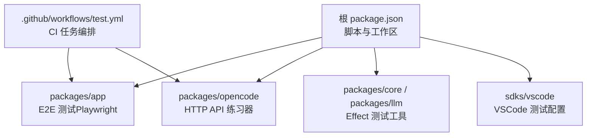
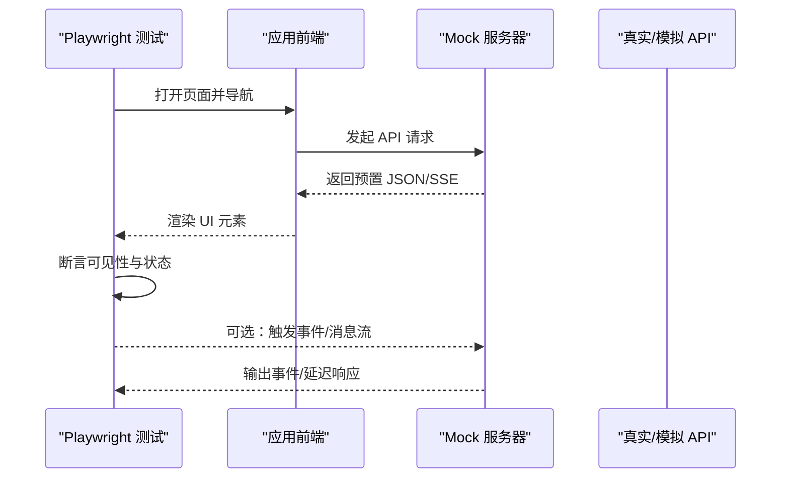
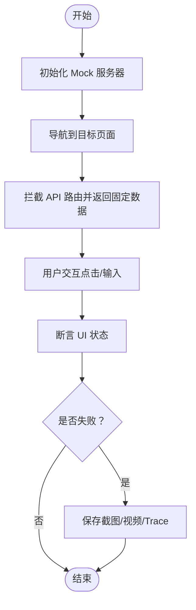
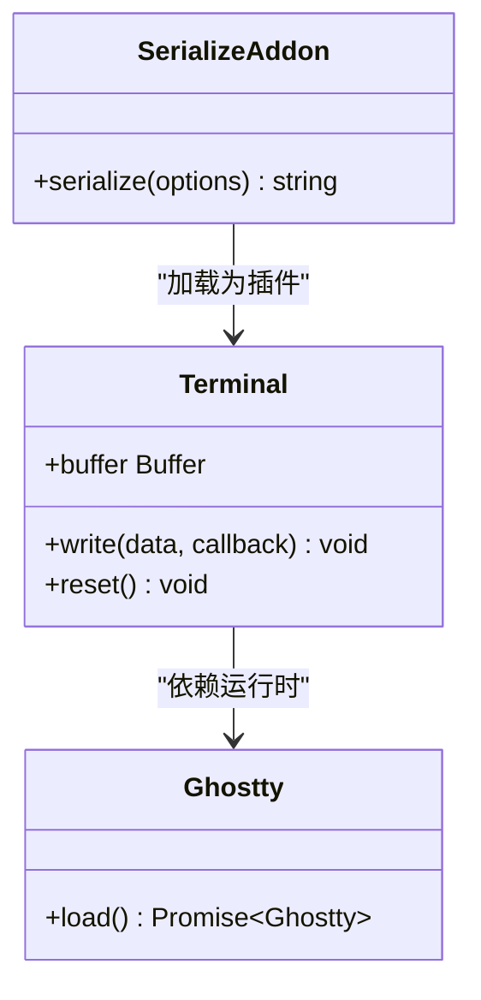
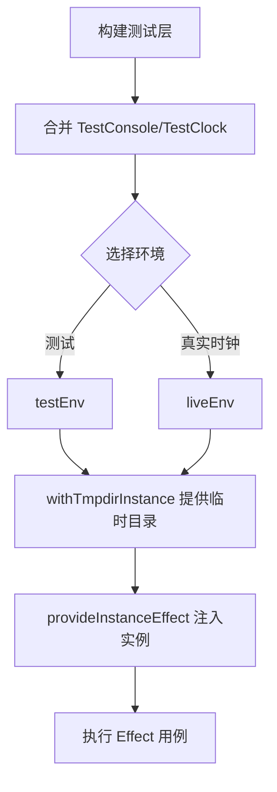
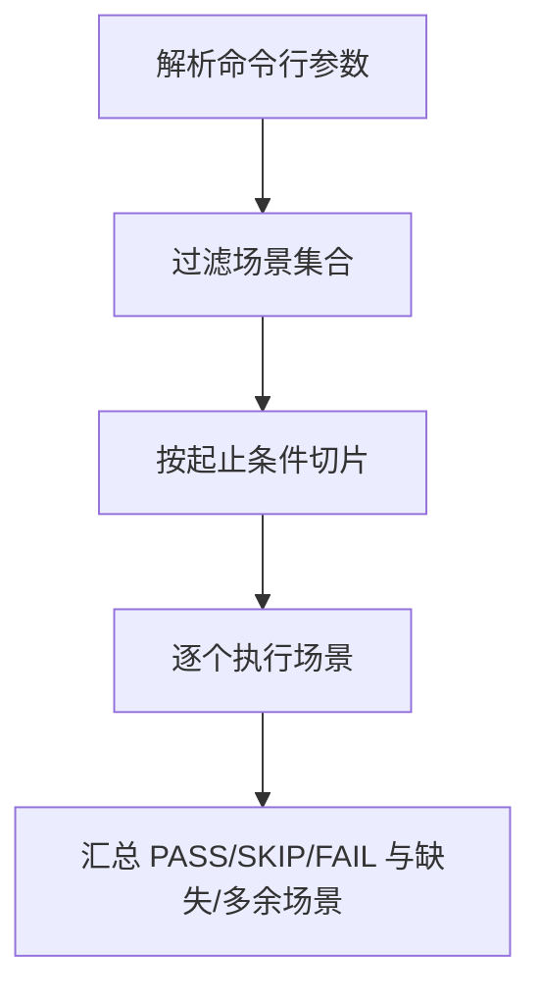
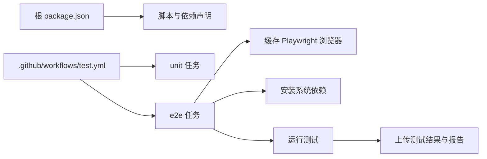
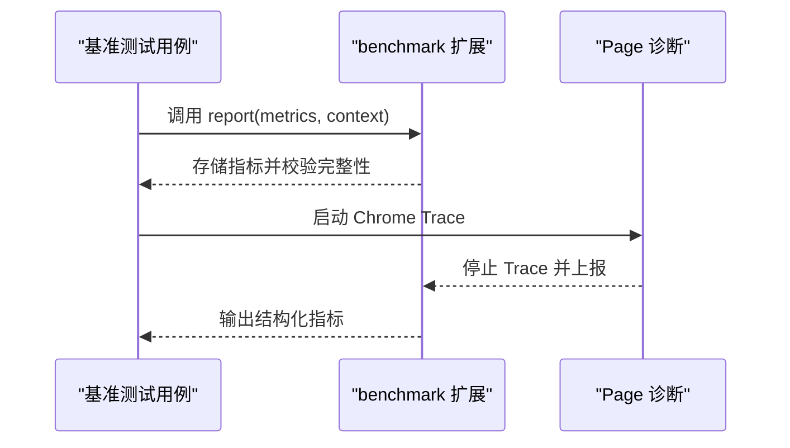

# 插件测试指南

<cite>
**本文引用的文件**   
- [package.json](file://package.json)
- [test.yml](file://.github/workflows/test.yml)
- [novel.spec.ts](file://packages/app/e2e/novel.spec.ts)
- [mock-server.ts](file://packages/app/e2e/utils/mock-server.ts)
- [playwright.config.ts（性能）](file://packages/app/e2e/performance/playwright.config.ts)
- [playwright.config.ts（时间线稳定性）](file://packages/app/e2e/performance/timeline-stability/playwright.config.ts)
- [benchmark.ts](file://packages/app/e2e/performance/benchmark.ts)
- [serialize.test.ts](file://packages/app/src/addons/serialize.test.ts)
- [routing.ts](file://packages/opencode/test/server/httpapi-exercise/routing.ts)
- [report.ts](file://packages/opencode/test/server/httpapi-exercise/report.ts)
- [runner.ts](file://packages/opencode/test/server/httpapi-exercise/runner.ts)
- [fixture.ts](file://packages/opencode/test/fixture/fixture.ts)
- [EFFECT_TEST_MIGRATION.md](file://packages/opencode/test/EFFECT_TEST_MIGRATION.md)
- [.vscode-test.mjs](file://sdks/vscode/.vscode-test.mjs)
</cite>

## 目录
1. [简介](#简介)
2. [项目结构](#项目结构)
3. [核心组件](#核心组件)
4. [架构总览](#架构总览)
5. [详细组件分析](#详细组件分析)
6. [依赖分析](#依赖分析)
7. [性能考虑](#性能考虑)
8. [故障排查指南](#故障排查指南)
9. [结论](#结论)
10. [附录](#附录)

## 简介
本指南面向 openNovel 插件与相关模块的测试实践，覆盖单元测试、集成测试与端到端（E2E）测试的编写方法。内容包含：
- 测试环境搭建与运行入口
- Mock 策略与服务桩
- 异步测试处理与确定性控制
- 测试用例模板、断言库使用与覆盖率报告生成
- 性能测试、兼容性测试与回归测试的实施方法
- 常见测试场景示例与调试技巧

## 项目结构
仓库采用多包工作区组织，测试分布在多个子包中：
- 应用 E2E 测试位于 packages/app/e2e，基于 Playwright
- 单元与集成测试位于各包的 src 或 test 目录，部分使用 bun:test、Effect 生态
- HTTP API 练习器位于 packages/opencode/test/server/httpapi-exercise，用于接口契约校验
- VSCode SDK 测试配置位于 sdks/vscode/.vscode-test.mjs
- CI 流水线定义在 .github/workflows/test.yml

**图表来源** 
- [package.json:1-162](file://package.json#L1-L162)
- [test.yml:1-152](file://.github/workflows/test.yml#L1-L152)

**章节来源**
- [package.json:1-162](file://package.json#L1-L162)
- [test.yml:1-152](file://.github/workflows/test.yml#L1-L152)

## 核心组件
- Playwright E2E 框架与配置
  - 主配置与性能/稳定性专项配置分离，便于并行与隔离
- HTTP API 练习器
  - 解析参数、选择场景、执行与报告结果
- Effect 测试工具与 Fixture
  - 提供 live/test 双环境、临时实例与层注入
- VSCode 测试 CLI 配置
  - 指定测试文件匹配规则

**章节来源**
- [playwright.config.ts（性能）:1-13](file://packages/app/e2e/performance/playwright.config.ts#L1-L13)
- [playwright.config.ts（时间线稳定性）:1-17](file://packages/app/e2e/performance/timeline-stability/playwright.config.ts#L1-L17)
- [routing.ts:42-96](file://packages/opencode/test/server/httpapi-exercise/routing.ts#L42-L96)
- [report.ts:31-66](file://packages/opencode/test/server/httpapi-exercise/report.ts#L31-L66)
- [runner.ts:62-95](file://packages/opencode/test/server/httpapi-exercise/runner.ts#L62-L95)
- [fixture.ts:193-228](file://packages/opencode/test/fixture/fixture.ts#L193-L228)
- [.vscode-test.mjs:1-5](file://sdks/vscode/.vscode-test.mjs#L1-L5)

## 架构总览
下图展示 E2E 测试从浏览器到后端服务的调用路径，以及 Mock 服务如何拦截请求并返回固定数据，确保测试稳定可重复。

**图表来源** 
- [novel.spec.ts:1-445](file://packages/app/e2e/novel.spec.ts#L1-L445)
- [mock-server.ts:1-190](file://packages/app/e2e/utils/mock-server.ts#L1-L190)

## 详细组件分析

### E2E 测试（Playwright）
- 用例组织
  - 通过 describe/test 组织场景，设置超时与等待策略
- Mock 策略
  - 使用 page.route 拦截 /api/* 与 SSE 事件流，返回固定数据
  - 统一封装 mockOpenCodeServer，简化会话、权限、文件等接口
- 断言与截图
  - 使用 expect 进行可见性、文本、属性断言；失败时自动保留截图/视频/Trace
- 性能与稳定性
  - 专用 playwright 配置启用 trace/screenshot/video 仅失败时保留
  - 基准测试扩展提供 reportState、benchmarkResult 钩子

**图表来源** 
- [novel.spec.ts:146-444](file://packages/app/e2e/novel.spec.ts#L146-L444)
- [mock-server.ts:29-144](file://packages/app/e2e/utils/mock-server.ts#L29-L144)
- [playwright.config.ts（时间线稳定性）:1-17](file://packages/app/e2e/performance/timeline-stability/playwright.config.ts#L1-L17)

**章节来源**
- [novel.spec.ts:1-445](file://packages/app/e2e/novel.spec.ts#L1-L445)
- [mock-server.ts:1-190](file://packages/app/e2e/utils/mock-server.ts#L1-L190)
- [playwright.config.ts（性能）:1-13](file://packages/app/e2e/performance/playwright.config.ts#L1-L13)
- [playwright.config.ts（时间线稳定性）:1-17](file://packages/app/e2e/performance/timeline-stability/playwright.config.ts#L1-L17)

### 单元测试（bun:test + 终端序列化）
- 用例组织
  - 使用 describe/test 分组，beforeAll/afterEach 管理资源生命周期
- 断言库
  - 使用 bun:test 内置 expect 进行值与属性断言
- 异步处理
  - 通过 Promise 包装 Terminal.write 等操作，确保写入完成后再断言
- 典型场景
  - ANSI 颜色与属性保留、多行内容往返、备用缓冲区行为

**图表来源** 
- [serialize.test.ts:1-320](file://packages/app/src/addons/serialize.test.ts#L1-L320)

**章节来源**
- [serialize.test.ts:1-320](file://packages/app/src/addons/serialize.test.ts#L1-L320)

### 集成测试（Effect + Fixture）
- 测试环境
  - 提供 testEnv/liveEnv 两套环境，支持 TestClock/TestConsole
- Fixture 与实例
  - withTmpdirInstance/provideTmpdirServer 提供临时目录与实例上下文
- 迁移规范
  - 避免全局状态与 Promise 包装，优先使用 Layer 与 Effect.gen

**图表来源** 
- [EFFECT_TEST_MIGRATION.md:70-106](file://packages/opencode/test/EFFECT_TEST_MIGRATION.md#L70-L106)
- [fixture.ts:193-228](file://packages/opencode/test/fixture/fixture.ts#L193-L228)

**章节来源**
- [EFFECT_TEST_MIGRATION.md:70-106](file://packages/opencode/test/EFFECT_TEST_MIGRATION.md#L70-L106)
- [fixture.ts:193-228](file://packages/opencode/test/fixture/fixture.ts#L193-L228)

### HTTP API 练习器（契约测试）
- 参数解析
  - --mode、--include、--start-at、--stop-at、--scenario-timeout 等
- 场景选择
  - 按名称/路径/方法过滤，支持起止索引切片
- 执行与报告
  - 打印 PASS/SKIP/FAIL，统计 missing/extra 场景

**图表来源** 
- [routing.ts:42-96](file://packages/opencode/test/server/httpapi-exercise/routing.ts#L42-L96)
- [report.ts:31-66](file://packages/opencode/test/server/httpapi-exercise/report.ts#L31-L66)
- [runner.ts:62-95](file://packages/opencode/test/server/httpapi-exercise/runner.ts#L62-L95)

**章节来源**
- [routing.ts:42-96](file://packages/opencode/test/server/httpapi-exercise/routing.ts#L42-L96)
- [report.ts:31-66](file://packages/opencode/test/server/httpapi-exercise/report.ts#L31-L66)
- [runner.ts:62-95](file://packages/opencode/test/server/httpapi-exercise/runner.ts#L62-L95)

### VSCode 插件测试配置
- 测试文件匹配
  - 指定 out/test/**/*.test.js 作为测试入口
- 运行方式
  - 通过 @vscode/test-cli 定义配置

**章节来源**
- [.vscode-test.mjs:1-5](file://sdks/vscode/.vscode-test.mjs#L1-L5)

## 依赖分析
- 顶层脚本与包管理
  - 根 package.json 定义了工作区与常用开发依赖（Playwright、Turbo、Bun）
- CI 任务
  - unit/e2e 两个主要任务，分别在不同主机上并行执行
  - e2e 任务缓存 Playwright 浏览器，安装系统依赖后运行测试并上传产物

**图表来源** 
- [package.json:1-162](file://package.json#L1-L162)
- [test.yml:1-152](file://.github/workflows/test.yml#L1-L152)

**章节来源**
- [package.json:1-162](file://package.json#L1-L162)
- [test.yml:1-152](file://.github/workflows/test.yml#L1-L152)

## 性能考虑
- 基准测试扩展
  - benchmark.ts 提供 reportState/benchmarkResult 钩子，收集指标与上下文
  - 支持 Chrome Trace 采集与页面导航记录
- 无上限性能配置
  - playwright.uncapped.config.ts 禁用帧率限制与 VSync，提高测量精度
- 指标输出
  - 控制台输出结构化 JSON 指标，便于 CI 聚合与分析

**图表来源** 
- [benchmark.ts:17-144](file://packages/app/e2e/performance/benchmark.ts#L17-L144)
- [playwright.config.ts（性能）:1-13](file://packages/app/e2e/performance/playwright.config.ts#L1-L13)

**章节来源**
- [benchmark.ts:17-144](file://packages/app/e2e/performance/benchmark.ts#L17-L144)
- [playwright.config.ts（性能）:1-13](file://packages/app/e2e/performance/playwright.config.ts#L1-L13)

## 故障排查指南
- 常见问题定位
  - 网络请求未命中：检查 page.route 的路径与端口匹配逻辑
  - 异步时序问题：增加 waitForSelector/waitForURL 或使用合理超时
  - 资源泄漏：确保 afterAll/afterEach 清理 Terminal、BrowserContext
- 调试技巧
  - 使用 Playwright Trace Viewer 回放失败用例
  - 开启 screenshot/video 仅失败时保留，减少磁盘占用
  - 在 CI 中查看 artifacts 与 HTML 报告

**章节来源**
- [novel.spec.ts:146-444](file://packages/app/e2e/novel.spec.ts#L146-L444)
- [mock-server.ts:54-143](file://packages/app/e2e/utils/mock-server.ts#L54-L143)
- [playwright.config.ts（时间线稳定性）:1-17](file://packages/app/e2e/performance/timeline-stability/playwright.config.ts#L1-L17)

## 结论
通过分层测试策略（单元、集成、E2E）与完善的 Mock、Fixture、基准测试能力，openNovel 的插件与模块可在不同粒度下保证质量与稳定性。结合 CI 自动化与可视化报告，能够快速发现回归与性能退化，提升交付效率。

## 附录
- 测试环境搭建
  - Node/Bun 版本与依赖安装遵循 CI 配置
  - Playwright 浏览器缓存与系统依赖安装见 e2e 任务
- 覆盖率报告
  - 使用 bun:test 与 Playwright 原生报告；如需代码覆盖率，可在测试命令中启用对应选项
- 兼容性测试
  - 在 CI 矩阵中覆盖 Linux/Windows，确保跨平台一致性
- 回归测试
  - 将关键用户旅程（如小说创建与编辑）固化为 E2E 用例，纳入每次 PR 检查

[本节为通用指导，不直接分析具体文件]