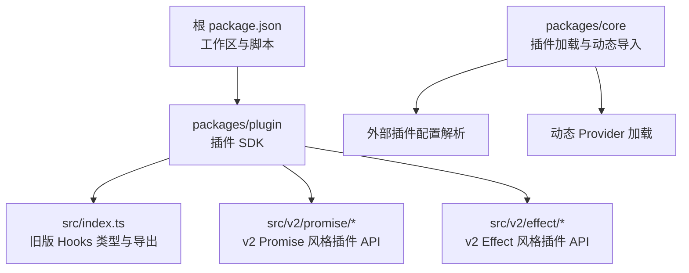
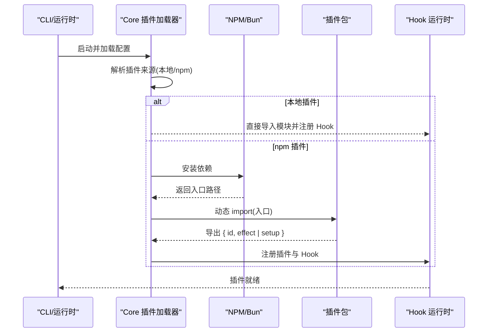
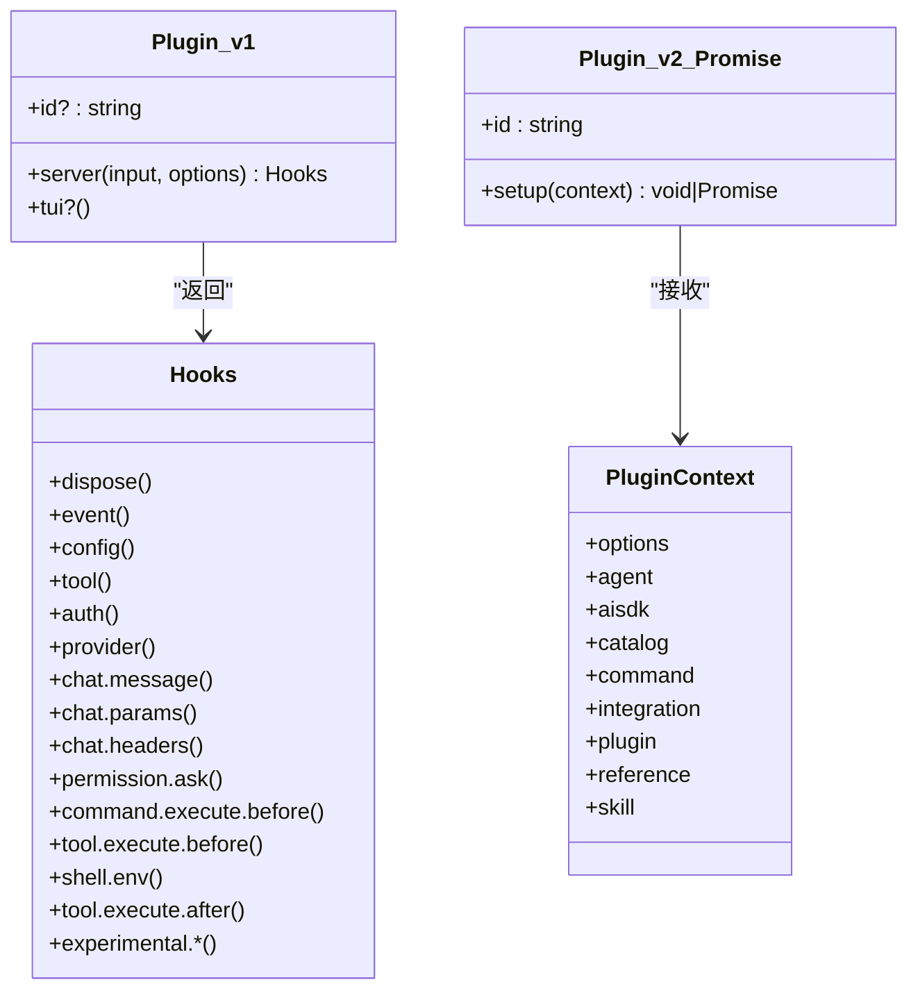
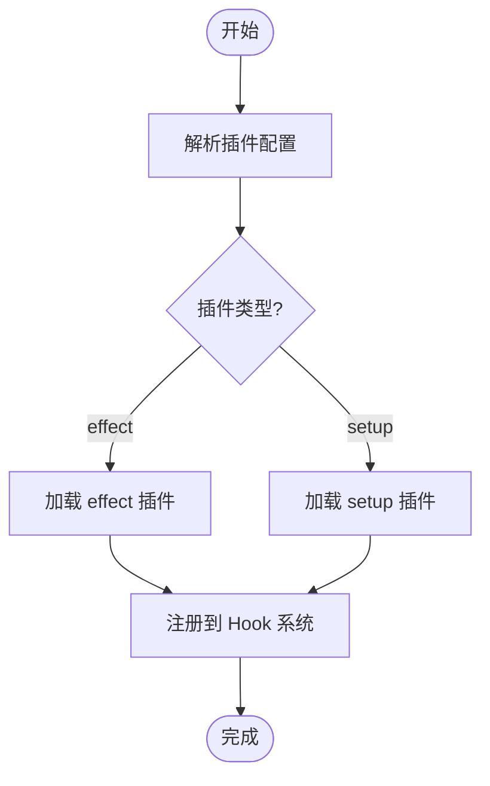
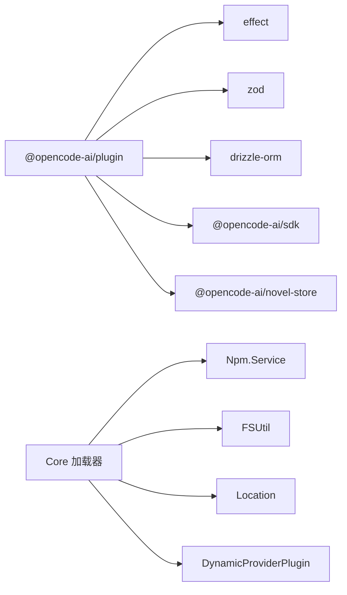

# 插件项目搭建

<cite>
**本文引用的文件**   
- [package.json](file://package.json)
- [packages/plugin/package.json](file://packages/plugin/package.json)
- [packages/plugin/src/index.ts](file://packages/plugin/src/index.ts)
- [packages/plugin/src/v2/promise/index.ts](file://packages/plugin/src/v2/promise/index.ts)
- [packages/plugin/src/v2/promise/plugin.ts](file://packages/plugin/src/v2/promise/plugin.ts)
- [packages/plugin/src/v2/promise/context.ts](file://packages/plugin/src/v2/promise/context.ts)
- [packages/plugin/src/v2/effect/index.ts](file://packages/plugin/src/v2/effect/index.ts)
- [packages/core/src/config/plugin/external.ts](file://packages/core/src/config/plugin/external.ts)
- [packages/core/src/plugin/provider/dynamic.ts](file://packages/core/src/plugin/provider/dynamic.ts)
- [tsconfig.json](file://tsconfig.json)
- [.oxlintrc.json](file://.oxlintrc.json)
- [.prettierignore](file://.prettierignore)
- [packages/opencode/test/cli/tui/plugin-loader-entrypoint.test.ts](file://packages/opencode/test/cli/tui/plugin-loader-entrypoint.test.ts)
- [packages/web/src/content/docs/zh-cn/plugins.mdx](file://packages/web/src/content/docs/zh-cn/plugins.mdx)
</cite>

## 目录
1. [简介](#简介)
2. [项目结构](#项目结构)
3. [核心组件](#核心组件)
4. [架构总览](#架构总览)
5. [详细组件分析](#详细组件分析)
6. [依赖分析](#依赖分析)
7. [性能考虑](#性能考虑)
8. [故障排查指南](#故障排查指南)
9. [结论](#结论)
10. [附录](#附录)

## 简介
本指南面向 openNovel（OpenCode）插件开发者，提供从零开始搭建插件项目的完整说明。内容涵盖：
- 初始化插件项目与包管理配置
- TypeScript 环境设置
- 插件包结构与模块组织规范
- 依赖声明与版本兼容性要求
- 开发工具链（ESLint/Oxlint、Prettier、调试）
- 插件入口定义、导出接口规范与加载机制
- 常见问题的定位与解决

## 项目结构
推荐将插件作为独立 npm 包发布，或通过本地路径引用。仓库根目录使用 Bun 工作区管理多包，插件 SDK 位于 packages/plugin。插件的运行时由 core 层动态加载，支持 Promise 与 Effect 两种风格。

图表来源
- [package.json:1-162](file://package.json#L1-L162)
- [packages/plugin/package.json:1-61](file://packages/plugin/package.json#L1-L61)
- [packages/plugin/src/index.ts:1-354](file://packages/plugin/src/index.ts#L1-L354)
- [packages/plugin/src/v2/promise/index.ts:1-13](file://packages/plugin/src/v2/promise/index.ts#L1-L13)
- [packages/plugin/src/v2/effect/index.ts:1-4](file://packages/plugin/src/v2/effect/index.ts#L1-L4)
- [packages/core/src/config/plugin/external.ts:1-40](file://packages/core/src/config/plugin/external.ts#L1-L40)
- [packages/core/src/plugin/provider/dynamic.ts:1-31](file://packages/core/src/plugin/provider/dynamic.ts#L1-L31)

章节来源
- [package.json:1-162](file://package.json#L1-L162)
- [packages/plugin/package.json:1-61](file://packages/plugin/package.json#L1-L61)

## 核心组件
- 插件 SDK（@opencode-ai/plugin）
  - 暴露 v1 风格的 Hooks 类型与上下文（packages/plugin/src/index.ts）
  - 暴露 v2 风格插件 API（Promise/Effect），包含 define、PluginContext 等
- 核心加载器（core）
  - 解析外部插件配置，支持 effect 或 setup 两种插件形态
  - 动态导入第三方包并寻找 create* 工厂方法以注册 Provider

章节来源
- [packages/plugin/src/index.ts:1-354](file://packages/plugin/src/index.ts#L1-L354)
- [packages/plugin/src/v2/promise/index.ts:1-13](file://packages/plugin/src/v2/promise/index.ts#L1-L13)
- [packages/plugin/src/v2/effect/index.ts:1-4](file://packages/plugin/src/v2/effect/index.ts#L1-L4)
- [packages/core/src/config/plugin/external.ts:1-40](file://packages/core/src/config/plugin/external.ts#L1-L40)
- [packages/core/src/plugin/provider/dynamic.ts:1-31](file://packages/core/src/plugin/provider/dynamic.ts#L1-L31)

## 架构总览
插件运行流程概览：
- 启动时读取全局与项目配置，发现插件来源（本地目录或 npm 包）
- 根据插件类型（effect/setup）进行实例化与注册
- 通过 Hook 系统注入事件处理逻辑（如 chat.message、tool.execute.before 等）
- 对 Provider 的动态加载，自动安装并导入 create* 工厂

图表来源
- [packages/core/src/config/plugin/external.ts:1-40](file://packages/core/src/config/plugin/external.ts#L1-L40)
- [packages/core/src/plugin/provider/dynamic.ts:1-31](file://packages/core/src/plugin/provider/dynamic.ts#L1-L31)
- [packages/plugin/src/index.ts:1-354](file://packages/plugin/src/index.ts#L1-L354)

## 详细组件分析

### 插件包结构与模块组织
- 包名与导出
  - 包名建议为 @opencode-ai/plugin 或自定义 scoped 包
  - 通过 exports 字段明确子路径导出（如 ./tool、./tui、./novel-writer 等）
- 文件组织
  - src/index.ts：统一导出 v1 Hooks 类型与上下文
  - src/v2/promise/*：v2 Promise 风格插件 API
  - src/v2/effect/*：v2 Effect 风格插件 API
  - 其他功能模块按职责拆分（tool、tui、novel-writer 等）

章节来源
- [packages/plugin/package.json:1-61](file://packages/plugin/package.json#L1-L61)
- [packages/plugin/src/index.ts:1-354](file://packages/plugin/src/index.ts#L1-L354)
- [packages/plugin/src/v2/promise/index.ts:1-13](file://packages/plugin/src/v2/promise/index.ts#L1-L13)
- [packages/plugin/src/v2/effect/index.ts:1-4](file://packages/plugin/src/v2/effect/index.ts#L1-L4)

### 插件入口与导出接口规范
- v1 风格（Hooks）
  - 插件函数接收输入上下文，返回 Hooks 对象，包含 event、config、tool、auth、provider、chat.*、tool.*、experimental.* 等钩子
- v2 风格（Promise/Effect）
  - 使用 define 定义插件，暴露 id 与 setup（或 effect）
  - PluginContext 提供 agent、aisdk、catalog、command、integration、plugin、reference、skill 等能力域

图表来源
- [packages/plugin/src/index.ts:1-354](file://packages/plugin/src/index.ts#L1-L354)
- [packages/plugin/src/v2/promise/plugin.ts:1-15](file://packages/plugin/src/v2/promise/plugin.ts#L1-L15)
- [packages/plugin/src/v2/promise/context.ts:1-23](file://packages/plugin/src/v2/promise/context.ts#L1-L23)

章节来源
- [packages/plugin/src/index.ts:1-354](file://packages/plugin/src/index.ts#L1-L354)
- [packages/plugin/src/v2/promise/plugin.ts:1-15](file://packages/plugin/src/v2/promise/plugin.ts#L1-L15)
- [packages/plugin/src/v2/promise/context.ts:1-23](file://packages/plugin/src/v2/promise/context.ts#L1-L23)

### 依赖声明与版本兼容性
- 运行时依赖
  - 插件 SDK 依赖 effect、zod、drizzle-orm、@opencode-ai/sdk、@opencode-ai/novel-store 等
- 对等依赖（peerDependencies）
  - @opentui/core、@opentui/keymap、@opentui/solid 标记为可选对等依赖，便于宿主按需提供
- 工作区与 catalog
  - 根 package.json 使用 workspaces 与 catalog 统一管理依赖版本与覆盖策略

章节来源
- [packages/plugin/package.json:1-61](file://packages/plugin/package.json#L1-L61)
- [package.json:1-162](file://package.json#L1-L162)

### 插件加载与动态 Provider
- 外部插件配置解析
  - 支持 default 导出为 effect 或 setup 两种形式，并通过 Schema 校验
- 动态 Provider
  - 自动安装 npm 包，动态 import 并查找 create* 工厂方法，创建 Provider 实例

图表来源
- [packages/core/src/config/plugin/external.ts:1-40](file://packages/core/src/config/plugin/external.ts#L1-L40)
- [packages/core/src/plugin/provider/dynamic.ts:1-31](file://packages/core/src/plugin/provider/dynamic.ts#L1-L31)

章节来源
- [packages/core/src/config/plugin/external.ts:1-40](file://packages/core/src/config/plugin/external.ts#L1-L40)
- [packages/core/src/plugin/provider/dynamic.ts:1-31](file://packages/core/src/plugin/provider/dynamic.ts#L1-L31)

### 开发环境配置示例
- 包管理器与工作区
  - 使用 Bun 作为包管理器，根 package.json 中声明 scripts、workspaces、catalog、overrides、patchedDependencies 等
- TypeScript
  - 根 tsconfig.json 继承 @tsconfig/bun，并设置 jsxImportSource 为 @opentui/solid
- 代码质量
  - Oxlint 用于静态检查（scripts.lint）
  - Prettier 用于格式化（根 prettier 配置）
- 调试
  - 使用 Bun 原生调试；在 IDE 中配置 Node/Bun 调试器指向入口文件

章节来源
- [package.json:1-162](file://package.json#L1-L162)
- [tsconfig.json:1-8](file://tsconfig.json#L1-L8)
- [.oxlintrc.json](file://.oxlintrc.json)
- [.prettierignore](file://.prettierignore)

### 插件入口定义与导出规范
- 本地插件
  - 放置在 .opencode/plugins/ 或 ~/.config/opencode/plugins/，启动时自动加载
- npm 插件
  - 在 opencode.json 中声明包名，启动时自动安装并加载
- TUI 插件入口
  - 测试用例表明 TUI 插件可通过 exports 指定 tui 入口，且不使用 dot 导出约定

章节来源
- [packages/web/src/content/docs/zh-cn/plugins.mdx:1-103](file://packages/web/src/content/docs/zh-cn/plugins.mdx#L1-L103)
- [packages/opencode/test/cli/tui/plugin-loader-entrypoint.test.ts:62-106](file://packages/opencode/test/cli/tui/plugin-loader-entrypoint.test.ts#L62-L106)

## 依赖分析
- 插件 SDK 依赖关系
  - 内部依赖 effect、zod、drizzle-orm、@opencode-ai/sdk、@opencode-ai/novel-store
  - 对等依赖 @opentui/* 系列（可选）
- 核心加载器依赖
  - 依赖 Npm.Service、FSUtil、Location 等基础设施
  - 动态 import 第三方包并查找 create* 工厂

图表来源
- [packages/plugin/package.json:1-61](file://packages/plugin/package.json#L1-L61)
- [packages/core/src/plugin/provider/dynamic.ts:1-31](file://packages/core/src/plugin/provider/dynamic.ts#L1-L31)

章节来源
- [packages/plugin/package.json:1-61](file://packages/plugin/package.json#L1-L61)
- [packages/core/src/plugin/provider/dynamic.ts:1-31](file://packages/core/src/plugin/provider/dynamic.ts#L1-L31)

## 性能考虑
- 避免在插件初始化阶段执行重型 I/O 或同步阻塞操作
- 合理使用懒加载与缓存，减少重复计算与网络请求
- 控制 Hook 的执行开销，避免在高频回调中进行复杂处理
- 使用 Effect/Promise 异步模式，避免阻塞主线程

## 故障排查指南
- 插件未生效
  - 检查插件是否放置于正确的目录或是否在配置中声明
  - 确认 exports 字段是否正确指向入口
- 动态 Provider 无法加载
  - 确保包中存在 create* 工厂导出
  - 检查网络与缓存目录权限
- TUI 插件入口问题
  - 参考测试用例，确认 exports.tui 配置正确，避免使用 dot 导出约定

章节来源
- [packages/opencode/test/cli/tui/plugin-loader-entrypoint.test.ts:62-106](file://packages/opencode/test/cli/tui/plugin-loader-entrypoint.test.ts#L62-L106)
- [packages/core/src/plugin/provider/dynamic.ts:1-31](file://packages/core/src/plugin/provider/dynamic.ts#L1-L31)

## 结论
通过本指南，您可以快速搭建符合 openNovel 规范的插件项目，掌握包结构、依赖管理、TypeScript 配置、开发工具链以及插件入口与导出规范。结合核心加载器的动态机制，可灵活扩展 OpenCode 的能力边界。

## 附录
- 常用命令
  - 类型检查：bun turbo typecheck
  - 构建：tsc
  - 代码检查：oxlint
  - 格式化：prettier
- 配置文件位置
  - 根 tsconfig.json、package.json、.oxlintrc.json、.prettierignore
- 文档参考
  - 中文插件文档：packages/web/src/content/docs/zh-cn/plugins.mdx