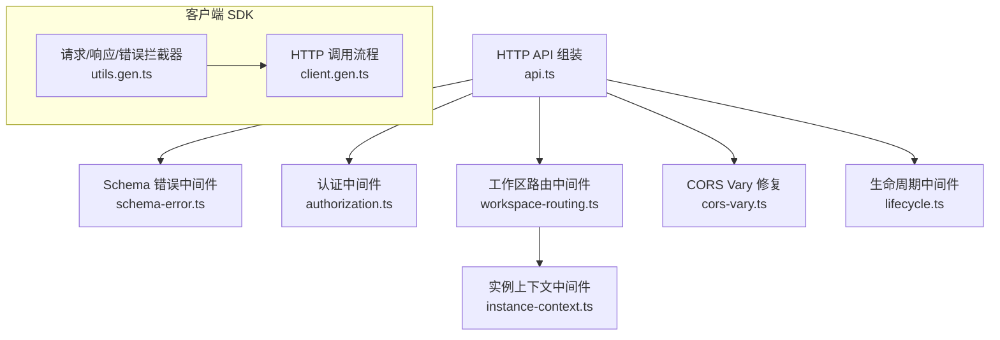
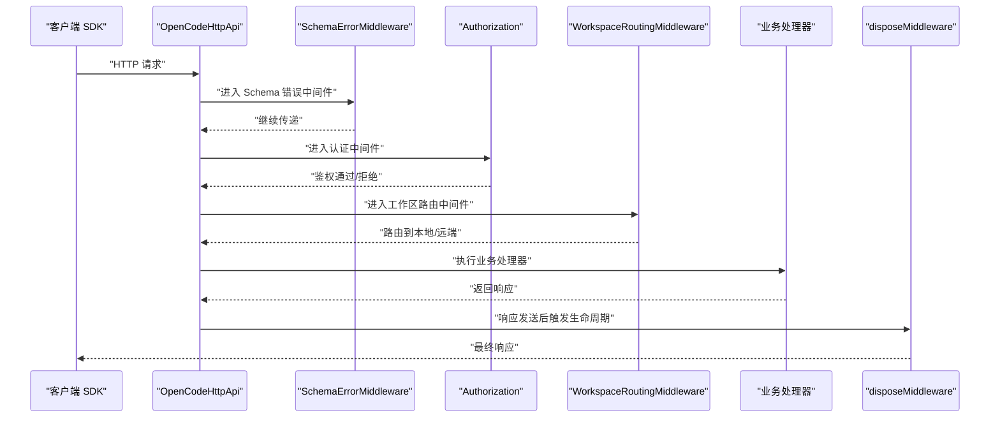
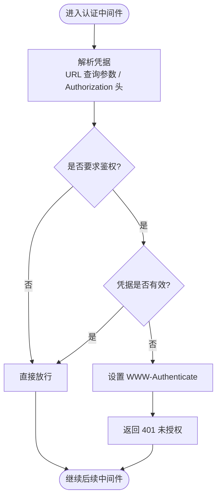
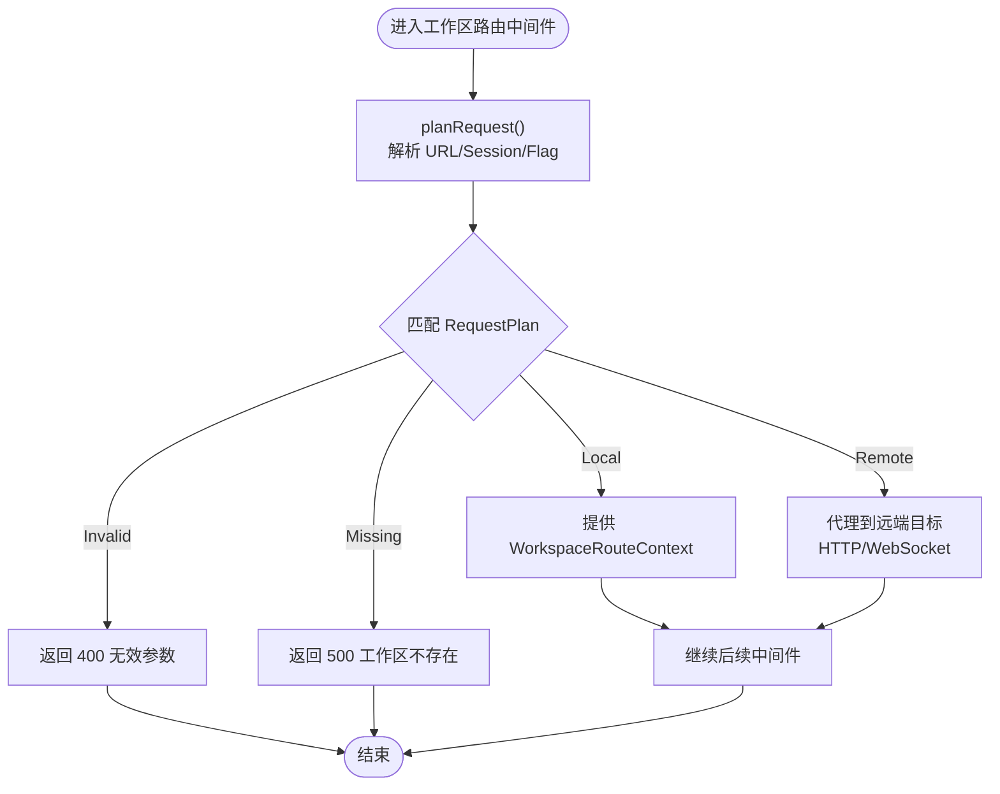
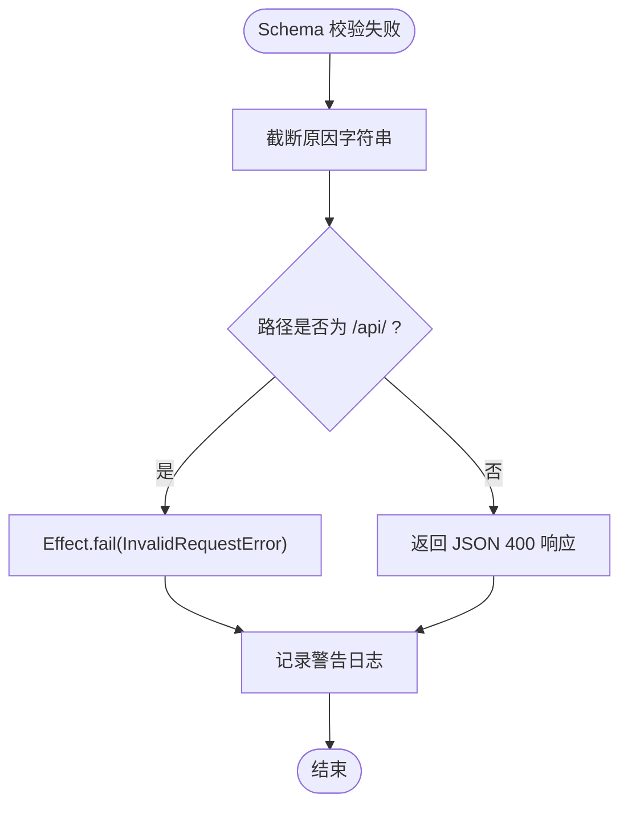
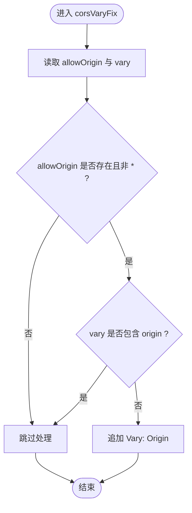
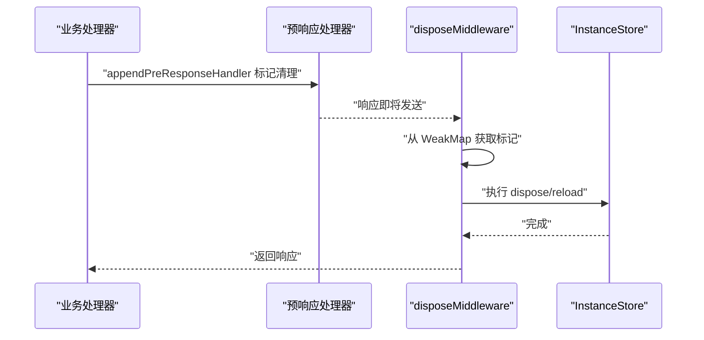
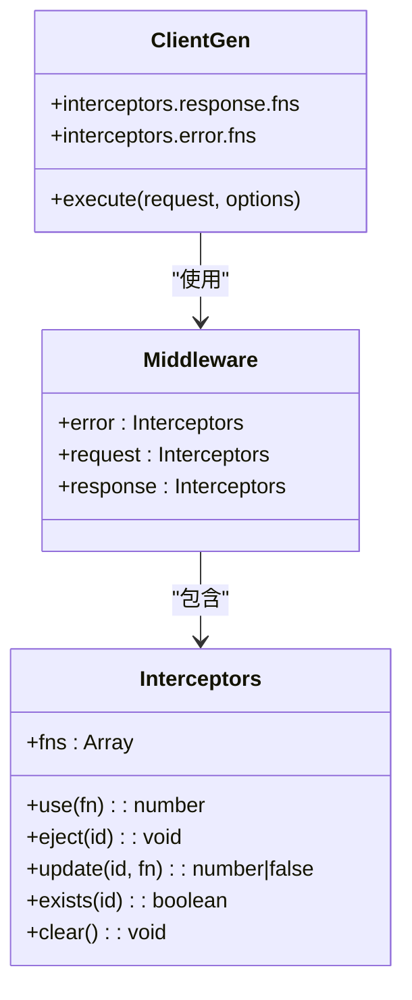
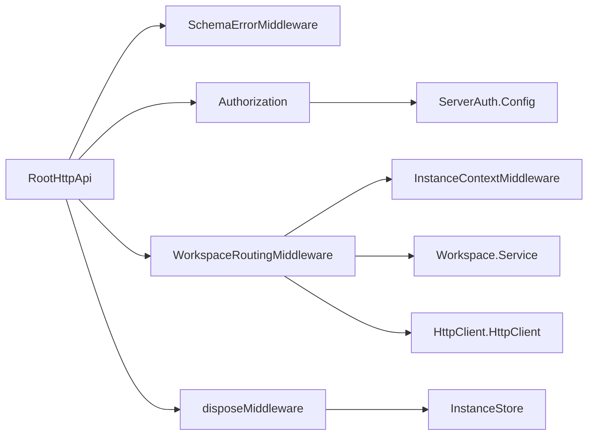

# 中间件扩展点

<cite>
**本文引用的文件**   
- [packages/opencode/src/server/routes/instance/httpapi/api.ts](file://packages/opencode/src/server/routes/instance/httpapi/api.ts)
- [packages/opencode/src/server/routes/instance/httpapi/middleware/authorization.ts](file://packages/opencode/src/server/routes/instance/httpapi/middleware/authorization.ts)
- [packages/opencode/src/server/routes/instance/httpapi/middleware/workspace-routing.ts](file://packages/opencode/src/server/routes/instance/httpapi/middleware/workspace-routing.ts)
- [packages/opencode/src/server/routes/instance/httpapi/middleware/schema-error.ts](file://packages/opencode/src/server/routes/instance/httpapi/middleware/schema-error.ts)
- [packages/opencode/src/server/routes/instance/httpapi/lifecycle.ts](file://packages/opencode/src/server/routes/instance/httpapi/lifecycle.ts)
- [packages/opencode/src/server/routes/instance/httpapi/middleware/cors-vary.ts](file://packages/opencode/src/server/routes/instance/httpapi/middleware/cors-vary.ts)
- [packages/client/src/contract.ts](file://packages/client/src/contract.ts)
- [packages/sdks/js/src/v2/gen/client/utils.gen.ts](file://packages/sdks/js/src/v2/gen/client/utils.gen.ts)
- [packages/sdks/js/src/gen/client/utils.gen.ts](file://packages/sdks/js/src/gen/client/utils.gen.ts)
- [packages/sdks/js/src/v2/gen/client/client.gen.ts](file://packages/sdks/js/src/v2/gen/client/client.gen.ts)
- [packages/plugin/src/v2/promise/registration.ts](file://packages/plugin/src/v2/promise/registration.ts)
</cite>

## 目录
1. [简介](#简介)
2. [项目结构](#项目结构)
3. [核心组件](#核心组件)
4. [架构总览](#架构总览)
5. [详细组件分析](#详细组件分析)
6. [依赖关系分析](#依赖关系分析)
7. [性能考量](#性能考量)
8. [故障排查指南](#故障排查指南)
9. [结论](#结论)
10. [附录](#附录)

## 简介
本文件面向 openNovel（基于 Effect 的 HTTP API 与中间件体系）的中间件扩展点，系统性说明：
- 中间件的注册机制、执行顺序与生命周期管理
- 如何通过中间件拦截请求、处理数据与修改响应
- 配置选项、错误处理策略与性能优化技巧
- 实战示例：路由中间件、认证中间件、数据验证中间件的开发与集成

## 项目结构
openNovel 的中间件主要分布在以下位置：
- 服务端 HTTP API 定义与全局中间件装配：packages/opencode/src/server/routes/instance/httpapi/api.ts
- 具体中间件实现：
  - 认证授权：packages/opencode/src/server/routes/instance/httpapi/middleware/authorization.ts
  - 工作区路由：packages/opencode/src/server/routes/instance/httpapi/middleware/workspace-routing.ts
  - Schema 校验错误转换：packages/opencode/src/server/routes/instance/httpapi/middleware/schema-error.ts
  - CORS Vary 修复：packages/opencode/src/server/routes/instance/httpapi/middleware/cors-vary.ts
- 实例生命周期与后置清理：packages/opencode/src/server/routes/instance/httpapi/lifecycle.ts
- 客户端 SDK 拦截器（请求/响应/错误）：packages/sdks/js/src/v2/gen/client/utils.gen.ts, packages/sdks/js/src/gen/client/utils.gen.ts, packages/sdks/js/src/v2/gen/client/client.gen.ts
- 客户端侧 HttpApiMiddleware 服务注入：packages/client/src/contract.ts
- 插件钩子与资源释放接口：packages/plugin/src/v2/promise/registration.ts

图示来源
- [packages/opencode/src/server/routes/instance/httpapi/api.ts:48-98](file://packages/opencode/src/server/routes/instance/httpapi/api.ts#L48-L98)
- [packages/opencode/src/server/routes/instance/httpapi/middleware/schema-error.ts:1-42](file://packages/opencode/src/server/routes/instance/httpapi/middleware/schema-error.ts#L1-L42)
- [packages/opencode/src/server/routes/instance/httpapi/middleware/authorization.ts:1-151](file://packages/opencode/src/server/routes/instance/httpapi/middleware/authorization.ts#L1-L151)
- [packages/opencode/src/server/routes/instance/httpapi/middleware/workspace-routing.ts:1-251](file://packages/opencode/src/server/routes/instance/httpapi/middleware/workspace-routing.ts#L1-L251)
- [packages/opencode/src/server/routes/instance/httpapi/middleware/cors-vary.ts:1-29](file://packages/opencode/src/server/routes/instance/httpapi/middleware/cors-vary.ts#L1-L29)
- [packages/opencode/src/server/routes/instance/httpapi/lifecycle.ts:1-54](file://packages/opencode/src/server/routes/instance/httpapi/lifecycle.ts#L1-L54)
- [packages/sdks/js/src/v2/gen/client/utils.gen.ts:212-263](file://packages/sdks/js/src/v2/gen/client/utils.gen.ts#L212-L263)
- [packages/sdks/js/src/gen/client/utils.gen.ts:225-277](file://packages/sdks/js/src/gen/client/utils.gen.ts#L225-L277)
- [packages/sdks/js/src/v2/gen/client/client.gen.ts:102-218](file://packages/sdks/js/src/v2/gen/client/client.gen.ts#L102-L218)

章节来源
- [packages/opencode/src/server/routes/instance/httpapi/api.ts:48-98](file://packages/opencode/src/server/routes/instance/httpapi/api.ts#L48-L98)

## 核心组件
- 全局 HTTP API 装配与中间件注册：通过 HttpApi.make 组合多个 Api，并使用 .middleware() 注册全局中间件。
- 认证授权中间件：解析 Basic/Token 凭据，按配置决定是否放行或返回 401。
- 工作区路由中间件：根据 URL 参数与 Session 决定本地/远端路由，必要时代理到远端目标。
- Schema 错误中间件：将 Effect 的 Schema 校验失败转换为统一的 4xx 错误响应。
- CORS Vary 修复：修正预检响应中 Vary 头缺失问题，避免缓存污染。
- 实例生命周期中间件：在响应发送后统一执行实例销毁/重载等收尾逻辑。
- 客户端 SDK 拦截器：提供请求/响应/错误三阶段拦截能力，支持链式注册与移除。

章节来源
- [packages/opencode/src/server/routes/instance/httpapi/api.ts:48-98](file://packages/opencode/src/server/routes/instance/httpapi/api.ts#L48-L98)
- [packages/opencode/src/server/routes/instance/httpapi/middleware/authorization.ts:1-151](file://packages/opencode/src/server/routes/instance/httpapi/middleware/authorization.ts#L1-L151)
- [packages/opencode/src/server/routes/instance/httpapi/middleware/workspace-routing.ts:1-251](file://packages/opencode/src/server/routes/instance/httpapi/middleware/workspace-routing.ts#L1-L251)
- [packages/opencode/src/server/routes/instance/httpapi/middleware/schema-error.ts:1-42](file://packages/opencode/src/server/routes/instance/httpapi/middleware/schema-error.ts#L1-L42)
- [packages/opencode/src/server/routes/instance/httpapi/middleware/cors-vary.ts:1-29](file://packages/opencode/src/server/routes/instance/httpapi/middleware/cors-vary.ts#L1-L29)
- [packages/opencode/src/server/routes/instance/httpapi/lifecycle.ts:1-54](file://packages/opencode/src/server/routes/instance/httpapi/lifecycle.ts#L1-L54)
- [packages/sdks/js/src/v2/gen/client/utils.gen.ts:212-263](file://packages/sdks/js/src/v2/gen/client/utils.gen.ts#L212-L263)
- [packages/sdks/js/src/gen/client/utils.gen.ts:225-277](file://packages/sdks/js/src/gen/client/utils.gen.ts#L225-L277)
- [packages/sdks/js/src/v2/gen/client/client.gen.ts:102-218](file://packages/sdks/js/src/v2/gen/client/client.gen.ts#L102-L218)

## 架构总览
下图展示了从客户端发起请求到服务端中间件链执行的完整流程，以及响应后的生命周期收尾。

图示来源
- [packages/opencode/src/server/routes/instance/httpapi/api.ts:48-98](file://packages/opencode/src/server/routes/instance/httpapi/api.ts#L48-L98)
- [packages/opencode/src/server/routes/instance/httpapi/middleware/schema-error.ts:1-42](file://packages/opencode/src/server/routes/instance/httpapi/middleware/schema-error.ts#L1-L42)
- [packages/opencode/src/server/routes/instance/httpapi/middleware/authorization.ts:1-151](file://packages/opencode/src/server/routes/instance/httpapi/middleware/authorization.ts#L1-L151)
- [packages/opencode/src/server/routes/instance/httpapi/middleware/workspace-routing.ts:1-251](file://packages/opencode/src/server/routes/instance/httpapi/middleware/workspace-routing.ts#L1-L251)
- [packages/opencode/src/server/routes/instance/httpapi/lifecycle.ts:43-54](file://packages/opencode/src/server/routes/instance/httpapi/lifecycle.ts#L43-L54)

## 详细组件分析

### 认证中间件（Authorization）
- 功能要点
  - 支持从 URL 查询参数或 Authorization: Basic 头解析用户名/密码
  - 根据 ServerAuth 配置决定是否强制鉴权
  - 未授权时设置 WWW-Authenticate 并返回 401
  - 提供 Router 级别与 HttpApi 级别的两种中间件形态
- 关键实现
  - 解析凭据：credentialFromURL
  - 校验凭据：validateCredential / validateRawCredential
  - 暴露 Layer：authorizationLayer、ptyConnectAuthorizationLayer

图示来源
- [packages/opencode/src/server/routes/instance/httpapi/middleware/authorization.ts:77-116](file://packages/opencode/src/server/routes/instance/httpapi/middleware/authorization.ts#L77-L116)
- [packages/opencode/src/server/routes/instance/httpapi/middleware/authorization.ts:118-151](file://packages/opencode/src/server/routes/instance/httpapi/middleware/authorization.ts#L118-L151)

章节来源
- [packages/opencode/src/server/routes/instance/httpapi/middleware/authorization.ts:1-151](file://packages/opencode/src/server/routes/instance/httpapi/middleware/authorization.ts#L1-L151)

### 工作区路由中间件（WorkspaceRoutingMiddleware）
- 功能要点
  - 根据 URL 参数 workspace/directory 与 Session 信息决定路由策略
  - 支持本地目录模式与远端代理模式（含 WebSocket 升级）
  - 将 WorkspaceRouteContext 注入下游，供后续中间件使用
- 关键实现
  - planRequest：生成 RequestPlan（Invalid/Missing/Local/Remote）
  - routeWorkspace：匹配计划并执行对应分支
  - routeHttpApiWorkspace：结合 Session 与工作区服务进行决策

图示来源
- [packages/opencode/src/server/routes/instance/httpapi/middleware/workspace-routing.ts:148-210](file://packages/opencode/src/server/routes/instance/httpapi/middleware/workspace-routing.ts#L148-L210)
- [packages/opencode/src/server/routes/instance/httpapi/middleware/workspace-routing.ts:212-251](file://packages/opencode/src/server/routes/instance/httpapi/middleware/workspace-routing.ts#L212-L251)

章节来源
- [packages/opencode/src/server/routes/instance/httpapi/middleware/workspace-routing.ts:1-251](file://packages/opencode/src/server/routes/instance/httpapi/middleware/workspace-routing.ts#L1-L251)

### Schema 错误中间件（SchemaErrorMiddleware）
- 功能要点
  - 将 Effect Schema 校验失败转换为统一的 InvalidRequestError
  - 对原因字符串进行截断，防止大负载泄露与日志膨胀
  - 区分 /api/ 与非 /api/ 路径的错误响应格式
- 关键实现
  - layerSchemaErrorTransform：自定义错误转换逻辑
  - truncateReason：限制 reason 长度

图示来源
- [packages/opencode/src/server/routes/instance/httpapi/middleware/schema-error.ts:1-42](file://packages/opencode/src/server/routes/instance/httpapi/middleware/schema-error.ts#L1-L42)

章节来源
- [packages/opencode/src/server/routes/instance/httpapi/middleware/schema-error.ts:1-42](file://packages/opencode/src/server/routes/instance/httpapi/middleware/schema-error.ts#L1-L42)

### CORS Vary 修复中间件（corsVaryFix）
- 功能要点
  - 动态回显 Origin 时确保 Vary: Origin 存在，避免共享缓存复用错误预检结果
  - 若缺少 Origin 则追加；若已包含则跳过
- 关键实现
  - 读取 access-control-allow-origin 与 vary 头
  - 合并 Vary 值并写回响应头

图示来源
- [packages/opencode/src/server/routes/instance/httpapi/middleware/cors-vary.ts:1-29](file://packages/opencode/src/server/routes/instance/httpapi/middleware/cors-vary.ts#L1-L29)

章节来源
- [packages/opencode/src/server/routes/instance/httpapi/middleware/cors-vary.ts:1-29](file://packages/opencode/src/server/routes/instance/httpapi/middleware/cors-vary.ts#L1-L29)

### 实例生命周期中间件（disposeMiddleware）
- 功能要点
  - 在响应发送后统一执行实例销毁/重载等收尾任务
  - 使用 WeakMap 以原始 Request 对象作为稳定键，跨阶段传递上下文
  - 使用 appendPreResponseHandler 标记需要延迟执行的清理任务
- 关键实现
  - markInstanceForDisposal / markInstanceForReload：注册预响应回调
  - disposeMiddleware：响应后执行桥接清理

图示来源
- [packages/opencode/src/server/routes/instance/httpapi/lifecycle.ts:18-41](file://packages/opencode/src/server/routes/instance/httpapi/lifecycle.ts#L18-L41)
- [packages/opencode/src/server/routes/instance/httpapi/lifecycle.ts:43-54](file://packages/opencode/src/server/routes/instance/httpapi/lifecycle.ts#L43-L54)

章节来源
- [packages/opencode/src/server/routes/instance/httpapi/lifecycle.ts:1-54](file://packages/opencode/src/server/routes/instance/httpapi/lifecycle.ts#L1-L54)

### 客户端 SDK 拦截器（请求/响应/错误）
- 功能要点
  - 提供 request/response/error 三类拦截器，支持 use/eject/update/clear
  - 在 client.gen.ts 中串联执行，支持 throwOnError、responseValidator、responseTransformer
- 关键实现
  - Interceptors 类：维护函数数组与索引管理
  - createInterceptors：创建 Middleware 实例
  - 客户端调用流程：解析响应体、错误处理、拦截器链执行

图示来源
- [packages/sdks/js/src/v2/gen/client/utils.gen.ts:212-263](file://packages/sdks/js/src/v2/gen/client/utils.gen.ts#L212-L263)
- [packages/sdks/js/src/gen/client/utils.gen.ts:225-277](file://packages/sdks/js/src/gen/client/utils.gen.ts#L225-L277)
- [packages/sdks/js/src/v2/gen/client/client.gen.ts:102-218](file://packages/sdks/js/src/v2/gen/client/client.gen.ts#L102-L218)

章节来源
- [packages/sdks/js/src/v2/gen/client/utils.gen.ts:212-263](file://packages/sdks/js/src/v2/gen/client/utils.gen.ts#L212-L263)
- [packages/sdks/js/src/gen/client/utils.gen.ts:225-277](file://packages/sdks/js/src/gen/client/utils.gen.ts#L225-L277)
- [packages/sdks/js/src/v2/gen/client/client.gen.ts:102-218](file://packages/sdks/js/src/v2/gen/client/client.gen.ts#L102-L218)

### 客户端侧 HttpApiMiddleware 服务注入
- 功能要点
  - 通过 HttpApiMiddleware.Service 声明中间件服务 ID
  - 在 contract.ts 中注入 Location/SessionLocation 中间件
- 关键实现
  - Service 类型化与 ID 绑定
  - 与协议层 makeApi 的 locationMiddleware/sessionLocationMiddleware 对接

章节来源
- [packages/client/src/contract.ts:1-20](file://packages/client/src/contract.ts#L1-L20)

### 插件钩子与资源释放
- 功能要点
  - Registration 接口用于插件资源的统一释放
  - Reload 接口用于热重载场景
- 关键实现
  - Hooks<Spec> 泛型封装回调注册与资源回收

章节来源
- [packages/plugin/src/v2/promise/registration.ts:1-11](file://packages/plugin/src/v2/promise/registration.ts#L1-L11)

## 依赖关系分析
- 中间件装配顺序
  - RootHttpApi 与 InstanceHttpApi 通过 .middleware() 注册全局中间件
  - 典型顺序：SchemaError -> Authorization -> WorkspaceRouting -> 业务处理器
- 依赖注入
  - 工作区路由依赖 Workspace.Service、HttpClient、Session
  - 认证依赖 ServerAuth.Config
  - 生命周期依赖 InstanceStore、EffectBridge
- 客户端与服务端协作
  - 客户端 SDK 拦截器与服务端中间件共同保障请求/响应的可观测性与一致性

图示来源
- [packages/opencode/src/server/routes/instance/httpapi/api.ts:48-98](file://packages/opencode/src/server/routes/instance/httpapi/api.ts#L48-L98)
- [packages/opencode/src/server/routes/instance/httpapi/middleware/workspace-routing.ts:237-251](file://packages/opencode/src/server/routes/instance/httpapi/middleware/workspace-routing.ts#L237-L251)
- [packages/opencode/src/server/routes/instance/httpapi/lifecycle.ts:43-54](file://packages/opencode/src/server/routes/instance/httpapi/lifecycle.ts#L43-L54)

章节来源
- [packages/opencode/src/server/routes/instance/httpapi/api.ts:48-98](file://packages/opencode/src/server/routes/instance/httpapi/api.ts#L48-L98)

## 性能考量
- 错误响应体积控制
  - SchemaErrorMiddleware 对 reason 进行截断，避免大负载泄露与日志膨胀
- 预检缓存安全
  - corsVaryFix 确保 Vary: Origin 正确设置，避免跨源缓存污染
- 生命周期清理
  - 使用 appendPreResponseHandler 与 WeakMap 保证响应发送后再执行清理，减少阻塞
- 客户端拦截器开销
  - 合理组织拦截器链，避免过多同步/异步操作；按需 eject/update 减少无用计算

[本节为通用指导，不直接分析具体文件]

## 故障排查指南
- 常见问题
  - 401 未授权：检查 ServerAuth.Config 是否启用、Authorization 头或 auth_token 是否正确
  - 400 参数错误：确认 workspace/directory 参数是否符合 Schema；查看 SchemaErrorMiddleware 日志
  - 503 同步失败：检查远端工作区同步状态与 Fence 等待逻辑
  - 缓存异常：确认 CORS Vary 头是否正确设置
- 定位方法
  - 开启 Effect 日志，关注 schema rejection、instance disposal failed 等告警
  - 使用客户端 SDK 的 interceptors.error 收集错误上下文
  - 通过 WeakMap 标记的生命周期钩子检查 dispose/reload 执行情况

章节来源
- [packages/opencode/src/server/routes/instance/httpapi/middleware/schema-error.ts:25-41](file://packages/opencode/src/server/routes/instance/httpapi/middleware/schema-error.ts#L25-L41)
- [packages/opencode/src/server/routes/instance/httpapi/lifecycle.ts:43-54](file://packages/opencode/src/server/routes/instance/httpapi/lifecycle.ts#L43-L54)
- [packages/sdks/js/src/v2/gen/client/client.gen.ts:102-218](file://packages/sdks/js/src/v2/gen/client/client.gen.ts#L102-L218)

## 结论
openNovel 的中间件体系基于 Effect 的 HttpRouter/HttpApi 与 Layer 机制，提供了高内聚、低耦合的可插拔扩展点。通过清晰的注册顺序、严格的错误处理与完善的生命周期管理，开发者可以便捷地实现认证、路由、校验、CORS、清理等横切关注点。客户端 SDK 的拦截器进一步增强了端到端的可观测性与可控性。

[本节为总结性内容，不直接分析具体文件]

## 附录

### 中间件开发最佳实践
- 明确职责边界：每个中间件只负责单一关注点（如认证、路由、校验）
- 使用 Layer 封装：便于测试与组合，避免隐式依赖
- 错误标准化：统一错误类型与响应格式，便于客户端处理
- 性能优先：避免在中间件中执行重型计算；必要时使用异步与缓存
- 安全性：对敏感信息进行脱敏与最小化输出

### 实战示例（概念性步骤）
- 路由中间件
  - 定义 HttpApiMiddleware.Service，解析 URL 参数并注入 Context
  - 在 api.ts 中使用 .middleware() 注册
- 认证中间件
  - 解析 Authorization 头或查询参数
  - 根据配置决定是否放行或返回 401
- 数据验证中间件
  - 使用 Schema 校验输入参数
  - 将校验失败转换为统一错误响应

[本节为概念性指导，不直接分析具体文件]