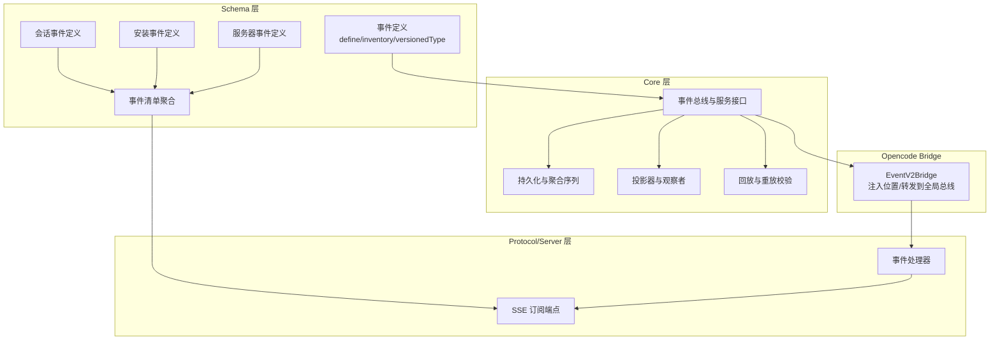
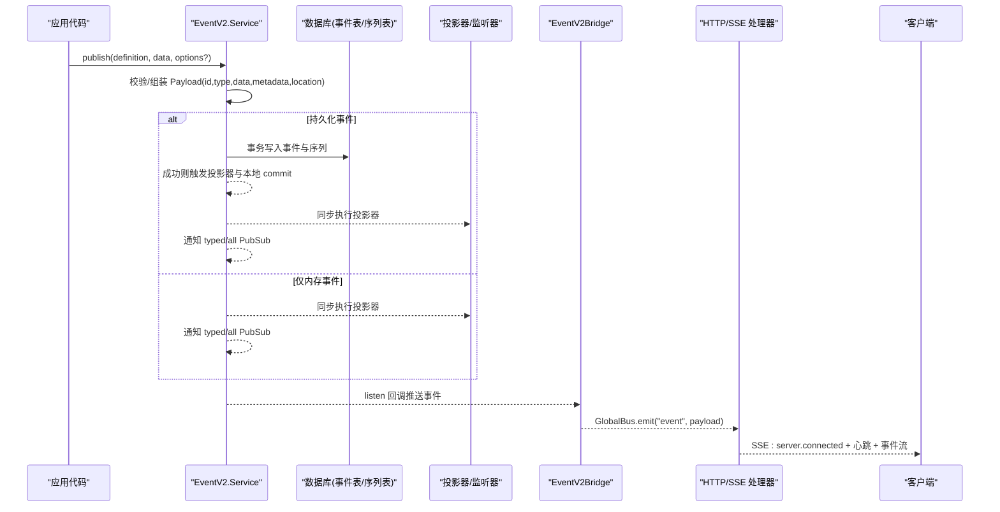
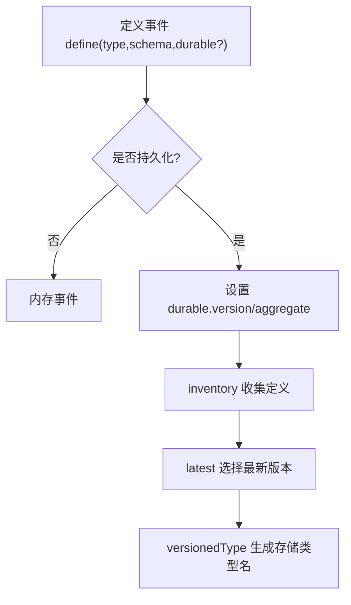
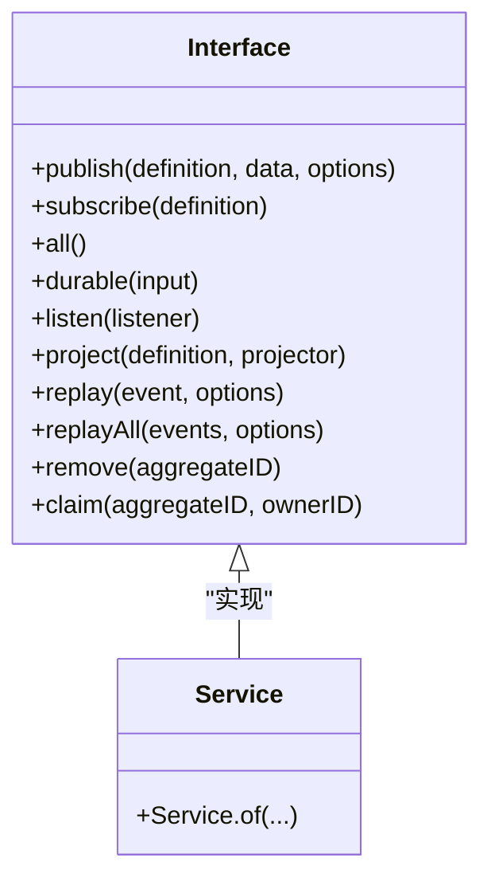
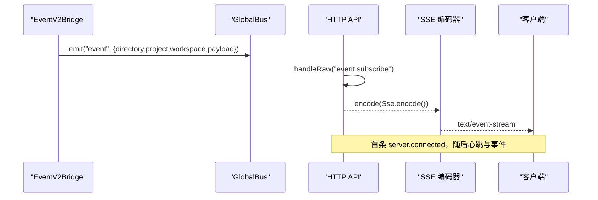
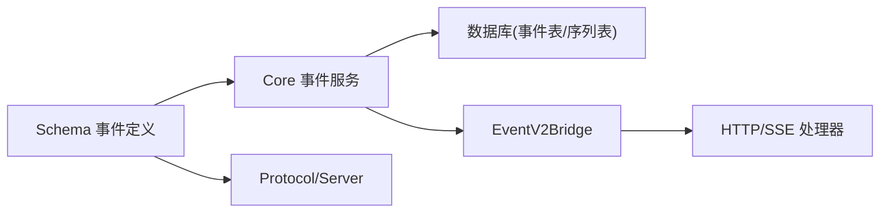

# 事件订阅扩展点

<cite>
**本文引用的文件**   
- [packages/core/src/event.ts](file://packages/core/src/event.ts)
- [packages/schema/src/event.ts](file://packages/schema/src/event.ts)
- [packages/opencode/src/event-v2-bridge.ts](file://packages/opencode/src/event-v2-bridge.ts)
- [packages/protocol/src/groups/event.ts](file://packages/protocol/src/groups/event.ts)
- [packages/server/src/handlers/event.ts](file://packages/server/src/handlers/event.ts)
- [packages/opencode/src/server/routes/instance/httpapi/handlers/event.ts](file://packages/opencode/src/server/routes/instance/httpapi/handlers/event.ts)
- [packages/schema/src/session-event.ts](file://packages/schema/src/session-event.ts)
- [packages/schema/src/installation-event.ts](file://packages/schema/src/installation-event.ts)
- [packages/schema/src/server-event.ts](file://packages/schema/src/server-event.ts)
- [packages/schema/src/event-manifest.ts](file://packages/schema/src/event-manifest.ts)
- [packages/core/test/event.test.ts](file://packages/core/test/event.test.ts)
</cite>

## 目录
1. [简介](#简介)
2. [项目结构](#项目结构)
3. [核心组件](#核心组件)
4. [架构总览](#架构总览)
5. [详细组件分析](#详细组件分析)
6. [依赖关系分析](#依赖关系分析)
7. [性能与可靠性](#性能与可靠性)
8. [故障排查指南](#故障排查指南)
9. [结论](#结论)
10. [附录：事件定义与使用示例](#附录事件定义与使用示例)

## 简介
本文件为 openNovel 的事件订阅扩展点提供系统化文档，覆盖事件的定义、发布、订阅机制，以及自定义事件创建、监听器注册、异步处理、生命周期、错误处理与重试策略。同时给出面向用户操作、数据变更、系统状态三类场景的实践示例，帮助读者快速构建可靠的事件驱动架构。

## 项目结构
openNovel 的事件系统由“事件定义层（schema）”、“事件内核（core）”、“协议与HTTP暴露（protocol/server）”和“运行时桥接（opencode bridge）”组成：
- schema 层负责事件类型、数据结构与版本化声明，并提供 inventory/latest/durable 等工具。
- core 层实现事件总线、持久化（聚合序列）、投影器、回放与流式订阅。
- protocol/server 层通过 HTTP API 暴露 SSE 事件流。
- opencode bridge 将 core 事件桥接到全局总线，并自动注入位置信息（目录/工作区/项目）。

图表来源
- [packages/schema/src/event.ts:1-126](file://packages/schema/src/event.ts#L1-L126)
- [packages/schema/src/event-manifest.ts:34-61](file://packages/schema/src/event-manifest.ts#L34-L61)
- [packages/core/src/event.ts:150-639](file://packages/core/src/event.ts#L150-L639)
- [packages/protocol/src/groups/event.ts:29-56](file://packages/protocol/src/groups/event.ts#L29-L56)
- [packages/opencode/src/event-v2-bridge.ts:14-69](file://packages/opencode/src/event-v2-bridge.ts#L14-L69)

章节来源
- [packages/schema/src/event.ts:1-126](file://packages/schema/src/event.ts#L1-L126)
- [packages/schema/src/event-manifest.ts:34-61](file://packages/schema/src/event-manifest.ts#L34-L61)
- [packages/core/src/event.ts:150-639](file://packages/core/src/event.ts#L150-L639)
- [packages/protocol/src/groups/event.ts:29-56](file://packages/protocol/src/groups/event.ts#L29-L56)
- [packages/opencode/src/event-v2-bridge.ts:14-69](file://packages/opencode/src/event-v2-bridge.ts#L14-L69)

## 核心组件
- 事件定义与版本化
  - 使用 define 声明事件类型与数据结构；支持 durable 版本化与聚合字段映射。
  - inventory 冻结事件集合；latest 选择最新版本；versionedType 生成带版本号的类型名。
- 事件服务与接口
  - publish：发布事件（可携带 metadata、location、commit 钩子）。
  - subscribe/streamAll：按类型或全部事件订阅流。
  - durable：基于聚合的持久化事件流（历史+实时）。
  - project/listen：投影器与监听器注册。
  - replay/replayAll/remove/claim：回放、批量回放、清理与所有权围栏。
- 持久化与一致性
  - 事务写入事件表与序列表，保证顺序与幂等；支持 ownerID 围栏与严格模式。
- 通知与隔离
  - 先执行投影器，再通知监听器与 PubSub；对持久化后的观察者进行异常隔离。
- 桥接与HTTP暴露
  - EventV2Bridge 自动注入 Location 信息并转发到全局总线。
  - Protocol/Server 暴露 /api/event SSE 端点，首条 server.connected，随后心跳与事件。

章节来源
- [packages/schema/src/event.ts:1-126](file://packages/schema/src/event.ts#L1-L126)
- [packages/core/src/event.ts:115-148](file://packages/core/src/event.ts#L115-L148)
- [packages/core/src/event.ts:170-639](file://packages/core/src/event.ts#L170-L639)
- [packages/opencode/src/event-v2-bridge.ts:14-69](file://packages/opencode/src/event-v2-bridge.ts#L14-L69)
- [packages/protocol/src/groups/event.ts:29-56](file://packages/protocol/src/groups/event.ts#L29-L56)
- [packages/server/src/handlers/event.ts:20-52](file://packages/server/src/handlers/event.ts#L20-L52)

## 架构总览
下图展示一次事件从发布到客户端接收的完整调用链，包括持久化、投影、广播与 SSE 输出。

图表来源
- [packages/core/src/event.ts:369-439](file://packages/core/src/event.ts#L369-L439)
- [packages/core/src/event.ts:406-417](file://packages/core/src/event.ts#L406-L417)
- [packages/opencode/src/event-v2-bridge.ts:35-62](file://packages/opencode/src/event-v2-bridge.ts#L35-L62)
- [packages/server/src/handlers/event.ts:20-52](file://packages/server/src/handlers/event.ts#L20-L52)

## 详细组件分析

### 事件定义与版本化（Schema）
- 定义事件：使用 define 指定 type 与 schema；可选 durable.version 与 durable.aggregate 字段名。
- 版本管理：latest 根据版本号选择最新定义；versionedType 生成带版本号的类型名用于存储。
- 清单聚合：inventory 冻结集合；event-manifest 汇总各模块事件，形成 ServerDefinitions 供协议层使用。

图表来源
- [packages/schema/src/event.ts:42-96](file://packages/schema/src/event.ts#L42-L96)
- [packages/schema/src/event-manifest.ts:34-61](file://packages/schema/src/event-manifest.ts#L34-L61)

章节来源
- [packages/schema/src/event.ts:1-126](file://packages/schema/src/event.ts#L1-L126)
- [packages/schema/src/event-manifest.ts:34-61](file://packages/schema/src/event-manifest.ts#L34-L61)

### 事件服务与发布/订阅（Core）
- publish：组装 Payload，若为持久化事件则进入事务提交流程；否则直接通知。
- notify：先执行投影器，再向 typed/all PubSub 广播；对持久化后的观察者进行异常隔离。
- subscribe/streamAll：返回 Stream，支持类型化与通配订阅。
- durable：基于聚合 ID 拉取历史事件并尾随新事件，内部使用滑动唤醒合并。
- project/listen：注册投影器与监听器；projector 在持久化后同步执行，listener 在之后执行。
- replay/replayAll：回放外部事件，校验序列与聚合一致性，支持 ownerID 围栏与 strictOwner。
- remove/claim：清理聚合事件与设置所有者。

图表来源
- [packages/core/src/event.ts:126-148](file://packages/core/src/event.ts#L126-L148)
- [packages/core/src/event.ts:170-639](file://packages/core/src/event.ts#L170-L639)

章节来源
- [packages/core/src/event.ts:170-639](file://packages/core/src/event.ts#L170-L639)

### 桥接与HTTP暴露（Bridge/Protocol/Server）
- EventV2Bridge：若无 location 则从上下文注入 directory/workspace/project；将事件推送到全局总线，并额外发送 sync 事件包含 durable 元数据。
- Protocol：定义 OpenAPI Schema 与 SSE 端点 /api/event，首条 server.connected。
- Server Handler：构造连接事件、合并心跳、编码 SSE 文本流。

图表来源
- [packages/opencode/src/event-v2-bridge.ts:19-62](file://packages/opencode/src/event-v2-bridge.ts#L19-L62)
- [packages/protocol/src/groups/event.ts:29-56](file://packages/protocol/src/groups/event.ts#L29-L56)
- [packages/server/src/handlers/event.ts:20-52](file://packages/server/src/handlers/event.ts#L20-L52)

章节来源
- [packages/opencode/src/event-v2-bridge.ts:14-69](file://packages/opencode/src/event-v2-bridge.ts#L14-L69)
- [packages/protocol/src/groups/event.ts:29-56](file://packages/protocol/src/groups/event.ts#L29-L56)
- [packages/server/src/handlers/event.ts:20-52](file://packages/server/src/handlers/event.ts#L20-L52)

### 错误处理与重试机制
- 观察者异常隔离：持久化后的观察者失败会被捕获并记录日志，不影响其他观察者与后续事件。
- 非持久化事件监听器缺陷：fail-fast，直接传播给调用方。
- 本地 commit 钩子：仅在持久化事件中可用；失败会回滚整个事务（事件与投影均不生效）。
- 回放校验：序列不匹配、未知事件类型、聚合不一致都会抛出 InvalidDurableEventError。
- SSE 客户端重试：SDK 解析 retry 字段以控制重连延迟。

章节来源
- [packages/core/src/event.ts:398-417](file://packages/core/src/event.ts#L398-L417)
- [packages/core/src/event.ts:441-512](file://packages/core/src/event.ts#L441-L512)
- [packages/sdk/js/src/v2/gen/core/serverSentEvents.gen.ts:157-196](file://packages/sdk/js/src/v2/gen/core/serverSentEvents.gen.ts#L157-L196)

### 事件生命周期
- 发布阶段：组装 Payload，持久化事件进入事务；非持久化事件直接进入通知。
- 投影阶段：投影器同步执行，确保投影结果与事件一致。
- 通知阶段：typed/all PubSub 广播；监听器按注册顺序执行。
- 持久化阶段：写入事件表与序列表，更新 owner_id（必要时），唤醒聚合订阅者。
- 回放阶段：校验序列与聚合，解码数据，执行投影器，可选择发布到流。

章节来源
- [packages/core/src/event.ts:369-439](file://packages/core/src/event.ts#L369-L439)
- [packages/core/src/event.ts:514-532](file://packages/core/src/event.ts#L514-L532)
- [packages/core/src/event.ts:585-604](file://packages/core/src/event.ts#L585-L604)

## 依赖关系分析
- schema → core：core 依赖 schema 的 define/inventory/versionedType 与 Durable 清单。
- core → database：持久化依赖 Drizzle ORM 与事件表/序列表。
- core → protocol/server：协议层依赖 schema 的事件清单生成 OpenAPI 与 SSE Schema。
- opencode → core：bridge 依赖 core 的事件服务与 Location 上下文。

图表来源
- [packages/schema/src/event.ts:1-126](file://packages/schema/src/event.ts#L1-L126)
- [packages/core/src/event.ts:170-639](file://packages/core/src/event.ts#L170-L639)
- [packages/protocol/src/groups/event.ts:29-56](file://packages/protocol/src/groups/event.ts#L29-L56)
- [packages/opencode/src/event-v2-bridge.ts:14-69](file://packages/opencode/src/event-v2-bridge.ts#L14-L69)

章节来源
- [packages/schema/src/event.ts:1-126](file://packages/schema/src/event.ts#L1-L126)
- [packages/core/src/event.ts:170-639](file://packages/core/src/event.ts#L170-L639)
- [packages/protocol/src/groups/event.ts:29-56](file://packages/protocol/src/groups/event.ts#L29-L56)
- [packages/opencode/src/event-v2-bridge.ts:14-69](file://packages/opencode/src/event-v2-bridge.ts#L14-L69)

## 性能与可靠性
- 背压与限流：allBounded 使用 dropping Queue，容量不足时抛出 SubscriberOverflowError，避免阻塞发布者。
- 聚合唤醒合并：durable 订阅使用滑动 PubSub 合并多次唤醒，减少重复读取。
- 事务一致性：持久化事件与投影器在同一事务内执行，commit 钩子失败会回滚。
- 观察者隔离：持久化后的观察者异常被捕获，不影响其他观察者与后续事件。
- SSE 心跳：服务端周期性发送心跳，保持连接活跃。

章节来源
- [packages/core/src/event.ts:152-164](file://packages/core/src/event.ts#L152-L164)
- [packages/core/src/event.ts:565-604](file://packages/core/src/event.ts#L565-L604)
- [packages/core/src/event.ts:398-417](file://packages/core/src/event.ts#L398-L417)
- [packages/server/src/handlers/event.ts:37-40](file://packages/server/src/handlers/event.ts#L37-L40)

## 故障排查指南
- 常见问题定位
  - 事件未到达订阅者：检查是否使用正确的 definition 订阅；确认 location 注入是否正确。
  - 回放失败：检查序列连续性、聚合一致性、ownerID 围栏与 strictOwner 配置。
  - 观察者崩溃：查看日志中的“Event listener failed”，区分持久化前后观察者的行为差异。
  - SSE 断线：检查客户端 retry 配置与服务端心跳是否正常。
- 调试建议
  - 使用 all() 通配订阅捕获所有事件，逐步缩小范围。
  - 使用 durable({ aggregateID, after }) 验证历史与实时衔接。
  - 在 project 中插入轻量级落盘或日志，辅助定位投影逻辑问题。

章节来源
- [packages/core/src/event.ts:398-417](file://packages/core/src/event.ts#L398-L417)
- [packages/core/src/event.ts:441-512](file://packages/core/src/event.ts#L441-L512)
- [packages/server/src/handlers/event.ts:20-52](file://packages/server/src/handlers/event.ts#L20-L52)

## 结论
openNovel 的事件系统以 schema 为中心定义事件，core 提供高可靠、可回放、可扩展的事件总线，并通过 bridge 与 HTTP/SSE 暴露给客户端。其设计兼顾了实时性与持久性，支持版本化、聚合一致性、观察者隔离与背压控制，适合构建复杂的事件驱动架构。

## 附录：事件定义与使用示例

### 如何创建自定义事件
- 在 schema 层使用 define 声明事件类型与数据结构，可选 durable.version/aggregate。
- 将事件加入 inventory，并在 event-manifest 中聚合以便协议层使用。

章节来源
- [packages/schema/src/event.ts:42-96](file://packages/schema/src/event.ts#L42-L96)
- [packages/schema/src/event-manifest.ts:34-61](file://packages/schema/src/event-manifest.ts#L34-L61)

### 如何发布与订阅事件
- 发布：调用 EventV2.Service.publish(definition, data, options?)，可携带 id/metadata/location/commit。
- 订阅：使用 subscribe(definition) 获取类型化流，或使用 all() 获取全量流。
- 持久化订阅：使用 durable({ aggregateID, after? }) 拉取历史并尾随新事件。

章节来源
- [packages/core/src/event.ts:419-439](file://packages/core/src/event.ts#L419-L439)
- [packages/core/src/event.ts:534-539](file://packages/core/src/event.ts#L534-L539)
- [packages/core/src/event.ts:585-604](file://packages/core/src/event.ts#L585-L604)

### 如何注册监听器与处理异步事件
- 使用 listen(listener) 注册监听器，返回取消函数。
- 使用 project(definition, projector) 注册投影器，在持久化后同步执行。
- 对于异步处理，建议在投影器或监听器中使用 Effect 编排异步任务。

章节来源
- [packages/core/src/event.ts:606-620](file://packages/core/src/event.ts#L606-L620)

### 事件生命周期与错误处理
- 发布→投影→通知→持久化→回放，每个阶段均有明确错误处理与隔离策略。
- 本地 commit 钩子失败会回滚；观察者异常被捕获并记录日志。

章节来源
- [packages/core/src/event.ts:369-439](file://packages/core/src/event.ts#L369-L439)
- [packages/core/src/event.ts:398-417](file://packages/core/src/event.ts#L398-L417)

### 实际应用示例
- 用户操作事件：如 session.next.prompted、session.next.step.started，用于追踪用户输入与步骤开始。
- 数据变更事件：如 installation.updated、project.directories.updated，用于反映系统配置与资源变化。
- 系统状态事件：如 server.connected、server.heartbeat，用于连接管理与心跳检测。

章节来源
- [packages/schema/src/session-event.ts:87-121](file://packages/schema/src/session-event.ts#L87-L121)
- [packages/schema/src/installation-event.ts:6-18](file://packages/schema/src/installation-event.ts#L6-L18)
- [packages/schema/src/server-event.ts:5-6](file://packages/schema/src/server-event.ts#L5-L6)
- [packages/server/src/handlers/event.ts:25-36](file://packages/server/src/handlers/event.ts#L25-L36)

### 测试与验证参考
- 发布与订阅、投影器顺序、持久化一致性、回放校验、背压与异常隔离等用例可在测试文件中参考。

章节来源
- [packages/core/test/event.test.ts:86-124](file://packages/core/test/event.test.ts#L86-L124)
- [packages/core/test/event.test.ts:157-214](file://packages/core/test/event.test.ts#L157-L214)
- [packages/core/test/event.test.ts:323-381](file://packages/core/test/event.test.ts#L323-L381)
- [packages/core/test/event.test.ts:422-505](file://packages/core/test/event.test.ts#L422-L505)
- [packages/core/test/event.test.ts:540-632](file://packages/core/test/event.test.ts#L540-L632)
- [packages/core/test/event.test.ts:776-800](file://packages/core/test/event.test.ts#L776-L800)